### linux

#### 有没有遇到过cpu不高但是内存高的场景？怎么排查的

在实际开发中，遇到 CPU 使用率不高但内存占用很高的情况并不少见。这种现象通常表明程序中存在**内存泄漏、内存占用过大、或者内存管理不当**的问题。下面是一个排查的步骤：

检查内存占用情况

- **工具：**`top`**, **`htop`**, **`ps`使用这些系统工具查看内存占用较高的进程，确认是否是你的 Go 程序导致的内存消耗。

  > 查询所有监听端口    netstat -tulnp 或 ss -tulnp
  > 查询某端口占用    lsof -i :8080
  > CPU 使用情况    top 或 htop
  > 进程 CPU 排序    `ps aux --sort=-%cpu`
  > 进程内存排序    ps aux --sort=-%mem
  > 内存使用情况    free -h
  > 磁盘使用情况    df -h
  > 查询进程    `ps aux`
  > 监控磁盘 I/O    iostat -x 1 5

- `pmap`使用 `pmap <PID>` 查看进程的内存分布，确定是哪个内存段占用最大（如 heap、stack）

### 计算机网络


##### 1.七层网络体系结构各层的主要功能

- 应用层：为应用程序提供交互服务。在互联网中的应用层协议很多，如域名系统DNS，支持万维网应用的HTTP协议，支持电子邮件的SMTP协议等。
- 表示层：主要负责数据格式的转换，如加密解密、转换翻译、压缩解压缩等。
- 会话层：负责在网络中的两节点之间建立、维持和终止通信，如服务器验证用户登录便是由会话层完成的。
- 运输层：有时也译为传输层，向主机进程提供通用的数据传输服务。该层主要有以下两种协议：
  - TCP：提供面向连接的、可靠的数据传输服务；
  - UDP：提供无连接的、尽最大努力的数据传输服务，但不保证数据传输的可靠性。
- 网络层：选择合适的路由和交换结点，确保数据及时传送。主要包括IP协议。
- 数据链路层：数据链路层通常简称为链路层。将网络层传下来的IP数据包组装成帧，并再相邻节点的链路上传送帧。
- `物理层`：实现相邻节点间比特流的透明传输，尽可能屏蔽传输介质和通信手段的差异。

**网络分层的原因**：易于**实现和维护**，因为各层之间是独立的，层与层之间不会收到影响。有利于**标准化的制定**

TCP协议格式


- 为什么要协商最大报文段长度MSS？

> 防止报文过大，在网络当中传输的时候，数据丢失导致重传。(**为了不让其频繁的重传**)

16位窗口大小：告知消息发送方，自己对消息的接收能力时多少，**这个值是动态变化的。**

MSS（Maximum Segment Size，最大报文长度），MSS=MTU-20字节TCP报头-20字节IP报头=1460字节，MTU，Maximum Transmission Unit,最大传输单元，以太网的贞最小为64字节，最大为1518字节。除去14字节头部和4字节 CRC字段，**最小的有效载荷为46字节，最大的有效载荷为1500字节**这个值就是`MTU`。就是说传输100KB的数据，至少需要发送69次以太网的贞。

##### 2.TCP和UDP的区别？

|              | UDP                                        | TCP                                              |
| ------------ | ------------------------------------------ | ------------------------------------------------ |
| 是否连接     | 无连接                                     | 面向连接                                         |
| 是否可靠     | 不可靠传输，不使用流量控制和拥塞控制       | 可靠传输，使用流量控制和拥塞控制                 |
| 是否有序     | 无序                                       | 有序，消息在传输过程中可能会乱序，TCP 会重新排序 |
| 传输速度     | 快                                         | 慢                                               |
| 连接对象个数 | 支持一对一，一对多，多对一和多对多交互通信 | 只能是一对一通信                                 |
| 传输方式     | 面向报文                                   | 面向字节流                                       |
| 首部开销     | 首部开销小，仅8字节                        | 首部最小20字节，最大60字节                       |
| 适用场景     | 适用于实时应用（IP电话、视频会议、直播等） | 适用于要求可靠传输的应用，例如文件传输           |

TCP 用于在传输层有必要实现可靠传输的情况，UDP 用于对高速传输和实时性有较高要求的通信。TCP 和 UDP 应该根据应用目的按需使用。

TCP 经常用于：

- FTP文件传输
- HTTP / HTTPS

UDP 面向无连接，它可以随时发送数据，再加上UDP本身的处理既简单又高效，经常用于：

- 包总量较少的通信，如 DNS 、SNMP等
- 视频、音频等多媒体通信
- 广播通信

##### 3.TCP三次握手机制

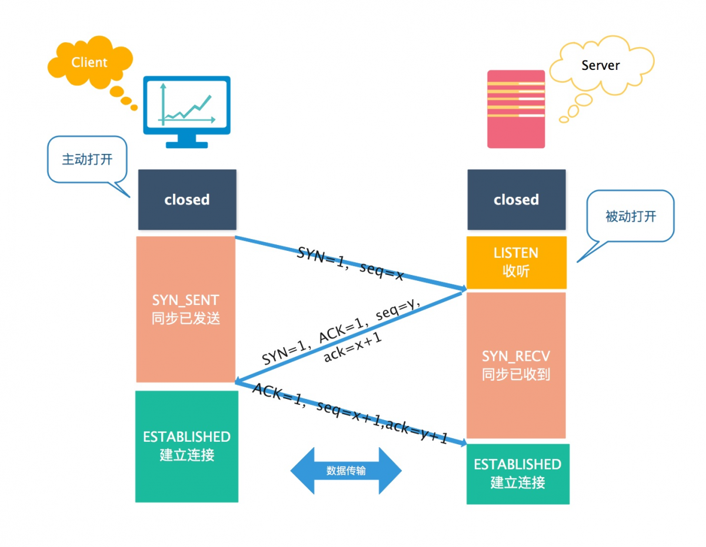

第一次握手：客户端Client发送位码为SYN＝1，随机产生seq=x的数据包到服务器，服务器Server由SYN=1知道，客户端Client要求建立联机；

第二次握手：服务器Server收到请求后要确认联机信息，向客户端Client发送ack=(客户端Client请求连接时的seq)+1，SYN=1，ACK=1，产生seq=y的包,代表接收到连接请求并且向客户端再次确认；

第三次握手：客户端Client收到后检查ack是否正确，即第一次发送的seq+1，以及位码ACK是否为1，代表收到了服务器端发过来的确认信息。之后客户端Client会再向服务器发送ack=(服务器Server的seq+1)，ACK=1，服务器Server收到后确认ack 值与ACK=1，连接建立成功。**第三次握手是可以携带数据的，前两次握手是不可以携带数据的**

`netstat -napt` linux中查看tcp状态

> 在 TCP 三次握手的过程中，Linux 内核会维护两个队列，分别是：
>
> - 半连接队列 (SYN Queue)
> - 全连接队列 (Accept Queue)
>
> 正常的 TCP 三次握手过程：
>
> 1、Client 端向 Server 端发送 SYN 发起握手，Client 端进入 SYN_SENT 状态
>
> 2、Server 端收到 Client 端的 SYN 请求后，Server 端进入 SYN_RECV 状态，此时内核会**将连接存储到半连接队列(SYN Queue)**，并向 Client 端回复 SYN+ACK
>
> 3、Client 端收到 Server 端的 SYN+ACK 后，Client 端回复 ACK 并进入 ESTABLISHED 状态
>
> 4、Server 端收到 Client 端的 ACK 后，内核**将连接从半连接队列(SYN Queue)中取出，添加到全连接队列(Accept Queue)**，Server 端进入 ESTABLISHED 状态
>
> 5、Server 端应用进程**调用 accept 函数时，将连接从全连接队列(Accept Queue)中取出**
>
> 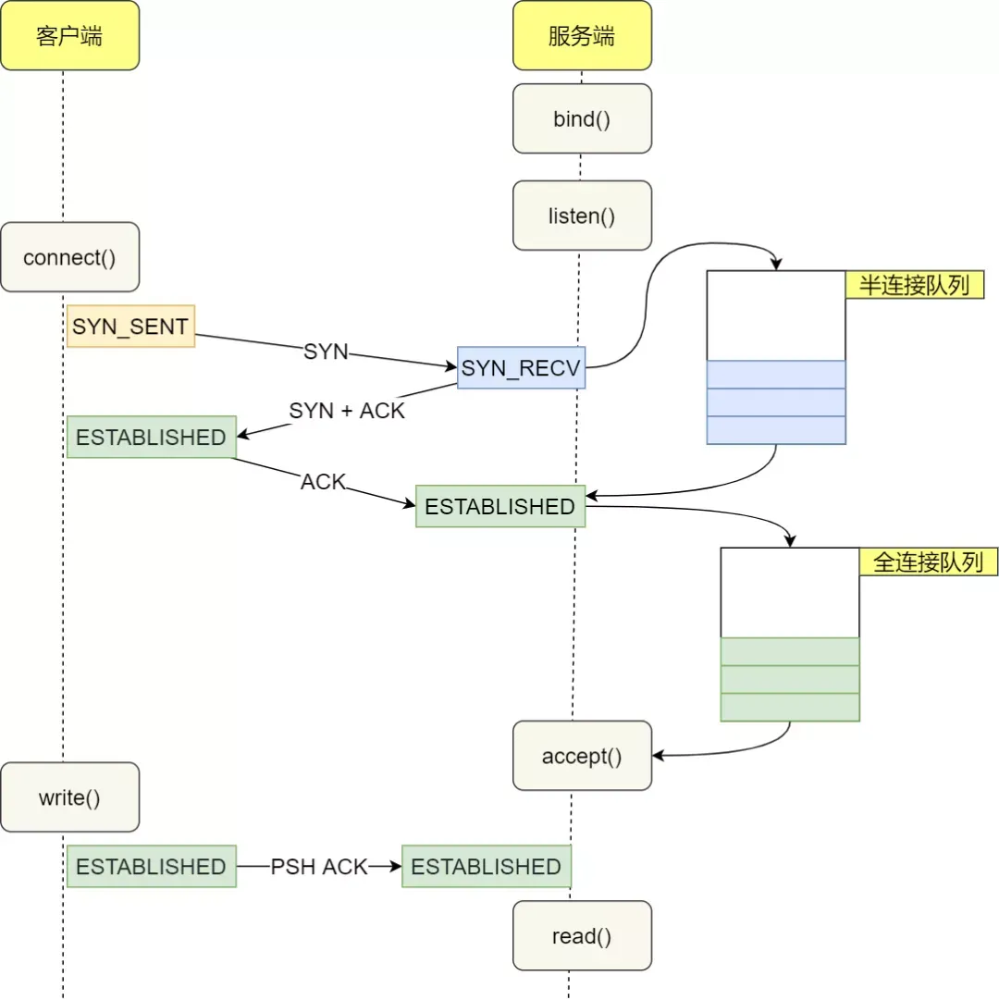

**针对TCP连接的安全问题：SYN攻击**

- 危害：SYN攻击属于DOS攻击的一种，它利用TCP协议缺陷，通过发送大量的半连接请求，耗费CPU和内存资源。SYN攻击除了能影响主机外，还可以危害路由器、防火墙等网络系统，事实上SYN攻击并不管目标是什么系统，只要这些系统打开TCP服务就可以实施。
- 原理：在**三次握手过程中**，**服务器发送SYN-ACK（确认收到客户端请求的连接）之后，收到客户端的ACK（第三个包）之前的TCP连接称为半连接(half-open connect).**此时服务器处于SYN_RECV（等待客户端相应）状态，如果接收到客户端的ACK，则TCP连接成功，如果**未接受到，则会重发请求直至成功**。SYN攻击就是 攻击客户端 在短时间内伪造大量不存在的IP地址，向服务器不断地发送SYN包，服务器回复确认包，并等待客户的确认，由于源地址是不存在的，服务器需要不断的重发直 至超时，这些**伪造的SYN包将长时间占用未连接队列**，影响了正常的SYN，目标系统运行缓慢，严重者引起网络堵塞甚至系统瘫痪。
- **“ACK 不重传”**的说法是从 **发送 ACK 的一方** 来说的：**不主动重发纯 ACK**。对于第二次握手是ACK+SYN所以服务器会重传。

- 检测：检测SYN攻击非常的方便，当在**服务器上看到大量的半连接状态时，特别是源IP地址是随机的**，基本上可以断定这是一次SYN攻击。
- 防范：主要有两大类，一类是通过**防火墙、路由器等过滤网关防护**（网关超时设置、SYN网关、SYN代理），另一类是通过**加固TCP/IP协议栈防范**（SynAttackProtect机制、SYN cookies技术、**增加最大半连接数、缩短超时时间、减少重传次数**）.但必须清楚的是，SYN攻击不能完全被阻止，我们所做的是尽可能的减轻SYN攻击的危害，除非将TCP协议重新设计。

第一次握手丢失了会怎么样

> 当客户端想和服务端建立 TCP 连接的时候，首先第一个发的就是 SYN 报文，然后进入到 SYN_SENT 状态。
>
> 在这之后，如果客户端迟迟收不到服务端的 SYN-ACK 报文（第二次握手），就会触发「超时重传」机制，重传 SYN 报文，而且重传的 SYN 报文的序列号都是一样的。
>
> 通常超时重传在1秒后，每次重传的时间是上一次的2倍。三次重传失败后，客户端断开连接

第二次握手丢失会怎么样

>当服务端收到客户端的第一次握手后，就会回 SYN-ACK 报文给客户端，这个就是第二次握手，此时服务端会进入 SYN_RCVD 状态。
>
>这是客户端触发超时重传，重发SYN报文。服务器同样发超时重传SYN-ACK报文。
>
>例子：当客户端超时重传 1次 SYN 报文后，由于 tcp_syn_retries 为 1，已达到最大重传次数，于是再等待一段时间（时间为上一次超时时间的 2 倍），如果还是没能收到服务端的第二次握手（SYN-ACK 报文），那么客户端就会断开连接。
>当服务端超时重传 2 次 SYN-ACK 报文后，由于 tcp_synack_retries 为 2，已达到最大重传次数，于是再等待一段时间（时间为上一次超时时间的 2 倍），如果还是没能收到客户端的第三次握手（ACK 报文），那么服务端就会断开连接。

第三次握手丢失

> 客户端收到服务端的 SYN-ACK 报文后，就会给服务端回一个 ACK 报文，也就是第三次握手，此时客户端状态进入到 ESTABLISH 状态。
>
> 这时，服务器重传SYN-ACK报文直到最大次数，然后再等待一段时间（2倍超时时间），断开连接

##### 4.TCP 四次挥手机制


1. 客户端Client进程发出连接释放报文，并且停止发送数据。其中FIN=1，顺序号为seq=m（等于前面已经传送的数据的最后一个字节的序号加1），此时，客户端Client进入FIN-WAIT-1（终止等待1）状态。 TCP规定，FIN报文段即使不携带数据，也要消耗一个序号。

2. 服务器Server收到连接释放报文，发出确认报文，ACK=1，ack=m+1，并且带上自己的顺序号seq=n，此时，服务器Server就进入了CLOSE-WAIT（关闭等待）状态。TCP服务器通知高层的应用进程，客户端Client向服务器的方向就释放了，这时候处于半关闭状态，即客户端Client已经没有数据要发送了，但是服务器Server若发送数据，客户端Client依然要接受。这个状态还要持续一段时间，也就是整个CLOSE-WAIT状态持续的时间。
3. 客户端Client收到服务器Server的确认信息后，此时，客户端Client就进入FIN-WAIT-2（终止等待2）状态，等待服务器Server发送连接释放报文（在这之前还需要接受服务器Server发送的最后的数据）。
4. 服务器Server将最后的数据发送完毕后，就向客户端发送连接释放报文，FIN=1，ack=m+1，由于在半关闭状态，服务器Server很可能又发送了一些数据，假定此时的顺序号为seq=p，此时，服务器Server就进入了LAST-ACK（最后确认）状态，等待客户端Client的确认。
5. 客户端Client收到服务器Server的连接释放报文后，必须发出确认，ACK=1，ack=p+1，而自己的顺序号是seq=m+1，此时，客户端Client就进入了TIME-WAIT（时间等待）状态。注意此时TCP连接还没有释放，必须经过2*MSL（最长报文段寿命）的时间后，当客户端Client撤销相应的TCB（保护程序）后，才进入CLOSED状态。
6. 服务器Server只要收到了客户端Client发出的确认，立即进入CLOSED状态。同样，撤销TCB后，就结束了这次的TCP连接。可以看到，服务器Server结束TCP连接的时间要比客户端Client早一些。

> **第一次挥手丢失：**
>
> 如果第一次挥手丢失了，那么客户端迟迟收不到被动方的 ACK 的话，也就会触发超时重传机制，重传 FIN 报文，重发次数由 `tcp_orphan_retries` 参数控制。
>
> 当客户端重传 FIN 报文的次数超过 `tcp_orphan_retries` 后，就不再发送 FIN 报文，直接进入到 `close` 状态。

> **第二次挥手丢失：**
>
> 当服务端收到客户端的第一次挥手后，就会先回一个 ACK 确认报文，此时服务端的连接进入到 `CLOSE_WAIT` 状态。
>
> 在前面我们也提了，ACK 报文是不会重传的，所以如果服务端的第二次挥手丢失了，客户端就会触发超时重传机制，重传 FIN 报文，直到收到服务端的第二次挥手，或者达到最大的重传次数。
>
> 这里提一下，当客户端收到第二次挥手，也就是收到服务端发送的 ACK 报文后，客户端就会处于 `FIN_WAIT2` 状态，在这个状态需要等服务端发送第三次挥手，也就是服务端的 FIN 报文。
>
> 对于 close 函数关闭的连接，由于无法再发送和接收数据，所以`FIN_WAIT2` 状态不可以持续太久，而 `tcp_fin_timeout` 控制了这个状态下连接的持续时长，默认值是 60 秒。
>
> 这意味着对于调用 close 关闭的连接，如果在 60 秒后还没有收到 FIN 报文，客户端（主动关闭方）的连接就会直接关闭。随后服务器达到重试时间上限，主动关闭连接。

> **第三次挥手丢失：**
>
> 当服务端（被动关闭方）收到客户端（主动关闭方）的 FIN 报文后，内核会自动回复 ACK，同时连接处于 `CLOSE_WAIT` 状态，顾名思义，它表示等待应用进程调用 close 函数关闭连接。
>
> 如果迟迟收不到这个 ACK，服务端就会重发 FIN 报文，重发次数仍然由 `tcp_orphan_retrie`s 参数控制，这与客户端重发 FIN 报文的重传次数控制方式是一样的。

> 第四次挥手
>
> 当客户端收到服务端的第三次挥手的 FIN 报文后，就会回 ACK 报文，也就是第四次挥手，此时客户端连接进入 `TIME_WAIT` 状态。
>
> 如果第四次挥手的 ACK 报文没有到达服务端，服务端就会重发 FIN 报文（第三次握手），重发次数仍然由前面介绍过的 `tcp_orphan_retries` 参数控制。


##### 5.为什么连接的时候是三次握手，关闭的时候却是四次握手？
答：因为当客户端发起关闭连接的请求时，发出的FIN，**仅代表客户端没有需要发送给服务器端的数据了。而如果服务器端如果仍有数据需要发送给客户端的话**，响应报文ACK和结束报文FIN则就不能同时发送给客户端了。此时，服务器端会先返回一个响应报文，代表接收到了客户端发出的FIN请求，而后在数据传输完了之后，再发出FIN请求，表示服务器端已经准备好断开连接了。所以关闭连接的时候是四次握手。

##### 6.为什么TIME_WAIT状态需要经过2MSL(最大报文段生存时间)才能返回到CLOSE状态？
答：按照前面所说，当四个报文全部发送完毕后，理论上就算是结束了。但是实际情况往往不会那么可靠，比如**最后一条报文发出后丢失了，那么服务器端就不会接收到这一报文，每隔一段时间，服务器端会再次发出FIN报文，此时如果客户端已经断开了，那么就无法响应服务器的二次请求**，这样服务器会继续发出FIN报文，从而变成了死循环。所以需要设置一个时间段，如果在**这个时间段内接收到了服务器端的再次请求，则代表客户端发出的ACK报文没有接收成功**。反之，则代表服务器端成功接收响应报文，客户端进入CLOSED状态，此次连接成功关闭。而这个时间，就规定为了2MSL，即**客户端发出ACK报文到服务器端的最大时间 + 服务器没有接收到ACK报文再次发出FIN的最大时间 = 2MSL**

###### 服务器出现大量time_wait原因

> 首先要知道 **TIME_WAIT 状态是主动关闭连接方**才会出现的状态（防止最后一次挥手没有收到），所以如果服务器出现大量的 TIME_WAIT 状态的 TCP 连接，就是说明服务器主动断开了很多 TCP 连接。
>
> 服务器主动断开连接的场景：
>
> - HTTP没有使用长连接(keep-alive)，每次请求后就关闭TCP
>
> - 长连接超时，客户端面对心跳机制没有反应，排查网络问题：是否导致客户端发送的数据没有被服务器收到
> - HTTP长连接数量达到上限，nginx代理下，会记录最大长连接数量，达到后会主动进行关闭，解决方法是提高参数大小
>
> 危害：
>
> 第一是占用系统资源，比如文件描述符、内存资源、CPU 资源、线程资源等；
> 第二是占用端口资源，端口资源也是有限的，一般可以开启的端口为 32768～61000，也可以通过 net.ipv4.ip_local_port_range参数指定范围。

###### 服务器出现大量close_wait原因

> **CLOSE_WAIT 状态是「被动关闭方」**才会有的状态，而且如果「被动关闭方」没有调用 close 函数关闭连接，那么就无法发出 FIN 报文，从而无法使得 CLOSE_WAIT 状态的连接转变为 LAST_ACK 状态。
>
> 所以，当服务端出现大量 CLOSE_WAIT 状态的连接的时候，说明服务端的程序没有调用 close 函数关闭连接。通常都是代码的问题，这时候我们需要针对具体的代码一步一步的进行排查和定位，主要分析的方向就是服务端为什么没有调用 close。

###### 为什么需要Time_wait状态

> **原因一**：**防止历史连接中的数据，被后面相同四元组的连接错误的接收**
>
> tcp序列号是一个 32 位的无符号数，因此在到达 4G 之后再循环回到 0。初始化序列号是基于时钟生成的一个随机数，来保证每个连接都拥有不同的初始序列号。可被视为一个 32 位的计数器，该计数器的数值每 4 微秒加 1，循环一次需要 4.55 小时。
>
> 序列号和初始化序列号并不是无限递增的，会发生回绕为初始值的情况，这意味着无法根据序列号来判断新老数据。
>
> 为了防止历史连接中的数据，被后面相同四元组的连接错误的接收，因此 TCP 设计了 TIME_WAIT 状态，状态会持续 2MSL 时长，这个时间足以让两个方向上的数据包都被丢弃，使得原来连接的数据包在网络中都自然消失，再出现的数据包一定都是新建立连接所产生的。
>
> **原因二**：保证「被动关闭连接」的一方，能被正确的关闭
>
> TIME-WAIT 作用是等待足够的时间以确保最后的 ACK 能让被动关闭方接收，从而帮助其正常关闭。
>
> 如果客户端（主动关闭方）最后一次 ACK 报文（第四次挥手）在网络中丢失了，那么按照 TCP 可靠性原则，服务端（被动关闭方）会重发 FIN 报文。假设客户端没有 TIME_WAIT 状态，而是在发完最后一次回 ACK 报文就直接进入 CLOSE 状态，如果该 ACK 报文丢失了，服务端则重传的 FIN 报文，而这时客户端已经进入到关闭状态了，在收到服务端重传的 FIN 报文后，就会回 RST 报文。
>
> 为了防止这种情况出现，客户端必须等待足够长的时间，确保服务端能够收到 ACK，如果服务端没有收到 ACK，那么就会触发 TCP 重传机制，服务端会重新发送一个 FIN，这样一去一来刚好两个 MSL 的时间。

##### 7.为什么不能用两次握手进行连接？

- 为了实现可靠数据传输， TCP 协议的通信双方， 都必须维护一个序列号， 以标识发送出去的数据包中， 哪些是已经被对方收到的。 三次握手的过程即是通信双方相互告知序列号起始值， 并确认对方已经收到了序列号起始值的必经步骤。如果只是两次握手， 至多只有连接发起方的起始序列号能被确认， 另一方选择的序列号则得不到确认

- 防止旧的重复连接重复初始化造成混乱。假设客户端先发送了 SYN（seq = 90）报文，然后客户端宕机了，而且这个 SYN 报文还被网络阻塞了，服务端并没有收到，接着客户端重启后，又重新向服务端建立连接，发送了 SYN（seq = 100）报文。

  > 一个「旧 SYN 报文」比「最新的 SYN」 报文早到达了服务端，那么此时服务端就会回一个 SYN + ACK 报文给客户端，此报文中的确认号是 91（90+1）。
  > 客户端收到后，发现自己期望收到的确认号应该是 100 + 1，而不是 90 + 1，于是就会回 RST 报文。
  > 服务端收到 RST 报文后，就会释放连接。
  > 后续最新的 SYN 抵达了服务端后，客户端与服务端就可以正常的完成三次握手了。

答：三次握手有两个重要的功能，一是要双方做好**发送数据的准备**工作且双方都知道彼此已准备好，二要允许双方**就初始顺序号进行协商**，这个顺序号在握手过程中被发送和确认。如果改为了两次握手，是有可能发生死锁的。在两次握手的设定下，服务器端在成功接受客户端的连接请求SYN后，向客户端发出ACK确定报文时，如果因为网络原因客户端没有接收到，则会一直等待服务器端的ACK报文，而服务器端则认为连接成功建立了，便开始向客户端发送数据。但是客户端因为没有收到服务器端的ACK报文，且不知道服务器的顺序号seq，则会认为连接未成功建立，忽略服务器发出的任何数据。如此客户端一直等待服务器端的ACK报文，而服务器端因为客户端一直没有接收数据，而不断地重复发送数据，从而造成死锁。

> **TCP 建立连接时，通过三次握手能防止历史连接的建立，能减少双方不必要的资源开销，能帮助双方同步初始化序列号。序列号能够保证数据包不重复、不丢弃和按序传输。**
>
> 不使用「两次握手」和「四次握手」的原因：
>
> 「两次握手」：无法**防止历史连接**的建立，会造成双方资源的浪费，也无法可靠的**同步双方序列号**；
> 「四次握手」：三次握手就已经理论上最少可靠连接建立，所以不需要使用更多的通信次数

##### 8.如果已经建立了连接，但是客户端突然出现故障了怎么办？
答：TCP还设有一个**保活计时器**，显然，客户端如果出现故障，服务器不能一直等下去，白白浪费资源。服务器每收到一次客户端的请求后都会重新复位这个计时器，时间通常是设置为2小时，**若两小时还没有收到客户端的任何数据，服务器就会发送一个探测报文段，以后每隔75秒钟发送一次。若一连发送10个探测报文仍然没反应**，服务器就认为客户端出了故障，接着就关闭连接。

###### 如果已经建立了连接，但是服务端的进程崩溃会发生什么？
> **TCP 的连接信息是由内核维护的**，所以当服务端的进程崩溃后，内核需要回收该进程的所有 TCP 连接资源，于是内核会发送第一次挥手 FIN 报文，后续的挥手过程也都是在内核完成，并不需要进程的参与，所以**即使服务端的进程退出了，还是能与客户端完成 TCP 四次挥手的过程。**

##### 9. TCP协议如何保证可靠性？
TCP主要提供了**检验和、序列号/确认应答、超时重传、滑动窗口、拥塞控制和 流量控制**等方法实现了可靠性传输。

**检验和**：通过检验和的方式，接收端可以检测出来数据是否有差错和异常，假如有差错就会直接丢弃TCP段，重新发送。

**序列号/确认应答**：序列号的作用不仅仅是应答的作用，有了序列号能够将接收到的数据根据序列号排序，并且去掉重复序列号的数据。TCP传输的过程中，每次接收方收到数据后，都会对传输方进行确认应答。也就是发送ACK报文，这个ACK报文当中带有对应的确认序列号，告诉发送方，接收到了哪些数据，下一次的数据从哪里发。

**滑动窗口**：滑动窗口既提高了报文传输的效率，也避免了发送方发送过多的数据而导致接收方无法正常处理的异常。

**超时重传**：超时重传是指发送出去的数据包到接收到确认包之间的时间，如果超过了这个时间会被认为是丢包了，需要

**拥塞控制**：在数据传输过程中，可能由于网络状态的问题，造成网络拥堵，TCP引入 **慢启动** 机制, 先发少量的数据, 探探路, 摸清当前的网络拥堵状态, 再决定按照多大的速度传输数据。线增积减(和式增加，积式减少)

- 像上面这样的拥塞窗口增长速度, 是指数级别的. “慢启动” 只是指初使时慢, 但是增长速度非常快

- 刚开始的时候从1指数增长，到达阈值后开始线性增长，如果出现网络阻塞，直接减小到初始值，然后再次指数增长到达新的阈值(新阈值为上次阻塞窗口大小的一半)，再次线性增长直到网络阻塞，一直这样动态变换循环。

**流量控制**：如果主机A 一直向主机B发送数据，不考虑主机B的接受能力，则可能导致主机B的接受缓冲区满了而无法再接受数据，从而会导致大量的数据丢包，引发重传机制。而在重传的过程中，若主机B的接收缓冲区情况仍未好转，则会将大量的时间浪费在重传数据上，降低传送数据的效率。所以引入流量控制机制，主机B通过告诉主机A自己接收缓冲区的大小，来使主机A控制发送的数据量。流量控制与TCP协议报头中的窗口大小有关。**所谓的流量控制就是动态调节窗口大小发送数据包。**

##### 10. 详细讲一下TCP的滑动窗口？
> 在进行数据传输时，如果传输的数据比较大，就需要拆分为多个数据包进行发送。TCP 协议需要对数据进行确认后，才可以发送下一个数据包。这样一来，就会在等待确认应答包环节浪费时间。

**窗口大小指的是不需要等待确认应答包而可以继续发送数据包的最大值。**通常窗口的大小是由**接收方**的窗口大小来决定的。

滑动窗口里面也分为两块，一块是已经发送但是未被确认的分组，另一块是窗口内等待发送的分组。随着已发送的分组不断被确认，窗口内等待发送的分组也会不断被发送。整个窗口就会往右移动，让还没轮到的分组进入窗口内。且使用累计确认，如接受方发送ACK 700，代表600-700所有的包都被收到(窗大小100)

> **接收窗口和发送窗口的大小不是完全相等的，而是约等于**。

通过**滑动窗口可以实现流量控制**，此外，接收方通过发送确认（ACK）报文来告知发送方已成功接收数据的字节数。发送方根据接收到的确认信息来调整发送数据的速率，避免发送过多的数据。

问题一：窗口关闭

> 如果窗口大小为 0 时，就会阻止发送方给接收方传递数据，直到窗口变为非 0 为止，这就是**窗口关闭**。通常接收方处理完数据后，会向发送方通告一个窗口非 0 的 ACK 报文，如果这个通告窗口的 ACK 报文在网络中丢失了，会导致发送方一直等待接收方的非 0 窗口通知，接收方也一直等待发送方的数据，如不采取措施，这种相互等待的过程，会造成了死锁的现象。
>
> 为了解决这个问题，TCP 为每个连接设有一个持续定时器，只要 TCP 连接一方收到对方的零窗口通知，就启动持续计时器。如果持续计时器超时，就会发送窗口探测 ( Window probe ) 报文，而对方在确认这个探测报文时，给出自己现在的接收窗口大小。

问题二：糊涂窗口综合征

> 如果接收方太忙了，来不及取走接收窗口里的数据，那么就会导致发送方的发送窗口越来越小。到最后，如果接收方腾出几个字节并告诉发送方现在有几个字节的窗口，而发送方会义无反顾地发送这几个字节，这就是**糊涂窗口综合症**。
>
> 然而TCP+IP头占用了400字节，不经济。为了避免发送方发送小数据，使用Nagle算法，只有当发送方囤积数据到MSS限制后才发送。此外，接收方也不发送小窗口请求

##### 11. 重传机制

常见:超时重传，快重传，SACK，D-SACK

> 如果**超时重发**的数据，再次超时的时候，又需要重传的时候，TCP 的策略是超时间隔加倍。
>
> 也就是每当遇到一次超时重传的时候，都会将下一次超时时间间隔设为先前值的两倍。两次超时，就说明网络环境差，不宜频繁反复发送。

> 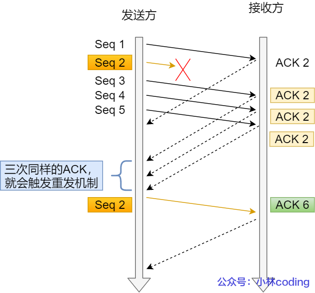
>
> 快重传过程：在上图，发送方发出了 1，2，3，4，5 份数据：
>
> 第一份 Seq1 先送到了，于是就 Ack 回 2；
> 结果 Seq2 因为某些原因没收到，Seq3 到达了，于是还是 Ack 回 2；
> 后面的 Seq4 和 Seq5 都到了，但还是 Ack 回 2，因为 Seq2 还是没有收到；
> 发送端收到了三个 Ack = 2 的确认，知道了 Seq2 还没有收到，就会在定时器过期之前，重传丢失的 Seq2。
> 最后，收到了 Seq2，此时因为 Seq3，Seq4，Seq5 都收到了，于是 Ack 回 6 。
>
> 快重传能够解决超时时间的问题，但是不知道重传哪些报文，只能从第一个未收到的开始

> SACK : 选择性确认
>
> 这种方式需要在 TCP 头部「选项」字段里加一个 SACK 的东西，**它可以将已收到的数据的信息发送给「发送方」**，这样发送方就可以知道哪些数据收到了，哪些数据没收到，知道了这些信息，就可以只重传丢失的数据。

##### 11.详细讲一下拥塞控制？

TCP 一共使用了四种算法来实现拥塞控制：

- 慢开始 (slow-start)；

- 拥塞避免 (congestion avoidance)；

- 快速重传 (fast retransmit)；

- 快速恢复 (fast recovery)。

发送方维持一个叫做拥塞窗口cwnd（congestion window）的状态变量。当cwnd>thresh时，改用拥塞避免算法。

> **rwnd与cwnd**
>
> `rwnd`（Receiver Window，接收者窗口）与`cwnd`（Congestion Window，拥塞窗口）：
>
> - rwnd是用于流量控制的窗口大小，主要取决于接收方的处理速度，由接收方通知发送方被动调整。
> - cwnd是用于拥塞处理的窗口大小，取决于网络状况，由发送方探查网络主动调整。
>
> 同时考虑流量控制与拥塞处理，则发送方窗口的大小不超过`min{rwnd, cwnd}`。

**慢开始：**不要一开始就发送大量的数据，由小到大逐渐增加拥塞窗口的大小。

> 一个传输轮次所经历的时间其实就是往返时间RTT，而且每经过一个传输轮次，**拥塞窗口cwnd就加倍**。为了防止cwnd增长过大引起网络拥塞，还需设置一个慢开始门限ssthresh状态变量。
>
> - cwnd<ssthresh时，使用慢开始算法。
> - 当cwnd>ssthresh时，改用拥塞避免算法。

**拥塞避免：**拥塞避免算法让拥塞窗口缓慢增长，即每经过一个往返时间RTT就把发送方的拥塞窗口**cwnd加1**。这样拥塞窗口按线性规律缓慢增长。

> 无论是在慢开始阶段还是在拥塞避免阶段，只要发送方判断网络出现拥塞（其根据就是没有按时收到确认，虽然没有收到确认可能是其他原因的分组丢失，但是因为无法判定，所以都当做拥塞来处理），就把**慢开始门限ssthresh设置为出现拥塞时的发送窗口大小的一半**（但不能小于2）。然后把**拥塞窗口cwnd重新设置为1**，执行慢开始算法。
>
> **整个拥塞控制的流程：**
>
> 假定cwnd=24时，网络出现超时（拥塞），则更新后的ssthresh=12，cwnd重新设置为1，并执行慢开始算法。
>
> 当cwnd=12=ssthresh时，改为执行拥塞避免算法
>
> 注意：拥塞避免并非完全能够避免了阻塞，而是使网络比较不容易出现拥塞。

**快重传**：我们可以剔除一些不必要的拥塞报文，提高网络吞吐量。比如接收方在收到一个**失序**的报文段后就**立即发出重复确认**，而不要等到自己发送数据时捎带确认。快重传规定：发送方只要一连收到**三个重复**确认就应当立即重传对方尚未收到的报文段，而不必继续等待设置的重传计时器时间到期。

> 假设你发送了如下的数据包：
>
> ```
> makefile复制编辑客户端（Sender） -> 服务端（Receiver）
> Seq=1 ✅ 收到
> Seq=2 ✅ 收到
> Seq=3 ❌ 丢失了
> Seq=4 ✅ 收到（但服务端发现缺了3号包）
> ```
>
> 服务端接收后，发现缺失了 3 号包，于是会：
>
> - 对 **每个后续收到的包**，都发一个 “重复 ACK”（重复确认序号为 **3**）
>
> 客户端连续收到了 3 个 ACK3：
>
> ```text
> ACK 3
> ACK 3
> ACK 3  <-- 收到第3个重复ACK时，客户端立即重传 Seq=3（不等超时）
> ```
>
> 🧨 **触发条件：收到 3 个重复 ACK**
>
> 这时候，客户端就会立刻重传 **Seq=3** 的包 —— 这就叫 **Fast Retransmit（快速重传）**。

**快恢复**：主要是配合快重传。当发送方连续收到三个重复确认时，就执行“乘法减小”算法，把**ssthresh门限**减半（为了预防网络发生拥塞），但接下来并不执行慢开始算法，而是将cwnd设置为ssthresh减半后的值，然后执行拥塞避免算法，使cwnd缓慢增大。因为如果网络出现拥塞的话就不会收到好几个重复的确认，收到三个重复确认说明网络状况还可以。

##### TCP补充

1.TCP 和 UDP 可以使用同一个端口吗？


答案：可以。TCP/UDP 各自的端口号也相互独立，如 TCP 有一个 80 号端口，UDP 也可以有一个 80 号端口，二者并不冲突。

2.多个 TCP 服务进程可以绑定同一个端口吗？

答案：不行。如果两个 TCP 服务进程同时绑定的 IP 地址和端口都相同，那么执行 bind() 时候就会出错，错误是“Address already in use”。

> 注意，如果 TCP 服务进程 A 绑定的地址是 0.0.0.0 和端口 8888，而如果 TCP 服务进程 B 绑定的地址是 192.168.1.100 地址（或者其他地址）和端口 8888，那么执行 bind() 时候也会出错。这是因为 0.0.0.0 地址比较特殊，代表任意地址，意味着绑定了 0.0.0.0 地址，相当于把主机上的所有 IP 地址都绑定了。
>

3.重启 TCP 服务进程时，如何避免“Address in use”的报错信息？

当 TCP 服务进程重启时，服务端会出现 TIME_WAIT 状态的连接，TIME_WAIT 状态的连接使用的 IP+PORT 仍然被认为是一个有效的 IP+PORT 组合，相同机器上不能够在该 IP+PORT 组合上进行绑定，那么执行 bind() 函数的时候，就会返回了 Address already in use 的错误。

答案：我们可以在调用 bind 前，对 socket 设置 SO_REUSEADDR 属性，可以解决这个问题。因为 SO_REUSEADDR 作用是：如果当前启动进程绑定的 IP+PORT 与处于TIME_WAIT 状态的连接占用的 IP+PORT 存在冲突，但是新启动的进程使用了 SO_REUSEADDR 选项，那么该进程就可以绑定成功。

4.客户端的端口可以重复使用吗？

在客户端执行 connect 函数的时候，只要客户端连接的服务器不是同一个，内核允许端口重复使用。

TCP 连接是由四元组（源IP地址，源端口，目的IP地址，目的端口）唯一确认的，那么只要四元组中其中一个元素发生了变化，那么就表示不同的 TCP 连接的。

所以，如果客户端已使用端口 64992 与服务端 A 建立了连接，那么客户端要与服务端 B 建立连接，还是可以使用端口 64992 的，因为内核是通过四元祖信息来定位一个 TCP 连接的，并不会因为客户端的端口号相同，而导致连接冲突的问题。

5.客户端 TCP 连接 TIME_WAIT 状态过多，会导致端口资源耗尽而无法建立新的连接吗？

要看客户端是否都是与同一个服务器（目标地址和目标端口一样）建立连接。

如果客户端都是与同一个服务器（目标地址和目标端口一样）建立连接，那么如果客户端 TIME_WAIT 状态的连接过多，当端口资源被耗尽，就无法与这个服务器再建立连接了。即使在这种状态下，还是可以与其他服务器建立连接的，只要客户端连接的服务器不是同一个，那么端口是重复使用的。

6.如何解决客户端 TCP 连接 TIME_WAIT 过多，导致无法与同一个服务器建立连接的问题？

打开 net.ipv4.tcp_tw_reuse 这个内核参数。

因为开启了这个内核参数后，客户端调用 connect 函数时，如果选择到的端口，已经被相同四元组的连接占用的时候，就会判断该连接是否处于 TIME_WAIT 状态。

如果该连接处于 TIME_WAIT 状态并且 TIME_WAIT 状态持续的时间超过了 1 秒，那么就会重用这个连接，然后就可以正常使用该端口了。

##### TCP优化

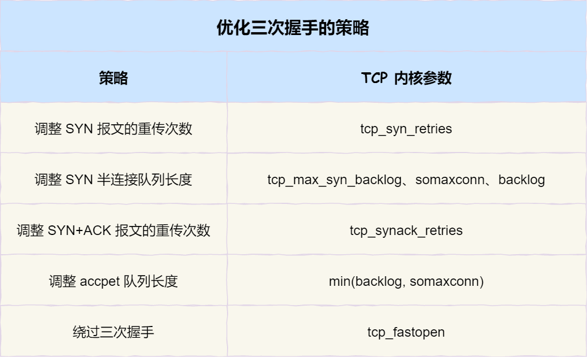

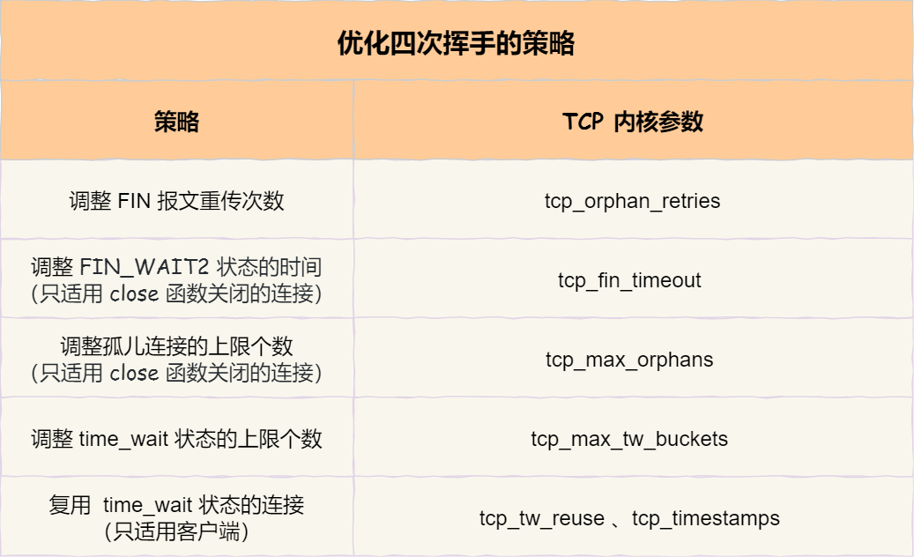

##### http的keep-alive和tcp的Keepalive的区别

> HTTP 的 Keep-Alive，是由应用层（用户态） 实现的，称为 HTTP 长连接；只要任意一端没有明确提出断开连接，则保持 TCP 连接状态。

> TCP 的 Keepalive，是由 TCP 层（内核态） 实现的，称为 TCP 保活机制；如果两端的 TCP 连接一直没有数据交互，达到了触发 TCP 保活机制的条件，那么内核里的 TCP 协议栈就会发送探测报文。
>
> - 如果对端程序是正常工作的。当 TCP 保活的探测报文发送给对端, 对端会正常响应，这样 TCP 保活时间会被重置，等待下一个 TCP 保活时间的到来。
>
> - 如果对端主机宕机或对端由于其他原因导致报文不可达。当 TCP 保活的探测报文发送给对端后，没有响应，连续几次，达到保活探测次数后，TCP 会报告该 TCP 连接已经死亡。
>
>   *注意不是进程崩溃，进程崩溃后操作系统在回收进程资源的时候，会发送 FIN 报文，而主机宕机则是无法感知的，所以需要 TCP 保活机制来探测对方是不是发生了主机宕机*


##### 12.HTTP常见的状态码有哪些？

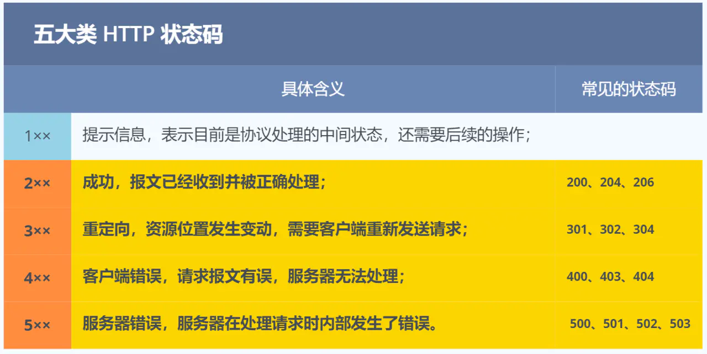

> 101: 切换请求协议

> 200：服务器已成功处理了请求。  
>
> 202（已接受）服务器已接受请求，但尚未处理。
>
> 204 No Content 服务器成功处理了请求，但没有返回任何内容。
>
> 206 Partial Content 用于分块下载或断点续传，表示返回了部分资源。

> 301 ： (永久移动) 请求的网页已永久移动到新位置。 服务器返回此响应(对 GET 或 HEAD 请求的响应)时，会自动将请求者转到新位置。
>
> 302：(临时移动) 服务器目前从不同位置的网页响应请求，但请求者应继续使用原有位置来进行以后的请求。
>
> 304："未修改"（Not Modified）它告诉客户端，自从上次请求以来，请求的资源没有发生变化，因此客户端可以继续使用其缓存的版本，无需重新下载。

> 400 ：客户端请求有**语法错误**，不能被服务器所理解。
>
> 401 该状态码表示发送的请求需要通过HTTP认证，初次收到401响应浏览器弹出认证的对话窗口。若收到第二次401状态码，则说明第一次验证失败。
>
> 403 ：服务器收到请求，但是拒绝提供服务。一般是未获得文件系统的访问权限，访问权限出现问题。
>
> 404 ：(未找到) 服务器找不到请求的网页,无法提供给客户端。

> 500： (服务器内部错误) 服务器遇到错误，无法完成请求。
>
> 501（尚未实施）服务器不具备完成请求的功能。
>
> 502 :  代理服务器或网关从上游服务器中收到无效响应
>
> 503 : 服务器忙，无法响应

##### 13. GET请求和POST请求的区别？

**使用上的区别：**

- GET使用URL或Cookie传参，而POST将数据放在BODY中”，这个是因为HTTP协议用法的约定。
- GET方式提交的数据有长度限制，则POST的数据则可以非常大”，这个是因为它们使用的操作系统和浏览器设置的不同引起的区别。
- POST比GET安全，因为数据在地址栏上不可见”，这个说法没毛病，但依然不是GET和POST本身的区别。

**本质区别**

GET和POST最大的区别主要是**GET请求是安全且幂等的**，POST请求不是。这个是它们本质区别。 

*幂等性是指一次和多次请求某一个资源应该具有同样的副作用。简单来说意味着对同一URL的多个请求应该返回同样的结果。安全指不会破坏服务器的资源*

##### 14. 解释一下HTTP长连接和短连接？

**在HTTP/1.0中，默认使用的是短连接**。也就是说，浏览器和服务器每进行一次HTTP操作，就建立一次连接，但任务结束就中断连接。如果客户端浏览器访问的某个HTML或其他类型的 Web页中包含有其他的Web资源，如JavaScript文件、图像文件、CSS文件等；当浏览器每遇到这样一个Web资源，就会建立一个HTTP会话。

但从 **HTTP/1.1起，默认使用长连接**，用以保持连接特性。使用长连接的HTTP协议，会在响应头有加入这行代码：`Connection:keep-alive`

在使用长连接的情况下，当一个网页打开完成后，客户端和服务器之间用于传输HTTP数据的 TCP连接不会关闭，如果客户端再次访问这个服务器上的网页，会继续使用这一条已经建立的连接。Keep-Alive不会永久保持连接，它有一个保持时间，可以在不同的服务器软件（如Apache）中设定这个时间。实现长连接要客户端和服务端都支持长连接。

**HTTP协议的长连接和短连接，实质上是TCP协议的长连接和短连接。**

> **HTTP1.1和1.0的区别？**
>
> HTTP/1.1 采用了长连接的方式，这使得管道（pipeline）网络传输成为了可能。即可在同一个 TCP 连接里面，客户端可以发起多个请求，只要第一个请求发出去了，不必等其回来，就可以发第二个请求出去，可以减少整体的响应时间。但是服务器必须按照接收请求的顺序发送对这些管道化请求的响应。**HTTP/1.1 管道解决了请求的队头阻塞，但是没有解决响应的队头阻塞。**
>

##### 15.HTTP1.1和 HTTP2.0的区别？

**HTTP/1.1 的问题**

- **响应队头阻塞（Head-of-Line Blocking）**：HTTP/1.1 使用「串行请求」，下一个请求必须等上一个请求完成后才能执行，导致性能瓶颈。
- **每个请求必须建立单独的 TCP 连接**（或使用 Keep-Alive 复用连接，但仍然是串行的）。
- **请求头部过大**：每个请求都需要携带完整的 HTTP 头，造成大量冗余数据（例如 Cookie 可能很大）。
- **无法服务器主动推送数据**：HTTP/1.1 需要客户端发起请求，服务器无法主动发送数据。

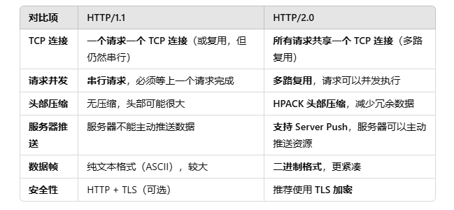

HTTP2.0相比HTTP1.1支持的特性：

- **新的二进制格式**：HTTP/1.1 以 纯文本格式 发送数据，而 HTTP/2 改用二进制格式，更紧凑高效。
- **多路复用**，HTTP/2 **允许多个请求同时在一个 TCP 连接上传输**，避免了 HTTP/1.1 的队头阻塞。减少了 TCP 连接的建立和维护成本
- **头部压缩**，HTTP1.1的头部（header）带有大量信息，而且每次都要重复发送；HTTP2.0使用encoder来减少需要传输的header大小，通讯双方各自cache一份header fields表，既避免了重复header的传输，又减小了需要传输的大小。
- **服务端推送**：服务器除了对最初请求的响应外，服务器还可以额外的向客户端推送资源，而无需客户端明确的请求。

注意：**多路复用是指：*客户端与服务器之间建立*一个 TCP 连接**，**该连接内部可以复用多个 HTTP 请求/响应的流（stream）**，**一个客户端连接一个服务器时**（例如浏览器访问一个域名），**只用一个 TCP 连接**。

> HTTP2.0缺点：HTTP/2 通过 Stream 的并发能力，解决了 HTTP/1 队头阻塞的问题，看似很完美了，但是 HTTP/2 还是存在“队头阻塞”的问题，只不过问题不是在 HTTP 这一层面，而是在 TCP 这一层。
>
> HTTP/2 是基于 TCP 协议来传输数据的，TCP 是字节流协议，TCP 层必须保证收到的字节数据是完整且连续的，这样内核才会将缓冲区里的数据返回给 HTTP 应用，那么当「前 1 个字节数据」没有到达时，后收到的字节数据只能存放在内核缓冲区里，只有等到这 1 个字节数据到达时，HTTP/2 应用层才能从内核中拿到数据，这就是 HTTP/2 队头阻塞问题。

**HTTP3**：将下层的tcp协议改成QUIC(基于udp)协议，来防止底层协议的队头阻塞。

> QUIC 有自己的一套机制可以保证传输的可靠性的。当某个流发生丢包时，只会阻塞这个流，其他流不会受到影响，因此不存在队头阻塞问题。这与 HTTP/2 不同，HTTP/2 只要某个流中的数据包丢失了，其他流也会因此受影响。
>
> QUIC 有自己的一套机制可以保证传输的可靠性的。当某个流发生丢包时，只会阻塞这个流，其他流不会受到影响，因此不存在队头阻塞问题。

- 无队头阻塞
- 更快的连接建立
- 连接迁移

##### 16.HTTP 与 HTTPS 的区别？

1.信息传输：https使用ssl安全协议使报文加密传输

2.连接建立：tcp三次握手完成http连接，而https三次握手后还需要进行ssl的握手过程才能进入加密报文传输。

3.默认端口不同

4.https协议需要向CA申请数字认证来保证身份可靠性

> 解决的问题：
>
> 防窃听：非对称加密
>
> 防篡改：摘要算法+数字签名
>
> 身份校验：数字证书

|              | HTTP                         | HTTPS                                                        |
| ------------ | ---------------------------- | ------------------------------------------------------------ |
| 端口         | 80                           | 443                                                          |
| 安全性       | 无加密，安全性较差，明文传输 | 有加密机制，安全性较高                                       |
| 资源消耗     | 较少                         | 由于加密处理，资源消耗更多                                   |
| 是否需要证书 | 不需要                       | 需要向CA申请数字证书                                         |
| 协议         | 运行在TCP协议之上            | 运行在 SSL(Secure Socket Layer，安全套接层)协议之上，SSL运行在TCP协议之上 |

**HTTPS优点**：

安全性：

- 使用HTTPS协议可认证用户和服务器，确保数据发送到正确的客户机和服务器；
- **HTTPS协议是由SSL+HTTP协议**构建的可进行加密传输、身份认证的网络协议，要比http协议安全，可防止数据在传输过程中不被窃取、改变，确保数据的完整性。

**HTTPS缺点**：

- 在相同网络环境中，HTTPS 相比 HTTP 无论是响应时间还是耗电量都有大幅度上升。
- HTTPS 的安全是有范围的，在黑客攻击、服务器劫持等情况下几乎起不到作用。
- 在现有的证书机制下，中间人攻击依然有可能发生。
- HTTPS 需要更多的服务器资源，也会导致成本的升高。

##### 17.讲一讲HTTPS 的原理？

HTTPS 的本质是 **HTTP + TLS/SSL**，通过以下三个核心机制保障安全：

1. **加密传输**：使用对称加密算法（如 AES）加密数据，防止窃听。
2. **身份验证**：通过数字证书验证服务器身份，防止中间人攻击。
3. **完整性校验**：使用哈希算法（如 SHA-256）确保数据未被篡改。

首先进行tcp三次握手，连接建立后进行

##### **四次TLS握手**

> (1.2版本)

1. **"client hello"消息：**客户端通过发送"client hello"消息向服务器发起握手请求，该消息包含了客户端所支持的 TLS 版本和密码套件以供服务器进行选择，还有一个"client random"随机字符串。

2. **"server hello"消息：** 服务端根据客户端提供的版本选定合适的TLS版本和密码套件，然后服务器发送"server hello"消息对客户端进行回应，该消息包含了数字证书(公钥+CA签名+域名)，服务器选择的密码组合和"server random"随机字符串。

3. **客户端验证：**确保对方的合法身份，

   1. 检查数字签名
   2. 验证证书链 (这个概念下面会进行说明)，检查证书的有效期
   3. 检查证书的撤回状态 (撤回代表证书已失效)

4. **生成会话密钥：**客户端向服务器发送另一个随机字符串"premaster secret (预主密钥)"，这个字符串是经过服务器的公钥加密过的，只有对应的私钥才能解密。

5. **使用私钥：**服务器使用私钥解密"premaster secret"。

6. **生成共享密钥**：客户端和服务器均使用 client random，server random 和 premaster secret，并通过相同的算法(如PRF)生成相同的共享密钥 **KEY**。

   > 到这里四次握手结束，开始验证握手过程未被篡改

7. 客户端和服务器交换 **Finished 消息**，验证握手过程未被篡改。

8. **达成安全通信：**握手完成，双方使用对称加密进行安全通信。

> **为什么需要随机数？**
>
> 完整的 TLS 密钥由三个随机数共同生成：**Client Random**、**Server Random** 和 **Premaster Secret**。三者的作用如下：
>
> 1. **Client Random** 和 **Server Random**
>    - 明文传输，用于保证密钥的新鲜性（Freshness），确保每次会话的密钥唯一。
>    - 抵御 **重放攻击**（Replay Attack）：即使攻击者截获旧会话的加密数据，因随机数不同，无法解密新会话。
>    - 支持 **前向安全性**（Forward Secrecy）：若私钥未来泄露，历史会话仍安全（密钥依赖随机数，旧随机数已被丢弃）。
> 2. **Premaster Secret**
>    - 加密传输，是密钥生成的熵主要来源，保证密钥的机密性。
>
> 三者的结合实现 **“公开随机数 + 机密随机数”的分工**，既降低密钥生成风险，又保证安全性。


> **TLS1.3**
>
> 1. Client Hello,客户端发起握手，发送TLS 版本、加密套件、随机数，同时发送一个key share（和自己的公钥有关）
> 2. ServerHello,服务器选择加密套件、TLS版本号，随机数，服务器签名(CA)；生成并发送自己的 key share；然后发送Finsh消息。
> 3. 客户端收到这些后立即验证 + 计算密钥。客户端校验服务器消息无误后，也发送Finish消息（用最终密钥master secret加密发送）
>
> 如果之前已经建立过连接，支持 0-RTT：客户端可以在 **ClientHello** 时就发送加密的 HTTP 请求（early data），实现 **0-RTT 启动**，但这需要特别处理防重放攻击的问题。

> 注：key share是用于得到共享密钥的参数，可以是服务器和客户端各自的公钥
>
> 

##### HTTP1.1如何优化

> 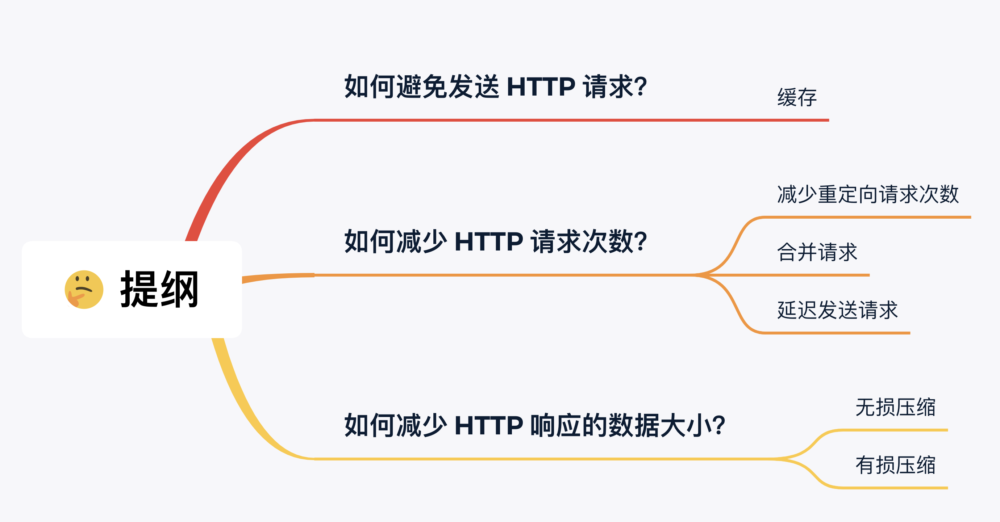

**1.避免发送HTTP请求：**

> **缓存机制**：服务器在发送 HTTP 响应时，会估算一个过期的时间，并把这个信息放到响应头部中，这样客户端在查看响应头部的信息时，一旦发现缓存的响应是过期的，则就会重新发送网络请求。
>
> 客户端在重新发送请求时，在请求的 Etag 头部带上第一次请求的响应头部中的摘要，这个摘要是唯一标识响应的资源，当服务器收到请求后，会将本地资源的摘要与请求中的摘要做个比较。如果不同，那么说明客户端的缓存已经没有价值，服务器在响应中带上最新的资源。如果相同，说明客户端的缓存还是可以继续使用的，那么服务器仅返回不含有包体的 304 Not Modified 响应，告诉客户端仍然有效，这样就可以减少响应资源在网络中传输的延时

**2.减少HTTP请求次数**

> **减少重定向次数**
>
> 服务器上的一个资源可能由于迁移、维护等原因从 url1 移至 url2 后，而客户端不知情，它还是继续请求 url1，这时服务器不能粗暴地返回错误，而是通过 302 响应码和 Location 头部，告诉客户端该资源已经迁移至 url2 了，于是客户端需要再发送 url2 请求以获得服务器的资源。那么，如果重定向请求越多，那么客户端就要多次发起 HTTP 请求，每一次的 HTTP 请求都得经过网络，这无疑会越降低网络性能。
>
> 如果重定向的工作交由代理服务器完成，就能减少 HTTP 请求次数了

> **合并请求**
>
> 如果把多个访问小文件的请求合并成一个大的请求，虽然传输的总资源还是一样，但是减少请求，也就意味着减少了重复发送的 HTTP 头部。
>
> 有的网页会含有很多小图片、小图标，有多少个小图片，客户端就要发起多少次请求。那么对于这些小图片，我们可以考虑使用 CSS Image Sprites 技术把它们合成一个大图片，这样浏览器就可以用一次请求获得一个大图片，然后再根据 CSS 数据把大图片切割成多张小图片。这种方式就是通过将多个小图片合并成一个大图片来减少 HTTP 请求的次数，以减少 HTTP 请求的次数，从而减少网络的开销。除了将小图片合并成大图片的方式，还有服务端使用 webpack 等打包工具将 js、css 等资源合并打包成大文件，也是能达到类似的效果。
>
> 合并请求的方式就是合并资源，以一个大资源的请求替换多个小资源的请求。
>
> 但是这样的合并请求会带来新的问题，当大资源中的某一个小资源发生变化后，客户端必须重新下载整个完整的大资源文件，这显然带来了额外的网络消耗。

> **延迟发送请求**
>
> 不要一口气吃成大胖子，一般 HTML 里会含有很多 HTTP 的 URL，当前不需要的资源，我们没必要也获取过来，于是可以通过「按需获取」的方式，来减少第一时间的 HTTP 请求次数。
>
> 请求网页的时候，没必要把全部资源都获取到，而是只获取当前用户所看到的页面资源，当用户向下滑动页面的时候，再向服务器获取接下来的资源，这样就达到了延迟发送请求的效果。

**3.如何减少 HTTP 响应的数据大小**

可以考虑对响应的资源进行压缩，这样就可以减少响应的数据大小，从而提高网络传输的效率。

> gzip 就是比较常见的无损压缩。客户端支持的压缩算法，会在 HTTP 请求中通过头部中的 Accept-Encoding 字段告诉服务器：
>
> `Accept-Encoding: gzip, deflate, br`
> 服务器收到后，会从中选择一个服务器支持的或者合适的压缩算法，然后使用此压缩算法对响应资源进行压缩，最后通过响应头部中的 Content-Encoding 字段告诉客户端该资源使用的压缩算法。
>
> `Content-Encoding: gzip`
> gzip 的压缩效率相比 Google 推出的 Brotli 算法还是差点意思，也就是上文中的 br，所以如果可以，服务器应该选择压缩效率更高的 br 压缩算法。

与无损压缩相对的就是有损压缩，经过此方法压缩，解压的数据会与原始数据不同但是非常接近。

>  有损压缩主要将次要的数据舍弃，牺牲一些质量来减少数据量、提高压缩比，这种方法经常用于压缩多媒体数据，比如音频、视频、图片。

##### HTTPS如何优化

> 对于硬件优化的方向，因为 HTTPS 是属于计算密集型，应该选择计算力更强的 CPU，而且最好选择支持 AES-NI 特性的 CPU，这个特性可以在硬件级别优化 AES 对称加密算法，加快应用数据的加解密。
>
> 对于软件优化的方向，如果可以，把软件升级成较新的版本，比如将 Linux 内核 2.X 升级成 4.X，将 openssl 1.0.1 升级到 1.1.1，因为新版本的软件不仅会提供新的特性，而且还会修复老版本的问题。

对于协议优化的方向：

> 密钥交换算法应该选择 ECDHE 算法，而不用 RSA 算法，因为 ECDHE 算法具备前向安全性，而且客户端可以在第三次握手之后，就发送加密应用数据，节省了 1 RTT。
> 将 TLS1.2 升级 TLS1.3，因为 TLS1.3 的握手过程只需要 1 RTT，而且安全性更强。

对于证书优化的方向：

> 服务器应该选用 ECDSA 证书，而非 RSA 证书，因为在相同安全级别下，ECC 的密钥长度比 RSA 短很多，这样可以提高证书传输的效率；
> 服务器应该开启 OCSP Stapling 功能，由服务器预先获得 OCSP 的响应，并把响应结果缓存起来，这样 TLS 握手的时候就不用再访问 CA 服务器，减少了网络通信的开销，提高了证书验证的效率；

对于重连 HTTPS 时，我们可以使用一些技术让客户端和服务端使用上一次 HTTPS 连接使用的会话密钥，直接恢复会话，而不用再重新走完整的 TLS 握手过程。

常见的**会话重用**技术有 Session ID 和 Session Ticket，用了会话重用技术，当再次重连 HTTPS 时，只需要 1 RTT 就可以恢复会话。对于 TLS1.3 使用 Pre-shared Key 会话重用技术，只需要 0 RTT 就可以恢复会话。

这些会话重用技术虽然好用，但是存在一定的安全风险，它们不仅不具备前向安全，而且有重放攻击的风险，所以应当对会话密钥设定一个合理的过期时间。

##### HTTP报文头属性

- Accpet
  - 告诉服务端，客户端接收什么类型的响应
- Referer
  - 表示这是请求是从哪个URL进来的,比如想在网上购物，但是不知道选择哪家电商平台，你就去问度娘，说哪家电商的东西便宜啊，然后一堆东西弹出在你面前，第一给就是某宝，当你从这里进入某宝的时候，这个请求报文的Referer就是：[www.baidu.com](https://javabetter.cn/cs/www.baidu.com)
- Cache-Control
  - 对缓存进行控制，如一个请求希望响应的内容在客户端缓存一年，或不被缓可以通过这个报文头设置
- Accept-Encoding
  - 这个属性是用来告诉服务器能接受什么编码格式，包括字符编码,压缩形式(一般都是压缩形式)
    - 例如:`Accept-Encoding:gzip, deflate`(这两种都是压缩格式)
- Host
  - 指定要请求的资源所在的主机和端口
- User-Agent：告诉服务器，客户端使用的操作系统、浏览器版本和名称
- Connection

决定当前事务（三次握手和四次挥手）完成后，是否关闭网络连接。

- 持久连接，事务完成后不关闭网络连接 ：` Connection: keep-alive`

- 非持久连接，事务完成后关闭网络连接： `Connection: close`


##### HTTP3.0

HTTP/2 虽然具有多个流并发传输的能力，但是传输层是 TCP 协议，于是存在以下缺陷：

> - 队头阻塞，HTTP/2 多个请求跑在一个 TCP 连接中，如果序列号较低的 TCP 段在网络传输中丢失了，即使序列号较高的 TCP 段已经被接收了，应用层也无法从内核中读取到这部分数据，从 HTTP 视角看，就是多个请求被阻塞了；
> - TCP 和 TLS 握手时延，TCP 三次握手和 TLS 四次握手，共有 3-RTT 的时延；
> - 连接迁移需要重新连接，移动设备从 4G 网络环境切换到 WiFi 时，由于 TCP 是基于四元组来确认一条 TCP 连接的，那么网络环境变化后，就会导致 IP 地址或端口变化，于是 TCP 只能断开连接，然后再重新建立连接，切换网络环境的成本高；

HTTP/3 就将传输层从 TCP 替换成了 UDP，并在 UDP 协议上开发了 QUIC 协议，来保证数据的可靠传输。

QUIC 协议的特点：

> - 无队头阻塞，QUIC 连接上的多个 Stream 之间并没有依赖，都是独立的，也不会有底层协议限制，某个流发生丢包了，只会影响该流，其他流不受影响；
> - 建立连接速度快，因为 QUIC 内部包含 TLS 1.3，因此仅需 1 个 RTT 就可以「同时」完成建立连接与 TLS 密钥协商，甚至在第二次连接的时候，应用数据包可以和 QUIC 握手信息（连接信息 + TLS 信息）一起发送，达到 0-RTT 的效果。
> - 连接迁移，QUIC 协议没有用四元组的方式来“绑定”连接，而是通过「连接 ID 」来标记通信的两个端点，客户端和服务器可以各自选择一组 ID 来标记自己，因此即使移动设备的网络变化后，导致 IP 地址变化了，只要仍保有上下文信息（比如连接 ID、TLS 密钥等），就可以“无缝”地复用原连接，消除重连的成本；

另外 HTTP/3 的 QPACK 通过两个特殊的单向流来同步双方的动态表，解决了 HTTP/2 的 HPACK 队头阻塞问题。


##### 18. 在浏览器中输入www.baidu.com后执行的全部过程？

> 用户在浏览器中输入 URL 后，首先进行 DNS 解析获取目标 IP，然后通过三次握手建立 TCP 连接（若是 HTTPS，还会进行 TLS 握手），之后浏览器发起 HTTP 请求，服务器返回 HTML 页面数据。浏览器接收到响应后，会解析 HTML 构建 DOM 树，加载并解析 CSS/JS 等资源，最终完成页面的渲染并展示给用户。

1. 域名解析。 

   浏览器先查缓存（浏览器缓存、系统缓存、hosts文件、DNS服务器缓存）；

   若未命中，向本地 DNS 服务器发起递归查询；

   最终得到目标 IP 地址。

   >  **浏览器搜索自己的DNS缓存**（维护一张域名与IP的对应表）；若没有，则搜索**操作系统的DNS缓存**（维护一张域名与IP的对应表）；若没有，则搜索操作系统的**hosts文件**（维护一张域名与IP的对应表）。 若都没有，则找 tcp/ip 参数中设置的首选 dns 服务器，即**本地 dns 服务器**（递归查询），**本地域名服务器查询自己的dns缓存**，如果没有，则进行迭代查询。将本地dns服务器将IP返回给操作系统，同时缓存IP。

2. 发起 tcp 的三次握手，建立 tcp 连接。浏览器会以一个随机端口（1024-65535）向服务端的 web 程序 **80** 端口发起 tcp 的连接。若是 HTTPS，会在 TCP 后进行 TLS 握手，协商密钥和证书；

3. 建立 tcp 连接后发起 http 请求。包含请求方法（如 GET）、路径、Headers（如 Cookie、User-Agent）等；

4. 服务器响应 http 请求，客户端得到 html 代码。服务器 web 应用程序收到 http 请求后，就开始处理请求，处理之后就返回给浏览器 html 文件。

5. 浏览器解析 html 代码，并请求 html 中的资源。

6. 浏览器对页面进行渲染，并呈现给用户。

##### 什么是CDN

CDN（Content Delivery Network，内容分发网络） 通过在全球布置缓存节点，把静态资源提前缓存到离用户最近的节点，用户访问时由最近的节点响应，从而实现就近访问、降低延迟、提升性能。它不仅加速资源访问，还能缓解源站压力、提升系统的并发处理能力和抗攻击能力。

##### 19.cookie 和 session

**什么是 Cookie**

HTTP Cookie（也叫 Web Cookie或浏览器 Cookie）是**服务器发送到用户浏览器并保存在本地的一小块数据**，它会在浏览器下次向同一服务器再发起请求时被携带并发送到服务器上。通常，它用于告知服务端两个请求是否来自同一浏览器，如保持用户的登录状态。Cookie 使基于无状态的 HTTP 协议记录稳定的状态信息成为了可能。

Cookie 主要用于以下三个方面：

- 会话状态管理（如用户登录状态、购物车、游戏分数或其它需要记录的信息）
- 个性化设置（如用户自定义设置、主题等）
- 浏览器行为跟踪（如跟踪分析用户行为等）

**什么是 Session**

Session 代表着服务器和客户端一次会话的过程。**Session 对象存储特定用户会话所需的属性及配置信息。**这样，当用户在应用程序的 Web 页之间跳转时，存储在 Session 对象中的变量将不会丢失，而是在整个用户会话中一直存在下去。当客户端关闭会话，或者 Session 超时失效时会话结束。**Cookie 保存在客户端（浏览器），Session 保存在服务器端。**

**Cookie 和 Session 是如何配合的**

用户第一次请求服务器的时候，服务器根据用户提交的相关信息，创建对应的 Session ，请求返回时将此 Session 的唯一标识信息 SessionID 返回给浏览器，浏览器接收到服务器返回的 SessionID 信息后，会将此信息存入到 Cookie 中，同时 Cookie 记录此 SessionID 属于哪个域名。

当用户第二次访问服务器的时候，请求会自动判断此域名下是否存在 Cookie 信息，如果存在自动将 Cookie 信息也发送给服务端，服务端会从 Cookie 中获取 SessionID，再根据 SessionID 查找对应的 Session 信息，如果没有找到说明用户没有登录或者登录失效，如果找到 Session 证明用户已经登录可执行后面操作。

根据以上流程可知，SessionID 是连接 Cookie 和 Session 的一道桥梁，大部分系统也是根据此原理来验证用户登录状态。

##### 20. DDos攻击和XSS攻击

**DDos全称Distributed Denial of Service，分布式拒绝服务攻击**。基本的Dos攻击：

1. 客户端向服务端发送请求链接数据包。
2. 服务端向客户端发送确认数据包。
3. 客户端不向服务端发送确认数据包，服务器一直等待来自客户端的确认

DDoS则是采用分布式的方法，通过在网络上占领多台“肉鸡”，用多台计算机发起攻击。

**预防方法：**

- 减少SYN timeout时间。在握手的第三步，服务器会等待30秒-120秒的时间，减少这个等待时间就能释放更多的资源。
- 限制同时打开的SYN半连接数目。

**XSS也称 cross-site scripting，跨站脚本。**这种攻击是由于服务器将攻击者存储的数据原原本本地显示给其他用户所致的。比如一个存在XSS漏洞的论坛，用户发帖时就可以引入带有＜script＞标签的代码，导致恶意代码的执行。

**预防方法：**

- 前端：过滤。
- 后端：转义，比如go自带的处理器就具有转义功能。

**CSRF：**

跨站请求伪造，是一种挟制用户在当前已登录的Web应用程序上执行非本意的操作的攻击方法。

比如冒充用户发起请求（在用户不知情的情况下），完成一些违背用户意愿的请求（如恶意发帖，删帖，改密码，发邮件等）。

##### 21.负载均衡算法

多台服务器以对称的方式组成一个服务器集合，每台服务器都具有等价的地位，能互相分担负载。

- 轮询法：将请求按照顺序轮流的分配到服务器上。大锅饭，不能发挥某些高性能服务器的优势。
- 随机法：随机获取一台，和轮询类似。
- 哈希法：通过ip地址哈希化来确定要选择的服务器编号。好处是,每次客户端访问的服务器都是同一个服务器，能很好地利用session或者cookie。
- 加权轮询：根据服务器性能不同加权。

##### 22. 每层的网络协议


##### 22.说说 WebSocket 与 socket 的区别

**思路:** 这是一个比较基础的知识点，经常有小伙伴会搞混。

- Socket 其实就是等于**IP 地址 + 端口 + 协议**。

> ★ 具体来说，Socket 是一套标准，它完成了对 TCP/IP 的高度封装，屏蔽网络细节，以方便开发者更好地进行网络编程。

- WebSocket 是一个持久化的协议，它是伴随 H5 而出的协议，用来解决**http 不支持持久化连接**的问题。
- Socket 一个是**网编编程的标准接口**，而 WebSocket 则是应用层通信协议。

[3.9 既然有 HTTP 协议，为什么还要有 WebSocket？ | 小林coding](https://xiaolincoding.com/network/2_http/http_websocket.html)

##### 127.0.0.1 和 localhost 以及 0.0.0.0 有区别吗

首先 localhost 就不叫 IP，它是一个域名，就跟 "baidu.com",是一个形式的东西，只不过默认会把它解析为 127.0.0.1 ，当然这可以在 /etc/hosts 文件下进行修改。

其次就是 0.0.0.0，执行 ping 0.0.0.0 ，是会失败的，因为它在IPV4中表示的是无效的目标地址。但它还是很有用处的，回想下，我们启动服务器的时候，一般会 listen 一个 IP 和端口，等待客户端的连接。

如果此时 listen 的是本机的 0.0.0.0 , 那么它表示本机上的所有IPV4地址

##### http缓存的三种策略

[HTTP缓存的三种方式详解浏览器缓存 所谓浏览器缓存其实就是指在本地使用的计算机中开辟一个内存区，同时也开辟一个硬盘区作 - 掘金](https://juejin.cn/post/7063861101041025031)

HTTP 304状态码，即"未修改"（Not Modified），是一种特殊的响应状态码。它告诉客户端，自从上次请求以来，请求的资源没有发生变化，因此客户端可以继续使用其缓存的版本，无需重新下载。这种机制可以显著提高网页加载速度，减少服务器负载，并节省带宽。

HTTP 缓存主要是通过请求和响应报文头中的对应 Header 信息，来控制缓存的策略。根据是否需要重新向服务器发起请求，可分为**强缓存和协商缓存**

**强缓存**：当命中强缓存的时候，客户端不会再请求服务器，直接从缓存中读取内容，并返回HTTP状态码200。

> HTTP状态码及区别
>
> 

强制缓存，在响应头由 Expires、Cache-Control控制

> - Expires：值为服务器返回的过期时间，浏览器再次加载资源时，如果在这个过期时间内，则命中强缓存。（HTTP1.0的属性，缺点是客户端和服务器时间不一致会导致命中误差）
> - Cache-Control：HTTP1.1属性，优先级更高，以下为常用属性
>   - no-store： 禁用缓存
>   - no-cache：不使用强缓存，每次需向服务器验证缓存是否失效
>   - private/public：private指的单个用户，public可以被任何中间人、CDN等缓存
>   - max-age=：max-age是距离请求发起的时间的秒数
>   - must-revalidate：在缓存过期前可以使用，过期后必须向服务器验证

**协商缓存**：向服务器发送请求，服务器会根据这个请求的请求头的一些参数来判断是否命中协商缓存，如果命中，则返回304状态码并带上新的响应头通知浏览器从缓存中读取资源

> Last-Modified / If-Modified-Since
>
> - Last-Modified是浏览器第一个请求资源，服务器响应头字段，是资源文件**最后一次更改时间(精确到秒)。**
> - 下一次发送请求时，请求头里的**If-Modified-Since**就是之前的Last-Modified
> - 服务器更加最后修改时间判断命中，如果命中，http为304且不返回资源、不返回last-modify
>
> Etag / If-None-Match：**Etag 的校验优先级高于 Last-Modified**
>
> - Etag是加载资源时，服务器返回的响应头字段，是对资源的唯一标记，值是hash码。
> - 浏览器在下一次加载资源向服务器发送请求时，会将上一次返回的Etag值放到请求头里的**If-None-Match**里
> - 服务器接受到If-None-Match的值后，会拿来跟该资源文件的Etag值**做比较**，如果相同，则表示资源文件没有发生改变，命中协商缓存。
>
> 在精确度上，Etag要优于Last-Modified，Last-Modified的时间单位是秒，如果某个文件在1秒内改变了多次，那么他们的Last-Modified其实并没有体现出来修改，但是Etag每次都会改变确保了精度 在性能上，Etag要逊于Last-Modified，毕竟Last-Modified只需要记录时间，而Etag需要服务器通过算法来计算出一个hash值。 **在优先级上，服务器校验优先考虑Etag。**

**注意**，协商缓存这两个字段都需要配合强制缓存中 Cache-Control 字段来使用，只有在未能命中强制缓存的时候，才能发起带有协商缓存字段的请求。

**启发式缓存**: 对于含有特定头信息的请求，会去计算缓存寿命。比如`Cache-control: max-age=N`的头，相应的缓存的寿命就是`N`。通常情况下，对于不含这个属性的请求则会去查看是否包含[Expires](https://link.juejin.cn?target=https%3A%2F%2Fdeveloper.mozilla.org%2Fzh-CN%2Fdocs%2FWeb%2FHTTP%2FHeaders%2FExpires)属性，通过比较Expires的值和头里面[Date](https://link.juejin.cn?target=https%3A%2F%2Fdeveloper.mozilla.org%2Fzh-CN%2Fdocs%2FWeb%2FHTTP%2FHeaders%2FDate)属性的值来判断是否缓存还有效。如果max-age和expires属性都没有，找找头里的[Last-Modified](https://link.juejin.cn?target=https%3A%2F%2Fdeveloper.mozilla.org%2Fzh-CN%2Fdocs%2FWeb%2FHTTP%2FHeaders%2FLast-Modified)信息。如果有，缓存的寿命就等于头里面Date的值减去Last-Modified的值除以10

>  简而言之，只有在没有明确缓存策略时，会激活启发式缓存。所以要合理设置缓存，否则会因没有设置缓存时间等原因，导致内容缓存不刷新。

##### ARP协议

ARP即地址解析协议， 用于实现从 IP 地址到 MAC 地址的映射，即询问目标IP对应的MAC地址。

**ARP协议的工作过程**

首先，每个主机都会有自己的ARP缓存区中建立一个ARP列表，以表示IP地址和MAC地址之间的对应关系

当源主机要发送数据时，首先检测ARP列表中是否对应IP地址的目的主机的MAC地址，如果有，则直接发送数据，如果没有，就向本网段的所有主机发送ARP数据包

当本网络的所有主机收到该ARP数据包时，首先检查数据包中的IP地址是否是自己的IP地址，如果不是，则忽略该数据包，如果是，则首先从数据包中取出源主机的IP和MAC地址写入到ARP列表中，如果存在，则覆盖然后将自己的MAC地址写入ARP响应包中，告诉源主机自己是它想要找的MAC地址

源主机收到ARP响应包后，将目的主机的IP和MAC地址写入ARP列表，并利用此信息发送数据，如果源主机一直没有收到ARP响应数据包，表示ARP查询失败。


##### RPC和HTTP

- 纯裸 TCP 是能收发数据，但它是个无边界的数据流，上层需要定义消息格式用于定义消息边界。于是就有了各种协议，HTTP 和各类 RPC 协议就是在 TCP 之上定义的应用层协议。
- RPC 本质上不算是协议，而是一种调用方式，而像 gRPC 和 Thrift 这样的具体实现，才是协议，它们是实现了 RPC 调用的协议。目的是希望程序员能像调用本地方法那样去调用远端的服务方法。同时 RPC 有很多种实现方式，不一定非得基于 TCP 协议。
- 从发展历史来说，HTTP 主要用于 B/S 架构，而 RPC 更多用于 C/S 架构。但现在其实已经没分那么清了，B/S 和 C/S 在慢慢融合。很多软件同时支持多端，所以对外一般用 HTTP 协议，而内部集群的微服务之间则采用 RPC 协议进行通讯。
- RPC 其实比 HTTP 出现的要早，且比目前主流的 HTTP/1.1 性能要更好，所以大部分公司内部都还在使用 RPC。
- HTTP/2.0 在 HTTP/1.1 的基础上做了优化，性能可能比很多 RPC 协议都要好，但由于是这几年才出来的，所以也不太可能取代掉 RPC。


### Mysql

#### Select语句期间发生了什么

执行一条 SQL 查询语句，期间发生了什么？

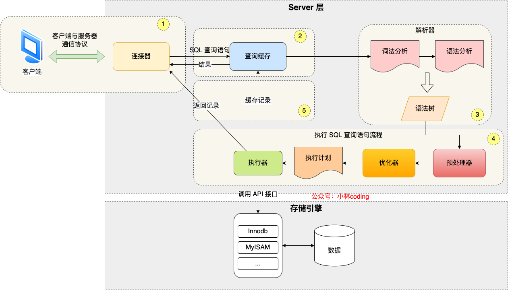

>连接器：建立连接，管理连接、校验用户身份；
>查询缓存：查询语句如果命中查询缓存则直接返回，否则继续往下执行。MySQL 8.0 已删除该模块；
>解析 SQL，通过解析器对 SQL 查询语句进行词法分析、语法分析，然后构建语法树，方便后续模块读取表名、字段、语句类型；
>执行 SQL：执行 SQL 共有三个阶段：
>预处理阶段：检查表或字段是否存在；将 select * 中的 * 符号扩展为表上的所有列。
>优化阶段：基于查询成本的考虑， 选择查询成本最小的执行计划；
>执行阶段：根据执行计划执行 SQL 查询语句，从存储引擎读取记录，返回给客户端；

#### Mysql 执行过程


1. 客户端通过TCP连接发生连接请求到 MySQL 连接器, 连接器会对该请求进行权限验证以及连接资源分配

2. 查询缓存(8.0之后没了, 原因是一般失效会非常频繁)。

   当判断缓存是否命中时，MySQL不会进行解析查询语句，而是直接使用SQL语句和客户端发送过来的其他原始信息。所以，任何字符上的不同，例如空格、注解等都会导致缓存的不命中。）

3. 分析器(词法分析 ->**语法分析**)

   （SQL语法是否写错了）。 如何把语句给到预处理器，检查数据表和数据列是否存在，解析别名看是否存在歧义。

4. **优化**器(决定索引的最佳使用方案)。是否使用索引，生成执行计划。

5. 执行器(检查权限 -> 执行语句 -> 返回结果集)

   交给执行器，将数据保存到结果集中，同时会逐步将数据缓存到查询缓存中，最终将结果集返回给客户端。

#### Mysql中的记录是怎么存储的

> **MySQL 的 NULL 值是怎么存放的？**
>
> MySQL 的 Compact 行格式中会用「NULL值列表」来标记值为 NULL 的列，NULL 值并不会存储在行格式中的真实数据部分。
>
> NULL值列表会占用 1 字节空间，当表中所有字段都定义成 NOT NULL，行格式中就不会有 NULL值列表，这样可节省 1 字节的空间。

> **MySQL 怎么知道 varchar(n) 实际占用数据的大小？**
>
> MySQL 的 Compact 行格式中会用「变长字段长度列表」存储变长字段实际占用的数据大小。

> **varchar(n) 中 n 最大取值为多少？**
>
> 一行记录最大能存储 65535 字节的数据，但是这个是包含「变长字段字节数列表所占用的字节数」和「NULL值列表所占用的字节数」。所以， 我们在算 varchar(n) 中 n 最大值时，需要减去这两个列表所占用的字节数。
>
> 如果一张表只有一个 varchar(n) 字段，且允许为 NULL，字符集为 ascii。varchar(n) 中 n 最大取值为 65532。
>
> 计算公式：65535 - 变长字段字节数列表所占用的字节数 - NULL值列表所占用的字节数 = 65535 - 2 - 1 = 65532。
>
> 如果有多个字段的话，要保证所有字段的长度 + 变长字段字节数列表所占用的字节数 + NULL值列表所占用的字节数 <= 65535。

> **行溢出后，MySQL 是怎么处理的？**
>
> 如果一个数据页存不了一条记录，InnoDB 存储引擎会自动将溢出的数据存放到「溢出页」中。
>
> Compact 行格式针对行溢出的处理是这样的：当发生行溢出时，在记录的真实数据处只会保存该列的一部分数据，而把剩余的数据放在「溢出页」中，然后真实数据处用 20 字节存储指向溢出页的地址，从而可以找到剩余数据所在的页。
>
> Compressed 和 Dynamic 这两种格式采用完全的行溢出方式，记录的真实数据处不会存储该列的一部分数据，只存储 20 个字节的指针来指向溢出页。而实际的数据都存储在溢出页中

**总结**

> InnoDB 的数据是按「数据页」为单位来读写的，默认数据页大小为 16 KB。每个数据页之间通过双向链表的形式组织起来，物理上不连续，但是逻辑上连续。
>
> 数据页内包含用户记录，每个记录之间用单向链表的方式组织起来，为了加快在数据页内高效查询记录，设计了一个页目录，页目录存储各个槽（分组），且主键值是有序的，于是可以通过二分查找法的方式进行检索从而提高效率。
>
> InnoDB 使用 B+ 树作为索引结构，每一个节点对应一个 16KB 的数据页。B+ 树的叶子节点是数据页，它们之间通过双向链表连接，方便进行范围查询。通过这种结构设计，InnoDB 既保证了高效的查找性能，也优化了范围扫描效率。页的格式如下：
>
> ```sql
> ┌────────────────────────────┐
> │ 页头（Page Header）         │ 记录页的元信息（页号、上一页、下一页等）
> │ 插槽数组（Directory）        │ 插槽 -> 每条记录的偏移
> │ 记录数据区（User Records）   │ 存放实际数据行
> │ 空闲空间（Free Space）       │ 还未使用的空间
> │ 页尾（Page Trailer）        │ 校验和等元数据
> └────────────────────────────┘
> ```
>
> 行格式如下：
>
> ```sql
> ┌────────────────────────────┐
> │ Header（变长）              │ 存储是否删除、NULL标志、字段数量等信息
> │ 真实数据（Data）            │ 每个字段的值（变长或定长）
> │ 隐藏列                      │ 如DB_ROW_ID, DB_TRX_ID, DB_ROLL_PTR（MVCC用）
> └────────────────────────────┘
> DB_ROW_ID: 如果没有主键，会自动生成一个6字节的行ID
> DB_TRX_ID: 插入/更新该行的事务ID（8字节）
> DB_ROLL_PTR: 回滚指针，用于找旧版本数据（7字节）
> ```

InnoDB 的存储结构采用段-区-页-行的四层架构，段（Segment）是逻辑管理单位，区（Extent）是一组连续的页，页（Page）是最小的I/O单位，固定为16KB，存储实际的数据行（Row）。数据页之间还通过双向链表优化范围查询，配合B+树实现高效读写。

#### B+树

- 特点：
  - **平衡性**：B+树是平衡树，所有的叶子节点在同一层级。
  - **顺序存储**：B+树的所有叶子节点通过指针相连，形成一个有序链表，方便范围查询。
  - **非叶子节点只存储索引**：所有数据都存储在叶子节点，非叶子节点仅保存索引，不存储实际数据，使得树的高度更低，查找速度更快。
  - **每个节点包含多个孩子**：B+树的每个节点都可以有多个子节点（比二叉树更宽），降低树的高度，减少I/O操作。
- 优势：
  - **高效的范围查询**：B+树的叶子节点按顺序排列，通过指针相连, 适合区间查找。
  - **减少磁盘I/O**：B+树减少了树的高度，查找数据时磁盘I/O操作次数较少。
  - **支持全表扫描**：在需要全表扫描时，只需从叶子节点顺序遍历即可，而不必回溯非叶子节点。

#### 数据库三范式

- **第一范式** 强调列的原子性, 数据库表的**每一列都是不可分割**的原子数据项

- **第二范式** 在满足1NF的基础上,属性完全**依赖于主键**，而不能**部分依赖**。这通常是针对联合主键的情况。

  > **问题**：如果一个表的主键由多个字段组成，而某些字段只依赖其中的一部分，就会导致数据冗余。
  >  **示例（不符合2NF）：**
  >
  > | 学号 | 课程ID | 课程名称 | 教师姓名 |
  > | ---- | ------ | -------- | -------- |
  > | 1001 | C001   | 数据库   | 王老师   |
  > | 1001 | C002   | 算法     | 李老师   |
  >
  > - 主键是 **(学号, 课程ID)** 的组合。
  > - **课程名称和教师姓名** 只依赖 **课程ID**，但不依赖 **学号**，所以存在**部分依赖**，导致冗余。

- **第三范式** 确保**每列都和主键列直接相关, 属性不依赖于其他非主属性.**

  > **问题**：如果**非主键字段依赖于另一个非主键字段**，就会引入**传递依赖**，导致数据冗余。
  >  **示例（不符合3NF）：**
  >
  > | 学号 | 学生姓名 | 学院ID | 学院名称   |
  > | ---- | -------- | ------ | ---------- |
  > | 1001 | 张三     | A01    | 计算机学院 |
  > | 1002 | 李四     | A02    | 数学学院   |
  >
  > - **主键是 学号**，但**学院名称** 并不是直接依赖 **学号**，而是通过 **学院ID** 依赖学号，存在**传递依赖**。
  > - 这样会导致学院名称的冗余。

####  InnoDB与MyISAM对比

|                | InnoDB                                                       | **MyISAM**                                               |
| -------------- | ------------------------------------------------------------ | -------------------------------------------------------- |
| 事务           | 支持                                                         | 不支持                                                   |
| 外键           | 支持                                                         | 不支持                                                   |
| 行锁           | 支持                                                         | 不支持                                                   |
| 行表锁         | 行锁，操作时只锁某一行，不对其它行有影响，适合高并发的操作   | 表锁，即使操作一条记录也会锁住整个表，不适合高并发的操作 |
| 缓存           | 不仅缓存索引还要缓存真实数据，对内存要求较高，而且内存大小对性能有决定性的影响 | 只缓存索引，不缓存真实数据                               |
| crash-safe能力 | 支持                                                         | 不支持                                                   |
| MVCC           | 支持                                                         | 不支持                                                   |
| 索引存储类型   | 聚簇索引                                                     | 非聚簇索引                                               |
| 是否保存表行数 | 不保存                                                       | 保存                                                     |
| 关注点         | 事务：并发写、事务、更大资源                                 | 性能：节省资源、消耗少、简单业                           |

- InnoDB支持事物，而MyISAM不支持事物
- InnoDB支持行级锁，而MyISAM支持表级锁
- InnoDB支持外键，而MyISAM不支持
- InnoDB不支持全文索引，而MyISAM支持。
- 底层都是b+树，innodb是数据存放在叶子节点，myisam存储索引在叶子节点
- InnoDB不保存表的具体行数，所以执行select count(*) from table时会全表扫描。而MyISAM用一个变量保存了整个表的行数，所以执行上述语句时只需要读出该变量即可。

#### MySQL建表的约束条件？

- 主键约束（Primay Key Coustraint） 唯一性，非空性
- 唯一约束 （Unique Counstraint）唯一性，**可以空，多个NULL不相等**
- 检查约束 (Check Counstraint) 对该列数据的范围、格式的限制
- 默认约束 (Default Counstraint) 该数据的默认值
- 外键约束 (Foreign Key Counstraint) 需要建立两表间的关系并引用主表的列

#### 索引相关面试题

##### 索引是什么? 索引优缺点?

> - 索引类似于目录, 进行数据的快速定位
> - 优点: 加快数据检索速度
> - 缺点: 创建索引和维护索引需要消耗空间和时间
>
> MySQL索引类型
>
> - 按「数据结构」分类：B+tree索引、Hash索引、Full-text索引（倒序索引）。
> - 按「物理存储」分类：聚簇索引（主键索引）、二级索引（辅助索引）。
> - 按「字段特性」分类：主键索引(无NULL)、唯一索引(值唯一，允许NULL)、普通索引、前缀索引。
> - 按「字段个数」分类：单列索引、联合索引。

##### 索引底层为什么使用B+树

> - B+ 树的所有数据存储在叶子节点，叶子节点形成了一个**有序链表**，B+ 树的**分支因子**更大(多叉树)，树的高度更低。适合**范围查询**，而B树数据分布在树形结构中，哈希表能够快速定位但是**没有顺序**。
> - **AVL 树、红黑树等平衡二叉树的层级较深，导致磁盘 I/O 频繁**，不适合存储大量数据。
> - **物理位置分散**：平衡二叉树的父子节点在逻辑上很近，但在物理存储上可能相距较远，无法充分利用磁盘顺序读和预读的高效特性。

##### 聚簇索引和非聚簇索引

> **聚簇索引**将数据存储与索引放在一起，索引的叶子节点存放的是实际数据。非聚簇索引？
>
> **非聚簇索引**的存储和数据的存储是分离的，也就是说找到了索引但没找到数据，需要根据索引上的值(主键)再次回表查询,非聚簇索引也叫做辅助索引。
>
> * **非聚簇索引一定会回表吗?** 
>
>   不一定，覆盖索引不回表
>
> * **为什么建议使用自增主键作为索引？**
>
>   索引维护可能造成页分裂, 自增主键减少数据的移动和分裂
>
> * **什么是最左前缀原则?**
>
>   MySQL 在使用复合索引时，会从索引的最左边字段开始匹配，按照索引定义的字段顺序依次向右匹配。只有当查询条件中包含了索引的最左前缀时，索引才会被使用。

##### 索引类型

> - **什么是联合索引?**
>
>   联合索引（Composite Index）：多个字段组成的索引，例如 `(a, b, c)`。
>
>   - MySQL 使用最左匹配原则，查询必须从最左侧的字段开始，否则索引不会被利用。
>   - 索引顺序影响查询优化，例如 `(a, b, c)` 可以加速 `WHERE a=1 AND b=2`，但 `WHERE b=2` 不能单独利用索引。
>
> - **什么是前缀索引?**
>
>   对字符串类型字段，只索引前 N 个字符，以减少索引大小，提高查询效率。
>
>   适用于长文本字段（`VARCHAR/TEXT`），例如 `CREATE INDEX idx_name ON users(name(10));`。
>
>   缺点：无法排序，不能用于 `ORDER BY` 和 `GROUP BY`。
>
> - **什么是索引下推?**
>
>   对于联合索引（a, b），在执行 select * from table where a > 1 and b = 2 语句的时候，只有 a 字段能用到索引，那在联合索引的 B+Tree 找到第一个满足条件的主键值（ID 为 2）后，还需要判断其他条件是否满足（看 b 是否等于 2），那是在联合索引里判断？还是回主键索引去判断呢？
>
>   在 MySQL 5.6 之前，只能从 ID2 （主键值）开始一个个回表，到「主键索引」上找出数据行，再对比 b 字段值。
>
>   而 MySQL 5.6 引入的**索引下推优化**（index condition pushdown)， **可以在联合索引遍历过程中，对联合索引中包含的字段先做判断，直接过滤掉不满足条件的记录，减少回表次数**。
>
>   当你的查询语句的执行计划里，出现了 Extra 为 Using index condition，那么说明使用了索引下推的优化。

##### ！索引分析

> - **如何查看MySQL语句是否使用到索引**
>
>   EXPLAIN SQL语句 
>
>   - `possible_keys`：可能会用到的索引。
>   - `key`：真正使用到的索引。
>   - `rows`：查询扫描的行数（越少越好）。
>   - `extra`：包含索引优化信息，如 `Using index`（覆盖索引）、`Using index condition`（索引下推）、`Using temporary`（临时表，可能导致性能问题）
>
> - **什么时候需要/不需要建立索引**
>
>   - 需要
>     字段有唯一性限制的，比如商品编码；
>     经常用于 WHERE 查询条件的字段，这样能够提高整个表的查询速度，如果查询条件不是一个字段，可以建立联合索引。
>     经常用于 GROUP BY 和 ORDER BY 的字段，这样在查询的时候就不需要再去做一次排序了，因为我们都已经知道了建立索引之后在 B+Tree 中的记录都是排序好的。
>   - 不需要
>     WHERE 条件，GROUP BY，ORDER BY 里用不到的字段
>     字段中存在大量重复数据（区分度低）
>     表数据太少的时候，不需要创建索引；
>     经常更新的字段不用创建索引
>
> - **什么情况下索引失效?**
>
>   联合索引的最左匹配原则，在遇到范围查询（如 >、<）的时候，就会停止匹配，也就是范围查询的字段可以用到联合索引，但是在范围查询字段的后面的字段无法用到联合索引。
>
>   模糊查询导致的索引失效 如 `SELECT * FROM t WHERE name = '%三'`, %放字符串字段前匹配不走索引
>
>   当我们在查询条件中对索引列做了计算、函数、类型转换操作，这些情况下都会造成索引失效；
>   联合索引要能正确使用需要遵循最左匹配原则，也就是按照最左优先的方式进行索引的匹配，否则就会导致索引失效。
>
>   在 WHERE 子句中，如果在 OR 前的条件列是索引列，而在 OR 后的条件列不是索引列，那么索引会失效。 如 `SELECT * FROM t WHERE k = 1 OR j = 2`, 若有INDEX(k), 则不走索引, 如果OR连接的时同一个字段, 则不会失效
>
> - 建立索引的原则
>
>   - **高选择性字段建立索引**（如 `UNIQUE` 字段）。
>   - 建立索引的字段最好为NOT NULL
>   - 索引字段占用空间越小越好
>   - 最左匹配原则
>   - =和in建立索引时顺序可以任意, 比如a = 1 and b = 2 and c = 3 建立(a, b, c)和(b, a, c)索引效果是一样的, MySQL查询优化器会进行优化
>   - **尽量使用覆盖索引**，减少回表查询。
>   - **索引字段长度尽量短**（前缀索引）。
>   - **避免对变更频繁的字段建立索引**（如 `status`，频繁 `UPDATE` 会导致索引维护开销）。
>   - 索引列不能参与计算
>   
> - 主键索引是不是聚簇索引？
>
>   - 在 **InnoDB** 引擎中，**主键索引一定是聚簇索引**。
>     - 因为 InnoDB 的数据本身就是存放在 **主键索引的 B+树叶子节点**里的。
>     - 主键索引的叶子节点，存的是 **整行数据**。
>   - 如果你没有定义主键，InnoDB 会：
>     1. 优先选择一个 **非空唯一索引** 作为聚簇索引；
>     2. 如果都没有，就自己生成一个隐藏的 `row_id` 做聚簇索引。

##### Count的性能

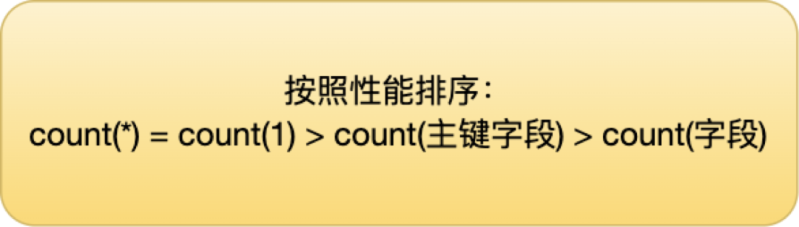

count() 是一个聚合函数，函数的参数不仅可以是字段名，也可以是其他任意表达式，该函数作用是**统计符合查询条件的记录中，函数指定的参数不为 NULL 的记录有多少个。** 

> `count(name)`统计name不会NULL的记录数量，而`count(1)≈count(*)`会统计所有记录无论是否NULL

count(1)、 count(*)、 count(主键字段)在执行的时候，如果表里存在二级索引，优化器就会选择二级索引进行扫描。所以尽量在数据表上建立二级索引，这样优化器会自动采用 key_len 最小的二级索引进行扫描，相比于扫描主键索引效率会高一些。

再来，就是不要使用 count(字段) 来统计记录个数，因为它的效率是最差的，会采用全表扫描的方式来统计。如果你非要统计表中该字段不为 NULL 的记录个数，建议给这个字段建立一个二级索引。

> 如何优化Count(*)？
>
> - 近似值
>
>   使用explain 或 show table status 查询记录估算值
>
> - 额外表记录总数

##### 一条 sql 语句，匹配到了一条语句，会加什么锁，锁表还是锁行

如果是 InnoDB 引擎，SQL 匹配到了一条记录时，通常会加**行锁**，不会锁整张表。但前提是要有合适的索引命中，否则可能退化为**锁表（或全表行锁）**。比如 `UPDATE/DELETE` 语句会根据条件加**排他行锁（x锁）**，`SELECT ... FOR UPDATE` 会加行锁。如果没有索引，就会锁所有可能匹配的记录，形成锁表行为。

> ```sql
> -- 常用于悲观锁场景：
> -- 先读，再修改，确保这行数据在你事务执行期间不会被其他人改动。
> BEGIN;
> SELECT stock FROM goods WHERE id=1001 FOR UPDATE;
> -- 拿到库存后，业务逻辑检查是否够卖FOR UPDATE 只有在 事务中 才有意义，必须配合 BEGIN/COMMIT。
> UPDATE goods SET stock = stock - 1 WHERE id=1001;
> COMMIT;
> ```
>
> `FOR UPDATE` 只有在 **事务中** 才有意义，必须配合 `BEGIN/COMMIT`。
>
> **InnoDB 必须命中索引**，才能锁住具体行，否则会退化为全表锁（其实是全表行锁）。
>
> 锁的粒度：
>
> - 精确匹配主键 → **行锁**
> - 范围条件（BETWEEN, >, <）→ **Next-Key Lock（行锁+间隙锁）**
> - 无索引 → **全表锁**

**对于模糊查询, 范围查询，in ( ) ,等等查询条件，该怎么建立索引来满足需要？**

> **模糊查询**： %a%类型的不支持最左前缀原则，无法走索引，使用 **倒排索引（如ES）** 或者 全文索引（MySQL中：FULLTEXT）
>
> **范围查询：**
>
> ```sql
> CREATE INDEX idx (a, b, c);
> SELECT * FROM table WHERE a = 1 AND b > 10 AND c = 5;
> ```
>
> 查询会使用 `a=1 AND b>10` 命中索引，但**c 无法继续命中索引**
>
> **IN 查询**
>
> ```sql
> SELECT * FROM user WHERE id IN (1, 2, 3);
> ```
>
> - **等价于多次 `=` 查询**，可以走索引
> - 在 **单列索引**下表现很好
> - `IN` 和多个 `OR` 查询相比更优，因为优化器可以做 IN 展开

| 查询类型       | 索引建议                                 |
| -------------- | ---------------------------------------- |
| `%模糊%`       | 建立全文索引（MyISAM/Innodb支持）        |
| `xxx%`         | 可以用B+树索引                           |
| `IN`           | 使用单列索引或合适组合索引               |
| `范围查询`     | 单列可以，组合索引注意范围字段后字段失效 |
| 多字段组合查询 | 优先将**过滤性强的字段放前面**建联合索引 |
| 多种查询混用   | 考虑建多个索引 + 覆盖索引 + 查询改写     |


#### 事务

什么是数据库事务？

> **事务**：一组逻辑操作单元，使数据从一种状态变换到另一种状态。 
>
> **事务处理的原则**：保证所有事务都作为 一个工作单元 来执行，即使出现了故障，都不能改变这种执行方 式。当在一个事务中执行多个操作时，要么所有的事务都被提交( commit )，那么这些修改就 永久 地保 存下来；要么数据库管理系统将 放弃 所作的所有 修改 ，整个事务回滚( rollback )到最初状态。

##### ACID特性

- **原子性**：原子性是指事务是一个不可分割的工作单位，要么全部提交，要么全部失败回滚。
- **一致性**：根据定义，一致性是指事务执行前后，数据从一个 合法性状态 变换到另外一个 合法性状态 。这种状态是 语义上 的而不是语法上的，跟具体的业务有关。
- **隔离性**：事务的隔离性是指一个事务的执行 不能被其他事务干扰 ，即一个事务内部的操作及使用的数据对 并发 的其他事务是隔离的，并发执行的各个事务之间不能互相干扰。
- **持久性：**持久性是指一个事务一旦被提交，它对数据库中数据的改变就是 永久性的 ，接下来的其他操作和数据库故障不应该对其有任何影响。

##### **ACID怎么实现的**

**原子性**： 事务是一个不可分割的操作，要么全部执行，要么全部回滚。

> 每次开启一个事务，则mysql的innodb引擎就会生成一张**undo log**文件，该文件主要记录这个事务ID所产生的一些更新、删除、插入操作。当事务1执行update的时候，就会将**udpate记录到undo log文件，当事务进行commit的时候，就会将undo log文件删除**，如果回滚时，则会根据undo log文件的内容进行执行插入回滚SQL脚本。

**一致性** :事务执行前后，数据库的状态必须保持一致。

> 从**数据库层面**，数据库通过原子性、隔离性、持久性来保证一致性。C(一致性)是目的，A(原子性)、I(隔离性)、D(持久性)是手段，是为了保证一致性，数据库提供的手段。数据库必须要实现AID三大特性，才有可能实现一致性。 从**应用层面**，通过代码判断数据库数据是否有效，然后决定回滚还是提交数据

**隔离性**：多个事务并发执行时，不能相互干扰，保证数据的正确性。

> **锁机制**
>
> - **行锁（Record Lock）**：`SELECT ... FOR UPDATE`，锁定一行数据。
> - **间隙锁（Gap Lock）**：防止“幻读”现象。
> - **Next-Key Lock**：行锁 + 间隙锁，避免幻读。
>
> **MVCC（多版本并发控制）**
>
> - **读取快照数据**，避免加锁，提高并发性能

**持久化**： 事务一旦提交，即使数据库崩溃，数据也不会丢失。

> Mysql是先把磁盘上的数据加载到内存中，在内存中对数据进行修改，再刷回磁盘上。事务提交前，先写入 **Redo Log**，保证即使数据库宕机也能恢复。当数据库宕机重启的时候，会将redo log中的内容恢复到数据库中，再根据undo log和binlog内容决定回滚数据还是提交数据。 

##### **隔离级别与对应问题**


> | 隔离级别                    | 脏读   | 不可重复读 | 幻读   | 原因                                                         | 主要机制                 |
> | --------------------------- | ------ | ---------- | ------ | ------------------------------------------------------------ | ------------------------ |
> | **READ UNCOMMITTED**        | 可能   | 可能       | 可能   | 允许事务读取未提交数据，可能直接覆盖修改                     | 直接读取未提交数据       |
> | **READ COMMITTED**          | 不可能 | 可能       | 可能   | 事务能读取已提交数据，但不会锁定，可能发生丢失修改           | 读取最新提交版本（MVCC） |
> | **REPEATABLE READ（默认）** | 不可能 | 不可能     | 可能   | 只保证事务内多次读取同样的记录的结果是一致的，不保证数据不会被其他事务改动 | MVCC + Next-Key Lock     |
> | **SERIALIZABLE**            | 不可能 | 不可能     | 不可能 | 事务串行化，避免并发修改                                     | 事务串行执行             |
>
> - 对于「读未提交」隔离级别的事务来说，因为可以读到未提交事务修改的数据，所以直接读取最新的数据就好了；
> - 对于「串行化」隔离级别的事务来说，通过加读写锁的方式来避免并行访问；
> - 对于「读提交」和「可重复读」隔离级别的事务来说，它们是通过 Read View 来实现的，它们的区别在于创建 Read View 的时机不同，**读提交」隔离级别是在「每个语句执行前」都会重新生成一个 Read View，而「可重复读」隔离级别是「启动事务时」生成一个 Read View，然后整个事务期间都在用这个 Read View。**
> - **这种通过「版本链」来控制并发事务访问同一个记录时的行为就叫 MVCC（多版本并发控制）。**

并发事务的问题：

- **脏读 Dirty Read** 当一个事务正在访问数据并且对数据进行了修改，而这种修改还**没有提交到数据库中**，这时另外一个事务也访问了这个数据，然后使用了这个数据。因为这个数据是还没有提交的数据，那么另外一个事务读到的这个数据是“脏数据”，有回滚可能。
- **丢失修改 Lost to modify** 指在一个事务读取一个数据时，另外一个事务也访问了该数据，那么在第一个事务中修改了这个数据后，第二个事务也修改了这个数据。这样第一个事务内的修改结果就被丢失，因此称为丢失修改
- **不可重复读 Unrepeatable Read** 指在一个事务内多次读同一数据结果不一样。事务 A 多次读取同一数据，事务 B 在事务 A 多次读取的过程中，对数据作了更新并提交，导致事务 A 多次读取同一数据时，结果 不一致。
- **幻读 Phantom Read** 幻读与不可重复读类似。它发生在一个事务（T1）读取了几行数据，接着另一个并发事务（T2）插入了一些数据时。在随后的查询中，第一个事务（T1）就会发现多了一些原本不存在的记录，就好像发生了幻觉一样，所以称为幻读. 侧重点为新增或删除.如果出现前后两次查询到的记录数量不一样的情况，就意味着发生了「幻读」现象。

##### MVCC实现原理

MVCC是通过保存数据在某个时间点的快照来实现的. 根据事务开始的时间不同, 每个事务对同一张表, 同一时刻看到数据可能是不一样的. 

MVCC实现依赖于: **隐藏字段**, **Read View**, **undo log**

隐藏字段主要包含:

- ROW ID : 隐藏的自增ID, 如果表没有主键, InnoDB 会自动按 ROW ID 产生一个聚簇索引树
- 事务 ID : 记录最后一次修改该记录的事务ID
- 回滚指针 : 指向这条记录的上一个版本

InnoDB 每行数据都有一个隐藏的回滚指针, 用于指向该行数据修改前的最后一个历史版本, 这个历史版本会存放在 undo log 中. 如果要执行更新操作, 会将原记录放入 undo log 中, 并通过隐藏指针指向 undo log 中的原记录. 其他事务此时需要查询时, 就是查询 undo log 中这行数据的最后一个历史版本.

但是 undo log 总不可能一直保留. 在不需要的时候它应该被删除, 这时就交由系统自动判断, 即当系统没有比这个 undo log 更早的 read-view 的时候. 所以尽量不要使用长事务, 长事务意味着系统里会存在非常古老的事务视图. 由于这些事务随时可能访问数据库中任何数据, 所以这个事务提交前, 数据库里它可能使用到的 undo log 都必须保存, 导致占用大量存储空间.

##### 事务的隔离级别是怎么实现的

**1.READ UNCOMMITTED（读未提交）**

- **特征**：事务可以读取其他事务尚未提交的数据（脏读），这种情况可能导致读取到的值是无效的（不一致的）。
- **实现**：数据库在这个级别不做任何锁的控制，因此并发性非常高，但会导致数据不一致的问题。

2. **READ COMMITTED（读已提交）**

- **特征**：事务只能读取已经提交的其他事务的数据。换句话说，事务内的查询只能看到其他事务已提交的数据。
- **实现**：对于每一个读取操作，MySQL会使用**共享锁**（S锁），当某个事务对数据行加锁时，其他事务不能修改该行数据，但可以读取已提交的数据。
- **问题**：不可重复读问题仍然存在，即同一个事务的多次查询可能返回不同的数据。


##### 幻读的解决

> 对于幻读现象，不建议将隔离级别升级为串行化，因为这会导致数据库并发时性能很差。MySQL InnoDB 引擎的默认隔离级别虽然是「可重复读」，但是它很大程度上避免幻读现象，解决的方案有两种：

- 针对快照读（普通 select 语句），是通过 MVCC 方式解决了幻读，因为可重复读隔离级别下，事务执行过程中看到的数据，一直跟这个事务启动时看到的数据是一致的，即使中途有其他事务插入了一条数据，是查询不出来这条数据的，所以就很好了避免幻读问题。
- 针对当前读（select ... for update 等语句），是通过 next-key lock（记录锁+间隙锁）方式解决了幻读，因为当执行 select ... for update 语句的时候，会加上 next-key lock，如果有其他事务在 next-key lock 锁范围内插入了一条记录，那么这个插入语句就会被阻塞，无法成功插入，所以就很好了避免幻读问题。

#### 事务高频面试题

##### 1.redo log写入时宕机会怎么样

> MySQL 的持久化机制主要依赖 **Redo Log（重做日志）** 和 **Binlog（归档日志）**
>
> **情况1：Redo Log 还没完全写入磁盘（宕机前数据仅在内存中）**
>
> - 数据会丢失/不一致！
> - Redo Log 还没写入磁盘，只在内存中，宕机后数据丢失，事务无法恢复。
> - 可能会出现 Redo Log 记录不完整，导致 MySQL 在恢复时无法正确回放事务。
>
> **情况2：Redo Log 全部写入磁盘，但数据页未刷新**
>
> - 数据不会丢失，宕机恢复时会重做
> - Redo Log 采用 WAL（先写日志，后写数据） 机制：
>   1. 事务提交时，先将 Redo Log 写入磁盘（顺序写，性能高）。
>   2. 之后通过 Checkpoint 机制，将数据刷入数据页。
>   3. 如果宕机发生在 Redo Log 写完、但数据页未刷盘，MySQL 启动后会用 Redo Log 重放事务，确保数据一致性。

**如何防止 Redo Log 写入时宕机导致的数据丢失**

> **双写缓冲（Double Write Buffer）**
>
> - InnoDB 采用 **双写（Double Write）机制**，先将数据页写入 **Double Write Buffer**，再写入数据文件。
> - 如果 **Redo Log** 只写了一半，但 **Double Write Buffer** 里有完整数据，可以用它恢复。
>
> **事务提交策略（事务持久化）**
>
> MySQL 通过 `innodb_flush_log_at_trx_commit` 控制事务日志的写入策略：
>
> - `innodb_flush_log_at_trx_commit = 0`：**只写入内存，不刷磁盘**，宕机会丢数据。
> - `innodb_flush_log_at_trx_commit = 1`（**默认**）：**每次事务提交时，Redo Log 刷盘**，保证事务持久化，不会丢数据。
> - `innodb_flush_log_at_trx_commit = 2`：**事务提交时写 OS 缓冲区，周期性刷盘**，可能会丢事务数据。
>
> **文件系统的保障**
>
> - Redo Log 通常写入 **WAL 日志文件（ib_logfile）**，如果宕机导致日志文件损坏，MySQL 在启动时会自动检测并尝试修复。


>1. 什么是事务
>
>2. 事务的四个特征
>
>3. MySQL四种隔离级别
>
>4. 什么是脏读? 幻读? 不可重复读?
>
>5. 事务是如何实现的(原理) ? redo log 实现原子和持久性 undo log 
>
>6. 介绍下MySQL事务日志? redo log和undo log?
>
>7. **什么是binlog?**
>
>8. 了解MVCC吗?说下什么是MVCC?
>
>9. MVCC实现原理? 有什么好处?
>
>10. 为什么需要加锁?
>
>11. **MySQL锁粒度?**
>
>12. **MySQL有哪些锁?**
>
>13. 乐观锁和悲观锁是什么?如何实现?
>
>14. InnoDB的行锁是如何实现的?
>
>    > 行级锁是基于索引实现的，而不是锁定物理行记录。因此，如果查询没有命中索引，将退化为表锁
>    >
>    > 1. **共享锁**：通过 *SELECT ... LOCK IN SHARE MODE* 语句触发[1](https://developer.aliyun.com/article/1169477)。
>    > 2. **排他锁**：通过 *SELECT ... FOR UPDATE*、*UPDATE*、*DELETE* 和 *INSERT* 语句触发[1](https://developer.aliyun.com/article/1169477)。
>
>15. 什么是两阶段锁协议?
>
>    > 锁两阶段协议是并发控制的一个经典方法，其原理分为两个阶段：
>    >
>    > - 扩展阶段：事务可以申请锁，但不能释放锁.
>    > - 收缩阶段：事务可以释放锁，但不能再申请新的锁。
>    >
>    > 这种策略确保了在同一时间内，最多只有一个事务能对某一数据对象进行操作，从而避免出现脏读、不可重复读和幻读等问题。

#### 锁种类和机制

在 MySQL 里，根据加锁的范围，可以分为全局锁、表级锁和行锁三类。

表级锁有：

- 表锁
- 元数据锁MDL：对数据库表进行操作时，会自动给这个表加上 MDL：对一张表进行 CRUD 操作时，加的是 MDL 读锁；表结构变更时加的是MDL写锁

- 意向锁：意向共享锁和意向独占锁是表级锁，不会和行级的共享锁和独占锁发生冲突，而且意向锁之间也不会发生冲突，只会和共享表锁（lock tables ... read）和独占表锁（lock tables ... write）发生冲突。**意向锁的目的是为了快速判断表里是否有记录被加锁。**
- AUTO-INC锁：在插入数据的时候，会为被 AUTO_INCREMENT 修饰的字段加上轻量级锁，然后给该字段赋值一个自增的值，就把这个轻量级锁释放了，而不需要等待整个插入语句执行完后才释放锁。自增ID设置使用

行级锁(InnoDB支持)：

- Record Lock，记录锁，也就是仅仅把一条记录锁上；(读提交下只有这种)
- Gap Lock，间隙锁，锁定一个范围，但是不包含记录本身；
- **Next-Key Lock：Record Lock + Gap Lock 的组合**，锁定一个范围，并且锁定记录本身

行级锁加锁规则比较复杂，不同的场景，加锁的形式是不同的。

**加锁的对象是索引**，加锁的基本单位是 next-key lock，它是由记录锁和间隙锁组合而成的，next-key lock 是前开后闭区间，而间隙锁是前开后开区间。

在能使用记录锁或者间隙锁就能避免幻读现象的场景下， next-key lock 就会退化成记录锁或间隙锁。

#### 日志系统

##### 为什么需要 undo log？

- 实现事务回滚，保障事务的原子性。事务处理过程中，如果出现了错误或者用户执 行了 ROLLBACK 语句，MySQL 可以利用 undo log 中的历史数据将数据恢复到事务开始之前的状态。
- 实现 MVCC（多版本并发控制）关键因素之一。MVCC 是通过 ReadView + undo log 实现的。undo log 为每条记录保存多份历史数据，MySQL 在执行快照读（普通 select 语句）的时候，会根据事务的 Read View 里的信息，顺着 undo log 的版本链找到满足其可见性的记录。

##### 为什么需要 Buffer Pool？

- 当读取数据时，如果数据存在于 Buffer Pool 中，客户端就会直接读取 Buffer Pool 中的数据，否则再去磁盘中读取。
- 当修改数据时，如果数据存在于 Buffer Pool 中，那直接修改 Buffer Pool 中数据所在的页，然后将其页设置为脏页（该页的内存数据和磁盘上的数据已经不一致），为了减少磁盘I/O，不会立即将脏页写入磁盘，后续由后台线程选择一个合适的时机将脏页写入到磁盘。

> **Buffer Pool 缓存什么？**
> InnoDB 会把存储的数据划分为若干个「页」，以页作为磁盘和内存交互的基本单位，一个页的默认大小为 16KB。因此，Buffer Pool 同样需要按「页」来划分。
>
> 在 MySQL 启动的时候，InnoDB 会为 Buffer Pool 申请一片连续的内存空间，然后按照默认的16KB的大小划分出一个个的页， Buffer Pool 中的页就叫做缓存页。此时这些缓存页都是空闲的，之后随着程序的运行，才会有磁盘上的页被缓存到 Buffer Pool 中。
>
> 所以，MySQL 刚启动的时候，你会观察到使用的虚拟内存空间很大，而使用到的物理内存空间却很小，这是因为只有这些虚拟内存被访问后，操作系统才会触发缺页中断，申请物理内存，接着将虚拟地址和物理地址建立映射关系。
>
> Buffer Pool 除了缓存「索引页」和「数据页」，还包括了 Undo 页，插入缓存、自适应哈希索引、锁信息等等。

##### 为什么需要 redo log ？

- 实现事务的持久性，让 MySQL 有 crash-safe 的能力，能够保证 MySQL 在任何时间段突然崩溃，重启后之前已提交的记录都不会丢失；
- 将写操作从「随机写」变成了「顺序写」，提升 MySQL 写入磁盘的性能。

> 为了防止断电导致数据丢失的问题，当有一条记录需要更新的时候，InnoDB 引擎就会先更新内存（同时标记为脏页），然后将本次对这个页的修改以 redo log 的形式记录下来，这个时候更新就算完成了。
>
> WAL 技术指的是， MySQL 的写操作并不是立刻写到磁盘上，而是先写日志，然后在合适的时间再写到磁盘上。
>
> **redo log 要写到磁盘，数据也要写磁盘，为什么要多此一举？**
>
> 写入 redo log 的方式使用了追加操作， 所以磁盘操作是顺序写，而写入数据需要先找到写入位置，然后才写到磁盘，所以磁盘操作是随机写。
>
> **产生的 redo log 是直接写入磁盘的吗？**
>
> 不是的。每当产生一条 redo log 时，会先写入到 redo log buffer，后续在持久化到磁盘
>
> **redo log 什么时候刷盘？**
>
> MySQL 正常关闭时；
> 当 redo log buffer 中记录的写入量大于 redo log buffer 内存空间的一半时，会触发落盘；
> InnoDB 的后台线程每隔 1 秒，将 redo log buffer 持久化到磁盘。
> 每次事务提交时都将缓存在 redo log buffer 里的 redo log 直接持久化到磁盘
>
> **redo log 满了怎么办**
>
> redo log 文件满了，这时 MySQL 不能再执行新的更新操作，也就是说 MySQL 会被阻塞（因此所以针对并发量大的系统，适当设置 redo log 的文件大小非常重要），此时会停下来将 Buffer Pool 中的脏页刷新到磁盘中，然后标记 redo log 哪些记录可以被擦除，接着对旧的 redo log 记录进行擦除，等擦除完旧记录腾出了空间，checkpoint 就会往后移动（图中顺时针），然后 MySQL 恢复正常运行，继续执行新的更新操作。
>
> > **Redo Log 是循环写的环形结构**！
> >
> > 1. 写到文件末尾后，会回到起点重新写；
> > 2. 但不能覆盖“还没 checkpoint 的内容”；
> > 3. 如果写满又不能 checkpoint，就会**阻塞新事务提交**（写不了日志）；

##### binlog？

redo log 和 undo log都是innodb引擎生成的，但是binlog是mysql server层生成的。

MySQL 的二进制日志（Binlog）有三种工作模式，分别对应不同的数据记录方式

- STATEMENT 模式：Binlog 直接存储 **执行的 SQL 语句**（如 `UPDATE`、`INSERT`）。

- ROW 模式（默认）：Binlog 存储 **数据行的变更细节**（修改前的旧值和修改后的新值）。
- mix：根据 SQL 的复杂度自动切换 STATEMENT 和 ROW 模式。


binlog 文件是记录了所有数据库表结构变更和表数据修改的日志，不会记录查询类的操作，比如 SELECT 和 SHOW 操作。

> bin log 刷盘时机
>
> 事务执行过程中，先把日志写到 binlog cache（Server 层的 cache），事务提交的时候，再把 binlog cache 写到 binlog 文件中

> **update 执行过程**
>
> 当优化器分析出成本最小的执行计划后，执行器就按照执行计划开始进行更新操作。
>
> 具体更新一条记录 UPDATE t_user SET name = 'xiaolin' WHERE id = 1; 的流程如下:
>
> 1.执行器负责具体执行，会调用存储引擎的接口，通过主键索引树搜索获取 id = 1 这一行记录：
>
> - 如果 id=1 这一行所在的数据页本来就在 buffer pool 中，就直接返回给执行器更新；
>
> - 如果记录不在 buffer pool，将数据页从磁盘读入到 buffer pool，返回记录给执行器。
>
> 2.执行器得到聚簇索引记录后，会看一下更新前的记录和更新后的记录是否一样：
>
> - 如果一样的话就不进行后续更新流程；
> - 如果不一样的话就把更新前的记录和更新后的记录都当作参数传给 InnoDB 层，让 InnoDB 真正的执行更新记录的操作；
>
> 3.开启事务， InnoDB 层更新记录前，首先要记录相应的 undo log，因为这是更新操作，需要把被更新的列的旧值记下来，也就是要生成一条 undo log，undo log 会写入 Buffer Pool 中的 Undo 页面，不过在内存修改该 Undo 页面后，需要记录对应的 redo log。
>
> 4.InnoDB 层开始更新记录，会先更新内存（同时标记为脏页），然后将记录写到 redo log 里面，这个时候更新就算完成了。为了减少磁盘I/O，不会立即将脏页写入磁盘，后续由后台线程选择一个合适的时机将脏页写入到磁盘。这就是 WAL 技术，MySQL 的写操作并不是立刻写到磁盘上，而是先写 redo 日志，然后在合适的时间再将修改的行数据写到磁盘上。至此，一条记录更新完了。
>
> 5.在一条更新语句执行完成后，然后开始记录该语句对应的 binlog，此时记录的 binlog 会被保存到 binlog cache，并没有刷新到硬盘上的 binlog 文件，在事务提交时才会统一将该事务运行过程中的所有 binlog 刷新到硬盘。

> 事务提交，剩下的就是「两阶段提交」的事情了，接下来就讲这个。

##### 为什么需要两阶段提交？

> **事务提交后，redo log 和 binlog 都要持久化到磁盘，但是这两个是独立的逻辑，可能出现半成功的状态，这样就造成两份日志之间的逻辑不一致。**
>
> 举个例子，假设 id = 1 这行数据的字段 name 的值原本是 'jay'，然后执行 UPDATE t_user SET name = 'xiaolin' WHERE id = 1; 如果在持久化 redo log 和 binlog 两个日志的过程中，出现了半成功状态，那么就有两种情况：
>
> **如果在将 redo log 刷入到磁盘之后， MySQL 突然宕机了，而 binlog 还没有来得及写入。**MySQL 重启后，通过 redo log 能将 Buffer Pool 中 id = 1 这行数据的 name 字段恢复到新值 xiaolin，但是 binlog 里面没有记录这条更新语句，在主从架构中，binlog 会被复制到从库，由于 binlog 丢失了这条更新语句，从库的这一行 name 字段是旧值 jay，与主库的值不一致性；
> **如果在将 binlog 刷入到磁盘之后， MySQL 突然宕机了，而 redo log 还没有来得及写入。**由于 redo log 还没写，崩溃恢复以后这个事务无效，所以 id = 1 这行数据的 name 字段还是旧值 jay，而 binlog 里面记录了这条更新语句，在主从架构中，binlog 会被复制到从库，从库执行了这条更新语句，那么这一行 name 字段是新值 xiaolin，与主库的值不一致性；
> 可以看到，**在持久化 redo log 和 binlog 这两份日志的时候，如果出现半成功的状态，就会造成主从环境的数据不一致性。**这是因为 redo log 影响主库的数据，binlog 影响从库的数据，所以 redo log 和 binlog 必须保持一致才能保证主从数据一致。

两阶段提交把单个事务的提交拆分成了 2 个阶段，分别是「准备（Prepare）阶段」和「提交（Commit）阶段」

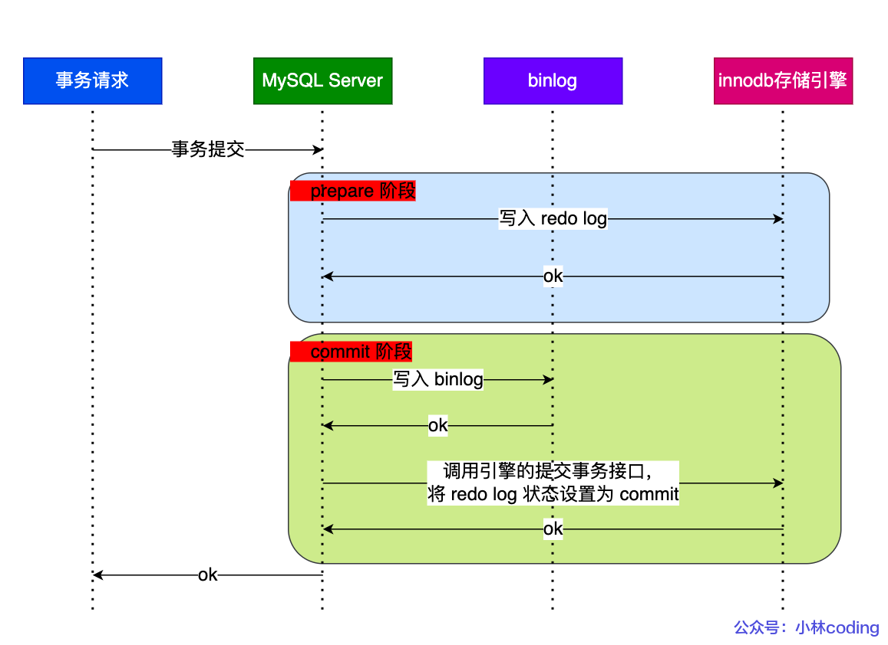

从图中可看出，事务的提交过程有两个阶段，就是将 redo log 的写入拆成了两个步骤：prepare 和 commit，中间再穿插写入binlog，具体如下：

prepare 阶段：将 XID（内部 XA 事务的 ID） 写入到 redo log，同时将 redo log 对应的事务状态设置为 prepare，然后将 redo log 持久化到磁盘（innodb_flush_log_at_trx_commit = 1 的作用）；

commit 阶段：把 XID 写入到 binlog，然后将 binlog 持久化到磁盘（sync_binlog = 1 的作用），接着调用引擎的提交事务接口，将 redo log 状态设置为 commit，此时该状态并不需要持久化到磁盘，只需要 write 到文件系统的 page cache 中就够了，因为只要 binlog 写磁盘成功，就算 redo log 的状态还是 prepare 也没有关系，一样会被认为事务已经执行成功；

##### 事务没提交的时候，redo log 会被持久化到磁盘吗？

事务执行中间过程的 redo log 也是直接写在 redo log buffer 中的，这些缓存在 redo log buffer 里的 redo log 也会被「后台线程」每隔一秒一起持久化到磁盘。

>  如果 mysql 崩溃了，还没提交事务的 redo log 已经被持久化磁盘了，mysql 重启后，数据不就不一致了？
>
> 这种情况 mysql 重启会进行回滚操作，因为事务没提交的时候，binlog 是还没持久化到磁盘的。
>
> 所以， redo log 可以在事务没提交之前持久化到磁盘，但是 binlog 必须在事务提交之后，才可以持久化到磁盘。

| 宕机时机     | redo log | binlog | 恢复结果              | 主从一致性 |
| ------------ | -------- | ------ | --------------------- | ---------- |
| prepare 阶段 | 已写     | 未写   | 回滚事务              | ✅ 一致     |
| commit 阶段  | 已写     | 已写   | 事务提交，redo 可恢复 | ✅ 一致     |

事务对客户端可见前，必须保证 binlog 写入，否则宕机直接回滚，不对外提交 → 避免 redo+binlog 不一致。

##### MySQL 磁盘 I/O 很高，有什么优化的方法？ 

现在我们知道事务在提交的时候，需要将 binlog 和 redo log 持久化到磁盘，那么如果出现 MySQL 磁盘 I/O 很高的现象，我们可以通过控制以下参数，来 “延迟” binlog 和 redo log 刷盘的时机，从而降低磁盘 I/O 的频率：

- 设置组提交的两个参数： binlog_group_commit_sync_delay 和 binlog_group_commit_sync_no_delay_count 参数，延迟 binlog 刷盘的时机，从而减少 binlog 的刷盘次数。这个方法是基于“额外的故意等待”来实现的，因此可能会增加语句的响应时间，但即使 MySQL 进程中途挂了，也没有丢失数据的风险，因为 binlog 早被写入到 page cache 了，只要系统没有宕机，缓存在 page cache 里的 binlog 就会被持久化到磁盘。
- 将 sync_binlog 设置为大于 1 的值（比较常见是 100~1000），表示每次提交事务都 write，但累积 N 个事务后才 fsync，相当于延迟了 binlog 刷盘的时机。但是这样做的风险是，主机掉电时会丢 N 个事务的 binlog 日志。
- 将 innodb_flush_log_at_trx_commit 设置为 2。表示每次事务提交时，都只是缓存在 redo log buffer 里的 redo log 写到 redo log 文件，注意写入到「 redo log 文件」并不意味着写入到了磁盘，因为操作系统的文件系统中有个 Page Cache，专门用来缓存文件数据的，所以写入「 redo log文件」意味着写入到了操作系统的文件缓存，然后交由操作系统控制持久化到磁盘的时机。但是这样做的风险是，主机掉电的时候会丢数据

#### 读写分离、主从同步

binlog （归档日志）：是 Server 层生成的日志，主要用于数据备份和主从复制；

##### 1. 什么是MySQL主从同步？

主从同步使得数据可以从一个数据库服务器复制到其他服务器上，在复制数据时，一个服务器充当主服务器（master），其余的服务器充当从服务器（slave）。 因为复**制是异步进行的**，所以从服务器不需要一直连接着主服务器，从服务器甚至可以通过拨号断断续续地连接主服务器。通过配置文件，可以指定复制所有的数据库，某个数据库，甚至是某个数据库上的某个表。


##### 2. MySQL主从同步的目的？为什么要做主从同步？

1. **通过增加从服务器来提高数据库的性能**，在主服务器上执行**写入和更新**，在从服务器上**向外提供读功能**，可以动态地调整从服务器的数量，从而调整整个数据库的性能。
2. **提高数据安全**-因为数据已复制到从服务器，从服务器可以终止复制进程，所以，可以在从服务器上备份而不破坏主服务器相应数据
3. **在主服务器上生成实时数据**，而在从服务器上分析这些数据，从而提高主服务器的性能
4. **数据备份**。一般我们都会做数据备份，可能是写定时任务，一些特殊行业可能还需要手动备份，有些行业要求备份和原数据不能在同一个地方，所以主从就能很好的解决这个问题，不仅备份及时，而且还可以多地备份，保证数据的安全

##### 3. 如何实现MySQL的读写分离？

其实很简单，就是基于主从复制架构，简单来说，就搞一个主库，挂多个从库，然后我们就单单只是写主库，然后主库会自动把数据给同步到从库上去。

##### 4. MySQL主从复制流程和原理？

答案：MySQL 主从复制通过 Binlog 机制实现数据同步，从库使用 IO 线程拉取主库 binlog 写入 relay log，SQL 线程读取 relay log，并执行对应的 SQL，达到与主库一致。支持异步、半同步和 GTID 模式。它是实现读写分离、高可用的重要基础，但也面临主从延迟和一致性问题，生产中通常结合 MGR 或 Orchestrator 做更高层次管理。

- 主从复制依赖 **binlog**，它是“数据变更日志”。从库通过 **IO 线程**获取 binlog，存到 **relay log**，再由 **SQL 线程**执行，重放主库的操作。这样从库的数据就和主库保持一致。

整个过程就是 **"写 binlog → 传输 → 重放"**：

1. **主库写 binlog**
   - 当事务在主库提交时，写入 binlog 文件。
   - binlog 记录了变更操作的事件（如 "UPDATE t SET x=1 WHERE id=2"）。
2. **从库拉取 binlog**
   - 从库上有一个 **IO 线程**，会连接到主库，请求从某个位置开始的 binlog。
   - 主库的 **binlog dump 线程** 负责把 binlog 推送给从库。
3. **从库重放 binlog**
   - 从库 IO 线程写入本地的 **relay log（中继日志）**。
   - 从库的 **SQL 线程** 读取 relay log，按顺序执行里面的 SQL 事件，更新从库数据。

>① 异步复制（Asynchronous Replication）
>
>- **主库提交事务立即返回**，不等待从库确认；
>- 风险：主库宕机会有数据丢失；
>- 优点：性能好。
>
>② 半同步复制（Semi-synchronous）
>
>- 主库提交事务时，至少要 **等待一个从库确认收到 binlog** 才算提交；
>- 风险低，性能略逊异步。
>
>③ GTID复制（全局事务ID）
>
>- 给每个事务生成全局唯一 ID，方便故障恢复、主从切换；
>- 推荐使用（`gtid_mode=ON`）。


基本原理流程，是3个线程以及之间的关联

主：binlog线程——记录下所有改变了数据库数据的语句，放进master上的binlog中； 

从：io线程——在使用start slave 之后，负责从master上拉取 binlog 内容，放进自己的relay log中； 

从：sql执行线程——执行relay log中的语句； **复制过程如下**： [](https://camo.githubusercontent.com/1965f9251a7d8e2b33f992f099272bb09c9e7e25747175636117a90ea00793a8/68747470733a2f2f63646e2e6e6c61726b2e636f6d2f79757175652f302f323032322f6a7065672f32323231393438332f313634373136303334373336352d32383565353565612d386133352d343031652d616363662d6161646265386264633936392e6a70656723617665726167654875653d25323366636663666326636c69656e7449643d7534346632626138662d316466652d342666726f6d3d70617374652669643d753033383339663737266f726967696e4865696768743d353236266f726967696e57696474683d373333266f726967696e616c547970653d75726c26726174696f3d3126726f746174696f6e3d302673686f775469746c653d66616c7365267374617475733d646f6e65267374796c653d6e6f6e65267461736b49643d7538303264636366332d376533652d343161342d393135342d3736663036636630363665267469746c653d) 

Binary log：主数据库的二进制日志 

Relay log：从服务器的中继日志 

第一步：master在每个事务更新数据完成之前，将该操作记录串行地写入到binlog文件中。 第二步：salve开启一个I/O Thread，该线程在master打开一个普通连接，主要工作是binlog dump process。如果读取的进度已经跟上了master，就进入睡眠状态并等待master产生新的事件。I/O线程最终的目的是将这些事件写入到中继日志中。 第三步：SQL Thread会读取中继日志，并顺序执行该日志中的SQL事件，从而与主数据库中的数据保持一致。


MySQL 支持几种不同的 binlog 格式，影响复制内容：

1. **Statement 模式**（基于 SQL 语句）
   - binlog 记录 SQL 语句。
   - 可能导致结果不一致（如 now()、uuid()）。
2. **Row 模式**（基于行变化）
   - binlog 记录每行数据的变化。
   - 数据更安全，但 binlog 更大。
3. **Mixed 模式**（混合模式）
   - MySQL 自动选择合适的模式。


##### 5. MySQL主从同步延时问题如何解决？

答案：主从延迟主要是从库执行 relay log 变更慢导致的，可以通过**提升硬件性能、开启多线程复制、优化主库写入、控制大事务、监控延迟指标**等方式进行优化。同时在架构层面可以通过**延迟感知读写分离**策略保证最终一致性。

MySQL 实际上在有两个同步机制，一个是半同步复制，用来 解决**主库数据丢失**问题；一个是并行复制，用来 解决**主从同步延时**问题。

- 半同步复制，也叫 semi-sync 复制，指的就是**主库写入 binlog 日志之后，就会将强制此时立即将数据同步到从库**，从库将日志写入自己本地的 relay log 之后，接着会返回一个 ack 给主库，主库接收到至少一个从库的 ack 之后才会认为写操作完成了。
- 并行复制，指的是**从库开启多个线程**，并行读取 relay log 中不同库的日志，然后并行重放不同库的日志，这是库级别的并行。

#### buffer pool

**缓冲池（Buffer Pool）** 是 InnoDB 存储引擎中 **最重要的缓存机制**，它**缓存数据页**、**索引页**、**Undo Log** 等，提高查询速度。

**工作原理：**

1. **查询数据时，先在 Buffer Pool 里查找**
   - 如果数据已经在缓冲池里（**缓存命中**），直接返回，避免磁盘 I/O，提高性能。
   - 如果不在缓冲池里（**缓存未命中**），从磁盘读取数据并加载到缓冲池中。
2. **写入数据时，先修改 Buffer Pool**
   - InnoDB **不会立刻写入磁盘**，而是先修改缓冲池里的数据页，并将**修改操作写入 Redo Log**（**WAL 机制**）。
   - 只有在 **Checkpoint** 或内存不足时，才会将数据刷回磁盘（**Flush 操作**）。

**缓冲池的作用：**

- **减少磁盘 I/O，提高查询性能**
- **加速索引查询**
- **优化数据更新操作，减少磁盘写入**

##### 如何管理脏页？
设计 Buffer Pool 除了能提高读性能，还能提高写性能，也就是更新数据的时候，不需要每次都要写入磁盘，而是将 Buffer Pool 对应的缓存页标记为脏页，然后再由后台线程将脏页写入到磁盘。

那为了能快速知道哪些缓存页是脏的，于是就设计出 Flush 链表，它跟 Free 链表类似的，链表的节点也是控制块，区别在于 Flush 链表的元素都是脏页。

##### 如何提高缓存命中率？

LRU算法

##### 脏页什么时候会被刷入磁盘？
引入了 Buffer Pool 后，当修改数据时，首先是修改 Buffer Pool 中数据所在的页，然后将其页设置为脏页，但是磁盘中还是原数据。

因此，脏页需要被刷入磁盘，保证缓存和磁盘数据一致，但是若每次修改数据都刷入磁盘，则性能会很差，因此一般都会在一定时机进行批量刷盘。

可能大家担心，如果在脏页还没有来得及刷入到磁盘时，MySQL 宕机了，不就丢失数据了吗？

这个不用担心，InnoDB 的更新操作采用的是 Write Ahead Log 策略，即先写日志，再写入磁盘，通过 redo log 日志让 MySQL 拥有了崩溃恢复能力。

下面几种情况会触发脏页的刷新：

- 当 redo log 日志满了的情况下，会主动触发脏页刷新到磁盘；
- Buffer Pool 空间不足时，需要将一部分数据页淘汰掉，如果淘汰的是脏页，需要先将脏页同步到磁盘；
- MySQL 认为空闲时，后台线程会定期将适量的脏页刷入到磁盘；
- MySQL 正常关闭之前，会把所有的脏页刷入到磁盘；

在我们开启了慢 SQL 监控后，如果你发现**「偶尔」会出现一些用时稍长的 SQL**，这可能是因为脏页在刷新到磁盘时可能会给数据库带来性能开销，导致数据库操作抖动。

如果间断出现这种现象，就需要调大 Buffer Pool 空间或 redo log 日志的大小。


#### 分库分表问题

> 1. 为什么要分库分表？
>
>    分表 比如你单表都几千万数据了，你确定你能扛住么？绝对不行，单表数据量太大，会极大影响你的 sql执行的性能，到了后面你的 sql 可能就跑的很慢了。一般来说，就以我的经验来看，单表到几百万的时候，性能就会相对差一些了，你就得分表了。 分表就是把一个表的数据放到多个表中，然后查询的时候你就查一个表。比如按照用户 id 来分表，将一个用户的数据就放在一个表中。然后操作的时候你对一个用户就操作那个表就好了。这样可以控制每个表的数据量在可控的范围内，比如每个表就固定在 200 万以内。 
>
>    分库 分库就是你一个库一般我们经验而言，最多支撑到并发 2000，一定要扩容了，而且一个健康的单库并发值你最好保持在每秒 1000 左右，不要太大。那么你可以将一个库的数据拆分到多个库中，访问的时候就访问一个库好了。 这就是所谓的分库分表。
>
> 2. 如何对数据库如何进行垂直拆分或水平拆分的？
>
>    **水平拆分**的意思，就是把一个表的数据给弄到多个库的多个表里去，但是每个库的表结构都一样，只不过每个库表放的数据是不同的，所有库表的数据加起来就是全部数据。水平拆分的意义，就是将数据均匀放更多的库里，然后用多个库来抗更高的并发，还有就是用多个库的存储容量来进行扩容。
>
>    **垂直拆分**的意思，就是把一个有很多字段的表给拆分成多个表，或者是多个库上去。每个库表的结构都不一样，每个库表都包含部分字段。一般来说，会将较少的访问频率很高的字段放到一个表里去，然后将较多的访问频率很低的字段放到另外一个表里去。因为数据库是有缓存的，你访问频率高的行字段越少，就可以在缓存里缓存更多的行，性能就越好。这个一般在表层面做的较多一些。

#### Mysql优化

##### 如何定位及优化SQL语句的性能问题？

**MySQL提供了explain命令来查看语句的执行计划**。 我们知道，不管是哪种数据库，或者是哪种数据库引擎，在对一条SQL语句进行执行的过程中都会做很多相关的优化，对于查询语句，最重要的优化方式就是使用索引。 而执行计划，就是显示数据库引擎对于SQL语句的执行的详细情况，其中包含了是否使用索引，使用什么索引，使用的索引的相关信息等。

##### 2. 大表数据查询，怎么优化

- 优化shema、sql语句+索引；
- 第二加缓存，memcached, redis；
- 主从复制，读写分离；
- 垂直拆分，根据你模块的耦合度，将一个大的系统分为多个小的系统，也就是分布式系统；
- 水平切分，针对数据量大的表，这一步最麻烦，最能考验技术水平，要选择一个合理的sharding key, 为了有好的查询效率，表结构也要改动，做一定的冗余，应用也要改，sql中尽量带sharding key，将数据定位到限定的表上去查，而不是扫描全部的表；

##### 3. 超大分页怎么处理?

数据库层面,这也是我们主要集中关注的(虽然收效没那么大),类似于select * from table where age > 20 limit 1000000,10 这种查询其实也是有可以优化的余地的. 这条语句需要 load1000000 数据然后基本上全部丢弃,只取 10 条当然比较慢. 当时我们可以修改为select * from table where id in (select id from table where age > 20 limit 1000000,10).这样虽然也 load 了一百万的数据,但是由于索引覆盖,要查询的所有字段都在索引中,所以速度会很快。 **解决超大分页,其实主要是靠缓存,**可预测性的提前查到内容,缓存至redis等k-V数据库中,直接返回即可. 在阿里巴巴《Java开发手册》中,对超大分页的解决办法是类似于上面提到的第一种. 【推荐】利用延迟关联或者子查询优化超多分页场景。 说明：MySQL并不是跳过offset行，而是取offset+N行，然后返回放弃前offset行，返回N行，那当offset特别大的时候，效率就非常的低下，要么控制返回的总页数，要么对超过特定阈值的页数进行SQL改写。 正例：先快速定位需要获取的id段，然后再关联： SELECT a.* FROM 表1 a, (select id from 表1 where 条件 LIMIT 100000,20 ) b where a.id=b.id

##### 4. 统计过慢查询吗？对慢查询都怎么优化过？

在业务系统中，除了使用主键进行的查询，其他的我都会在测试库上测试其耗时，慢查询的统计主要由运维在做，会定期将业务中的慢查询反馈给我们。 慢查询的优化首先要搞明白慢的原因是什么？ 是查询条件没有命中索引？是load了不需要的数据列？还是数据量太大？ 所以优化也是针对这三个方向来的，

- 首先分析语句，看看是否**load了额外的数据**，可能是查询了多余的行并且抛弃掉了，可能是加载了许多结果中并不需要的列，对语句进行分析以及重写。
- 分析语句的执行计划，然后获得其使用索引的情况，之后修改语句或者修改索引，使得语句可以尽可能的**命中索引**。
- 如果对语句的优化已经无法进行，可以考虑表中的数据量是否太大，如果是的话可以进行**横向或者纵向的分表**。

##### 5. 数据库结构优化

一个好的数据库设计方案对于数据库的性能往往会起到事半功倍的效果。 需要考虑数据冗余、查询和更新的速度、字段的数据类型是否合理等多方面的内容。

**将字段很多的表分解成多个表**

对于字段较多的表，如果有些字段的使用频率很低，可以将这些字段分离出来形成新表。 因为当一个表的数据量很大时，会由于使用频率低的字段的存在而变慢。

**增加中间表**

对于需要经常联合查询的表，可以建立中间表以提高查询效率。 通过建立中间表，将需要通过联合查询的数据插入到中间表中，然后将原来的联合查询改为对中间表的查询。

**增加冗余字段**

设计数据表时应尽量遵循范式理论的规约，尽可能的减少冗余字段，让数据库设计看起来精致、优雅。但是，合理的加入冗余字段可以提高查询速度。 表的规范化程度越高，表和表之间的关系越多，需要连接查询的情况也就越多，性能也就越差。 注意： 冗余字段的值在一个表中修改了，就要想办法在其他表中更新，否则就会导致数据不一致的问题。

##### 6.mysql一般你有什么调优的经验

在 MySQL 中进行性能调优的经验涉及多个方面，从数据库设计到查询优化，再到服务器配置等。以下是一些常见的 MySQL 调优技巧：

1. 数据库设计

- 规范化：确保数据库表结构设计良好，避免数据冗余。
- 反规范化：在某些读多写少的场景下，适度的反规范化可以减少复杂查询，提高性能。
- 适当的字段类型：选择合适的数据类型，尽量使用定长类型，例如使用 `INT` 而不是 `VARCHAR` 存储数字。

2. 索引优化

- **创建合适的索引**：为频繁查询的字段创建索引，特别是主键、外键和需要排序或分组的字段。
- **覆盖索引**：通过索引覆盖查询来减少数据读取，例如 `SELECT id, name FROM users WHERE id = ?`，如果有 `id` 和 `name` 的联合索引，就可以直接从索引中获取数据而不需要读取表。
- **避免冗余索引**：删除重复或不必要的索引，减少索引维护开销。
- **复合索引**：为多列创建复合索引，可以有效加速涉及多列的查询。

3. 查询优化

- **EXPLAIN 分析查询**：使用 `EXPLAIN` 关键字来分析查询执行计划，找出性能瓶颈。
- **避免全表扫描**：确保查询条件使用了索引，避免全表扫描。
- **适当使用 JOIN 和子查询**：优化 JOIN 和子查询的使用，避免复杂的嵌套查询。
- **分页优化**：对于大数据量分页查询，避免使用 `OFFSET`，可以使用延迟关联或子查询来优化。

4. 缓存和临时表

- **查询缓存**：MySQL 支持查询缓存，但在高并发环境下可能效果不佳，可以使用应用层缓存，如 Redis。
- **临时表**：在复杂查询中，适当使用临时表可以分解查询，提高性能。

5. 配置优化

- InnoDB 引擎配置：
  - `innodb_buffer_pool_size`：设置为物理内存的 70%-80%，用于缓存数据和索引。
  - `innodb_log_file_size`：适当调整日志文件大小，提高写入性能。
  - `innodb_flush_log_at_trx_commit`：根据需求调整为 0、1 或 2，以平衡数据安全和性能。
- **查询缓存配置**：在 MySQL 8.0 中已被废弃，建议使用应用层缓存解决方案。
- **连接数配置**：调整 `max_connections` 和 `thread_cache_size`，根据并发需求设置合适的值。

6. 硬件和系统优化

- **磁盘 I/O 优化**：使用 SSD 替代 HDD，提高读写性能。
- **内存优化**：增加服务器内存，确保数据库有足够的缓存空间。
- **CPU 优化**：使用多核 CPU，确保 MySQL 可以充分利用多核性能。

##### 7. 主键如何设计的？

**自增ID的问题**

> 自增ID做主键，简单易懂，几乎所有数据库都支持自增类型，只是实现上各自有所不同而已。自增ID除 了简单，其他都是缺点，总体来看存在以下几方面的问题：

1. **可靠性不高** 存在自增ID回溯的问题，这个问题直到最新版本的MySQL 8.0才修复。
2. **安全性不高** 对外暴露的接口可以非常容易猜测对应的信息。比如：/User/1/这样的接口，可以非常容易猜测用户ID的 值为多少，总用户数量有多少，也可以非常容易地通过接口进行数据的爬取。
3. **性能差** 自增ID的性能较差，需要在数据库服务器端生成。
4. **交互多** 业务还需要额外执行一次类似 last_insert_id() 的函数才能知道刚才插入的自增值，这需要多一次的 网络交互。在海量并发的系统中，多1条SQL，就多一次性能上的开销。
5. **局部唯一性** 最重要的一点，自增ID是局部唯一，**只在当前数据库实例中唯一**，而不是全局唯一，在任意服务器间都 是唯一的。对于目前分布式系统来说，这简直就是噩梦。

**业务字段做主键** **建议尽量不要用跟业务有关的字段做主键。毕竟，作为项目设计的技术人员，我们谁也无法预测** **在项目的整个生命周期中，哪个业务字段会因为项目的业务需求而有重复，或者重用之类的情况出现。**

> 经验： 刚开始使用 MySQL 时，很多人都很容易犯的错误是喜欢用业务字段做主键，想当然地认为了解业 务需求，但实际情况往往出乎意料，而更改主键设置的成本非常高。

**淘宝的主键设计** 从上图可以发现，订单号不是自增ID！我们详细看下上述4个订单号：

> 1550672064762308113 1481195847180308113 1431156171142308113 1431146631521308113

订单号是19位的长度，且订单的最后5位都是一样的，都是08113。且订单号的前面14位部分是单调递增 的。 大胆猜测，淘宝的订单ID设计应该是：

> 订单ID = 时间 + 去重字段 + 用户ID后6位尾号

这样的设计能做到全局唯一，且对分布式系统查询及其友好。

**推荐的主键设计** 非核心业务 ：对应表的主键自增ID，如告警、日志、监控等信息。 核心业务 ：**主键设计至少应该是全局唯一且是单调递增**。全局唯一保证在各系统之间都是唯一的，单调 递增是希望插入时不影响数据库性能。 这里推荐最简单的一种主键设计：UUID。 **UUID的特点：** 全局唯一，占用36字节，数据无序，插入性能差。 **认识UUID：** 为什么UUID是全局唯一的？ 为什么UUID占用36个字节？ 为什么UUID是无序的？ MySQL数据库的UUID组成如下所示：

> UUID = 时间+UUID版本（16字节）- 时钟序列（4字节） - MAC地址（12字节）

[](https://camo.githubusercontent.com/89c3a7c0a891baf7b2fa4d213feea0a89c4edd2d4d6eb143ceb0118869040222/68747470733a2f2f63646e2e6e6c61726b2e636f6d2f79757175652f302f323032322f706e672f32323231393438332f313635353137343033303833302d66373335656339302d666435622d343332382d613234312d6366656361626161306235302e706e6723617665726167654875653d25323366346631656626636c69656e7449643d7539343131666364392d323634332d342666726f6d3d7061737465266865696768743d3330362669643d753538363030393664266f726967696e4865696768743d333036266f726967696e57696474683d383833266f726967696e616c547970653d62696e61727926726174696f3d3126726f746174696f6e3d302673686f775469746c653d66616c73652673697a653d3937363331267374617475733d646f6e65267374796c653d6e6f6e65267461736b49643d7537326439656336632d363265372d346465642d626537302d6333643966633936656565267469746c653d2677696474683d383833) 为什么UUID是全局唯一的？ 在UUID中时间部分占用60位，存储的类似TIMESTAMP的时间戳，但表示的是从1582-10-15 00：00：00.00 到现在的100ns的计数。可以看到UUID存储的时间精度比TIMESTAMPE更高，时间维度发生重复的概率降 低到1/100ns。 时钟序列是为了避免时钟被回拨导致产生时间重复的可能性。MAC地址用于全局唯一。 为什么UUID占用36个字节？ UUID根据字符串进行存储，设计时还带有无用"-"字符串，因此总共需要36个字节。 为什么UUID是随机无序的呢？ 因为UUID的设计中，将时间低位放在最前面，而这部分的数据是一直在变化的，并且是无序。

**改造UUID** 若将时间高低位互换，则时间就是单调递增的了，也就变得单调递增了。MySQL 8.0可以更换时间低位和 时间高位的存储方式，这样UUID就是有序的UUID了。 MySQL 8.0还解决了UUID存在的空间占用的问题，除去了UUID字符串中无意义的"-"字符串，并且将字符 串用二进制类型保存，这样存储空间降低为了16字节。 可以通过MySQL8.0提供的uuid_to_bin函数实现上述功能，同样的，MySQL也提供了bin_to_uuid函数进行 转化：

```
SET @uuid = UUID();
SELECT @uuid，uuid_to_bin(@uuid),uuid_to_bin(@uuid,TRUE);
```

[](https://camo.githubusercontent.com/e477eb896317be92aab21ff832de9c1b459406ffd8a883dd7c21627caf6396e3/68747470733a2f2f63646e2e6e6c61726b2e636f6d2f79757175652f302f323032322f706e672f32323231393438332f313635353137343539323339302d30373935383464612d323335322d343232662d393934652d6239326661356434303934322e706e6723617665726167654875653d25323331343132313126636c69656e7449643d7539343131666364392d323634332d342666726f6d3d7061737465266865696768743d3232372669643d753965353833363331266f726967696e4865696768743d323237266f726967696e57696474683d31343535266f726967696e616c547970653d62696e61727926726174696f3d3126726f746174696f6e3d302673686f775469746c653d66616c73652673697a653d313032383132267374617475733d646f6e65267374796c653d6e6f6e65267461736b49643d7561313666313663632d613933312d343866652d396261352d3662323463623735666135267469746c653d2677696474683d31343535) **通过函数uuid_to_bin(@uuid,true)将UUID转化为有序UUID了**。全局唯一 + 单调递增，这不就是我们想要 的主键！

> 在当今的互联网环境中，非常不推荐自增ID作为主键的数据库设计。更推荐类似有序UUID的全局 唯一的实现。 另外在真实的业务系统中，主键还可以加入业务和系统属性，如用户的尾号，机房的信息等。这样 的主键设计就更为考验架构师的水平了。

**如果不是MySQL8.0 肿么办？** 手动赋值字段做主键！ 比如，设计各个分店的会员表的主键，因为如果每台机器各自产生的数据需要合并，就可能会出现主键 重复的问题。 可以在总部 MySQL 数据库中，有一个管理信息表，在这个表中添加一个字段，专门用来记录当前会员编 号的最大值。 门店在添加会员的时候，先到总部 MySQL 数据库中获取这个最大值，在这个基础上加 1，然后用这个值 作为新会员的“id”，同时，更新总部 MySQL 数据库管理信息表中的当 前会员编号的最大值。 这样一来，各个门店添加会员的时候，都对同一个总部 MySQL 数据库中的数据表字段进 行操作，就解 决了各门店添加会员时会员编号冲突的问题。

#### 面试题

##### in和exist的区别

- **`IN`**: 用于检查某个字段的值是否包含在一个明确的值列表或子查询返回的结果集中。它执行的是 **“值比较”**。
- **`EXISTS`**: 用于检查子查询是否**至少返回一行**结果。它不关心子查询具体返回什么数据，只关心是否有结果返回。它执行的是 **“存在性检查”**。

```
Customers(客户表): CustomerID, CustomerName
Orders(订单表): OrderID, CustomerID, OrderDate
```

```sql
# IN会先执行子查询，得到一个所有下过订单的 CustomerID的列表，然后用外层查询的 CustomerID去这个列表里比对。
SELECT CustomerName
FROM Customers
WHERE CustomerID IN (
    SELECT DISTINCT CustomerID
    FROM Orders
);
# 1. 执行子查询：SELECT DISTINCT CustomerID FROM Orders-> 得到一个结果集，比如 (1, 2, 5, 7, 8)。
# 2. 执行主查询：SELECT CustomerName FROM Customers，然后检查每一行的 CustomerID是否在第一步得到的列表 (1, 2, 5, 7, 8)中。
-------------------------------------------------------
# EXISTS会先取外层查询的一行，然后带着这行数据的值（例如 CustomerID）去执行子查询。如果子查询能返回至少一行，EXISTS就返回 TRUE，外层查询的这行就被保留。
SELECT CustomerName
FROM Customers c
WHERE EXISTS (
    SELECT 1
    FROM Orders o
    WHERE o.CustomerID = c.CustomerID -- 关联子查询：这里的c.CustomerID来自外层查询
);
```

| 特性               | `IN`                                                         | `EXISTS`                                                     |
| :----------------- | :----------------------------------------------------------- | :----------------------------------------------------------- |
| **执行机制**       | 先执行**内查询**，生成结果集，再执行**外查询**进行匹配。     | 先执行**外查询**，逐行代入**内查询**进行检验。               |
| **子查询类型**     | 通常是**非关联子查询**（可以独立运行）。                     | 必须是**关联子查询**（依赖外层查询的值）。                   |
| **效率**           | 当**子查询结果集很小**而**外表很大**时，效率较高。           | 当**子查询结果集很大**而**外表很小**时，效率极高。           |
| **对NULL值的处理** | 如果子查询返回的结果集中包含`NULL`，`IN`的逻辑不会出错，但 `NOT IN`会出问题（因为 `NOT IN (NULL, 1, 2)`等价于 `<> NULL AND <> 1 AND <> 2`，而 `<> NULL`的结果是 `UNKNOWN`，导致整个条件为假）。 | `EXISTS`和 `NOT EXISTS`会正确地返回 `TRUE`或 `FALSE`，不受子查询中 `NULL`值的影响。 |
| **适用场景**       | 适合静态的、明确的值的列表比对。                             | 适合动态的、基于外部查询条件的存在性判断。                   |

总结

| 操作符       | 核心思想     | 最佳使用场景                                   |
| :----------- | :----------- | :--------------------------------------------- |
| **`IN`**     | **集合包含** | 子查询结果集小，外表大；或与静态值列表比较。   |
| **`EXISTS`** | **存在验证** | 子查询结果集大，外表小；需要高效的关联性检查。 |

另外，对于not in和not exists，一般推荐使用not exists，因为not in在很多情况下无法有效利用索引，会导致全表扫描。

##### 删除表的时候drop、delete与truncate的区别是什么？

- **`DELETE`**：删除数据行。
- **`TRUNCATE`**：删除所有数据行。
- **`DROP`**：删除整个表（包括数据和结构）。

**核心特点：DDL 语句一旦执行，立即生效，无法回滚。** 所以在生产环境执行 `DROP`或 `ALTER`时要极其小心。**DML 操作是在事务中进行的。** 

| 特性           | DELETE                                                     | TRUNCATE                                                     | DROP                                       |
| :------------- | :--------------------------------------------------------- | :----------------------------------------------------------- | :----------------------------------------- |
| **类型**       | **DML** (数据操作语言)                                     | **DDL** (数据定义语言)                                       | **DDL** (数据定义语言)                     |
| **功能**       | 删除**部分或全部**数据行                                   | 删除**所有**数据行                                           | 删除**整个表**（结构、数据、索引、权限等） |
| **WHERE 子句** | **支持**，可带条件删除                                     | **不支持**                                                   | **不支持**                                 |
| **事务**       | 操作会被记录在事务日志中，可**回滚**                       | 操作也记录日志，但**通常不可回滚**（但某些数据库如SQL Server支持在事务中回滚） | 操作立即生效，**不可回滚**                 |
| **性能**       | **较慢**。因为逐行记录日志，占用大量事务日志空间。         | **非常快**。使用最小日志记录方式，直接释放数据页。           | **最快**。直接删除元数据。                 |
| **触发器**     | **会触发**。因为它是逐行操作。                             | **不会触发**。因为不对单行进行操作。                         | **不会触发**。                             |
| **身份标识列** | **不影响**。删除后新增数据，标识值从下一个开始递增。       | **重置**。截断后，标识值会重置回初始值（通常是1）。          | **表都没了，自然重置**。                   |
| **空间释放**   | 删除数据但**不立即释放**表占用的磁盘空间（后续可被复用）。 | 释放数据占用的磁盘空间**给系统**。                           | 释放所有空间**给系统**。                   |

##### 幂等性解决思路

**幂等性**是指**无论多少次执行相同的操作，产生的结果都与第一次执行的结果一致**。

**经典场景**：

- 用户点击“支付”按钮多次，应该只扣一次款。
- 消息队列中的同一条消息被消费者重复消费，不应该导致业务数据错乱。
- 前端重复提交表单。

> 1.数据库唯一约束:`UNIQUE`约束
>
> **唯一性约束**：数据库系统会强制要求主键的值在表中是唯一的。如果尝试插入一条与现有主键重复的记录，数据库会抛出 `Duplicate entry`错误并拒绝操作。
>
> **索引实现 **：主键通常伴随着一个**唯一索引**。这个索引使得数据库能够极其快速地判断新插入的主键值是否已经存在。（对字段建立唯一索引）
>
> **优点**：简单、可靠，利用数据库自身机制，能应对高并发场景。强一致性，记录落库永久保存，适合于金融业务
>
> **缺点**：频繁的数据库IO，如果并发极高，对数据库有一定压力。
>
> 优化思路：修改操作的幂等性保证？
>
> 事务+版本号：
>
> 在orders表中增加一个version字段，默认为0或1。
>
> 消费消息时，我们从消息中（或者先查询一次数据库）拿到当前的版本号。
>
> 执行UPDATE时，带上版本号作为条件。
>
> ```sql
> UPDATE orders 
> SET status = 2, version = version + 1 
> WHERE order_id = '202508310002' AND version = 5;
> ```
>
> 缺点：需要额外字段，业务侵入性强

> 2.全局唯一ID+缓存表
>
> Redis 由于其单线程和内存操作的特性，非常适合做这种**轻量级的幂等校验**。我们可以利用 Redis 的 `SET key value NX`命令。
>
> **`SET order_id token NX`命令的作用**：
>
> - `NX`：只在键 `order_id`**不存在**的情况下才设置它。
> - 如果键已存在，则设置失败，返回 `nil`。
>
> ```java
> // 改造后的方案（Redis + DB）：
> public boolean processPaymentWithRedis(String orderId, Integer userId, BigDecimal amount) {
>     // 1. 先尝试在Redis中设置幂等键
>     String redisKey = "pay:idempotent:" + orderId;
>     // value可以是任意值，比如"1"，或者更复杂的请求令牌（token），这里用"1"
>     // EX 300 表示设置过期时间300秒，防止键无限占用内存
>     String result = jedis.set(redisKey, "1", "NX", "EX", 300);
> 
>     if (!"OK".equals(result)) {
>         // 2. 设置失败，说明key已存在，是重复请求
>         log.warn("重复的订单支付请求 (Redis拦截): {}", orderId);
>         return true; // 或查询数据库确认后返回
>     }
> 
>     // 3. 设置成功，说明是第一次请求，执行核心业务逻辑
>     try {
>         // 这里再插入数据库，此时数据库的唯一约束是最终的保障
>         String sql = "INSERT INTO payment_records (order_id, user_id, amount) VALUES (?, ?, ?)";
>         int affectedRows = jdbcTemplate.update(sql, orderId, userId, amount);
>         return affectedRows > 0;
>     } catch (DuplicateKeyException e) {
>         // 4. 极端情况下（比如Redis挂了又恢复，键丢失），数据库作为最终防线
>         log.warn("重复请求已由数据库处理: {}", orderId);
>         return true;
>     }
> }
> ```

| 方案                 | 优点                                         | 缺点                                                    | 适用场景                                           |
| :------------------- | :------------------------------------------- | :------------------------------------------------------ | :------------------------------------------------- |
| **纯数据库唯一索引** | 实现简单，可靠性最高，数据持久化             | 数据库压力大，性能有瓶颈                                | 所有需要强一致性、永久防重的业务（如金融交易）     |
| **Redis + 数据库**   | **性能极高**，能抗住超高并发，减轻数据库压力 | 需要维护Redis，存在**缓存和数据库短暂不一致**的理论可能 | 高并发场景下的**幂等令牌校验**（如秒杀、抢购）     |
| **纯 Redis**         | 性能极致                                     | 数据非持久化，Redis重启可能导致数据丢失，可靠性低       | 对可靠性要求不高的短期防重（如前端按钮防重复提交） |


### Redis

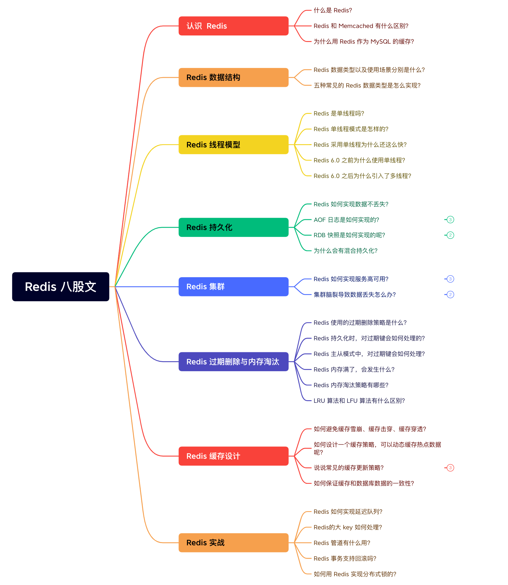

#### Redis是什么？简述它的优缺点？

Redis本质上是一个**Key-Value类型的内存数据库**，整个数据库加载在**内存**当中操作，定期通过**异步操作**把数据库中的数据**flush到硬盘**上进行保存。**因为是纯内存操作**，Redis的性能非常出色，每秒可以处理超过 10万次读写操作，是已知性能最快的Key-Value 数据库。 

**优点**：

- 读写性能极高， Redis能读的速度是110000次/s，写的速度是81000次/s。
- 支持数据持久化，支持AOF和RDB两种持久化方式。
- 支持事务， Redis的所有操作都是原子性的，意思就是要么成功执行要么失败完全不执行。单个操作是原子性的。多个操作也支持事务，即原子性，通过MULTI和EXEC指令包起来。
- 数据结构丰富，除了支持string类型的value外，还支持hash、set、zset、list等数据结构。
- 支持主从复制，主机会自动将数据同步到从机，可以进行读写分离。
- 丰富的特性 – Redis还支持 publish/subscribe， 通知， key 过期等特性。

**缺点**：

- 数据库容量受到**物理内存的限制**，不能用作海量数据的高性能读写，因此Redis适合的场景主要局限在较小数据量的高性能操作和运算上。
- **主机宕机，宕机前有部分数据未能及时同步到从机**，切换IP后还会引入数据不一致的问题，降低了系统的可用性。

#### Redis为什么这么快？

- 内存存储：Redis是使用**内存(in-memeroy)存储**，没有磁盘IO上的开销。数据存在内存中，类似于 HashMap，HashMap 的优势就是查找和操作的时间复杂度都是O(1)。
- 单线程实现（ Redis 6.0以前）：Redis使用单个线程处理请求，避免了多个线程之间**线程切换和锁资源争用**的开销。注意：单线程是指的是在核心网络模型中，网络请求模块使用一个线程来处理，即一个线程处理所有网络请求。
- 非阻塞IO：Redis使用多路复用IO技术，将**epoll作为I/O多路复用技术的实现**，再加上Redis自身的事件处理模型将epoll中的连接、读写、关闭都转换为事件，不在网络I/O上浪费过多的时间。
- **优化的数据结构**：Redis有诸多可以直接应用的优化数据结构的实现，应用层可以直接使用原生的数据结构提升性能。
- 使用底层模型不同：Redis直接自己构建了 **VM (虚拟内存)机制** ，因为一般的系统调用系统函数的话，会浪费一定的时间去移动和请求。Redis的VM(虚拟内存)机制就是暂时把不经常访问的数据(冷数据)从内存交换到磁盘中，从而腾出宝贵的内存空间用于其它需要访问的数据(热数据)。通过VM功能可以实现**冷热数据分离，使热数据仍在内存中、冷数据保存到磁盘**。这样就可以避免因为内存不足而造成访问速度下降的问题。Redis提高数据库容量的办法有两种：一种是可以将数据分割到多个RedisServer上；另一种是使用虚拟内存把那些不经常访问的数据交换到磁盘上。**需要特别注意的是Redis并没有使用OS提供的Swap，而是自己实现。**

#### 底层原理与数据结构

##### String 

Redis 的 String 不是普通的 `C` 语言 `char*` 字符串，而是基于简单动态字符串  **（Simple Dynamic String,SDS）** 实现的：

```c
struct sdshdr {
    int len;  // 字符串长度（已使用）
    int alloc; // 分配的空间总长度
    int flags; // sds类型，共5种(不同数据类型下的字节对齐)
    char buf[]; // 实际存储数据
};

// flags中，Redis 一共设计了 5 种类型，分别是 sdshdr5、sdshdr8、sdshdr16、sdshdr32 和 sdshdr64。主要区别就在于，它们数据结构中的 len 和 alloc 成员变量的数据类型不同。
// 比如 sdshdr16 和 sdshdr32 这两个类型，分别使用uint16_t,uint32_t定义len和alloc
// SDS 设计不同类型的结构体，是为了能灵活保存不同大小的字符串，从而有效节省内存空间。比如，在保存小字符串时，结构头占用空间也比较小。
```

- **支持二进制安全**（可存储图片、音频）。

  > C 语言字符串用“\0”字符作为结尾标记有个缺陷。假设有个字符串中有个“\0”字符，这时在操作这个字符串时就会**提早结束**，比如“ab\0c“字符串，计算字符串长度的时候则会是 4。

- **自动扩容和缩容**（类似 C++ 的 `std::string`）。

  > 不会发生缓冲区溢出, SDS结构中引入了alloc和len，通过alloc-len可以得到剩余空间大小，**当判断出缓冲区大小不够用时，Redis 会自动扩大 SDS 的空间大小**。
  >
  > - 如果所需的 sds 长度**小于 1 MB**，那么最后的扩容是按照**翻倍扩容**来执行的，即 2 倍 的 newlen
  > - 如果所需的 sds 长度**超过 1 MB**，那么最后的扩容长度应该是 newlen + **1MB**。

- **O(1) 取长度**（`len` 字段存了长度，无需遍历）。

  > C 语言获取字符串长度的函数 `strlen`，就是通过字符数组中的每一个字符，并进行计数，等遇到字符为"\0"后，就会停止遍历，然后返回已统计到的字符个数，即为字符串长度。**时间复杂度是 O（N）**

##### List

Redis 的 List（列表）支持 **双向操作**（`LPUSH`、`RPUSH`、`LPOP`、`RPOP`）和 **索引访问**（`LINDEX`），其底层由 **ziplist（压缩列表）和 quicklist（快速列表）** 组成。

其中，**ziplist** 是一种 **连续内存结构**，用来存储小规模的字符串或整数列表，减少内存占用，提高查询效率。缺点是插入可能导致元素移动，

为了解决 ziplist 的性能问题，Redis 3.2 之后引入了 quicklist，它结合了：

- ziplist（减少指针开销，节省内存）
- 双向链表（支持高效的插入和删除）

- quicklist = **多个 ziplist 组成的双向链表**

**List 常见操作的时间复杂度**

| 操作              | 复杂度 | 备注          |
| ----------------- | ------ | ------------- |
| `LPUSH` / `RPUSH` | O(1)   | 头部/尾部插入 |
| `LPOP` / `RPOP`   | O(1)   | 头部/尾部删除 |
| `LINDEX`          | O(n)   | 按索引访问    |
| `LRANGE`          | O(n)   | 遍历列表      |
| `LREM`            | O(n)   | 删除指定元素  |

List 面试常见问题

1.**Redis List 用的是什么数据结构？**

- 早期：**ziplist**
- 3.2 之后：**quicklist**
- quicklist = **多个 ziplist 组成的双向链表**

2.**为什么 Redis 3.2 之后要用 quicklist？**

- **ziplist 插入、删除效率低**，涉及数据移动。
- **双向链表指针占用内存较多**。
- **quicklist 结合 ziplist 和双向链表，节省内存，提升性能。**

3.**quicklist 是怎么组织的？**

- **多个 quicklistNode 组成双向链表**。
- **每个 quicklistNode 里存一个 ziplist**。
- **减少指针数量，提高内存利用率**。

4.**Redis List 适合用来做什么？**

- 消息队列（`LPUSH` + `BRPOP`）
- 任务调度（存储任务列表）
- 日志存储

##### 哈希表

Redis Hash（哈希）的底层实现：**ziplist（压缩列表）+ hashtable（哈希表）**

小数据类型（小于512个键值对）时使用ziplist，所有键值对 以 顺序排列的连续内存 形式存储，交替存储 key 和 value，插入、删除时 可能需要移动数据，影响性能。

大规模数据使用hashtable

- **O(1) 查询、插入和删除**（哈希表查找）。

- 采用 **链地址法** 解决哈希冲突（相同索引位置的元素会形成一个链表）。

- **渐进式 rehash**，保证大规模数据动态扩容时不会影响 Redis 性能。

> **渐进式rehash（扩容）**
>
> 在数据迁移的时候不是一次性将大量数据拷贝进入新的hash表，而是在rehash期间，每次哈希表元素进行新增、删除、查找或者更新操作操作时，redis除了会执行对应的操作之外，还会顺序将旧的hash表中的桶索引位置上所有的key - value迁移到新的哈希表上；会在最终的某个时间完成哈希表的rehash操作；
>
> rehash触发的条件
>
> 负载因子 = 哈希表已保存节点数量 / 哈希表大小；
>
> - 当负载因子 >= 1，并且redis没有执行RDB快照或者AOF重写的时候，就会进行rehash操作；
> - 当负载因子 >= 5，说明哈希冲突已经非常严重了，不管有没有在执行RDB快照或者AOF重写都会强制进行rehash操作；
>
> **迁移期间的操作兼容性**
>
> 在 Rehash 过程中，所有操作需同时处理新旧两张表：
>
> 1. 查询操作：
>    - 先查 `ht[0]`，未找到再查 `ht[1]`。
> 2. 插入操作：
>    - 直接写入 `ht[1]`，确保旧表数据只减不增。
> 3. 删除/更新操作：
>    - 同时在 `ht[0]` 和 `ht[1]` 中处理。

##### set

Redis 的 **Set（集合）** 是一个 **无序**、**唯一** 的数据集合，主要用于存储 **去重元素**，比如 **标签、唯一 ID、好友列表等**。

实现方式

- **intset（整数集合）**（小规模数据 & 仅整数）

  ```c
  struct intset {
      uint32_t encoding;  // 编码方式（16-bit, 32-bit, 64-bit）
      uint32_t length;    // 当前存储的元素个数
      int8_t contents[];  // 有序存储的整数数组
  };
  ```

  `contents[]` 以 **递增排序** 的方式存储整数。**不允许重复值**。

  **自动扩容**，如果新插入的整数超出了 `encoding`，整个 `contents[]` 进行 **类型升级**（16-bit → 32-bit → 64-bit）。优点是节省内存，支持二分查找。但是不能存储字符串，不支持降级(64bit->16bit)，插入和删除都会导致数据移动

- **hashtable（哈希表）**（大规模数据 & 非整数）

  启用场景：1.**存储的元素包含字符串**（如 `"apple"`、`"banana"`）。2.**元素个数超过 512**（`set-max-intset-entries`），3.**存储非整数类型数据**。

  优点：

  **O(1) 查询、插入、删除**（哈希查找）。

  采用 **链地址法** 解决哈希冲突。

  **渐进式 rehash**，保证大规模数据动态扩容时不会影响 Redis 性能。

**Set 常见操作的时间复杂度**

| 操作                          | 复杂度                             | 备注               |
| ----------------------------- | ---------------------------------- | ------------------ |
| `SADD`                        | O(1)                               | 添加元素           |
| `SREM`                        | O(1)                               | 删除元素           |
| `SISMEMBER`                   | O(1)（哈希表）/ O(log n)（intset） | 判断元素是否存在   |
| `SCARD`                       | O(1)                               | 获取集合大小       |
| `SMEMBERS`                    | O(n)                               | 获取所有元素       |
| `SUNION` / `SINTER` / `SDIFF` | O(n)                               | 求并集、交集、差集 |

##### zset

Redis 的 **ZSet（Sorted Set）** 是 **一个带分数的集合**，它的元素是唯一的，每个元素都有一个 **`score`（分数）**，可以按 **分数排序**。
 适用于 **排行榜、优先队列、排名系统** 等场景。

>  **底层数据结构**
>
> - **ziplist（压缩列表）**（小规模数据）:
>
>   **紧凑存储**，减少指针开销
>
>   **每个元素两两相邻存储**
>
>   - **元素值（member）**
>   - **分数（score，浮点数）**
>
>   **按分数递增排序**（插入时保持排序）。
>
> - **skiplist（跳表）+ hashtable（哈希表）**（大规模数据）
>
>   **按 `score` 递增排序**（便于范围查询）。
>
>   **支持 O(log n) 插入、查找、删除**。
>
>   **支持 `O(1)` 获取最小/最大元素（`ZMIN`、`ZMAX`）**。
>
>   上述为跳表作用，而哈希表用于查询score对应的menber，时间复杂度O(1)

面试问题：

**1.Redis 为什么用跳表而不是平衡树？**

✅ **插入/删除更快**（跳表插入/删除 O(log n)，红黑树需要旋转）。
 ✅ **实现简单**，相比红黑树代码更容易维护。
 ✅ **范围查询更高效**，跳表是多层索引，查询范围比平衡树快。

**2. Redis 为什么用 hashtable？**

✅ **O(1) 查询 score**，如果只有跳表，按元素名查 `score` 需要 O(log n)。
 ✅ **提高整体性能**（跳表负责排序，哈希表负责查找）。

#### Redis相比Memcached有哪些优势？

- 数据类型：Memcached所有的值均是简单的字符串，Redis支持更为丰富的**数据类型**，支持string(字符串)，list(列表)，Set(集合)、Sorted Set(有序集合)、Hash(哈希)等。
- 持久化：Redis支持数据落地**持久化存储**，可以将内存中的数据保持在磁盘中，重启的时候可以再次加载进行使用。 memcache不支持数据持久存储 。
- **集群模式**：Redis提供主从同步机制，以及 Cluster集群部署能力，能够提供高可用服务。Memcached没有原生的集群模式，需要依靠客户端来实现往集群中分片写入数据
- 网络IO模型：Redis使用**单线程的多路 IO 复用模型**，Memcached使用**多线程的非阻塞IO模式**。
- Redis支持服务器端的数据操作，支持发布订阅模型，Lua脚本，事务

#### Redis的常用场景有哪些?

**1、缓存** 缓存现在几乎是所有中大型网站都在用的必杀技，合理的利用缓存不仅能够提升网站访问速度，还能大大降低数据库的压力。Redis提供了键过期功能，也提供了灵活的键淘汰策略，所以，现在Redis用在缓存的场合非常多。

 **2、排行榜** 很多网站都有排行榜应用的，如京东的月度销量榜单、商品按时间的上新排行榜等。Redis提供的有序集合数据类构能实现各种复杂的排行榜应用。 

**3、计数器** 什么是计数器，如电商网站商品的浏览量、视频网站视频的播放数等。为了保证数据实时效，每次浏览都得给+1，并发量高时如果每次都请求数据库操作无疑是种挑战和压力。Redis提供的incr命令来实现计数器功能，内存操作，性能非常好，非常适用于这些计数场景。 

**4、分布式会话** 集群模式下，在应用不多的情况下一般使用容器自带的session复制功能就能满足，当应用增多相对复杂的系统中，一般都会搭建以Redis等内存数据库为中心的session服务，session不再由容器管理，而是由session服务及内存数据库管理。 

**5、分布式锁** 在很多互联网公司中都使用了分布式技术，分布式技术带来的技术挑战是对同一个资源的并发访问，如全局ID、减库存、秒杀等场景，并发量不大的场景可以使用数据库的悲观锁、乐观锁来实现，但在并发量高的场合中，利用数据库锁来控制资源的并发访问是不太理想的，大大影响了数据库的性能。可以利用Redis的setnx功能来编写分布式的锁，如果设置返回1说明获取锁成功，否则获取锁失败，实际应用中要考虑的细节要更多。 

**6、 社交网络** 点赞、踩、关注/被关注、共同好友等是社交网站的基本功能，社交网站的访问量通常来说比较大，而且传统的关系数据库类型不适合存储这种类型的数据，Redis提供的哈希、集合等数据结构能很方便的的实现这些功能。如在微博中的共同好友，通过Redis的set能够很方便得出。 

**7、最新列表** Redis列表结构，LPUSH可以在列表头部插入一个内容ID作为关键字，LTRIM可用来限制列表的数量，这样列表永远为N个ID，无需查询最新的列表，直接根据ID去到对应的内容页即可。

 **8、消息系统** 消息队列是大型网站必用中间件，如ActiveMQ、RabbitMQ、Kafka等流行的消息队列中间件，主要用于**业务解耦、流量削峰及异步处理**实时性低的业务。Redis提供了发布/订阅及阻塞队列功能，能实现一个简单的消息队列系统。另外，这个不能和专业的消息中间件相比。

#### Redis的数据结构有哪些？

String 用的是 SDS 动态字符串，整数还会做编码优化；

List 用的是 quicklist，本质上是多个压缩列表构成的双向链表；

Hash 和 Set 小数据量时用 ziplist/intset，数据多时转为 hashtable；

ZSet 是跳表 + hashtable 的组合，跳表负责排序，哈希表负责快速查找。

| Redis 数据类型 | 底层数据结构 |
| -------------- | ------------ |
| String（字符串） | **SDS（简单动态字符串）** |
| List（列表） | **ziplist（压缩列表）+ quicklist（快速列表）** |
| Hash（哈希） | **ziplist（压缩列表）+ hashtable（哈希表）** |
| Set（集合） | **intset（整数集合）+ hashtable（哈希表）** |
| ZSet（有序集合） | **ziplist（压缩列表）+ skiplist（跳表）+ hashtable（哈希表）** |


- 以及**三种特殊**的数据类型：Bitmap（位存储，判断签到，用户登录状态）、HyperLogLog（基数统计）、Geospatial(地理位置) ，其中HyperLogLog、Bitmap的底层都是 String 数据类型，Geospatial 的底层是 Sorted Set 数据类型。还有Stream，消息队列，比List实现的消息队列多了全局唯一自增ID，支持消费组形式消费数据。

##### 1. String（SDS）

- String是最常用的一种数据类型，普通的key- value 存储都可以归为此类。其中Value既可以是数字也可以是字符串。使用场景：常规key-value缓存应用。常规计数: 微博数， 粉丝数。
- 虽然 Redis 是用 C 语言写的，但是 Redis 并没有使用 C 的字符串表示，而是自己构建了一种 **简单动态字符串**（Simple Dynamic String，**SDS**）。相比于 C 的原生字符串，Redis 的 SDS 不光可以保存文本数据还可以保存二进制数据，并且获取字符串长度复杂度为 O(1)（C 字符串为 O(N)）,除此之外，Redis 的 SDS API 是安全的，不会造成缓冲区溢出。

| 命令                           | 介绍                             |
| ------------------------------ | -------------------------------- |
| SET key value                  | 设置指定 key 的值                |
| SETNX key value                | 只有在 key 不存在时设置 key 的值 |
| GET key                        | 获取指定 key 的值                |
| MSET key1 value1 key2 value2 … | 设置一个或多个指定 key 的值      |
| MGET key1 key2 ...             | 获取一个或多个指定 key 的值      |
| STRLEN key                     | 返回 key 所储存的字符串值的长度  |
| INCR key                       | 将 key 中储存的数字值增一        |
| DECR key                       | 将 key 中储存的数字值减一        |
| EXISTS key                     | 判断指定 key 是否存在            |
| DEL key（通用）                | 删除指定的 key                   |
| EXPIRE key seconds（通用）     | 给指定 key 设置过期时间          |

#####  2、Hash(哈希表、压缩列表)：

常用命令

| 命令                                      | 介绍                                                     |
| ----------------------------------------- | -------------------------------------------------------- |
| HSET key field value                      | 设置指定哈希表中指定字段的值                             |
| HSETNX key field value                    | 只有指定字段不存在时设置指定字段的值                     |
| HMSET key field1 value1 field2 value2 ... | 同时将一个或多个 field-value (域-值)对设置到指定哈希表中 |
| HGET key field                            | 获取指定哈希表中指定字段的值                             |
| HMGET key field1 field2 ...               | 获取指定哈希表中一个或者多个指定字段的值                 |
| HGETALL key                               | 获取指定哈希表中所有的键值对                             |
| HEXISTS key field                         | 查看指定哈希表中指定的字段是否存在                       |
| HDEL key field1 field2 ...                | 删除一个或多个哈希表字段                                 |
| HLEN key                                  | 获取指定哈希表中字段的数量                               |
| HINCRBY key field increment               | 对指定哈希中的指定字段做运算操作（正数为加，负数为减）   |

**对象数据存储场景**

- 举例 ：用户信息、商品信息、文章信息、购物车信息。
- 相关命令 ：HSET （设置单个字段的值）、HMSET（设置多个字段的值）、HGET（获取单个字段的值）、HMGET（获取多个字段的值）

##### 3、Set(哈希表、整数集合)：

介绍：

- Redis 中的 Set 类型是一种无序集合，集合中的元素没有先后顺序但都唯一。
- 当你需要存储一个列表数据，又不希望出现重复数据时，Set 是一个很好的选择，并且 Set 提供了判断某个元素是否在一个 Set 集合内的重要接口，这个也是 List 所不能提供的。
- 你可以基于 Set 轻易实现交集、并集、差集的操作，比如你可以将一个用户所有的关注人存在一个集合中，将其所有粉丝存在一个集合。这样的话，Set 可以非常方便的实现如共同关注、共同粉丝、共同喜好等功能。这个过程也就是求交集的过程。

| 命令                                  | 介绍                                      |
| ------------------------------------- | ----------------------------------------- |
| SADD key member1 member2 ...          | 向指定集合添加一个或多个元素              |
| SMEMBERS key                          | 获取指定集合中的所有元素                  |
| SCARD key                             | 获取指定集合的元素数量                    |
| SISMEMBER key member                  | 判断指定元素是否在指定集合中              |
| SINTER key1 key2 ...                  | 获取给定所有集合的交集                    |
| SINTERSTORE destination key1 key2 ... | 将给定所有集合的交集存储在 destination 中 |
| SUNION key1 key2 ...                  | 获取给定所有集合的并集                    |
| SUNIONSTORE destination key1 key2 ... | 将给定所有集合的并集存储在 destination 中 |
| SDIFF key1 key2 ...                   | 获取给定所有集合的差集                    |
| SDIFFSTORE destination key1 key2 ...  | 将给定所有集合的差集存储在 destination 中 |
| SPOP key count                        | 随机移除并获取指定集合中一个或多个元素    |
| SRANDMEMBER key count                 | 随机获取指定集合中指定数量的元素          |

使用场景

**需要存放的数据不能重复的场景**

- 举例：网站 UV 统计（数据量巨大的场景还是 HyperLogLog更适合一些）、文章点赞、动态点赞等场景。
- 相关命令：SCARD（获取集合数量） 。
- 举例 ：共同好友(交集)、共同粉丝(交集)、共同关注(交集)、好友推荐（差集）、音乐推荐（差集） 、订阅号推荐（差集+交集） 等场景。
- 相关命令：SINTER（交集）、SINTERSTORE （交集）、SUNION （并集）、SUNIONSTORE（并集）、SDIFF（差集）、SDIFFSTORE （差集）
- 需要随机获取数据源中的元素的场景
- 举例 ：抽奖系统、随机。
  相关命令：SPOP（随机获取集合中的元素并移除，适合不允许重复中奖的场景）、SRANDMEMBER（随机获取集合中的元素，适合允许重复中奖的场景）

##### 4、List(双向链表、压缩列表)：

介绍：List是一个有序可重复的集合，其遵循FIFO的原则，底层是依赖双向链表实现的，因此支持正向、反向双重查找，不过带来了部分额外的内存开销。通过List，我们可以很方面的获得类似于最新回复这类的功能实现。

| 命令                        | 介绍                                       |
| --------------------------- | ------------------------------------------ |
| RPUSH key value1 value2 ... | 在指定列表的尾部（右边）添加一个或多个元素 |
| LPUSH key value1 value2 ... | 在指定列表的头部（左边）添加一个或多个元素 |
| LSET key index value        | 将指定列表索引 index 位置的值设置为 value  |
| LPOP key                    | 移除并获取指定列表的第一个元素(最左边)     |
| RPOP key                    | 移除并获取指定列表的最后一个元素(最右边)   |
| LLEN key                    | 获取列表元素数量                           |
| LRANGE key start end        | 获取列表 start 和 end 之间 的元素          |

**信息流展示**

- 举例 ：最新文章、最新动态。
- 相关命令 ： LPUSH、LRANGE。

**消息队列** Redis List 数据结构可以用来做消息队列，只是功能过于简单且存在很多缺陷，不建议这样做。 相对来说，Redis 5.0 新增加的一个数据结构 Stream 更适合做消息队列一些，只是功能依然非常简陋。和专业的消息队列相比，还是有很多欠缺的地方比如消息丢失和堆积问题不好解决。

##### 5、SortedSet（跳表、压缩列表）：

- Sorted Set 类似于 Set，但和 Set 相比，Sorted Set 增加了一个权重参数 score，使得集合中的元素能够按 score 进行有序排列，还可以通过 score 的范围来获取元素的列表。
- 适用于排行榜和带权重的消息队列等场景。

| 命令                                          | 介绍                                                         |
| --------------------------------------------- | ------------------------------------------------------------ |
| ZADD key score1 member1 score2 member2 ...    | 向指定有序集合添加一个或多个元素                             |
| ZCARD KEY                                     | 获取指定有序集合的元素数量                                   |
| ZSCORE key member                             | 获取指定有序集合中指定元素的 score 值                        |
| ZINTERSTORE destination numkeys key1 key2 ... | 将给定所有有序集合的交集存储在 destination 中，对相同元素对应的 score 值进行 SUM 聚合操作，numkeys 为集合数量 |
| ZUNIONSTORE destination numkeys key1 key2 ... | 求并集，其它和 ZINTERSTORE 类似                              |
| ZDIFF destination numkeys key1 key2 ...       | 求差集，其它和 ZINTERSTORE 类似                              |
| ZRANGE key start end                          | 获取指定有序集合 start 和 end 之间的元素（score 从低到高）   |
| ZREVRANGE key start end                       | 获取指定有序集合 start 和 end 之间的元素（score 从高到底）   |
| ZREVRANK key member                           | 获取指定有序集合中指定元素的排名(score 从大到小排序)         |

应用场景

**需要随机获取数据源中的元素根据某个权重进行排序的场景**

- 举例 ：各种排行榜比如直播间送礼物的排行榜、朋友圈的微信步数排行榜、王者荣耀中的段位排行榜、话题热度排行榜等等。
- 相关命令 ：ZRANGE (从小到大排序) 、 ZREVRANGE （从大到小排序）、ZREVRANK (指定元素排名)。

#### 为什么使用跳表而不是红黑树？

- 方便**区间查询**（可以引申一下B+树）；
- 实现灵活、简单，**通过改变索引构造策略，有效平衡执行效率和内存消耗**。

> 跳表（Skiplist）是一个特殊的链表，相比一般的链表，有更高的查找效率，可比拟二叉查找树，可比拟二叉查找树，
>
> 采用二分的思想、向上建立冗余层，进而插入、删除、查找的时间复杂度均为**O（logn）**；

#### 热数据和冷数据

1. 热点数据，就是信息修改频率不高，读取频率非常高。一般数据更新前至少读取两次，缓存才有意义。这个是最基本的策略，如果缓存还没有起作用就失效了，那就没有太大价值了。
2. 对于冷数据而言，大部分数据可能还没有再次访问到就已经被挤出内存，不仅占用内存，而且价值不大。
3. 频繁修改的数据，看情况考虑使用缓存

#### 数据持久化

Redis提供了两种不同的持久化方法可以将数据存储在磁盘中，一种叫快照RDB，另一种叫只追加文件AOF。

> **RDB** [Redis RDB 持久化详解](https://www.cnblogs.com/MrLiuZF/p/15005675.html) 在指定的时间间隔内将内存中的**数据集快照写入磁盘**(Snapshot)，它恢复时是将快照文件直接读到内存里。
>
>  **优势**：
>
> - 只有一个文件（dump.rdb），持久化方便
> - 容灾性好，一个文件可以安全保存到磁盘
> - 性能最大化：fork**子进程**来完成写操作，主进程继续处理命令，所以是IO最大化。（主进程不涉及IO处理，子进程单独处理持久化，保证了Redis的高性能）
> - 数据集较大时，启动效率更高（相比于AOF）
>
> **劣势**：
>
> - 在一定间隔时间做一次备份，所以如果Redis意外down掉的话，就会丢失最后一次快照后的所有修改。
> - 数据安全性低：隔一段时间进行持久化的机制，如果发生故障容易导致数据丢失

> **AOF ** [Redis AOF 持久化详解](https://www.cnblogs.com/MrLiuZF/p/15007057.html) ( append only file )持久化以**独立日志**的方式记录每次写命令，并在 Redis 重启时在重新执行 AOF 文件中的命令以达到恢复数据的目的。AOF 的主要作用是解决数据持久化的实时性。 以日志的形式来记录每个写操作，将Redis执行过的所有写指令记录下来(读操作不记录)，只许追加文件但不可以改写文件，Redis启动之初会读取该文件重新构建数据，换言之，Redis重启的话就根据日志文件的内容将写指令从前到后执行一次以完成数据的恢复工作。
>
>  AOF采用文件追加方式，文件会越来越大，为避免出现此种情况，新增了重写机制，当AOF文件的大小超过所设定的阈值时， Redis就会启动AOF文件的内容压缩，只保留可以恢复数据的最小指令集。 
>
> **优势**
>
> | **策略** | **描述** | **优缺点** |
> | -------- | -------- | ---------- |
> | **always** | 每次写入都 `fsync` | **最安全，但性能最差**（每次写操作都要写磁盘）
> | **everysec**（默认） | 每秒执行 `fsync` | **数据安全性和性能平衡**（最多丢失 1 秒数据） |
> | **no** | 由操作系统决定何时写入 | **性能最高，但不安全**（可能丢失大量数据） |
>
>**劣势**
> 
>- 相同数据集的数据而言aof文件要远大于rdb文件，恢复速度慢于rdb
> - aof运行效率要慢于rdb，每秒同步策略效率较好，不同步效率和rdb相同
> 
>**AOF文件同步的三种机制**
> 
>- 每修改同步always：**同步持久化，每次发生数据变更会被立即记录到磁盘，性能较差但数据完整性比较好**
> - 每秒同步everysec：**异步操作，每秒记录，如果一秒内宕机，有数据丢失**
> - 不同no：**从不同步**

**面试常见问题**

**1. Redis AOF 为什么比 RDB 安全？**

✅ **RDB 可能丢失最近一次快照后的数据**（如果 Redis 崩溃）。
 ✅ **AOF 只丢失 1 秒数据（everysec），更安全**。
 ✅ **AOF 记录每个写入命令，避免快照覆盖问题**。

**2. AOF 为什么要重写？**

✅ **防止 AOF 变得太大**，减少存储成本。
 ✅ **避免回放过多无用命令，提高恢复速度**。

**3. AOF 重写会阻塞 Redis 吗？**

✅ **不会，AOF 重写由子进程执行**，不影响主线程。

**4. 生产环境 RDB 还是 AOF？**

🚀 **高可靠性场景（金融、订单）→ AOF**。
 🚀 **高性能场景（缓存、日志）→ RDB**。
 🚀 **两者可同时开启（默认 AOF 关闭）**。

**5.AOF重写机制**

AOF 日志是一个文件，随着执行的写操作命令越来越多，文件的大小会越来越大。AOF 重写机制是在重写时，读取当前数据库中的所有键值对，然后将每一个键值对用一条命令记录到「新的 AOF 文件」，等到全部记录完后，就将新的 AOF 文件替换掉现有的 AOF 文件。

这个重写过程是由**后台子进程**bgrewriteaof完成的：避免阻塞主线程，此外，使用子进程而不是线程是为了防止线程之间共享进程的内存，从而加锁导致性能下降。父子进程通过共享内存数据（只读），父子任意一方修改数据后触发【写时复制】，不需要锁来保证数据安全。

#### 过期键的删除策略

定时删除：**在设置 key 的过期时间时，同时创建一个定时事件，当时间到达时，由事件处理器自动执行 key 的删除操作。**可以保证过期 key 会被尽快删除，内存友好但是浪费CPU时间。

惰性删除策略的做法是，**不主动删除过期键，每次从数据库访问 key 时，都检测 key 是否过期，如果过期则删除该 key。** 对CPU友好，但是对于没有访问的key，会一直占用内存。

定期删除策略的做法是，**每隔一段时间「随机」从数据库中取出一定数量的 key 进行检查，并删除其中的过期key。** 结合两者优点和缺点

Redis的过期策略：**惰性删除 和 定期删除**

>  *1、间隔检查的时间是多长呢？* 在 Redis 中，默认每秒进行 10 次过期检查一次数据库，此配置可通过 Redis 的配置文件 redis.conf 进行配置，配置键为 hz 它的默认值是 hz 10。 特别强调下，每次检查数据库并不是遍历过期字典中的所有 key，而是从数据库中随机抽取一定数量的 key 进行过期检查。
>
>  *2、随机抽查的数量是多少呢？* 我查了下源码，定期删除的实现在 expire.c 文件下的 `activeExpireCycle` 函数中，其中随机抽查的数量由 `ACTIVE_EXPIRE_CYCLE_LOOKUPS_PER_LOOP` 定义的，它是写死在代码中的，数值是 20。 也就是说，数据库每轮抽查时，会随机选择 20 个 key 判断是否过期。
>
> **如果本轮检查的已过期 key 的数量，超过 5 个（20/4），也就是「已过期 key 的数量」占比「随机抽取 key 的数量」大于 25%，则继续重复检查；如果已过期的 key 比例小于 25%，则停止继续删除过期 key，然后等待下一轮再检查。**
>
> 那 Redis 为了保证定期删除不会出现循环过度，导致线程卡死现象，为此增加了定期删除循环流程的时间上限，默认不会超过 25ms。

**Redis 持久化时，对过期键会如何处理的？**

> **RDB 文件生成阶段**：从内存状态持久化成 RDB（文件）的时候，会对 key 进行过期检查，**过期的键「不会」被保存到新的 RDB 文件中**，因此 Redis 中的过期键不会对生成新 RDB 文件产生任何影响。
>
> **RDB 加载阶段**：RDB 加载阶段时，要看服务器是主服务器还是从服务器，分别对应以下两种情况：
> 如果 Redis 是「主服务器」运行模式的话，在载入 RDB 文件时，程序会对文件中保存的键进行检查，**过期键「不会」被载入到数据库中**。所以过期键不会对载入 RDB 文件的主服务器造成影响；
> 如果 Redis 是「从服务器」运行模式的话，在载入 RDB 文件时，**不论键是否过期都会被载入到数据库中**。但由于**主从服务器在进行数据同步时，从服务器的数据会被清空**。所以一般来说，过期键对载入 RDB 文件的从服务器也不会造成影响。
>
> AOF 文件分为两个阶段，AOF 文件写入阶段和 AOF 重写阶段。
>
> AOF 文件**写入阶段**：当 Redis 以 AOF 模式持久化时，如果数据库某个过期键还没被删除，那么 AOF 文件会保留此过期键，当此过期键被删除后，Redis 会向 AOF 文件追加一条 DEL 命令来显式地删除该键值。
> AOF 重写阶段：执行 AOF 重写时，会对 Redis 中的键值对进行检查，**已过期的键不会被保存**到重写后的 AOF 文件中，因此不会对 AOF 重写造成任何影响。

**Redis 主从模式中，对过期键会如何处理？**

> 当 Redis 运行在主从模式下时，**从库不会进行过期扫描**，从库对过期的处理是被动的。也就是即使从库中的 key 过期了，如果有客户端访问从库时，依然可以得到 key 对应的值，像未过期的键值对一样返回。
>
> **从库的过期键处理依靠主服务器控制，主库在 key 到期时，会在 AOF 文件里增加一条 del 指令，同步到所有的从库，从库通过执行这条 del 指令来删除过期的 key。**


#### 内存淘汰策略


1. 不进行数据淘汰的策略**，只有 noeviction。**
2. **设置了过期时间的数据中进行淘**汰，包括：volatile-lru、volatile-ttl、volatile-random、volatile-lfu，即使缓存没有写满，如果数据过期了也会被删除。
3. **在所有数据范围内进行淘汰**，包括：allkeys-lru、allkeys-random、allkeys-lfu，如果一个键值对被删除策略选中了，即使它的过期时间还没到，也需要被删除。如果过期时间到了没有被策略选中，也会被删除。

##### **Redisv4.0前提供 6种数据淘汰策略**：

- volatile-lru：利用LRU算法移除设置过过期时间的key (LRU:最近使用 Least Recently Used )
- allkeys-lru：当内存不足以容纳新写入数据时，在键空间中，移除**最近最少使用的key（这个是最常用的）**
- volatile-ttl：从已设置过期时间的数据集（server.db[i].expires）中挑选将要过期的数据淘汰
- volatile-random：从已设置过期时间的数据集（server.db[i].expires）中任意选择数据淘汰
- allkeys-random：从数据集（server.db[i].dict）中任意选择数据淘汰
- no-eviction：禁止驱逐数据，也就是说当内存不足以容纳新写入数据时，新写入操作会报错。这个应该没人使用吧！

**Redisv4.0后增加以下两种LFU**：

- volatile-lfu：从已设置过期时间的数据集(server.db[i].expires)中挑选最不经常使用的数据淘汰(LFU(Least Frequently Used)算法，也就是最频繁被访问的数据将来最有可能被访问到)
- allkeys-lfu：当内存不足以容纳新写入数据时，在键空间中，移除最不经常使用的key。

内存淘汰策略可以通过配置文件来修改，Redis.conf对应的配置项是maxmemory-policy 修改对应的值就行，默认是noeviction。

##### LRU

**LRU** 全称是 Least Recently Used 翻译为**最近最少使用**，会选择淘汰最近最少使用的数据。 传统 LRU 算法的实现是基于「链表」结构，链表中的元素按照操作顺序从前往后排列，最新操作的键会被移动到表头，当需要内存淘汰时，只需要删除链表尾部的元素即可，因为链表尾部的元素就代表最久未被使用的元素。 Redis 并没有使用这样的方式实现 LRU 算法，因为传统的 LRU 算法存在两个问题：

- **需要用链表管理所有的缓存数据，这会带来额外的空间开销；**
- **当有数据被访问时，需要在链表上把该数据移动到头端，如果有大量数据被访问，就会带来很多链表移动操作，会很耗时，进而会降低 Redis 缓存性能。**

Redis 实现的是一种**近似 LRU 算法**，目的是为了更好的节约内存，它的**实现方式是在 Redis 的对象结构体中添加一个额外的字段，用于记录此数据的最后一次访问时间**。 当 Redis 进行内存淘汰时，会使用**随机采样的方式来淘汰数据**，它是随机取 5 个值（此值可配置），然后**淘汰最久没有使用的那个**。

但是 LRU 算法有一个问题，**无法解决缓存污染问题**，比如应用一次读取了大量的数据，而这些数据只会被读取这一次，那么这些数据会留存在 Redis 缓存中很长一段时间，造成缓存污染。 

##### LFU

LFU 全称是 Least Frequently Used 翻译为**最近最不常用的，**LFU 算法是根据数据访问次数来淘汰数据的，它的核心思想是“如果数据过去被访问多次，那么将来被访问的频率也更高”。 所以， LFU 算法会记录每个数据的访问次数。当一个数据被再次访问时，就会增加该数据的访问次数。这样就解决了偶尔被访问一次之后，数据留存在缓存中很长一段时间的问题，相比于 LRU 算法也更合理一些。

#### 缓存一致性问题

##### 1.先更新数据库，再删除缓存

更新数据库成功了，但是在删除缓存的阶段出错了没有删除成功，那么此时再读取缓存的时候每次都是错误的数据了。

此时解决方案就是利用消息队列进行删除的补偿。具体的业务逻辑用语言描述如下：

1. 请求 A 先对数据库进行更新操作
2. 在对 Redis 进行删除操作的时候发现报错，删除失败
3. 此时将Redis 的 key 作为消息体发送到消息队列中
4. 系统接收到消息队列发送的消息后再次对 Redis 进行删除操作

但是这个方案会有一个缺点就是会对业务代码造成大量的侵入，深深的耦合在一起，所以这时会有一个优化的方案，我们知道对 Mysql 数据库更新操作后再 binlog 日志中我们都能够找到相应的操作，那么我们可以订阅 Mysql 数据库的binlog 日志对缓存进行操作。


##### 2.由于主从延迟导致读取到过期数据怎么处理？

首先通过scan命令扫库：当Redis中的key被scan的时候，相当于访问了该key，同样也会做过期检测，充分发挥Redis惰性删除的策略。这个方法能大大降低了脏数据读取的概率，但缺点也比较明显，会造成一定的数据库压力，否则影响线上业务的效率。

Redis加入了一个新特性来解决主从不一致导致读取到过期数据问题，增加了key是否过期以及对主从库的判断，如果key已过期，当前访问的master则返回null；当前访问的是从库，且执行的是只读命令也返回null。

> Redis key 或 value 里加上版本号或时间戳；读取数据时判断版本是否过期；若过期则主动去主节点读或重新拉取数据。

##### 3.主从复制的过程中如果因为网络原因停止复制了会怎么样？

如果出现网络故障断开连接了，会自动重连的，从Redis 2.8开始，就支持主从复制的断点续传，可以接着上次复制的地方，继续复制下去，而不是从头开始复制一份。 master如果发现有多个slave node都来重新连接，仅仅会启动一个rdb save操作，用一份数据服务所有slave node。 master node会在内存中创建一个backlog，master和slave都会保存一个replica offset，还有一个master id，offset就是保存在backlog中的。如果master和slave网络连接断掉了，slave会让master从上次的replica offset开始继续复制。 但是如果没有找到对应的offset，那么就会执行一次resynchronization全量复制。

##### 4.Redis主从架构数据会丢失吗，为什么？

有两种数据丢失的情况：

1. 异步复制导致的数据丢失：因为master -> slave的复制是异步的，所以可能有部分数据还没复制到slave，master就宕机了，此时这些部分数据就丢失了。
2. 脑裂导致的数据丢失：某个master所在机器突然脱离了正常的网络，跟其他slave机器不能连接，但是实际上master还运行着，此时哨兵可能就会认为master宕机了，然后开启选举，将其他slave切换成了master。这个时候，集群里就会有两个master，也就是所谓的脑裂。此时虽然某个slave被切换成了master，但是可能client还没来得及切换到新的master，还继续写向旧master的数据可能也丢失了。因此旧master再次恢复的时候，会被作为一个slave挂到新的master上去，自己的数据会清空，重新从新的master复制数据。


#### Redis为何选择单线程？

在Redis 6.0以前，Redis的核心网络模型选择用单线程来实现。对于一个 DB 来说，CPU 通常不会是瓶颈，因为大多数请求不会是 CPU 密集型的，而是 I/O 密集型。

具体到 Redis的话，如果不考虑 RDB/AOF 等持久化方案，Redis是完全的纯内存操作，执行速度是非常快的，因此这部分操作通常不会是性能瓶颈，Redis真正的性能瓶颈在于网络 I/O，也就是客户端和服务端之间的网络传输延迟，因此 **Redis选择了单线程的 I/O 多路复用来实现它的核心网络模型**。具体原因如下：

- **避免过多的上下文切换开销**：如果是单线程则可以规避进程内频繁的线程切换开销，因为程序始终运行在进程中单个线程内，没有多线程切换的场景。
- **避免同步机制的开销**：如果 Redis选择多线程模型，又因为 Redis是一个数据库，那么势必涉及到底层数据同步的问题，则必然会引入某些同步机制，比如锁，而我们知道 Redis不仅仅提供了简单的 key-value 数据结构，还有 list、set 和 hash 等等其他丰富的数据结构，而不同的数据结构对同步访问的加锁粒度又不尽相同，可能会导致在操作数据过程中带来很多加锁解锁的开销，增加程序复杂度的同时还会降低性能。
- **简单可维护**：如果 Redis使用多线程模式，那么所有的底层数据结构都必须实现成线程安全的，这无疑又使得 Redis的实现变得更加复杂。

> Redis真的是单线程？
>
> 1. Redisv4.0（引入多线程处理异步任务）
> 2. Redis 6.0（在网络模型中实现多线程 I/O ）
>
> 所以，网络上说的Redis是单线程，通常是指在Redis 6.0之前，其核心网络模型使用的是单线程。 且Redis6.0引入**多线程I/O**，只是用来**处理网络数据的读写和协议的解析**，而**执行命令依旧是单线程**。
>
> Redis在 v4.0 版本的时候就已经引入了的多线程来做一些异步操作，此举主要针对的是那些非常耗时的命令，通过将这些命令的执行进行异步化，避免阻塞单线程的事件循环。 在 Redisv4.0 之后增加了一些的非阻塞命令如 UNLINK、FLUSHALL ASYNC、FLUSHDB ASYNC。

> Redis 6.0为何引入多线程？
>
> - 可以充分利用服务器 CPU 资源，目前主线程只能利用一个核
> - 多线程任务可以分摊 Redis 同步 IO 读写负荷

#### Redis事务

Redis的事务并不是我们传统意义上理解的事务，我们都知道 单个 Redis 命令的执行是原子性的，但 Redis 没有在事务上增加任何维持原子性的机制，所以 Redis **事务的执行并不是原子性的**。

1.Redis事务中如果有某一条命令执行失败，之前的命令不会回滚，其后的命令仍然会被继续执行。

2.Redis事务中所有命令都会序列化、按顺序地执行。事务在执行的过程中，不会被其他客户端发送来的命令请求所打断。

3.在事务开启之前，如果客户端与服务器之间出现通讯故障并导致网络断开，其后所有待执行的语句都将不会被服务器执行。然而如果网络中断事件是发生在客户端执行EXEC命令之后，那么该事务中的所有命令都会被服务器执行。

> 当使用Append-Only模式时，Redis会通过调用系统函数write将该事务内的所有写操作在本次调用中全部写入磁盘。然而如果在写入的过程中出现系统崩溃，如电源故障导致的宕机，那么此时也许只有部分数据被写入到磁盘，而另外一部分数据却已经丢失。Redis服务器会在重新启动时执行一系列必要的一致性检测，一旦发现类似问题，就会立即退出并给出相应的错误提示。

**相关操作**

Redis事务功能是通过MULTI、EXEC、DISCARD和WATCH 四个原语实现的

- WATCH 命令是一个**乐观锁**，可以为 Redis 事务提供 check-and-set （CAS）行为。 可以监控一个或多个键，一旦其中有一个键被修改（或删除），之后的事务就不会执行，监控一直持续到EXEC命令。
- MULTI命令用于开启一个事务，它总是返回OK。 MULTI执行之后，客户端可以继续向服务器发送任意多条命令，这些命令不会立即被执行，而是被放到一个队列中，当EXEC命令被调用时，所有队列中的命令才会被执行。
- EXEC：执行所有事务块内的命令。返回事务块内所有命令的返回值，按命令执行的**先后顺序排列**。 当操作被打断时，返回空值 nil 。通过调用DISCARD，客户端可以清空事务队列，并放弃执行事务， 并且客户端会从事务状态中退出。
- UNWATCH命令可以取消watch对所有key的监控。

**隔离性**

Redis 是单进程程序，并且它保证在执行事务时，不会对事务进行中断，事务可以运行直到执行完所有事务队列中的命令为止。因此，**Redis 的事务是总是带有隔离性的**。

#### 主从，哨兵

##### Redis单副本

采用单个Redis节点部署架构，没有备用节点实时同步数据，不提供数据持久化和备份策略，适用于数据可靠性要求不高的纯缓存业务场景。

- **不保证数据的可靠性；**
- 在**缓存使用，进程重启后，数据丢失**，即使有备用的节点解决高可用性，但是仍然不能解决缓存预热问题，因此不适用于数据可靠性要求高的业务；
- 高性能受限于单核CPU的处理能力（Redis是单线程机制），CPU为主要瓶颈，所以适合操作命令简单，排序、计算较少的场景。也可以考虑用Memcached替代。

##### 多副本（主从）

Redis多副本，采用主从（replication）部署结构，相较于单副本而言最大的特点就是主从实例间数据实时同步，并且提供数据持久化和备份策略。主从实例部署在不同的物理服务器上，根据公司的基础环境配置，可以实现同时对外提供服务和读写分离策略。

**优点**：

- 高可靠性：一方面，采用双机主备架构，能够在主库出现故障时自动进行主备切换，从库提升为主库提供服务，保证服务平稳运行；另一方面，开启数据持久化功能和配置合理的备份策略，能有效的解决数据误操作和数据异常丢失的问题；
- 读写分离策略：从节点可以扩展主库节点的读能力，有效应对大并发量的读操作。

缺点：

- 故障恢复复杂，如果没有RedisHA系统（需要开发），当主库节点出现故障时，需要手动将一个从节点晋升为主节点，同时需要通知业务方变更配置，并且需要让其它从库节点去复制新主库节点，整个过程需要人为干预，比较繁琐；
- 主库的写能力受到单机的限制，可以考虑分片；
- 主库的存储能力受到单机的限制，可以考虑Pika；
- 原生复制的弊端在早期的版本中也会比较突出，如：Redis复制中断后，Slave会发起psync，此时如果同步不成功，则会进行全量同步，主库执行全量备份的同时可能会造成毫秒或秒级的卡顿；又由于COW机制，导致极端情况下的主库内存溢出，程序异常退出或宕机；主库节点生成备份文件导致服务器磁盘IO和CPU（压缩）资源消耗；发送数GB大小的备份文件导致服务器出口带宽暴增，阻塞请求，建议升级到最新版本。

##### 主从复制和同步

Redis 主从复制（Master-Slave Replication）是一种数据冗余和高可用性的机制，其中一个主节点（Master）负责处理写操作，多个从节点（Slave）负责处理读操作并复制主节点的数据。

主从同步过程

1. 初次同步（全量复制）：
   - 从节点向主节点发送 `PSYNC` 命令请求同步。
   - 主节点生成 RDB 快照，并将其发送给从节点。
   - 同时，主节点将新的写操作日志（AOF）发送给从节点。
   - 从节点加载 RDB 文件并应用增量写操作日志。
2. 增量同步：
   - 初次同步后，主节点将所有新的写操作通过复制流（replication stream）实时发送给从节点。
   - 从节点接收到复制流中的命令并执行，以保持与主节点的数据一致。

同步机制

- [ ] **RDB 快照**：主节点生成 RDB 文件（内存快照）并发送给从节点，用于初次同步。
- [ ] **复制流**：主节点将增量写操作日志发送给从节点，保持数据实时同步。
- [ ] **偏移量和复制ID**：主从节点通过复制偏移量和复制ID（replication ID）来跟踪同步状态，确保从节点可以从正确的位置继续复制。
- [ ] **主从一致性**：主服务器在下面这三个时间间隙中将收到的写操作命令，写入到 replication buffer 缓冲区里。(a.主服务器生成 RDB 文件期间；b.主服务器发送 RDB 文件给从服务器期间；c.「从服务器」加载 RDB 文件期间；)

第一次同步之后维护TCP连接在主从服务器间，后续主服务器可以通过这个连接继续将写操作命令传播给从服务器，然后从服务器执行该命令，使得与主服务器的数据库状态相同。

>  而且这个连接是长连接的，目的是避免频繁的 TCP 连接和断开带来的性能开销。

##### 增量复制

主从服务器在完成第一次同步后，就会基于长连接进行命令传播。如果主从服务器间的网络连接断开了，那么就无法进行命令传播了，这时从服务器的数据就没办法和主服务器保持一致了，客户端就可能从「从服务器」读到旧的数据。

> 在 Redis 2.8 之前，如果主从服务器在命令同步时出现了网络断开又恢复的情况，从服务器就会和主服务器重新进行一次全量复制，很明显这样的开销太大了，必须要改进一波。
>
> 所以，从 Redis 2.8 开始，网络断开又恢复后，从主从服务器会采用增量复制的方式继续同步，也就是只会把网络断开期间主服务器接收到的写操作命令，同步给从服务器。

repl_backlog_buffer，是一个「环形」缓冲区，用于主从服务器断连后，从中找到差异的数据；

网络断开后，当从服务器重新连上主服务器时，从服务器会通过 psync 命令将自己的复制偏移量 slave_repl_offset 发送给主服务器，主服务器根据自己的 master_repl_offset 和 slave_repl_offset 之间的差距，然后来决定对从服务器执行哪种同步操作：

- 如果判断出从服务器要读取的数据还在 repl_backlog_buffer 缓冲区里，那么主服务器将采用增量同步的方式；
- 相反，如果判断出从服务器要读取的数据已经不存在 repl_backlog_buffer 缓冲区里，那么主服务器将采用全量同步的方式。

> 主从复制中两个 Buffer(replication buffer 、repl backlog buffer)有什么区别？
> replication buffer 、repl backlog buffer 区别如下：
>
> - 出现的阶段不一样：
>   repl backlog buffer 是在增量复制阶段出现，一个主节点只分配一个 repl backlog buffer；
>   replication buffer 是在全量复制阶段和增量复制阶段都会出现，主节点会给每个新连接的从节点，分配一个 replication buffer；
> - 这两个 Buffer 都有大小限制的，当缓冲区满了之后，发生的事情不一样：
>   当 repl backlog buffer 满了，因为是环形结构，会直接覆盖起始位置数据;
>   当 replication buffer 满了，会导致连接断开，删除缓存，从节点重新连接，重新开始全量复制。

##### 哨兵

主从模式下，当主服务器宕机后，需要手动把一台从服务器切换为主服务器，这就需要人工干预，费事费力，还会造成一段时间内服务不可用。这种方式并不推荐，实际生产中，我们优先考虑哨兵模式。

这种模式下，master 宕机，哨兵会自动选举 master 并将其他的 slave 指向新的 master。 Redis Sentinel是社区版本推出的原生高可用解决方案，其部署架构主要包括两部分：Redis Sentinel集群和Redis数据集群。 其中Redis Sentinel集群是由若干Sentinel节点组成的分布式集群，可以实现故障发现、故障自动转移、配置中心和客户端通知。Redis Sentinel的节点数量要满足2n+1（n>=1）的奇数个。

**优点：**

- Redis Sentinel集群部署简单；
- 能够解决Redis主从模式下的高可用切换问题；
- 很方便实现Redis数据节点的线形扩展，轻松突破Redis自身单线程瓶颈，可极大满足Redis大容量或高性能的业务需求；
- 可以实现一套Sentinel监控一组Redis数据节点或多组数据节点。

**缺点：**

- 部署相对Redis主从模式要复杂一些，原理理解更繁琐；
- 资源浪费，Redis数据节点中slave节点作为备份节点不提供服务；
- Redis Sentinel主要是针对Redis数据节点中的主节点的高可用切换，对Redis的数据节点做失败判定分为主观下线和客观下线两种，对于Redis的从节点有对节点做主观下线操作，并不执行故障转移。
- 不能解决读写分离问题，实现起来相对复杂。

**故障切换**

1. 主节点故障：
   - 哨兵（Sentinel）监控主节点状态，如果主节点不可用，哨兵会选举一个新的主节点。
   - 新的主节点从之前的从节点中选出，其他从节点重新与新主节点同步。
2. 从节点故障：
   - 从节点故障不会影响主节点的写操作。
   - 故障恢复后，从节点会自动重新同步数据。

**Redis哨兵是怎么工作的？**

1. 每个Sentinel以每秒钟一次的频率向它所知的Master，Slave以及其他 Sentinel 实例发送一个 PING 命令。
2. 如果一个实例（instance）距离最后一次有效回复 PING 命令的时间超过 down-after-milliseconds 选项所指定的值， 则这个实例会被当前 Sentinel 标记为主观下线。
3. 如果一个Master被标记为主观下线，则正在监视这个Master的所有 Sentinel 要以每秒一次的频率确认Master的确进入了主观下线状态。
4. 当有足够数量的 Sentinel（大于等于配置文件指定的值）在指定的时间范围内确认Master的确进入了主观下线状态， 则Master会被标记为客观下线 。
5. 当Master被 Sentinel 标记为客观下线时，Sentinel 向下线的 Master 的所有 Slave 发送 INFO 命令的频率会从 10 秒一次改为每秒一次 （在一般情况下， 每个 Sentinel 会以每 10 秒一次的频率向它已知的所有Master，Slave发送 INFO 命令 ）。
6. 若没有足够数量的 Sentinel 同意 Master 已经下线， Master 的客观下线状态就会变成主观下线。若 Master 重新向 Sentinel 的 PING 命令返回有效回复， Master 的主观下线状态就会被移除。
7. sentinel节点会与其他sentinel节点进行“沟通”，投票选举一个sentinel节点进行故障处理，在从节点中选取一个主节点，其他从节点挂载到新的主节点上自动复制新主节点的数据。

##### 脑分裂

> 由于网络问题，集群节点之间失去联系。主从数据不同步；重新平衡选举，产生两个主服务。等网络恢复，旧主节点会降级为从节点，再与新主节点进行同步复制的时候，由于会从节点会清空自己的缓冲区（因为第一次同步是全量同步的方式，此时的从节点会清空掉自己本地的数据，然后再做全量同步），所以导致之前客户端写入的数据丢失了。

加入参数限制：

1.主节点必须要有至少 x 个从节点连接，如果小于这个数，主节点会禁止写数据。

2.主从数据复制和同步的延迟不能超过 x 秒，如果超过，主节点会禁止写数据。

> 如果发生假故障，原主库的写入操作是不允许的，等到新主库上线时，就只有新主库能接收和处理客户端请求，此时，新写的数据会被直接写到新主库中。而原主库会被哨兵降为从库，即使它的数据被清空了，也不会有新数据丢失。

##### 小林总结

Redis 在 2.8 版本以后提供的哨兵（Sentinel）机制，它的作用是实现主从节点故障转移。它会监测主节点是否存活，如果发现主节点挂了，它就会选举一个从节点切换为主节点，并且把新主节点的相关信息通知给从节点和客户端。

哨兵一般是以集群的方式部署，至少需要 3 个哨兵节点，哨兵集群主要负责三件事情：监控、选主、通知。

哨兵节点通过 Redis 的发布者/订阅者机制，哨兵之间可以相互感知，相互连接，然后组成哨兵集群，同时哨兵又通过 INFO 命令，在主节点里获得了所有从节点连接信息，于是就能和从节点建立连接，并进行监控了。

1、第一轮投票：判断主节点下线

当哨兵集群中的某个哨兵判定主节点下线（主观下线）后，就会向其他哨兵发起命令，其他哨兵收到这个命令后，就会根据自身和主节点的网络状况，做出赞成投票或者拒绝投票的响应。

当这个哨兵的赞同票数达到哨兵配置文件中的 quorum 配置项设定的值后，这时主节点就会被该哨兵标记为「客观下线」。

2、第二轮投票：选出哨兵 leader

某个哨兵判定主节点客观下线后，该哨兵就会发起投票，告诉其他哨兵，它想成为 leader，想成为 leader 的哨兵节点，要满足两个条件：

第一，拿到半数以上的赞成票；
第二，拿到的票数同时还需要大于等于哨兵配置文件中的 quorum 值。
3、由哨兵 leader 进行主从故障转移

选举出了哨兵 leader 后，就可以进行主从故障转移的过程了。该操作包含以下四个步骤：

第一步：在已下线主节点（旧主节点）属下的所有「从节点」里面，挑选出一个从节点，并将其转换为主节点，选择的规则：
过滤掉已经离线的从节点；
过滤掉历史网络连接状态不好的从节点；
将剩下的从节点，进行三轮考察：优先级、复制进度、ID 号。在每一轮考察过程中，如果找到了一个胜出的从节点，就将其作为新主节点。
第二步：让已下线主节点属下的所有「从节点」修改复制目标，修改为复制「新主节点」；
第三步：将新主节点的 IP 地址和信息，通过「发布者/订阅者机制」通知给客户端；
第四步：继续监视旧主节点，当这个旧主节点重新上线时，将它设置为新主节点的从节点；

#### Redis集群

Redis Cluster = **一致性哈希槽分片 + Gossip 状态同步 + 主从高可用 + 自动迁移**

哨兵模式基于主从模式，实现读写分离，它还可以自动切换，系统可用性更高。但是它每个节点存储的数据是一样的，**浪费内存，并且不好在线扩容**。

> **Redis Cluster集群，通过每台Redis节点上存储不同的内容，来解决在线扩容的问题。并且，它可以保存大量数据，即分散数据到各个Redis实例，还提供复制和故障转移的功能。**


##### **客户端是怎样知道该访问哪个分片的?**

> Redis Cluster方案采用**哈希槽（Hash Slot）**，来处理数据和实例之间的映射关系。
>
> 一个切片集群被分为16384个slot（槽），每个进入Redis的键值对，根据key进行散列，分配到这16384插槽中的一个。使用的哈希映射也比较简单，用CRC16算法计算出一个16bit的值，再对16384取模。数据库中的每个键都属于这16384个槽的其中一个，集群中的每个节点都可以处理这16384个槽。

##### **实例上并没有相应的数据，会怎么样？**

> 在Redis cluster模式下，节点对请求的处理过程如下：
>
> - 通过哈希槽映射，检查当前Redis key是否存在当前节点
> - 若哈希槽不是由自身节点负责，就返回MOVED重定向
> - 若哈希槽确实由自身负责，且key在slot中，则返回该key对应结果
> - 若Redis key不存在此哈希槽中，检查该哈希槽是否正在迁出（MIGRATING）？
> - 若Redis key正在迁出，返回ASK错误重定向客户端到迁移的目的服务器上
> - 若哈希槽未迁出，检查哈希槽是否导入中？
> - 若哈希槽导入中且有ASKING标记，则直接操作，否则返回MOVED重定向

##### **Move重定向**

> 客户端给一个Redis实例发送数据读写操作时，如果计算出来的槽不是在该节点上，这时候它会返回MOVED重定向错误，MOVED重定向错误中，会将哈希槽所在的新实例的IP和port端口带回去。

##### **ASK重定向**

> Ask重定向一般发生于集群伸缩的时候。集群伸缩会导致槽迁移，当我们去源节点访问时，此时数据已经可能已经迁移到了目标节点，使用Ask重定向可以解决此种情况。

##### **各个节点之间是怎么通信的呢(Gossip)**

> Gossip是一种谣言传播协议，每个节点周期性地从节点列表中选择 k 个节点，将本节点存储的信息传播出去，直到所有节点信息一致，即算法收敛了。
>
> Gossip协议基本思想：一个节点想要分享一些信息给网络中的其他的一些节点。于是，它周期性的随机选择一些节点，并把信息传递给这些节点。这些收到信息的节点接下来会做同样的事情，即把这些信息传递给其他一些随机选择的节点。一般而言，信息会周期性的传递给N个目标节点，而不只是一个。这个N被称为fanout

Redis Cluster集群通过Gossip协议进行通信，节点之前不断交换信息，交换的信息内容包括节点出现故障、新节点加入、主从节点变更信息、slot信息等等。gossip协议包含多种消息类型，包括ping，pong，meet，fail等等

> - meet消息：通知新节点加入。消息发送者通知接收者加入到当前集群，meet消息通信正常完成后，接收节点会加入到集群中并进行周期性的ping、pong消息交换。
> - ping消息：节点每秒会向集群中其他节点发送 ping 消息，消息中带有自己已知的两个节点的地址、槽、状态信息、最后一次通信时间等
> - pong消息：当接收到ping、meet消息时，作为响应消息回复给发送方确认消息正常通信。消息中同样带有自己已知的两个节点信息。
> - fail消息：当节点判定集群内另一个节点下线时，会向集群内广播一个fail消息，其他节点接收到fail消息之后把对应节点更新为下线状态。

##### 集群内节点出现故障怎么办（故障转移）

Redis集群实现了高可用，当集群内节点出现故障时，通过故障转移，以保证集群正常对外提供服务。

redis集群通过ping/pong消息，实现故障发现。这个环境包括主观下线和客观下线。

> 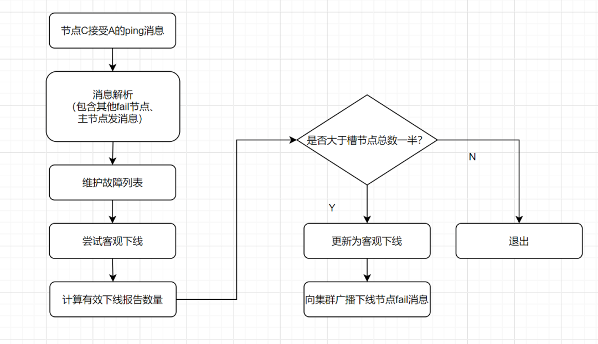
>
> - 假如节点A标记节点B为主观下线，一段时间后，节点A通过消息把节点B的状态发到其它节点，当节点C接受到消息并解析出消息体时，如果发现节点B的pfail状态时，会触发客观下线流程；
> - 当下线为主节点时，此时Redis Cluster集群为统计持有槽的主节点投票，看投票数是否达到一半，当下线报告统计数大于一半时，被标记为客观下线状态。

故障恢复：故障发现后，如果下线节点的是主节点，则需要在它的从节点中选一个替换它，以保证集群的高可用。

过程如下：

>1.资格检查：检查从节点是否具备替换故障主节点的条件。
>2.准备选举时间：资格检查通过后，更新触发故障选举时间。
>3.发起选举：到了故障选举时间，进行选举。
>4.选举投票：只有持有槽的主节点才有票，从节点收集到足够的选票（大于一半），触发替换主节点操作


#### Redis高可用方案具体怎么实施？

使用官方推荐的哨兵(sentinel)机制就能实现，当主节点出现故障时，由Sentinel自动完成故障发现和转移，并通知应用方，实现高可用性。它有四个主要功能：

- 集群监控，负责监控Redis master和slave进程是否正常工作。
- 消息通知，如果某个Redis实例有故障，那么哨兵负责发送消息作为报警通知给管理员。
- 故障转移，如果master node挂掉了，会自动转移到slave node上。
- 配置中心，如果故障转移发生了，通知client客户端新的master地址。

#### 什么是分布式锁？为什么用分布式锁？

锁在程序中的作用就是同步工具，保证共享资源在同一时刻只能被一个线程访问，Java中的锁我们都很熟悉了，像synchronized 、Lock都是我们经常使用的，但是Java的锁只能保证单机的时候有效，分布式集群环境就无能为力了，这个时候我们就需要用到分布式锁。

 分布式锁，顾名思义，就是分布式项目开发中用到的锁，可以用来控制分布式系统之间同步访问共享资源。

 思路是：在整个系统提供一个**全局、唯一**的获取锁的“东西”，然后每个系统在需要加锁时，都去问这个“东西”拿到一把锁，这样不同的系统拿到的就可以认为是同一把锁。至于这个“东西”，可以是Redis、Zookeeper，也可以是数据库。 

一般来说，分布式锁需要满足的特性有这么几点： 1、互斥性：在任何时刻，对于同一条数据，只有一台应用可以获取到分布式锁； 2、高可用性：在分布式场景下，一小部分服务器宕机不影响正常使用，这种情况就需要将提供分布式锁的服务以集群的方式部署； 3、防止锁超时：如果客户端没有主动释放锁，服务器会在一段时间之后自动释放锁，防止客户端宕机或者网络不可达时产生死锁； 4、独占性：加锁解锁必须由同一台服务器进行，也就是锁的持有者才可以释放锁，不能出现你加的锁，别人给你解锁了。

##### 常见的分布式锁有哪些解决方案？

实现分布式锁目前有三种流行方案，即基于关系型数据库、Redis、ZooKeeper 的方案

 1、基于关系型数据库，如MySQL基于关系型数据库实现分布式锁，是依赖数据库的唯一性来实现资源锁定，比如主键和唯一索引等。 缺点：

- 这把锁强依赖数据库的可用性，数据库是一个单点，一旦数据库挂掉，会导致业务系统不可用。
- 这把锁没有失效时间，一旦解锁操作失败，就会导致锁记录一直在数据库中，其他线程无法再获得到锁。
- 这把锁只能是非阻塞的，因为数据的insert操作，一旦插入失败就会直接报错。没有获得锁的线程并不会进入排队队列，要想再次获得锁就要再次触发获得锁操作。
- 这把锁是非重入的，同一个线程在没有释放锁之前无法再次获得该锁。因为数据中数据已经存在了。

2、基于Redis实现 优点： Redis 锁实现简单，理解逻辑简单，性能好，可以支撑高并发的获取、释放锁操作。 缺点：

- Redis 容易单点故障，集群部署，并不是强一致性的，锁的不够健壮；
- key 的过期时间设置多少不明确，只能根据实际情况调整；
- 需要自己不断去尝试获取锁，比较消耗性能。

3、基于zookeeper 优点： zookeeper 天生设计定位就是分布式协调，强一致性，锁很健壮。如果获取不到锁，只需要添加一个监听器就可以了，不用一直轮询，性能消耗较小。 缺点： 在高请求高并发下，系统疯狂的加锁释放锁，最后 zk 承受不住这么大的压力可能会存在宕机的风险。

##### 了解RedLock吗？

Redlock是一种算法，Redlock也就是 Redis Distributed Lock，可用实现多节点Redis的分布式锁。 RedLock官方推荐，Redisson完成了对Redlock算法封装。 此种方式具有以下特性：

- 互斥访问：即永远只有一个 client 能拿到锁
- 避免死锁：最终 client 都可能拿到锁，不会出现死锁的情况，即使锁定资源的服务崩溃或者分区，仍然能释放锁。
- 容错性：只要大部分 Redis 节点存活（一半以上），就可以正常提供服务

> Redlock算法的工作流程如下：
>
> **获取当前时间戳**：单位是毫秒。**尝试获取锁**：客户端依次向5个独立的Redis实例发送相同的key和value请求锁。每个请求的超时时间应远小于锁的总超时时间，以防止在某个不可用的节点上阻塞过长时间[1](https://blog.csdn.net/Weixiaohuai/article/details/116293762)。**计算获取锁的时间**：客户端计算获取所有锁所用的时间，并判断是否小于锁的总超时时间（TTL）且至少有3个实例成功获取锁[1](https://blog.csdn.net/Weixiaohuai/article/details/116293762)。**确定锁的有效时间**：如果成功获取锁，则锁的有效时间为TTL减去获取锁所用的时间[1](https://blog.csdn.net/Weixiaohuai/article/details/116293762)。**释放锁**：如果获取锁失败，客户端会在所有实例上释放锁，即使那些没有成功获取锁的实例上也会执行释放操作[1](https://blog.csdn.net/Weixiaohuai/article/details/116293762)。

#### 分布式锁的双重校验

在实现 Redis 分布式锁时，双重校验可以提高锁的安全性和可靠性。以下是实现双重校验的**原因：**

1. 互斥性：Redis 分布式锁需要确保在某一时刻只有一个客户端能持有锁。当一个客户端尝试获取锁时，双重校验有助于确保锁的互斥性，防止其他客户端意外获取锁。
2. 防止死锁：在某些情况下，锁可能因为客户端崩溃或者网络问题而没有正确释放，导致死锁。双重校验可以帮助在客户端尝试获取锁时检查锁的状态，确保锁不会被意外地一直持有。
3. 安全性：分布式锁可能会遇到诸如延迟、竞争条件等问题。双重校验有助于在客户端成功获取锁后验证锁的所有权，确保其他客户端没有在同一时刻获取到相同的锁。

```lua
if redis.call("GET", KEYS[1]) == ARGV[1] then
  return redis.call("DEL", KEYS[1])
else
  return 0
end
```

这个脚本会检查给定的键是否具有给定的值，如果匹配，则删除键，否则不执行任何操作。这样可以确保只有锁的持有者可以释放锁。

使用双重校验的 Redis 分布式锁可以提高锁的安全性和可靠性，降低锁竞争和死锁的风险。然而，需要注意的是，Redis 分布式锁并非完全可靠的锁解决方案，因为它可能受到网络延迟和其他因素的影响。如果需要更高的锁可靠性，可以考虑使用其他锁解决方案，如 ZooKeeper 或 etcd。

**实现**

以下是实现 Redis 分布式锁及双重校验的步骤：

1. 锁定：当客户端尝试获取锁时，首先使用 **SET key value NX PX milliseconds** 命令尝试设置锁。这个命令会在键不存在时设置键值对，并为键设置一个过期时间。这有助于确保锁的互斥性和防止死锁。
2. 双重校验：如果客户端成功设置了键值对，即成功获取了锁，接下来进行第二次校验。客户端可以使用 **GET key** 命令获取锁的值，然后与之前设置的值进行比较。如果值相同，则说明客户端确实持有锁；如果值不同，说明锁可能在尝试获取过程中被其他客户端获取，此时客户端应等待并重新尝试获取锁。
3. 释放锁：在完成共享资源的访问后，客户端需要释放锁以允许其他客户端获取锁。释放锁的过程需要确保原子性，以防止误解锁。一种推荐的做法是使用 Lua 脚本或 Redis 的 **MULTI** 和 **EXEC** 命令来确保原子性。

**对比**

>Redis分布式锁缺点：
>
>1. **主从复制延迟**：如果 Redis **主节点挂掉**，锁可能在从节点中仍然存在，导致多个客户端获得同一把锁。
>2. **没有自动续约**：如果执行任务时间超过锁的 `TTL`，锁会自动释放，其他客户端可能会获得锁，而第一个任务还未完成。
>3. **RedLock 方案复杂**：Redis 官方的 RedLock 方案需要多个 Redis 实例协调，但仍然不能完全避免网络分区等问题。

> *zookeeper*
>
> ZooKeeper 是一个 **强一致性** 的分布式协调系统，基于 **ZAB（Zookeeper Atomic Broadcast）协议** 实现高可靠性。它的分布式锁基于 **临时有序节点（Ephemeral Sequential Nodes）** 来保证唯一性和可靠性。
>
> **实现步骤**
>
> 1. **创建一个临时有序节点**
>    - 所有客户端在 `/locks` 目录下创建 **有序临时节点**（`/locks/lock-0000000001`）。
>    - 由于 **有序性**，ZooKeeper 会给节点自动编号。
> 2. **获取最小编号的节点**
>    - 客户端获取 `/locks` 下的所有子节点，并找到 **编号最小的节点**。
>    - 如果自己创建的节点是最小的，则获得锁。
> 3. **监听比自己小的节点**
>    - 如果自己 **不是最小节点**，则监听比自己小的那个节点。
>    - 当比自己小的节点删除时，自己成为最小编号节点，获得锁。
> 4. **释放锁**
>    - 任务完成后，客户端主动删除该节点，或者如果客户端宕机，**临时节点自动删除**，从而不会发生死锁。
>
> **ZooKeeper 分布式锁的优势**
>
> ✅ **自动删除锁**：如果客户端宕机，ZooKeeper 会自动删除其临时节点，防止死锁。
>  ✅ **严格的顺序性**：保证所有请求按创建顺序依次获取锁，避免了 "惊群效应"。
>  ✅ **强一致性**：基于 ZAB 协议，保证锁的可靠性，即使网络分区也能正确恢复。

> **使用 etcd 实现分布式锁**
>
> etcd 是一个分布式键值存储系统，基于 **Raft 共识算法** 实现 **强一致性**，适用于分布式锁。etcd 主要依赖 **Lease（租约）+ 事务（Txn）** 机制实现锁的可靠性。
>
> **实现步骤**
>
> 1. **创建锁键（带租约）**
>    - 客户端在 etcd 中创建一个唯一的 key，例如 `/locks/my_lock`，并绑定一个 **租约（Lease）**。
>    - 只允许第一个创建成功的客户端获得锁，其他客户端会失败。
> 2. **自动续约**
>    - 客户端可以定期向 etcd **续约租约**，防止锁因超时释放。
> 3. **监听锁释放**
>    - 如果获取锁失败，客户端可以监听 `/locks/my_lock`，等锁释放后再尝试获取。
> 4. **释放锁**
>    - 客户端执行完任务后，主动删除 `/locks/my_lock`，或者 **租约到期自动释放**。
>
> **etcd 分布式锁的优势**
>
> ✅ **基于 Raft 保证强一致性**：不同于 Redis 可能因主从切换导致锁丢失，etcd 采用 **Raft 选举**，保证所有节点数据一致。
>  ✅ **租约机制避免死锁**：即使客户端崩溃，租约到期后，锁自动释放。
>  ✅ **支持监听机制**：可以监听锁的释放，避免轮询导致的 CPU 资源浪费。

- **Redis 适合高性能、高并发但允许一定不一致性的场景**（如分布式限流）。

- **ZooKeeper 适用于分布式事务、分布式任务调度等需要严格顺序性的场景**。

- **etcd 适用于云原生环境（如 Kubernetes），具有更轻量级的 Raft 强一致性锁**。


#### 业务场景

##### 如果现在有个读超高并发的系统，用Redis来抗住大部分读请求，你会怎么设计？

如果是读高并发的话，先看读并发的数量级是多少，因为Redis单机的读QPS在万级，每秒几万没问题，使用一主多从+哨兵集群的缓存架构来承载每秒10W+的读并发，主从复制，读写分离。 使用哨兵集群主要是提高缓存架构的可用性，解决单点故障问题。主库负责写，多个从库负责读，支持水平扩容，根据读请求的QPS来决定加多少个Redis从实例。

如果读并发继续增加的话，只需要增加Redis从实例就行了。 如果需要缓存1T+的数据，选择Redis cluster模式，每个主节点存一部分数据，假设一个master存32G，那只需要n*32G>=1T，n个这样的master节点就可以支持1T+的海量数据的存储了。 Redis单主的瓶颈不在于读写的并发，而在于内存容量，即使是一主多从也是不能解决该问题，因为一主多从架构下，多个slave的数据和master的完全一样。假如master是10G那slave也只能存10G数据。所以数据量受单主的影响。而这个时候又需要缓存海量数据，那就必须得有多主了，并且多个主保存的数据还不能一样。Redis官方给出的 Redis cluster 模式完美的解决了这个问题。

##### 用redis实现百万用户游戏积分排行榜

Redis是一个高性能的内存数据存储系统，对于游戏的积分排行榜来说非常适合。可以通过以下步骤来实现百万用户游戏积分排行榜：

1. 使用Redis的Sorted Set数据结构存储用户积分：将用户ID作为成员，积分作为分数，每当用户得分变化时，通过ZADD命令更新积分。
2. 使用ZREVRANGE命令获取排行榜：该命令可以根据分数的降序返回成员，从而实现排行榜。
3. 使用Hash数据结构存储用户详细信息：将用户ID作为键，用户详细信息（例如用户名、头像等）作为值，可以通过HGET命令快速获取用户详细信息。

这样，通过排序集合和哈希数据结构的结合，就可以实现高效、稳定的百万用户游戏积分排行榜。

##### 大key和热点问题

大key（即存储大量数据的单个键）可能会导致以下问题：

- 内存消耗过大：大key占用大量内存，影响缓存的整体性能。
- 传输延迟：读取或写入大key的数据可能会导致网络传输延迟。

**解决方法**：

1. 拆分大key：
   - 将大key的数据拆分成多个小key。例如，将一个包含大量数据的列表拆分成多个小列表，分别存储在不同的键中。
   - 对大Key进行清理。UNLINK命令能够以非阻塞的方式缓慢逐步的清理传入的Key
   - 使用序列化、压缩算法将key的大小控制在合理范围内，但是需要注意序列化、反序列化都会带来一定的消耗。如果压缩后，value还是很大，那么可以进一步对key进行拆分。
   - 例如，将一个用户的大量订单数据拆分成按年份或月份存储的多个键。
2. 使用合适的数据结构：
   - 利用缓存系统提供的合适的数据结构，如 Redis 的哈希表、列表、集合等，来存储和组织数据。
   - 例如，使用 Redis 的哈希表存储用户信息，每个字段作为一个小key。

热点问题是指某个键或一小部分键被频繁访问，导致缓存节点的负载过高，影响整体性能。 **解决方法**：

1. 数据分片：
   - 将数据分片存储在不同的缓存节点上，均衡负载。
   - 例如，**使用一致性哈希算法将键均匀分布到不同的缓存节点上**。
2. 增加缓存副本：
   - 为热点数据增加缓存副本，将热点数据复制到多个缓存节点上，分散访问压力。
   - 例如，使用 Redis 的主从复制，将热点数据存储在多个从节点上，分散读请求。
3. 本地缓存结合分布式缓存：
   - 在应用层使用本地缓存（如 Guava Cache），结合分布式缓存，减少对分布式缓存的直接访问。
   - 例如，应用程序先查询本地缓存，如果未命中再查询分布式缓存，减少热点数据对分布式缓存的压力。

#### 一致性hash

它是一种分布式系统中常用的哈希算法，用于解决数据分布问题。

1. **目标**: 一致性哈希的主要目的是将数据均匀分布到多个节点上，并在节点增减时尽可能减少数据的重新分配。
2. **哈希环**: 一致性哈希使用一个逻辑上的环来分布数据。每个节点和数据项都被映射到环上的一个位置。
3. 映射:
   - **节点映射**: 每个节点通过哈希函数映射到环上的某个位置。
   - **数据映射**: 数据也通过哈希函数映射到环上的位置。
4. **数据存储**: 数据存储在顺时针方向上第一个经过的节点上。例如，如果数据的哈希值位于节点A和节点B之间，那么数据将被存储在节点A上。
5. 节点变动:
   - **增加节点**: 当增加一个节点时，它只会影响到环上它之前存储数据的节点。新的节点只会接管部分数据，减少了数据迁移。
   - **删除节点**: 当删除一个节点时，它的数据将转移到环上顺时针方向的下一个节点。

**优点**:

- **平衡负载**: 节点增加或减少时，对数据的影响最小。
- **减少数据迁移**: 节点变化时，只需迁移少量数据。

**缺点**:

- **数据分布不均**: 如果节点数量变化较大或哈希函数不均匀，数据分布可能不均。
- **计算复杂性**: 哈希环上的节点查找和数据分布需要一些额外的计算和维护。

在实际应用中，一致性哈希常用于负载均衡、缓存系统和分布式存储系统中。

#### Redis消息队列

消息队列在存取消息时，必须要满足三个需求，分别是消息保序、处理重复的消息和保证消息可靠性。

##### List实现

**如何满足消息保序需求？**

> List 本身就是按先进先出的顺序对数据进行存取的，所以，如果使用 List 作为消息队列保存消息的话，就已经能满足消息保序的需求了。
>
> List 可以使用 LPUSH + RPOP （或者反过来，RPUSH+LPOP）命令实现消息队列。
>
> 不过，在消费者读取数据时，有一个潜在的性能风险点。
>
> 在生产者往 List 中写入数据时，List 并不会主动地通知消费者有新消息写入，如果消费者想要及时处理消息，就需要在程序中不停地调用 RPOP 命令（比如使用一个while(1)循环）。如果有新消息写入，RPOP命令就会返回结果，否则，RPOP命令返回空值，再继续循环。
>
> 所以，即使没有新消息写入List，消费者也要不停地调用 RPOP 命令，这就会导致消费者程序的 CPU 一直消耗在执行 RPOP 命令上，带来不必要的性能损失。
>
> 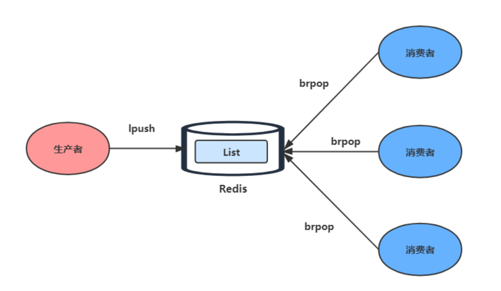
>
> 为了解决这个问题，Redis提供了 BRPOP 命令。BRPOP命令也称为阻塞式读取，客户端在没有读到队列数据时，自动阻塞，直到有新的数据写入队列，再开始读取新数据。和消费者程序自己不停地调用RPOP命令相比，这种方式能节省CPU开销。

**如何处理重复的消息？**

> 消费者要实现重复消息的判断，需要 2 个方面的要求：
>
> - 每个消息都有一个全局的 ID。
> - 消费者要记录已经处理过的消息的 ID。当收到一条消息后，消费者程序就可以对比收到的消息 ID 和记录的已处理过的消息 ID，来判断当前收到的消息有没有经过处理。如果已经处理过，那么，消费者程序就不再进行处理了。
>
> 但是 List 并不会为每个消息生成 ID 号，所以我们需要自行为每个消息生成一个全局唯一ID，生成之后，我们在用 LPUSH 命令把消息插入 List 时，需要在消息中包含这个全局唯一 ID。

**如何保证消息可靠性？**

> 当消费者程序从 List 中读取一条消息后，List 就不会再留存这条消息了。所以，如果消费者程序在处理消息的过程出现了故障或宕机，就会导致消息没有处理完成，那么，消费者程序再次启动后，就没法再次从 List 中读取消息了。
>
> 为了留存消息，List 类型提供了 BRPOPLPUSH 命令，这个命令的作用是让消费者程序从一个 List 中读取消息，同时，Redis 会把这个消息再插入到另一个 List（可以叫作备份 List）留存。
>
> 这样一来，如果消费者程序读了消息但没能正常处理，等它重启后，就可以从备份 List 中重新读取消息并进行处理了。
>
> **Redis Stream 的核心命令：**
>
> - `XADD`: 生产者发送消息
> - `XREADGROUP`: 消费者组读取消息（**不移除，只是标记为“待处理”**）
> - `XACK`: 处理完成后确认消息（**会把消息从 Pending List 删除**）
> - `XPENDING`: 查看未 ack 的消息（处理失败或消费者宕机时能用）
> - `XCLAIM`: 把长时间未 ack 的消息转移给另一个消费者（**重试机制**）

**list的缺陷**

> List 不支持多个消费者消费同一条消息，因为一旦消费者拉取一条消息后，这条消息就从 List 中删除了，无法被其它消费者再次消费。
>
> 要实现一条消息可以被多个消费者消费，那么就要将多个消费者组成一个消费组，使得多个消费者可以消费同一条消息，但是 List 类型并不支持消费组的实现。
>
> 这就要说起 Redis 从 5.0 版本开始提供的 Stream 数据类型了，Stream 同样能够满足消息队列的三大需求，而且它还支持「消费组」形式的消息读取。

**Stream**

> Redis Stream 是 Redis 5.0 版本新增加的数据类型，Redis 专门为消息队列设计的数据类型。
>
> 在 Redis 5.0 Stream 没出来之前，消息队列的实现方式都有着各自的缺陷，例如：
>
> 发布订阅模式，不能持久化也就无法可靠的保存消息，并且对于离线重连的客户端不能读取历史消息的缺陷；
> List 实现消息队列的方式不能重复消费，一个消息消费完就会被删除，而且生产者需要自行实现全局唯一 ID。
> 基于以上问题，Redis 5.0 便推出了 Stream 类型也是此版本最重要的功能，用于完美地实现消息队列，它支持消息的持久化、支持自动生成全局唯一 ID、支持 ack 确认消息的模式、支持消费组模式等，让消息队列更加的稳定和可靠。

Stream实现消息队列

> 生产者通过 XADD 命令插入一条消息：
>
> ```cmd
> # 表示让 Redis 为插入的数据自动生成一个全局唯一的 ID
> # 往名称为 mymq 的消息队列中插入一条消息，消息的键是 name，值是 xiaolin
> > XADD mymq * name xiaolin
> "1654254953808-0"
> ```
>
> - 第一部分“1654254953808”是数据插入时，以毫秒为单位计算的当前服务器时间；
> - 第二部分表示插入消息在当前毫秒内的消息序号，这是从 0 开始编号的。例如，“1654254953808-0”就表示在“1654254953808”毫秒内的第 1 条消息。

**消费组**

> Stream 可以以使用 XGROUP 创建消费组，创建消费组之后，Stream 可以使用 XREADGROUP 命令让消费组内的消费者读取消息。
>
> 消息队列中的消息一旦被消费组里的一个消费者读取了，就不能再被该消费组内的其他消费者读取了，即同一个消费组里的消费者不能消费同一条消息。
>
> 但是，不同消费组的消费者可以消费同一条消息（但是有前提条件，创建消息组的时候，不同消费组指定了相同位置开始读取消息）。

**消息的持久化**

> Streams 会自动使用内部队列（也称为 PENDING List）留存消费组里每个消费者读取的消息，直到消费者使用 XACK 命令通知 Streams“消息已经处理完成”。
>
> 如果消费者没有成功处理消息，它就不会给 Streams 发送 XACK 命令，消息仍然会留存。此时，消费者可以在重启后，用 XPENDING 命令查看已读取、但尚未确认处理完成的消息。

**Redis Stream 与专业消息队列的差距**

> **消息不丢**：通过ack机制可以保证消息传输过程不丢失，但是redis在以下场景会导致数据丢失。
>
> - AOF 持久化配置为每秒写盘，但这个写盘过程是异步的，Redis 宕机时会存在数据丢失的可能
> - 主从复制也是异步的，主从切换时，也存在丢失数据的可能 (opens new window)。
>
> **消息可堆积**：Redis 的数据都存储在内存中，这就意味着一旦发生消息积压，则会导致 Redis 的内存持续增长，如果超过机器内存上限，就会面临被 OOM 的风险。Stream 提供了可以指定队列最大长度的功能，就是为了避免这种情况发生。
>
> 当指定队列最大长度时，队列长度超过上限后，旧消息会被删除，只保留固定长度的新消息。这么来看，Stream 在消息积压时，如果指定了最大长度，还是有可能丢失消息的。
>
> 但 Kafka、RabbitMQ 专业的消息队列它们的数据都是存储在磁盘上，当消息积压时，无非就是多占用一些磁盘空间。
>
> **使用redis作为消息队列原因：**
>
> - 如果你的业务场景足够简单，对于数据丢失不敏感，而且消息积压概率比较小的情况下，把 Redis 当作队列是完全可以的。
> - 如果你的业务有海量消息，消息积压的概率比较大，并且不能接受数据丢失，那么还是用专业的消息队列中间件吧。

### 分布式、云服务

#### etcd

etcd 是一个 **高可用、强一致性** 的分布式 KV 存储，常用于 **服务发现、配置管理、分布式锁** 等场景，特别适用于 **Kubernetes（K8s）等云原生架构**。

| 特性                  | 说明                                                |
| --------------------- | --------------------------------------------------- |
| **强一致性**          | 基于 Raft 协议，保证所有节点数据一致。              |
| **高可用性**          | 采用 **多副本机制**，某些节点宕机不影响整体可用性。 |
| **Watch 监听机制**    | 允许客户端监听 Key 变化，实现实时通知。             |
| **事务支持（Txn）**   | 允许 **原子性操作**，避免并发冲突。                 |
| **租约机制（Lease）** | 提供 Key 过期自动删除功能，适用于分布式锁等场景。   |

> 核心原理

##### **Raft 共识算法**

etcd **使用 Raft 共识算法** 来保证数据一致性，Raft 由三部分组成：

1. **Leader 选举**：集群中的节点会选出一个 **Leader** 处理所有写请求。
2. **日志复制（Log Replication）**：Leader 接受写请求，并同步到 Follower 节点。
3. **日志提交（Commit）**：当 **超过半数节点** 确认数据写入，才认为事务提交成功。

✅ **特点**

- 只允许 **Leader** 处理写请求，Follower 只负责同步数据。
- 通过 **心跳检测** 保持 Leader 角色，防止分裂脑（Split-brain）。
- **基于多数派协议**，保证即使部分节点宕机，也能继续提供服务。

##### **etcd 存储结构**

etcd 内部是一个 **多版本 B+ 树**，存储 Key-Value 数据，每个 Key 都有多个版本（revision）。

```bash
/services/db        ->  "mysql:3306"    (rev 1)
/services/cache     ->  "redis:6379"    (rev 2)
```

✅ **特点**

- 支持 **范围查询（Range Scan）**，可以查询某个目录下所有 Key。
- **MVCC（多版本控制）**，可以查询历史数据，避免并发问题。

##### **Watch 监听机制**

etcd 提供 `Watch` 机制，可以监听 **Key 变化**，用于 **配置热更新、服务发现等**。

```go
// 监听 /services/db 的变化
ch := cli.Watch(context.TODO(), "/services/db")

// 遍历监听事件
for wresp := range ch {
    for _, ev := range wresp.Events {
        fmt.Printf("Type: %s Key: %s Value: %s\n", ev.Type, ev.Kv.Key, ev.Kv.Value)
    }
}
```

✅ **特点**

- **支持前缀监听**，可以监听 `/services/` 下所有子 Key。
- **高效**，基于 Raft 复制日志，无需轮询。

##### **事务（Txn）**

etcd 支持 **原子事务**（类似 SQL 事务），避免并发冲突。

```go
txnResp, err := cli.Txn(context.TODO()).
    If(clientv3.Compare(clientv3.Value("/counter"), ">", "100")). // 如果 counter > 100
    Then(clientv3.OpPut("/status", "overload")).                 // 执行操作
    Else(clientv3.OpPut("/status", "normal")).                   // 否则执行
    Commit()
```

- **保证 ACID 原子性**，避免并发修改冲突。

- **支持条件判断**（`If`），执行不同逻辑。

#####  **Lease（租约）机制**

etcd 允许 **给 Key 绑定租约**，当租约过期，Key 会自动删除，适用于 **分布式锁、服务注册**。

**示例（创建租约 & 绑定 Key）**

```go
leaseResp, _ := cli.Grant(context.TODO(), 10)  // 10 秒过期
cli.Put(context.TODO(), "/lock", "node1", clientv3.WithLease(leaseResp.ID))
```

✅ **特点**

- 避免 **僵尸锁问题**，节点宕机后，锁自动释放。
- **支持续租（KeepAlive）**，保证锁不会过早释放。

##### **etcd 常见面试题**

**3.1 etcd 和 ZooKeeper 的区别？**

| 特性         | etcd                     | ZooKeeper                    |
| ------------ | ------------------------ | ---------------------------- |
| **共识算法** | Raft（一致性更强）       | ZAB                          |
| **数据模型** | KV 存储（适合云原生）    | ZNode 树结构（适合层级存储） |
| **监听机制** | Watch（高效，基于 Raft） | 事件监听（容易丢失）         |
| **性能**     | 读写性能高（轻量级）     | 适合读多写少的场景           |
| **适用场景** | K8s、分布式锁            | 分布式事务、元数据管理       |

✅ **结论**

- **Kubernetes 选择 etcd**，因为 etcd 更轻量、性能更高，适合云原生。
- **ZooKeeper 适合分布式事务**（如 HDFS、Kafka 的元数据管理）。

**3.2 为什么 etcd 采用 Raft 而不是 Paxos？**

Raft 比 Paxos 更简单，易于实现：

- **Raft 只允许一个 Leader 处理写请求**，避免了 Paxos 的 Leader 选举复杂性。
- **Raft 的日志同步更简单**，所有写入都需要 **超过半数节点** 确认。
- **Raft 更易理解和实现**，适合工程化落地。

**3.3 etcd 如何保证数据一致性？**

etcd 通过 **Raft 算法** 保证一致性：

1. **Leader 选举**：只有 Leader 处理写入，防止脑裂（Split-brain）。
2. **日志复制**：Leader 先写本地，再同步到 Follower。
3. **多数派确认**：必须 **超过半数节点** 确认，才提交日志。
4. **崩溃恢复**：新 Leader 选举后，Follower 回滚未提交日志。

**3.4 etcd 的 CAP 特性**

| 特性                | etcd                         |
| ------------------- | ---------------------------- |
| **一致性（C）**     | ✅ Raft 保证强一致性          |
| **可用性（A）**     | ✅ 只要多数节点存活，集群可用 |
| **分区容忍性（P）** | ✅ 允许部分节点宕机           |

✅ **结论**

- etcd **放弃 AP，保证 CP**（强一致性）。
- 适用于 **分布式协调、配置存储**，但不适合大规模数据存储。

**3.5 etcd 如何避免脑裂？**

etcd 通过 Raft 一致性协议 + 多数投票机制，从源头防止了脑裂的发生，是强一致性场景下的首选注册中心和配置中心。

>  1.Raft 协议要求多数节点（Majority）选主

- etcd 集群运行在 Raft 协议上。
- **只有获得超过半数节点投票的候选者才能成为 Leader**。
- 比如一个 5 个节点的集群，**至少需要 3 个节点活跃，才能选出 Leader**。
- 当网络分区发生时：
  - 少数派（如只剩 2 个节点）**无法获得多数票，因此不会产生新的 Leader**，写入被阻止。
  - 多数派继续服务，数据写入安全有序。

> 2.Follower 自动降级，避免错误响应

- 如果 Follower **长时间没有收到 Leader 的心跳（默认 1s）**，它会发起选举，但必须要获得多数节点响应才能成功。

- 如果网络中断，**单个 Follower 或少数节点无法组成新的合法集群**，从而不会错误响应请求。

> 3.Leader Lease 和 Quorum 提交机制

- etcd 使用 Raft 的 **Lease（租约）机制**，Leader 每隔一段时间需刷新租约，如果失联，就会被降级。
- 写入数据必须**被多数节点确认（quorum）**，即便 Leader 接收了写请求，**也要复制到多数副本才能提交**。

这可以保证：**数据写入不会“漂移”到分区或孤立的节点**。

#### protobuf

##### 为什么需要 Protobuf?
在分布式系统中，不同服务之间需要进行数据的传输和通信。传统的文本格式如 XML 和 JSON 虽然易于阅读和理解，但存在以下问题：

冗余的数据量：文本格式会包含大量的标签和无关信息，导致数据传输的负载较大。
解析性能低下：文本格式需要进行字符串解析，消耗 CPU 资源和时间。
可扩展性差：当数据结构发生变化时，需要手动修改代码和解析逻辑。

##### Protobuf 的实现原理
Protobuf 的实现原理主要包括以下几个方面：

定义消息结构：使用 Protobuf 的语言描述文件（.proto）来定义数据的结构和字段类型。这些描述文件可以指定消息的字段、嵌套消息、枚举等。
编译生成代码：通过使用 Protobuf 提供的编译器，将描述文件编译成目标语言的代码。生成的代码包含了序列化和反序列化的方法，以及对应的数据结构。
序列化与反序列化：在发送端，将数据按照定义的消息结构进行序列化，转换为二进制格式；在接收端，将二进制数据反序列化为具体的数据对象。
版本兼容性：当数据结构发生变化时，可以通过向后兼容或者升级版本的方式来处理旧版本的数据。 

##### 优点和缺点

Protobuf 的优点
高效的编码和解码性能：Protobuf 使用紧凑的二进制格式进行数据传输，相比文本格式具有更小的体积和更快的速度。
跨语言支持：通过生成代码的方式，可以在不同的编程语言中使用 Protobuf，实现跨平台和跨语言的数据交换。
版本兼容性：Protobuf 提供了向后兼容和升级版本的机制，使得系统可以处理旧版本的数据，并且支持增量更新字段。
灵活的消息结构定义：Protobuf 的描述文件可以定义复杂的嵌套消息、枚举等，满足各种数据结构的需求。

Protobuf 的缺点
可读性差：由于 Protobuf 使用二进制编码，无法直接阅读和理解数据内容，对调试和排查问题带来一定困难。
不适合人类可读的配置文件：由于 Protobuf 的主要目标是高效的数据传输和存储，因此不适合用作人类可读的配置文件格式。

##### 面经

> 1.什么是 Protocol Buffers？
>
> Protocol Buffers（简称 protobuf）是 Google 开发的一种结构化数据的序列化协议，类似于 XML 或 JSON，但 **更小、更快、更简单**。它是一种语言无关、平台无关、可扩展的机制，主要用于**网络通信、数据存储**等场景。
>
> 2.使用 Protocol Buffers 有哪些好处？
>
> ✅ **高效**：二进制格式，比 JSON、XML 更小、更快。
>
> ✅ **跨语言**：支持多种语言（Go、Java、Python、C++、C#、Rust...）。
>
> ✅ **结构化**：使用 `.proto` 文件定义数据结构，类型安全。
>
> ✅ **可扩展**：新增字段不影响旧版本代码。
>
> ✅ **自动生成代码**：使用 `protoc` 编译器自动生成对应语言的类/结构体。
>
> 3.如何定义 Protocol Buffer 消息？
>
> 使用 `.proto` 文件定义，类似于下面的语法：
>
> ```protobuf
> syntax = "proto3";
> 
> message Person {
>   string name = 1;
>   int32 id = 2;
>   string email = 3;
> }
> ```
>
> - `syntax = "proto3"`：指定使用 proto3 语法。
> - 每个字段有一个唯一的 **标识号（tag）**，用于序列化。
>
> 4.Protocol Buffers 中常用的数据类型有哪些？
>
> | Protobuf 类型     | 描述       | 对应语言中的类型（Go） |
> | ----------------- | ---------- | ---------------------- |
> | `int32`           | 32 位整型  | `int32`                |
> | `int64`           | 64 位整型  | `int64`                |
> | `bool`            | 布尔值     | `bool`                 |
> | `string`          | 字符串     | `string`               |
> | `bytes`           | 字节数组   | `[]byte`               |
> | `float`, `double` | 浮点数     | `float32`, `float64`   |
> | `repeated`        | 数组/列表  | `[]T`                  |
> | `message`         | 嵌套结构体 | `struct`               |
>
> 5.Proto2 和 Proto3 有什么区别？
>
> | 区别点              | Proto2             | Proto3                           |
> | ------------------- | ------------------ | -------------------------------- |
> | `required/optional` | 支持               | 去掉 `required`，默认 optional   |
> | 默认值处理          | 可检测字段是否存在 | 不可检测是否赋值（只能靠默认值） |
> | 字段标签            | 必须写 tag         | 同样必须                         |
> | 枚举类型            | 可无默认值         | 必须有默认值（第一个为 0）       |
> | 支持 JSON 映射      | 手动写转换函数     | 内置支持                         |
>
> 6.如何对 Protocol Buffer 消息进行序列化？
>
> 不同语言方法不同：
>
> Go 示例：
>
> ```go
> data, err := proto.Marshal(person)
> ```
>
> Python 示例：
>
> ```python
> data = person.SerializeToString()
> ```
>
> 7.如何对 Protocol Buffer 消息进行反序列化？
>
> ```go
> var p Person
> err := proto.Unmarshal(data, &p)
> ```
>
> 8.如何处理 Protocol Buffers 中的版本控制？
>
> - ✅ **新增字段时保持兼容**（不要重用旧字段的 tag 编号）。
> - ✅ 使用 `reserved` 关键词保留删除字段的 tag 和名字：
>
> ```protobuf
> reserved 4, 5;
> reserved "old_name";
> ```
>
> - ✅ 不要改变字段的类型或顺序。
> - ✅ 使用默认值代替删除字段的需求。
>
> Protocol Buffers 通过使用可选字段和字段编号的方式提供了处理版本控制的机制。
>
> 您可以通过为新字段分配新的字段编号并将其设置为可选字段来向消息添加新字段，而不会破坏向后兼容性。
>
> 9.如何在解析 Protocol Buffer 数据时处理错误？
>
> 检查 `Unmarshal` 返回的 error。
>
> 遇到未知字段时，protobuf 会**自动忽略**，兼容性好。
>
> 可以自定义校验函数校验反序列化后的结构是否合法。
>
> 10.如何优化 Protocol Buffers 的性能？
>
> - 🔧 使用 **压缩（如 gzip）** 提高网络传输效率。
> - 🔧 使用 `repeated` + 合理的 tag 编号（小编号更快）。
> - 🔧 尽量避免嵌套太深的 message。
> - 🔧 tag 编号尽量使用 1~15 范围（使用 varint 编码，占用空间更少）。
> - 🔧 使用 proto3 + 静态语言（如 Go/C++）获得最大性能。

### 高并发问题

[golang-guide/project/设计方案及调研/高并发系统设计.md at main · mao888/golang-guide](https://github.com/mao888/golang-guide/blob/main/project/设计方案及调研/高并发系统设计.md)


#### 如何理解高并发系统

所谓设计**高并发**系统，就是设计一个系统，保证它**整体可用**的同时，能够**处理很高的并发用户请求**，能够承受**很大的流量冲击**。

我们要设计高并发的系统，那就需要处理好一些常见的系统瓶颈问题，如**内存不足、磁盘空间不足，连接数不够，网络宽带不够**等等，以应对突发的流量洪峰。

##### 1. 分而治之，横向扩展

如果你**只部署一个应用，只部署一台服务器**，那抗住的流量请求是非常有限的。并且，单体的应用，有单点的风险，如果它挂了，那服务就不可用了。

因此，设计一个高并发系统，我们可以**分而治之，横向扩展**。也就是说，采用分布式部署的方式，部署多台服务器，把流量分流开，让每个服务器都承担一部分的并发和流量，提升**整体系统的并发能力**。

##### 2. 微服务拆分（系统拆分）

要提高系统的吞吐，提高系统的处理并发请求的能力。除了采用**分布式部署的方式**外，还可以做**微服务拆分**，这样就可以达到分摊请求流量的目的，提高了并发能力。

所谓的**微服务拆分**，其实就是把一个单体的应用，按功能单一性，拆分为多个服务模块。**比如一个电商系统，拆分为用户系统、订单系统、商品系统等等**。

[](https://camo.githubusercontent.com/971c5f1157f375afa1b7c4f842d10fb8caf5c9c22a3c59c7632ece1c28c7d3e4/68747470733a2f2f70332d6a75656a696e2e62797465696d672e636f6d2f746f732d636e2d692d6b3375316662706663702f36353237633431373565313134376361383165633739343936646138323036317e74706c762d6b3375316662706663702d7a6f6f6d2d696e2d63726f702d6d61726b3a343533363a303a303a302e6177656270)

##### 3. 分库分表

当业务量暴增的话，MySQL单机**磁盘容量会撑爆**。并且，我们知道数据库连接数是有限的。**在高并发的场景下**，大量请求访问数据库，`MySQL`单机是扛不住的！高并发场景下，会出现`too many connections`报错。

所以高并发的系统，**需要考虑拆分为多个数据库，来抗住高并发的毒打**。而假如你的单表数据量非常大，存储和查询的性能就会遇到瓶颈了，如果你做了很多优化之后还是无法提升效率的时候，就需要考虑做**分表**了。一般千万级别数据量，就需要**分表**，每个表的数据量少一点，提升SQL查询性能。

当面试官问要求你设计一个高并发系统的时候，一般都要说到**分库分表**这个点。

之前写了分库分表15连问，为了应对面试官追问到底，大家可以顺便复习一下分库分表的相关经典面试题哈，可以看我这篇文章：[分库分表经典15连问](https://link.juejin.cn/?target=https%3A%2F%2Fmp.weixin.qq.com%2Fs%3F__biz%3DMzg3NzU5NTIwNg%3D%3D%26mid%3D2247502983%26idx%3D1%26sn%3D47cc9079b01940cbb83d4f71972e5d20%26chksm%3Dcf2213aef8559ab845c5740abc98c335f0b040976bc39781ade95ea085cf32a183021a54ff36%26token%3D1274856030%26lang%3Dzh_CN%23rd)

 ##### 4. 池化技术

在高并发的场景下，**数据库连接数**可能成为瓶颈，因为连接数是有限的。

我们的请求调用数据库时，都会先获取数据库的连接，然后依靠这个连接来查询数据，搞完收工，最后关闭连接，释放资源。如果我们不用数据库连接池的话，每次执行`SQL`，都要创建连接和销毁连接，这就会导致每个查询请求都变得更慢了，相应的，系统处理用户请求的能力就降低了。

因此，需要使用池化技术，即**数据库连接池、HTTP 连接池、Redis 连接池**等等。使用数据库连接池，可以避免每次查询都新建连接，减少不必要的资源开销，通过复用连接池，**提高系统处理高并发请求的能力**。

同理，我们使用线程池，也能**让任务并行处理，更高效地完成任务**。大家可以看下我之前线程池的这篇文章，到时候面试官问到这块时，刚好可以扩展开来讲

- [面试必备：Java线程池解析](https://link.juejin.cn/?target=https%3A%2F%2Fmp.weixin.qq.com%2Fs%3F__biz%3DMzg3NzU5NTIwNg%3D%3D%26mid%3D2247487945%26idx%3D1%26sn%3D447d2da258797de08eca329a2500d457%26chksm%3Dcf21cee0f85647f676dced72811b90bf7db7c898d2a90b7dc2195c5d6279c05d1b125d4b82a1%26token%3D1976733249%26lang%3Dzh_CN%26scene%3D21%23wechat_redirect)
- [细数线程池的10个坑](https://link.juejin.cn/?target=https%3A%2F%2Fmp.weixin.qq.com%2Fs%3F__biz%3DMzg3NzU5NTIwNg%3D%3D%26mid%3D2247501030%26idx%3D1%26sn%3D0c0c8523d73d65ba7358856ea02fb5fc%26chksm%3Dcf221bcff85592d9556cb3735357b96baad9544c1b9c3149d0bffc290dedab32bb86d40e1075%26token%3D1976733249%26lang%3Dzh_CN%26scene%3D21%23wechat_redirect)

##### 5. 主从分离

通常来说，一台单机的MySQL服务器，可以支持`500`左右的`TPS`和`10000`左右的`QPS`，即单机支撑的**请求访问是有限**的。因此你做了分布式部署，部署了多台机器，部署了主数据库、从数据库。

但是，如果双十一搞活动，流量肯定会猛增的。如果所有的查询请求，都走主库的话，主库肯定扛不住，因为查询请求量是非常非常大的。因此一般都要求做**主从分离**，然后实时性要求不高的读请求，都去读从库，**写的请求或者实时性要求高的请求，才走主库**。这样就很好保护了主库，也提高了系统的吞吐。

当然，如果回答了主从分离，面试官可能扩展开问你**主从复制原理，问你主从延迟问题**等等，这块大家需要**全方位复习好**哈。可以去看看我之前的这篇文章

[面试必备：聊聊MySQL的主从](https://link.juejin.cn/?target=https%3A%2F%2Fmp.weixin.qq.com%2Fs%3F__biz%3DMzg3NzU5NTIwNg%3D%3D%26mid%3D2247497982%26idx%3D1%26sn%3Dbb589329cceb5462fc41f66ec63dbf56%26chksm%3Dcf2227d7f855aec16dd4d3b3425c0401850eeaf2c9cdc82e82722d38a00c24ee9ccfa3353774%26token%3D1274856030%26lang%3Dzh_CN%23rd)

##### 6. 使用缓存

无论是操作系统，浏览器，还是一些复杂的中间件，你都可以看到缓存的影子。我们使用缓存，主要是提升系统接口的性能，这样高并发场景，你的系统就可以支持更多的用户同时访问。

常用的缓存包括：`Redis`缓存，`JVM`本地缓存，`memcached`等等。就拿`Redis`来说，它单机就能轻轻松松应对几万的并发，你读场景的业务，可以用缓存来抗高并发。

缓存虽然用得爽，但是要**注意缓存使用的一些问题**：

- 缓存与数据库的一致性问题
- 缓存雪崩
- 缓存穿透
- 缓存击穿

如果大家打算使用`Redis`的话，需要知道一些注意点，可以看下我之前的这篇文章哈，挺好的。[使用Redis，你必须知道的21个注意要点](https://link.juejin.cn/?target=https%3A%2F%2Fmp.weixin.qq.com%2Fs%3F__biz%3DMzg3NzU5NTIwNg%3D%3D%26mid%3D2247488325%26idx%3D1%26sn%3D6d9bbe5bf2f2f2904755de5c786fb21b%26chksm%3Dcf21cc6cf856457a9d23b3e25ec48107a582e709f05964dfdb5ba77e9a239d8307334c485fdf%26token%3D1371687559%26lang%3Dzh_CN%23rd)

##### 7. CDN，加速静态资源访问

商品图片，`icon`等等静态资源，可以对页面做**静态化处理，减少访问服务端的请求**。如果用户分布在全国各地，有的在上海，有的在深圳，地域相差很远，网速也各不相同。为了让用户最快访问到页面，可以使用`CDN`。`CDN`可以让用户就近获取所需内容。

什么是CDN？

> Content Delivery Network/Content Distribution Network,翻译过来就是内容分发网络，它表示将静态资源分发到位于多个地理位置机房的服务器，可以做到数据就近访问，加速了静态资源的访问速度，因此让系统更好处理正常别的动态请求。

##### 8. 消息队列，削锋

我们搞一些双十一、双十二等运营活动时，需要**避免流量暴涨，打垮应用系统的风险**。因此一般会引入消息队列，来应对**高并发的场景**。

[](https://camo.githubusercontent.com/8bb69b68f41f6ba6a8dfc94385a04ba8a3b1b23a8b00f766d974f7dc20a4bad1/68747470733a2f2f70332d6a75656a696e2e62797465696d672e636f6d2f746f732d636e2d692d6b3375316662706663702f30316632633235333630393734653963383333613965323734356535653431617e74706c762d6b3375316662706663702d7a6f6f6d2d696e2d63726f702d6d61726b3a343533363a303a303a302e6177656270)

假设你的应用系统每秒最多可以处理`2k`个请求，每秒却有`5k`的请求过来，可以引入消息队列，应用系统每秒从消息队列拉`2k`请求处理得了。

有些伙伴担心这样可能会出现**消息积压**的问题：

- 首先，搞一些运营活动，不会每时每刻都那么多请求过来你的系统（**除非有人恶意攻击**），高峰期过去后，积压的请求可以慢慢处理；
- 其次，如果消息队列长度超过最大数量，可以直接抛弃用户请求或跳转到错误页面；

##### 9. ElasticSearch

`Elasticsearch`，大家都使用得比较多了吧，**一般搜索功能都会用到它**。它是一个分布式、高扩展、高实时的搜索与数据分析引擎，简称为`ES`。

我们在聊高并发，为啥聊到`ES`呢？ 因为`ES`可以扩容方便，天然支撑高并发。**当数据量大的时候，不用动不动就加机器扩容，分库等等**，可以考虑用`ES`来支持简单的查询搜索、统计类的操作。

##### 10. 降级熔断

**熔断降级**是保护系统的一种手段。当前互联网系统一般都是分布式部署的。而分布式系统中偶尔会出现某个基础服务不可用，最终导致整个系统不可用的情况, 这种现象被称为**服务雪崩效应**。

比如分布式调用链路`A->B->C....`，下图所示：

[](https://camo.githubusercontent.com/40cd000aac1f9f754e66053dff9f577e5804ac248f424c9a2766d250d2bce90e/68747470733a2f2f70332d6a75656a696e2e62797465696d672e636f6d2f746f732d636e2d692d6b3375316662706663702f65346365306665623232626434373734383935343962646132363164633438377e74706c762d6b3375316662706663702d7a6f6f6d2d696e2d63726f702d6d61726b3a343533363a303a303a302e6177656270)

> 如果服务`C`出现问题，比如是因为慢`SQL`导致调用缓慢，那将导致`B`也会延迟，从而`A`也会延迟。堵住的`A`请求会消耗占用系统的线程、IO、CPU等资源。当请求`A`的服务越来越多，占用计算机的资源也越来越多，最终会导致系统瓶颈出现，造成其他的请求同样不可用，最后导致业务系统崩溃。

为了应对服务雪崩, 常见的做法是**熔断和降级**。最简单是加开关控制，当下游系统出问题时，开关打开降级，不再调用下游系统。还可以选用开源组件`Hystrix`来支持。

你要保证设计的系统能应对**高并发场景**，那肯定要考虑**熔断降级**逻辑进来。

##### 11. 限流

限流也是我们应对高并发的一种方案。我们当然希望，在高并发大流量过来时，系统能全部请求都正常处理。但是有时候没办法，系统的CPU、网络带宽、内存、线程等资源都是有限的。因此，我们要考虑限流。

如果你的系统每秒扛住的请求是一千，**如果一秒钟来了十万请求呢**？换个角度就是说，高并发的时候，流量洪峰来了，超过系统的承载能力，怎么办呢？

这时候，我们可以采取限流方案。就是为了保护系统，多余的请求，直接丢弃。

> **什么是限流**：在计算机网络中，限流就是控制网络接口发送或接收请求的速率，它可防止DoS攻击和限制Web爬虫。限流，也称流量控制。是指系统在面临高并发，或者大流量请求的情况下，限制新的请求对系统的访问，从而保证系统的稳定性。

可以使用`Guava`的`RateLimiter`单机版限流，也可以使用`Redis`分布式限流，还可以使用阿里开源组件`sentinel`限流。

面试的时候，你说到限流这块的话？面试官很大概率会问你限流的算法，因此，大家在准备面试的时候，需要复习一下这几种经典的限流算法哈，可以看下我之前的这篇文章，[面试必备：4种经典限流算法讲解](https://link.juejin.cn/?target=https%3A%2F%2Fmp.weixin.qq.com%2Fs%3F__biz%3DMzg3NzU5NTIwNg%3D%3D%26mid%3D2247490393%26idx%3D1%26sn%3D98189caa486406f8fa94d84ba0667604%26chksm%3Dcf21c470f8564d665ce04ccb9dc7502633246da87a0541b07ba4ac99423b28ce544cdd6c036b%26token%3D162724582%26lang%3Dzh_CN%26scene%3D21%23wechat_redirect)

> **固定窗口限流**算法：单位时间内设定限流阈值，当访问次数超过阈值直接拒绝。下一个单位时间访问次数清零。
>
> 缺点：不能解决临界问题。设定限流阈值为5，则下图场景失败。已经**超过单位时间1s不超过5阀值**的定义啦。
>
> 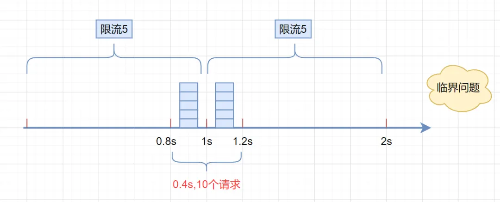


> **滑动窗口限流**解决固定窗口临界值的问题。它将单位时间周期分为n个小周期，分别记录每个小周期内接口的访问次数，并且根据时间滑动删除过期的小周期。关键：**细分单位时间为n段**
>
> 缺点：一旦到达限流后，请求都会直接暴力被拒绝。


> **漏桶算法**面对限流，就更加的柔性，不存在直接的粗暴拒绝。它的原理很简单，可以认为就是**注水漏水**的过程。往漏桶中以任意速率流入水，以固定的速率流出水。当水超过桶的容量时，会被溢出，也就是被丢弃。因为桶容量是不变的，保证了整体的速率。
>
> 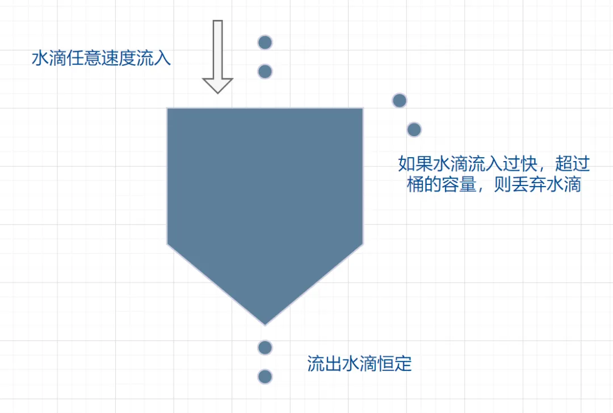
>
> - 流入的水滴，可以看作是访问系统的请求，这个流入速率是不确定的。
> - 桶的容量一般表示系统所能处理的请求数。
> - 如果桶的容量满了，就达到限流的阀值，就会丢弃水滴（拒绝请求）
> - 流出的水滴，是恒定过滤的，对应服务按照固定的速率处理请求。


> **令牌桶**算法：解决突发流量下的限流问题。
>
> 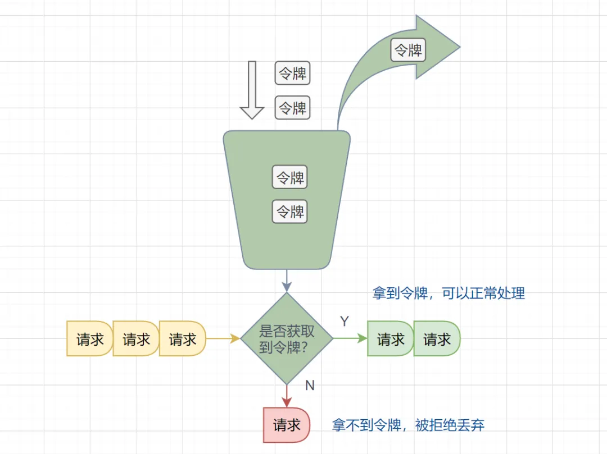
>
> - 有一个令牌管理员，根据限流大小，定速往令牌桶里放令牌。
> - 如果令牌数量满了，超过令牌桶容量的限制，那就丢弃。
> - 系统在接受到一个用户请求时，都会先去令牌桶要一个令牌。如果拿到令牌，那么就处理这个请求的业务逻辑；
> - 如果拿不到令牌，就直接拒绝这个请求。


##### 12. 异步

> 回忆一下什么是同步，什么是异步呢？以**方法调用**为例，它代表**调用方要阻塞等待被调用方法中的逻辑执行完成**。这种方式下，当被调用方法响应时间较长时，会造成调用方长久的阻塞，在高并发下会造成整体系统性能下降甚至发生雪崩。异步调用恰恰相反，调用方不需要等待方法逻辑执行完成就可以返回执行其他的逻辑，在被调用方法执行完毕后再通过回调、事件通知等方式将结果反馈给调用方。

因此，设计一个高并发的系统，**需要在恰当的场景使用异步**。如何使用异步呢？后端可以借用消息队列实现。比如在海量秒杀请求过来时，先放到消息队列中，快速相应用户，告诉用户请求正在处理中，这样就可以释放资源来处理更多的请求。秒杀请求处理完后，通知用户秒杀抢购成功或者失败。

##### 13. 常规的优化

设计一个高并发的系统，需要设计接口的性能足够好，这样系统在相同时间，就可以处理更多的请求。当说到这里的话，大家就可以跟面试官说说接口优化的一些方案了。大家可以看下我的这篇文章哈:[实战总结！18种接口优化方案的总结](https://link.juejin.cn/?target=https%3A%2F%2Fmp.weixin.qq.com%2Fs%3F__biz%3DMzg3NzU5NTIwNg%3D%3D%26mid%3D2247502660%26idx%3D1%26sn%3D17166646f82412cd81955930f799ab4e%26chksm%3Dcf22146df8559d7bcf9becd82e1d8006c35a781e5dbd0a79e0a9e121803ee40d6eae7ebd7ccb%26token%3D1371687559%26lang%3Dzh_CN%23rd)

[](https://camo.githubusercontent.com/3adfee513a6874b74329d448389b159188d30f8f523d93a149fec44a4aa5f9ae/68747470733a2f2f70332d6a75656a696e2e62797465696d672e636f6d2f746f732d636e2d692d6b3375316662706663702f33316536623161363161626434333734613763643063643337653466306434327e74706c762d6b3375316662706663702d7a6f6f6d2d696e2d63726f702d6d61726b3a343533363a303a303a302e6177656270)

##### 14. 压力测试确定系统瓶颈

设计高并发系统，离不开最重要的一环，**就是压力测试**。就是在系统上线前，需要对系统进行压力测试，测清楚你的系统支撑的最大并发是多少，确定系统的瓶颈点，让自己心里有底，最好预防措施。

压测完要分析整个调用链路，性能可能出现问题是网络层（如带宽）、Nginx层、服务层、还是数据路缓存等中间件等等。

`loadrunner`是一款不错的压力测试工具，`jmeter`则是接口性能测试工具，都可以来做下压测。

##### 15. 应对突发流量峰值：扩容+切流量

如果是突发的流量高峰，除了降级、限流保证系统不跨，我们可以采用这两种方案，保证系统尽可能服务用户：

- 扩容：**比如增加从库、提升配置的方式**，提升系统/组件的流量承载能力。比如增加`MySQL、Redis`从库来处理查询请求。
- 切流量：**服务多机房部署**，如果高并发流量来了，把流量从一个机房切换到另一个机房。

### 操作系统

[💹 大厂面经 - 操作系统面试必问 50 题！ - 《程序员的必备修养》 - 极客文档](https://geekdaxue.co/read/qingyubailou@gygiq6/gyuw9ixg30htr4y6#5z2hwg)

#### 操作系统概述

##### 系统调用 / 用户态和内核态

根据**进程访问资源**的特点，我们可以把进程在系统上的运行分为两个级别：

- 用户态(user mode) : 用户态运行的进程可以直接读取**用户程序的数据**，无法直接访问硬件资源。 
- 系统态(kernel mode):可以简单的理解系统态运行的进程或程序几乎可以访问**计算机的任何资源**，不受限制。

> **为什么分用户态和内核态？**
>
> **安全性**：通过对权限的划分，用户程序无法直接访问硬件资源，从而避免了恶意程序对系统资源的破坏。
> **稳定性**：用户态程序出现问题时，不会影响到整个系统，避免了程序故障导致系统崩溃的风险。
> **隔离性**：内核态和用户态的划分使得操作系统内核与用户程序之间有了明确的边界，有利于系统的模块化和维护。

在我们运行的用户程序中，凡是与**系统态级别的资源有关的操作**（如文件管理、进程控制、内存管理等)，都必须通过**系统调用**方式向操作系统提出服务请求，并由操作系统代为完成。

> 这些系统调用按功能大致可分为如下几类：
>
> - 设备管理。完成设备的请求或释放，以及设备启动等功能。 
> - 文件管理。完成文件的读、写、创建及删除等功能。 
> - 进程控制。完成进程的创建、撤销、阻塞及唤醒等功能。 
> - 进程通信。完成进程之间的消息传递或信号传递等功能。 
> - 内存管理。完成内存的分配、回收以及获取作业占用内存区大小及地址等功能。

##### **那么如何从用户态切换到内核态呢？**

> - 系统调用
>   这是用户态进程主动要求切换到内核态的一种方式，用户态进程通过系统调用申请使用操作系统提供的服务程序完成工作，比如 read 操作，比如前例中 fork() 实际上就是执行了一个创建新进程的系统调用。而系统调用的机制其核心还是使用了操作系统为用户特别开放的一个中断来实现，例如Linux的int 80h中断。 
> - 异常
>   当CPU在执行运行在用户态下的程序时，发生了某些事先不可知的异常，这时会触发由当前运行进程切换到处理此异常的内核相关程序中，也就转到了内核态，比如缺页异常。 
> - 外围设备的中断
>   当外围设备完成用户请求的操作后，会向CPU发出相应的中断信号，这时CPU会暂停执行下一条即将要执行的指令转而去执行与中断信号对应的处理程序，如果先前执行的指令是用户态下的程序，那么这个转换的过程自然也就发生了由用户态到内核态的切换。比如硬盘读写操作完成，系统会切换到硬盘读写的中断处理程序中执行后续操作等。 
>
> 这3种方式是系统在运行时由用户态转到内核态的最主要方式，其中系统调用可以认为是用户进程主动发起的，异常和外围设备中断则是被动的。

##### **其他必会知识**

> - 并行与并发
>   并发：在操作系统中，**某一时间段，**几个程序在同一个CPU上运行**，但在任意一个时间点上，只有**一个程序在CPU上运行**。
>   并行：两个程序在某一时刻**同时运行，强调同时发生。
> - 阻塞与非阻塞
>   阻塞是指**调用线程或者进程被操作系统挂起**。
>   非阻塞是指调用线程或者进程不会被操作系统挂起。
> - 同步与异步
>   同步与异步同步是阻塞模式，异步是非阻塞模式。
>   同步就是指一个进程在执行某个请求的时候，若该请求需要一段时间才能返回信息，那么这个进程将会一直等待下去，知道收到返回信息才继续执行下去；
>   异步是指进程不需要一直等下去，而是继续执行下面的操作，不管其他进程的状态。当有消息返回式系统会通知进程进行处理，这样可以提高执行的效率。

#### 内存管理

包括内存分配、内存回收、地址转换、内存保护功能

##### 虚拟内存的管理方式

操作系统引入了虚拟内存，进程持有的虚拟地址会通过 CPU 芯片中的内存管理单元（MMU）的映射关系，来转换变成物理地址，然后再通过物理地址访问内存

**1.内存分段**

> **段号+段表+段内偏移**
>
> 程序是由若干个逻辑分段组成的，如可由代码分段、数据分段、栈段、堆段组成。不同的段是有不同的属性的，所以就用分段（Segmentation）的形式把这些段分离出来。
>
> **缺点：内存碎片，内存交换效率低**
>
> - 内存碎片主要分为，**内部内存碎片和外部内存碎片**。
> - 内存分段管理可以做到段根据实际需求分配内存，所以有多少需求就分配多大的段，所以**不会出现内部内存碎片**。
> - 但是由于每个段的长度不固定，所以多个段未必能恰好使用所有的内存空间，会产生了多个不连续的小物理内存，导致新的程序无法被装载，所以会出现外部内存碎片的问题。
>
> 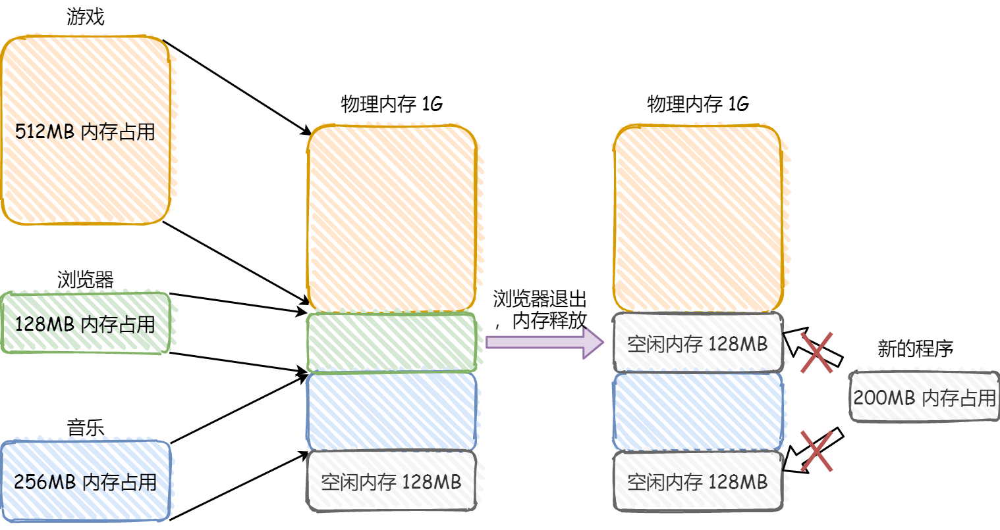
>
> 解决外部内存碎片：内存交换
>
> *可以把音乐程序占用的那 256MB 内存写到硬盘上，然后再从硬盘上读回来到内存里。不过再读回的时候，我们不能装载回原来的位置，而是紧紧跟着那已经被占用了的 512MB 内存后面。这样就能空缺出连续的 256MB 空间，于是新的 200MB 程序就可以装载进来。在 Linux 系统里，也就是我们常看到的 Swap 空间*
>
> 多进程的系统产生外存碎片很容易，那不得不重新 Swap 内存区域，这个过程会产生性能瓶颈。如果内存交换的时候，交换的是一个占内存空间很大的程序，这样整个机器都会显得卡顿。

**2.内存分页**

> 分页是把整个虚拟和物理内存空间切成一段段固定尺寸的大小。这样一个连续并且尺寸固定的内存空间，我们叫页（Page）。在 Linux 下，每一页的大小为 4KB。
>
> 虚拟地址=页号+页内偏移，页号是页表的索引，页表保存物理页每页的物理内存地址的基地址，基地址和页内偏移组成物理地址。
>
> - 把虚拟内存地址，切分成页号和偏移量；
> - 根据页号，从页表里面，查询对应的物理页号；
> - 直接拿物理页号，加上前面的偏移量，就得到了物理内存地址。
>
> 1.分页管理解决了内存外部碎片问题，但是产生了内部碎片现象，因为内存分页机制分配内存的最小单位是一页，即使程序不足一页大小，我们最少只能分配一个页，所以页内会出现内存浪费
>
> 2.分页管理的内存交换效率更高：如果内存空间不足，操作系统会把其他正在运行的进程中的「最近没被使用」的内存页面给释放掉，也就是暂时写在硬盘上，称为换出（Swap Out）。一旦需要的时候，再加载进来，称为换入（Swap In）。所以，一次性写入磁盘的也只有少数的一个页或者几个页，不会花太多时间，内存交换的效率就相对比较高。此外，不需要一次性将程序全部加载到物理内存，而是在程序运行中需要用到对应虚拟内存时再进行加载。
>
> 缺点：空间上页表浪费资源。使用多级页表解决，如果某个一级页表的页表项没有被用到，也就不需要创建这个页表项对应的二级页表了，即可以在需要时才创建二级页表。对于64位的系统，采用了四级分页目录。
>
> 多级页表的问题：虚拟地址=>物理的地址转换速度下降，使用CPU中存放程序最常访问的页表的cache：TLB（Translation Lookaside Buffer），即快表/页表缓存
>
> 在 CPU 芯片里面，封装了内存管理单元（Memory Management Unit）芯片，它用来完成地址转换和 TLB 的访问与交互。有了 TLB 后，那么 CPU 在寻址时，会先查 TLB，如果没找到，才会继续查常规的页表。

**3.段页式管理**

>段页式地址变换中要得到物理地址须经过三次内存访问：
>
>第一次访问段表，得到页表起始地址；
>第二次访问页表，得到物理页号；
>第三次将物理页号与页内位移组合，得到物理地址。

**4.linux内存管理方案**

> 逻辑地址(程序使用) + 段式内存映射 => 线性地址(虚拟地址)  + 页式内存管理 => 物理地址
>
> 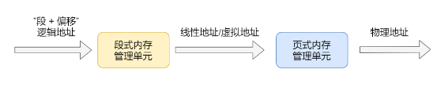
>
> Linux 系统主要采用了分页管理，但是由于 Intel 处理器的发展史，Linux 系统无法避免分段管理。于是 **Linux 就把所有段的基地址设为 0**，也就意味着所有程序的地址空间都是线性地址空间（虚拟地址），相当于**屏蔽了 CPU 逻辑地址的概念，所以段只被用于访问控制和内存保护。**
>
> 线性地址 = 段基址 + 逻辑偏移 = 0 + 偏移 = 逻辑地址 == 线性地址。换句话说，段不再转换地址，也不限制访问范围，等于没用了！
>
> 所以：**地址转换、内存保护全部交给“页表 + MMU”处理了。**
>
> 另外，Linux 系统中虚拟空间分布可分为用户态和内核态两部分，其中用户态的分布：代码段、全局变量、BSS、函数栈、堆内存、映射区。

##### 虚拟内存的作用

- 第一，虚拟内存可以使得进程对运行内存超过物理内存大小，因为程序运行符合局部性原理，CPU 访问内存会有很明显的重复访问的倾向性，对于那些没有被经常使用到的内存，我们可以把它换出到物理内存之外，比如硬盘上的 swap 区域。
- 第二，由于每个进程都有自己的页表，所以每个进程的虚拟内存空间就是相互独立的。进程也没有办法访问其他进程的页表，所以这些页表是私有的，这就解决了多进程之间地址冲突的问题。
- 第三，页表里的页表项中除了物理地址之外，还有一些标记属性的比特，比如控制一个页的读写权限，标记该页是否存在等。在内存访问方面，操作系统提供了更好的安全性。

> 总结：提高物理内存的容量，进程的内存隔离，提供权限控制提高内存利用率

##### malloc() 和 free()

malloc() 并不是系统调用，而是 C 库里的函数，用于动态分配内存。malloc 申请内存的时候，会有两种方式向操作系统申请堆内存。

方式一：通过 brk() 系统调用从**堆分配内存**
方式二：通过 mmap() 系统调用在**文件映射区**域分配内存；

> 方式一：如果用户分配的内存小于 128 KB，则通过 brk() 申请内存；就是通过 brk() 函数将「堆顶」指针向高地址移动，获得新的内存空间。
>
> 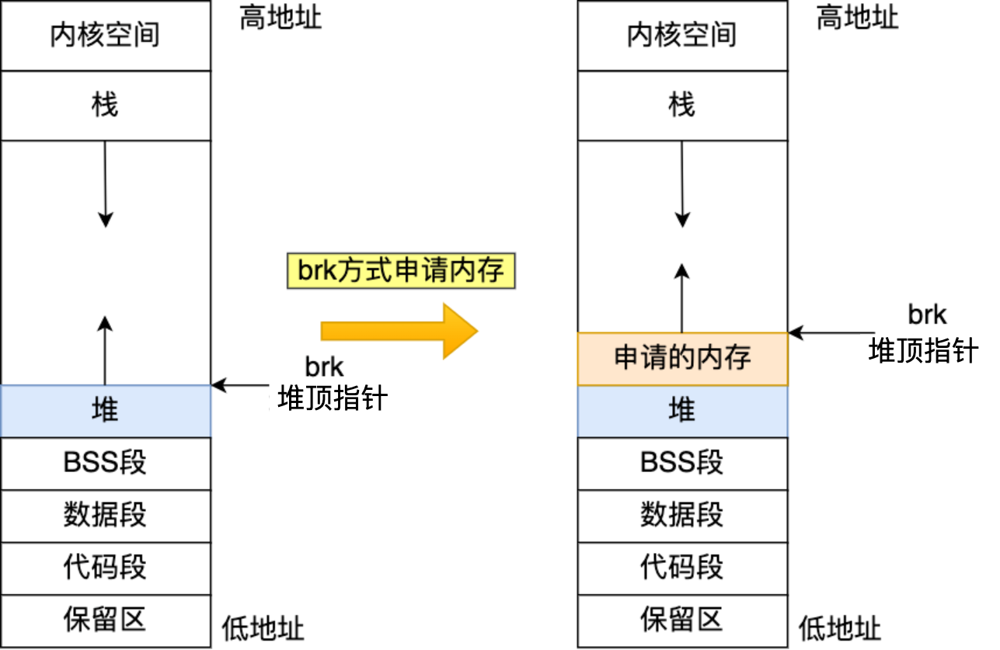

> 方式二：如果用户分配的内存大于 128 KB，则通过 mmap() 申请内存；
>
> 通过 mmap() 系统调用中「私有匿名映射」的方式，在文件映射区分配一块内存，也就是从文件映射区“偷”了一块内存。
>
> 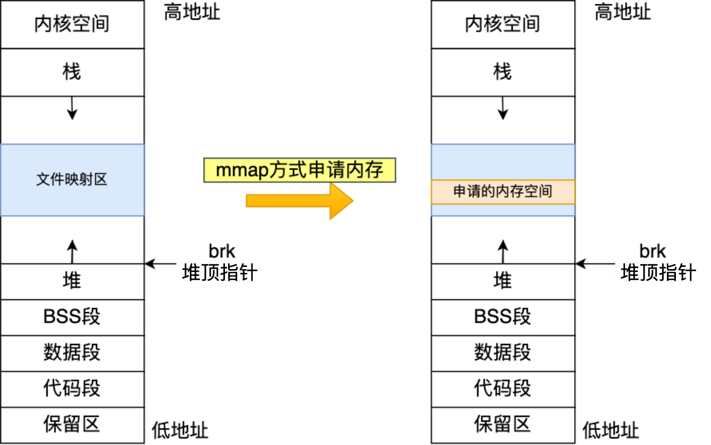

###### malloc() 分配的是物理内存吗

> 不是的，malloc() 分配的是虚拟内存。

如果分配后的虚拟内存没有被访问的话，虚拟内存是不会映射到物理内存的，这样就不会占用物理内存了。

只有在访问已分配的虚拟地址空间的时候，操作系统通过查找页表，发现虚拟内存对应的页没有在物理内存中，就会触发**缺页中断**，然后操作系统会建立虚拟内存和物理内存之间的映射关系。

###### malloc(1) 会分配多大的虚拟内存？

malloc() 在分配内存的时候，并不是老老实实按用户预期申请的字节数来分配内存空间大小，而是会预分配更大的空间作为内存池。

###### free 释放内存，会归还给操作系统吗？

- malloc 通过 brk() 方式申请的内存，free 释放内存的时候，并不会把内存归还给操作系统，而是缓存在 malloc 的内存池中，待下次使用；
- malloc 通过 mmap() 方式申请的内存，free 释放内存的时候，会把内存归还给操作系统，内存得到真正的释放。

> **mmap的缺点：**
>
> 因为向操作系统申请内存，是要通过系统调用的，执行系统调用是要进入内核态的，然后在回到用户态，运行态的切换会耗费不少时间。通过 mmap 分配的内存话，不仅每次都会发生运行态的切换，还会发生缺页中断（在第一次访问虚拟地址后），这样会导致 CPU 消耗较大。
>
> 而使用brk方式申请内存时，堆空间地址是连续的，内存释放后虚拟地址和物理地址的映射关系依然存在，可以减少缺页中断的次数。
>
> **brk缺点：** 对于小块内存，堆内将产生越来越多的不可用的碎片，导致内存泄漏。

##### 内存分配的过程

应用程序通过 malloc 函数申请内存的时候，实际上申请的是虚拟内存，此时并不会分配物理内存。

当应用程序读写了这块虚拟内存，CPU 就会去访问这个虚拟内存， 这时会发现这个虚拟内存没有映射到物理内存， CPU 就会产生**缺页中断**，进程会从用户态切换到内核态，并将缺页中断交给内核的 Page Fault Handler （缺页中断函数）处理。

缺页中断处理函数会看是否有空闲的物理内存，如果有，就直接分配物理内存，并建立虚拟内存与物理内存之间的映射关系。

如果没有空闲的物理内存，那么内核就会开始进行**回收内存**的工作，回收的方式主要是两种：直接内存回收和后台内存回收。

**后台内存回收**（kswapd）：在物理内存紧张的时候，会唤醒 kswapd 内核线程来回收内存，这个回收内存的过程异步的，不会阻塞进程的执行。
**直接内存回收**（direct reclaim）：如果后台异步回收跟不上进程内存申请的速度，就会开始直接回收，这个回收内存的过程是同步的，会阻塞进程的执行。
如果直接内存回收后，空闲的物理内存仍然无法满足此次物理内存的申请，那么内核就会放最后的大招了 ——**触发 OOM （Out of Memory）机制**。

OOM Killer 机制会根据算法选择一个占用物理内存较高的进程，然后将其杀死，以便释放内存资源，如果物理内存依然不足，OOM Killer 会继续杀死占用物理内存较高的进程，直到释放足够的内存位置。

> **哪些内存可以回收？**
>
> **文件页**：内核缓存的磁盘数据（Buffer）和内核缓存的文件数据（Cache）都叫作文件页。回收干净页的方式是直接释放内存，回收脏页的方式是先写回磁盘后再释放内存。
>
> **匿名页**：这部分内存没有实际载体，不像文件缓存有硬盘文件这样一个载体，比如堆、栈数据等。它们回收的方式是通过 Linux 的 Swap 机制，Swap 会把不常访问的内存先写到磁盘中，然后释放这些内存，给其他更需要的进程使用。
>
> 文件页和匿名页的回收都是基于 LRU 算法，也就是优先回收不常访问的内存。

> **如何确保一个进程不被OOM杀掉？**
>
> Linux 内核里有一个` oom_badness()`函数，它会把系统中可以被杀掉的进程扫描一遍，并对每个进程打分，得分最高的进程就会被首先杀掉。得分来自于进程使用的物理内存页数和进程的OOM校准值`oom_score_adj`
>
> 用「系统总的可用页面数」乘以 「OOM 校准值 oom_score_adj」再除以 1000，最后再加上进程已经使用的物理页面数，计算出来的值越大，那么这个进程被 OOM Kill 的几率也就越大。
>
> 每个进程的 oom_score_adj 默认值都为 0。
>
> - 如果你不想某个进程被首先杀掉，那你可以调整该进程的 oom_score_adj，从而改变这个进程的得分结果，降低该进程被 OOM 杀死的概率。
> - 如果你想某个进程无论如何都不能被杀掉，那你可以将 oom_score_adj 配置为 -1000。

##### 预读失效和缓存污染该怎么避免？

> 等效于如何改进LRU算法？

> mysql的缓存：innodb的buffer pool(内存上的缓冲池)
>
> - 当读取数据时，如果数据存在于 Buffer Pool 中，客户端就会直接读取 Buffer Pool 中的数据，否则再去磁盘中读取。
> - 当修改数据时，首先是修改 Buffer Pool 中数据所在的页，然后将其页设置为脏页，最后由后台线程将脏页写入到磁盘。
>
> 注意：mysql可以分为server层和存储引擎层，buffer pool位于存储引擎层，而另一个cache机制是来自于mysql的server层的缓存查询机制，查询sql语句的缓存。buffer pool中缓存的是实际上的数据页(buffer pool默认128M，数据页16KB)

**预读机制是啥：**

> Linux 操作系统为基于 Page Cache 的读缓存机制提供预读机制，一个例子是：
>
> 应用程序只想读取磁盘上文件 A 的 offset 为 0-3KB 范围内的数据，由于磁盘的基本读写单位为 block（4KB），于是操作系统至少会读 0-4KB 的内容，这恰好可以在一个 page 中装下。
>
> 但是操作系统出于空间局部性原理（靠近当前被访问数据的数据，在未来很大概率会被访问到），会选择将磁盘块 offset [4KB,8KB)、[8KB,12KB) 以及 [12KB,16KB) 都加载到内存，于是额外在内存中申请了 3 个 page；这样下次读取4KB后面数据时就不用从磁盘读取了
>
> 预读机制带来的好处就是**减少了 磁盘 I/O 次数，提高系统磁盘 I/O 吞吐量。**

**预读的缺点**

> 如果这些被提前加载进来的页，并没有被访问，相当于这个预读工作是白做了，这个就是预读失效。
>
> 如果是传统的LRU算法，会把预读页放在链表头部，优先淘汰尾部的页，但是尾部的页更可能是热点数据，这样会降低缓存命中率。
>
> **解决方案：**
>
> - Linux 操作系统实现两个了 LRU 链表：活跃 LRU 链表（active_list）和非活跃 LRU 链表（inactive_list）；
> - MySQL 的 Innodb 存储引擎是在一个 LRU 链表上划分来 2 个区域：young 区域 和 old 区域。
>
> 这两个改进方式，设计思想都是类似的，都是将数据分为了冷数据和热数据，然后分别进行 LRU 算法。

**缓存污染是啥**

> 虽然 Linux （实现两个 LRU 链表）和 MySQL （划分两个区域）通过改进传统的 LRU 数据结构，避免了预读失效带来的影响。
>
> 但是如果还是使用「只要数据被访问一次，就将数据加入到活跃 LRU 链表头部（或者 young 区域）」这种方式的话，那么还存在缓存污染的问题。
>
> 当我们在批量读取数据的时候，由于数据被访问了一次，这些大量数据都会被加入到「活跃 LRU 链表」里，然后之前缓存在活跃 LRU 链表（或者 young 区域）里的热点数据全部都被淘汰了，如果这些大量的数据在很长一段时间都不会被访问的话，那么整个活跃 LRU 链表（或者 young 区域）就被污染了。
>
> gpt: 缓存污染(也称缓存污染或缓存失效)是指MySQL的缓存机制(主要是InnoDB Buffer Pool)中存储了大量不常用或无效的数据，导致缓存命中率下降，性能降低的现象。
>
> **缺点：**
>
> 当某一个 SQL 语句扫描了大量的数据时，在 Buffer Pool 空间比较有限的情况下，可能会将 Buffer Pool 里的所有页都替换出去，导致大量热数据被淘汰了，等这些热数据又被再次访问的时候，由于缓存未命中，就会产生大量的磁盘 I/O，MySQL 性能就会急剧下降。
>
> **解决方案：**
>
> 只要我们提高进入到活跃 LRU 链表（或者 young 区域）的门槛，就能有效地保证活跃 LRU 链表（或者 young 区域）里的热点数据不会被轻易替换掉。
>
> 为了避免「缓存污染」造成的影响，Linux 操作系统和 MySQL Innodb 存储引擎分别提高了升级为热点数据的门槛：
>
> - Linux 操作系统：在内存页被访问第二次的时候，才将页从 inactive list 升级到 active list 里。
> - MySQL Innodb：在内存页被访问第二次的时候，并不会马上将该页从 old 区域升级到 young 区域，因为还要进行停留在 old 区域的时间判断：
>   - 如果第二次的访问时间与第一次访问的时间在 1 秒内（默认值），那么该页就不会被从 old 区域升级到 young 区域；
>   - 如果第二次的访问时间与第一次访问的时间超过 1 秒，那么该页就会从 old 区域升级到 young 区域；
>
> 通过提高了进入 active list （或者 young 区域）的门槛后，就很好了避免缓存污染带来的影响。


##### 讲讲内存管理的几种机制

1. 分块管理
   是连续管理的一种，把内存分为几个大小相等且固定的块，每个进程占用其中一个，如果进程很小的话，会浪费大量的空间。已经淘汰。
2. 分页管理
   把内存分为若干个很小的页面，相对比分块的划分力度更大一些。提高内存利用率。减少碎片，页式管理通过页表对应逻辑地址和物理地址。
3. 分段管理
   把内存分为几个大小不定的有实际意义的段，比如 main 函数段，局部变量段，通过管理段表来把逻辑地址转为物理地址。
4. 段页式管理
   结合了段式管理和页面管理的优点，把主存先分为若干个段，每个段又分为若干个页，也就是说段页式管理的段与段以及段的内部都是离散的。

##### 分页和分段有什么区别呢？

- 共同点的话：
  - 首先都是离散分配的，单每个页和每个段的内存是连续的。 
  - 都是为了提高内存利用率，减少内存碎片。 
- 不同点：
  - 分页式管理的页面大小是固定的，由操作系统决定；分段式管理的页面是由用户程序所决定的。 
  - 分页是为了满足操作系统内存管理的需求，每一页是没有实际的意义的；而段是有逻辑意义的，在程序中可认为是代码段、数据段。 
  - 分页的内存利用率高，不会产生外部碎片；而分段如果单段长度过大，为其分配很大的连续空间不方便，会产生外部碎片。

##### 讲讲分页管理的快表和多级页表

快表

- why? 首先快表的引入是为了加快**逻辑地址到物理地址的访问速度**的，在引入快表之前，由逻辑地址访问到内存的过程是这样的：
  a) 首先根据逻辑地址的高位拿到页号
  b) 根据页号访问内存中页表，根据页表的映射拿到实际的内存块儿号。（一次访问）
  c) 把内存块儿号和逻辑地址的低位拼接，得到物理地址
  d) 访问对应的内存物理地址。（二次访问）
  这样是需要有两次直接访问内存的过程的，所以为了加快这个速度，引入了快表，快表可以认为是一个 Cache，内容是页表的一部分或者全部内容。和页表的功能是一样的，只不过比在内存中的页表的访问速度要快很多。
- how? 根据局部性原理，被访问后的内存块儿很可能在短时间内再次被访问，可能程序在一段时间内会多次访问同一个页表项。所以在每次访问页表项时，先在快表里查询是否有该页表项，如果没有再去页表中查询，并把查到的页表项放入快表。如果快表满了，就根据一些策略把里面的页表项淘汰掉，再把新查询的页表加入进去。

多级页表

- why? 多级页表主要是为了解决页表在**内存中占用空间太大的问题**的，典型的时间换空间。
- how？讲个例子即可：在引入多级页表之前，我们使用单级页表来进行存储页表项，假如虚拟内存为 4GB，每个页大小为 4KB，那么需要的页表项就为 4GB / 4KB = 1M 个！每个页表项一般为 4B，那么就需要 4MB 的空间，大概需要占用 1000 个页来存页表项。
  所以如果引入两级页表，让一级页表的每个页表项不再映射 4KB，而是映射 4MB，那么需要的一级页表项的个数为 4GB / 4MB = 1K 个，再让每个一级的页表项映射 1K 个二级页表项。当一级页表的某个页表项被用到时，再把该一级页表项对应的所有 1K 个二级页表项加载到内存中，这样可以节省大量的空间！

##### 讲讲虚拟地址和物理地址？为什么要有虚拟地址空间？

我们在写程序的时候打交道的都是虚拟地址，比如 C 语言的指针，这个虚拟地址由操作系统决定，而物理地址指的是真实内存地址寄存器的地址。现代处理器通常使用虚拟寻址，用 MMU 把虚拟地址翻译成物理地址才能访问到真正的物理地址。

那么为什么要有虚拟地址呢？

- 如果没有虚拟地址空间的话，我们操作的都是直接的物理地址，这样用户程序可以直接访问到底层的物理地址，很容易**破坏操作系统**，造成操作系统崩溃。 
- 想要同时运行多个程序特别困难，**多个程序可能对同一个寄存器进行操作**，会发生崩溃。 

##### 讲讲虚拟内存？

| 问题                             | 虚拟内存如何解决                     |
| -------------------------------- | ------------------------------------ |
| 程序需要大内存，而物理内存不够？ | 利用硬盘空间做「内存扩展」           |
| 程序之间不能访问彼此内存？       | 每个程序有独立虚拟空间，互相隔离     |
| 内存分配难以连续？               | 虚拟地址是连续的，物理地址可以碎片化 |
| 访问越界怎么办？                 | 操作系统能捕获非法访问（Page Fault） |

作用：扩展物理内存的容量，简化内存管理，提高内存利用率，实现进程间的内存隔离。

- how? 而在一段时间内，只需要访问小部分数据就可以保证程序的正常运行。所以基于局部性原理，在程序加载的时候，把很快就会用到的部分放入内存中，暂时用不到的部分留在磁盘上。在程序执行的过程中，当信息不在内存时，再从外存把信息加载到内存里。当内存不够的时候，根据一些策略把用不到的内存换出到外存中，从而腾出空间给要调入内存的信息。而在 os 的管理下，让应用程序认为自己拥有一连续可用的内存，产生独享主存的错觉，这就是虚拟内存。

三种实现：请求分页式存储管理，请求分段式存储管理，请求段页式存储管理

实现虚拟内存， 需要一定量的内存和外存，在刚开始运行的时候，只把部分要执行的页面加载到内存，就可以运行了。
缺页中断，如果指令或数据不在内存，则处理器通知操作系统把页面段调入到内存。

##### 段页式内存管理

实现的方式：

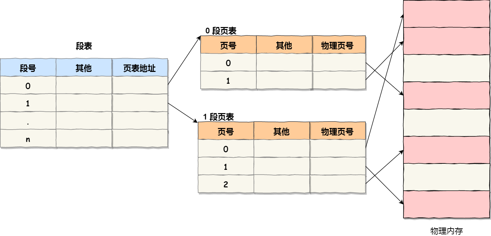

先将程序划分为多个有逻辑意义的段
接着再把每个段划分为多个页，也就是对分段划分出来的连续空间，再划分固定大小的页；
这样，地址结构就由**段号、段内页号和页内位移**三部分组成。

> 段页式地址变换中要得到物理地址须经过三次内存访问：
>
> 第一次访问段表，得到页表起始地址；
> 第二次访问页表，得到物理页号；
> 第三次将物理页号与页内位移组合，得到物理地址。

**gpt**

虚拟内存主要由 **地址映射机制 + 缺页处理 + 内存换页机制** 组成：

每次 CPU 访问内存时，虚拟地址并不直接用于访问物理内存，而是要通过页表进行转换。

> 一个虚拟地址空间被划分为若干个页（Page）
>
> 每一页大小一般是 4KB（也有 2MB、1GB 的大页）
>
> 操作系统为每个进程维护一个页表，用于记录“虚拟页号” 到 “物理页号”的映射(页表+页内偏移)

Page Fault（缺页异常）

> 当某个虚拟页没有映射到物理内存时，就会触发一个 **缺页异常（Page Fault）**，操作系统会：
>
> 1. 暂停当前进程
> 2. 从磁盘（swap 或磁盘文件）加载对应的页面到内存
> 3. 更新页表
> 4. 重新执行指令
>
> 这也是你打开一个大文件时，只有访问到那一块数据才会加载的原因（**按需加载**）。


##### 讲讲页面置换算法

答：当使用请求分页存储来管理内存时，发生缺页中断，就是要访问的页面不在内存中，这时就需要操作系统把其调入主存后再进行访问。

而在发生缺页中断时，内存中没有空闲的页面，就必须在内存中根据一定的策略挪出一些不用的页面，可以把页面置换算法看成是淘汰机制。

- OPT 页面置换法，最佳页面置换：不可实现，不可预测哪个是不用的。 
- FIFO 先到先出算法，把在内存中停留时间最长的页面置换出去 
- LRU 最近最久未使用页面置换算法：LRU 算法赋予每一个页面一个访问字段，来记录一个页面最近一次访问到现在所经历的时间 T，需要淘汰一个页面时，把最久没有使用的页面淘汰掉就可以了。 
- LFU 最少使用算法：把使用最少的页面淘汰掉
- **Clock算法**：将内存中的页面组织成一个环形链表，类似于时钟的表盘。每个页面有一个访问位（use bit），初始时所有页面的访问位都为 0。当一个页面被访问时，将其访问位设置为 1。当需要置换页面时，从当前指针位置开始，依次检查每个页面的访问位。如果访问位为 0，表示该页面最近未被访问过，就选择这个页面进行置换；如果访问位为 1，表示该页面最近被访问过，就把这个页面的访问位清 0，继续检查下一个页面。

##### 内存分配过程

> 应用程序通过 malloc 函数申请内存的时候，实际上申请的是虚拟内存，此时并不会分配物理内存。 当应用程序读写了这块虚拟内存，CPU 就会去访问这个虚拟内存， 这时会发现这个虚拟内存没有映射到物理内存， CPU 就会产生缺页中断，进程会从用户态切换到内核态，并将缺页中断交给内核的 Page Fault Handler （缺页中断函数）处理。
>
> 缺页中断处理函数会看是否有空闲的物理内存，如果有，就直接分配物理内存，并建立虚拟内存与物理内存之间的映射关系。 如果没有空闲的物理内存，那么内核就会开始进行回收内存的工作，回收的方式主要是两种：直接内存回收和后台内存回收。
>
> -  后台内存回收（kswapd）：在物理内存紧张的时候，会唤醒 kswapd 内核线程来回收内存，这个回收内存的过程异步的，不会阻塞进程的执行。
> -  直接内存回收（direct reclaim）：如果后台异步回收跟不上进程内存申请的速度，就会开始直接回收，这个回收内存的过程是同步的，会阻塞进程的执行。
>
>  如果直接内存回收后，空闲的物理内存仍然无法满足此次物理内存的申请，那么内核就会放最后的大招了 ——触发 OOM （Out of Memory）机制。 OOM Killer 机制会根据算法选择一个占用物理内存较高的进程，然后将其杀死，以便释放内存资源，如果物理内存依然不足，OOM Killer 会继续杀死占用物理内存较高的进程，直到释放足够的内存位置。

Linux 到底是根据什么标准来选择被杀的进程呢？这就要提到一个在 Linux 内核里有一个 `oom_badness() `函数，它会把系统中可以被杀掉的进程扫描一遍，并对每个进程打分，得分最高的进程就会被首先杀掉。

可被回收的内存类型有文件页和匿名页： 

- 文件页的回收：对于干净页是直接释放内存，这个操作不会影响性能，而对于脏页会先写回到磁盘再释放内存，这个操作会发生磁盘 I/O 的，这个操作是会影响系统性能的。 

- 匿名页的回收：如果开启了 Swap 机制，那么 Swap 机制会将不常访问的匿名页换出到磁盘中，下次访问时，再从磁盘换入到内存中，这个操作是会影响系统性能的。 

  文件页和匿名页的回收都是基于 LRU 算法，也就是优先回收不常访问的内存。回收内存的操作基本都会发生磁盘 I/O 的，如果回收内存的操作很频繁，意味着磁盘 I/O 次数会很多，这个过程势必会影响系统的性能。

#### 进程管理

##### **进程的五种状态**

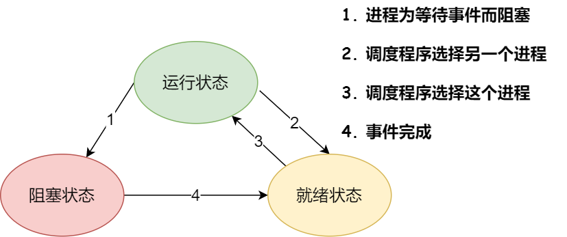

上图中各个状态的意义：

- 运行状态（Running）：该时刻进程占用 CPU；
- 就绪状态（Ready）：可运行，由于其他进程处于运行状态而暂时停止运行；
- 阻塞状态（Blocked）：该进程正在等待某一事件发生（如等待输入/输出操作的完成）而暂时停止运行，这时，即使给它CPU控制权，它也无法运行；

当然，进程还有另外两个基本状态：

- 创建状态（new）：进程正在被创建时的状态；

- 结束状态（Exit）：进程正在从系统中消失时的状态；

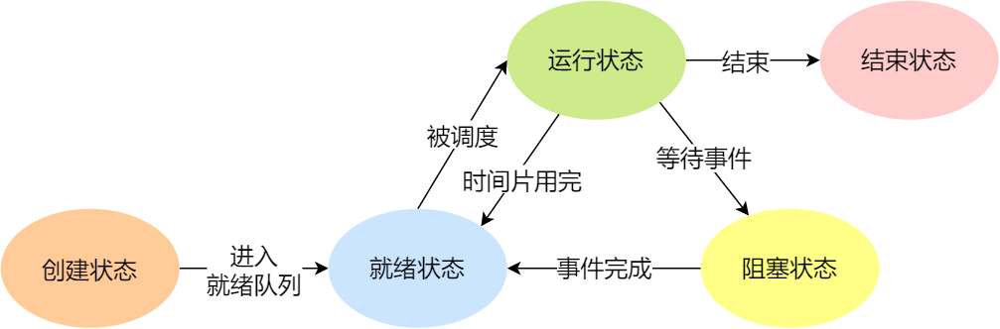

> 其中只有就绪状态和运行状态能互相转化，当进程为就绪态时，等待 CPU 分配时间片，得到时间片后就进入 运行状态 
>
> 运行状态在使用完 CPU 时间片后，又重回就绪态。 
>
> 阻塞状态是进程在运行状态时，需要等待某个资源比如打印机资源，而进入一个挂起的状态，等资源拿到后会回到就绪状态，等待 CPU 时间片。

此外，还有挂起状态

> 阻塞挂起状态：进程在外存（硬盘）并等待某个事件的出现；
> 就绪挂起状态：进程在外存（硬盘），但只要进入内存，即刻立刻运行；

##### **线程、进程、协程的区别**

> - 进程是资源分配的最基本的单位，运行一个程序会创建一个或多个进程，进程就是运行起来的可执行程序。 进程是应用程序的实例。
> - 线程是程序执行的最基本的单位，是轻量级的进程，每个进程里都有一个主线程，且只能有一个，和进程是相互依存的关系，生命周期和进程一样。 
> - 协程是**用户态的轻量级线程**，是线程内部的基本单位。**无需线程上下文切换的开销**、无需原子操作锁定及同步的开销、方便切换控制流，简化编程模型。
>
> 进程和线程的区别的话
>
> - 首先从资源来说，**进程是资源分配的基本单位**，但是线程不拥有资源，只独享必不可少的资源如寄存器和栈。
> - 然后从调度来说，**线程是独立调度的基本单位**，在同一进程中线程切换的话不会引起进程的切换，从一个进程中的线程切换到另一个进程中的线程时，会引起进程的切换。
> - 从系统开销来讲，由于创建或撤销进程，系统都要分配回收资源，所付出的开销远大于创建或撤销线程时的开销。类似的，在进行进程切换的时候，涉及当前执行进程 CPU 环境的保存及新调度进程 CPU 环境设置，而线程切换只需保存和设置少量寄存器的内容，开销很小。 
> - 通信方面来说，线程间可以通过**直接读写同一进程的数据进行通信**，但是**进程通信需要借助一些复杂的方法。**

##### **PCB是什么？** 

在操作系统（OS）中，**PCB（Process Control Block，进程控制块）**是操作系统管理进程的重要数据结构。它存储了进程的各种信息，使操作系统能够跟踪和管理进程的执行状态。

- PCB主要包含下面几部分的内容：
  - 进程标识符PID,用户标识符：进程的归属用户
  - 进程的状态信息（就绪、运行、阻塞），优先级
  - 内存地址空间，打开文件列表，使用的IO设备
  - CPU 寄存器信息。保存进程运行时的寄存器状态，如程序计数器（PC，用于记录进程下一条要执行的指令地址。）、栈指针（SP）、通用寄存器等。

通常是通过链表的方式进行组织，把具有相同状态的进程链在一起，组成各种队列。(将所有处于就绪状态的进程链在一起，称为就绪队列)

除了链接的组织方式，还有索引方式，它的工作原理：将同一状态的进程组织在一个索引表中，索引表项指向相应的 PCB，不同状态对应不同的索引表。

- **PCB 的作用**
  - 操作系统通过 **PCB 维护进程的状态**，使得进程在执行时可以被调度、挂起或恢复。
  - 进程切换时，操作系统会 **保存当前进程的 PCB**，并加载新的进程的 PCB，以实现**进程上下文切换**（Context Switch）。
  - PCB 结构通常存储在 **内核空间**，以确保安全性。
  - 进程的组成可以用下图来表示，PCB 就是他唯一标识符。
    

##### 进程和线程创建和撤销

>进程允许创建和控制另一个进程，前者称为父进程，后者称为子进程，子进程又可以创建孙进程，如此下去进而形成一个进程的家族树，这样子进程就可以从父进程那里继承所有的资源，当子进程撤销时，便将从父进程处获得的所有资源归还，此外，撤销父进程，则必须撤销所有的子进程。（撤销的过程实际上就是对这棵家族树进行后序遍历的过程）
>
>在应用中创建一个子进程的过程如下：
>
>- 申请空白的PCB，初始化进程描述信息
>- 为进程分配资源以及地址空间
>- 将PCB插入就绪队列中
>
>当进程完成后，系统会回收占用的资源，撤销进程，而引发进程撤销的情况有：进程正常结束或者异常结束，外界的干预（比如我们在任务管理器中强制停止某个进程的运行）。
>
>- 查找需要撤销的进程的 PCB
>- 如果进程处于运行状态，终止进程的执行
>- 子进程，交给1号进程接管
>- 归还系统资源，将它从PCB所在的队列中移除

##### 进程上下文切换

进程上下文是：进程的物理实体（代码和数据等）和支持进程运行的环境合称为**进程的上下文**。

> - 由进程的程序块、数据块、运行时的堆和用户栈（两者通称为用户堆栈）等组成的用户空间信息被称为**用户级上下文**。
> - 由进程标识信息、进程现场信息、进程控制信息和系统内核栈等组成的内核空间信息被称为**系统级上下文。**
> - 处理器中各寄存器的内容被称为**寄存器上下文**（也称硬件上下文），即进程的现场信息。

进程是由内核管理和调度的，所以进程的切换只能发生在[内核态](https://zhida.zhihu.com/search?content_id=199192095&content_type=Article&match_order=1&q=内核态&zhida_source=entity)。进程的上下文切换不仅包含了虚拟内存、栈、全局变量等用户空间的资源，还包括了内核堆栈、寄存器等内核空间的资源。

通常，会把交换的信息保存在进程的 PCB，当要运行另外一个进程的时候，我们需要从这个进程的 PCB 取出上下文，然后恢复到 CPU 中，这使得这个进程可以继续执行。

进程切换的步骤可以概括为以下几个关键动作：

**保存当前进程的上下文**，包括PC（程序计数器）、PSW（程序状态字）和SP（堆栈指针）等处理器中的寄存器内容。(大部分保存到struct thread_struct thread中，通用寄存器保存到内核栈中)

**修改当前进程的进程控制块（PCB）**，更新其状态为就绪或者阻塞，并将其放入相应的队列中。

**调度新的进程**，这涉及到操作系统的调度算法。

**修改被调度进程的PCB**，将其状态改为运行状态。

**更新存储管理数据**，如页表和TLB(快表，映射虚拟地址到物理地址，是页表cache)，以匹配新进程的用户级上下文。

**恢复新进程的硬件上下文**，让PC指向新进程的代码，继续执行。

> 上下文切换发生的场景
>
> - 为了保证所有进程可以得到公平调度，CPU 时间被划分为一段段的时间片，这些时间片再被轮流分配给各个进程。这样，当某个进程的时间片耗尽了，进程就从运行状态变为就绪状态，系统从就绪队列选择另外一个进程运行；
> - 进程在系统资源不足（比如内存不足）时，要等到资源满足后才可以运行，这个时候进程也会被挂起，并由系统调度其他进程运行；
> - 当进程通过睡眠函数 sleep 这样的方法将自己主动挂起时，自然也会重新调度；
> - 当有优先级更高的进程运行时，为了保证高优先级进程的运行，当前进程会被挂起，由高优先级进程来运行；
> - 发生硬件中断时，CPU 上的进程会被中断挂起，转而执行内核中的中断服务程序；

**什么是线程的[上下文切换](https://zhida.zhihu.com/search?content_id=199192095&content_type=Article&match_order=1&q=上下文切换&zhida_source=entity)？**

线程与进程最在的区别在于：线程是调度的基本单位，而进程则是资源拥有的基本单位。

所谓操作系统的任务调度，实际上的调度对象是线程，而进程只是给线程提供了虚拟内存、全局变量等资源。

对于线程和进程，我们可以这么理解：

- 当进程只有一个线程时，可以认为进程就等于线程；
- 当进程拥有多个线程时，这些线程会共享相同的虚拟内存和全局变量等资源，只需要切换线程的私有数据如栈和寄存器等不共享的数据。

另外，线程也有⾃⼰的私有数据，比如栈和寄存器等，这些在上下文切换时也是需要保存的。

##### 进程调度算法

不同环境的调度算法目标不同，因此需要针对不同环境来讨论调度算法。

**1.批处理系统**：没有太多的用户操作，在该系统中，调度算法目标是保证**吞吐量和周转时间**（从提交到终止的时间）。

> **先来先服务 first-come first-serverd（FCFS）**
>
> 非抢占式的调度算法，按照请求的顺序进行调度。
>
> 有利于长作业，但不利于短作业，因为短作业必须一直等待前面的长作业执行完毕才能执行，而长作业又需要执行很长时间，造成了短作业等待时间过长。
>
> **短作业优先 shortest job first（SJF）**
>
> 非抢占式的调度算法，按估计运行时间最短的顺序进行调度。
>
> 长作业有可能会饿死，处于一直等待短作业执行完毕的状态。因为如果一直有短作业到来，那么长作业永远得不到调度。
>
> **最短剩余时间优先 shortest remaining time next（SRTN）**
>
> 最短作业优先的抢占式版本，按剩余运行时间的顺序进行调度。 当一个新的作业到达时，其整个运行时间与当前进程的剩余时间作比较。如果新的进程需要的时间更少，则挂起当前进程，运行新的进程。否则新的进程等待。

**2.交互式系统**: 有大量的用户交互操作，在该系统中调度算法的目标是**快速地进行响应**。

> **时间片轮转**
>
> 将所有就绪进程按 FCFS 的原则排成一个队列，每次调度时，把 CPU 时间分配给队首进程，该进程可以执行一个时间片。当时间片用完时，由计时器发出时钟中断，调度程序便停止该进程的执行，并将它送往就绪队列的末尾，同时继续把 CPU 时间分配给队首的进程。
>
> 时间片轮转算法的效率和时间片的大小有很大关系：
>
> - 因为进程切换都要保存进程的信息并且载入新进程的信息，如果时间片太小，会导致进程切换得太频繁，在进程切换上就会花过多时间。
> - 而如果时间片过长，那么实时性就不能得到保证。
>
> **优先级调度**
>
> 为每个进程分配一个优先级，按优先级进行调度。
>
> 为了防止低优先级的进程永远等不到调度，可以随着时间的推移增加等待进程的优先级。
>
>  **多级反馈队列**
>
> 一个进程需要执行 100 个时间片，如果采用时间片轮转调度算法，那么需要交换 100 次。
>
> 多级队列是为这种需要连续执行多个时间片的进程考虑，它设置了多个队列，**每个队列时间片大小都不同**，例如 1,2,4,8,..。进程在第一个队列没执行完，就会被移到下一个队列。这种方式下，之前的进程只需要交换 7 次。
>
> 每个队列优先权也不同，最上面的优先权最高。因此只有上一个队列没有进程在排队，才能调度当前队列上的进程。
>
> 可以将这种调度算法看成是时间片轮转调度算法和优先级调度算法的结合。

##### 进程同步的方式

一共四种：互斥锁，读写锁，信号量，条件变量

进程同步的主要任务是使并发执行的诸进程之间能有效地**共享资源**和**相互合作**，如果没有同步机制，就可能出现以下问题：

> **竞态条件（Race Condition）**
>
> - 多个进程同时访问和修改共享数据，导致数据不一致。
>
> **死锁（Deadlock）**
>
> - 进程相互等待对方释放资源，导致所有进程都无法继续执行。
>
> **饥饿（Starvation）**
>
> - 由于调度策略或优先级设置，某个进程长期得不到执行机会。

一些基本概念：

> **临界区（Critical Section）**
>
> - 进程访问共享资源的那部分代码称为 **临界区**。
> - 进程同步的目标是**保证在同一时刻只有一个进程进入临界区**。
>
> **同步与互斥**
>
> - 同步：多个进程因为合作产生的直接制约关系，使得进程有一定的先后执行关系。
> - 互斥：多个进程在同一时刻只有一个进程能进入临界区。

**信号量**

> 信号量（Semaphore）是一个整型变量，可以对其执行 P 和 V 操作。如果信号量只能取 0 或者 1，那么就变成了**互斥量**
> P操作：如果信号量大于零，就对其进行减 1 操作；如果信号量等于 0，进程进入 waiting 状态，等待信号量大于零。用于**阻塞一个进程**
> V操作：对信号量执行加 1 操作，并唤醒正在 waiting 的进程，**用于解除阻塞一个进程**

**管程**

>  管程是由一个或多个过程、一个初始化序列和局部数据组成的软件模块
>
> - **局部数据变量只能被管程的过程访问**，任何外部过程都不能访问。
> - 一个进程通过调用管程的一个过程进入管程。
> - 在任何时候，只能有一个进程在管程中执行，调用管程的任何其他进程都被阻塞，以等待管程可用。

**消息传递**

> 一个进程以消息的形式给另一个指定的目标进程发送消息；
>
> 进程通过执行receive原语接收消息，receive原语中指明发送消息的源进程和消息。

**条件变量**

> - **条件变量** 用于进程在**等待特定条件**时进入休眠，避免主动轮询消耗 CPU。
> - 需要配合 **互斥锁（Mutex）** 使用。

| **场景** | **可能的问题** | **解决方案** |
| -------- | -------------- | ------------ |
| 生产者-消费者问题 | 生产者与消费者竞争共享缓冲区 | 信号量（Semaphore） |
| 读者-写者问题 | 读者可以并发，但写者必须独占 | 读写锁（RWLock） |
| 哲学家就餐问题 | 死锁、饥饿问题 | 信号量、条件变量 |

**进程同步 vs 线程同步**

| **同步方式**                       | **适用于进程** | **适用于线程** |
| ---------------------------------- | -------------- | -------------- |
| **信号量（Semaphore）**            | ✅              | ✅              |
| **互斥锁（Mutex）**                | ✅              | ✅              |
| **条件变量（Condition Variable）** | ✅              | ✅              |
| **共享内存（Shared Memory）**      | ✅              | ❌              |
| **消息队列（Message Queue）**      | ✅              | ❌              |

##### 进程间通信

进程通信是一种手段，而进程同步是一种目的。也可以说，为了能够达到进程同步的目的，需要让进程进行通信，传输一些进程同步所需要的信息。

- 进程同步：控制多个进程按一定顺序执行；
- 进程通信：进程间传输信息。

IPC 方式：管道，消息队列，信号，共享存储，socket,

1. 管道:

   > 匿名管道：举个例子：linux 里的竖线，就是管道的意思，比如 ps -aux|grep mysql 这句话的意思是把前一个进程查询的结果作为 grep mysql 的输入，如果两个进程要进行通信的话，就可以用这种管道来进行通信。
   > 这种通信的方式是半双工通信的，只能单向交替传输并且只能在具有亲属关系的进程之间通信使用。
   >
   > 命名管道：可以用 mkfifo 命令创建一个命名管道，可以用一个进程向管道里写数据，然后可以让另一个进程把里面的数据读出来。**命名管道的优点是去除了只能在父子进程中使用的限制**，并且命名管道有路径名和它相关联，是以一种特殊设备文件形式存在于文件系统中的。
   >
   > 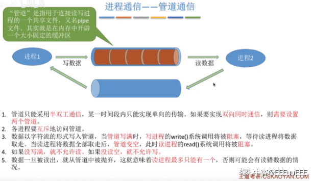

2. 消息队列

   消息队列实际上是保存在内核的「消息链表」，消息队列的消息体是可以用户自定义的数据类型，发送数据时，会被分成一个一个独立的消息体

   > - 消息队列的通信模式是这样的：a 进程要给 b 进程发消息，只需要把消息挂在消息队列（可以是中介邮局，也可以是进程自己的信箱）里就行了，b 进程需要的时候再去取消息队列里的消息。 
   > - 消息队列可以独立于读写进程存在，就算进程终止时，消息队列的内容也不会被删除。 
   > - 读进程可以根据消息类型有选择的接收消息，而不像 FIFO 那样只能默认接收。
   >
   > 如果进程发送的数据较大，并且两个进程通信非常频繁的话，消息队列模型就不太合适了，因为如果发送的数据很大的话，意味着发送消息（拷贝）这个过程就需要很多时间来读写内存。
   >
   > 消息队列不适用于大数据的传输，因为存在用户态和内核态之间的拷贝开销。因为进程写入数据到内核中的消息队列时，会发生从用户态拷贝数据到内核态的过程，同理另一进程读取内核中的消息数据时，会发生从内核态拷贝数据到用户态的过程。

3. 共享内存+信号量

   - 共享内存的方式就可以解决拷贝耗时很长的问题了。 
   - 共享内存是最快的一种进程通信的方式，因为进程是直接对内存进行存取的。因为可以多个进程对共享内存同时操作，所以对共享空间的访问必须要求进程对共享内存的访问是互斥的。所以我们经常把信号量和共享内存一起使用来实现进程通信。 
   - 共享内存的机制，就是拿出一块虚拟地址空间来，映射到相同的物理内存中。这样这个进程写入的东西，另外一个进程马上就能看到了，都不需要拷贝来拷贝去，传来传去，大大提高了进程间通信的速度。
   - 即使进程 A 和 进程 B 的虚拟地址是一样的，其实访问的是不同的物理内存地址，对于数据的增删查改互不影响。
   - > - 共享内存最大的问题就是多进程竞争内存的问题，就像平时所说的线程安全的问题，那么就需要靠信号量来保证进程间的操作的同步与互斥。 
     > - 信号量其实就是个计数器，例如信号量的初始值是 1，然后 a 进程访问临界资源的时候，把信号量设置为 0，然后进程 b 也要访问临界资源的时候，发现信号量是 0，就知道已有进程在访问临界资源了，这时进程 b 就访问不了了，所以说信号量也是进程间的一种通信方式。

4. 信号

   信号是进程间通信机制中唯一的异步通信机制，因为可以在任何时候发送信号给某一进程，一旦有信号产生，我们就有下面这几种，用户进程对信号的处理方式。

   > 1.执行默认操作。Linux 对每种信号都规定了默认操作，例如，上面列表中的 SIGTERM 信号，就是终止进程的意思。
   >
   > 2.捕捉信号。我们可以为信号定义一个信号处理函数。当信号发生时，我们就执行相应的信号处理函数。
   >
   > 3.忽略信号。当我们不希望处理某些信号的时候，就可以忽略该信号，不做任何处理。有两个信号是应用进程无法捕捉和忽略的，即 SIGKILL 和 SEGSTOP，它们用于在任何时候中断或结束某一进程。

5. 套接字
   套接字可以实现两个不同的机器之间的进程通信，比如 socket 使用。跨网络通信使用

##### **僵尸进程与孤儿进程**

僵尸进程：一个进程使用fork创建子进程，如果子进程退出，而父进程并没有调用wait或waitpid获取子进程的状态信息，那么子进程的进程描述符仍然保存在系统中。这种进程称之为僵尸进程。

孤儿进程：一个父进程退出，而它的一个或多个子进程还在运行，那么那些子进程将成为孤儿进程。孤儿进程将被init进程(进程号为1)所收养，并由init进程对它们完成状态收集工作。

问题：

在每个进程退出的时候,内核释放该进程所有的资源,包括打开的文件,占用的内存等。 但是仍然为其保留一定的信息(包括进程号,退出状态、运行时间等)。直到父进程通过wait / waitpid来取时才释放。 但这样就导致了问题，**如果进程不调用wait / waitpid的话，** **那么保留的那段信息就不会释放，其进程号就会一直被占用，但是系统所能使用的进程号是有限的，如果大量的产生僵死进程，将因为没有可用的进程号而导致系统不能产生新的进程. 此即为僵尸进程的危害，应当避免。**

孤儿进程一般没有危害

**解决方案**：

- **父进程正确处理**：调用 `wait()` 或 `waitpid()` 回收子进程。

  > 通过信号机制，子进程退出时向父进程发送SIGCHLD信号，父进程调用signal(SIGCHLD,sig_child)去处理SIGCHLD信号，在信号处理函数sig_child()中调用wait进行处理僵尸进程。什么时候得到子进程信号，什么时候进行信号处理，父进程可以继续干其他活，不用去阻塞等待。

- **孤儿进程接管**：若父进程先退出，子进程由 init 进程（PID=1）接管并自动回收。

- **手动清理**：通过 `kill -HUP <parent_pid>` 通知父进程，或直接终止父进程。


#### 死锁

##### 死锁发生的条件

> 互斥条件：是资源分配是互斥的，资源要么处于被分配给一个进程的状态，要么就是可用状态。 
>
> 等待和占有条件：进程在请求资源得不到满足的时候，进入阻塞等待状态，且不释放已占有的资源。 
>
> 不剥夺条件：已经分配给一个进程的资源不能强制性地被抢占，只能等待占有他的进程释放。 
>
> 环路等待：有两个或者两个以上的进程组成一条环路，该环路中的每个进程都在等待下一个进程释放所占有的资源。

##### 如何避免死锁的发生？

> 预防策略：从形成死锁的条件入手，基本思想就是打破形成死锁的四个条件中的一个或多个，保证系统不会进入死锁状态。
>
> - 破坏互斥条件：比如只读文件、磁盘等软硬件资源可采用这种办法处理。 
> - 破坏占有和等待条件：在进程开始执行之前，就把其要申请的所有资源全部分配给他，直到所有资源都满足，才开始执行。 
> - 破坏不剥夺条件：允许进程强行从资源占有者那里夺取某些资源 
> - 破坏环路等待条件：给系统的所有资源编号，规定进程请求所需资源的顺序必须按照资源的编号依次执行。（资源有序分配）

**银行家算法**

> 算法要做的是判断对请求的满足是否会进入不安全状态，如果是，就拒绝请求；否则予以分配。如下解释：↓

##### 如果发生死锁了怎么办？

- 死锁检测：发生死锁之前总归需要先检测到死锁吧，不然怎么进行接下来的操作？可以通过检测有向图中是否存在环来检测，从一个节点出发进行 dfs，对访问过的节点进行标记，如果访问到了已经标记的节点，就表示有向图存在环，也就是检测到死锁的发生。  (银行家算法)
- 死锁恢复：从下到上逐渐变态。。。
  - 撤销进程法：
    - \1) 撤消陷于死锁的全部进程； 
    - \2) 逐个撤消陷于死锁的进程，直到死锁不存在； 
  - 资源剥夺法：
    - \3) 从陷于死锁的进程中逐个强迫放弃所占用的资源，直至死锁消失； 
    - \4) 从另外的进程那里强行剥夺足够数量的资源分配给死锁进程，以解除死锁状态。 
  - 鸵鸟算法，直接不管！

**死锁案例**

生产者消费者模型

对临界区的上锁如果放在了检测缓冲区是否已经满之前，就有可能发生死锁。比如生产者此时要产生一个产品，如果先对临界区上锁，然后检测缓冲区已满，这时就进入等待消费者消耗产品的状态，而消费者想消费产品时，必须先检测临界区是否上锁，此时临界区已经被生产者占有，这样就形成了死锁。

#### 网络系统

##### 文件传输过程

传统传输过程

> *如果服务端要提供文件传输的功能，我们能想到的最简单的方式是：**将磁盘上的文件读取出来，然后通过网络协议发送给客户端。***
>
> 传统 I/O 的工作方式是，数据读取和写入是从用户空间到内核空间来回复制，而内核空间的数据是通过操作系统层面的 I/O 接口从磁盘读取或写入。
>
> 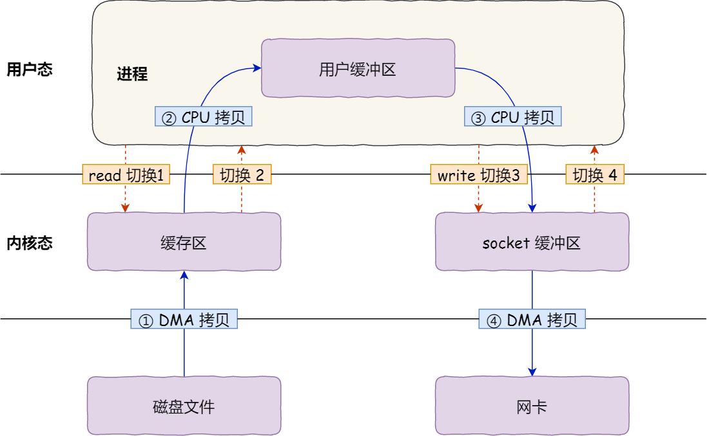
>
> 4次数据拷贝的过程如下：
>
> - 第一次拷贝，把磁盘上的数据拷贝到操作系统内核的缓冲区里，这个拷贝的过程是通过 DMA 搬运的。
> - 第二次拷贝，把内核缓冲区的数据拷贝到用户的缓冲区里，于是我们应用程序就可以使用这部分数据了，这个拷贝到过程是由 CPU 完成的。
> - 第三次拷贝，把刚才拷贝到用户的缓冲区里的数据，再拷贝到内核的 socket 的缓冲区里，这个过程依然还是由 CPU 搬运的。
> - 第四次拷贝，把内核的 socket 缓冲区里的数据，拷贝到网卡的缓冲区里，这个过程又是由 DMA 搬运的。
>
> 要想提高文件传输的性能，就需要减少「用户态与内核态的上下文切换」和「内存拷贝」的次数。

##### 零拷贝技术

通常有两种mmap + write和sendfile

**mmap**

> 在前面我们知道，read() 系统调用的过程中会把内核缓冲区的数据拷贝到用户的缓冲区里，于是为了减少这一步开销，我们可以用 mmap() 替换 read() 系统调用函数。
>
> mmap() 系统调用函数会直接把内核缓冲区里的数据「映射」到用户空间，这样，操作系统内核与用户空间就不需要再进行任何的数据拷贝操作。
>
> - 应用进程调用了 mmap() 后，DMA 会把磁盘的数据拷贝到内核的缓冲区里。接着，应用进程跟操作系统内核「共享」这个缓冲区；
> - 应用进程再调用 write()，操作系统直接将内核缓冲区的数据拷贝到 socket 缓冲区中，这一切都发生在内核态，由 CPU 来搬运数据；
> - 最后，把内核的 socket 缓冲区里的数据，拷贝到网卡的缓冲区里，这个过程是由 DMA 搬运的。

**sendfile**

> 在 Linux 内核版本 2.1 中，提供了一个专门发送文件的系统调用函数 sendfile()
>
> ssize_t sendfile(int out_fd, int in_fd, off_t *offset, size_t count);
>
> 它的前两个参数分别是目的端和源端的文件描述符，后面两个参数是源端的偏移量和复制数据的长度，返回值是实际复制数据的长度。
>
> 首先，它可以替代前面的 read() 和 write() 这两个系统调用，这样就可以减少一次系统调用，也就减少了 2 次上下文切换的开销。
>
> 其次，该系统调用，可以直接把内核缓冲区里的数据拷贝到 socket 缓冲区里，不再拷贝到用户态，这样就只有 2 次上下文切换，和 3 次数据拷贝。

早期 I/O 操作，内存与磁盘的数据传输的工作都是由 CPU 完成的，而此时 CPU 不能执行其他任务，会特别浪费 CPU 资源。

于是，为了解决这一问题，DMA 技术就出现了，每个 I/O 设备都有自己的 DMA 控制器，通过这个 DMA 控制器，CPU 只需要告诉 DMA 控制器，我们要传输什么数据，从哪里来，到哪里去，就可以放心离开了。后续的实际数据传输工作，都会由 DMA 控制器来完成，CPU 不需要参与数据传输的工作。

传统 IO 的工作方式，从硬盘读取数据，然后再通过网卡向外发送，我们需要进行 4 上下文切换，和 4 次数据拷贝，其中 2 次数据拷贝发生在内存里的缓冲区和对应的硬件设备之间，这个是由 DMA 完成，另外 2 次则发生在内核态和用户态之间，这个数据搬移工作是由 CPU 完成的。

为了提高文件传输的性能，于是就出现了零拷贝技术，它通过一次系统调用（sendfile 方法）合并了磁盘读取与网络发送两个操作，降低了上下文切换次数。另外，拷贝数据都是发生在内核中的，天然就降低了数据拷贝的次数。

零拷贝技术是基于 PageCache 的，PageCache 会缓存最近访问的数据，提升了访问缓存数据的性能，同时，为了解决机械硬盘寻址慢的问题，它还协助 I/O 调度算法实现了 IO 合并与预读，这也是顺序读比随机读性能好的原因。这些优势，进一步提升了零拷贝的性能。

另外，当传输大文件时，不能使用零拷贝，因为可能由于 PageCache 被大文件占据，而导致「热点」小文件无法利用到 PageCache，并且大文件的缓存命中率不高，这时就需要使用「异步 IO + 直接 IO 」的方式。

##### I/O多路复用

I/O 多路复用是一种**同时监听多个 I/O 事件**（如 socket 读写、文件 I/O）的技术，允许单个线程高效管理多个 I/O 连接。

**`select`（最早的 I/O 复用方式）**

>  将已连接的 Socket 都放到一个文件描述符集合，然后调用 select 函数将文件描述符集合拷贝到内核里，让内核来检查是否有网络事件产生，检查的方式很粗暴，就是通过遍历文件描述符集合的方式，当检查到有事件产生后，将此 Socket 标记为可读或可写， 接着再把整个文件描述符集合拷贝回用户态里，然后用户态还需要再通过遍历的方法找到可读或可写的 Socket，然后再对其处理。
>
>  所以，对于 select 这种方式，需要进行 2 次「遍历」文件描述符集合，一次是在内核态里，一个次是在用户态里 ，而且还会发生 2 次「拷贝」文件描述符集合，先从用户空间传入内核空间，由内核修改后，再传出到用户空间中。

- 使用 **一个文件描述符集合** 监听多个 I/O 事件。最多1024
- 调用 `select()`，如果有**任意一个 I/O 事件**就绪，`select()` 返回，应用程序检查是哪个 I/O 事件就绪。

**`poll`** 相比于select，不适用固定长度的BitMap描述文件，使用动态数组，用链表突破文件描述符的个数限制。

> **缺点：**
>
> - **最大文件描述符限制**：一般最多监听 1024 个（可调）。
> - **低效**：每次调用 `select()`，都需要**遍历整个 fd 集合**，时间复杂度 **O(n)**。
> - **需要拷贝 fd 集合**：每次调用 `select()`，需要**把所有 fd 复制**到内核，消耗 CPU 和内存。

**`epoll`（高效事件驱动）**

先用epoll_create 创建一个 epoll对象 epfd，再通过 epoll_ctl 将需要监视的 socket 添加到epfd中，最后调用 epoll_wait 等待数据。

- `epoll` 采用**事件驱动模型**，不再需要遍历所有 fd(维护了一个「链表」来记录就绪事件)，而是**只有有事件发生的 fd 才会通知进程**。**只返回有事件的 fd**，无需遍历所有 fd。
- 内核使用一个**红黑树**管理 fd，不需要项select、poll一样传入整个socket集合。减少了内核和用户空间大量的数据拷贝和内存分配。

##### 高性能网络模式 Reactor

Reactor： I/O 多路复用监听事件，收到事件后，根据事件类型分配（Dispatch）给某个进程 / 线程。

Reactor 模式主要由 Reactor 和处理资源池这两个核心部分组成，它俩负责的事情如下： 

- Reactor 负责监听和分发事件，事件类型包含连接事件、读写事件； 
- 处理资源池负责处理事件，如 read -> 业务逻辑 -> send；

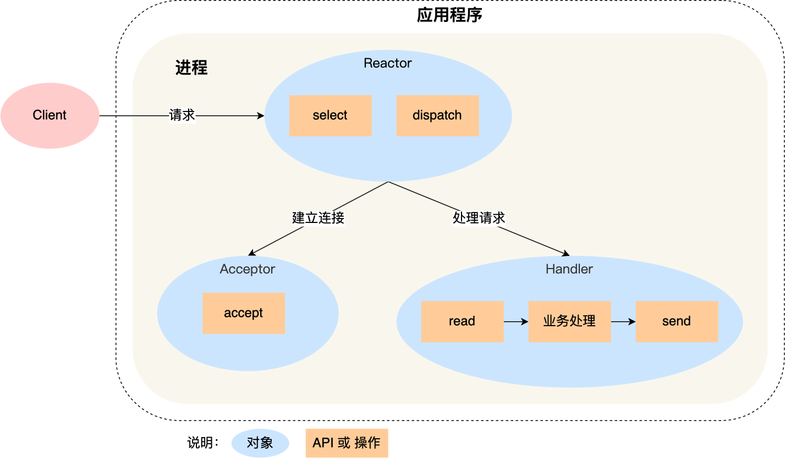


可以看到进程里有 Reactor、Acceptor、Handler 这三个对象：

 >Reactor 对象的作用是监听和分发事件；
 >Acceptor 对象的作用是获取连接；
 >Handler 对象的作用是处理业务.

对象里的 select、accept、read、send 是系统调用函数，dispatch 和 「业务处理」是需要完成的操作，其中 dispatch 是分发事件操作。

接下来，介绍下「单 Reactor 单进程」这个方案：

> Reactor 对象通过 select （IO 多路复用接口） 监听事件，收到事件后通过 dispatch 进行分发，具体分发给 Acceptor 对象还是 Handler 对象，还要看收到的事件类型；
>
> 如果是连接建立的事件，则交由 Acceptor 对象进行处理，Acceptor 对象会通过 accept 方法 获取连接，并创建一个 Handler 对象来处理后续的响应事件；
>
> 如果不是连接建立事件， 则交由当前连接对应的 Handler 对象来进行响应；
>
> Handler 对象通过 read -> 业务处理 -> send 的流程来完成完整的业务流程。

但是，这种方案存在 2 个缺点：

第一个缺点，因为只有一个进程，无法充分利用 多核 CPU 的性能；
第二个缺点，Handler 对象在业务处理时，整个进程是无法处理其他连接的事件的，如果业务处理耗时比较长，那么就造成响应的延迟；

所以，单 Reactor 单进程的方案不适用计算机密集型的场景，只适用于业务处理非常快速的场景。


### Docker

[Docker 面试题汇总(附答案)_docker面试-CSDN博客](https://blog.csdn.net/slipegg/article/details/138375488)

#### 介绍

Docker是一种开源的容器化平台，可以将应用程序及其依赖项打包为独立的、可移植的容器，以便在不同环境中运行。

> 和虚拟机的区别在于：Docker容器是轻量级的，共享操作系统内核，比虚拟机启动更快。而虚拟机则模拟整个操作系统，在一个物理机器上运行多个操作系统实例。

**镜像和容器的区别**：镜像是一个静态的、可执行的文件，包含了运行容器所需的文件系统、代码和依赖项。容器则是镜像的一个运行实例。

优势：

> - 快速构建、部署和扩展应用程序。
> - 提供了隔离的运行环境，确保应用程序在不同环境中的一致性。
> - 节省资源，多个容器可以在同一物理机上共享操作系统内核。
> - 支持持续集成和部署，使应用程序的交付更加可靠和可重复。

**什么是Docker容器编排？**Docker容器编排是指通过自动化管理和协调多个Docker容器的过程。常见的Docker容器编排工具包括Docker Compose、Docker Swarm和Kubernetes。

> **Docker Compose**是一个用于定义和运行多个容器的工具。它使用一个YAML文件来配置应用程序的服务、网络和卷，并可以通过简单的命令来启动、停止和管理多个容器。
>
> **Docker Swarm**是Docker原生的容器编排和集群管理工具。它可以将多个Docker主机组合成一个虚拟的Docker集群，并自动分配和管理容器。
>
> **Kubernetes**是一个开源的容器编排平台，用于自动化部署、扩展和管理容器化应用程序。它提供了集群管理、服务发现、负载均衡和自我修复等功能。

#### 操作

以nginx部署为例

> 镜像拉取 `docker pull nginx:latest ` ,从registery拉取最新nginx的镜像
>
> 再执行`docker run -d -p 90:80 nginx` ,  `-d`表示让容器在后台运行（detached 模式），`-p 90:80` 端口映射：将主机的 90 端口映射到容器的 80 端口（Nginx 默认监听 80）
>
> 然后可以查看容器运行状态`docker ps` ， 使用`-a`来查看已经停止的容器
>
> ```shell
> # 容器管理
> docker stop 容器ID/名字        # 停止容器
> docker start 容器ID/名字       # 启动容器
> docker restart 容器ID/名字     # 重启容器
> docker rm 容器ID/名字          # 删除容器（先停止）
> 
> # 镜像管理
> docker images                 # 查看本地镜像
> docker pull 镜像名[:tag]       # 拉取镜像（如 nginx:1.24）
> docker rmi 镜像ID              # 删除镜像（注意不能被容器使用中）
> 
> # 构建运行相关
> docker build -t myapp .       # 从 Dockerfile 构建镜像
> docker run -it 镜像名 /bin/bash  # 以交互方式运行容器
> docker exec -it 容器ID bash    # 进入运行中的容器
> docker logs 容器ID             # 查看容器日志
> 
> # 端口与挂载
> docker run -p 本机端口:容器端口 ...
> docker run -v 本地目录:容器目录 ...
> docker run -v /my/conf/nginx.conf:/etc/nginx/nginx.conf ... # 挂载配置文件
> 
> # 资源占用查看
> docker stats
> 
> # 端口查看
> docker port 容器ID
> ```
>
> 


> 1.如何在Docker容器中**暴露端口**？
>
> 答案：可以使用Dockerfile中的EXPOSE指令来定义要暴露的端口，然后在运行容器时使用-p参数将容器端口映射到主机端口。
>
> ```cmd
> EXPOSE 8080
> ```
>
> 2.如何**进入正在运行的容器**？
>
> **docker exec** 相当于进入容器并开启一个新的终端，可以在里面操作。
>
> ```shell
> docker exec my_container ls /app # 在运行中的 my_container 容器内执行 ls /app 命令，列出 /app 目录的内容。
> docker exec -it my_container /bin/bash # 通过容器 ID 或名称进入容器的终端。其中i表示标准输入，t表示新的终端
> ```
>
> **docker attach** 进入容器正在执行的终端，不会启动新的进程。如果使用exit退出，容器会停止运行！
>
> ```shell
> docker attach 容器id
> ```
>
> 3.如何持久化数据？
>
> 可以使用Docker卷（Volume）来将数据持久化到容器之外的位置。卷是一个特殊的目录，可以由容器访问和共享。
>
> 4.Docker的网络模式有哪些？
>
> 答案：Docker有多种网络模式，包括主机模式、桥接模式、none模式和自定义网络模式。每种模式都有不同的网络配置和隔离级别。
>
> 5.如何将已经存在的应用程序容器化？
>
> 答案：可以创建一个Dockerfile，并在其中定义容器所需的操作系统、依赖项和配置。然后，使用Docker构建工具构建镜像，并将应用程序运行在容器中。
>
> 6.什么是Docker的跨主机网络？
>
> 答案：Docker的跨主机网络是指通过配置和管理Docker容器在多个主机上的网络连接，以实现容器间的通信和负载均衡。常用的跨主机网络方案包括Docker Swarm Overlay网络和Kubernetes的Service和Ingress。
>
> 7.能否解释一下Dockerfile的基本指令？
> FROM	指定所创建镜像的基础镜像
> RUN	运行命令，用于环境配置，软件安装等
> CMD	指定容器启动时默认执行的命令
> LABEL	指定生成镜像的元数据标签信息
> EXPOSE	声明镜像内服务所监听的端口
> ENV	指定环境变量
> ADD	将复制指定的 `src` 路径下的内容到容器中的 `dest` 路径下；如果为 tar 文件，会自动解压到 路径下，`ADD <src> <dest>`
> COPY	复制本地主机的 路径下的内容到镜像中的 路径下,`COPY [--chown=<user>:<group>] <源路径>... <目标路径>`
>
> **`COPY` 命令和 `ADD` 类似，唯一的不同是 `ADD` 会自动解压压缩包，还可以直接下载 `url` 中的文件但是官方建义使用 `wget` 或者 `curl` 代替 `ADD`。**
>
> ENTRYPOINT	指定镜像的默认入口
> VOLUME	创建数据卷挂载点,用来存放数据库和需要保存的数据等


#### 面经

1.简述什么类型的应用程序(无状态或有状态)更适合Docker容器?

> 通常**无状态应用程序更适合容器化**。无状态应用程序**不依赖**于持久化的内部状态。每个请求都是独立的，服务器**不需要跟踪用户的状态**。可轻松进行横向扩展，**实例之间可以自由替换**。而有状态应用则需要维护会话信息，依赖于数据存储。
>
> 适合Docker的原因：
>
> - 容器可以快速地启动和停止，便于快速扩展和负载均衡。
> - 更新和版本管理相对简单，应用程序的状态和配置通常在外部管理。
> - 可通过服务发现和反向代理等机制实现高可用性。
>
> 示例：网页服务器（如Nginx、Apache），微服务（REST API），任务处理程序（如背景任务）

2.简述Docker之实现挂载的三种方式汇总 ？

> - 数据卷（Volumes）：
>
>   数据卷是Docker管理的文件系统，位于Docker的存储区域。通过`docker volume create`命令可以创建一个新的数据卷，并在容器运行时通过-v或--mount选项挂载到容器内。
>   特点：
>   数据卷独立于容器的生命周期，容器删除后数据卷仍然存在。
>   数据卷可以被多个容器共享。
>   可以实现数据持久化和备份。
>
> - 绑定挂载（Bind Mounts）：
>
>   通过指定主机的具体路径将主机文件或目录挂载到容器中。使用`-v /path/on/host:/path/in/container`语法进行挂载。
>   特点：
>   可以选择主机上任意路径进行挂载。
>   容器可以直接访问主机文件系统中的文件。
>   容器和主机的文件变化会实时同步。
>
> - tmpfs挂载：
>
>   将临时文件存储在内存中而不是持久化到文件系统。使用--tmpfs选项来创建临时文件系统挂载。
>   特点：
>   性能更佳，适合需要高I/O性能的应用。
>   数据不会被持久化，容器停止或删除后，数据会丢失。
>   常用于存储临时数据或缓存。

3.docker组件有哪些？

三个架构组件包括 Docker 客户端、主机和注册表。

- **Docker 客户端**：该组件执行构建和运行操作以与 Docker 主机通信。
- **Docker 主机**：该组件包含 Docker 守护程序、Docker 镜像和 Docker 容器。守护进程建立到 Docker Registry 的连接。
- **Docker Registry**：该组件存储 Docker 镜像。它可以是公共注册表，例如 Docker Hub 或 Docker Cloud，也可以是私有注册表。

> 一个完整的docker有以下几个部分组成： 
>
> 1、docker client，客户端，为用户提供一系列可执行命令，用户用这些命令实现跟 docker daemon 交互；
>
> 2、docker daemon，守护进程，一般在宿主主机后台运行，等待接收来自客户端的请求消息；
>
> 3、docker image，镜像，镜像run之后就生成为docker容器；
>
> 4、docker container，容器，一个系统级别的服务，拥有自己的ip和系统目录结构；运行容器前需要本地存在对应的镜像，如果本地不存在该镜像则就去镜像仓库下载。
>
> docker 使用客户端-服务器 (C/S) 架构模式，使用远程api来管理和创建docker容器。docker 容器通过 docker 镜像来创建。容器与镜像的关系类似于面向对象编程中的对象与类。

4.讲一下镜像的分层结构以及为什么要使用镜像的分层结构？

> 一个新的镜像其实是从 base 镜像一层一层叠加生成的。每安装一个软件，dockerfile中使用`RUN`指令，就会在现有镜像的基础上增加一层，这样一层一层的叠加最后构成整个镜像。所以我们`docker pull`拉取一个镜像的时候会看到docker是一层层拉去的。
>
> 分层机构最大的一个好处就是 ： 共享资源。比如：有多个镜像都从相同的 base 镜像构建而来，那么 Docker Host 只需在磁盘上保存一份 base 镜像；同时内存中也只需加载一份 base 镜像，就可以为所有容器服务了。而且镜像的每一层都可以被共享。

5.讲一下容器的copy-on-write特性，修改容器里面的内容会修改镜像吗？

> 我们知道，镜像是分层的，镜像的每一层都可以被共享，同时，镜像是只读的。当一个容器启动时，一个新的可写层被加载到镜像的顶部，这一层通常被称作“容器层”，“容器层”之下的都叫“镜像层”。
>
> 所有对容器的改动 - 无论添加、删除、还是修改文件，都只会发生在容器层中，因为只有容器层是可写的，容器层下面的所有镜像层都是只读的。镜像层数量可能会很多，所有镜像层会联合在一起组成一个统一的文件系统。如果不同层中有一个相同路径的文件，比如`/a`，上层的 `/a` 会覆盖下层的`/a`，也就是说用户只能访问到上层中的文件 `/a`。在容器层中，用户看到的是一个叠加之后的文件系统。
>
> 添加文件时：在容器中创建文件时，新文件被添加到容器层中。
>
> 读取文件：在容器中读取某个文件时，Docker 会从上往下依次在各镜像层中查找此文件。一旦找到，立即将其复制到容器层，然后打开并读入内存。
>
> 修改文件：在容器中修改已存在的文件时，Docker 会从上往下依次在各镜像层中查找此文件。一旦找到，立即将其复制到容器层，然后修改之。
>
> 删除文件：在容器中删除文件时，Docker 也是从上往下依次在镜像层中查找此文件。找到后，会在容器层中记录下此删除操作。
>
> **只有当需要修改时才复制一份数据，这种特性被称作 Copy-on-Write。可见，容器层保存的是镜像变化的部分，不会对镜像本身进行任何修改。**

6.简单描述一下Dockerfile的整个**构建镜像过程**

> 1、首先，创建一个目录用于存放应用程序以及构建过程中使用到的各个文件等；
>
> 2、然后，在这个目录下创建一个Dockerfile文件，一般建议Dockerfile的文件名就是Dockerfile；
>
> 3、编写Dockerfile文件，编写指令，如，使用`FORM指`令指定基础镜像，`COPY`指令复制文件，`RUN`指令指定要运行的命令，`ENV`设置环境变量，`EXPOSE`指定容器要暴露的端口，`WORKDIR`设置当前工作目录，`CMD`容器启动时运行命令，等等指令构建镜像；
>
> 4、Dockerfile编写完成就可以构建镜像了，使用`docker build -t 镜像名:tag .`命令来构建镜像，最后一个点是表示当前目录，docker会默认寻找当前目录下的Dockerfile文件来构建镜像，如果不使用默认，可以使用`-f`参数来指定dockerfile文件，如：`docker build -t 镜像名:tag -f /xx/xxx/Dockerfile`；
>
> 5、使用`docker build`命令构建之后，docker就会将当前目录下所有的文件发送给docker daemon，顺序执行Dockerfile文件里的指令，在这过程中会生成临时容器，在临时容器里面安装RUN指定的命令，安装成功后，docker底层会使用类似于`docker commit`命令来将容器保存为镜像，然后删除临时容器，以此类推，一层层的构建镜像，运行临时容器安装软件，直到最后的镜像构建成功。

7.Dockerfile构建镜像出现异常，如何排查？

> 首先，Dockerfile是一层一层的构建镜像，期间会产生一个或多个临时容器，构建过程中其实就是在临时容器里面安装应用，如果因为临时容器安装应用出现异常导致镜像构建失败，这时容器虽然被清理掉了，但是**期间构建的中间镜像还在**，那么我们可以根据异常时上一层已经构建好的临时镜像，将临时镜像运行为容器，然后在容器里面运行安装命令来定位具体的异常。

### K8S

Ref : [Docker和k8s面试题大全（持续更新中） - 知乎](https://zhuanlan.zhihu.com/p/571931032)

K8s是[kubernetes](https://zhida.zhihu.com/search?content_id=215228910&content_type=Article&match_order=1&q=kubernetes&zhida_source=entity)的简称，其本质是一个开源的容器编排系统，主要用于管理容器化的应用，其目标是让部署容器化的应用简单并且高效（powerful）,Kubernetes提供了应用部署，规划，更新，维护的一种机制。

说简单点：k8s就是一个编排容器的系统，一个可以管理容器应用全生命周期的工具，从创建应用，应用的部署，应用提供服务，扩容缩容应用，应用更新，都非常的方便，而且还可以做到故障自愈，所以，k8s是一个非常强大的容器编排系统。

#### 组件有哪些，作用是什么？

k8s主要由`master`节点和`node`节点构成。master节点负责管理集群，node节点是容器应用真正运行的地方。 

master节点包含的组件有：`kube-api-server`、`kube-controller-manager`、`kube-scheduler`、`etcd`。 

node节点包含的组件有：`kubelet`、`kube-proxy`、`container-runtime`。

> **Pod** 是 Kubernetes（K8s）中的基本概念，它是最小的可部署计算单元，可以创建和管理。一个 Pod 可以包含一个或多个容器，这些容器共享存储、网络以及如何运行这些容器的声明。

##### kube-api-server

以下简称api-server，api-server是k8s最重要的核心组件之一，它是k8s集群管理的统一访问入口，提供了RESTful API接口, 实现了认证、授权和准入控制等安全功能；api-server还是其他组件之间的数据交互和通信的枢纽，其他组件彼此之间并不会直接通信，其他组件对资源对象的增、删、改、查和监听操作都是交由api-server处理后，api-server再提交给etcd数据库做持久化存储，只有api-server才能直接操作etcd数据库，其他组件都不能直接操作etcd数据库，其他组件都是通过api-server间接的读取，写入数据到etcd。

##### kube-controller-manager

以下简称controller-manager，controller-manager是k8s中各种控制器的的管理者，是k8s集群内部的管理控制中心，也是k8s自动化功能的核心；controller-manager内部包含replication controller、node controller、deployment controller、endpoint controller等各种资源对象的控制器，每种控制器都负责一种特定资源的控制流程，而controller-manager正是这些controller的核心管理者。

##### kube-scheduler

以下简称scheduler，scheduler负责集群资源调度，其作用是将待调度的pod通过一系列复杂的调度算法计算出最合适的node节点，然后将pod绑定到目标节点上。shceduler会根据pod的信息，全部节点信息列表，过滤掉不符合要求的节点，过滤出一批候选节点，然后给候选节点打分，选分最高的就是最佳节点，scheduler就会把目标pod安置到该节点。

##### Etcd

etcd是一个分布式的键值对存储数据库，主要是用于保存k8s集群状态数据，比如，pod，service等资源对象的信息；etcd可以是单个也可以有多个，多个就是etcd数据库集群，etcd通常部署奇数个实例，在大规模集群中，etcd有5个或7个节点就足够了；另外说明一点，etcd本质上可以不与master节点部署在一起，只要master节点能通过网络连接etcd数据库即可。

##### kubelet

每个node节点上都有一个kubelet服务进程，kubelet作为连接master和各node之间的桥梁，负责维护pod和容器的生命周期，当监听到master下发到本节点的任务时，比如创建、更新、终止pod等任务，kubelet 即通过控制docker来创建、更新、销毁容器； 每个kubelet进程都会在api-server上注册本节点自身的信息，用于定期向master汇报本节点资源的使用情况。

##### kube-proxy

kube-proxy运行在node节点上，在Node节点上实现Pod网络代理，维护网络规则和四层负载均衡工作，kube-proxy会监听api-server中从而获取service和endpoint的变化情况，创建并维护路由规则以提供服务IP和负载均衡功能。简单理解此进程是Service的透明代理兼负载均衡器，其核心功能是将到某个Service的访问请求转发到后端的多个Pod实例上。

##### container-runtime

容器运行时环境，即运行容器所需要的一系列程序，目前k8s支持的容器运行时有很多，如docker、rkt或其他，比较受欢迎的是docker，但是新版的k8s已经宣布弃用docker。

#### k8s中命名空间的作用是什么？

namespace是kubernetes系统中的一种非常重要的资源，namespace的主要作用是用来实现多套环境的**资源隔离**，或者说是多租户的资源隔离。

k8s通过将集群内部的资源分配到不同的namespace中，可以形成逻辑上的隔离，以方便不同的资源进行隔离使用和管理。不同的命名空间可以存在同名的资源，命名空间为资源提供了一个作用域。

可以通过k8s的授权机制，将不同的namespace交给不同的租户进行管理，这样就实现了多租户的资源隔离，还可以结合k8s的资源配额机制，限定不同的租户能占用的资源，例如CPU使用量、内存使用量等等来实现租户可用资源的管理。

#### 简述K8s Proxy API的作用，怎么使用。

Kubernets API server 将接收到的rest请求转发到某个node上的kubelet守护进程的rest接口，由该kubelet进程负责响应。可以使用这种Proxy接口来直接访问某个pod

#### pod

在kubernetes的世界中，k8s并不直接处理容器，而是使用多个容器共存的理念，这组容器就叫做pod。pod是k8s中可以创建和管理的最小单元，是资源对象模型中由用户创建或部署的最小资源对象模型，其他的资源对象都是用来支撑pod对象功能的，比如，pod控制器就是用来管理pod对象的，service或者ingress资源对象是用来暴露pod引用对象的，persistentvolume资源是用来为pod提供存储等等，简而言之，k8s不会直接处理容器，而是pod，pod才是k8s中可以创建和管理的最小单元，也是基本单元。

> 在微服务的概念里，一般的，**一个容器会被设计为运行一个进程**，除非进程本身产生子进程，这样，由于不能将**多个进程聚集在同一个单独的容器**中，所以需要一种更高级的结构将容器绑定在一起，并将它们作为一个单元进行管理，这就是k8s中pod的背后原理。

特点：

- 每个pod就像一个独立的逻辑机器，k8s会为每个pod分配一个集群内部唯一的IP地址，所以每个pod都拥有自己的IP地址、主机名、进程等；

- 一个pod可以包含1个或多个容器，1个容器一般被设计成只运行1个进程，1个pod只可能运行在单个节点上，即不可能1个pod跨节点运行，pod的生命周期是短暂，也就是说pod可能随时被消亡（如节点异常，pod异常等情况）；

- 每一个pod都有一个特殊的被称为"根容器"的pause容器，也称info容器，pause容器对应的镜像属于k8s平台的一部分，除了pause容器，每个pod还包含一个或多个跑业务相关组件的应用容器。创建pause容器主要是为了为其他容器提供 Linux命名空间。

  > 共享基础：包括 pid、icp、net 等，以及启动 init 进程，并收割僵尸进程；这些业务容器共享pause容器的网络命名空间和volume挂载卷，当pod被创建时，pod首先会创建pause容器，从而把其他业务容器加入pause容器，从而让所有业务容器都在同一个命名空间中，这样可以就可以实现网络共享。pod还可以共享存储，在pod级别引入数据卷volume，业务容器都可以挂载这个数据卷从而实现持久化存储。

- 一个pod中的容器共享network命名空间；

- 一个pod里的多个容器共享pod IP，这就意味着1个pod里面的多个容器的进程所占用的端口不能相同，否则在这个pod里面就会产生端口冲突；

- 应该将应用程序组织到多个pod中，而每个pod只包含紧密相关的组件或进程；

##### pod的重启策略？

pod重启容器策略是指针对pod内所有容器的重启策略，不是重启pod，其可以通过`restartPolicy`字段配置pod重启容器的策略，如下：

- `Always`: 当容器终止退出后，总是重启容器，默认策略就是`Always`。
- `OnFailure`: 当容器异常退出，退出状态码非0时，才重启容器。
- `Never`: 当容器终止退出，不管退出状态码是什么，从不重启容器。

##### pod的存活探针有哪几种？

kubernetes可以通过存活探针检查容器是否还在运行，可以为pod中的每个容器单独定义存活探针，kubernetes将定期执行探针，如果探测失败，将杀死容器，并根据`restartPolicy`策略来决定是否重启容器，kubernetes提供了3种探测容器的存活探针，如下：

- `httpGet`：通过容器的IP、端口、路径发送http 请求，返回200-400范围内的状态码表示成功。
- `exec`：在容器内执行shell命令，根据命令退出状态码是否为0进行判断，0表示健康，非0表示不健康。
- `TCPSocket`：与容器的端口建立TCP Socket链接。

##### pod存活探针的属性参数有哪几个？

存活探针的附加属性参数有以下几个：

- `initialDelaySeconds`：表示在容器启动后延时多久秒才开始探测；
- `periodSeconds`：表示执行探测的频率，即间隔多少秒探测一次，默认间隔周期是10秒，最小1秒；
- `timeoutSeconds`：表示探测超时时间，默认1秒，最小1秒，表示容器必须在超时时间范围内做出响应，否则视为本次探测失败；
- `successThreshold`：表示最少连续探测成功多少次才被认定为成功，默认是1，对于liveness必须是1，最小值是1；
- `failureThreshold`：表示连续探测失败多少次才被认定为失败，默认是3，连续3次失败，k8s 将根据pod重启策略对容器做出决定；

注意：定义存活探针时，一定要设置`initialDelaySeconds`属性，该属性为初始延时，如果不设置，默认容器启动时探针就开始探测了，这样可能会存在应用程序还未启动就绪，就会导致探针检测失败，k8s就会根据pod重启策略杀掉容器然后再重新创建容器的莫名其妙的问题。

在生产环境中，一定要定义一个存活探针。

##### pod的就绪探针

我们知道，当一个pod启动后，就会立即加入service的endpoint ip列表中，并开始接收到客户端的链接请求，假若此时pod中的容器的业务进程还没有初始化完毕，那么这些客户端链接请求就会失败，为了解决这个问题，kubernetes提供了就绪探针来解决这个问题的。

在pod中的容器定义一个就绪探针，就绪探针周期性检查容器，如果就绪探针检查失败了，说明该pod还未准备就绪，不能接受客户端链接，则该pod将从endpoint列表中移除，被剔除了service就不会把请求分发给该pod，然后就绪探针继续检查，如果随后容器就绪，则再重新把pod加回endpoint列表。

> 就绪和存活探针的区别：
>
> 存活探针是将**检查失败的容器杀死**，创建新的启动容器来保持pod正常工作；
>
> 就绪探针是，当就绪探针检查失败，并不重启容器，而是**将pod移出endpoint**，就绪探针确保了service中的pod都是可用的，确保客户端只与正常的pod交互并且客户端永远不会知道系统存在问题。

##### 简单讲一下 pod创建过程

1、用户通过kubectl或其他api客户端工具提交需要创建的pod信息给apiserver；

2、apiserver验证客户端的用户权限信息，验证通过开始处理创建请求生成pod对象信息，并将信息存入etcd，然后返回确认信息给客户端；

3、apiserver开始反馈etcd中pod对象的变化，其他组件使用watch机制跟踪apiserver上的变动；

4、scheduler发现有新的pod对象要创建，开始调用内部算法机制为pod分配最佳的主机，并将结果信息更新至apiserver；

5、node节点上的kubelet通过watch机制跟踪apiserver发现有pod调度到本节点，尝试调用docker启动容器，并将结果反馈apiserver；

6、apiserver将收到的pod状态信息存入etcd中。

至此，整个pod调度完成，创建完毕。

##### 简单描述一下pod的终止过程

1、用户向apiserver发送删除pod对象的命令；

2、apiserver中的pod对象信息会随着时间的推移而更新，在宽限期内（默认30s），pod被视为dead；

3、将pod标记为terminating状态；

4、kubectl在监控到pod对象为terminating状态了就会启动pod关闭过程；

5、endpoint控制器监控到pod对象的关闭行为时将其从所有匹配到此endpoint的server资源endpoint列表中删除；

6、如果当前pod对象定义了preStop钩子处理器，则在其被标记为terminating后会意同步的方式启动执行；

7、pod对象中的容器进程收到停止信息；

8、宽限期结束后，若pod中还存在运行的进程，那么pod对象会收到立即终止的信息；

9、kubelet请求apiserver将此pod资源的宽限期设置为0从而完成删除操作，此时pod对用户已不可见。

##### pod的生命周期有哪几种？

pod生命周期有的5种状态（也称5种相位），如下：

- **Pending**（挂起）：API server已经创建pod，但是该pod还有一个或多个容器的镜像没有创建，包括正在下载镜像的过程；
- **Running**（运行中）：Pod内所有的容器已经创建，且至少有一个容器处于运行状态、正在启动括正在重启状态；
- **Succeed**（成功）：Pod内所有容器均已退出，且不会再重启；
- **Failed**（失败）：Pod内所有容器均已退出，且至少有一个容器为退出失败状态
- **Unknown**（未知）：某于某种原因apiserver无法获取该pod的状态，可能由于网络通行问题导致；

##### pod的初始化容器是干什么的？

init container，初始化容器用于在启动应用容器之前完成应用容器所需要的前置条件，初始化容器本质上和应用容器是一样的，但是初始化容器是仅允许一次就结束的任务，初始化容器具有两大特征：

1、初始化容器必须运行完成直至结束，若某初始化容器运行失败，那么kubernetes需要重启它直到成功完成；

2、初始化容器必须按照定义的顺序执行，当且仅当前一个初始化容器成功之后，后面的一个初始化容器才能运行；

##### pod的资源请求、限制如何定义？

pod的资源请求、资源限制可以直接在pod中定义，主要包括两块内容，limits，限制pod能使用的最大cpu和内存，requests，pod启动时申请的cpu和内存。

```yaml
resources:                  #资源配额
  limits:                   #限制最大资源，上限
    cpu: 2                  #CPU限制，单位是code数
    memory: 2G              #内存最大限制
  requests:                 #请求资源（最小，下限）
    cpu: 1                  #CPU请求，单位是code数
    memory: 500G            #内存最小请求
```

#### serivce

##### service是如何与pod关联的？

答案是通过标签选择器，每一个由deployment创建的pod都带有标签，这样，service就可以定义标签选择器来关联哪些pod是作为其后端了，就是这样，service就与pod管联在一起了。

> 标签是键值对类型，标签可以附加到任何资源对象上，主要用于管理对象，查询和筛选。标签常被用于标签选择器的匹配度检查，从而完成资源筛选；一个资源可以定义一个或多个标签在其上面。
>
> 标签选择器，标签要与标签选择器结合在一起，标签选择器允许我们选择标记有特定标签的资源对象子集，如pod，并对这些特定标签的pod进行查询，删除等操作。
>
> 在deployment中，在pod模板中定义pod的标签，然后在deployment定义标签选择器，这样就通过标签选择器来选择哪些pod是受其控制的，service也是通过标签选择器来关联哪些pod最后其服务后端pod。

##### 一个应用pod是如何发现service的，或者说，pod里面的容器用于是如何连接service的？

答：有两种方式，一种是通过环境变量，另一种是通过service的dns域名方式。

1、环境变量：当pod被创建之后，k8s系统会自动为容器注入集群内有效的service名称和端口号等信息为环境变量的形式，这样容器应用直接通过取环境变量值就能访问service了，如`curl http://${WEBAPP_SERVICE_HOST}:{WEBAPP_SERVICE_PORT}`

2、DNS方式：使用dns域名解析的前提是k8s集群内有DNS域名解析服务器，默认k8s中会有一个CoreDNS作为k8s集群的默认DNS服务器提供域名解析服务器；service的DNS域名表示格式为`<servicename>.<namespace>.svc.<clusterdomain>`，servicename是service的名称，namespace是service所处的命名空间，clusterdomain是k8s集群设置的域名后缀，一般默认为 cluster.local ，这样容器应用直接通过service域名就能访问service了，如`wget http://svc-deployment-nginx.default.svc.cluster.local:80`，另外，service的port端口如果定义了名称，那么port也可以通过DNS进行解析，格式为：`_<portname>._<protocol>.<servicename>.<namespace>.svc.<clusterdomain>`

##### 如何创建一个service代理外部的服务，或者换句话来说，在k8s集群内的应用如何访问外部的服务，如数据库服务，缓存服务等?

答：可以通过创建一个没有标签选择器的service来代理集群外部的服务。

1、创建service时不指定selector标签选择器，但需要指定service的port、targetPort、协议等，这样创建出来的service因为没有指定标签选择器就不会自动创建endpoint；

2、手动创建一个与service同名的endpoint，endpoint中定义外部服务的IP和端口，endpoint的名称一定要与service的名称一样，协议也要一样，不然endpoint不能与service进行关联。 完成以上两步，k8s会自动将service和同名的endpoint进行关联，这样，k8s集群内的应用服务直接访问这个service就可以相当于访问外部的服务了。

##### ! service、endpoint、kube-proxys三种的关系是什么？

service：在kubernetes中，service是一种为一组功能相同的pod提供单一不变的接入点的资源。当service被建立时，service的IP和端口不会改变，这样外部的客户端（也可以是集群内部的客户端）通过service的IP和端口来建立链接，这些链接会被路由到提供该服务的任意一个pod上。通过这样的方式，客户端不需要知道每个单独提供服务的pod地址，这样pod就可以在集群中随时被创建或销毁。

endpoint：service维护一个叫endpoint的资源列表，endpoint资源对象保存着service关联的pod的ip和端口。从表面上看，当pod消失，service会在endpoint列表中剔除pod，当有新的pod加入，service就会将pod ip加入endpoint列表；但是正在底层的逻辑是，endpoint的这种自动剔除、添加、更新pod的地址其实底层是由endpoint controller控制的，endpoint controller负责监听service和对应的pod副本的变化，如果监听到service被删除，则删除和该service同名的endpoint对象，如果监听到新的service被创建或者修改，则根据该service信息获取得相关pod列表，然后创建或更新service对应的endpoint对象，如果监听到pod事件，则更新它所对应的service的endpoint对象。

kube-proxy：kube-proxy运行在node节点上，在Node节点上实现Pod网络代理，维护网络规则和四层负载均衡工作，kube-proxy会监听api-server中从而获取service和endpoint的变化情况，创建并维护路由规则以提供服务IP和负载均衡功能。简单理解此进程是Service的透明代理兼负载均衡器，其核心功能是将到某个Service的访问请求转发到后端的多个Pod实例上。

#### deployment

##### deployment的更新升级策略有哪些？

答：deployment的升级策略主要有两种。

1、`Recreate` 重建更新：这种更新策略会杀掉所有正在运行的pod，然后再重新创建的pod；

2、`rollingUpdate` 滚动更新：这种更新策略，deployment会以滚动更新的方式来逐个更新pod，同时通过设置滚动更新的两个参数`maxUnavailable、maxSurge`来控制更新的过程。

##### deployment的滚动更新策略有两个特别主要的参数，解释一下它们是什么意思？

答：deployment的滚动更新策略，`rollingUpdate` 策略，主要有两个参数，`maxUnavailable`、`maxSurge`。

- `maxUnavailable`：最大不可用数，`maxUnavailable`用于指定deployment在更新的过程中不可用状态的pod的最大数量，`maxUnavailable`的值可以是一个整数值，也可以是pod期望副本的百分比，如25%，计算时向下取整。
- `maxSurge`：最大激增数，`maxSurge`指定deployment在更新的过程中pod的总数量最大能超过pod副本数多少个，`maxUnavailable`的值可以是一个整数值，也可以是pod期望副本的百分比，如25%，计算时向上取整。

##### deployment更新的命令有哪些？

答：可以通过三种方式来实现更新deployment。

1、直接修改yaml文件的镜像版本，然后`kubectl apply -f xxx.yaml`来实现更新；

2、使用`kubectl edit deployment xxx`实现在线更新；

3、使用`kubectl set image deployment/nginx busybox=busybox nginx=nginx:1.9.1`命令来更新。

##### 简述一下deployment的更新过程?

deployment是通过控制replicaset来实现，由replicaset真正创建pod副本，每更新一次deployment，都会创建新的replicaset，下面来举例deployment的更新过程： 假设要升级一个nginx-deployment的版本镜像为`nginx:1.9`，deployment的定义滚动更新参数如下：

```bash
replicas: 3
deployment.spec.strategy.type: RollingUpdate
maxUnavailable：25%
maxSurge：25%
```

通过计算我们得出，3*25%=0.75，`maxUnavailable`是向下取整，则`maxUnavailable=0`，`maxSurge`是向上取整，则`maxSurge=1`，所以我们得出在整个deployment升级镜像过程中，不管旧的pod和新的pod是如何创建消亡的，pod总数最大不能超过`3+maxSurge=4`个，最大pod不可用数`3-maxUnavailable=3`个。

> 现在具体讲一下deployment的更新升级过程： 使用`kubectl set image deployment/nginx nginx=nginx:1.9 --record`命令来更新；
>
> 1、deployment创建一个新的replaceset，先新增1个新版本pod，此时pod总数为4个，不能再新增了，再新增就超过pod总数4个了；旧=3，新=1，总=4；
>
> 2、减少一个旧版本的pod，此时pod总数为3个，这时不能再减少了，再减少就不满足最大pod不可用数3个了；旧=2，新=1，总=3；
>
> 3、再新增一个新版本的pod，此时pod总数为4个，不能再新增了；旧=2，新=2，总=4；
>
> 4、减少一个旧版本的pod，此时pod总数为3个，这时不能再减少了；旧=1，新=2，总=3；
>
> 5、再新增一个新版本的pod，此时pod总数为4个，不能再新增了；旧=1，新=3，总=4；
>
> 6、减少一个旧版本的pod，此时pod总数为3个，更新完成，pod都是新版本了；旧=0，新=3，总=3；

##### deployment的回滚使用什么命令

在升级deployment时kubectl set image 命令加上 --record 参数可以记录具体的升级历史信息，使用`kubectl rollout history deployment/deployment-nginx`命令来查看指定的deployment升级历史记录，如果需要回滚到某个指定的版本，可以使用`kubectl rollout undo deployment/deployment-nginx --to-revision=2`命令来实现。


### MongoDB

1. **解释 MongoDB 中的 Database、Collection、Document**
   - **Database**：类似 MySQL 的数据库，包含多个集合。
   - **Collection**：类似 MySQL 的表，但无需固定结构。
   - **Document**：类似 MySQL 的行，以 BSON 格式存储一条数据。


**MongoDB 和 MySQL 有哪些核心区别？什么时候选择 MongoDB？**

**考察点**：非关系型 vs 关系型、数据结构灵活性、事务支持、扩展性

💡 **回答思路**：

- MongoDB 是文档型数据库（BSON），MySQL 是关系型。
- MongoDB 不需要预定义 schema，适合灵活变化的数据结构。
- MongoDB 更适合大数据量、高并发、实时写入的场景（如日志、IM、物联网）。
- MySQL 更适合强事务一致性的复杂关系数据。


**MongoDB 默认支持事务吗？从哪个版本开始支持多文档事务？**

**考察点**：事务支持演进、分布式事务场景

💡 **回答**：

- 单文档事务：MongoDB 一直支持（因为单文档原子性天然存在）。
- 多文档事务：从 MongoDB 4.0 开始在 Replica Set 中支持；4.2 起支持分片集群中的事务。


**MongoDB 中如何实现索引？有哪些索引类型？如何选择合适的索引？**

**考察点**：索引原理、性能优化

💡 **关键索引类型**：

- 单字段索引
- 复合索引（顺序影响效果）
- TTL索引（定时清除）
- 唯一索引
- 哈希索引
- 2dsphere 地理空间索引


**MongoDB 如何实现高可用？讲讲 Replica Set 和 Sharding 的区别？**

**考察点**：架构设计、扩展性与容灾能力

💡 **回答思路**：

- Replica Set（主从复制）：保障高可用；只有 primary 可写；secondary 可读。
- Sharding（分片集群）：解决大数据量的存储瓶颈；通过 shard key 进行水平切分。


**MongoDB 查询慢的排查思路？explain() 怎么用？**

**考察点**：实战能力、性能调优思路

💡 **排查方法**：

- 使用 `explain("executionStats")` 查看查询计划
- 判断是否使用索引（`IXSCAN` vs `COLLSCAN`）
- 索引命中情况、扫描行数、返回行数
- 慢查询日志 + MongoDB Atlas Performance Advisor


**MongoDB 如何做全文搜索？可以替代 Elasticsearch 吗？**

**考察点**：搜索能力 vs 专用引擎

💡 **回答**：

- MongoDB 支持 `text index`，可用 `$text` 进行简单的全文检索。
- 不支持复杂评分机制（TF-IDF、BM25）。
- 小型项目可用 Mongo；大型搜索业务建议使用 Elasticsearch。


1. **MongoDB 和 MySQL 有什么本质区别？**

**答：**

- **MySQL** 是关系型数据库，数据以表格形式存储，使用 SQL 查询语言，有固定结构（Schema）。
- **MongoDB** 是文档型数据库，数据以 BSON 文档格式存储，结构灵活，没有固定的 schema，支持嵌套文档。
- MySQL 更适合强一致性需求，而 MongoDB 更适合高并发、大数据量、灵活结构的场景。

2. **MongoDB 适合哪些场景？MySQL 又适合哪些？**

**答：**

- **MongoDB**：日志系统、社交平台、物联网数据收集、缓存系统、快速原型开发等。
- **MySQL**：金融、电商、订单系统、ERP、CRM、对事务一致性和复杂查询要求高的业务。

3. **MongoDB 的事务机制和 MySQL 有什么不同？**

**答：**

- MySQL（InnoDB）支持原生的**多行 ACID 事务**，性能成熟。
- MongoDB 在 4.0 版本后才支持**多文档事务**，但事务性能和成熟度仍不如 MySQL。
- MongoDB 更强调性能和灵活性，一般不推荐频繁使用事务。

4. **MongoDB 为什么更适合水平扩展？**

**答：**

- MongoDB 原生支持分片机制（Sharding），可通过数据分片将负载分散到多个节点上，支持大规模数据存储。
- MySQL 水平扩展需依赖中间件如 MyCat、ShardingSphere，复杂度更高。

5. MongoDB 中没有事务如何保证数据一致性？

**答：**

- MongoDB 在单文档更新中支持原子操作。
- 通过合理的数据模型设计（如嵌套文档）和 update 原子操作，可以避免大多数事务需求。
- 对于强一致需求，使用 4.x 的多文档事务或将业务逻辑做幂等设计。

6. **如何选择 MongoDB 和 MySQL？**

**答：**

- 如果业务强调事务、安全、复杂 SQL 查询，选 MySQL。
- 如果追求开发效率、高并发、大数据写入、灵活结构，选 MongoDB。
- 实际开发中，也可以考虑两者混用：核心交易用 MySQL，日志缓存用 MongoDB。


### 消息队列

消息队列（Message Queue）是一种应用间的通信方式，消息发送后可以立即返回，有消息系统来确保信息的可靠专递，消息发布者只管把消息发布到MQ中而不管谁来取，消息使用者只管从MQ中取消息而不管谁发布的，这样发布者和使用者都不用知道对方的存在。

应用场景：

> - **应用耦合**：多应用间通过消息队列对同一消息进行处理，避免调用接口失败导致整个过程失败；
> - **异步处理**：多应用对消息队列中同一消息进行处理，应用间并发处理消息，相比串行处理，减少处理时间；
> - **限流削峰**：广泛应用于秒杀或抢购活动中，避免流量过大导致应用系统挂掉的情况；
> - **消息驱动的系统**：系统分为消息队列、消息生产者、消息消费者，生产者负责产生消息，消费者(可能有多个)负责对消息进行处理；

#### 异步处理


具体场景：用户为了使用某个应用，进行注册，系统需要发送注册邮件并验证短信。对这两个操作的处理方式有两种：**串行**及**并行**。

**串行方式**：新注册信息生成后，先发送注册邮件，再发送验证短信； 在这种方式下，需要最终发送验证短信后再返回给客户端。

[](https://camo.githubusercontent.com/31b1124d19bd527ba40af5edb29697c77591b192125dc230e83a6306bde45db7/68747470733a2f2f63646e2e6e6c61726b2e636f6d2f79757175652f302f323032332f706e672f32323231393438332f313637383838353039343830392d33666263386438362d366166362d343464372d393537612d6362313761366332346263352e706e67)

**并行处理**：新注册信息写入后，由发短信和发邮件并行处理；

[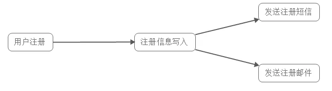](https://camo.githubusercontent.com/f8b6a3dd47501597be1ec4ee20769caf3915a47529a5b020e18127c861cd208a/68747470733a2f2f63646e2e6e6c61726b2e636f6d2f79757175652f302f323032332f706e672f32323231393438332f313637383838353131353037312d63313662376464352d346231332d346633322d616635642d3635623932366363343865382e706e67)

在这种方式下，发短信和发邮件 需处理完成后再返回给客户端。假设以上三个子系统处理的时间均为50ms，且不考虑网络延迟，则总的处理时间：

串行：50+50+50=150ms

并行：50+50 = 100ms

若使用消息队列：

[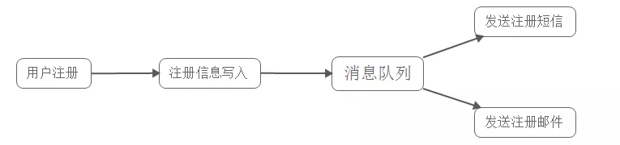](https://camo.githubusercontent.com/a77bb8d352828b1f1d16ff060040d211c93c8c49df438ce504753043c9a11abb/68747470733a2f2f63646e2e6e6c61726b2e636f6d2f79757175652f302f323032332f706e672f32323231393438332f313637383838353134333634352d65346438326265312d393738382d346439652d626536372d6139623638373537353434392e706e67)

在写入消息队列后立即返回成功给客户端，则总的响应时间依赖于写入消息队列的时间，而写入消息队列的时间本身是可以很快的，基本可以忽略不计，因此总的处理时间相比串行提高了2倍，相比并行提高了一倍；

#### 消息模式

消息队列包括两种模式，点对点模式（point to point， queue）和发布/订阅模式（publish/subscribe，topic）

1) **点对点模式**

点对点模式下包括三个角色：

- 消息队列
- 发送者 (生产者)
- 接收者（消费者）

[](https://camo.githubusercontent.com/71a8274a93a7e0b879aa7d26d3fe7d4447a57269a6c14131919d9a8fc29c485f/68747470733a2f2f63646e2e6e6c61726b2e636f6d2f79757175652f302f323032332f706e672f32323231393438332f313637383933333535363539342d34656238663031322d353366332d346138382d626435612d3866363334353264616332332e706e67)

消息发送者生产消息发送到queue中，然后消息接收者从queue中取出并且消费消息。消息被消费以后，queue中不再有存储，所以消息接收者不可能消费到已经被消费的消息。

点对点模式特点：

- 每个消息只有一个接收者（Consumer）(即一旦被消费，消息就不再在消息队列中)；
- 发送者和接发收者间没有依赖性，发送者发送消息之后，不管有没有接收者在运行，都不会影响到发送者下次发送消息；
- 接收者在成功接收消息之后需向队列应答成功，以便消息队列删除当前接收的消息；

**2) 发布/订阅模式**

发布/订阅模式下包括三个角色：

- 角色主题（Topic）
- 发布者(Publisher)
- 订阅者(Subscriber)

[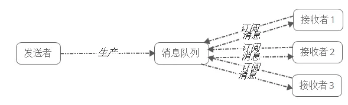](https://camo.githubusercontent.com/3832f7d6032ccd0812d0c11f07c2c8bbacb72f606ac796058c5a3fc328dea9cd/68747470733a2f2f63646e2e6e6c61726b2e636f6d2f79757175652f302f323032332f706e672f32323231393438332f313637383933353931323032312d63643765363863652d373435332d343333322d383733302d3735373361343966313237342e706e67)

发布者将消息发送到Topic，系统将这些消息传递给多个订阅者。

发布/订阅模式特点：

- 每个消息可以有多个订阅者；
- 发布者和订阅者之间有时间上的依赖性。针对某个主题（Topic）的订阅者，它必须创建一个订阅者之后，才能消费发布者的消息。
- 为了消费消息，订阅者需要提前订阅该角色主题，并保持在线运行；

#### kafka

kafka是一个分布式，分区的，多副本的，多订阅者的日志系统（分布式MQ系统），可以用于搜索日志，监控日志，访问日志等。

> kafka对消息保存时根据**Topic**进行归类，发送消息者成为Producer,消息接受者成为Consumer,此外kafka集群有多个kafka实例组成，每个实例(server)成为**broker**。无论是kafka集群，还是producer和consumer都依赖于zookeeper来保证系统可用性集群保存一些meta信息。

优点：

> - 可靠性：分布式的，分区，多副本和容错的。
> - 可扩展性：kafka消息传递系统轻松缩放，无需停机。
> - 耐用性：kafka使用分布式提交日志，这意味着消息会尽可能快速的保存在磁盘上，因此它是持久的。
> - 性能：kafka对于发布和定于消息都具有高吞吐量。即使存储了许多TB的消息，他也爆出稳定的性能。
> - kafka非常快：保证零停机和零数据丢失。

##### 架构


**生产者API**允许应用程序发布记录流至一个或者多个kafka的主题（topics）。

**消费者API**允许应用程序订阅一个或者多个主题，并处理这些主题接收到的记录流。

**StreamsAPI**允许应用程序充当流处理器（stream processor），从一个或者多个主题获取输入流，并生产一个输出流到一个或者多个主题，能够有效的变化输入流为输出流。

**ConnectAPI**允许构建和运行可重用的生产者或者消费者，能够把kafka主题连接到现有的应用程序或数据系统。例如：一个连接到关系数据库的连接器可能会获取每个表的变化。

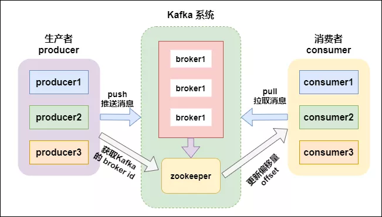

注：**在Kafka 2.8.0 版本，移除了对Zookeeper的依赖，通过KRaft进行自己的集群管理**

>  过去Apache ZooKeeper是Kafka这类分布式系统的关键，ZooKeeper扮演协调代理的角色，所有代理服务器启动时，都会连接到Zookeeper进行注册，当代理状态发生变化时，Zookeeper也会储存这些数据，在过去，ZooKeeper是一个强大的工具，但是毕竟ZooKeeper是一个独立的软件，使得Kafka整个系统变得复杂，因此官方决定使用内部Quorum控制器来取代ZooKeeper。
>
> 官方称这项功能为**Kafka Raft元数据模式（KRaft）**。在KRaft模式，过去由Kafka控制器和ZooKeeper所操作的元数据，将合并到这个新的Quorum控制器，并且在Kafka集群内部执行，当然，如果使用者有特殊使用情境，Quorum控制器也可以在专用的硬件上执行。

kafka支持消息持久化，消费端是主动拉取数据，消费状态和订阅关系由客户端负责维护，**消息消费完后，不会立即删除，会保留历史消息**。因此支持多订阅时，消息只会存储一份就可以。

##### 概念

>  broker,topic,partition,segement,producer,consumer,comsumer group

- **broker**：kafka集群中包含一个或者多个服务实例（节点），这种服务实例被称为broker（一个broker就是一个节点/一个服务器）；

- **topic**：每条发布到kafka集群的消息都属于某个类别，这个类别就叫做topic；kafka将消息以topic为单位进行归类；生产者和消费者消费数据一般以topic为单位。更细粒度可以到分区级别。

- **partition**：partition是一个物理上的概念，每个topic包含一个或者多个partition；**每一个分区内的数据是有序的，但全局的数据不能保证是有序的。**（有序是指生产什么样顺序，消费时也是什么样的顺序）。在kafka中，每一个分区会有一个编号：编号从0开始。

- **segment**：一个partition当中存在多个segment文件段，每个segment分为两部分，.log文件和 .index 文件，其中 .index 文件是索引文件，主要用于快速查询， .log 文件当中数据的偏移量位置；

  > 在kafka的设计中，将offset值作为了文件名的一部分。
  >
  > segment文件命名规则：partion全局的第一个segment从0开始，后续每个segment文件名为上一个全局 partion的最大offset（偏移message数）。数值最大为64位long大小，20位数字字符长度，没有数字就用 0 填充。
  >
  > **通过索引信息可以快速定位到message。通过index元数据全部映射到内存，可以避免segment File的IO磁盘操作；**
  >
  > **通过索引文件稀疏存储，可以大幅降低index文件元数据占用空间大小。**
  >
  > 索引文件中元数据指向对应数据文件中message的物理偏移地址。
  >
  > 比如索引文件中 3,497 代表：数据文件中的第三个message，它的偏移地址为497。
  >
  > 再来看数据文件中，Message 368772表示：在全局partiton中是第368772个message。
  >
  > 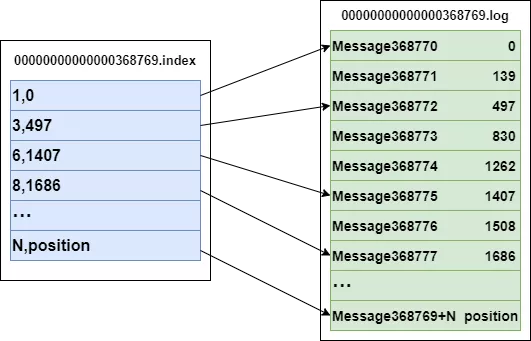
  >
  > 上图左半部分是索引文件，里面存储的是一对一对的key-value，其中key是消息在数据文件（对应的log文件）中的编号，比如“1,3,6,8……”，分别表示在log文件中的第1条消息、第3条消息、第6条消息、第8条消息……
  >
  > 那么为什么在index文件中这些编号不是连续的呢？这是因为index文件中并没有为数据文件中的每条消息都建立索引，而是采用了**稀疏存储**的方式，每隔一定字节的数据建立一条索引。 这样避免了索引文件占用过多的空间，从而可以将索引文件保留在内存中。 但缺点是没有建立索引的Message也不能一次定位到其在数据文件的位置，从而需要做一次顺序扫描，但是这次顺序扫描的范围就很小了。

- **consumer group**：消费者组由一个或者多个消费者组成，**同一个组中的消费者对于同一条消息只消费一次**。每个消费者都属于某个消费者组，如果不指定，那么所有的消费者都属于默认的组。每个消费者组都有一个ID，即group ID。**每个分区只能由同一个消费组内的一个消费者(consumer)来消费，可以由不同的消费组来消费**。

- **partition replicas**（分区副本）：

  partition的目的是：**通过多分区实现负载均衡的效果，提高kafka访问吞吐率。**

  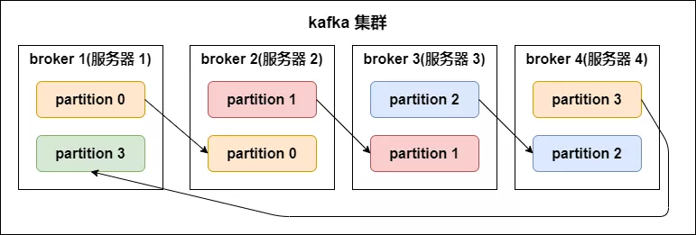

  主副本叫做leader，从副本叫做 follower（在有多个副本的情况下，kafka会为同一个分区下的所有分区，设定角色关系：一个leader和N个 follower），处于同步状态的副本叫做in-sync-replicas(ISR);**创建主题时，副本因子应该小于等于可用的broker数。**副本因子操作以分区为单位的。每个分区都有各自的主副本和从副本；

  > 如果某一个分区有三个副本因子，就算其中一个挂掉，那么只会剩下的两个中，选择一个leader，但不会在其他的broker中，另启动一个副本（因为在另一台启动的话，存在数据传递，只要在机器之间有数据传递，就会长时间占用网络IO，kafka是一个高吞吐量的消息系统，这个情况不允许发生）所以不会在另一个broker中启动。
  >
  > **副本因子的作用**：让kafka读取数据和写入数据时的可靠性。
  >
  > 如果所有的副本都挂了，生产者如果生产数据到指定分区的话，将写入不成功。

- **Message** : 

  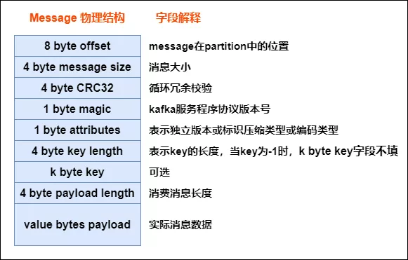

**partition数量决定了每个consumer group中并发消费者的最大数量。分区数越多，同一时间可以有越多的消费者来进行消费，消费数据的速度就会越快，提高消费的性能。**

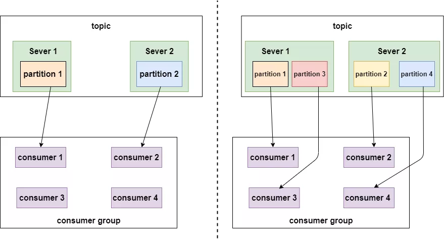

##### kafka 的 CAP

**kafka满足的是CAP定律当中的CA，其中Partition tolerance通过的是一定的机制尽量的保证分区容错性。其中C表示的是数据一致性。A表示数据可用性。**

kafka首先将数据写入到不同的分区里面去，每个分区又可能有好多个副本，数据首先写入到leader分区里面去，**读写的操作都是与leader分区进行通信，保证了数据的一致性原则，也就是满足了Consistency原则**。然后**kafka通过分区副本机制，来保证了kafka当中数据的可用性**。但是也存在另外一个问题，就是副本分区当中的数据与leader当中的数据存在差别的问题如何解决，这个就是Partition tolerance的问题。

**kafka为了解决Partition tolerance的问题，使用了ISR的同步策略，来尽最大可能减少Partition tolerance的问题。**每个leader会维护一个ISR（a set of in-sync replicas，基本同步）列表。

ISR列表主要的作用就是决定哪些副本分区是可用的，也就是说可以将leader分区里面的数据同步到副本分区里面去，决定一个副本分区是否可用的条件有两个：

- replica.lag.time.max.ms=10000 副本分区与主分区**心跳时间延迟**
- replica.lag.max.messages=4000 副本分区与主分区**消息同步最大差**

produce 请求被认为完成时的确认值：request.required.acks=0。

- ack=0：producer不等待broker同步完成的确认，继续发送下一条(批)信息。
- ack=1（默认）：producer要等待leader成功收到数据并得到确认，才发送下一条message。
- ack=-1：producer得到follwer确认，才发送下一条数据。

##### kafka的幂等性保证

这里首先需要理解分布式数据传递过程中的三个数据语义：

- at-least-once:至少一次
- at-most-once:最多一次
- exactly-once:精确一次

通常意义上，at-least-once可以保证数据不丢失，但是不能保证数据不重复。而at-most-once保证数据不重复，但是又不能保证数据不丢失。这两种语义虽然都有缺陷，但是实现起来相对来说比较简单。但是对一些敏感的业务数据，往往要求数据即不重复也不丢失，这就需要支持Exactly-once语义。而要支持Exactly-once语义，需要有非常精密的设计。
kafka中，Producer发消息给Broker这个场景，如果要保证at-most-once语义，可以将ack级别设置为o即可，此时，是不存在幂等性问题的。如果要保证at-least-once语义，就需要将ack级
别设置为1（等待leader确认）或者-1（等待所有确认），这样就能保证Leader Partition中的消息至少是写成功了一次的，但是不保证只写了一次。如果要支持Exactly-once语义怎么办呢？这就需要使用到idempotence幂等性属性了。即

```
props.put(“enable.idempotence”, ture)，
或props.put(ProducerConfig.ENABLE_IDEMPOTENCE_CONFIG， true)。
```

`enable.idempotence`被设置成true后，Producer自动升级成幂等性Producer，其他所有的代码逻辑都不需要改变。

Kafka为了保证消息发送的Exactly-once语义，增加了几个概念：

- PID：每个新的Producer在初始化的过程中就会被分配一个唯一的PID。这个PID对用户是不可见的。
- SequenceNumer: 对于每个PID，这个Producer针对Partition会维护一个sequenceNumber。这是一个从0开始单调递增的数字。当Producer要往同一个Partition发送消息时，这个
  Sequence Number就会加1。然后会随着消息一起发往Broker。
- Broker端则会针对每个<PID,Partition>维护一个序列号（SN)，只有当对应的SequenceNumber = SN+1时，Broker才会接收消息，同时将SN更新为SN+1。否则,SequenceNumber过小就认为消息已经写入了，不需要再重复写入。而如果SequenceNumber过大，就会认为中间可能有数据丢失了。对生产者就会抛出一个
  OutOfOrderSequenceException。

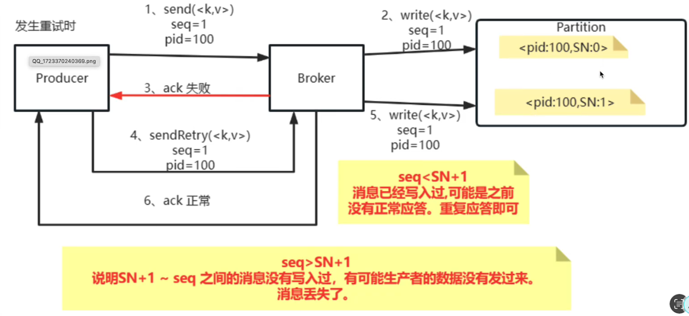

> 通过SN维护(seq,pid)对，从而避免同样的请求因为网络原因导致多次写入

这样，Kafka在打开idempotence幂等性控制后，在Broker端就会保证每条消息在一次发送过程中，Broker端最多只会刚刚好持久化一条。这样就能保证at-most-once语义。再加上之前分析的将生产者的acks参数设置成1或-1，保证at-least-once语义，这样就整体上保证了Exactaly-once语义。

##### 重平衡

**「（重平衡）Rebalance本质上是一种协议，规定了一个Consumer Group下的所有Consumer如何达成一致，来分配订阅Topic的每个分区」**。

比如某个Group下有20个Consumer实例，它订阅了一个具有100个分区的Topic。

正常情况下，Kafka平均会为每个Consumer分配5个分区。这个分配的过程就叫Rebalance。

**「Rebalance的触发条件有3个。」**

1. 组成员数发生变更。比如有新的Consumer实例加入组或者离开组，或是有Consumer实例崩溃被踢出组。
2. 订阅主题数发生变更。Consumer Group可以使用正则表达式的方式订阅主题，比如`consumer.subscribe(Pattern.compile(“t.*c”))`就表明该Group订阅所有以字母t开头、字母c结尾的主题，在Consumer Group的运行过程中，你新创建了一个满足这样条件的主题，那么该Group就会发生Rebalance。
3. 订阅主题的分区数发生变更。Kafka当前只能允许增加一个主题的分区数，当分区数增加时，就会触发订阅该主题的所有Group开启Rebalance。

Rebalance发生时，Group下所有的Consumer实例都会协调在一起共同参与。

**「Coordinator会在什么情况下认为某个Consumer实例已挂从而要退组呢？」**

当Consumer Group完成Rebalance之后，每个Consumer实例都会定期地向Coordinator发送心跳请求，表明它还存活着。

如果某个Consumer实例不能及时地发送这些心跳请求，Coordinator就会认为该Consumer已经死了，从而将其从Group中移除，然后开启新一轮Rebalance。

Consumer端有个参数，叫`session.timeout.ms`。

该参数的默认值是10秒，即如果Coordinator在10秒之内没有收到Group下某Consumer实例的心跳，它就会认为这个Consumer实例已经挂了。

除了这个参数，Consumer还提供了一个允许你控制发送心跳请求频率的参数，就是`heartbeat.interval.ms`。

这个值设置得越小，Consumer实例发送心跳请求的频率就越高。

频繁地发送心跳请求会额外消耗带宽资源，但好处是能够更加快速地知晓当前是否开启Rebalance，因为，目前Coordinator通知各个Consumer实例开启Rebalance的方法，就是将`REBALANCE_NEEDED`标志封装进心跳请求的响应体中。

除了以上两个参数，Consumer端还有一个参数，用于控制Consumer实际消费能力对Rebalance的影响，即`max.poll.interval.ms`参数。

它限定了Consumer端应用程序两次调用poll方法的最大时间间隔。

它的默认值是5分钟，表示你的Consumer程序如果在5分钟之内无法消费完poll方法返回的消息，那么Consumer会主动发起离开组的请求，Coordinator也会开启新一轮Rebalance。

**「可避免Rebalance的配置」**

第一类Rebalance是因为未能及时发送心跳，导致Consumer被踢出Group而引发的

因此可以设置**「session.timeout.ms和heartbeat.interval.ms」**的值。

- 设置`session.timeout.ms` = 6s。
- 设置`heartbeat.interval.ms` = 2s。
- 要保证Consumer实例在被判定为dead之前，能够发送至少3轮的心跳请求，即`session.timeout.ms >= 3 * heartbeat.interval.ms`。

将`session.timeout.ms`设置成6s主要是为了让Coordinator能够更快地定位已经挂掉的Consumer。

**「第二类Rebalance是Consumer消费时间过长导致的」**。

你要为你的业务处理逻辑留下充足的时间，这样Consumer就不会因为处理这些消息的时间太长而引发Rebalance了。

##### 消费者Offset

**「Kafka将Consumer的位移数据作为一条条普通的Kafka消息，提交到__consumer_offsets中。」**

**「__consumer_offsets的主要作用是保存Kafka消费者的位移信息。」**

它要求这个提交过程不仅要实现高持久性，还要支持高频的写操作。

`__consumer_offsets`主题就是普通的Kafka主题。你可以手动地创建它、修改它，甚至是删除它。`__consumer_offsets`有3种消息格式：

1. 用于保存Consumer Group信息的消息。
2. 用于删除Group过期位移甚至是删除Group的消息。
3. 保存了位移值。

第2种格式它有个专属的名字：tombstone消息，即墓碑消息，也称delete mark，它的主要特点是它的消息体是null，即空消息体。

一旦某个Consumer Group下的所有Consumer实例都停止了，而且它们的位移数据都已被删除时，Kafka会向`__consumer_offsets`主题的对应分区写入tombstone消息，表明要彻底删除这个Group的信息。

`__consumer_offsets`是怎么被创建的？

通常来说，**「当Kafka集群中的第一个Consumer程序启动时，Kafka会自动创建位移主题」**。**「默认该主题的分区数是50，副本数是3」**。

> 目前Kafka Consumer提交位移的方式有两种：**「自动提交位移和手动提交位移。」**
>
> Consumer端有个参数叫`enable.auto.commit`，如果值是true，则Consumer在后台默默地为你定期提交位移，提交间隔由一个专属的参数`auto.commit.interval.ms`来控制。
>
> 自动提交位移有一个显著的优点，就是省事，你不用操心位移提交的事情，就能保证消息消费不会丢失。
>
> 但这一点同时也是缺点，丧失了很大的灵活性和可控性，你完全没法把控Consumer端的位移管理。
>
> Kafka Consumer API为你提供了位移提交的方法，如`consumer.commitSync`等。
>
> 当调用这些方法时，Kafka会向`__consumer_offsets`主题写入相应的消息。
>
> 如果你选择的是自动提交位移，那么就可能存在一个问题：只要Consumer一直启动着，它就会无限期地向位移主题写入消息。
>
> **「举个极端一点的例子。」**
>
> 假设Consumer当前消费到了某个主题的最新一条消息，位移是100，之后该主题没有任何新消息产生，故Consumer无消息可消费了，所以位移永远保持在100。
>
> 由于是自动提交位移，位移主题中会不停地写入位移=100的消息。
>
> 显然Kafka只需要保留这类消息中的最新一条就可以了，之前的消息都是可以删除的。
>
> 这就要求Kafka必须要有针对位移主题消息特点的消息删除策略，否则这种消息会越来越多，最终撑爆整个磁盘。

Kafka使用**「Compact策略」**来删除`__consumer_offsets`主题中的过期消息，避免该主题无限期膨胀。

比如对于同一个Key的两条消息M1和M2，如果M1的发送时间早于M2，那么M1就是过期消息。

Compact的过程就是扫描日志的所有消息，剔除那些过期的消息，然后把剩下的消息整理在一起。


图中位移为0、2和3的消息的Key都是K1，Compact之后，分区只需要保存位移为3的消息，因为它是最新发送的。**「Kafka提供了专门的后台线程定期地巡检待Compact的主题，看看是否存在满足条件的可删除数据」**。这个后台线程叫Log Cleaner。

##### 副本机制

根据Kafka副本机制的定义，同一个分区下的所有副本保存有相同的消息序列，这些副本分散保存在不同的Broker上，从而能够对抗部分Broker宕机带来的数据不可用。

> 在Kafka中，副本分成两类：领导者副本（Leader Replica）和追随者副本（Follower Replica）。
>
> 每个分区在创建时都要选举一个副本，称为领导者副本，其余的副本自动称为追随者副本。
>
> 在Kafka中，追随者副本是不对外提供服务的。这就是说，任何一个追随者副本都不能响应消费者和生产者的读写请求。所有的请求都必须由领导者副本来处理，或者说，所有的读写请求都必须发往领导者副本所在的Broker，由该Broker负责处理。
>
> 追随者副本不处理客户端请求，它唯一的任务就是从领导者副本**「异步拉取」**消息，并写入到自己的提交日志中，从而实现与领导者副本的同步。
>
> 当领导者副本挂掉了，或者说领导者副本所在的Broker宕机时，Kafka依托于ZooKeeper提供的监控功能能够实时感知到，并立即开启新一轮的领导者选举，从追随者副本中选一个作为新的领导者。老Leader副本重启回来后，只能作为追随者副本加入到集群中。
>
> 这种副本机制有两个方面的好处。
>
> 1.**「方便实现Read-your-writes」**。
>
> 所谓Read-your-writes，顾名思义就是，当你使用生产者API向Kafka成功写入消息后，马上使用消费者API去读取刚才生产的消息。
>
> 2.**「方便实现单调读（Monotonic Reads）」**。
>
> 假设当前有2个追随者副本F1和F2，它们异步地拉取领导者副本数据。倘若F1拉取了Leader的最新消息而F2还未及时拉取，那么，此时如果有一个消费者先从F1读取消息之后又从F2拉取消息，它可能会看到这样的现象：第一次消费时看到的最新消息在第二次消费时不见了，这就不是单调读一致性。
>
> 但是，如果所有的读请求都是由Leader来处理，那么Kafka就很容易实现单调读一致性。

**ISR机制**

In-sync Replicas，也就是所谓的ISR副本集合。ISR中的副本都是与Leader同步的副本，相反，不在ISR中的追随者副本就被认为是与Leader不同步的。Leader副本天然就在ISR中。也就是说，**「ISR不只是追随者副本集合，它必然包括Leader副本。甚至在某些情况下，ISR只有Leader这一个副本」**。

> 另外，能够进入到ISR的追随者副本要满足一定的条件。
>
> **「通过Broker端参数replica.lag.time.max.ms参数值」**。
>
> 这个参数的含义是Follower副本能够落后Leader副本的最长时间间隔，当前默认值是10秒。
>
> 这就是说，只要一个Follower副本落后Leader副本的时间不连续超过10秒，那么Kafka就认为该Follower副本与Leader是同步的，即使此时Follower副本中保存的消息明显少于Leader副本中的消息。
>
> Follower副本唯一的工作就是不断地从Leader副本拉取消息，然后写入到自己的提交日志中。
>
> 倘若该副本后面慢慢地追上了Leader的进度，那么它是能够重新被加回ISR的。
>
> ISR是一个动态调整的集合，而非静态不变的。

**Unclean领导者选举**

**「Kafka把所有不在ISR中的存活副本都称为非同步副本」**。

通常来说，非同步副本落后Leader太多，因此，如果选择这些副本作为新Leader，就可能出现数据的丢失。

毕竟，这些副本中保存的消息远远落后于老Leader中的消息。

在Kafka中，选举这种副本的过程称为Unclean领导者选举。

**「Broker端参数unclean.leader.election.enable控制是否允许Unclean领导者选举」**。

开启Unclean领导者选举可能会造成数据丢失，但好处是，它使得分区Leader副本一直存在，不至于停止对外提供服务，因此提升了高可用性。反之，禁止Unclean领导者选举的好处在于维护了数据的一致性，避免了消息丢失，但牺牲了高可用性。

##### 副本选举过程

对于kafka集群中对于任意的topic的分区以及副本leader的设定，都需要考虑到集群整体的负载能力的平衡性，会尽量分配每一个partition的副本leader在不同的broker中，这样会避免多个leader在同一个broker，导致集群中的broker负载不平衡

kafka引入了优先副本的概念，优先副本的意思在AR（分区中的所有副本）集合列表中的第一个副本，在理想状态下该副本就是该分区的leader副本

##### 网络通信模型


Broker 中有个`Acceptor(mainReactor)`监听新连接的到来，与新连接建连之后轮询选择一个`Processor(subReactor)`管理这个连接。

而`Processor`会监听其管理的连接，当事件到达之后，读取封装成`Request`，并将`Request`放入共享请求队列中。

然后IO线程池不断的从该队列中取出请求，执行真正的处理。处理完之后将响应发送到对应的`Processor`的响应队列中，然后由`Processor`将`Response`返还给客户端。

每个`listener`只有一个`Acceptor线程`，因为它只是作为新连接建连再分发，没有过多的逻辑，很轻量。

##### 事务

Kafka自0.11版本开始也提供了对事务的支持，目前主要是在read committed隔离级别上做事情。

它能保证多条消息原子性地写入到目标分区，同时也能保证Consumer只能看到事务成功提交的消息。

**「事务型Producer」**

事务型Producer能够保证将消息原子性地写入到多个分区中。

这批消息要么全部写入成功，要么全部失败，另外，事务型Producer也不惧进程的重启。

Producer重启回来后，Kafka依然保证它们发送消息的精确一次处理。

> 设置事务型Producer的方法也很简单，满足两个要求即可：
>
> - 和幂等性Producer一样，开启`enable.idempotence = true`。
> - 设置Producer端参数`transactional. id`，最好为其设置一个有意义的名字。
>
> 此外，你还需要在Producer代码中做一些调整，如这段代码所示：
>
> ```java
> producer.initTransactions();
> try {
>             producer.beginTransaction();
>             producer.send(record1);
>             producer.send(record2);
>             producer.commitTransaction();
> } catch (KafkaException e) {
>             producer.abortTransaction();
> }
> ```
>
> 和普通Producer代码相比，事务型Producer的显著特点是调用了一些事务API，如initTransaction、beginTransaction、commitTransaction和abortTransaction，它们分别对应事务的初始化、事务开始、事务提交以及事务终止。
>
> 这段代码能够保证Record1和Record2被当作一个事务统一提交到Kafka，要么它们全部提交成功，要么全部写入失败。
>
> 实际上即使写入失败，Kafka也会把它们写入到底层的日志中，也就是说Consumer还是会看到这些消息。
>
> 有一个`isolation.level`参数，这个参数有两个取值：
>
> 1. `read_uncommitted`：这是默认值，表明Consumer能够读取到Kafka写入的任何消息，不论事务型Producer提交事务还是终止事务，其写入的消息都可以读取，如果你用了事务型Producer，那么对应的Consumer就不要使用这个值。
> 2. `read_committed`：表明Consumer只会读取事务型Producer成功提交事务写入的消息，它也能看到非事务型Producer写入的所有消息。

##### 控制器

**「控制器组件（Controller），它的主要作用是在Apache ZooKeeper的帮助下管理和协调整个Kafka集群」**。

集群中任意一台Broker都能充当控制器的角色，但是，在运行过程中，只能有一个Broker成为控制器，行使其管理和协调的职责。

Kafka控制器大量使用ZooKeeper的Watch功能实现对集群的协调管理。

**「控制器是如何被选出来的」**

实际上，Broker在启动时，会尝试去ZooKeeper中创建`/controller`节点。

Kafka当前选举控制器的规则是：**「第一个成功创建/controller节点的Broker会被指定为控制器」**。

**「控制器是做什么的」**

控制器的职责大致可以分为5种：

1.**「主题管理（创建、删除、增加分区）」**

控制器帮助我们完成对Kafka主题的创建、删除以及分区增加的操作。

2.**「分区重分配」**

3.**「Preferred领导者选举」**

Preferred领导者选举主要是Kafka为了避免部分Broker负载过重而提供的一种换Leader的方案。

4.**「集群成员管理（新增Broker、Broker主动关闭、Broker宕机）」**

包括自动检测新增Broker、Broker主动关闭及被动宕机。

这种自动检测是依赖于Watch功能和ZooKeeper临时节点组合实现的。

比如，控制器组件会利用**「Watch机制」**检查ZooKeeper的`/brokers/ids`节点下的子节点数量变更。

目前，当有新Broker启动后，它会在`/brokers`下创建专属的znode节点。

一旦创建完毕，ZooKeeper会通过Watch机制将消息通知推送给控制器，这样，控制器就能自动地感知到这个变化，进而开启后续的新增Broker作业。

侦测Broker存活性则是依赖于刚刚提到的另一个机制：**「临时节点」**。

每个Broker启动后，会在`/brokers/ids`下创建一个临时znode。

当Broker宕机或主动关闭后，该Broker与ZooKeeper的会话结束，这个znode会被自动删除。

同理，ZooKeeper的Watch机制将这一变更推送给控制器，这样控制器就能知道有Broker关闭或宕机了，从而进行善后。

5.**「数据服务」**

控制器上保存了最全的集群元数据信息，其他所有Broker会定期接收控制器发来的元数据更新请求，从而更新其内存中的缓存数据。

**「控制器故障转移（Failover）」**

**「故障转移指的是，当运行中的控制器突然宕机或意外终止时，Kafka能够快速地感知到，并立即启用备用控制器来代替之前失败的控制器」**。这个过程就被称为Failover，该过程是自动完成的，无需你手动干预。


最开始时，Broker 0是控制器。当Broker 0宕机后，ZooKeeper通过Watch机制感知到并删除了`/controller`临时节点。

之后，所有存活的Broker开始竞选新的控制器身份。

Broker 3最终赢得了选举，成功地在ZooKeeper上重建了`/controller`节点。

之后，Broker 3会从ZooKeeper中读取集群元数据信息，并初始化到自己的缓存中。

至此，控制器的Failover完成，可以行使正常的工作职责了。

##### 日志存储

Kafka中的消息是以主题为基本单位进行归类的，每个主题在逻辑上相互独立。

每个主题又可以分为一个或多个分区，在不考虑副本的情况下，一个分区会对应一个日志。

但设计者考虑到随着时间推移，日志文件会不断扩大，因此为了防止Log过大，设计者引入了日志分段（LogSegment）的概念，将Log切分为多个LogSegment，便于后续的消息维护和清理工作。

下图描绘了主题、分区、副本、Log、LogSegment五者之间的关系。


在Kafka中，每个Log对象又可以划分为多个LogSegment文件，每个LogSegment文件包括一个日志数据文件和两个索引文件（偏移量索引文件和消息时间戳索引文件）。

##### 丢消息处理

**「生产者程序丢失数据」**

目前Kafka Producer是异步发送消息的，也就是说如果你调用的是`producer.send(msg)`这个API，那么它通常会立即返回，但此时你不能认为消息发送已成功完成。

如果用这个方式，可能会有哪些因素导致消息没有发送成功呢？

其实原因有很多，例如网络抖动，导致消息压根就没有发送到Broker端；或者消息本身不合格导致Broker拒绝接收（比如消息太大了，超过了Broker的承受能力）等。

实际上，解决此问题的方法非常简单：Producer永远要使用带有回调通知的发送API，也就是说不要使用`producer.send(msg)`，而要使用`producer.send(msg, callback)`。

它能准确地告诉你消息是否真的提交成功了。

一旦出现消息提交失败的情况，你就可以有针对性地进行处理。

**「消费者程序丢失数据」**

Consumer程序从Kafka获取到消息后开启了多个线程异步处理消息，而Consumer程序自动地向前更新位移。

假如其中某个线程运行失败了，它负责的消息没有被成功处理，但位移已经被更新了，因此这条消息对于Consumer而言实际上是丢失了。

这里的关键在于Consumer自动提交位移。这个问题的解决方案也很简单：

**「如果是多线程异步处理消费消息，Consumer程序不要开启自动提交位移，而是要应用程序手动提交位移」**。

总结Kafka无消息丢失的配置：

1. 不要使用`producer.send(msg)`，而要使用`producer.send(msg, callback)`，一定要使用带有回调通知的send方法。
2. 设置`acks = all`，acks是Producer的一个参数，代表了你对已提交消息的定义，如果设置成all，则表明所有副本Broker都要接收到消息，该消息才算是已提交。
3. 设置retries为一个较大的值。这里的retries同样是Producer的参数，对应前面提到的Producer自动重试，当出现网络的瞬时抖动时，消息发送可能会失败，此时配置了`retries > 0`的Producer能够自动重试消息发送，避免消息丢失。
4. 设置`unclean.leader.election.enable = false`，这是Broker端的参数，它控制的是哪些Broker有资格竞选分区的Leader，如果一个Broker落后原先的Leader太多，那么它一旦成为新的Leader，必然会造成消息的丢失，故一般都要将该参数设置成false，即不允许这种情况的发生。
5. 设置`replication.factor >= 3`，这也是Broker端的参数，将消息多保存几份，目前防止消息丢失的主要机制就是冗余。
6. 设置`min.insync.replicas > 1`，这依然是Broker端参数，控制的是消息至少要被写入到多少个副本才算是已提交，设置成大于1可以提升消息持久性，在实际环境中千万不要使用默认值1。
7. 确保`replication.factor > min.insync.replicas`，如果两者相等，那么只要有一个副本挂机，整个分区就无法正常工作了，我们不仅要改善消息的持久性，防止数据丢失，还要在不降低可用性的基础上完成，推荐设置成`replication.factor = min.insync.replicas + 1`。
8. 确保消息消费完成再提交，Consumer端有个参数`enable.auto.commit`，最好把它设置成false，并采用手动提交位移的方式。

##### 重消费问题

**「消费重复的场景」**

在`enable.auto.commit` 默认值true情况下，出现重复消费的场景有以下几种：

> ❝consumer 在消费过程中，应用进程被强制kill掉或发生异常退出。❞

例如在一次poll 500条消息后，消费到200条时，进程被强制kill消费到offset未提交，或出现异常退出导致消费到offset未提交。

下次重启时，依然会重新拉取500消息，造成之前消费到200条消息重复消费了两次。

解决方案：在发生异常时正确处理未提交的offset

**「消费者消费时间过长」**

`max.poll.interval.ms`参数定义了两次poll的最大间隔，它的默认值是 5 分钟，表示你的 Consumer 程序如果在 5 分钟之内无法消费完 poll 方法返回的消息，那么 Consumer 会主动发起离开组的请求，Coordinator 也会开启新一轮 Rebalance。

举例：单次拉取11条消息，每条消息耗时30s，11条消息耗时5分钟30秒，由于`max.poll.interval.ms` 默认值5分钟，所以消费者无法在5分钟内消费完，consumer会离开组，导致rebalance。

在消费完11条消息后，consumer会重新连接broker，再次rebalance，因为上次消费的offset未提交，再次拉取的消息是之前消费过的消息，造成重复消费。

**「解决方案：」**

1、提高消费能力，提高单条消息的处理速度；根据实际场景可讲`max.poll.interval.ms`值设置大一点，避免不必要的rebalance；可适当减小`max.poll.records`的值，默认值是500，可根据实际消息速率适当调小。

2、生成消息时，可加入唯一标识符如消息id，在消费端，保存最近的1000条消息id存入到redis或mysql中，消费的消息时通过前置去重。

##### 消息顺序性问题

我们都知道`kafka`的`topic`是无序的，但是一个`topic`包含多个`partition`，每个`partition`内部是有序的

**「乱序场景1」**

因为一个topic可以有多个partition，kafka只能保证partition内部有序

**「解决方案」**

1、可以设置topic，有且只有一个partition

2、根据业务需要，需要顺序的 指定为同一个partition

3、根据业务需要，比如同一个订单，使用同一个key，可以保证分配到同一个partition上

**「乱序场景2」**

对于同一业务进入了同一个消费者组之后，用了多线程来处理消息，会导致消息的乱序

**「解决方案」**

消费者内部根据线程数量创建等量的内存队列，对于需要顺序的一系列业务数据，根据key或者业务数据，放到同一个内存队列中，然后线程从对应的内存队列中取出并操作


##### 高性能原因

**「顺序读写」**

kafka的消息是不断追加到文件中的，这个特性使`kafka`可以充分利用磁盘的顺序读写性能

顺序读写不需要硬盘磁头的寻道时间，只需很少的扇区旋转时间，所以速度远快于随机读写

Kafka 可以配置异步刷盘，不开启同步刷盘，异步刷盘不需要等写入磁盘后返回消息投递的 ACK，所以它提高了消息发送的吞吐量，降低了请求的延时

**「零拷贝」**

传统的 IO 流程，需要先把数据拷贝到内核缓冲区，再从内核缓冲拷贝到用户空间，应用程序处理完成以后，再拷贝回内核缓冲区

这个过程中发生了多次数据拷贝，为了减少不必要的拷贝，`Kafka` 依赖 Linux 内核提供的 `Sendfile` 系统调用

> 在 Sendfile 方法中，数据在内核缓冲区完成输入和输出，不需要拷贝到用户空间处理，这也就避免了重复的数据拷贝

在具体的操作中，Kafka 把所有的消息都存放在单独的文件里，在消息投递时直接通过 `Sendfile` 方法发送文件，减少了上下文切换，因此大大提高了性能。除了 `Sendfile` 之外，还有一种零拷贝的实现技术，即 Memory Mapped Files

Producer生产的数据持久化到broker，采用mmap文件映射，实现顺序的快速写入

Customer从broker读取数据，采用sendfile，将磁盘文件读到OS内核缓冲区后，直接转到socket buffer进行网络发送。

> Kafka 在**写数据时**用的是 **`mmap`** 来减少写磁盘开销；在**读数据发给消费者时**用的是 **`sendfile`** 来减少网络发送开销，两者都是 Linux 支持的零拷贝机制，目标都是“避免用户空间参与，提升吞吐”。

**「批量发送读取」**

Kafka 的批量包括批量写入、批量发布等。它在消息投递时会将消息缓存起来，然后批量发送

同样，消费端在消费消息时，也不是一条一条处理的，而是批量进行拉取，提高了消息的处理速度

**「数据压缩」**

Kafka还支持对消息集合进行压缩，`Producer`可以通过`GZIP`或`Snappy`格式对消息集合进行压缩

压缩的好处就是减少传输的数据量，减轻对网络传输的压力

Producer压缩之后，在`Consumer`需进行解压，虽然增加了CPU的工作，但在对大数据处理上，瓶颈在网络上而不是CPU，所以这个成本很值得

**「分区机制」**

kafka中的topic中的内容可以被分为多partition存在，每个partition又分为多个段segment，所以每次操作都是针对一小部分做操作，很轻便，并且增加`并行操作`的能力


#### 面经

##### 1.为什么要使用 kafka？

- **缓冲和削峰**：上游数据时有突发流量，下游可能扛不住，或者下游没有足够多的机器来保证冗余，kafka在中间可以起到一个缓冲的作用，把消息暂存在kafka中，下游服务就可以按照自己的节奏进行慢慢处理。
- **解耦和扩展性**：项目开始的时候，并不能确定具体需求。消息队列可以作为一个接口层，解耦重要的业务流程。只需要遵守约定，针对数据编程即可获取扩展能力。
- **冗余**：可以采用一对多的方式，一个生产者发布消息，可以被多个订阅topic的服务消费到，供多个毫无关联的业务使用。
- **健壮性**：消息队列可以堆积请求，所以消费端业务即使短时间死掉，也不会影响主要业务的正常进行。
- **异步通信**：很多时候，用户不想也不需要立即处理消息。消息队列提供了异步处理机制，允许用户把一个消息放入队列，但并不立即处理它。想向队列中放入多少消息就放多少，然后在需要的时候再去处理它们。

##### 2. Kafka消费过的消息如何再消费？

Kafka 是一个**顺序写入、offset 控制消费**的系统，消费过的消息**不会自动保留失败状态**

kafka消费消息的offset是定义在zookeeper中的， 如果想重复消费kafka的消息，可以在redis中自己记录offset的checkpoint点（n个），当想重复消费消息时，通过读取redis中的checkpoint点进行zookeeper的offset重设，这样就可以达到重复消费消息的目的了

此外，还可以通过使用不同的group进行消费，但是新的group是重新消费所有数据

##### 3. kafka的数据是放在磁盘上还是内存上，为什么速度会快？

kafka使用的是磁盘存储。

速度快是因为：

- 顺序写入：因为硬盘是机械结构，每次读写都会寻址->写入，其中寻址是一个“机械动作”，它是耗时的。所以硬盘 “讨厌”随机I/O， 喜欢顺序I/O。为了提高读写硬盘的速度，**Kafka就是使用顺序I/O**。
- Memory Mapped Files（内存映射文件）：64位操作系统中一般可以表示20G的数据文件，它的工作原理是直接利用操作系统的Page来实现文件到物理内存的直接映射。完成映射之后你对物理内存的操作会被同步到硬盘上。
- Kafka高效文件存储设计：
- - **Kafka把topic中一个parition大文件分成多个小文件段**，通过多个小文件段，就容易定期清除或删除已经消费完文件，减少磁盘占用。
  - 通过索引信息可以快速定位message和确定response的大小。
  - **通过index元数据全部映射到memory**（内存映射文件）， 可以避免segment file的IO磁盘操作。
  - **通过索引文件稀疏存储**，可以大幅降低index文件元数据占用空间大小。

注：

- Kafka解决查询效率的手段之一是将数据文件分段，比如有100条Message，它们的offset是从0到99。假设将数据文件分成5段，第一段为0-19，第二段为20-39，以此类推，每段放在一个单独的数据文件里面，数据文件以该段中 小的offset命名。这样在查找指定offset的Message的时候，用二分查找就可以定位到该Message在哪个段中。
- 为数据文件建 索引数据文件分段 使得可以在一个较小的数据文件中查找对应offset的Message 了，但是这依然需要顺序扫描才能找到对应offset的Message。
- 为了进一步提高查找的效率，Kafka为每个分段后的数据文件建立了索引文件，文件名与数据文件的名字是一样的，只是文件扩展名为.index。

##### 4. Kafka数据怎么保障不丢失？

**生产者数据不丢失：向kafka发送数据**

> kafka的ack机制：在kafka发送数据的时候，每次发送消息都会有一个确认反馈机制，确保消息正常的能够被收到，其中状态有0，1，-1。
>
> **ack=0**：producer不等待broker同步完成的确认，继续发送下一条(批)信息。果服务器发生故障，可能会导致数据丢失
>
> **ack=1（默认）**：producer要等待分区的leader成功收到数据并得到确认，才发送下一条message。但如果 Leader 副本死亡且 Follower 副本尚未复制数据，数据仍可能丢失
>
> **ack=-1/all**：producer得到 所有同步副本（ISR,in-sync replica） follwer确认，才发送下一条数据。
>
> **如果是同步模式：** （逐条发送的，第一条响应到达后，才会请求第二条）ack设置为0，风险很大，一般不建议设置为0。即使设置为1，也会随着leader宕机丢失数据。所以如果要严格保证生产端数据不丢失，可设置为-1。
>
> **如果是异步模式：**也会考虑ack的状态，除此之外，异步模式下的有个buffer，通过buffer来进行控制数据的发送，有两个值来进行控制，时间阈值与消息的数量阈值，如果buffer满了数据还没有发送出去，有个选项是配置是否立即清空buffer。可以设置为-1，永久阻塞，也就数据不再生产。异步模式下，即使设置为-1。也可能因为程序员的不科学操作，操作数据丢失，比如kill -9，但这是特别的例外情况。

**消费者数据不丢失：**

> 通过**offset commit** 来保证数据的不丢失，kafka自己记录了每次消费的offset数值，下次继续消费的时候，会接着上次的offset进行消费。
>
> 而offset的信息在kafka0.8版本之前保存在zookeeper中，在0.8版本之后保存到topic中，即使消费者在运行过程中挂掉了，再次启动的时候会找到offset的值，找到之前消费消息的位置，接着消费，由于 offset 的信息写入的时候并不是每条消息消费完成后都写入的，所以这种情况有可能会造成重复消费，但是不会丢失消息。
>
> *唯一例外的情况是，我们在程序中给原本做不同功能的两个consumer组设置KafkaSpoutConfig.bulider.setGroupid的时候设置成了一样的groupid，这种情况会导致这两个组共享同一份数据，就会产生组A消费partition1，partition2中的消息，组B消费partition3的消息，这样每个组消费的消息都会丢失，都是不完整的。 为了保证每个组都独享一份消息数据，groupid一定不要重复才行。*

**kafka集群中的broker的数据不丢失**

> 每个broker中的partition我们一般都会设置有replication（副本）的个数，生产者写入的时候首先根据分发策略（有partition按partition，有key按key，都没有轮询）写入到leader中，follower（副本）再跟leader同步数据，这样有了备份，也可以保证消息数据的不丢失。

##### 5.kafka关闭的影响

**重启是否会导致数据丢失？** 

> 1. kafka是将数据写到磁盘的，一般数据不会丢失。
> 2. 但是在重启kafka过程中，如果有消费者消费消息，那么kafka如果来不及提交offset，可能会造成数据的不准确（丢失或者重复消费）。

**kafka 宕机了如何解决？**

> 1. 先考虑业务是否受到影响
> 2. kafka 宕机了，首先我们考虑的问题应该是所提供的服务是否因为宕机的机器而受到影响，如果服务提供没问题，如果实现做好了集群的容灾机制，那么这块就不用担心了。
> 3. 节点排错与恢复 想要恢复集群的节点，主要的步骤就是通过日志分析来查看节点宕机的原因，从而解决，重新恢复节点。

##### 6.为什么Kafka不支持读写分离？

在 Kafka 中，生产者写入消息、消费者读取消息的操作都是与 leader 副本进行交互的，从 而实现的是一种主写主读的生产消费模型。Kafka 并不支持 主写从读，因为主写从读有 2 个很明显的缺点:

1. 数据一致性问题：数据从主节点转到从节点必然会有一个延时的时间窗口，这个时间 窗口会导致主从节点之间的数据不一致。某一时刻，在主节点和从节点中 A 数据的值都为 X， 之后将主节点中 A 的值修改为 Y，那么在这个变更通知到从节点之前，应用读取从节点中的 A 数据的值并不为最新的 Y，由此便产生了数据不一致的问题。
2. 延时问题：类似 Redis 这种组件，数据从写入主节点到同步至从节点中的过程需要经历 网络→主节点内存→网络→从节点内存 这几个阶段，整个过程会耗费一定的时间。而在 Kafka 中，主从同步会比 Redis 更加耗时，它需要经历 网络→主节点内存→主节点磁盘→网络→从节 点内存→从节点磁盘 这几个阶段。对延时敏感的应用而言，主写从读的功能并不太适用。

而kafka的**主写主读**的优点就很多了：

1. 可以简化代码的实现逻辑，减少出错的可能;
2. 将负载粒度细化均摊，与主写从读相比，不仅负载效能更好，而且对用户可控;
3. 没有延时的影响;
4. 在副本稳定的情况下，不会出现数据不一致的情况。

##### 7.kafka的数据offset读取流程

1. 连接ZK集群，从ZK中拿到对应topic的partition信息和partition的Leader的相关信息
2. 连接到对应Leader对应的broker
3. consumer将自⼰己保存的offset发送给Leader
4. Leader根据offset等信息定位到segment（索引⽂文件和⽇日志⽂文件）
5. 根据索引⽂文件中的内容，定位到⽇日志⽂文件中该偏移量量对应的开始位置读取相应⻓长度的数据并返回给consumer

##### 8. kafka内部如何保证顺序，结合外部组件如何保证消费者的顺序？

kafka只能保证partition内是有序的，但是partition间的有序是没办法的。爱奇艺的搜索架构，是从业务上把需要有序的打到同⼀个partition。

##### 9. Kafka消息数据积压，Kafka消费能力不足怎么处理？

1. 如果是Kafka消费能力不足，则可以考虑增加Topic的**分区数**，并且同时提升消费组的**消费者数量，消费者数=分区数**。（两者缺一不可）
2. 如果是下游的数据处理不及时：**提高每批次拉取的数量**。批次拉取数据过少（拉取数据/处理时间<生产速度），使处理的数据小于生产的数据，也会造成数据积压。

##### 10. Kafka单条日志传输大小

kafka对于消息体的大小默认为单条最大值是1M但是在我们应用场景中, 常常会出现一条消息大于1M，如果不对kafka进行配置。则会出现生产者无法将消息推送到kafka或消费者无法去消费kafka里面的数据, 这时我们就要对kafka进行以下配置：server.properties

```
replica.fetch.max.bytes: 1048576  broker可复制的消息的最大字节数, 默认为1M
message.max.bytes: 1000012   kafka 会接收单个消息size的最大限制， 默认为1M左右
```

**注意：message.max.bytes必须小于等于replica.fetch.max.bytes，否则就会导致replica之间数据同步失败。**


#### 对比

RabbitMQ 简介

**RabbitMQ** 是一个开源的消息代理，它实现了高级消息队列协议（AMQP）。RabbitMQ 在可靠性、灵活性和易用性方面表现优异，适合需要复杂路由和高可靠性的消息队列应用。

关键特点：

- **消息确认机制**：RabbitMQ 提供了确认机制（ACK），确保消息被消费者成功接收。消息不会丢失，适合重要的事务型数据处理。
- **丰富的交换机模式**：支持多种消息路由模式，包括 direct、topic、fanout、headers，能灵活地应对不同的消息传递需求。
- **可靠性**：支持持久化消息，防止消息丢失。同时，可以配置消息的确认和重试机制，确保系统的可靠性。
- **高可用集群**：RabbitMQ 支持集群和镜像队列功能，保证消息的可靠存储。
- **延迟**：RabbitMQ 的延迟相对较低（通常是几毫秒），适用于实时消息传递的场景。

适用场景：

- 任务调度系统
- 即时消息和通知系统
- 高可靠的事务消息
- 精细化路由和消息过滤（通过交换机类型）
- 工作流管理、定时任务、消息推送

✅ 三、Kafka vs RabbitMQ 对比

可以通过以下维度对 **Kafka** 和 **RabbitMQ** 进行对比，帮助面试官理解你选择它们的理由：

| 特性             | **Kafka**                                        | **RabbitMQ**                                       |
| ---------------- | ------------------------------------------------ | -------------------------------------------------- |
| **架构**         | 分布式流平台，具有分区机制，支持高可扩展性       | 消息代理，基于 AMQP 协议，支持多种交换机和队列类型 |
| **消息持久化**   | 高效持久化消息到磁盘，支持日志存储与回溯         | 支持持久化，但相对 Kafka 更加注重即时消息处理      |
| **吞吐量**       | 极高，适合大规模实时数据流的场景                 | 中等吞吐量，适合中小型企业场景                     |
| **消费者模型**   | 支持消费者组，消息按分区分发，消费者可以并行消费 | 支持基于队列的消息消费，支持多种路由模式           |
| **延迟**         | 较高（通常是几毫秒到几秒）                       | 较低（通常是几毫秒）                               |
| **消息传递模式** | 以流数据为主，使用日志存储机制                   | 适合任务队列、事件驱动型应用和即时消息             |
| **可靠性与容错** | 消息持久化、分区、复制，保证高可用性             | 提供消息确认、重试、持久化，适合可靠性需求高的场景 |
| **扩展性**       | 高（通过增加分区数与 brokers 可水平扩展）        | 中（需要管理集群，扩展较为复杂）                   |
| **使用场景**     | 大数据实时流处理、日志收集、事件驱动系统         | 任务调度、即使消息传递、工作流和高可靠性消息       |

你可以根据你的项目需求，结合 Kafka 和 RabbitMQ 的特点来选择其中一个作为你的设计方案。如果面试官问你为什么选择其中一个，可以回答：

1. **为何使用 Kafka**（适合数据流、大规模日志和实时事件的场景）

> 我选择了 Kafka 主要是因为我们需要高吞吐量、高可扩展性，且对实时性要求相对较低的场景。Kafka 天然支持高并发、海量数据的处理，且支持数据的持久化和回溯，适合用作我们的日志收集和事件流处理管道。

2. **为何使用 RabbitMQ**（适合任务队列、复杂路由和事务消息的场景）

> 我选择了 RabbitMQ 主要是因为我们系统中的消息传递逻辑复杂，需要强大的路由能力（例如基于主题、队列的不同规则）以及可靠的消息确认机制。RabbitMQ 在这些场景下更为灵活，并且它的消息确认与持久化机制保障了任务队列的可靠性和一致性。


### 分布式

#### CAP理论

在理论计算机科学中，CAP 定理（CAP theorem）指出对于一个分布式系统来说，当设计读写操作时，只能同时满足以下三点中的两个：

- **一致性（Consistency）** : 所有节点访问数据时，要么拿到最新值，要么都拿不到

- **可用性（Availability）**: 系统任何时候都能响应请求（即使部分节点故障）

- **分区容错性（Partition Tolerance）** : 网络异常/丢包/分区时系统仍能继续工作

  > 分布式系统中，多个节点之前的网络本来是连通的，但是因为某些故障（比如部分节点网络出了问题）某些节点之间不连通了，整个网络就分成了几块区域，这就叫 **网络分区**。

CAP 理论中分区容错性 P 是一定要满足的，在此基础上，只能满足可用性 A 或者一致性 C。

**选择 CP 还是 AP 的关键在于当前的业务场景，没有定论，比如对于需要确保强一致性的场景如银行一般会选择保证 CP 。**

> **🎯 情况 1：CP 系统（强一致性 + 分区容忍）**
>
> - 网络分区时，**宁可拒绝服务（不可用），也保证数据一致**；
> - 适用于要求数据强一致的系统，如：**Zookeeper、Etcd、HBase**；
>
> 📌 典型特征：宁可返回错误/超时，也不会返回旧数据或不一致数据。
>
> **⚡ 情况 2：AP 系统（高可用 + 分区容忍）**
>
> - 网络分区时，系统依然响应请求，但**可能数据不一致**；
> - 常见于缓存系统、DNS、CDN、部分 NoSQL；
> - Redis 就可以选择牺牲一致性，优先可用性。
>
> 📌 典型特征：即使有节点宕机，系统也继续服务（但数据可能不同步）。

#### BASE理论

**BASE** 是 **Basically Available（基本可用）** 、**Soft-state（软状态）** 和 **Eventually Consistent（最终一致性）** 三个短语的缩写。BASE 理论是对 CAP 中一致性 C 和可用性 A 权衡的结果，其来源于对大规模互联网系统分布式实践的总结，是基于 CAP 定理逐步演化而来的，它大大降低了我们对系统的要求。

| 缩写   | 全称                                | 含义                                                         |
| ------ | ----------------------------------- | ------------------------------------------------------------ |
| **B**  | Basically Available（基本可用）     | 系统在出故障时，**保证核心功能可用**，可能降低可用性或服务降级 |
| **A**  | Soft-state（软状态）                | 状态可以**不同步、不一致**，但不影响系统运行（因为会最终一致） |
| **SE** | Eventually Consistent（最终一致性） | 数据经过一段时间后**最终会达到一致**，不是实时一致           |

核心思想：即使无法做到强一致性，但每个应用都可以根据自身业务特点，采用适当的方式来使系统达到最终一致性。

> 分布式一致性的 3 种级别：
>
> 1. **强一致性** ：系统写入了什么，读出来的就是什么。
> 2. **弱一致性** ：不一定可以读取到最新写入的值，也不保证多少时间之后读取到的数据是最新的，只是会尽量保证某个时刻达到数据一致的状态。
> 3. **最终一致性** ：弱一致性的升级版，系统会保证在一定时间内达到数据一致的状态。

#### Raft算法

[Raft算法详解 - 知乎](https://zhuanlan.zhihu.com/p/32052223)

Raft将系统中的角色分为领导者（Leader）、跟从者（Follower）和候选人（Candidate）：

- **Leader**：接受客户端请求，并向Follower同步请求日志，当日志同步到大多数节点上后告诉Follower提交日志。
- **Follower**：接受并持久化Leader同步的日志，在Leader告之日志可以提交之后，提交日志。
- **Candidate**：Leader选举过程中的临时角色。

Raft要求系统在任意时刻最多只有一个Leader，正常工作期间只有Leader和Followers。


Follower只响应其他服务器的请求。如果Follower超时没有收到Leader的消息，它会成为一个Candidate并且开始一次Leader选举。收到大多数服务器投票的Candidate会成为新的Leader。Leader在宕机之前会一直保持Leader的状态。

**Raft算法将时间分为一个个的任期（term），每一个term的开始都是Leader选举。**在成功选举Leader之后，Leader会在整个term内管理整个集群。如果Leader选举失败，该term就会因为没有Leader而结束。

>  Raft实现了和Paxos相同的功能，它将一致性分解为多个子问题：**Leader选举（Leader election）、日志同步（Log replication）、安全性（Safety）、日志压缩（Log compaction）、成员变更（Membership change）**等

##### Leader选举

Raft 使用心跳（heartbeat）触发Leader选举。当服务器启动时，初始化为Follower。Leader向所有Followers周期性发送heartbeat。如果Follower在选举超时时间内没有收到Leader的heartbeat，就会等待一段随机的时间后发起一次Leader选举。

Follower将其当前term加一然后转换为Candidate。它首先给自己投票并且给集群中的其他服务器发送 RequestVote RPC。结果有以下三种情况：

- 赢得了多数的选票，成功选举为Leader；
- 收到了Leader的消息，表示有其它服务器已经抢先当选了Leader；
- 没有服务器赢得多数的选票，Leader选举失败，等待选举时间超时后发起下一次选举。

选举出Leader后，Leader通过定期向所有Followers发送心跳信息维持其统治。若Follower一段时间未收到Leader的心跳则认为Leader可能已经挂了，再次发起Leader选举过程。

##### 日志同步

Leader选出后，就开始接收客户端的请求。Leader把请求作为日志条目（Log entries）加入到它的日志中，然后并行的向其他服务器发起 AppendEntries RPC 复制日志条目。当这条日志被复制到大多数服务器上，Leader将这条日志应用到它的状态机并向客户端返回执行结果。

某些Followers可能没有成功的复制日志，Leader会无限的重试 AppendEntries RPC直到所有的Followers最终存储了所有的日志条目。

日志由有序编号（log index）的日志条目组成。每个日志条目包含它被创建时的任期号（term），和用于状态机执行的命令。如果一个日志条目被复制到大多数服务器上，就被认为可以提交（commit）了。

Raft日志同步保证如下两点：

- 如果不同日志中的两个条目有着相同的索引和任期号，则它们所存储的命令是相同的。
- 如果不同日志中的两个条目有着相同的索引和任期号，则它们之前的所有条目都是完全一样的。

第一条特性源于Leader在一个term内在给定的一个log index最多创建一条日志条目，同时该条目在日志中的位置也从来不会改变。

第二条特性源于 AppendEntries 的一个简单的一致性检查。当发送一个 AppendEntries RPC 时，Leader会把新日志条目紧接着之前的条目的log index和term都包含在里面。如果Follower没有在它的日志中找到log index和term都相同的日志，它就会拒绝新的日志条目。

> 一般情况下，Leader和Followers的日志保持一致，因此 AppendEntries 一致性检查通常不会失败。然而，Leader崩溃可能会导致日志不一致：旧的Leader可能没有完全复制完日志中的所有条目。
>
> Leader通过强制Followers复制它的日志来处理日志的不一致，Followers上的不一致的日志会被Leader的日志覆盖。

##### 安全性

Raft增加了如下两条限制以保证安全性：

- 拥有最新的已提交的log entry的Follower才有资格成为Leader。

这个保证是在RequestVote RPC中做的，Candidate在发送RequestVote RPC时，要带上自己的最后一条日志的term和log index，其他节点收到消息时，如果发现自己的日志比请求中携带的更新，则拒绝投票。日志比较的原则是，如果本地的最后一条log entry的term更大，则term大的更新，如果term一样大，则log index更大的更新。

- Leader只能推进commit index来提交当前term的已经复制到大多数服务器上的日志，旧term日志的提交要等到提交当前term的日志来间接提交（log index 小于 commit index的日志被间接提交）。

之所以要这样，是因为可能会出现已提交的日志又被覆盖的情况

##### 日志压缩

在实际的系统中，不能让日志无限增长，否则系统重启时需要花很长的时间进行回放，从而影响可用性。Raft采用对整个系统进行snapshot来解决，snapshot之前的日志都可以丢弃。

> Snapshot中包含以下内容：
>
> - 日志元数据。最后一条已提交的 log entry的 log index和term。这两个值在snapshot之后的第一条log entry的AppendEntries RPC的完整性检查的时候会被用上。
> - 系统当前状态。

当Leader要发给某个日志落后太多的Follower的log entry被丢弃，Leader会将snapshot发给Follower。或者当新加进一台机器时，也会发送snapshot给它。发送snapshot使用InstalledSnapshot RPC

##### 成员变更

成员变更是在集群运行过程中副本发生变化，如增加/减少副本数、节点替换等。

成员变更也是一个分布式一致性问题，既所有服务器对新成员达成一致。但是成员变更又有其特殊性，因为在成员变更的一致性达成的过程中，参与投票的进程会发生变化。

> 如果将成员变更当成一般的一致性问题，直接向Leader发送成员变更请求，Leader复制成员变更日志，达成多数派之后提交，各服务器提交成员变更日志后从旧成员配置（Cold）切换到新成员配置（Cnew）。
>
> 因为各个服务器提交成员变更日志的时刻可能不同，造成各个服务器从旧成员配置（Cold）切换到新成员配置（Cnew）的时刻不同。
>
> 成员变更不能影响服务的可用性，但是成员变更过程的某一时刻，可能出现在Cold和Cnew中同时存在两个不相交的多数派，进而可能选出两个Leader，形成不同的决议，破坏安全性。
>
> 由于成员变更的这一特殊性，成员变更不能当成一般的一致性问题去解决。

为了解决这一问题，**Raft提出了两阶段的成员变更方法**。集群先从旧成员配置Cold切换到一个过渡成员配置，称为共同一致（joint consensus），共同一致是旧成员配置Cold和新成员配置Cnew的组合Cold U Cnew，一旦共同一致Cold U Cnew被提交，系统再切换到新成员配置Cnew。

Raft两阶段成员变更过程如下：

> 1. Leader收到成员变更请求从Cold切成Cold,new；
>
> 2. Leader在本地生成一个新的log entry，其内容是Cold∪Cnew，代表当前时刻新旧成员配置共存，写入本地日志，同时将该log entry复制至Cold∪Cnew中的所有副本。在此之后新的日志同步需要保证得到Cold和Cnew两个多数派的确认；
>
> 3. Follower收到Cold∪Cnew的log entry后更新本地日志，并且此时就以该配置作为自己的成员配置；
>
> 4. 如果Cold和Cnew中的两个多数派确认了Cold U Cnew这条日志，Leader就提交这条log entry并切换到Cnew；
>
> 5. 接下来Leader生成一条新的log entry，其内容是新成员配置Cnew，同样将该log entry写入本地日志，同时复制到Follower上；
>
> 6. Follower收到新成员配置Cnew后，将其写入日志，并且从此刻起，就以该配置作为自己的成员配置，并且如果发现自己不在Cnew这个成员配置中会自动退出；
>
> 7. Leader收到Cnew的多数派确认后，表示成员变更成功，后续的日志只要得到Cnew多数派确认即可。Leader给客户端回复成员变更执行成功。
>
>    **异常分析：**
>
>    - 如果Leader的Cold U Cnew尚未推送到Follower，Leader就挂了，此后选出的新Leader并不包含这条日志，此时新Leader依然使用Cold作为自己的成员配置。
>    - 如果Leader的Cold U Cnew推送到大部分的Follower后就挂了，此后选出的新Leader可能是Cold也可能是Cnew中的某个Follower。
>    - 如果Leader在推送Cnew配置的过程中挂了，那么同样，新选出来的Leader可能是Cold也可能是Cnew中的某一个，此后客户端继续执行一次改变配置的命令即可。
>    - 如果大多数的Follower确认了Cnew这个消息后，那么接下来即使Leader挂了，新选出来的Leader肯定位于Cnew中。

##### 常见问题

> Raft 中一个 Term（任期）是什么意思？
>
> Raft 状态机是怎样切换的？
>
> 如何保证最短时间内竞选出 Leader，防止竞选冲突？
>
> 如何防止别的 Candidate 在遗漏部分数据的情况下发起投票成为 Leader？
>
> Raft 某个节点宕机后会如何？
>
> 为什么 Raft 算法在确定可用节点数量时不需要考虑拜占庭将军问题？

1. **Raft 中一个 Term（任期）是什么意思？**

- **Term 是 Raft 协议中的逻辑时间单位**，用来区分选举周期。
- 每次发起一次新的选举，就进入一个新的 term。
- Term 是单调递增的整数，全系统共享，所有节点都会跟踪当前 term。
- 用于：
  - 防止旧 Leader 干扰
  - 比较日志新旧（term 越新，日志越新）
  - 拒绝过期请求（比如 Leader 已经下台，还在发指令）

🔁 2. **Raft 状态机是怎样切换的？**

Raft 节点有三种状态：

| 状态      | 行为                             |
| --------- | -------------------------------- |
| Follower  | 被动响应请求（心跳、投票）       |
| Candidate | 发起选举，拉票                   |
| Leader    | 发心跳，处理客户端请求，复制日志 |

**状态切换流程：**

- 启动 → Follower
- Follower 一段时间收不到 Leader 心跳 → 变 Candidate，发起选举
- Candidate 收到多数选票 → 变 Leader
- Candidate 选举失败 → 回退为 Follower 或重新发起选举
- Follower 收到比自己新 term 的请求 → 回退为 Follower

⚡ 3. **如何保证最短时间内竞选出 Leader，防止竞选冲突？**

主要用 **“选举超时随机化（Election Timeout Randomization）”**：

- 每个节点的选举超时时间是 **随机生成的一个范围值**（比如 150~300ms）。
- 这样可以减少多个节点在同一时刻发起选举的概率。
- 第一个超时的节点先发起投票，其他节点收到后回退成 Follower。

✅ **效果**：减少了**脑裂（split vote）**的几率，更快选出 Leader。

🛡️ 4. **如何防止别的 Candidate 在遗漏部分数据的情况下发起投票成为 Leader？**

**日志完整性检查机制（Vote 限制）**：

- Raft 在投票时，不只检查 term，还要比较候选人日志的新旧。
- 节点只有在以下两个条件下才会投票：
  1. 当前 term 没投过票
  2. 候选人的日志 **“至少和我一样新”**（用 lastTerm + lastIndex 判断）

➡️ 如果日志落后，即使 term 新也拿不到票，**无法成为 Leader**。

🧱 5. **Raft 某个节点宕机后会如何？**

Raft 的设计目标就是能容错：

- 如果 Follower 宕机：
  - 不影响集群，只要剩下大多数节点
  - 宕机期间不会参与投票、选举
  - 恢复后会通过 Leader 同步缺失日志
- 如果 Leader 宕机：
  - Follower 检测超时后发起选举
  - 选出新 Leader 继续工作

✅ **Raft 只需要大多数节点存活即可工作（n/2+1）**

🤔 6. **为什么 Raft 不考虑拜占庭将军问题？**

因为：

> Raft 是为 **“非拜占庭”系统设计的**，即**只处理节点宕机、丢包、网络延迟等问题**，**不考虑恶意节点（作恶、造假、撒谎）**。

- 它假设节点是“诚实的，但可能挂掉或断网”
- 如果要处理拜占庭问题，需要使用像 PBFT、Tendermint 或区块链那一套

✅ 所以 Raft 不复杂也高效，适合大多数实际分布式系统（如 etcd、Consul）


#### ETCD

**ETCD** 是一个高可用的分布式键值存储系统，通常用于存储和共享配置数据、服务发现、分布式协调等任务。它是 **CoreOS** 提出的一个项目，是 **Kubernetes** 的核心组件之一，主要用于保存集群的状态数据。

ETCD 基于 **Raft 算法** 来保证数据的一致性，并且支持分布式集群架构。Raft 提供了**强一致**性，确保所有的数据更新都会被一致地复制到所有节点。

> - **Leader 选举**：在一个 Raft 集群中，总有一个节点被选举为 **Leader**，Leader 负责处理所有的写请求（即数据修改）并将修改复制到其他节点。
> - **日志复制**：所有的写操作都需要先被 **Leader** 节点执行，并将操作日志同步到集群中的其他节点。其他节点成为 **Follower**，它们只负责接收 Leader 节点的操作。
> - **一致性**：所有节点（Leader 和 Follower）确保它们存储的日志是顺序一致的，因此任何时候，集群内的数据都会保持一致。
> - **心跳机制**：Leader 节点定期发送心跳信号，告知其他节点自己依然存活，防止发生 Leader 失效后没有新 Leader 产生的情况。

ETCD 支持分布式部署，可以由多个节点组成一个集群。ETCD 集群的成员数通常为奇数，以便于更好地进行 Leader 选举和分区容忍。集群内的节点通过网络通信相互同步数据。常见的 ETCD 集群配置为 3、5 或 7 个节点。

**ETCD 的常见应用**

1. **Kubernetes 配置存储**：ETCD 是 Kubernetes 的核心组件之一，Kubernetes 将集群的配置、状态等信息存储在 ETCD 中。ETCD 作为 Kubernetes 的控制平面组件，保存了 Kubernetes API Server 的所有状态信息。
2. **服务发现**：ETCD 被用作服务发现系统的核心。通过在 ETCD 中存储服务的注册信息，其他服务可以通过查询 ETCD 来发现其他服务的地址。
3. **分布式锁**：ETCD 可以用作分布式锁的实现。通过将特定的键设置为唯一值，多个进程可以通过获取或删除该键来实现互斥访问。
4. **分布式协调**：ETCD 被广泛应用于各种分布式系统中，作为协调和配置管理的中心。

#####  常见问题

> **1. 客户端从集群中的哪个节点读写数据？**
>
> **写请求**：只能由当前的 **Leader 节点** 处理，Follower 会重定向到 Leader。
>
> **读请求**：
>
> - 默认是从 **Leader 节点读取**，以保证强一致性（linearizable read）。
> - etcd 3.x 以后支持 `serializable read`，允许从 Follower 读取，但可能是旧数据。
>
> ----
>
> **2.如何保证数据一致性？**
>
> 使用 **Raft 协议保证强一致性**：
>
> - 所有写入操作先通过 Leader。
> - 日志复制到大多数节点（过半）才提交。
>
> 所有节点按照相同顺序执行日志，状态一致。
>
> ----
>
> **3.如何判断写入是否成功？**
>
> Raft 日志成功提交（大多数节点确认），表示写入成功。etcd 客户端写操作返回时，会附带 `header.revision` 和响应结果。
>
> **4.Store问题**
>
> - **为什么需要Snapshot快照**
>
>   快照用于解决 **WAL 日志膨胀问题**，**Write Ahead Log**，即预写式日志，写入数据前，先写入 WAL，以确保崩溃恢复。
>
>   - Raft 的日志不断增长，会导致内存/磁盘负担。
>   - Snapshot 记录状态机的完整状态，用于快速恢复。
>
> **5.WAL具体的结构？**
>
> WAL 文件是二进制结构，主要包含：
>
> - **元数据（Metadata）**：集群ID、Term、投票等信息。
> - **日志条目（Entries）**：Raft 日志。
> - **快照信息（Snapshot）**：最新快照索引与元数据。
>
> **6.视图问题**
>
> **逻辑视图**：用户通过 `etcdctl` 或 API 看到的键值结构（key-space），是抽象出来的状态。
>
> **物理视图**：etcd 实际在后端存储（如 BoltDB）中存储的数据格式，包括 WAL、Snapshot、日志等物理文件。
>
> **7.Proxy 模式取代 Standby 模式的原因？**
>
> **Standby 模式已废弃**，原因：
>
> - Standby 节点不能投票、不能选主，冗余度低。
>
> **Proxy 模式**：
>
> - 一个 etcd 节点不参与 Raft，只作为反向代理。
> - 可以缓解负载、保护后端数据库。
> - 更灵活，节点少时性能更高。

#### 微服务

##### 在微服务/分布式服务的场景下，怎么确保我在同一个方法内部调用多个服务时的一致性

在微服务/分布式架构中，一个方法内部调用多个服务很常见，例如：

> 用户下单（调用库存服务扣减、调用订单服务写入订单、调用支付服务发起支付）

如何确保它们**要么都成功，要么都失败**，保持**一致性**，是关键问题。以下是业界主流的解决方案👇

| 名称                                        | 类型       | 特点                   | 适用场景           |
| ------------------------------------------- | ---------- | ---------------------- | ------------------ |
| 1. 本地事务                                 | 强一致性   | 单体服务，单库内事务   | 简单系统           |
| 2. 2PC（两阶段提交）                        | 强一致性   | 分布式锁资源，性能差   | 银行类强一致业务   |
| 3. TCC（Try-Confirm-Cancel）                | 最终一致性 | 业务侵入性强，可靠性好 | 电商、库存、支付类 |
| 4. Saga 事务                                | 最终一致性 | 可编排、补偿机制       | 订单系统、航旅类   |
| 5. 事务消息（本地消息表、RocketMQ事务消息） | 最终一致性 | 复杂性适中，吞吐好     | 高并发场景         |
| 6. 状态机/补偿机制                          | 最终一致性 | 灵活但代码复杂         | 大型业务编排       |

2PC模式

> 两阶段提交，适用场景：对一致性要求极高的金融交易
>
> 1. **Prepare阶段**：协调者询问所有参与者是否可提交。
> 2. **Commit/Abort阶段**：所有参与者确认后提交，否则回滚。
>
> 缺点：同步阻塞（长时间锁资源），协调者单点故障

3PC

> **3PC（三阶段提交协议）** 是分布式系统中用于确保跨节点事务**原子性**的一种协议，是**两阶段提交（2PC）**的改进版本。其核心目标是解决2PC的**阻塞问题**和**单点故障风险**，通过引入额外的阶段和超时机制提升系统容错能力。
>
> 1. 询问阶段（CanCommit）
>
> 协调者向所有参与者发送 CanCommit 请求，询问是否具备提交条件（如资源是否锁定、数据是否就绪）。
>
> 参与者响应：
>
> Yes：表示已准备就绪，可进入下一阶段。
>
> No：表示无法提交，事务终止。
>
> 作用：初步筛选可用节点，避免后续资源浪费。
>
> 2. 预提交阶段（PreCommit）
>
> 若所有参与者均回复 Yes，协调者发送 PreCommit 指令，要求参与者预提交事务。
>
> 参与者执行：
>
> 执行事务操作（如写入日志），但不实际提交。
>
> 回复 ACK 确认就绪。
>
> 若任一参与者**超时或返回 No**，协调者发送 Abort 终止事务。
>
> 作用：确保所有参与者完成事务准备，降低后续提交阶段的失败概率。
>
> 3. 提交阶段（DoCommit）
>
> 协调者收到所有 ACK 后，发送 DoCommit 指令，要求参与者正式提交事务。
>
> 参与者执行：
>
> 提交事务（如更新数据），释放资源。
>
> 回复 Commit-Ack。
>
> 协调者确认：收到所有 Commit-Ack 后，事务完成。
>
> **超时机制：**
>
> 若参与者未收到 DoCommit 或 Abort：
>
> 若处于 PreCommit 阶段，等待超时后默认提交（避免阻塞）。
>
> 若处于其他阶段，默认终止事务。

TCC模式

> 每个服务提供 3 个接 口：
>
> - `Try`: 资源预留（如冻结库存）
> - `Confirm`: 正式提交（如扣减库存）
> - `Cancel`: 回滚（如解冻库存）
>
> ```
> 调用方：
>     Try 所有服务
>     如果全部 Try 成功 -> Confirm 所有服务
>     如果某个 Try 失败 -> Cancel 所有服务
> ```
>
> ✅ 适合库存、下单、支付等需要“预占资源”的场景。

Saga模式

>  Saga 事务核心思想是将长事务拆分为多个本地短事务并依次正常提交，如果所有短事务均执行成功，那么分布式事务提交；如果出现某个参与者执行本地事务失败，则由 Saga 事务协调器协调根据相反顺序调用补偿操作，回滚已提交的参与者，使分布式事务回到最初始的状态。
>
> Saga在处理事务一致性方面采取了向前恢复和向后恢复策略，前者通过不断重试的方式保证事务完成，而后者通过子事务的补偿事务，逐一回滚的方式让事务标记失败。
>
> - 每个服务有对应的“补偿”操作（如创建订单和取消订单）
>
> - 不需要锁资源，适合**长事务**或**跨多个服务**的场景
>
> 这里可以理解为，针对每一个分布式事务的每个执行操作或者是步骤都是一个 Ti，例如扣减库存是T1、创建订单是T2、支付服务是T3。那么针对每个Ti都对应一个补偿动作Ci，例如回复库存C1、订单回滚C2、支付回滚C3。
>
> - 向前恢复(forward recovery)，也就是“勇往直前”。
>
> 对于执行不通过的事务，会尝试重试事务，这里有一个假设就是每个子事务最终都会成功。这种方式适用于必须要成功的场景，如图2 所示，上面的图例，子事务按照从左到右的顺序执行，T1执行完毕以后T2 执行，然后是T3、T4、T5。
>
> - 向后恢复(backward recovery)，在执行事务失败时，补偿所有已完成的事务，是“一退到底”的方式。
>
> 子事务依旧从左往右执行，在执行到事务T3的时候，该事务执行失败了，于是按照红线的方向开始执行补偿事务，先执行C3、然后是C2和C1，直到T0、T1、T2的补偿事务C1、C2、C3都执行完毕。也就是回滚整个Saga的执行结果。
>
> 
>
> 可用状态机或工作流（如 Netflix Conductor、阿里的 LTS）实现。
>
> 实现方式：
>
> - 命令协调（Order Orchestrator）， 中央协调器（Orchestrator，简称 OSO）以命令/回复的方式与每项服务进行通信，全权负责告诉每个参与者该做什么以及什么时候该做什么。命令协调方式基于中央协调器实现，所以有单点风险，但是事件编排方式没有中央协调器。
> - 事件编排（Event Choreographyo）。事件编排的实现方式中，每个服务产生自己的时间并监听其他服务的事件来决定是否应采取行动。在事件编排方法中，第一个服务执行一个事务，然后发布一个事件，该事件被一个或多个服务进行监听，这些服务再执行本地事务并发布（或不发布）新的事件。当最后一个服务执行本地事务并且不发布任何事件时，意味着分布式事务结束，或者它发布的事件没有被任何 Saga 参与者听到都意味着事务结束。

事务消息（推荐）

> 基于消息队列实现的最终一致性方案。事务消息的本质是把 **业务操作** 和 **消息发送** 进行绑定，保证二者的状态一致。
>
> 两种模式：
>
> （1）本地消息表（双写+补偿机制）：
>
> 
>
> ① 事务主动方在同一个本地事务中处理业务和写消息表操作
> ② 事务主动方通过消息中间件，通知事务被动方处理事务消息。消息中间件可以基于 Kafka、RocketMQ 消息队列，事务主动方主动写消息到消息队列，事务消费方消费并处理消息队列中的消息。
> ③ 事务被动方通过消息中间件，通知事务主动方事务已处理的消息。
> ④ 事务主动方接收中间件的消息，更新消息表的状态为已处理。
> 一些必要的容错处理如下：
>
> 当①处理出错，由于还在事务主动方的本地事务中，直接回滚即可
> 当②、③处理出错，由于事务主动方本地保存了消息，只需要轮询消息重新通过消息中间件发送，通知事务被动方重新读取消息处理业务即可。
> 如果是业务上处理失败，事务被动方可以发消息给事务主动方回滚事务
> 如果事务被动方已经消费了消息，事务主动方需要回滚事务的话，需要发消息通知事务被动方进行回滚事务。
>
> - 本地数据库写业务 + 消息入库为一个事务
> - 后台异步轮询发送消息，失败可重试
>
> 优缺点：
>
> - 从应用设计开发的角度实现了消息数据的可靠性，消息数据的可靠性不依赖于消息中间件，弱化了对 MQ 中间件特性的依赖。
> - 与具体的业务场景绑定，耦合性强，不可公用
> - 业务系统在使用关系型数据库的情况下，消息服务性能会受到关系型数据库并发性能的局限
>
> （2）MQ 事务消息（RocketMQ）：
>
> 基于MQ的分布式事务方案本质上是对本地消息表的封装，整体流程与本地消息表一致，唯一不同的就是将本地消息表存在了MQ内部，而不是业务数据库中
>
> 
>
> - Producer 发送预消息 → 本地执行事务 → 提交/回滚消息 → Consumer 执行业务
>
> ⚠️ 核心：**本地事务和 MQ 消息发送要绑定在一起！**
>
> 优缺点：
>
> - 相比于本地事务消息，MQ消息数据独立存储 ，降低业务系统与消息系统之间的耦合
> - 吞吐量大于使用本地消息表方案
> - 但一次消息发送需要两次网络请求(half 消息 + commit/rollback 消息) 。业务处理服务需要实现消息状态回查接口。

总结

>2PC/3PC：依赖于数据库，能够很好的提供强一致性和强事务性，但延迟比较高，比较适合传统的单体应用，在同一个方法中存在跨库操作的情况，不适合高并发和高性能要求的场景。
>TCC：适用于执行时间确定且较短，实时性要求高，对数据一致性要求高，比如互联网金融企业最核心的三个服务：交易、支付、账务。
>本地消息表/MQ 事务：适用于事务中参与方支持操作幂等，对一致性要求不高，业务上能容忍数据不一致到一个人工检查周期，事务涉及的参与方、参与环节较少，业务上有对账/校验系统兜底。
>Saga 事务：由于 Saga 事务不能保证隔离性，需要在业务层控制并发，适合于业务场景事务并发操作同一资源较少的情况。Saga 由于缺少预提交动作，导致补偿动作的实现比较麻烦，例如业务是发送短信，补偿动作则得再发送一次短信说明撤销，用户体验比较差。所以，Saga 事务较适用于补偿动作容易处理的场景


###### 

##### 🤔 为什么使用微服务？

✅ 1. **解耦单体系统，提升开发效率**

- 单体系统越来越庞大 → 每次发布都要全量打包、测试、上线
- 微服务后 → 每个服务独立开发、部署、上线，不互相影响

✅ 2. **技术栈自由**

- 用户服务用 Golang 写、推荐系统用 Python 写、后台用 Java 都可以
- 每个团队可用最适合的语言/框架开发

✅ 3. **高可用 & 可扩展性**

- 服务挂了只影响自己，不影响全局
- 热门服务单独扩容（如订单服务），节省资源

✅ 4. **团队协作效率提升**

- 大团队分模块工作，每个小组负责某个服务
- 有清晰的边界，不会多人改同一个项目导致冲突

✅ 5. **更好支持云原生、容器化**

- 微服务 + Kubernetes 效果拔群
- 自动扩缩容、灰度发布、流量控制都能轻松搞定

##### 微服务如何拆分？

 拆分的核心原则是：**高内聚、低耦合、业务边界清晰**

✅ 一、按业务模块拆分（最常见）

| 模块     | 示例服务                                   |
| -------- | ------------------------------------------ |
| 用户模块 | 用户注册、登录、认证服务（AuthService）    |
| 商品模块 | 商品信息服务（ProductService）             |
| 订单模块 | 下单、支付服务（OrderService、PayService） |
| 消息模块 | 站内信/通知服务（MessageService）          |
| 文件模块 | 上传服务（FileService）                    |
| 后台模块 | 管理后台服务（AdminService）               |

✅二、按领域驱动设计（DDD）拆分

- 把业务拆成“领域”
- 每个领域 = 一组相关业务逻辑、模型的组合

例如：“用户领域”负责账号+权限+Token，完全独立

✅ 三、按数据划分（数据库级别）

> 不同服务用不同数据库

比如：

- 用户服务用 MySQL 用户库
- 订单服务用 PostgreSQL 订单库
- 推荐服务用 MongoDB

这样避免多个服务改同一张表导致耦合。


微服务的本质是：

> 把复杂问题分而治之，用工程手段降低维护成本。

是否要上微服务，要看你的系统是否：

- 模块复杂、开发协作密集
- 有分布式/多团队需求
- 有扩展/高并发场景


##### RPC

**RPC调用过程的核心步骤：**

> 1. **定义服务接口**
>    - 服务提供方预先定义接口（如使用IDL，接口描述语言），明确方法名、参数和返回值类型。
> 2. **客户端调用代理（Stub）**
>    - 客户端调用本地代理对象（Stub），该代理将方法名、参数等信息**序列化**为二进制或协议数据（如Protobuf、JSON）。
> 3. **网络传输**
>    - 客户端通过网络（如TCP/HTTP/HTTP2）将请求发送到服务端。传输层可能包含负载均衡、服务发现（如通过注册中心获取服务地址）等机制。
> 4. **服务端处理（Skeleton）**
>    - 服务端接收请求后，由代理（Skeleton）**反序列化**数据，解析方法名和参数，并调用实际的服务实现逻辑。
> 5. **结果返回**
>    - 服务端将处理结果序列化后返回客户端，客户端代理反序列化后返回给调用方。
>
> > “在我负责的微服务项目中，使用 **etcd 作为服务注册中心**，配合 **rpcx 框架** 实现服务发现和 RPC 调用。具体流程如下：
> >
> > 1. **服务注册**：每个服务启动时，将自身地址和元数据以租约形式写入 etcd（例如 `/rpcx/UserService/node1`），并通过 KeepAlive 定期续约，确保异常宕机时能自动清理。
> > 2. **服务发现**：消费者通过 rpcx 的 etcd 插件监听服务目录（如 `/rpcx/UserService`），利用 etcd 的 Watch 机制实时获取节点变更，更新本地缓存。
> > 3. **负载均衡**：rpcx 支持多种策略，例如一致性哈希，我们根据业务需求配置虚拟节点数，确保相同用户请求总是路由到同一节点，适合有状态服务。
> > 4. **健康检查**：rpcx 客户端会主动检测节点健康状态，自动剔除不可用节点，结合 etcd 的租约机制，保障调用高可用。
> >    优化方面，我们通过缩短租约 TTL（10s）提升故障发现速度，并对注册数据使用 Protobuf 序列化，减少 etcd 存储压力。”

**如何确保RPC调用的幂等性？**

- 通过唯一请求ID、服务端去重表或业务层校验（如数据库唯一约束）。

**RPC与RESTful API的区别？**

- RPC性能更高（二进制协议）、开发更高效（强类型接口），但需严格版本管理；RESTful基于HTTP，易调试但冗余头开销大。

**服务端宕机时客户端如何应对？**

- 超时机制（快速失败）、重试策略（如指数退避）、熔断器（暂停请求）避免资源耗尽。

**什么是熔断和降级？**

答： “熔断机制通过监控请求失败率动态切换熔断器状态（关闭/开启/半开），在服务故障时快速失败，防止级联故障。例如Hystrix在失败率超过阈值后触发熔断，直接返回错误，并在冷却时间后试探性恢复。服务降级则是在系统压力下主动关闭非核心功能，比如返回缓存数据或静态页面，保障核心链路可用。”

**熔断**：防止服务雪崩，当依赖的下游服务故障时，快速失败避免资源耗尽。

> **状态机**：熔断器有三种状态：
>
> - **关闭（Closed）**：正常请求，统计失败率。
> - **开启（Open）**：触发熔断，直接拒绝请求（不调用下游）。
> - **半开（Half-Open）**：试探性放少量请求，若成功则关闭熔断器。
>
> 阈值判断：
>
> - 滑动窗口统计最近请求的失败率（如时间窗口内失败率超过50%）。
> - 触发熔断后，在冷却时间（如5秒）内拒绝所有请求。
>
> **资源隔离**：通过线程池或信号量隔离不同服务调用，避免资源挤占。

**服务降级**：在系统压力过大时，暂时屏蔽非核心功能，保障核心流程可用。

> **​实现方式​**:
>
> - **自动降级**：基于熔断状态或监控指标（如CPU使用率）自动触发。
> - **手动降级**：通过配置中心动态切换降级策略。
> - 降级策略：
>   - 返回默认值（如空列表、兜底数据）。
>   - 返回缓存数据（如最近一次成功结果）。
>   - 简化流程（如跳过复杂计算，仅返回关键字段）。

### protobuf

#### protobuf 2和3 区别

ProtoBuf 2（proto2）和 ProtoBuf 3（proto3）有几个关键区别，主要涉及字段管理、默认值、扩展性等方面：

**1. 字段管理**

- **proto2**: 支持 `required`、`optional` 和 `repeated` 字段，其中 `required` 字段必须赋值，否则解析时会报错。
- **proto3**: 移除了 `required` 关键字，所有字段默认都是 `optional`，这样可以提高兼容性，但也意味着无法强制某个字段必须存在。

**2. 默认值**

- **proto2**: 允许自定义默认值，例如 `optional int32 age = 1 [default = 18];`。
- **proto3**: 所有字段都有固定的默认值（数值类型为 `0`，字符串为 `""`，布尔值为 `false`），不允许自定义默认值。

**3. 枚举（Enum）**

- **proto2**: 枚举的默认值是枚举中的第一个定义项。
- **proto3**: 枚举必须包含一个 `0` 值作为默认值，否则编译会报错。

**4. 扩展性**

- **proto2**: 支持 `extensions` 机制，可以在不修改原始 `.proto` 文件的情况下扩展消息结构。
- **proto3**: 移除了 `extensions`，推荐使用 `Any` 类型来存储动态数据。

**5. 兼容性**

- **proto2 和 proto3** 在二进制格式上是兼容的，proto2 的消息可以被 proto3 解析，反之亦然。
- **proto3** 设计上更简洁，适用于 gRPC 和现代应用开发。


### Git

**Git 操作的流程**

1. **修改工作区**

你在工作区里修改文件，但这些修改 Git 并不追踪它们的状态，直到你决定将这些修改加入到 Git 的版本管理中。

2. **将修改添加到暂存区（`git add`）**

当你完成修改后，你需要用 `git add` 命令将修改的文件添加到暂存区，这时 Git 开始跟踪这些修改。

- `git add` 会将修改的文件从工作区移到暂存区，表示你准备好把这些更改提交到版本历史中。

3. **提交到本地仓库（`git commit`）**

当你将修改添加到暂存区后，使用 `git commit` 命令将这些修改永久保存到本地仓库。

- 每次执行 `git commit` 时，Git 会创建一个新的提交对象，并将当前暂存区的内容作为该提交的快照。

4. **同步到远程仓库（`git push`）**

如果你在使用 Git 协作开发，修改完成并提交后，你可能需要将本地的提交推送到远程仓库，使得其他开发者能够看到你的更改。

- 使用 `git push` 将本地的提交推送到远程仓库。

5. **拉取远程仓库的更新（`git pull`）**

当其他开发者在远程仓库提交了新的修改时，你可以使用 `git pull` 从远程仓库拉取更新并合并到本地分支。

- `git pull` 会执行 `git fetch` 和 `git merge` 两个操作，先拉取远程的更改，然后尝试将它们合并到你当前的分支。

**Git stash：暂时保存修改**

什么是 `git stash`？

`git stash` 命令让你暂时保存当前的工作进度（即工作区和暂存区的修改），然后清理工作区，以便你可以切换到其他分支工作。当你完成其他任务后，再恢复之前保存的修改。

工作原理：

- `git stash` 将工作区和暂存区的所有修改保存到一个新的栈中，**清空工作区**，使其回到干净的状态。
- 你可以通过 `git stash pop` 恢复这些修改，**恢复到当前工作区**，并删除栈中的对应记录。
- 你也可以使用 `git stash apply` 恢复修改，但它不会删除栈中的记录。

典型场景：

1. 你正在某个分支上开发，但有紧急任务需要切换到另一个分支。
2. 使用 `git stash` 保存当前进度，切换分支后处理紧急任务。
3. 完成后，通过 `git stash pop` 恢复之前的工作，继续开发。

**列举工作中常用的几个git命令？**
新增文件的命令：git add file或者git add .
提交文件的命令：git commit –m或者git commit –a(省略了add过程)
查看工作区状况：git status –s
拉取合并远程分支的操作：git fetch/git merge或者git pull
查看提交记录命令：git reflog

**如何查看分支提交的历史记录？查看某个文件的历史记录呢？**
查看分支的提交历史记录：

命令git log –number：表示查看当前分支前number个详细的提交历史记录；
命令git log –number –pretty=oneline：在上个命令的基础上进行简化，只显示sha-1码和提交信息；
命令git reflog –number: 表示查看所有分支前number个简化的提交历史记录；
命令git reflog –number –pretty=oneline：显示简化的信息历史信息；
如果要查看某文件的提交历史记录，直接在上面命令后面加上文件名即可。
注意：如果没有number则显示全部提交次数。

**能不能说一下git fetch和git pull命令之间的区别？**
简单来说：git fetch branch是把名为branch的远程分支拉取到本地；而git pull branch是在fetch的基础上，把branch分支与当前分支进行merge；因此pull = fetch + merge。

**使用过git merge和git rebase吗？它们之间有什么区别？**
简单的说，git merge和git rebase都是合并分支的命令。
git merge branch会把branch分支的差异内容pull到本地，然后与本地分支的内容一并形成一个committer对象提交到主分支上，合并后的分支与主分支一致；
git rebase branch会把branch分支优先合并到主分支，然后把本地分支的commit放到主分支后面，合并后的分支就好像从合并后主分支又拉了一个分支一样，本地分支本身不会保留提交历史。

### web

#### jwt

- **无状态性**：JWT是无状态的令牌，不需要在服务器端存储会话信息。相反，JWT
  令牌中包含了所有必要的信息，如用户身份、权限等。这使得JWT在分布式系统
  中更加适用，可以方便地进行扩展和跨域访问。

- **安全性**：JWT使用密钥对令牌进行签名，确保令牌的完整性和真实性。只有持有
  正确密钥的服务器才能对令牌进行验证和解析。这种方式比传统的基于会话和
  Cookie的验证更加安全，有效防止了CSRF（跨站请求伪造）等攻击。

- **跨域支持**：JWT令牌可以在不同域之间传递，适用于跨域访问的场景。通过在请
  求的头部或参数中携带JWT令牌，可以实现无需Cookie的跨域身份验证。

##### jwt原理

JWT令牌由三个部分组成：头部（Header）、载荷（Payload）和签名（Signature）。其中，头部和载荷均为JSON格式，使用Base64编码进行序列化，而签名部分是对头部、载荷和密钥进行签名后的结果。

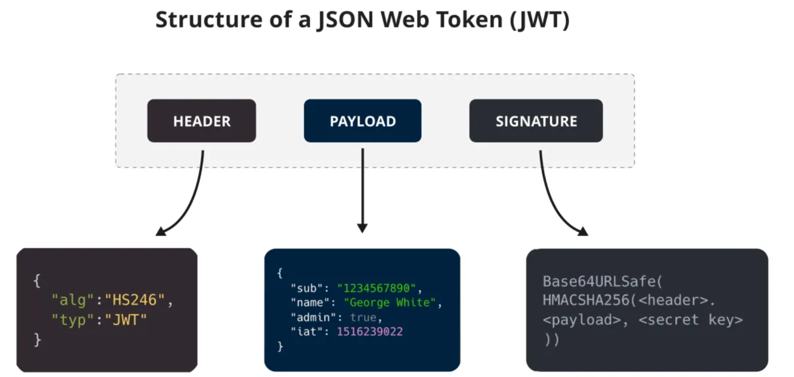

- **签发（登录时）**：`签名 = 加密算法(Header + Payload, 密钥)`最终JWT = `Base64(Header).Base64(Payload).Base64(签名)`
- **验证（每次请求时）**：服务器收到JWT后：用点（`.`）分割字符串，得到前三部分。使用相同的**密钥**和**算法**，对收到的 `Header.Payload`部分进行签名计算，生成一个新的签名。将新生成的签名与JWT自带的第三部分（签名）进行比对。**如果完全一致**：说明Payload内容在传输过程中**没有被篡改**，且签发者确实是拥有密钥的合法服务器。**如果不一致**：说明这封介绍信是伪造的或被修改过，立即拒绝请求。

**因为签名无法伪造，所以Payload里的用户信息是可信的。**

由于JWT令牌是自包含的，服务器可以独立地对令牌进行验证，而不需要依赖其他服务器或共享存储。这使得集群中的每个服务器都可以独立处理请求，提高了系统的可伸缩性和容错性.

##### jwt过期处理

JWT 一旦过期，用户就必须重新认证（比如重新登录），这会带来很差的用户体验。因此，**续签（Refresh）** 机制是生产环境中使用 JWT 必须配套的核心策略。

**方案一：双 Token 机制**

1. **Access Token (访问令牌)**：**用途**：用于访问受保护的业务接口（如获取用户数据、下单）。**特点**：**有效期很短**，例如 **15分钟、1小时**。即使泄露，危害时间也很短。
2. **Refresh Token (刷新令牌)**：**用途**：**专门用来获取新的 Access Token**。**特点**：**有效期很长**，例如 **7天、30天、甚至更长**。它被安全地存储（如 `HttpOnly`Cookie 或安全的移动端存储），**几乎不参与日常业务请求**，因此泄露风险极低。

服务器端对 Refresh Token 的管理

> Refresh Token 绝不能是无状态的。服务器需要一个存储（如数据库或 Redis）来管理它们，实现以下功能：
>
> - **存储关联**：将 Refresh Token 与用户ID、设备信息绑定并存储。
> - **作废机制**：用户**主动退出**时，立即从存储中删除对应的 Refresh Token。用户**修改密码**时，作废该用户的所有 Refresh Token。提供**“吊销所有设备”** 的功能。
> - **一次性使用**（可选但更安全）：每个 Refresh Token 只能使用一次，用后即焚。服务器在颁发新 Token 后，会立即作废旧的 Refresh Token，并可能同时颁发一个新的 Refresh Token（称为 **Rotating Refresh Tokens**）。
>
> **优点**：安全性极高，是业界最佳实践。
>
> **缺点**：需要服务器端有状态的存储，增加了复杂度。

**方案二：单 Token 滑动过期（简单但不安全）**

- **做法**：每次使用有效的 Access Token 访问接口时，服务器都重新生成一个新的 Access Token 并返回给客户端，同时重置过期时间。
- **优点**：实现简单，服务器可以完全无状态。
- **缺点**：**安全性差**：Token 被频繁使用和传输，泄露风险高。一旦泄露，攻击者可以一直用它续命。**并发问题**：客户端需要妥善处理并发请求下的 Token 更新问题。
- **结论**：**不推荐用于生产环境**，仅适用于对安全性要求不高的内部系统。

**方案三：最佳实践**

1. **颁发两个 Token**：短效的 `access_token`和长效的 `refresh_token`。
2. **安全存储**：将 `refresh_token`通过 `HttpOnly; Secure; SameSite=Strict`Cookie 传给浏览器，或由移动端安全地存储在密钥库（Keychain/Keystore）中。
3. **服务器管理**：在数据库或 Redis 中存储 `refresh_token`及其关联信息，并实现作废功能。
4. **前端配合**：实现的**自动拦截逻辑**，在 Access Token 过期时自动调用 `/auth/refresh`接口（用 Refresh Token）换取新的 Access Token，从而实现用户无感知的“静默刷新”。

> 1. **拦截请求**：在请求发起前，检查当前 Access Token 是否**即将过期**（例如在5分钟内过期）。如果是，则先暂停请求，自动调用刷新接口获取新 Token，然后再用新 Token 重发请求。
> 2. **拦截响应**：如果请求返回 `401`，则自动调用刷新接口，获取新 Token 后，**重试刚才失败的请求**。

##### jwt的缺点

JWT 一旦派发出去，在失效之前都是有效的，没办法即使撤销JWT。 要解决这个问题的话，得在业务层增加判断逻辑，比如增加**黑名单机制。**使用内存数据库比如 Redis 维护一个黑名单，如果想让某个 JWT 失效的话就直接将这个 JWT 加入到 黑名单 即可。然后，每次使用 JWT 进行请求的话都会先判断这个 JWT 是否存在于黑名单中。

##### 客户端如何管理jwt

jwt流程如下

1. **签发**：**客户端**向**认证服务器**申请“身份证”。
2. **颁发**：**认证服务器**验证身份后，签发“身份证”（JWT）给**客户端**。
3. **出示**：**客户端**拿着“身份证”（JWT）去**资源服务器**“办事”（访问API）。
4. **验证**：**资源服务器**自己“验钞”（验证JWT签名），不打电话回发证机关查询（无状态）。
5. **服务**：验证通过后，**资源服务器**为你办事。

这种设计的精妙之处在于**解耦**：认证服务器只管发证，资源服务器只管验证，两者互不依赖，使得系统非常容易扩展。

客户端收到服务器返回的 JWT，可以储存在 Local Storage 里面，也可以储存在Cookie里面，还可以存储在Session Storage里面。

下面将说明存在上述各个地方的优劣势：

 Local Storage（本地存储） 

> 优点：Local Storage 提供了较大的存储空间（一般为5MB），且不会随着HTTP请求一起发送到服务器，因此不会出现在HTTP缓存或日志中。 
>
> 缺点：存在XSS（跨站脚本攻击）的风险，恶意脚本可以通过JavaScript访问到存储在Local Storage中的JWT，从而盗取用户凭证。 

Session Storage（会话存储） 

> 优点：与Local Storage类似，但仅限于当前浏览器窗口或标签页，当窗口关闭后数据会被清除，这在一定程度上减少了数据泄露的风险。 
>
> 缺点：用户体验可能受影响，因为刷新页面或在新标签页打开相同应用时需要重新认证。 

Cookie 

> 优点：可以设置HttpOnly标志来防止通过JavaScript访问，减少XSS攻击的风险；可以利用Secure标志确保仅通过HTTPS发送，增加安全性。 
>
> 缺点：大小限制较小（通常4KB），并且每次HTTP请求都会携带Cookie，可能影响性能；设置不当可能会受到CSRF（跨站请求伪造）攻击。


### 设计模式

#### 六大设计原则

1.单一职责原则（SRP）

> 一个类应该只负责一项职责

2.开闭原则（OCP）

> 软件实体应该**对扩展开放，对修改关闭**。

3.里氏替换原则（LSP）

> 子类对象必须可以替换父类对象，程序功能不受影响。

4.依赖倒置原则（DIP）

> 要**依赖于抽象（接口）而不是具体实现**。

5. 接口隔离原则（ISP）

> 不要强迫客户端依赖它**不使用的方法**。

6. 迪米特法则（LoD）= 最少知道原则

> 一个对象应该**尽量少了解其他对象的内部细节**。

[设计模式目录：22种设计模式](https://refactoringguru.cn/design-patterns/catalog)

#### 创建型模式

这类模式提供创建对象的机制， 能够提升已有代码的灵活性和可复用性。

##### 单例模式

- 保证一个类只有一个实例
- 提供一个访问该实例的全局节点。

> 1. 在类中添加一个私有静态成员变量用于保存单例实例。
> 2. 声明一个公有静态构建方法用于获取单例实例。
> 3. 在静态方法中实现"延迟初始化"。 该方法会在首次被调用时创建一个新对象， 并将其存储在静态成员变量中。 此后该方法每次被调用时都返回该实例。
> 4. 将类的构造函数设为私有。 类的静态方法仍能调用构造函数， 但是其他对象不能调用。
> 5. 检查客户端代码， 将对单例的构造函数的调用替换为对其静态构建方法的调用。

两种类型：饿汉式和懒汉式

> 饿汉式（Eager Singleton）
>
> - 在类加载时就创建好单例对象。
> - 简单、线程安全，但**不管用不用都会加载**。

> 懒汉式（Lazy Singleton）
>
> - 在第一次需要用到时才创建实例，**延迟加载**。
> - 为了线程安全，需要加锁。
> - ✅ 使用 `sync.Once` 是 Go 中推荐的懒汉式单例实现方式，既**线程安全**又**性能好**。

##### **原型模式**

通过拷贝已有对象来创建新对象，而不是通过 new 来重新实例化。

当对象的创建成本很高（比如初始化复杂、需要网络/数据库资源、或包含大结构体时），
 我们可以先创建一个“原型对象”， 之后通过 **克隆（Clone）** 的方式快速生成新对象。

> ```go
> // Prototype接口：定义克隆行为
> type Prototype interface {
>     Clone() Prototype
> }
> ```
>
> 在 Go 中没有“类”，我们通常通过：
>
> - 定义一个接口 `Prototype`
> - 定义一个结构体（原型对象）
> - 实现一个 `Clone()` 方法
>
> ```go
> // 游戏角色
> type GameCharacter struct {
>     Name   string
>     Level  int
>     Skills []string
> }
> 
> // 实现Clone方法
> func (g *GameCharacter) Clone() Prototype {
>     // 注意：要深拷贝切片，否则多个对象会共享底层数组
>     cloneSkills := make([]string, len(g.Skills))
>     copy(cloneSkills, g.Skills)
> 
>     return &GameCharacter{
>         Name:   g.Name,
>         Level:  g.Level,
>         Skills: cloneSkills,
>     }
> }
> ```

##### 工厂模式

| 模式         | 特点                           | 适用场景                           |
| ------------ | ------------------------------ | ---------------------------------- |
| **简单工厂** | 只有一个工厂，靠传参判断造什么 | 创建单一类型对象                   |
| **工厂方法** | 每个产品一个工厂类             | 扩展单个产品族方便                 |
| **抽象工厂** | 一个工厂生产多个相关产品       | 一系列产品要同时创建（如品牌套装） |

**简单工厂模式**

> - 只有一个工厂类，根据传入的参数返回不同的产品实例。
> - 产品通常属于同一个抽象类或接口。
> - 缺点：当产品种类多时，工厂类变得庞大，违反开闭原则。

**工厂方法模式**

> - 为每一个产品定义一个工厂类。每个具体工厂类负责创建一种产品。
>
> - 更符合 开闭原则（对扩展开放，对修改封闭）。

**抽象工厂模式**

> - 抽象工厂模式通常有一个抽象工厂接口，以及多个具体工厂实现类，每个实现类创建一个产品族。

#### 结构型模式

这类模式介绍如何将对象和类组装成较大的结构， 并同时保持结构的灵活和高效。

##### 适配器模式

用于将一个类的接口转换成客户端期望的另一个接口。

> ```go
> type Player interface {
> 	PlayMusic()
> }
> ```
>
> 系统中原本使用的播放器是 `Mp3Player`，系统只认识 `Player` 接口。但现在你需要接入一个第三方播放器 `AdvancedPlayer`，它的接口不同：
>
> ```go
> type Mp3Player struct{}
> 
> func (m *Mp3Player) PlayMusic() {
> 	fmt.Println("Playing MP3 music...")
> }
> ```
>
> ```go
> type AdvancedPlayer struct{}
> 
> func (a *AdvancedPlayer) PlayWav() {
> 	fmt.Println("Playing WAV music...")
> }
> ```
>
> 由于 `AdvancedPlayer` 的方法名和接口不同（`PlayWav` vs `PlayMusic`），无法直接使用。
>  于是我们写一个 **适配器** 来转换接口。
>
> ```go
> // 适配器 —— 实现目标接口，同时内部持有被适配对象
> type AdvancedPlayerAdapter struct {
> 	advancedPlayer *AdvancedPlayer
> }
> func (a *AdvancedPlayerAdapter) PlayMusic() {
> 	a.advancedPlayer.PlayWav() // 转换调用
> }
> ```

##### 装饰器模式

在不修改原有类的情况下，动态地给对象添加功能。

- 动态扩展对象功能（比如日志、权限、缓存、加密等）

- 不希望使用继承来增加行为（更灵活）

> Gin 的中间件（Middleware）就是这样实现的：
>
> - 每个中间件都是一个“函数包装器”；
> - 每一层中间件都会**包装下一层的执行逻辑**；
> - 最内层才是用户定义的 `handler`。
>
> ```go
> // HandlerFunc 定义请求处理函数
> type HandlerFunc func(ctx *Context)
> 
> // Context 模拟 gin.Context
> type Context struct {
> 	handlers []HandlerFunc
> 	index    int
> }
> 
> // Next 执行下一个中间件
> func (c *Context) Next() {
> 	c.index++
> 	if c.index < len(c.handlers) {
> 		c.handlers[c.index](c)
> 	}
> }
> ```
>
> ```go
> // Engine 路由引擎
> type Engine struct {
> 	middlewares []HandlerFunc
> }
> 
> // Use 注册中间件
> func (e *Engine) Use(mw HandlerFunc) {
> 	e.middlewares = append(e.middlewares, mw)
> }
> 
> // Handle 模拟执行请求
> func (e *Engine) Handle(final HandlerFunc) {
> 	ctx := &Context{handlers: append(e.middlewares, final), index: -1}
> 	ctx.Next()
> }
> ```
>
> ```go
> r := &Engine{}
> r.Use(Logger())
> r.Use(Auth())
> r.Handle(func(ctx *Context) {
> 	fmt.Println("👉 Handle main request")
> })
> ```
>
> 每一个中间件（`Decorator`）都：
>
> - **持有下一个 handler 的引用**；
> - **调用前后加入逻辑**；
> - 最终由最外层包装最内层（像洋葱结构）。

##### 代理模式

为其他对象提供一种**控制访问**的方式。
代理对象在客户端与目标对象之间起到中介作用，用来控制、增强或延迟对目标对象的访问。

#### 行为模式

##### 责任链模式

允许你将请求沿着处理者链进行发送。 收到请求后， 每个处理者均可对请求进行处理， 或将其传递给链上的下个处理者。

它把请求的发送者与处理者解耦，形成“流水线式”处理结构。

##### 命令模式

将一个请求封装成一个对象，从而使你可用不同的请求对客户进行参数化、队列请求、日志请求，以及支持可撤销操作。

把“要做的事”封装成对象，让请求的发出者和执行者解耦。

```go
// Command 接口
type Command interface {
	Execute()
}

// 定义接收者（Receiver）
type Light struct{}
func (l *Light) On() {
	fmt.Println("💡 灯已打开")
}

// 定义具体命令（ConcreteCommand） 
type LightOnCommand struct {
	light *Light
}
func (c *LightOnCommand) Execute() {
	c.light.On()
}

// 定义调用者（Invoker）
type RemoteControl struct {
	command Command
}
func (r *RemoteControl) PressButton() {
	r.command.Execute()
}
```

```go
// 客户端使用
func main() {
	light := &Light{}
	// 创建命令
	onCommand := &LightOnCommand{light: light}
	remote := &RemoteControl{}
	// 开灯
	remote.SetCommand(onCommand)
	remote.PressButton()
}
```

命令模式的核心就是“请求对象化”，把执行者和调用者解耦，方便任务调度和增强功能。

##### 观察者模式

允许你定义一种订阅机制， 可在对象事件发生时通知多个 “观察” 该对象的其他对象。

**作用**：对象状态变化时，通知所有观察者。

- 观察者模式 vs. 发布-订阅模式的区别？

  > **观察者模式是一种行为设计模式**，它定义了一种一对多的依赖关系，让多个观察者对象同时监听某一个主题对象。当主题对象状态发生变化时，会通知所有依赖它的对象。
  >
  > **发布/订阅模式是一种事件处理模式，**它允许发布者将消息发布给订阅者，订阅者可以接收到这些消息。
  >
  > 1.触发方式和通信方式不同。
  >
  > - 在**观察者**模式中，当主题对象状态发生变化时，它会**主动通知所有观察者**。
  > - 而在**发布/订阅模式**中，发布者向频道发送一个消息之后，**不需要关心消费者何时去订阅这个消息，可以立即返回**。
  > - 另外，观察者模式通常适用于单个应用内部的事件传递，而发布/订阅模式则更适合跨应用的消息传递，例如消息中间件。
  >
  > 2.处理消息的顺序不同
  >
  > - 在观察者模式中，主题对象通常会按照一定的顺序通知观察者，例如先通知最早注册的观察者，或者按照某种特定的顺序通知。
  > - 而在**发布/订阅模式中，消息的传递是无序的**，订阅者收到消息的顺序可能与发布者发送消息的顺序不同。
  >
  > 在实现上，**观察者模式是同步的**，事件触发后主题直接调用观察者方法；而**发布/订阅模式是异步的**，通常使用消息队列。

#####  **模板方法模式**

在一个方法中定义一个算法的骨架，而将某些步骤延迟到子类实现。模板方法使得子类可以不改变算法整体结构的情况下重新定义某些特定步骤。**“把不变的部分放在父类，变化的部分让子类实现。”**

##### 策略模式 

策略模式定义了 算法家族 , 分别 封装起来 , 让它们之间 , 可以 相互替换 , 此模式 让 算法的变化 不会影响到 使用算法的用户 ;

将 不同的算法 , 封装到 不同的类 中 , 让它们之间可以 相互替换 ,使用算法的用户 即 应用层 , 感知不到 算法已经被替换了 ;


## 简历投递

实习面试投递 ： golang

3/2/2025： 华为通用软开，~~小米SRE（简历挂）~~，作业帮 ，BiliBili

3/3: ~~oppo(小程序，笔试差)~~ ，网易游戏互娱

3/4：~~饿了么(简历挂)~~，~~腾讯(一面挂)~~

3/5： ~~PDD（笔试差，一面挂）~~，~~快手（小程序，简历挂）~~，~~美团(笔试差，等复活赛)~~，~~京东~~，北森

3/6: 好未来

3/10 ~~小红书(简历挂)~~，~~快手日常实习(简历挂)~~ ,~~鹰角网络（简历挂）~~

3/12 米哈游，帆软,云智（腾讯），腾讯音乐

3/13 ~~360（简历挂）~~

3/14 莉莉丝，滴滴，~~寒武纪（简历挂）~~,~~巨人网络(仅简历)~~

3/15 众安，~~游酷盛世~~

3/17 ~~小鹅通（一面过）~~，联想，顺丰,~~吉比特~~

3/18 百度，~~游酷盛世笔试~~

3月20~~腾讯PCG应用架构方向 一面挂~~ , ~~微派网络 一面挂~~

~~3月22美团复活赛~~

3/24~~巨人网络一面~~，~~小鹅通二面（挂）~~，美的，~~虾皮日常~~

3/25 ~~腾讯云一面~~

3/26 理想汽车，~~万兴科技~~

4/1 SHEIN

4/2 ~~豹亮科技一面挂~~

4/7 ~~优特电力一面挂~~

4/11华子笔试

~~4/12 字节二面~~

4/15 360

4/16 云智笔试(a2.5)

~~4/19 网易笔试挂~~

4/19 得物笔试

4/23 云智一面过 ，腾讯浏览器后台一面过

4/24 游酷盛世测试一面过

4/25 华为技术+主管过


## 笔试


### 标准化IO问题

#### fmt包实现

 **1.每行数字数量不固定，但知道数量,有结束标志** 

> 输入描述:
> 输入数据包括多组。
> 每组数据一行,每行的第一个整数为整数的个数n(1 <= n <= 100), n为0的时候结束输入。
> 接下来n个正整数,即需要求和的每个正整数。
>
> 输出描述:
> 每组数据输出求和的结果
>
> 输入例子1:
> 4 1 2 3 4
> 5 1 2 3 4 5
> 0
> 输出例子1:
> 10
> 1

```go
package main

import (
	"fmt"
)

func main() {
	var t int
	for {
        var sum int
        
		fmt.Scan(&t)
		if t == 0 {
			break
		} else {
			a := make([]int, t)
			for i := 0; i < t; i++ {
				fmt.Scan(&a[i])
			}
			for i := 0; i < t; i++ {
				sum += a[i]
			}
		}
		fmt.Println(sum)
	}
}
```

**2.每行数字数量不固定，但知道数量,无结束标志** 

使用fmt.Scan的第一个返回值，若是0表示没有读取到数据，只有/EOF指示符

```go
func main() {
	var t int
	for {
        var sum int
        n,_ := fmt.Scan(&t)
		if n == 0 {
			break
		} else {
			a := make([]int, t)
			for i := 0; i < t; i++ {
				fmt.Scan(&a[i])
			}
			for i := 0; i < t; i++ {
				sum += a[i]
			}
		}
		fmt.Println(sum)
	}
}
```

#### bufio+strings 整行读取

**每行数字数量不固定，且不知道数量**

> 输入描述:
> 输入数据有多组, 每行表示一组输入数据。
>
> 每行不定有n个整数，空格隔开。(1 <= n <= 100)。
>
> 输出描述:
> 每组数据输出求和的结果
>
> 输入例子1:
> 1 2 3
> 4 5
> 0 0 0 0 0
>
> 输出例子1:
> 6
> 9
> 0

```go
func main(){
    inputs := bufio.NewScanner(os.Stdin)
    for inputs.Scan(){
        data := strings.Split(inputs.Text()," ") //以空格分隔,得到字符串数组
        var sum int
        for i := range data{
            val, _ := strconv.Atoi(data[i])
        	sum += val
        }
        
        fmt.Println(sum)
    }
}
```

```go
//strings.Join(input," ") // 将input字符串数组连接成字符串，间隔个空格


//输入为[1,2,3,4]
scanner := bufio.NewScanner(os.Stdin)
scanner.Scan()
input := scanner.Text()
 
// 去掉方括号
input = strings.Trim(input, "[]")
// 将字符串拆分为切片
strArray := strings.Split(input, ",")
```


### 背包问题


#### 0-1 背包


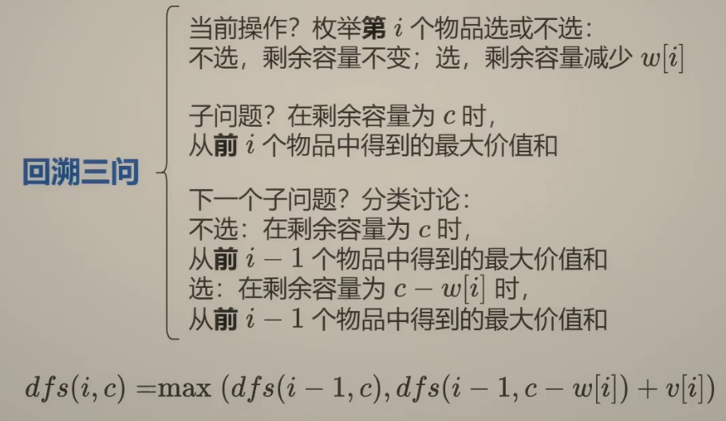


```go
func lengthOfLongestSubsequence(nums []int, target int) int {
    // dp[i][c] = max(dp[i-1][c-nums[i]]+1,dp[i-1][c])
    // 优化空间
    dp := make([]int,target+1)
    for i:= range dp{
        dp[i] = -1
    }
    dp[0] = 0
    for _,n := range nums{
        for t:= target;t>=n;t--{ 
            if dp[t-n] != -1 { // 只有 dp[t-n] 有效才更新
                dp[t] = max(dp[t], dp[t-n]+1)
            }
        }
    }
    return dp[target]
}
```


#### 完全背包

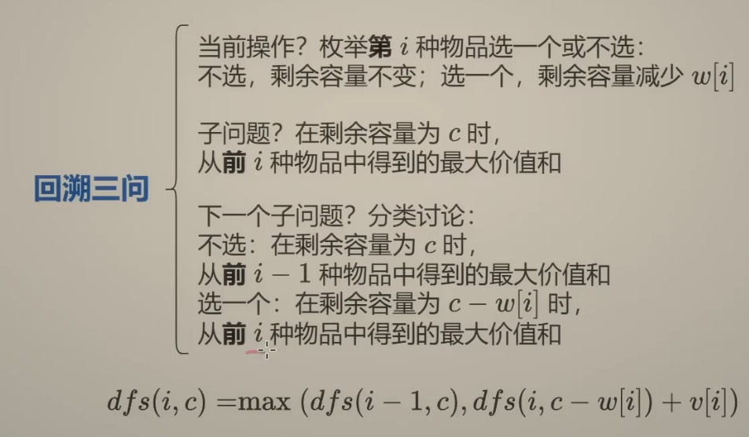

### 协程交替打印

#### 题目 1：两个协程交替打印数字

**要求**：

- 启动两个协程，分别打印奇数和偶数。
- 打印范围为 1 到 100。
- 输出结果应为：1, 2, 3, 4, 5, ..., 100。

**提示**：

- 使用通道或 `sync.WaitGroup` 进行同步。
- 确保奇数和偶数交替打印。

```go
func main() {
	wg := sync.WaitGroup{}
	wg.Add(2)

	evenCh := make(chan int)
	oddCh := make(chan int)
	Max := 100
	n := 1
	go func() {
		defer wg.Done()
		for {
			<-oddCh
			if n > Max {
				close(evenCh)
				return
			}
			fmt.Println(n)
			n++
			evenCh <- n + 1
		}

	}()

	go func() {
		defer wg.Done()
		for {
			<-evenCh
			if n > Max {
				close(oddCh)
				return
			}
			fmt.Println(n)
			n++
			oddCh <- n + 1
		}
	}()

	oddCh <- n

	wg.Wait()

}


```

#### 题目 2：三个协程交替打印字母

**要求**：

- 启动三个协程，分别打印字母 "A"、"B"、"C"。
- 打印 10 次，顺序为 "A", "B", "C", "A", "B", "C", ..., 共 10 轮。
- 输出结果应为：A, B, C, A, B, C, ..., A, B, C。

**提示**：

- 使用通道或 `sync.WaitGroup` 进行同步。
- 确保三个协程按顺序交替打印。

```go
func main() {
	n := 0 // 打印10次
	var wg sync.WaitGroup
	wg.Add(3)

	// 创建三个信号通道
	chA := make(chan struct{}) // 初始让 A 先执行
	chB := make(chan struct{})
	chC := make(chan struct{})

	printFunc := func(ch <-chan struct{}, nextCh chan<- struct{}, letter string) {
		defer wg.Done()
		for {
			<-ch
			if n >= 10 {
				close(nextCh)
				return
			}
			n++
			fmt.Println(letter)
			nextCh <- struct{}{}
		}
	}

	go printFunc(chA, chB, "A")
	go printFunc(chB, chC, "B")
	go printFunc(chC, chA, "C")

	// 先触发 A
	chA <- struct{}{}

	// 等待所有协程完成
	wg.Wait()
}
```


### 官方算法包

#### 排序 sort

> Sort 按 Less 方法确定的升序对数据进行排序。
> 它调用一次 data.Len 来确定 n，并调用 O(n*log(n)) 次 data.Less 和 data.Swap。排序不能保证稳定。

提供了三种内置的基本类型排序`int`,`float64`,`string(字典序)`。以及接口`sort.Interface`。三种基本类型都是调用了提供的统一方法`Slice`或`SliceStable`

```go
type Interface interface {
	// Len is the number of elements in the collection.
	Len() int
    // Less reports whether the element with index i
	Less(i, j int) bool
	// Swap swaps the elements with indexes i and j.
	Swap(i, j int)
}
```

对于Int类型，对外提供方法`sort.Ints(arr)`,arr是int类型的切片，将会原地进行升序排序。类似的，`Float64s`和`Strings`分别对float64和string类型的切片进行升序排序。

此外，如果需要**稳定排序**，使用sort.Stable(sort.interface){}

```go
func main() {
	arr := []int{5, 3, 4, 2, 3, 1}
	// 使用 sort.Stable 进行稳定排序
	sort.Stable(sort.IntSlice(arr))
	fmt.Println(arr) // [1 2 3 3 4 5]
}
```

但是对于自定义的数据结构，如

```go
type person struct {
	name string
	age int
	money float64
}
```

如果希望使用age优先升序排序再根据money次排序(降序)。需要自己实现。

```go
sort.Slice(p, func less(i, j int) bool {
    if p[i].age == p[j].age{ 
        return p[i].money > p[j].money // 降序
    }
	return p[i].age <= p[j].age// 升序
}
```

**二分查找**

Go 语言中的 `sort` 包提供了以下几种查找的方法：

- SearchInts(slice ,val)int
- SearchFloats(slice, val)int
- SearchStrings(slice, val)int
- Searh(count,func(int) bool)

`SearchInts()` 函数是 sort 包实现的二分下界查找，用于在排序的整数切片中搜索大于等于给定元素 `x`的最小值索引。

> 注意：传入的数组需要是有序的！

```go
// 对于需要自定义搜索规则的数据,使用sort.Search
// 该函数使用二分查找的方法，会从[0, n)中取出一个值index，index为[0, n)中最小的使函数f(index)为True的值，并且f(index+1)也为True。
// 如果无法找到该index值，则该方法为返回n
// index := sort.Search(n int,f func(i int) bool) int
func main() {
    a := []int{1,2,3,4,5}
    d := sort.Search(len(a), func(i int) bool { return a[i]>=3})
    fmt.Println(d)
}
```

**sort使用的接口是许多包的基础**，因此，官方也实现了Int，float64，string类型的sort.inferface接口实现。

```go
// IntSlice attaches the methods of Interface to []int, sorting in increasing order.
type IntSlice []int
func (x IntSlice) Len() int           { return len(x) }
func (x IntSlice) Less(i, j int) bool { return x[i] < x[j] }
func (x IntSlice) Swap(i, j int)      { x[i], x[j] = x[j], x[i] }

// Float64Slice implements Interface for a []float64, sorting in increasing order,
// with not-a-number (NaN) values ordered before other values.
type Float64Slice []float64
func (x Float64Slice) Len() int { return len(x) }
func (x Float64Slice) Less(i, j int) bool { return x[i] < x[j] || (isNaN(x[i]) && !isNaN(x[j])) }
func (x Float64Slice) Swap(i, j int)      { x[i], x[j] = x[j], x[i] }

// StringSlice attaches the methods of Interface to []string, sorting in increasing order.
type StringSlice []string
func (x StringSlice) Len() int           { return len(x) }
func (x StringSlice) Less(i, j int) bool { return x[i] < x[j] }
func (x StringSlice) Swap(i, j int)      { x[i], x[j] = x[j], x[i] }
```

#### 优先级队列 container/heap

```go
// 接口
type Interface interface {
    sort.Interface // 排序的接口：Len(),Less(),Swap()
	Push(x any) // add x as element Len()
	Pop() any   // remove and return element Len() - 1.
}

// 定义 Heap 结构体，嵌套 sort.IntSlice
type Heap struct {
	sort.IntSlice
}

func (h *Heap) Push(x interface{}) {
	h.IntSlice = append(h.IntSlice, x.(int))
}

func (h *Heap) Pop() interface{} {
	old := h.IntSlice
	n := len(old)
	x := old[n-1]
	h.IntSlice = old[0 : n-1]
	return x
}
```

```go
func main() {
	h := &Heap{}
	heap.Init(h) // 初始化最小堆
	fmt.Println("初始化:", h.IntSlice)

	// 插入元素
	heap.Push(h, 8)
	heap.Push(h, 4)
	heap.Push(h, 4)
	heap.Push(h, 9)
	heap.Push(h, 10)
	heap.Push(h, 3)
	fmt.Println("插入后:", h.IntSlice)

	// 弹出最小元素，直到堆为空
	fmt.Print("弹出元素顺序: ")
	for h.Len() > 0 {
		fmt.Printf("%d ", heap.Pop(h))
	}
}
```

### 面试

您面试官您好，我是来自重庆邮电大学的硕士研究生，专业是信息与通信工程。主攻后端开发方向，熟练掌握Golang语言及其相关生态。我理解后端开发的价值在于用技术解决真实的业务问题，因此在校期间我选择开发了**高并发外卖系统**和**实时通讯系统**这两个与实际业务强关联的项目

为了解决中小型餐饮商户缺少数字化管理工具的问题，我们设计了一个支持多角色协同的外卖平台。系统需要同时服务**消费者（C端APP）**、**商家员工（B端管理后台）**和**平台运营方（管理后台）**三类角色。业务场景包括高峰期每秒300+的并发点单、商户动态更新菜品库存、骑手状态实时同步等。主要的挑战来自于高并发下的查询时延过高，商户端频繁更新带来的数据一致性挑战，订单状态需要实时同步给消费者/买家/骑手。在项目中，采用了二级缓存架构redis+mysql，通过事务来保证数据库的一致性，以及通过websocket长连接实现及时通知。

第二个项目是一个轻量级IM系统，为用户提供在线的聊天平台，支持用户在聊天室内群发消息，以及对用户私聊，业务场景包括高并发下的用户登录登出与房间群消息的锁竞争，自定义底层消息传递协议：websocket/tcp，消息的发送接受有序性。主要的难点在于rpc服务架构下的消息可靠传输，Redis消息队列+本地缓存实现的异步消息传输、 活跃用户的心跳判定以及tcp下的粘包问题解决。

通过两个项目的开发，我收悉了Redis、MySQL、Gin等技术，对分布式锁、接口幂等性、缓存策略、数据库开发等有一定的实际项目经验。希望能应聘贵公司的后端开发岗位。


#### hr面

##### 自我介绍

您好，我是来自重庆邮电大学的26级硕士研究生，专业是信息与通信工程，主攻方向是后端开发。我的核心技术栈是 Golang + Gin + MySQL + Redis，同时也具备一定的分布式系统和高并发场景下的实战经验。

我比较注重动手实践，在校期间主导了两个完整项目。在外卖系统中，我负责整体系统架构设计，解决了高并发下订单延迟、缓存一致性这些实际业务痛点，也做了 Redis、MySQL、WebSocket 等技术方案的组合优化。整个项目锻炼了我系统设计的能力和对业务理解的能力。

实时通讯系统是一个轻量级的 IM 项目，支持聊天室和私聊功能，在这个过程中我深入理解了 TCP 通讯、消息队列、粘包处理和消息可靠性这些方面的问题，也对服务之间的 RPC 架构和消息流程做了很多尝试和优化。

此外，在系统工程能力方面，两个项目我都从系统设计、编码实现到部署上线完整参与，具备使用 Docker、Nginx、ECS 服务器进行环境搭建的经验，也熟悉布隆过滤器优化缓存穿透、分布式锁、幂等控制、日志系统等后端核心机制。

最后，再学习能力方面。在读期间获得了国家奖学金、蓝桥杯、计算机能力挑战赛奖项等，也参与了一个光通信方向的科研项目，产出的会议论文已经被国际光学顶会OFC录用，还有一篇一区top期刊论文在投。

以上是我的自我介绍，我很希望能够加入腾讯实习，参与真实的后端系统建设，从更大的视角理解业务和架构挑战，也期待能通过实习获得成长，未来有机会长期发展。

**反问环节**

> 请问这个实习岗位的 **base地点** 是在哪里？比如是深圳总部还是北京的分支机构？它是日常实习还是暑期实习？是否可以提供转正机会？工作时间是怎么样的？
>
> 团队目前正在推进的 **核心业务目标** 是什么？实习生会参与哪些具体项目？工作流程大概是怎么样的？
>
> 实习期间的考核标准大概是注重哪些方面，后续转正或留用的机制是什么呢？比如代码贡献量、项目完成度，还是学习速度？团队是否会为实习生分配mentor进行指导？
>
> 请问本次面试过后有什么其他的安排吗 ，结果大概什么时候能出呢？

##### 常见问题

**为什么选择后端开发？**

> 我选择后端开发，主要是因为我对软件开发比较感兴趣，特别是系统架构设计和技术解决实际业务问题这几个方面。后端开发不像前端那样直接面对用户，但它承担了整个系统的稳定性和核心逻辑的支撑，我非常喜欢这种“在幕后创造价值”的感觉，也希望能不断打磨自己的工程能力，未来能成长为有全局视野的后端工程师。

**为什么选择我们公司？**

> - 看你**对公司了解多少**
>
> - 是否**真心想来/稳定性如何**
> - 是否认同公司价值观/技术氛围
>
> 我非常向往腾讯这样有技术深度和业务体量的平台，一方面你们在后端架构、分布式服务、高并发系统这些方向有很多成熟实践和开源积累，对我来说是一个非常好的学习平台；另一方面，腾讯很多产品我自己也在使用，比如微信、腾讯云、QQ浏览器等，对它们背后的技术架构也非常感兴趣。
>
> 我也看到腾讯在技术团队建设、工程文化实习生培养方面一直都很重视，我希望能在这样一支高标准的团队中实习，快速提升自己的能力，也为你们的业务贡献自己的力量。

**描述自己的三个关键词**

> **踏实**：我在项目中会从0到1搭架构，不怕调 bug，不怕查资料，喜欢深入理解系统细节；
>
> **学习力强**：我平时会主动刷题、研究新技术，也在短时间内掌握了 Go 并用它完成了多个实战项目；
>
> **责任感**：项目中我主导的模块会负责到底，出问题也愿意第一时间定位修复，不推诿、不逃避。

**优点和缺点**

> 我觉得我的优点是**踏实、自驱力强、技术学习上手快**。
>
> 像我在做即时通讯系统项目的时候，底层通信协议、消息顺序控制、RPC 架构都是自己查资料一点点搭建出来的，过程中虽然遇到很多细节 bug，但我会坚持把它跑通，最后也实现了完整功能。这种持续学习和深入思考的过程让我很有成就感，也比较享受。
>
> 我的缺点是有时候会在技术细节上投入时间太多，导致前期节奏略慢。
>
> 比如之前写缓存策略时，一开始花了很多时间在优化 Redis key 结构和锁粒度，后来意识到应该先完成业务主流程、后续再做优化。现在我会更注意把控项目的节奏，优先实现完整功能，再逐步优化。

**职业规划是怎么样的**

> - 1-3年：开始工作的前两三年是提升技术最重要的成长期，这段时间里，尽量多做事多锻炼，不要怕苦怕累。在完成工作的同时还要花时间去学习了解其他技术，尽量让自己知识面广一点，可以不求甚解，但是要知道个大概。这样做的目的，一是可以在下次碰到要用时不会手忙脚乱，二是在别人谈及时不会云里雾里。
> - 3-5年：掌握软件开发各个阶段的基本技能，如市场分析，可行性分析，需求分析，结构设计，软件测试等。争取做一名出色的工程师。
> - 5-10年：学习管理方面的相关知识，做技术的同时学习管理型方面
>

**有没有其他的面试流程**

> 目前正在推进面试的有两家，已经offer的有一家游戏公司，但是我会更加倾向于腾讯这边的岗位，如果能够顺利通过面试，我会优先接受腾讯的offer

**项目中最大的困难是什么**

> docker部署环节，mysql容器和golang服务器所在的容器时间不同步，有一个是上海时区，另一个是美国时区，出现了很奇怪的一种现象，用户订单只要一下单就会立刻过期，一开始我们认为可能是订单的状态机的设计出现了问题，于是通过日志，链路断点进行debug，发现状态码和rpc调用环节都没有出现问题，最后分析到具体的代码片段时才发现是时区不同步带来的问题。这个问题可以通过在docker容器的时间文件夹中进行时区的导入，从而实现整体的时间同步。

#### **外卖项目难点**

**1.如何保证Redis缓存与Mysql数据库的一致性**

方案一： 缓存旁路策略（Cache Aside）。

- 读：缓存命中则返回，否则查数据库并回填。

- 写：先更新数据库，再删除缓存

方案二：延迟双删，解决高并发架构下的脏读。

​	写操作后，休眠一段时间再删缓存，避免并发脏读

方案三：最终一致性，通过 Binlog 监听（如 Canal）异步更新缓存

**2.商品超卖问题如何解决？高并发下的资源抢占**

答：在高并发下防止商品超卖，采用了基于 Redis + Lua 脚本的库存预扣机制，结合消息队列异步下单、接口幂等控制，从架构和细节上全面防止库存被超卖。

具体流程是：

1. 系统启动时将商品库存缓存到 Redis。
2. 用户下单时，先通过 Lua 脚本在 Redis 原子扣减库存，确保并发下不会出现超卖。
3. 每个请求绑定唯一 ID，接口幂等性保障防止重复下单。
4. 扣减成功后消息写入 Kafka（或 Channel），由后台 Worker 异步处理订单落库和最终库存变更。
5. 使用支付回调机制完成最终订单确认，否则库存自动回滚。
6. 同时在接口层用 Redis + nginx 限流。

> 最差的方案：悲观锁，只有一个用户可以对库存进行扣减，通过事务进行封装。分布式环境下可以使用redis的setnx，对商品进行加锁，保证只有一个请求能够更新库存。
>
> 并发提高：乐观锁，通过版本号和时间戳来实现，下单时，通过数据库更新操作中判断版本号是否与查询时的一致。如果一致，则更新库存并生成订单；如果不一致，表示商品已经被其他请求操作，需要重试或告知用户库存不足。
>
> 更好的方案：
>
> **库存预扣**：用户下单时，Redis+lua脚本尝试预扣库存，用户完成支付时，正式扣减库存。如果支付失败，则需要在库存中释放预扣的库存（回调）。
>
> **接口幂等性设计**：给每个客户端请求绑定唯一id，并且设置订单状态机。
>
> 使用Nginx对**接口进行限流**
>
> > 缓存预扣：
> >
> > 先查询redis中是否有库存信息，如果没有就去数据库查，这样就可以减少访问数据库的次数。
> >
> > 获取到后把数值填入redis，以商品id为key，数量为value。
> >
> > 还需要设置redis对应这个key的超时时间，以防所有商品库存数据都在redis中。
> >
> > 扣减redis的库存时，最好用lua脚本处理，因为如果剩余1个时，用户买100个，这个时候其实会先把key increase -100就会变负99。
> >
> > 所以用lua脚本先查询数量剩余多少，是否够减100后，再去减100。
>
> 追问：如果在主从架构/集群架构中，怎么办？
>
> **强制库存读取和扣减都走主节点**，确保读写一致。使用 go-redis 客户端时配置只连接主节点，不设置 readonly。

**3.缓存击穿架构下的可靠性设计**

缓存雪崩：通过设计过期时间=固定时间+随机时间来减少大规模的缓存过期导致数据库并发过大

缓存击穿：热点key不设置过期时间，使用分布式锁保证对于一个菜品id只有一个查询操作能够查询mysql。

缓存穿透：设计布隆过滤器，将菜品id，套餐id先加入redis的BF内部，然后在查询时判断逻辑，保证只有数据库中有数据时才会查询，否则直接返回空。**双重检查锁**：在查询缓存时先检查缓存是否为空，若为空再获取锁进行查询。在查询数据库并更新缓存后，释放锁，这样可以避免重复查询数据库。

对于布隆过滤器，还有一些需要注意点，比如在菜品数量很多时，为了保证误判率很低通常会使用很多内存，这时就会造成资源浪费，此外，可能哈希函数映射后会导致数据的分布不均匀，因此，使用多个布隆器进行并联或者串联可以在减少内存消耗的条件下达到指数级别的误判率下降。


**遇到的问题：**

**1.docker部署时，时区不同步。容器之间时区不一样导致订单下单后的状态机无法转移**

在部署外卖系统时我们遇到一个问题：Docker 容器之间的时区不同步，导致订单状态机依赖的时间判断不一致，例如Mysql容器 认为订单已超时，go服务器认为尚未过期，造成状态机无法正确转移。

为了解决这个问题，我在容器镜像中统一设置时区为 `Asia/Shanghai`，通过安装 tzdata 并设置 `/etc/localtime` 和 `/etc/timezone`，同时在 Go 项目中设置 `time.Local = time.LoadLocation("Asia/Shanghai")`，保证程序中的时间处理逻辑和宿主机一致。

此外，我们在业务中尽可能使用 UTC 时间戳进行时间判断，避免使用格式化时间字符串，提升了系统的可移植性与一致性。

**2.Docker 中每个容器的 IP 是 动态分配的，一旦容器重启或服务滚动升级，IP 很可能就变了**

在我们的 Docker 部署中，容器 IP 是动态变化的，所以我们避免在服务中使用写死的 IP 地址进行通信。我们采用了 **Docker 内置 DNS 机制**，通过**容器名或服务名作为地址**进行访问，这样无论容器是否重启或迁移，服务之间都能自动解析到最新 IP。

为了进一步提高服务之间的可用性和隔离性，我们将所有服务加入到 **同一个 Docker 自定义网络中**，通过容器名通信，比如 `redis-server:6379`，保证了通信稳定性和维护方便性。在使用 Docker Compose 时，我们直接通过 `services` 中定义的名称进行通信，也借助 `depends_on` 确保依赖服务先启动。

#### 聊天项目难点

**1.Redis作为消息队列时，如何保证at-least-once语义？在task层消费失败时，如何实现可靠的重试机制？**

我设计了一个基于 Redis 的消息队列系统，采用 Lpush + BRpop 进行生产与消费，配合 ACK 机制、重试队列、心跳检测、WebSocket 状态判断，确保 at-least-once 消息语义。

在此基础上，我使用消息 ID 做去重、延迟重试与死信队列设计，*结合 Prometheus 监控和 trace_id 日志链路*，提高系统可观测性与故障可追溯性。

对于更高级别的需求，我也考虑过 Redis Stream 实现，支持消费组与消息持久化等企业级特性。

> 以下几个方面考虑：消息的可靠传输，消息的持久化以及消息的重消费。
>
> 通过消息队列进行收发消息的逻辑解耦，使用Lpush和BRpop生产和消费，处理成功后删除，若消息传输过后没收到客户端ACK，放入消息重试队列，并且使用一个goroutine进行监听，进行最多三次的重传，并且使用心跳机制作为客户端仍然连接的保证，对于在线聊天室，仅需要负责所有在线用户的收发一致性。此外，通过全局唯一自增的消息id与消息状态机的设计，可以保证消息的在传输过程的可靠。
>
> 对于私聊，失败了直接加入重试队列，对于群发，需要枚举房间内所有的已连接的websocket，对它的chan进行写，如果存在写失败的操作，首先判断用户连接是否存活，然后枚举所有写失败操作进行重试，如果最后发送失败，进入失败消息状态，人工进行核对。

追问：为什么使用redis作为消息队列，而不是kafka和rabbitMQ？

> 当前我是基于 Redis + Lpush/BRpop 自定义了 at-least-once 语义机制，结合 ACK、消息状态机、重试队列等功能实现可靠性，原因如下：
>
> 1. **实时性要求高**：Redis 属于内存数据库，吞吐和响应延迟极低，适合用户消息推送、聊天室等场景；
> 2. **业务复杂度低**：我们不需要持久化回溯、不需要大型数据分析，只需要消息可靠到达即可；
> 3. **组件数量少**：Redis 已作为缓存组件存在，无需引入额外组件（Kafka/RabbitMQ）；
> 4. **轻量灵活**：实现推送等逻辑非常方便，利于后期扩展；
>
> 当然，未来如果业务量大到需要消息堆积或跨服务流转，我也会考虑使用 Kafka，因为它在高吞吐 + 回溯场景下更有优势。
>
> 所以在我的项目中选择 Redis 是基于当前的系统复杂度、实时性和运维成本平衡的结果。但我对 Kafka/RabbitMQ 的特性也有了解，能在未来业务演进中快速切换。

##### 2.长连接会话的保活机制如何设计？如何检测和清理僵尸连接？心跳超时时间如何动态计算？

**心跳检测**：定期发送心跳包是维持长连接活跃状态的常用方法。客户端和服务器应约定心跳包的发送频率，以确保双方都能检测到连接的有效性。

**TCP 保活选项**：利用操作系统提供的 TCP 保活功能，可以在连接空闲时发送探测包，检测连接是否仍然有效。通过设置合适的保活时间和探测间隔，可以平衡连接检测的及时性和系统资源消耗。

**应用层保活**：在应用层实现定期的数据交换，例如每隔一定时间发送一个无意义的数据包，以防止连接因长时间无数据传输而被中间设备关闭。

##### 3.当需要支持1M+并发连接时，现有架构的瓶颈点在哪里？如何通过读写分离或协议优化突破性能瓶颈？

性能瓶颈来源：高并发下的http请求，用户状态维护的锁竞争，Redis消息队列吞吐量，网络卡顿时的消息重试，websocket/tcp连接维护开销。

接口压力测试工具：jmeter，通过设置线程数为100，上升时间为1s，循环次数为10。100%成功率。

目前主要瓶颈在单机条件下的内存过高，系统运行卡顿，并且CPU占用也比较高。

> 1. **性能分析**：使用 `pprof` 和 `Grafana` 分析CPU/内存瓶颈。
> 2. **逐步替换**：优先替换消息队列和缓存，再优化连接层。
> 3. **压测验证**：通过 `wrk` 和自定义压测工具验证优化效果。
> 4. **灰度发布**：分批上线新组件，监控异常指标。

##### 模拟问题：

##### 1.多IP同一个用户登录，使用jwt时该怎么维护？

目前项目中没有处理这种逻辑，可能会产生websocket的覆盖，导致只有最新连接的客户端能够进行通信。而要解决这问题，可以考虑将用户id到websocket的映射换成id到[]websocket数组的映射，从而可以实现多IP同时在线。面对单IP时，考虑向客户端索要设备Id，如果设备Id一样，处理一个登出逻辑，如果不一样则加入新的websocket。

##### 2.Jwt如何防范重放攻击？token泄露后的处置方案是什么？

>  **重放攻击**指的是攻击者通过截获一个合法用户的请求（比如 JWT），并重新发送给服务器，从而绕过身份验证或执行未授权的操作。由于 JWT 通常是自包含的且无状态，攻击者可以轻松将有效的 token 重放，导致可能发生未经授权的访问。

- 使用 HTTPS：确保所有的 token 和敏感数据都通过 HTTPS 传输，避免 token 在传输过程中被截获。
- jwt 设备绑定(ip，设备id等)，要求二次验证。
- token有效期设置较小，并且定期刷新。
- 泄密后考虑加入黑名单，或者撤销/刷新token来解决

**3.跨多个微服务层（api→logic→task→connect）的消息处理链路，如何实现全链路追踪和延时分析？**

在每个微服务的处理流程中，都会使用 `context.Context` 来传递链路信息（如 `trace_id`、`message_id` 等）。可以通过 `context.WithValue` 为每个请求/消息创建一个新的上下文，并在上下游服务间传递该上下文。

> 在分布式系统中，可以结合 `context.Context` 使用分布式追踪工具，如 **Jaeger** 或 **Zipkin,Prometheus**，通过在 `context.Context` 中传递 trace 信息来进行链路追踪。这些工具通常会自动为每个请求生成一个全局唯一的 `trace_id`，并将其传递到下游服务。

**4.WebSocket与TCP协议消息互通时，如何处理字符编码差异？二进制协议与文本协议的转换机制如何设计？**

 ```go
 // 在 TCP 读取时将消息从二进制解码为结构体，并转换为 JSON 格式
 var rawTcpMsg proto.SendTcp
 json.Unmarshal([]byte(scannedPack.Msg), &rawTcpMsg)
 // 在 WebSocket 读取时，将消息从 JSON 格式解码为结构体
 var connReq *proto.ConnectRequest
 json.Unmarshal(message, &connReq);
 ```

**编码一致性**：通过统一使用 **UTF-8** 和 **JSON 格式**，可以保证在 WebSocket 和 TCP 协议间的字符编码一致性。对于大规模、高性能的消息传输，可以考虑使用 **Protobuf** 来替代 JSON，因为 Protobuf 更加高效并且能够减少消息的体积。


**5.用户状态是怎么维护的？**

用户登录状态的维护逻辑（Redis 维度）：
简单说，就是通过 token 映射到 userId 和 userName，再通过 userId 映射回 token，实现登录唯一性、自动踢下线、状态验证。

>  关键 Key 的设计：
> ✅ 1. sess_map_{userId}
> 这个 key 存储的是：userId -> 当前用户登录的 token
>
> 用于判定用户是否已经登录过。
>
> 例：sess_map_1 => token_abc123
>
> ✅ 2. sess_{token}
> 这个 key 是 session 的核心存储，存储的是登录用户的详细信息（userId、userName等）。
>
> 实际 Redis 结构是 HMSET，是哈希表。
>
> 例：sess_abc123 => {userId: 1, userName: "Tom"}
>
> ✅ 3. user_{userId}
> 表示当前用户绑定的服务器（即在哪台 IM 服务器上连接着，便于推送等）。
>
> 例：user_1 => server_2
>
> ✅ 4. 房间相关：
> room_user_{roomId}：房间中有哪些用户（用于广播等）
>
> room_online_count_{roomId}：房间用户在线人数

**🔁 登录流程：**

1. 用户发送用户名密码登录请求。
2. 服务端检查用户是否合法。
3. 生成一个新的 token。
4. 删除旧的 `sess_{token}`（踢下线）
5. 设置：
   - `sess_map_{userId}` => `token`
   - `sess_{token}` => 哈希表（用户信息）
6. 设置过期时间（一般 1 天）

系统正是通过 Redis 的 KV 结构来实现用户唯一登录的判断和踢下线操作的。而且采用了：

`sess_map_{userId} 来追踪当前登录的 token。`

`sess_{token} 来追踪当前登录用户的信息。`

如果检测到已有登录，就自动将之前的 session 删除，实现 单点登录（Single Sign-On）。

> 优化为jwt的思路：
>
> 1. **登录时生成 JWT，写入用户 ID、用户名、过期时间等字段**
>
>    ```
>    go复制编辑token := jwt.NewWithClaims(jwt.SigningMethodHS256, jwt.MapClaims{
>        "userId": 1,
>        "userName": "tom",
>        "exp": time.Now().Add(24 * time.Hour).Unix(),
>    })
>    tokenString, _ := token.SignedString([]byte("your-secret"))
>    ```
>
> 2. **返回 token 给客户端（代替现在的 AuthToken）**
>
> 3. **服务端接入 RPC（Connect、SendMsg 等）时，只需要校验 token 是否合法即可：**
>
>    ```
>    go复制编辑token, err := jwt.Parse(tokenString, func(token *jwt.Token) (interface{}, error) {
>        return []byte("your-secret"), nil
>    })
>    if claims, ok := token.Claims.(jwt.MapClaims); ok && token.Valid {
>        userId := int(claims["userId"].(float64))
>        userName := claims["userName"].(string)
>    }
>    ```
>
> 4. **Redis 只保留在线状态 / 房间信息等临时状态即可，不再存 session。**
>
> 5. *如何解决 JWT 无法强制下线的问题？*
>
>    JWT 是无状态的，一旦发出去就无法收回（不像 Redis 可删掉 key）。
>
> ​	解决方法有两种：
>
> ​		✅ 1. JWT 黑名单机制（服务端维护已登出 token）
>
> - Redis 维护 `blacklist:{token}`，设置过期时间 = JWT 的过期时间。
>
> - 每次校验 token 时，查一下是否在黑名单中。
>
>   ✅ 2. 缩短 JWT 有效期 + refresh_token 机制（推荐）
>
> - access_token 只有效 15 分钟，refresh_token 有效 7 天。
>
> - 若 access_token 过期但 refresh_token 还在，客户端可自动续签。


> 面试官您好，我是来自重庆邮电大学的硕士研究生，专业是信息与通信工程。我的技术栈以Golang为核心，熟悉Gin、GORM等框架，对高并发架构设计、分布式系统有实践兴趣。最近完成的两个项目【golang实现的外卖平台】和【轻量级IM即时通讯系统】分别覆盖了电商后端和实时通信领域，在项目中对RPC通信、服务发现、数据库开发等有深入实践，希望能应聘贵公司的后端开发岗位。
>
> **外卖系统**采用了二级缓存架构redis+mysql，使用viper进行全局静态配置加载，并且对gorm的日志进行了封装，通过事务来保证数据库的一致性，实现了点单、员工管理，用户鉴权，新增套餐的接口。并且配置了dockerfile进行一键部署。该项目让我深入理解了企业级项目的开发规范，在性能优化方面，通过二级缓存架构将菜品分类查询响应时间降低了70%。
>
> **在线通讯系统**使用了四层逻辑架构(API,Connect,Log,Task)，通过etcd服务发现和rpc进行服务之间的调用，此外，我们在连接层实现了websocket与tcp双协议的互通，通过自定义tcp头部和消息体来解决。此外，对于数据的顺序性，我们采用了redis实现的消息队列与使用雪花算法生成的自增id来保证。这个项目让我掌握了长连接服务的设计要点，通过简单的压力测试，单节点的并发大概在800-1000。下一步计划引入Kafka替换Redis队列，提升消息持久化能力，与消息一致性保证。

-----


#### 飞轮科技 SelectDB

#####  3/11一面 过

1.websocket连接下，如何让100个客户端完成有序的任务（如先下载文件再安装） 
  答：通过消息ID保证任务的顺序
2.如何保证客户端有顺序的完成？比如1号客户端先完成，2号客户端再完成
  答：通过加锁或者select进行阻塞，等待1号客户端完成之后解锁。
3.如果客户端的任务有回调的话会产生阻塞怎么办？
  答：使用消息队列将同步的任务变成异步任务。
4.那如何异步如何保证任务有序执行？
  答：使用自增的任务Id，维护现在正在进行的任务id

5. Websocket在数据层面传输有什么不同吗（Json，protobuf）
    答：可以使用结构体进行解构，使用反射对tag和value进行解析
6. 说一说GMP模型
7. 说一说channel的底层原理 
8. 手撕LCS

##### 3/13 二面 

1. 自己挑一个项目进行介绍（外卖），介绍你开发的亮点和难点（布隆过滤器，缓存删除策略，docker部署，接口测试）

2. 你的项目并发量进行过测试吗？并发量大概在什么级别？（没答好，答的是接口的并发量，而且是简单接口的测试）

   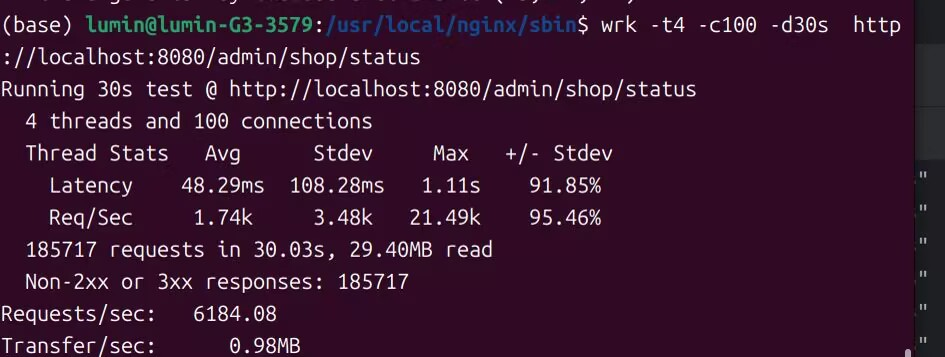

3. **如何找到项目中的性能瓶颈？**

   答：使用接口压力测试工具，查看系统日志（时间，Error Log），Sql慢查询日志

   追问：一个网页可能有许多接口，高并发的情况下，你如何知道是这个接口出了问题？你如何判断它的性能瓶颈来自于哪里？

   复盘：

   如何分析linux服务器上的性能指标？

   答：ps -aux 查看进程信息，free查看内存使用情况，top查看进程的cpu占用，df查看磁盘占用。

   追问：这些都是查看系统进程的，怎么分析性能指标

4. 如何优化你的项目？

   答：消息队列转异步任务，添加业务，CDN加速访问

5. Golang的垃圾回收机制

   答：三色标记法说了一下，不是特别收悉。
   追问：关于golang里面stw，如果堆特别大，3G以上，暂停时间会不会很久，怎么处理的

6. 谈谈你做什么事情最有收获，最大亮点和难点

​		论文

#### PDD 一面 

1. 项目介绍：难点etcd与服务发现
2. 操作系统 僵尸进程
3. redis缓存击穿
4. gin的底层原理
5. 进程和线程的区别，linux中进程怎么通信
6. mongodb和mysql的不同
7. 手撕合并两个链表为有序链表。(记事本模式，无语法和测试)

非传统八股。需要补操作系统和linux，redis面经。大厂对广度的要求很高，简历上随机挑着问，没写的也会问一下，但是一面没有深究。

#### 腾讯pcg架构一面

1. 为什么使用redis作为消息队列

   - **优点**：
     - **高性能**：Redis 基于内存，读写速度快，适合高吞吐量场景。
     - **轻量级**：无需复杂部署，适合简单消息队列场景（如任务分发、延迟队列）。
     - **数据结构支持**：List 实现 FIFO 队列，Sorted Set 实现延迟队列，Pub/Sub 实现发布订阅。
     - **原子性操作**：`LPUSH`/`BRPOP` 等命令保证消息操作的原子性。

   - **缺点**：
     - **无持久化保证**：若未配置 AOF/RDB，宕机可能丢失消息。
     - **无 ACK 机制**：消费者崩溃可能导致消息丢失，需业务层实现重试。
     - **不适合大数据量**：内存限制可能导致容量瓶颈。

2. 消息队列是全局的还是局部队列

   - **全局队列**：所有服务实例共享同一个队列（如 Kafka Topic），保证消息全局有序，适用于分布式系统解耦。
   - **局部队列**：每个服务实例维护独立队列（如线程池任务队列），适用于资源隔离或本地任务调度。
   - **选择依据**：需根据业务需求（有序性、扩展性、容错性）权衡。

3. 在etcd里面是怎么来做的？

   - **服务注册与发现**：
     - 服务启动时向 etcd 注册自身信息（IP:Port），并设置租约（Lease）维持心跳。
     - 客户端通过 etcd 监听服务节点变化（Watcher 机制），动态更新服务列表。
   - **分布式锁**：利用 etcd 的 `txn`（事务）和 `Lease` 实现互斥锁，避免脑裂。
   - **配置中心**：将配置存储在 etcd 中，服务监听配置变更并实时生效。

4. 消息越来越多怎么进行水平扩展？消息队列层？

   - **消息分片**：按业务键（如用户 ID）哈希分片，避免热点问题。
   - **分区（Partitioning）**：如 Kafka 将 Topic 分为多个 Partition，分散到不同节点。
   - **消费者组（Consumer Group）**：多个消费者并行处理不同 Partition 的消息。
   - **集群化部署**：通过增加 Broker 节点提升吞吐量。

5. 缓存一致性是怎么处理的？ 写db写成功了删缓存删失败了怎么处理

   - **经典方案**：
     - **Cache-Aside**：读时先查缓存，未命中读 DB 并回填；写时先更新 DB，再删除缓存。
     - **双删策略**：更新 DB 后延迟再次删除缓存，应对并发场景。
   - **删缓存失败处理**：
     - **重试机制**：将删除操作放入消息队列（如 RocketMQ）异步重试。
     - **设置缓存过期时间**：最终通过过期时间兜底。
     - **订阅 DB 变更日志**：通过 Canal 监听 Binlog 触发缓存删除。

6. 库存和高并发情况下抢资源的问题

   - **预扣库存**：下单时先扣减 Redis 中的库存（`DECR` 原子操作），支付完成后再同步到 DB。

   - **分布式锁**：使用 Redis 或 etcd 实现互斥锁，避免超卖。

     ```go
     // Redis 分布式锁示例
     ok, err := redis.SetNX("lock:product_123", 1, 10*time.Second).Result()
     ```

   - **队列削峰**：将请求放入队列（如 Kafka），异步处理避免瞬时压力。

   - **限流降级**：通过令牌桶或漏桶算法限制并发请求。

7. nginx如何解决ip多变的情况？docker服务？如果在扩容的情况下，怎么让nginx及时发现扩容的端口？

   - **动态 Upstream**：
     - **服务发现**：集成 Consul 或 etcd，Nginx 通过模板动态生成 upstream 配置。
     - **Nginx Plus**：使用 API 动态更新后端节点。
   - **Docker 环境**：
     - **Sidecar 模式**：每个容器启动时注册到服务发现组件。
     - **自动 Reload**：通过 `nginx -s reload` 或 Lua 脚本动态更新配置。

8. 服务场景：要上线了，发现服务的请求有些慢，如何鉴定和识别慢请求

   - **链路追踪**：集成 Jaeger/SkyWalking，分析各环节耗时（如 DB、Redis、RPC）。

   - **日志分析**：记录请求处理时间，通过 ELK 聚合分析慢请求。

   - **性能剖析**：

     - **Go pprof**：采集 CPU、内存、Goroutine 数据。
     - **火焰图**：定位代码热点。

     ```bash
     go tool pprof http://localhost:6060/debug/pprof/profile
     ```

9. logrus写日志如果日志量特别大，会把磁盘写爆怎么处理

   - **日志切割**：使用 `lumberjack` 库按大小或时间切割文件。

     ```
     import "gopkg.in/natefinch/lumberjack.v2"
     log.SetOutput(&lumberjack.Logger{
         Filename:   "app.log",
         MaxSize:    100, // MB
         MaxBackups: 3,
     })
     ```

   - **日志分级**：按级别（Debug/Info/Error）分开存储，减少冗余。例如，如果你的应用程序或服务生成了大量的调试（debug）级别的日志，你可能可以将日志级别提高到信息（info）或警告（warning）级别，这样只有更重要的消息才会被记录。

   - **集中式日志**：使用 Fluentd 或 Filebeat 将日志发送到 Kafka/ES。这些系统可以收集所有服务器的日志，将其集中在一个位置进行管理，并提供强大的搜索和可视化功能。

   - **定期清理日志**

10. Context在go语言中的作用

   - **超时控制**：通过 `context.WithTimeout` 设置请求超时，避免 Goroutine 泄漏。
   - **取消传播**：调用 `ctx.Done()` 通知所有子任务退出。
   - **值传递**：安全传递请求域数据（如 TraceID、鉴权 Token）。

11. 场景：外卖上线，请求报错，要查日志，怎么找到错误日志的上下文，跟踪错误？

    - **唯一请求 ID**：在网关生成 TraceID 并注入请求头，贯穿所有服务。(Context参数)
    - **结构化日志**：使用 JSON 格式记录 TraceID、错误堆栈、上下文参数。
    - **链路追踪**：集成 OpenTelemetry，可视化错误链路。
    - **日志聚合**：通过 Kibana 或 Grafana 按 TraceID 检索关联日志。

12. 操作系统为什么分为用户态和内核态？

    - **安全性**：限制用户程序直接访问硬件，防止系统崩溃。
    - **稳定性**：内核态提供统一的硬件抽象层，隔离驱动错误。
    - **权限控制**：通过 CPU 特权级（Ring 0-3）实现权限分级。

13. 用户态怎么去调用内核态

    - **系统调用**：通过软中断（如 `int 0x80`）触发内核态执行。
    - **流程**：
      1. 用户程序调用 `read()`。
      2. 触发软中断，CPU 切换到内核态。
      3. 内核执行对应系统调用（如 `sys_read()`）。
      4. 结果返回用户态。

14. 进程上下文切换简要过程

    1. 保存当前进程的寄存器状态（PC、SP 等）到 PCB。
    2. 更新调度队列，选择下一个进程。
    3. 加载新进程的寄存器状态并切换地址空间。
    4. 刷新 TLB 和 CPU 缓存。

15. http和https的区别，http是哪一层的协议，websocket也是应用层

    - **HTTP vs HTTPS**：
      - HTTPS = HTTP + TLS/SSL，通过加密（对称/非对称）和证书保证安全。
      - 默认端口 HTTP(80) vs HTTPS(443)。
    - **协议层**：
      - HTTP/HTTPS 是应用层协议（OSI 第 7 层）。
      - WebSocket 是基于 HTTP 升级的应用层协议，支持全双工通信。

16. sql慢查询如何定位

    - **慢查询日志**：开启 MySQL 慢查询日志（`slow_query_log`），设置阈值（`long_query_time`）。
    - **EXPLAIN 分析**：查看执行计划，关注 `type`（扫描方式）、`key`（索引）、`rows`（扫描行数）。
    - **性能工具**：使用 Percona Toolkit 或 pt-query-digest 分析日志。

17. 加索引的时候，复杂索引要注意哪些问题

    - **最左前缀原则**：索引 `(a,b,c)` 只能匹配 `a`、`a,b`、`a,b,c` 查询。
    - **避免冗余索引**：如 `(a,b)` 和 `(a)` 存在冗余。
    - **字段顺序**：高区分度字段放在左侧。
    - **覆盖索引**：尽量让索引包含查询所需字段，避免回表。

18. sql，查学生，成绩表中排第一的分数

    ```go
    SELECT student_id, score
    FROM scores
    WHERE score = (SELECT MAX(score) FROM scores);
    ```

19. 设计模式和设计原则有了解吗

- **SOLID 原则**：
  - **S**RP：单一职责（如将日志和业务逻辑分离）。
  - **O**CP：开闭原则（通过扩展而非修改实现新功能）。
  - **L**SP：里氏替换（子类可替换父类）。
  - **I**SP：接口隔离（避免臃肿接口）。
  - **D**IP：依赖倒置（依赖抽象而非实现）。
- **常用设计模式**：
  - **工厂模式**：隐藏对象创建细节（如数据库连接池）。
  - **装饰者模式**：动态扩展功能（如 HTTP 中间件）。
  - **观察者模式**：事件驱动架构（如消息订阅）。

手撕：翻转字符串"the sky is blue"=>"blue is sky the"，不使用额外空间

#### 微创一面

GMP底层模型，阻塞时候是怎么干的？

聊天室服务宕机怎么保证数据可靠性

手撕：无序数组找第K大

#### 腾讯云一面

八股，项目问题

没回答上的：gin中间件原理

手撕算法：找最大连续日期

```go
arr := []string{
    "2021-09-01 16:56:13",
    "2021-09-02 06:53:36",
    "2021-08-30 11:26:24",
    "2021-08-23 11:43:12",
    "2021-08-27 12:33:03",
    "2021-08-29 21:31:18",
    "2021-08-28 11:26:12",
}
```

```go
// maxConsecutiveDays 计算最大连续打卡天数
func maxConsecutiveDays(dates []string) int {
    dateSet := make(map[time.Time]bool) // 哈希集合存储日期

    // 1. 解析日期字符串并存入 map
    for _, dateStr := range dates {
        t, err := time.Parse("2006-01-02 15:04:05", dateStr) // 解析时间
        if err != nil {
            continue
        }
        dateSet[t.Truncate(24*time.Hour)] = true // 只保留年月日，忽略时分秒
    }

    maxStreak := 0

    // 2. 遍历 map，查找连续序列的起点
    for date := range dateSet {
        // 确保当前 `date` 是序列的起点（即 `date-1` 不在 map）
        prevDay := date.AddDate(0, 0, -1)
        if !dateSet[prevDay] {
            currentStreak := 1
            nextDay := date.AddDate(0, 0, 1)

            // 3. 继续向后查找连续的日期
            for dateSet[nextDay] {
                nextDay = nextDay.AddDate(0, 0, 1)
                currentStreak++
            }

            // 4. 更新最长连续天数
            if currentStreak > maxStreak {
                maxStreak = currentStreak
            }
        }
    }

    return maxStreak
}
```

sql 手撕


#### 字节一面
字节一面：sql a=1 and b =1 and c=1该怎么建索引？，把and改成or呢？
redis中如何使用分布式锁，具体参数有哪些？怎么实现可重入锁？
进程，线程的区别，切换，通信。
go协程讲一下。
redis中的kv对，中的v你会怎么设计
rpc 调用过程是怎么样的
算法：对链表的第k个位置进行翻转， 1000个苹果10个盒子，怎么装盒子保证客户买任意苹果都能有若干个盒子能够凑齐

#### 腾讯浏览器一面
tcp四次挥手，如果没有2MSL会怎么样
重传和快重传的区别，在滑动窗口下会怎么样
mysql如何插入100条语句 开启事务减少io
如何开启事务 start transaction/begin
进程通信方式，分别在什么场景下使用
有没有考虑过tcp该怎么优化

#### 随机问题

rpc微服务框架 

  mq底层数仓 

  runtime包里面的方法 

  redis过期策略和内存淘汰策略 

  sql索引优化问题 

  一个update语句的执行过程 

  go的profile工具？ 

  http和tcp有什么区别 

  用netstat看tcp连接的时候有关注过time_wait和close_wait吗？ 

  fork的底层实现方式 

  go语言的时候垃圾回收，写代码的时候如何减少小对象分配 

  redis的存储结构？ 

  实现map的方法除了哈希还有哪些？ 

  redis的setnx底层怎么实现的？ 

  go的gc原理了解吗？ 

  gin框架的路由是怎么处理的？ 

  mysql索引结构 

  B+树和B树有什么区别 

  sql查询性能瓶颈处理方式 

  sql索引优化方式，explain字段含义 

  gmp具体的调度策略 

  B+树细节优势，和哈希索引的区别，是为了解决什么问题？ 

  事务四个特性四个隔离级别 

  httptime_wait状态分析 

  nginx负载均衡策略 

  es内部实现原理，如何保证数据一致性，如何降低压力 

  linux查看磁盘、io、内存情况的命令 

  分库分表联表查询有哪些方式 

  覆盖查询&回表查询 

  聚簇索引&非聚簇索引 

  go实现不重启热部署 

  go性能分析工具 

  tcp如何保证稳定性 

  http和http2区别 

  https的连接过程 

  kafka如何做到高可用 

  分布式锁如何实现 

  读扩散&写扩散 

  goroutine创建数量有限制吗？ 

  go并发机制 

  线程协程区别 

  锁的可重入 

  常用限流算法 

  rpc调用过程 

  熔断降级开源框架 

  serviceMash 

  什么操作会影响联表查询效率 

  一个sql的查询过程 

  redis单线程是如何做到支持高并发的 

  IO多路复用 

  为什么内存操作很快 

  innoDB为什么支持事务 

  内存操作为什么很快 

  go内存操作也要处理IO，是如何处理的? 

  k8s各种组件 

  gomap并发安全问题，如何解决 

  gogc 

  一个进程能创建的线程数量受到哪些制约？ 

  redis主从同步怎么做的 

  k8s组件及其作用 

  k8s基本操作 

  docker底层实现原理 

  docker基本操作 

  linux常用操作 

  linux内核 

  集群分布式 

  线程 

  etcd 

  grpc 

  kafka 

  es 

  数据库分库分表，啥时候分库啥时候分表 

  数据库的存储引擎有哪些，区别是啥 

  innodb索引用的是啥，为什么不用b+、红黑 

  事务的隔离级别 

  层序遍历二叉树 

  判断二叉树是否是镜像二叉树 

  堆排 

  中间件:kafka丢失消息和不重复消费 

  redis底层数据结构实现 

  mysql索引，mongodb和mysql索引的区别，给了条sql语句问索引怎么构建 

  golang:切片和数组、map、gc、gpm调度模型 

  高并发限流、熔断 

  对一个链表进行排序 

  mysql引擎知道哪些，有哪些索引，底层是怎么实现的 

  redis底层实现 

  给n个数1n，随机n次，将这n个数输出 

  线程和协程的区别 

  io多路复用，select\poll\epoll的实现和区别 

  三次握手和四次挥手 

  长连接和短链接(怎么实现的、区别以及应用场景) 

  计算二叉树所有左叶子节点的和 

  n对括号输出所有合法的情况 

  n个有序的数组合并成一个 

  GPM调度模型 

  协程和线程的区别，内核态和用户态 

  btree和b+tree 

  二叉树中序遍历，递归和非递归两种方式 

  kafka如何保证消息有序，消息的重复和丢失 

  http和https的区别，https建立连接的过程 

  http1.1和http2.0的区别 

  缓存和数据库一致性的问题 

  syncpool的实现原理 

  hash冲突解决办法，有什么弊端 

  map里面解决hash冲突怎么做的，冲突了元素放在头还是尾 

  10亿的url去重怎么做 

  rediszset怎么使用的，底层怎么实现的，适用于什么场景 

  单链表找到中间节点 

  设计一个秒杀系统 

  给定一个二叉树和其中的一个结点，请找出中序遍历顺序的下一个结点并且返回。注意，树中的结点不仅包含左右子结点，同时包含指向父结点的指针 

  while(tree){sleep(1)}这个会有什么问题 

  sleep底层实现原理 

  线上问题一般怎么排查，比如oom 

  手写LRU相关知识点：模拟，结构，增删改查 

  一个整型数组，数组中的一个或连续多个整数组成一个子数组。求所有子数组的和的最大值 

  docker和虚拟机区别 

  k8s底层原理 

  linux文件系统 

  网络七层模型和五层模型 

  数据库索引 

  MySQL优化（索引、分表分库） 

  最左匹配原则？问为什么有这个东西？ 

  同一个协程里面，对无缓冲channel同时发送和接收数据有什么问题 

  channel和锁对比一下 

  channel的应用场景 

  slice和array区别 

  向为nil的channel发送数据会怎么样 

  map取一个key，然后修改这个值，原map数据的值会不会变化 

  Hash实现、冲突解决、应用 

  输入URL发生的整个网络过程 

  Redis怎么保证数据一致性 

  TCP流量控制、拥塞控制 

  TCP半连接队列 

  TCP半关闭状态 

  TCPTIME_WAIT状态 

  内核态、用户态 

  100枚硬币，其中有一枚硬币重量不一样，用天平秤怎么快速找到这一枚硬币 

  LRU缓存实现，要求set\get操作o(1)时间复杂度 

  TCP滑动窗口 

  一个SQL语句的执行过程 

  MVCC原理 

  ACID的涵义，MYSQL是如何保证的 

  缓存失效的几种场景，以及解决方案 

  缓存雪崩、击穿的解决方案 

  如何排查线上程序问题 

  protobuf为什么快 

  分布式系统优缺点，一致性是如何保证的 

  雪崩、穿透和击穿 

  最终一致性 

  mysql分布式id 

  mysql索引慢分析：线上开启slowlog，提取慢查询，然后仔细分析explain中tye字段以及extra字段，发生的具体场景及mysql是怎么做的 

  mysql分库分表平滑扩容方案 

  docker预热 

  gowaitgroup的坑 

  k8s原理 

  mysql隔离级别、sql慢查询 

  etcd原理 

  给一个栈，用另外一个栈实现排序 

  gostruct能不能比较 

  select可以用于什么 

  context包的用途 

  client如何实现长连接 

  主协程如何等其余协程完再操作 

  slice，len，cap，共享，扩容 

  map如何顺序读取 

  大文件排序 

  数据库如何建索引 

  tcp与udp区别，udp优点，适用场景 

  raft算法是那种一致性算法 

  一个请求到达pod的过程、configmap、dockerfile 

  二叉树遍历，非递归

[各厂三年go面经，已入字节_牛客网](https://www.nowcoder.com/discuss/353157951986802688)


#### 有价值的问题

##### 1.如何找到项目中的性能瓶颈？

1. 接口问题分析

   > **(1) 使用 APM（应用性能监控）工具**
   >
   > - **Prometheus + Grafana**（开源监控方案）
   > - **SkyWalking**（适用于分布式架构）
   > - **Jaeger / Zipkin**（分布式链路追踪）
   >
   > APM 可以监控接口的响应时间、数据库查询时间、调用链追踪等信息。可以：
   >
   > **查看各接口的响应时间**，找出 **RT（Response Time）过长** 的接口。
   >
   > **分析 QPS（每秒查询数）和并发量**，找出高负载接口。
   >
   > **查看错误率**，找出异常较多的接口。
   >
   > **(2)结合 Nginx/网关日志分析**
   >
   > - **Nginx 访问日志**（`access.log`）：可以统计各个接口的 `耗时` 和 `请求数`，通过 `awk`、`grep` 等工具分析哪些接口耗时最长。
   > - **API 网关日志**：如果你的项目使用 API 网关（如 Kong、Traefik），可以通过网关日志分析接口性能。
   >
   > **(3) 进行压测分析**
   >
   > - 使用 **JMeter、wrk、Locust** 等压测工具，模拟高并发请求，观察服务器 CPU、内存、磁盘 I/O 等指标。
   > - 重点关注 **响应时间过长的接口**，然后再深入分析该接口的瓶颈。

2. 判断性能瓶颈来自哪里

找到有问题的接口后，需要进一步分析它的瓶颈来源。主要从 **代码执行、数据库、网络、服务器资源** 等几个方面排查。

**(1) 代码层面分析**

>- **使用 pprof 进行 Go 代码性能分析**
>
>  ```go
>  import(
>  	"net/http"
>      _ "net/http/pprof"
>  )
>  
>  // 启动 pprof 监听
>  go func() {
>  	log.Println("[PPROF] Running on http://localhost:6060/debug/pprof/")
>  	if err := http.ListenAndServe("localhost:6060", nil); err != nil {
>  		log.Fatalf("failed to start pprof server: %s\n", err)
>  	}
>  }()
>  
>  // go tool pprof http://localhost:6060/debug/pprof/profile
>  ```
>
>  重点关注：
>
>  - **CPU 占用**（是否有死循环、计算过重）
>  - **Goroutine 数量**（是否存在 Goroutine 泄露）
>  - **锁竞争情况**（如 `sync.Mutex` 过多导致阻塞）
>
>- **Golang Trace** 分析：
>
>  ```go
>  go tool trace trace.out
>  ```
>
>  检查是否有 **GC（垃圾回收）过于频繁** 的问题。
>
>**(2) 数据库瓶颈**
>
>- **慢查询日志**：
>
>  - MySQL：
>
>    ```go
>    SHOW GLOBAL STATUS LIKE 'Slow_queries';
>    ```
>
>  - Redis：
>
>    ```go
>    MONITOR  # 监听 Redis 请求
>    ```
>
>- **优化 SQL**
>
>  - **是否使用索引？**
>  - **是否有大表扫描？**
>  - **是否有 N+1 查询？**
>  - **是否连接池满了？**
>
>- **数据库连接池**
>
>  - 例如 Go 语言中 
>
>     连接池是否设置合理：
>
>    ```
>    db.SetMaxOpenConns(100)  // 最大连接数
>    db.SetMaxIdleConns(20)   // 最大空闲连接数
>    ```
>
>**(3) 服务器和系统资源**
>
>- CPU、内存、磁盘 I/O
>
>  ```
>   # 查看 CPU/内存占用
>  iostat -x # 查看磁盘 I/O
>  ```
>
>- 网络瓶颈
>
>  - 使用 `netstat -anp | grep ESTABLISHED | wc -l` 统计连接数
>  - 检查是否有 **大量 TIME_WAIT 连接** 导致端口耗尽
>  - 服务器带宽是否充足？
>

##### 2. 你是怎么实现rpc的？它的原理是什么？作用是什么？

> **核心思想**
>
> "RPC（远程过程调用）是一种让应用程序可以像调用本地函数一样，调用远程服务器上的函数的技术。它屏蔽了网络通信的细节，使得客户端和服务器可以像调用本地方法一样进行交互。"
>
>  **RPC 的核心流程**
>
> 1.客户端调用 本地的 Stub 方法（代理）。
>
> 2.Stub 进行请求序列化（如 `Protobuf` / `JSON`），通过网络发送给 远程服务器。
>
> 3.服务器反序列化 请求，调用对应的服务方法，并返回结果。
>
> 4.客户端反序列化 结果，像调用本地函数一样获取返回值。
>
> **实现**
>
> 我使用 **etcd** 来管理 RPC 服务的注册和发现：RPC 服务器会 **启动时向 etcd 注册服务**，客户端通过 etcd 发现可用的 RPC 服务器，并进行负载均衡。
>
> **作用**  ：
>
> 我们在客户端做 **负载均衡**，如果 etcd 发现多个 RPC 服务器，会使用 **随机/轮询** 方式选择合适的服务器进行调用。
>
> 为了保证 RPC 服务器的可用性，我们让 etcd 定期检查 RPC 服务器状态（心跳机制），**自动剔除失效的节点**。

"RPC（远程过程调用）使得客户端可以像调用本地方法一样，调用远程服务器上的方法。RPC 的核心流程包括：**序列化请求 -> 发送网络请求 -> 服务器反序列化请求并执行 -> 发送响应**。
 在我们的项目中，我们使用 **rpcx** 作为 RPC 框架，并结合 **etcd** 进行 **服务注册与发现**。
 **服务器启动时，会向 etcd 注册自己的地址**（如 `127.0.0.1:50051`），**客户端从 etcd 发现可用的 RPC 服务器**，然后进行远程调用。
 **为了提高稳定性，我们实现了服务健康检查**，如果服务器宕机，etcd 会自动剔除失效节点，客户端会重新选择可用的服务器。"

追问：

**Q1: 为什么使用 etcd 而不是 Consul / Zookeeper？**

> etcd 是 **强一致性**（CP）的，适合 **分布式系统**，而 Consul 更偏向 **CAP 可用性**。
>
> etcd 采用 **Raft 算法**，一致性高，性能好。

**Q2: 你们的 RPC 是否支持负载均衡？**

> - 是的，客户端会 **从 etcd 获取多个可用服务器**，然后使用 **轮询 / 随机 负载均衡策略**。

**Q3: 如何保证 RPC 的高可用？**

> - **服务健康检查**（定期心跳检测）
> - **自动故障转移**（服务宕机，etcd 自动剔除）
> - **负载均衡**（客户端选择最优服务器）

##### 3.Context的原理和使用

context包提供了一种机制，可以在多个[goroutine](https://zhida.zhihu.com/search?content_id=227351218&content_type=Article&match_order=1&q=goroutine&zhida_source=entity)之间进行通信和控制。使用Context包能够有效地控制程序的并发性，提高程序的健壮性和性能。

```go
type Context interface {
    Deadline() (deadline time.Time, ok bool) // 返回 Context 何时会被取消
    Done() <-chan struct{}                   // 返回一个 channel，当 context 取消或超时时，该 channel 会被关闭，通知 Goroutine 退出。
    Err() error                              // 返回 context 被取消的原因，如 context.Canceled 或 context.DeadlineExceeded。
    Value(key any) any                       // 获取 Context 里存储的值
}
```

**`context` 的继承关系**

Go 语言的 `context` 采用**继承+组合**的方式，每次创建新的 `context`，都会基于**已有的 `context`** 生成新的 `context`，形成一个**层级结构**。

常见的 `context` 生成方式：

```
plaintext复制编辑        ┌──────────────────────────┐
        │     context.Background()  │  根 Context（不会被取消）
        └──────────┬───────────────┘
                   │
      ┌───────────┴───────────┐
      │                       │
 context.WithCancel()    context.WithTimeout()
      │                       │
 context.WithValue()      context.WithDeadline()
```

- `context.Background()`：创建最顶层的 `context`，通常用于 **main 函数、初始化、测试**。
- `context.TODO()`：和 `Background()` 类似，但用于 **不确定用什么 `context` 的地方**。
- `context.WithCancel(parent)`：创建**可取消**的 `context`。
- `context.WithTimeout(parent, timeout)`：创建**超时** `context`，超时后自动取消。
- `context.WithDeadline(parent, deadlineTime)`：设定**具体时间**作为超时时间。
- `context.WithValue(parent, key, value)`：存储**请求作用域的数据**。

###### 父协程通知子协程退出

**场景：** 在 HTTP 服务器、任务调度等场景下，我们需要**通知子 Goroutine 退出**，否则可能会产生 Goroutine 泄漏。

```go
// 模拟一个工作任务
func worker(ctx context.Context) {
    for {
        select {
        case <-ctx.Done(): // 收到取消信号
            fmt.Println("Worker received cancellation signal, exiting...")
            return
        default:
            fmt.Println("Worker is running...")
            time.Sleep(500 * time.Millisecond)
        }
    }
}

func main() {
    ctx, cancel := context.WithCancel(context.Background()) // 创建一个可取消的 context
    go worker(ctx) // 启动 worker
    time.Sleep(2 * time.Second) // 运行一段时间
    fmt.Println("Main function sending cancel signal")
    cancel() // 取消 context，通知 Goroutine 退出
    time.Sleep(1 * time.Second) // 等待 Goroutine 退出
}
```

###### 超时控制

需要**限制某个操作的执行时间**，如果超过时间则终止。

```go
func task(ctx context.Context) {
    for {
        select {
        case <-ctx.Done():
            fmt.Println("Task timeout, exiting...")
            return
        default:
            fmt.Println("Processing task...")
            time.Sleep(500 * time.Millisecond)
        }
    }
}

func main() {
    // 3s内没完成就取消
    ctx, cancel := context.WithTimeout(context.Background(), 2*time.Second)
    defer cancel() // 确保 context 释放资源
    go task(ctx)
    time.Sleep(3 * time.Second) // 等待任务执行
}
```

###### 传递请求作用域数据

 在 HTTP 服务器中，我们可能需要**在不同的中间件/处理函数中共享数据**（如 `UserID`）。

```go
func processRequest(ctx context.Context) {
    userID := ctx.Value("userID") // 取出存储的值
    if userID != nil {
        fmt.Println("Processing request for User ID:", userID)
    } else {
        fmt.Println("No User ID found in context")
    }
}
func main() {
    ctx := context.WithValue(context.Background(), "userID", 12345)
    processRequest(ctx)
}
```

`WithValue()` 可以**在多个函数间传递请求相关的数据**。

适用于**请求 ID、用户信息、日志追踪等场景**。

**不要存放大对象或全局状态，避免内存泄漏！**

###### 总结

✅ **Context 的核心功能**

1. **控制 Goroutine 退出** (`WithCancel`)
2. **设定超时** (`WithTimeout`、`WithDeadline`)
3. **携带请求作用域数据** (`WithValue`)
4. **处理 HTTP 请求生命周期**

✅ **使用 Context 的最佳实践**

- **尽量避免直接传 `context.Background()`，应优先使用 `r.Context()`**（HTTP）。
- **不要滥用 `WithValue()`，避免存放大对象**。
- **确保 `cancel()` 或 `defer cancel()` 释放资源，防止 Context 泄漏**。


## New

### SSE协议

SSE（Server-Sent Events，服务端推送事件）基于 HTTP 协议，为了解决服务器无法主动推送信息的问题。通过向客户端声明接下来要发送的是流信息（streaming）。

> 也就是说，发送的不是一次性的数据包，而是一个数据流，会连续不断地发送过来。这时，客户端不会关闭连接，会一直等着服务器发过来的新的数据流，视频播放就是这样的例子。本质上，这种通信就是以流信息的方式，完成一次用时很长的下载。

特点：

- **单向通信**：服务器向客户端推送数据。
- **实现简单**：基于 HTTP 协议，大部分浏览器都支持，只需设置正确的 HTTP 头和响应格式，轻量级。
- **自动重连**：浏览器会自动处理重连机制。不允许缓存

- **数据格式**：SSE 一般只用来传送文本，二进制数据需要编码后传送，WebSocket 默认支持传送二进制数据。

#### 协议实现

> SSE 协议很简单，本质上是一个客户端发起的 HTTP Get 请求，服务器在接到该请求后，返回 200 OK 状态，同时附带以下 Headers
>
> ```text
> Content-Type: text/event-stream
> Cache-Control: no-cache
> Connection: keep-alive
> ```
>
> **服务器**数据格式: 每个事件以`\n\n`结尾，`data`字段包含有效负载，可选`id`（事件ID）、`event`（自定义事件类型）等字段。通过定时Flush推送数据，避免缓冲区阻塞
>
> ```go
> func StreamHandler(c *gin.Context) {
>     c.Header("Content-Type", "text/event-stream")
>     for {
>         token := generateNextToken()
>         fmt.Fprintf(c.Writer, "data: %s\n\n", token)
>         c.Writer.Flush() // 关键：即时刷新缓冲区
>         if isEnd(token) { break }
>     }
> }
> // data: {"token": "Hello", "end": false}\n\n
> // data: {"token": "World", "end": true}\n\n
> ```
>
> - SSE 是一个一直打开的 TCP 连接，所以 Connection 为 Keep-Alive
>
> **客户端**使用JavaScript的`EventSource`监听数据流：
>
> ```javascript
> // 客户端：EventSource监听
> const source = new EventSource('/stream');
> source.addEventListener('message', (e) => {
>     document.getElementById('output').innerHTML += e.data;
> });
> ```

#### 业务场景

以「文件下载」功能进行说明，一般情况下，大文件的下载，服务端压力比较大、处理时间也比较长，为了有更好的交互体验，我们可以使用异步处理，服务端处理完了之后主动通知 客户端，效果如下：


这个小弹窗就是服务端处理完了之后，通过 SSE连接主动推送到客户端。

我们来看看处理流程：

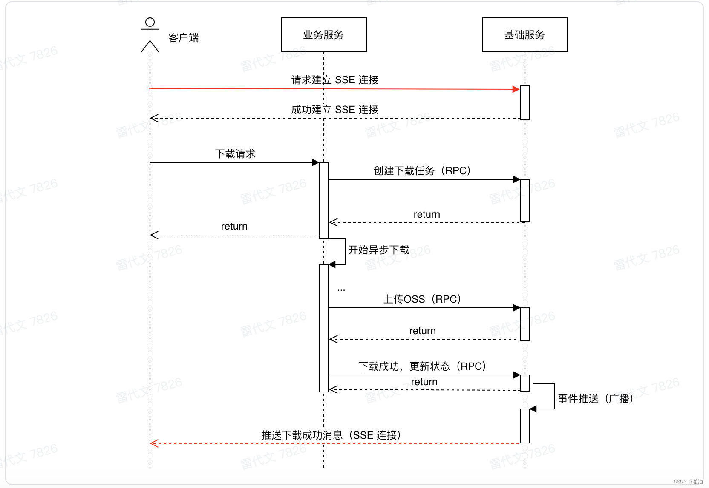

1）SSE 连接：

先建立 SSE 连接，确保服务端有主动推送消息的能力。

2）异步下载：

长耗时下载任务我们通过异步的方式处理，避免用户在下载页面长时间等待。

3）广播并推送：

下载完成后，我们需要将完成事件推送给客户端。需要注意的是，由于服务是集群部署、SSE 连接在节点本地 Map 维护，这就有可能导致当前客户端的 SSE连接所在节点 与 事件推送节点 是两个独立的节点。

因此，我们这里借助于 Redis 的发布/订阅能力，将消息广播出去，能匹配连接的节点负责将消息推送至客户端、其他节点直接丢弃即可。效果图如下：

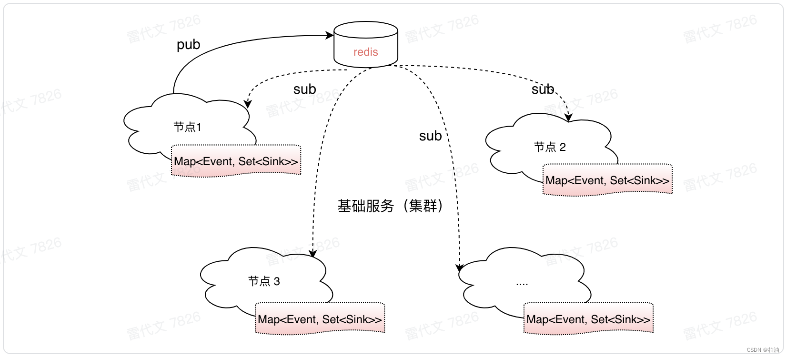

> **能否做到精准投递？**
>
> 答案也是可以的，我们可以这样来做：
>
> 借助 Redis 做中心存储，存储Map<用户,节点IP> 这样的映射关系。
> 在推送消息之前，先通过映射关系找到该用户的SSE连接所在节点
> 然后在通过 RPC调用 直接将消息投递到对应的服务节点，最后由该节点进行事件推送。
> 一般情况下，我们可以用「广播」这种简单粗暴的方式应对大部分场景，毕竟「精准投递」需要中心化的维护节点关系、应对节点变更等，处理起来稍显麻烦。具体视业务场景来做选择即可。

#### 为什么大模型使用SSE而不是websocket

**1.实现成本**

- 时间

WebSocket成本 = TCP握手(1次RTT) + TLS1.2握手(2次RTT) + `Upgrade: websocket` 请求(1次RTT)  ，共计4次RTT。（如果是TLS1.3，可以做到0~1次RTT）

SSE成本 = HTTP长连接(1次RTT) + TLS ，会减少一次协议升级的RTT

> tcp知识点：为什么三次握手是一个RTT
>
> 标准定义的 RTT 是：发送一个请求 + 等待一个响应的时间。
>
> ```text
> Client                                        Server
>    | -------------- SYN --------------------> |   ← 第一次握手
>    | <----------- SYN + ACK ---------------- |   ← 第二次握手
>    | -------------- ACK --------------------> |   ← 第三次握手
> ```
>
> 对于客户端来说，ACK 不需要等响应（第三次握手不等待服务端返回）。所以完整的RTT过程是 从 SYN 到收到 SYN+ACK 

- 内存

WebSocket需维护全双工长连接，每个连接占用独立线程或内存资源，而SSE通过HTTP长连接实现推送，服务器资源消耗更低，适合高并发场景

- 兼容性

SSE基于HTTP协议，无需额外协议升级（如WebSocket的`ws://`/`wss://`），可直接复用现有HTTP端口（80/443），减少防火墙或代理配置问题。现代浏览器原生支持`EventSource` API，兼容性优于WebSocket的部分限制

- 格式

SSE支持纯文本或JSON流式传输，与大模型输出的结构化数据（如Token序列、置信度）天然契合。WebSocket虽支持二进制数据，但需额外编码解析

**2.单向数据流需求**

大模型的核心场景是**流式文本生成**，用户输入请求后，服务器需持续推送生成的文本片段。这种场景下，**通信方向是单向的**（服务器→客户端），而WebSocket的全双工通信能力（双向交互）反而冗余。

当用户输入问题后，模型逐词生成回答，客户端无需中途向服务器发送额外数据。

**3.流式信息的不均衡性**

大模型的输出Token量通常远大于输入（如输入10字问题，生成500字回答）。SSE的单向推送机制能高效处理这种**“稀疏请求，密集响应”**模式，避免WebSocket双向通道的资源浪费

**4.断线重连天然支持**

SSE内置**自动重连机制**（默认3秒重试），支持通过`Last-Event-ID`头部恢复断连后的数据流，适合大模型长文本生成场景的网络波动容错。而WebSocket需手动实现心跳检测与重连逻辑

> SSE的**核心优势**在于将协议复杂度降至最低，精准匹配大模型的单向流式需求，同时通过HTTP生态的成熟性保障稳定性和兼容性。而WebSocket更适用于**实时双向交互场景**（如在线协作、聊天室）。技术选型时需遵循“**用对的，而非用贵的**”原则

#### 什么时候不适用SSE

虽然SSE性能卓越，但在以下场景请慎用：

| 场景                | 问题                | 推荐方案              |
| :------------------ | :------------------ | :-------------------- |
| 双向实时通信        | SSE不支持客户端推送 | WebSocket             |
| 二进制流传输        | SSE仅支持文本       | WebSocket+ArrayBuffer |
| 超低延迟要求(<10ms) | HTTP协议栈开销      | QUIC协议              |
| 移动端弱网环境      | 长连接保活困难      | MQTT+长轮询           |

典型案例：某在线教育平台的白板协作功能，初期采用SSE导致画笔延迟明显，切换WebSocket后延迟从200ms降至50ms。


ref :

[Server-Sent Events 教程 - 阮一峰的网络日志](https://www.ruanyifeng.com/blog/2017/05/server-sent_events.html)

[服务端实时推送技术之SSE（Server-Send Events）-CSDN博客](https://blog.csdn.net/ldw201510803006/article/details/130306152)


