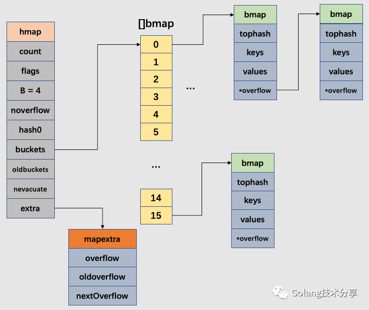
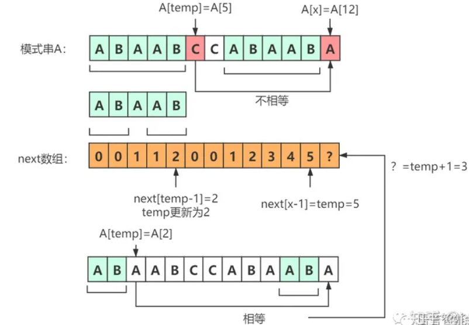
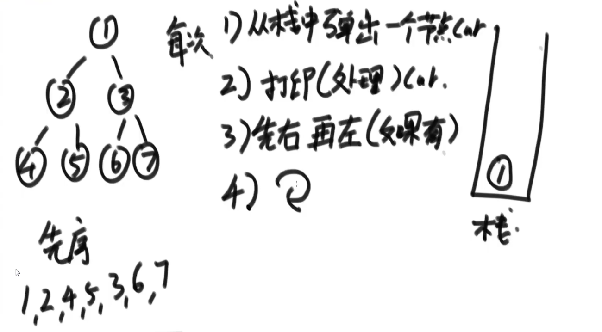
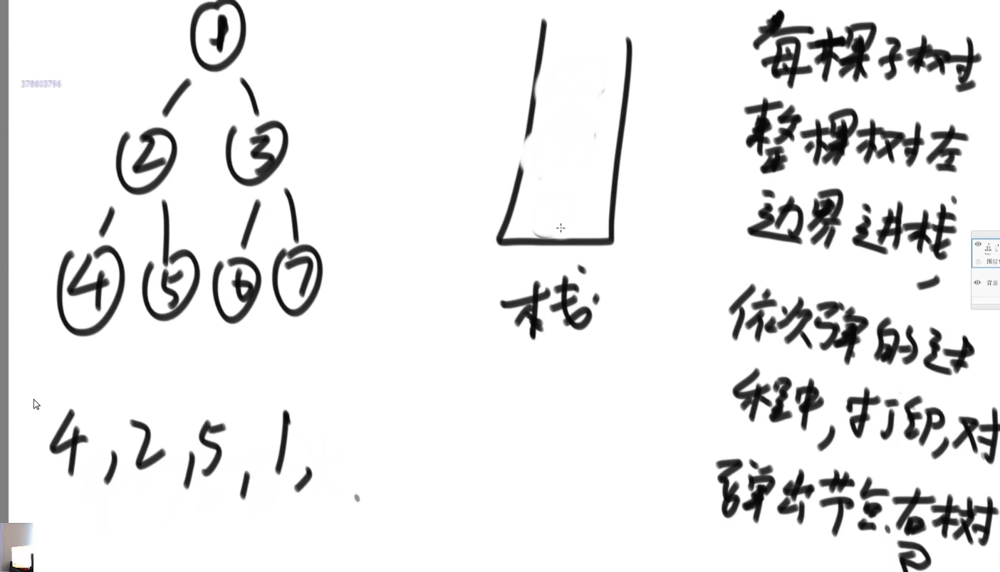
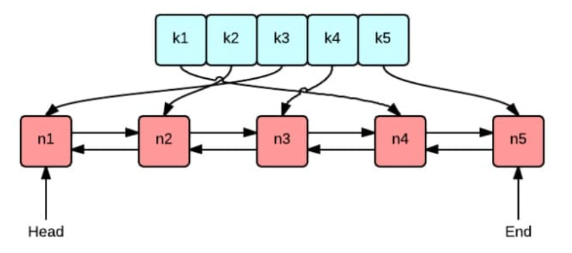
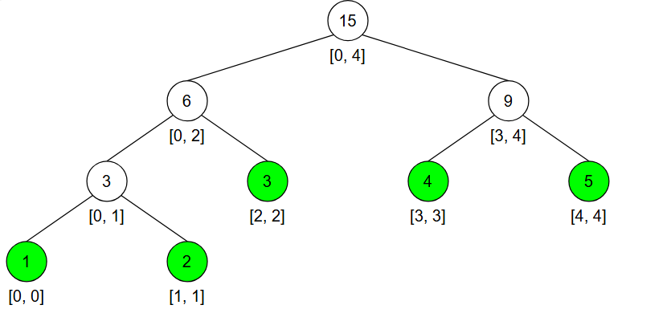
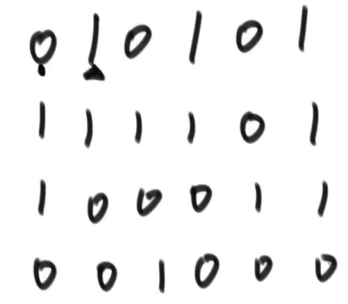

[toc]


# Golang

## 面向对象

面向对象编程（OOP）的三大核心特性

1.**封装** :将数据（属性）和行为（方法）绑定在一个类中，并对外隐藏内部实现细节，仅通过公共接口与外界交互。

2.**继承（Inheritance）**：子类继承父类的属性和方法，并可以扩展或重写这些行为，实现代码复用和分层抽象。

3.**多态（Polymorphism）**：同一操作在不同对象上表现出不同行为，通常通过继承（方法重写）或接口实现

### golang实现继承

```go
type Animal struct {
    Name string
}

func (a *Animal) Eat() {
    fmt.Printf("%v is eating", a.Name)
    fmt.Println()
}

type Cat struct {
    *Animal
}

cat := &Cat{
    Animal: &Animal{
        Name: "cat",
    },
}
cat.Eat() // cat is eating
```

- 如果一个 struct 嵌套了另一个匿名结构体，那么这个结构可以直接访问匿名结构体的属性和方法，从而实现继承。
- 如果一个 struct 嵌套了另一个有名的结构体，那么这个模式叫做组合。
- 如果一个 struct 嵌套了多个匿名结构体，那么这个结构可以直接访问多个匿名结构体的属性和方法，从而实现多重继承。

### go实现多态

Go 语言并没有设计诸如虚函数、纯虚函数、继承、多重继承等概念，但它通过接口却非常优雅地支持了面向对象的特性。
多态是一种运行期的行为，它有以下几个特点：

1. 一种类型具有多种类型的能力
2. 允许不同的对象对同一消息做出灵活的反应
3. 以一种通用的方式对待个使用的对象
4. 非动态语言必须通过继承和接口的方式来实现

#### **(1) 定义接口**

```go
type Shape interface {
    Area() float64
    Perimeter() float64
}
```

#### **(2) 定义具体类型并实现接口**

```go
// 矩形类型
type Rectangle struct {
    Width  float64
    Height float64
}

func (r Rectangle) Area() float64 {
    return r.Width * r.Height
}

func (r Rectangle) Perimeter() float64 {
    return 2 * (r.Width + r.Height)
}

// 圆形类型
type Circle struct {
    Radius float64
}

func (c Circle) Area() float64 {
    return math.Pi * c.Radius * c.Radius
}

func (c Circle) Perimeter() float64 {
    return 2 * math.Pi * c.Radius
}
```

#### **(3) 多态调用**

```go
func PrintShapeDetails(s Shape) {
    fmt.Printf("Area: %.2f, Perimeter: %.2f\n", s.Area(), s.Perimeter())
}

func main() {
    rect := Rectangle{Width: 5, Height: 3}
    circle := Circle{Radius: 4}

    PrintShapeDetails(rect)   // 输出: Area: 15.00, Perimeter: 16.00
    PrintShapeDetails(circle) // 输出: Area: 50.27, Perimeter: 25.13
}
```

## 官方包

### Context

```golang
type Context interface {
	// 当 context 被取消或者到了 deadline，返回一个被关闭的 channel
	Done() <-chan struct{}

	// 在 channel Done 关闭后，返回 context 取消原因
	Err() error

	// 返回 context 是否会被取消以及自动取消时间（即 deadline）
	Deadline() (deadline time.Time, ok bool)

	// 获取 key 对应的 value
	Value(key interface{}) interface{}
}
```

`Context` 是一个接口，定义了 4 个方法，它们都是`幂等`的。也就是说连续多次调用同一个方法，得到的结果都是相同的。此外，Context是并发安全的。

`Done()` 返回一个 channel，可以表示 context 被取消的信号：当这个 channel 被关闭时，说明 context 被取消了。注意，这是一个只读的channel。 我们又知道，读一个关闭的 channel 会读出相应类型的零值。并且源码里没有地方会向这个 channel 里面塞入值。换句话说，这是一个 `receive-only` 的 channel。因此在子协程里读这个 channel，除非被关闭，否则读不出来任何东西。也正是利用了这一点，子协程从 channel 里读出了值（零值）后，就可以做一些收尾工作，尽快退出。

`Err()` 返回一个错误，表示 channel 被关闭的原因。例如是被取消，还是超时。

`Deadline()` 返回 context 的截止时间，通过此时间，函数就可以决定是否进行接下来的操作，如果时间太短，就可以不往下做了，否则浪费系统资源。当然，也可以用这个 deadline 来设置一个 I/O 操作的超时时间。

`Value()` 获取之前设置的 key 对应的 value。但是父协程读不到子协程的值。

#### context在go中一般可以用来做什么？

在 Go 语言中，`context` 包提供了一种管理多个 goroutine 之间的**截止时间**、**取消信号**和**请求范围数据**的方法。以下是 `context` 常见的用途：

取消信号：

- `context` 可以用来向多个 goroutine 传递取消信号。当一个 goroutine 需要取消其他 goroutine 时，可以调用 `context` 的 `CancelFunc`。

- 例如，在处理 HTTP 请求时，如果客户端关闭了连接，可以使用 `context` 取消所有相关的后台操作。

```go
ctx, cancel := context.WithCancel(context.Background())
defer cancel()

go func() {
    // 执行一些操作
    // 在需要取消操作时调用 cancel
    cancel()
}()

select {
case <-ctx.Done():
    fmt.Println("操作取消")
case result := <-someOperation():
    fmt.Println("操作结果:", result)
}
```

截止时间/超时控制：

- `context` 可以设置一个截止时间或超时。当超过这个时间或超时发生时，`context` 会自动取消操作。

- 例如，在数据库查询或网络请求时，可以使用 `context` 设置一个超时时间，以防止长时间的等待。

- ```go
     ctx, cancel := context.WithTimeout(context.Background(), 5*time.Second)
     defer cancel()
     
     select {
     case <-ctx.Done():
         if ctx.Err() == context.DeadlineExceeded {
             fmt.Println("操作超时")
         }
     case result := <-someOperation():
         fmt.Println("操作结果:", result)
     }
     ```

传递请求范围的数据：

- `context` 可以在多个 goroutine 之间传递请求范围的数据，例如请求的唯一 ID、用户认证信息等。

- 例如，在处理 HTTP 请求时，可以将请求的元数据存储在 `context` 中，并在各个处理函数之间传递这些数据。

- ```go
     ctx := context.WithValue(context.Background(), "requestID", "12345")
     
     go func(ctx context.Context) {
         requestID := ctx.Value("requestID").(string)
         fmt.Println("处理请求ID:", requestID)
     }(ctx)
     ```

### sort

sort包的底层实现是多种排序的算法，例如快排，插入等等。调用时并不公开，也无需定义用那种算法。
sort包内部会根据实际情况，自动选择最高效的排序算法。

使用的时候仅仅需要三要素：序列长度，比较方式，交换方式：Len，Less,Swap

> ```go
> //定义序列类型
> type TestStringList []string
> //定义排序三要素
> func (t TestStringList) Len() int { ... }
> func (t TestStringList) Less(i,j int) bool { ... }
> func (t TestStringList) Swap(i,j int)  { ... }
> 
> //进行排序
> sort.Sort(TestStringList)
> //根据定义的排序规则取反
> sort.Sort(sort.Reverse(TestStringList))
> 
> //元素个数
> func (t TestStringList) Len() int {
>     return len(t)
> }
> //比较结果
> func (t TestStringList) Less(i, j int) bool {
>     return t[i] < t[j]
> }
> //交换方式
> func (t TestStringList) Swap(i, j int) {
>     t[i], t[j] = t[j], t[i]
> }
> 
> stringList := TestStringList{
>         "1-php",
>         "2-java",
>         "3-golang",
>         "4-c",
>         "5-cpp",
>         "6-python",
>     }
> sort.Sort(stringList)
> //[1-php 2-java 3-golang 4-c 5-cpp 6-python]
> ```

Slice同样也可以进行排序，仅仅需要一个回调函数确定排序方式

```go
 sort.Slice(arr,func(i,j int){
     return arr[i]<arr[j]
 })
```

### strconv

#### 字符串和int类型相互转换

* string转成int：

  ```int, err := strconv.Atoi(string)```

* string转成int64：

  `` int64, err := strconv.ParseInt(string, 10, 64)``

* int转成string：
  `string := strconv.Itoa(int)`

* int64转成string：
  `string := strconv.FormatInt(int64,10)

### container

heap实现优先级队列

```go
package main

import (
    "container/heap"
    "fmt"
)
// heap实现了五个接口 分别是
// sort.Interface中的
//  ->Len() int
//  ->Less(i, j int) bool
//  ->Swap(i, j int)
// Push(x any) // add x as element Len()
// Pop() any
// 实现了这五个方法才能使用go提供的heap
type Heap []int
func (h Heap) Len() int           { return len(h) }
func (h Heap) Less(i, j int) bool { return h[i] < h[j] }
func (h Heap) Swap(i, j int)      { h[i], h[j] = h[j], h[i] }
func (h *Heap) Pop() interface{} {
    // 弹出最后一个元素
    old := *h
    n := len(old)
    x := old[n-1]
    *h = old[0 : n-1]
    return x
}
func (h *Heap) Push(x interface{}) {
    *h = append(*h, x.(int))
}

func main() {
    h := &Heap{}
    heap.Init(h)
    fmt.Println(*h)
    heap.Push(h, 8)
    heap.Push(h, 4)
    heap.Push(h, 4)
    heap.Push(h, 9)
    heap.Push(h, 10)
    heap.Push(h, 3)
    fmt.Println(*h)
    for len(*h) > 0 {
       fmt.Printf("%d ", heap.Pop(h))
    }
    // 3 4 4 8 9 10
}
```

heap提供的方法不多，具体如下：

```go
h := &Heap{3, 8, 6}  // 创建IntHeap类型的原始数据
func Init(h Interface)  // 对heap进行初始化，生成小根堆（或大根堆）
func Push(h Interface, x interface{})  // 往堆里面插入内容
func Pop(h Interface) interface{}  // 从堆顶pop出内容
func Remove(h Interface, i int) interface{}  // 从指定位置删除数据，并返回删除的数据
func Fix(h Interface, i int)  // 从i位置数据发生改变后，对堆再平衡，优先级队列使用到了该方法
```

### sync

#### cond

在并发编程中，`sync.Cond`（条件变量）是一种用于 **协调多个 Goroutine 间等待和通知的机制**。在 `ants` 协程池库中，条件变量被用来高效管理 Worker 的 **休眠与唤醒**，避免忙等待（Busy Waiting）造成的 CPU 资源浪费。

##### **核心作用**

**1. 解决的问题**

- **场景**：当多个 Goroutine 需要等待某个条件（如任务到达、资源可用）时，若使用忙等待（循环检查条件），会导致 CPU 空转。
- 条件变量的优势：
  - 在条件不满足时，Goroutine **主动休眠**，释放 CPU。
  - 条件满足时，**精确唤醒** 等待的 Goroutine，减少无效唤醒。

**2. 核心方法**

|     方法      |                             作用                             |
| :-----------: | :----------------------------------------------------------: |
|   `Wait()`    | 释放锁并阻塞，直到被 `Signal` 或 `Broadcast` 唤醒（唤醒后重新获取锁） |
|  `Signal()`   |             唤醒一个等待的 Goroutine（随机选择）             |
| `Broadcast()` |                   唤醒所有等待的 Goroutine                   |

##### **底层原理**

```go
type Cond struct {
	noCopy noCopy 
	L Locker // L is held while observing or changing the condition
	notify  notifyList  // 指针记录关注的地址
	checker copyChecker // 记录条件变量是否被复制
}
```

**1. 依赖关系**

- **必须与锁（`sync.Mutex` 或 `sync.RWMutex`）结合使用**：
  条件变量的操作需要在锁的保护下进行，确保对共享状态的原子访问。

**2. 内部实现**

- **等待队列**：维护一个 FIFO 队列，记录所有调用 `Wait()` 的 Goroutine。
- **操作系统级阻塞**：`Wait()` 内部通过 `sync.runtime_notifyListWait` 进入阻塞状态，由调度器管理。

#####  在 `ants` 中的应用

在 `ants` 库中，条件变量主要用于 **Worker 的休眠与唤醒**，以下是关键代码片段和解析：

###### **1. 创建一个Worker**

当协程池提交任务时，`Submit()`被调用，触发`retrieveWorker()`唤醒或创建一个worker执行任务。

```go
// 尝试获取一个可用 worker 来运行任务。如果没有空闲 worker，则可能会：新建一个 worker|阻塞等待一个释放的 worker|报错退出（超出上限或设置为 non-blocking）
func (p *poolCommon) retrieveWorker() (w worker, err error) {
	p.lock.Lock() // 线程安全

retry:
	// 尝试从 worker 队列中获取可用 worker
	if w = p.workers.detach(); w != nil {
		p.lock.Unlock()
		return
	}

	// 如果没有，判断是否可以新建 worker。如果还没达到 pool 容量上限，就从缓存拿一个新的 worker 并启动。
	if capacity := p.Cap(); capacity == -1 || capacity > p.Running() {
		p.lock.Unlock()
		w = p.workerCache.Get().(worker)
		w.run()
		return
	}

	// 如果是 non-blocking 模式，或排队线程数已达上限，则直接返回错误
	if p.options.Nonblocking || (p.options.MaxBlockingTasks != 0 && p.Waiting() >= p.options.MaxBlockingTasks) {
		p.lock.Unlock()
		return nil, ErrPoolOverload
	}

	// 使用条件变量阻塞当前 goroutine，等待有 worker 被释放，注意，后续会回到起始的retry处重新分配worker
	p.addWaiting(1)
	p.cond.Wait() // block and wait for an available worker
	p.addWaiting(-1)

	if p.IsClosed() {
		p.lock.Unlock()
		return nil, ErrPoolClosed
	}

	goto retry
}
```

条件变量阻塞直到有其他 worker 被放回池子，会通过 `p.cond.Signal()` 进行唤醒。

> 注意：`p.cond` 是在获取了 `p.lock` 之后调用的 `Wait()`，这是条件变量的经典用法：条件变量必须和互斥锁配合使用，防止竞态条件。
>
> `Wait()` 过程中需要 **自动释放锁，挂起等待，恢复后重新加锁**，这样才能保证**在检查条件、挂起等待、被唤醒这整个流程中是安全的**，避免**竞态条件**。
>
> 条件变量配合互斥锁使用，是为了确保“检查条件 + 挂起等待”这一步是原子操作，避免竞态和虚假唤醒，确保被唤醒后的逻辑是正确的。

> 例子：没有锁，会有竞态
>
> ```go
> if pool.length == 0 {
>     cond.Wait() // ⛔ 可能刚好别人 push 进来了，但你还在等
> }
> ```
>
> - 上面的 `if` 判断和 `Wait()` 之间不是原子操作！
> - 如果判断完之后，还没进入 `Wait()`，恰好有另一个 goroutine 添加了元素并 `Signal()`，你就可能错过信号，**永远挂起等待**！
>
> 使用 `mutex` 锁就能让这一段逻辑变成**原子性操作**：
>
> ```go
> mutex.Lock()
> for pool.length == 0 {
>     cond.Wait() // 会释放锁，挂起；被唤醒后重新加锁，继续检查
> }
> mutex.Unlock()
> ```
>
> 这就是通过加锁避免竞态条件。

###### **2. 回收一个worker**

将一个空闲的 worker **放回线程池（WorkerQueue）** 的函数，也就是一个“回收重用”的逻辑

```go
func (p *poolCommon) revertWorker(worker worker) bool {
	if capacity := p.Cap(); (capacity > 0 && p.Running() > capacity) || p.IsClosed() {
		p.cond.Broadcast() // 确保池关闭或超容时，所有等待的 Goroutine 能及时退出。
		return false
	}

	worker.setLastUsedTime(p.nowTime()) // 记录回收时间戳，供空闲 Worker 超时清理机制使用（如 ants.WithExpiryDuration 选项）

	p.lock.Lock() // 防止竟态条件
    // 加锁后的双重检查：防止无锁快速路径检查后，其他 Goroutine 可能已关闭池
	if p.IsClosed() {
		p.lock.Unlock()
		return false
	}
    
	if err := p.workers.insert(worker); err != nil {
		p.lock.Unlock()
		return false
	}

	p.cond.Signal() // 仅唤醒一个等待的Goroutine
	p.lock.Unlock()
	return true
}
```

###### **3. worker容量调整**

` Tune`函数动态调整池容量的，使用条件变量 `cond.Signal()` 和 `cond.Broadcast()` 来唤醒正在等待 worker 的 goroutine

```go
func (p *poolCommon) Tune(size int) {
	capacity := p.Cap()
	if capacity == -1 || size <= 0 || size == capacity || p.options.PreAlloc { // 容量空|目标大小size不合法|目标和容量相等|预分配内存（循环队列：容量已固定）
		return
	}
	atomic.StoreInt32(&p.capacity, int32(size)) // 更新容量为新的 size
	if size > capacity { // 如果变更是“扩容”，说明可能有等待的调用方可以继续执行。
		if size-capacity == 1 {
            // 如果只是扩容 1 个位置，用 Signal() 唤醒 一个等待中的调用方；
         	// 否则，用 Broadcast() 唤醒 所有等待的调用方。
			p.cond.Signal()
			return
		}
		p.cond.Broadcast()
	}
}
```

### runtime

#### Gosched()

`runtime.Gosched()` 是 Go 语言中用于 **协作式调度** 的关键函数，它主动让出当前 Goroutine 占用的 CPU 时间片，使调度器有机会运行其他就绪的 Goroutine。关键在于

- **让出当前 CPU 时间片**：
  调用 `runtime.Gosched()` 会立即暂停当前 Goroutine 的执行，将其放回 ​**​全局运行队列​**​（Global Run Queue），触发 Go 调度器的重新调度。
- **非阻塞式让出**：
  当前 Goroutine 不会进入阻塞状态，而是进入 ​**​可运行状态​**​（Runnable），等待下次被调度器选中。

> 具体会让出多少CPU时间？
>
> **没有固定时间长度**，取决于**其他 Goroutine 的就绪状态**，若有其他就绪的 Goroutine，调度器会选择其中一个运行。若没有，当前 Goroutine 可能立即恢复执行（例如在单核场景下）。Go 调度器（基于 G-P-M 模型）会尽量保证 Goroutine 的公平调度，但优先级不固定。

##### **与调度器的关系**

- **Go 1.14 前**：
  调度器依赖 Goroutine 主动让出（如 `Gosched()`、系统调用、channel 操作），否则可能独占 CPU。
- **Go 1.14+**：
  引入 ​**​基于信号的抢占式调度​**​，即使 Goroutine 不主动让出，调度器也会强制抢占（如 10ms 时间片耗尽）。
  ​**​但 `Gosched()` 仍有效​**​：在需要更细粒度控制时（如避免延迟），主动让出更可靠。

##### **性能影响**

- **轻量级操作**：
  调用 `Gosched()` 仅触发调度器上下文切换，开销极小（约 100~200 纳秒）。
- **过度使用的风险**：
  频繁调用可能导致不必要的调度开销（如每循环一次调用一次），需权衡使用频率。

##### **对比其他方式**

|      **方式**       |             **触发调度场景**             | **是否主动让出** |
| :-----------------: | :--------------------------------------: | :--------------: |
| `runtime.Gosched()` |            立即让出，触发调度            |       主动       |
|   `time.Sleep(0)`   |        让出 CPU，但依赖计时器精度        |       被动       |
|    Channel 操作     | 阻塞时自动让出（如读写未就绪的 channel） |       被动       |
|      系统调用       |           进入内核态时自动让出           |       被动       |

#### Goexit

调用此函数会立即使当前的goroutine的运行终止（终止协程），而其它的goroutine并不会受此影响。runtime.Goexit在终止当前goroutine前会先执行此goroutine的还未执行的defer语句。请注意千万别在主函数调用runtime.Goexit，因为会引发panic。

#### GOMAXPROCS

用来设置可以并行计算的CPU核数最大值，并返回之前的值。

默认此函数的值与ＣＰＵ逻辑个数相同，即有多少个goroutine并发执行，当然可以设置它，它的取值是1～256。最好在主函数在开始前设置它，因为设置它会停止当前程序的运行。

GO默认是使用一个CPU核的，除非设置runtime.GOMAXPROCS
那么在多核环境下，什么情况下设置runtime.GOMAXPROCS会比较好的提高速度呢？

适合于CPU密集型、并行度比较高的情景。如果是IO密集型，CPU之间的切换也会带来性能的损失。

## 保留关键字

golang 有 25 个保留的关键字，这些关键字不能用作程序标识符。

| 类型     | 关键字                                                       | 介绍                                 |
| -------- | ------------------------------------------------------------ | ------------------------------------ |
| 声明     | `const` `func` `import` `package` `type` `var`               | 这些关键字用于声明代码中的各种元素   |
| 复合类型 | `chan` `interface` `map` `struct`                            | 这些关键字用于声明一些特殊的复合类型 |
| 流程控制 | `break` `case` `continue` `default` `else` `fallthrough` `for` `goto` `if` `range` `return` `select` `switch` | 这些关键字用于控制程序运行流程       |
| 功能修饰 | `defer` `go`                                                 | 用于修饰特殊的 function              |

### make和new的区别

- new() 用于创建任意类型的变量，而 make() 仅用于创建引用类型的变量，包括 slice、map、chan 的数据。

  > ptr := new(T)  //可以看作下面写法的语法糖
  >
  > var t T
  >
  > ptr := &t

- new() 返回的是指针，而 make() 返回的是初始化后的值。

### for range 的变量地址会发生变化么？

``` go
for idx,value := range arr{}
```

在这个遍历中，`idx` 和 `value`  在循环的过程中始终对应同一个内存地址，即之后每次循环时遍历到的数据都是以值覆盖的方式赋给`idx` 和`value` 。由于有这个特性，for 循环里面如果开协程，不要直接把`idx` 或者`value`的地址传给协程。

尽量创建临时变量使用值拷贝，进行传递。否则可能导致底层数据被修改。

### defer 的使用和原理

每个 defer 语句都对应一个 `_defer `实例，多个实例使用指针连接起来形成一个单连表，保存在 `Goroutined `的链表数据结构中，每次插入 `_defer `实例，均插入到链表的头部，函数结束再从头部取出，从而形成后进先出(LIFO)的效果。

> **defer返回的时机？**
>
> defer、return、返回值三者的执行逻辑应该是：return最先执行，return负责将结果写入返回值中；接着defer开始执行一些收尾工作；最后函数携带**当前返回值**（可能和最初的返回值不相同）退出。
>
> 此外，`panic`前的defer仍然会在抛出错误之前运行，而`os.Exit(0)`则不会执行defer

- defer声明函数时，参数会立刻解析

```go
func test() { //无返回值函数
    var a int = 1
    defer fmt.Println("1、a =", a)                    //方法
    defer func(v int) { fmt.Println("2、a =", v) }(a) //有参函数
    defer func() { fmt.Println("3、a =", a) }()       //无参函数
    a++
}
// 3、a = 2
// 2、a = 1 因为传入的参数是a=1，传入的是值拷贝，即使a的值被修改，参数的值不改变
// 1、a = 1 
```

- 无名返回值和有名返回值

```go
func a() int { // 无名返回值
	var i int
	defer func() {
		i++
		fmt.Println("defer2:", i) 
	}()
	defer func() {
		i++
		fmt.Println("defer1:", i) 
	}()
	return i
}
func main() {
	fmt.Println("return:", a()) 
}
// defer1: 1
// defer2: 2
// return: 0
```

```go
func b() (i int) { // 有名返回值
	defer func() {
		i++
		fmt.Println("defer2:", i)
	}()
	defer func() {
		i++
		fmt.Println("defer1:", i)
	}()
	return i 
}
func main() {
	fmt.Println("return:", b()) 
}
// defer1: 1
// defer2: 2
// return: 2
```

> 对于a()，由于defer的先进后出特性，defer1先于defer2。关于返回的顺序，首先return会产生一个临时变量 res ，再把 i 的值赋给res (这一步是不可见的) , 然后执行defer函数链，最后将res的值进行返回，因此res的值在defer之前就确定了是0，而执行完defer之后 i 变成了2。
>
> 对于b()，返回值的变量已经被显示指定了，所以会直接把 变量 i 的值进行返回，最终的返回值就是2

- defer 和 range的示例

```go
type Test struct {
	name string
}
func (t *Test) pp() {
	fmt.Println(t.name)
}
func main() {
	ts := []Test{{"a"}, {"b"}, {"c"}}
	for _, t := range ts {
		defer t.pp()
	}
}
// c
// c
// c
```

> range遍历t得到的变量t共享一块内存，因此三次循环得到的是同一个地址，最后一次调用是c，因此接下来执行的那些defer语句中用到的t.name的值均为”c“。

```go
func pp(t Test) {
	fmt.Println(t.name)
}
func main() {
	ts := []Test{{"a"}, {"b"}, {"c"}}
	for _, t := range ts {
		defer pp(t)
	}
}
//c
//b
//a
```

> 参数实时解析，每次defer的时候参数被实时传入了。

### 闭包是什么？

闭包是一个可以捕获其外部作用域（环境）变量的函数。它使得函数能够“记住”它创建时的外部状态，并在调用时继续访问和操作这些变量。这些被捕获的变量会随着闭包一起存在，直到闭包被销毁。闭包会保持对这些变量的引用，因此这些变量不会被销毁，直到闭包本身被销毁。

```go
func main() {
    // 创建一个闭包
    counter := createCounter()
    // 调用闭包，修改内部变量
    fmt.Println(counter()) // 输出: 1
    fmt.Println(counter()) // 输出: 2
    fmt.Println(counter()) // 输出: 3
}
// 返回一个闭包
func createCounter() func() int {
    count := 0
    // 这个匿名函数会捕获 `count` 变量
    return func() int {
        count++
        return count
    }
}
```

通过闭包可以实现只能用函数制定的方式操作变量，比如add()等

- **闭包**是一个函数，它不仅包括函数的代码，还包含对外部作用域中变量的引用。

- 它允许函数“记住”并操作创建它时的状态，直到闭包本身被销毁。

- 闭包广泛应用于数据封装、回调函数、延迟执行等场景。

### select 和 IO多路复用

#### select复用协程读写

[最全Go select底层原理，一文学透高频用法-腾讯云开发者社区-腾讯云](https://cloud.tencent.com/developer/article/2205909)

第一，Go select语句采用的多路复用思想，本质上是为了达到**通过一个协程同时处理多个IO请求（Channel读写事件）。**

第二，select的基本用法是：**通过多个case监听多个Channel的读写操作，任何一个case可以执行则选择该case执行，否则执行default**。如果没有default，且所有的case均不能执行，则当前的goroutine阻塞。

第三，**编译器会对select有不同的case的情况进行优化以提高性能**。首先，编译器对select没有case、有单case和单case+default的情况进行单独处理。这些处理或者直接调用运行时函数，或者直接转成对channel的操作，或者以非阻塞的方式访问channel，多种灵活的处理方式能够提高性能，尤其是避免对channel的加锁。

> select {
> case ch <- 1:
>     fmt.Println("send")
> }
>
> 优化为
>
> ch <- 1
> fmt.Println("send")

> select {
> case v := <-ch:
>     fmt.Println("recv", v)
> default:
>     fmt.Println("no data")
> }
>
> 优化为
>
> if v, ok := tryRecv(ch); ok {
>     fmt.Println("recv", v)
> } else {
>     fmt.Println("no data")
> }

第四，**对最常出现的select有多case的情况，会调用 runtime.selectgo() 函数来获取执行 case 的索引，并生成 if 语句执行该case的代码。**

第五，**selectgo函数的执行分为四个步骤**：

首先，随机生成一个遍历case的轮询顺序 pollorder 并根据 channel 地址生成加锁顺序 lockorder，随机顺序能够避免channel饥饿，保证公平性，加锁顺序能够避免死锁；

然后，根据 pollorder 的顺序查找 scases 是否有可以立即收发的channel，如果有则获取case索引进行处理；

再次，如果pollorder顺序上没有可以直接处理的case，则将当前 goroutine 加入各 case 的 channel 对应的收发队列上并等待其他 goroutine 的唤醒；

最后，当调度器唤醒当前 goroutine 时，会再次按照 lockorder 遍历所有的case，从中查找需要被处理的case索引进行读写处理，同时从所有case的发送接收队列中移除掉当前goroutine。

1. **随机轮询**：编译器会将所有 case 生成一个随机顺序的列表（`pollorder`），避免某些 channel 长期饥饿；
2. **加锁顺序**：对涉及的 channel 按地址排序加锁（`lockorder`），防止死锁；
3. **阻塞与唤醒**：如果没有就绪的 case，会将当前 Goroutine 加入所有 channel 的等待队列，挂起直到某个 channel 就绪，之后再次遍历确认就绪的 case。

> **为什么需要加锁？**
>
> Go 的 channel 本身就是一个并发数据结构，可能同时被多个 goroutine 访问。
>
> 在 `select` 的过程中，我们要操作多个 channel：
>
> - **检查 channel 是否可读/可写**
> - **在 channel 上挂起当前 goroutine**（比如把它放进等待队列）
> - **可能需要修改 channel 的 buffer 或队列**
>
> 这些操作必须保证原子性，否则就会出现**竞态条件**。
>  因此，runtime 在处理 `select` 的时候会给 **相关的 channel 加锁**。
>
> 无锁会有什么问题？
>
> - 两个 goroutine 同时 select 同一个 channel：
>   可能都看到 channel “可写”，结果都写进去，破坏 channel 的容量约束。
>
> - 一个 goroutine select 正在挂起时，另一个 goroutine 正在往 channel 写入：
>   如果没有锁保护，可能出现数据丢失或 goroutine 永远睡眠。

**select 的特性**
1）select 操作至少要有一个 case 语句，出现读写 nil 的 channel 该分支会忽略，在 nil 的 channel 上操作则会报错。
2）select 仅支持管道，而且是单协程操作。
3）每个 case 语句仅能处理一个管道，要么读要么写。
4）如果多个通道都准备好，那么 select 语句会随机选择一个通道执行。如果所有通道都没有准备好，那么执行 default 块中的代码。
5）存在 default 语句，select 将不会阻塞，但是存在 default 会影响性能。

#### linux下的IO模型

- **阻塞IO** ： 线程发起I/O操作后**挂起**，直到数据就绪并完成拷贝。在这期间程序不能做其它的事情。并发能力差，资源消耗大。
- **非阻塞IO**：I/O操作**立即返回状态**，需**轮询检查**数据是否就绪。轮询CPU资源浪费
- **IO多路复用**：通过**单一线程监控多个文件描述符**，利用`select`/`poll`/`epoll`等待就绪事件。高并发下资源利用率高，epoll性能最优。
- **信号驱动IO**：信号驱动IO是利用信号机制，让内核告知应用程序文件描述符的相关事件。
- **异步IO**: 和信号驱动IO差不多，但它比信号驱动IO可以多做一步：相比信号驱动IO需要在程序中完成数据从用户态到内核态(或反方向)的拷贝，异步IO可以把拷贝这一步也帮我们完成之后才通知应用程序。**内核完成数据拷贝后通知应用**

> 阻塞 vs 非阻塞 ： 看线程等待结果，或者是不等待直接返回并且通过轮询进行监听
>
> 同步 vs 异步  ：同步是调用者自己处理结果，异步是通过回调进行调用。

#### 三种IO多路复用模型

**select**：将已连接的 Socket 都放到一个文件描述符集合，然后将文件描述符集合拷贝到内核里，让内核通过遍历来检查是否有网络事件产生，当检查到有事件产生后，将此 Socket 标记为可读或可写， 接着再把整个文件描述符集合拷贝回用户态里，然后用户态还需要再通过遍历的方法找到可读或可写的 Socket，然后再对其处理。需要进行 **2 次「遍历」文件描述符集合**，一次是在内核态里，一个次是在用户态里 ，而且还会发生 **2 次「拷贝」文件描述符集合**，先从用户空间传入内核空间，由内核修改后，再传出到用户空间中。**通过`fd_set`位数组管理fd，默认最大1024个。**

**poll**：提供了更优质的编程接口，但是本质和 select 模型相同。使用`pollfd`结构数组，用链表突破文件描述符的个数限制，但每次调用仍然需要遍历文件描述符。

**epoll**：维护了一棵红黑树来跟踪所有待检测的文件描述字，红黑树的使用减少了内核和用户空间大量的数据拷贝和内存分配，大大提高了性能。同时，epoll 维护了一个链表来记录就绪事件，内核在每个文件有事件发生时将自己登记到这个就绪事件列表中，通过内核自身的文件 file-eventpoll 之间的回调和唤醒机制，减少了对内核描述字的遍历。

>  先用epoll_create 创建一个 epoll对象 epfd，再通过 epoll_ctl 将需要监视的 socket 添加到epfd中，最后调用 epoll_wait 等待数据。
>
>  在内核里，`epoll` 主要维护两部分结构：
>
>  - **红黑树（rbtree）**：存放所有被监控的 fd（快速查找、增删改查）。
>  - **就绪链表（ready list）**：存放已经就绪的 fd，`epoll_wait` 直接从这里取，O(1) 开销。注:事件驱动是基于回调实现的
>
>  **内核监视事件的机制**：
>
>  - 每个 fd 内部都有等待队列（wait queue）。
>  - epoll 在 `epoll_ctl` 时，把自己的回调挂到 fd 的等待队列上。
>  - 当 fd 有事件发生（数据到达、缓冲区可写、错误等），驱动唤醒等待队列 → epoll 的回调触发 → fd 被放到 ready list。
>  - `epoll_wait` 只需要去 ready list 里取事件，做到 **事件驱动、O(1) 获取就绪 fd**。

- `epoll` 采用**事件驱动模型**，不再需要遍历所有 fd(维护了一个「链表」来记录就绪事件)，而是**只有有事件发生的 fd 才会通知进程**。**只返回有事件的 fd**，无需遍历所有 fd。
- 内核使用一个**红黑树**管理 fd，不需要项select、poll一样传入整个socket集合。减少了内核和用户空间大量的数据拷贝和内存分配。

`level-triggered ` ` edge-triggered` 分别为水平触发和边沿触发。

`level-triggered `表示只要有IO操作可以进行，比如某个文件描述符有数据可读，每次调用epoll_wait都会返回以通知程序可以进行IO操作。

`edge-triggered `是指在文件描述符状态发生变化时，调用epoll_wait才会返回，如果第一次没有全部读完该文件描述符的数据而且没有新数据写入，再次调用epoll_wait都不会有通知给到程序，因为文件描述符的状态没有变化。

**epoll的相对优点**

|         特性          |           `select` & `poll`           |                 `epoll`                  |
| :-------------------: | :-----------------------------------: | :--------------------------------------: |
|    **时间复杂度**     | O(n)：每次调用需遍历所有 fd 检查状态  |  O(1)：仅关注活跃 fd，通过事件回调触发   |
|    **fd 数量限制**    | `select` 有 `FD_SETSIZE`（默认 1024） |      支持数十万 fd（仅受内存限制）       |
| **内核/用户空间交互** |   每次调用需拷贝完整 fd 集合到内核    | 通过 `epoll_ctl` 注册 fd，仅传递活跃事件 |
|     **触发模式**      |         仅支持水平触发（LT）          |    支持水平触发（LT）和边缘触发（ET）    |

缺点是：仅适用于 Linux 系统。且需处理 **ET/LT 模式差异**：ET 模式需确保读取完所有数据（否则可能丢失事件）。

`epoll` 有两种触发模式：

1. **水平触发（LT, Level Triggered）**
   - 只要 fd 上有数据，就会一直通知。
   - 默认模式，用起来简单，不容易丢事件。
2. **边缘触发（ET, Edge Triggered）**
   - 只有 **状态变化** 时才通知，比如从无数据变为有数据。
   - 更高效，但要把 socket 设置为非阻塞，并且必须一次读/写到 `EAGAIN`，否则会漏事件。

Go runtime 就是基于 **epoll 的边缘触发** 来做网络事件驱动的。

### Go Modules

发布于 Go1.11，“淘汰”现有的 GOPATH 的使用模式。

> go path 模式
>
> `go env`查看当前GOPATH 变量的结果，进入目录可以发现
>
> ```go
> go
> ├── bin
> ├── pkg
> └── src
>  ├── github.com
>  ├── golang.org
>  ├── google.golang.org
>  ├── gopkg.in
>  ....
> ```
>
> GOPATH目录下一共包含了三个子目录，分别是：
>
> - bin：存储所编译生成的二进制文件。
> - pkg：存储预编译的目标文件，以加快程序的后续编译速度。
> - src：存储所有`.go`文件或源代码。在编写 Go 应用程序，程序包和库时，一般会以`$GOPATH/src/github.com/foo/bar`的路径进行存放。
>
> 因此在使用 GOPATH 模式下，我们需要将应用代码存放在固定的`$GOPATH/src`目录下，并且如果执行`go get`来拉取外部依赖会自动下载并安装到`$GOPATH`目录下。
>
> 弊端：无版本控制，无法同步第三方库版本

`go env -w GO111MODULE=on`打开go modules模式，

>- auto：只要项目包含了 go.mod 文件的话启用 Go modules，目前在 Go1.11 至 Go1.14 中仍然是默认值。
>- on：启用 Go modules，推荐设置，将会是未来版本中的默认值。
>- off：禁用 Go modules，不推荐设置。

**go mod 命令**

| go mod init     | 生成 go.mod 文件                 |
| --------------- | -------------------------------- |
| go mod download | 下载 go.mod 文件中指明的所有依赖 |
| go mod tidy     | 整理现有的依赖                   |
| go mod graph    | 查看现有的依赖结构               |
| go mod edit     | 编辑 go.mod 文件                 |
| go mod vendor   | 导出项目所有的依赖到vendor目录   |
| go mod verify   | 校验一个模块是否被篡改过         |
| go mod why      | 查看为什么需要依赖某模块         |

>  go.mod
>
>  ```go
>  module github.com/aceld/modules_test //#用于定义当前项目的模块路径
>  go 1.14 //#标识当前Go版本.即初始化版本
>  require github.com/aceld/zinx v0.0.0-20200221135252-8a8954e75100 // indirect //# 当前项目依赖的一个特定的必须版本.indirect: 示该模块为间接依赖，也就是在当前应用程序中的 import 语句中，并没有发现这个模块的明确引用，有可能是你先手动 go get 拉取下来的，也有可能是你所依赖的模块所依赖的.
>  ```

> go.sum
>
> 在第一次拉取模块依赖后，会发现多出了一个 go.sum 文件，其详细罗列了当前项目直接或间接依赖的所有模块版本，并写明了那些模块版本的 SHA-256 哈希值以备 Go 在今后的操作中保证项目所依赖的那些模块版本不会被篡改。

### go init()函数

一个包下可以有多个 init 函数，每个文件也可以有多个 init 函数。多个 init 函数按照它们的文件名顺序逐个初始化。应用初始化时初始化工作的顺序是，从被导入的最深层包开始进行初始化，层层递出最后到 main 包。不管包被导入多少次，包内的 init 函数只会执行一次。（先入先出：队列）

应用初始化时初始化工作的顺序是，从被导入的最深层包开始进行初始化，层层递出最后到 main 包。但包级别变量的初始化先于包内 init 函数的执行。

```go 
import _ "net/http/pprof
```

**golang对没有使用的导入包会编译报错，但是有时我们只想调用该包的init函数，不使用包导出的变量或者方法，这时就采用上面的导入方案。**

## 数据类型

### 整数 int

Golang 中的整数类型：

| 位                      | 类型             |
| ----------------------- | ---------------- |
| 8                       | `int8` `uint8`   |
| 16                      | `int16` `uint16` |
| 32                      | `int32` `uint32` |
| 64                      | `int64` `uint64` |
| 32 或 64 (基于系统架构) | `int` `uint`     |

- `rune` : 等价于 `int32` , 用于存储 `Unicode`或`utf-8` 字符
- `byte` ：等价于 `uint8` , 用于存储 `ASCII` 字符

>**uint类型溢出** ：超过最大存储值，如uint8最大是255
>
>```go
>func main() {
>	var a uint8 = 255
>	var b uint8 = 1
>	fmt.Println(a + b) // 0
>	var c byte = 255
>	fmt.Println(a == c) // true
>}
>```

> Rune类型：golang 中的字符串底层实现是通过byte数组的，中文字符在`unicode`下占2个字节，在`utf-8`编码下占3个字节，而 golang 默认编码正好是`utf-8`，英文字符占一个1字节。
>
> Go 字符串默认 **UTF-8** → 中文 3 个字节，英文 1 个字节
>
> `len(str)` → 字节长度，不是字符数
>
> `len([]rune(str))` → 字符（码点）数

#### 常见的进制前缀表示

| 前缀   | 进制             | 示例                 | 说明                           |
| ------ | :--------------- | -------------------- | ------------------------------ |
| `0x`   | 十六进制 (Hex)   | `0x1F` (31 十进制)   | `x` 大小写均可，表示 16 进制。 |
| `0`    | 八进制 (Octal)   | `075` (61 十进制)    | 不推荐使用，部分语言已弃用。   |
| `0b`   | 二进制 (Binary)  | `0b1011` (11 十进制) | 表示 2 进制，`b` 大小写均可。  |
| `0o`   | 八进制 (Octal)   | `0o71` (57 十进制)   | 更清晰的八进制表示 (Python)。  |
| 无前缀 | 十进制 (Decimal) | `42`                 | 默认数值形式 (10 进制)。       |

`\0` 开头，后跟 1-3 位八进制数。如`\101` 表示 `A`。

**`\u`** 前缀表示，4 位十六进制数，表示 BMP 范围字符（范围：`0000` 到 `FFFF`）。

 ```go 
fmt.Println("\u4F60") // 输出：你
 ```

**`\U`** 总是跟 8 位十六进制数，表示完整 Unicode 范围，包括超出 BMP 的字符。

```
var ch int = '\u0041'
var ch2 int = '\u03B2'
var ch3 int = '\U00101234'
fmt.Printf("%d - %d - %d\n", ch, ch2, ch3) // integer 65 - 946 - 1053236
fmt.Printf("%c - %c - %c\n", ch, ch2, ch3) // character A - β - r
fmt.Printf("%X - %X - %X\n", ch, ch2, ch3) // UTF-8 bytes 41 - 3B2 - 101234
fmt.Printf("%U - %U - %U", ch, ch2, ch3) // UTF-8 code point U+0041 - U+03B2 - U+101234
```

### 浮点数 float

浮点数就是包含小数点的数字

| 位   | 类型      |
| ---- | --------- |
| 32   | `float32` |
| 64   | `float64` |

### 复数 complex

复数包含虚数和实数，实数为浮点数

| 位                 | 类型         |
| ------------------ | ------------ |
| 32 位浮点数 + 虚数 | `complex64`  |
| 64 位浮点数 + 虚数 | `complex128` |

```go
// 初始化一个复数
var complexData complex64 = complex(5, 3) // 等于： 5 + 3i

// 另一种初始化方式
complexData2 := 5 + 3i
```

### 常量 const

#### const中的枚举

`iota` 可以被用作枚举值：

```go
const (
	a = iota
	b = iota
	c = iota
)
```


第一个 `iota` 等于 0，每当 `iota` 在新的一行被使用时，它的值都会自动加 1，并且没有赋值的常量默认会应用上一行的赋值表达式：

```go
// 赋值一个常量时，之后没赋值的常量都会应用上一行的赋值表达式
const (
	a = iota  // a = 0
	b         // b = 1
	c         // c = 2
	d = 5     // d = 5   
	e         // e = 5
)

// 赋值两个常量，iota 只会增长一次，而不会因为使用了两次就增长两次
const (
	Apple, Banana = iota + 1, iota + 2 // Apple=1 Banana=2
	Cherimoya, Durian                  // Cherimoya=2 Durian=3
	Elderberry, Fig                    // Elderberry=3, Fig=4
)

// 使用 iota 结合 位运算 表示资源状态的使用案例
const (
	Open = 1 << iota  // 0001
	Close             // 0010
	Pending           // 0100
)

const (
	_           = iota             // 使用 _ 忽略不需要的 iota
	KB = 1 << (10 * iota)          // 1 << (10*1)
	MB                             // 1 << (10*2)
	GB                             // 1 << (10*3)
	TB                             // 1 << (10*4)
	PB                             // 1 << (10*5)
	EB                             // 1 << (10*6)
	ZB                             // 1 << (10*7)
	YB                             // 1 << (10*8)
)
```

`iota` 也可以用在表达式中，如：`iota + 50`。在每遇到一个新的常量块或单个常量声明时， `iota` 都会重置为 0（ **简单地讲，每遇到一次 const 关键字，`iota` 就重置为 0** ）。

### 字符串 string

在 Go 语言中，字符串(string) 是不可变的，拼接字符串事实上是创建了一个新的字符串对象。如果代码中存在大量的字符串拼接，对性能会产生严重的影响。

常见的字符串拼接方式包括：`+` , `fmt.Sprintf`, `strings.Builder`, `bytes.Buffer`, `[]byte`

> 从基准测试的结果来看，使用 `+` 和 `fmt.Sprintf` 的效率是最低的，和其余的方式相比，性能相差约 1000 倍，而且消耗了超过 1000 倍的内存。当然 `fmt.Sprintf` 通常是用来格式化字符串的，一般不会用来拼接字符串。
>
> `strings.Builder`、`bytes.Buffer` 和 `[]byte` 的性能差距不大，而且消耗的内存也十分接近，性能最好且消耗内存最小的是 `preByteConcat`，这种方式预分配了内存，在字符串拼接的过程中，不需要进行字符串的拷贝，也不需要分配新的内存，因此性能最好，且内存消耗最小。
>
> 综合易用性和性能，一般推荐使用 `strings.Builder` 来拼接字符串。

**背后的原理**

> `strings.Builder` 和 `+` 性能和内存消耗差距如此巨大，是因为两者的内存分配方式不一样。
>
> 字符串在 Go 语言中是不可变类型，占用内存大小是固定的，当使用 `+` 拼接 2 个字符串时，生成一个新的字符串，那么就需要开辟一段新的空间，新空间的大小是原来两个字符串的大小之和。拼接第三个字符串时，再开辟一段新空间，新空间大小是三个字符串大小之和，以此类推。假设一个字符串大小为 10 byte，拼接 1w 次，需要申请的内存大小为：
>
> ```
> 10 + 2 * 10 + 3 * 10 + ... + 10000 * 10 byte = 500 MB 
> ```
>
> **而 `strings.Builder`，`bytes.Buffer`，包括切片 `[]byte` 的内存是以倍数申请的**。例如，初始大小为 0，当第一次写入大小为 10 byte 的字符串时，则会申请大小为 16 byte 的内存（恰好大于 10 byte 的 2 的指数），第二次写入 10 byte 时，内存不够，则申请 32 byte 的内存，第三次写入内存足够，则不申请新的，以此类推。

```go
const letterBytes = "abcdefghijklmnopqrstuvwxyzABCDEFGHIJKLMNOPQRSTUVWXYZ"

func randomString(n int) string {
	b := make([]byte, n)
	for i := range b {
		b[i] = letterBytes[rand.Intn(len(letterBytes))]
	}
	return string(b)
}

func plusConcat(n int, str string) string {
	s := ""
	for i := 0; i < n; i++ {
		s += str
	}
	return s
}
func sprintfConcat(n int, str string) string {
	s := ""
	for i := 0; i < n; i++ {
		s = fmt.Sprintf("%s%s", s, str)
	}
	return s
}
func builderConcat(n int, str string) string {
	var builder strings.Builder
	for i := 0; i < n; i++ {
		builder.WriteString(str)
	}
	return builder.String()
}
func bufferConcat(n int, s string) string {
	buf := new(bytes.Buffer)
	for i := 0; i < n; i++ {
		buf.WriteString(s)
	}
	return buf.String()
}
func byteConcat(n int, str string) string {
	buf := make([]byte, 0)
	for i := 0; i < n; i++ {
		buf = append(buf, str...)
	}
	return string(buf)
}
func preByteConcat(n int, str string) string { // 容量已知
	buf := make([]byte, 0, n*len(str))
	for i := 0; i < n; i++ {
		buf = append(buf, str...)
	}
	return string(buf)
}
```

```go
func benchmark(b *testing.B, f func(int, string) string) {
    // 每个 benchmark 用例中，生成了一个长度为 10 的字符串，并拼接 1w 次
	var str = randomString(10)
	for i := 0; i < b.N; i++ {
		f(10000, str)
	}
}
func BenchmarkPlusConcat(b *testing.B)    { benchmark(b, plusConcat) }
func BenchmarkSprintfConcat(b *testing.B) { benchmark(b, sprintfConcat) }
func BenchmarkBuilderConcat(b *testing.B) { benchmark(b, builderConcat) }
func BenchmarkBufferConcat(b *testing.B)  { benchmark(b, bufferConcat) }
func BenchmarkByteConcat(b *testing.B)    { benchmark(b, byteConcat) }
func BenchmarkPreByteConcat(b *testing.B) { benchmark(b, preByteConcat) }
```

### 数组和切片

同：存储相同类型数据的数据结构，通过下标访问，有容量和长度。

异：

- slice长度可变，且容量会自动扩容

- 数组是值类型，切片是引用类型。每个切片都引用了一个底层数组，切片本身不能存储任何数据，都是这底层数组存储数据，所以**修改切片的时候修改的是底层数组中的数据。切片一旦扩容，指向一个新的底层数组，内存地址也就随之改变**

slice的扩容原则：当切片比较小时（容量小于 1024），则采用较大的扩容倍速进行扩容（新的扩容会是原来的 2 倍），避免频繁扩容，从而减少内存分配的次数和数据拷贝的代价。当切片较大的时（原来的 slice 的容量大于或者等于 1024），采用较小的扩容倍速（新的扩容将扩大大于或者等于原来 1.25 倍），主要避免空间浪费，网上其实很多总结的是 1.25 倍，那是在不考虑内存对齐的情况下，实际上还要考虑内存对齐，扩容是大于或者等于 1.25 倍。

>  注意：什么时候传入函数的slice会被修改？
>
>  slice在函数没出现扩容时，slice指向的数组和函数外的数组同一个地址，此时会被修改。
>
>  而一旦出现扩容，函数内的slice指向新地址。而函数外的 slice 指向的还是原来的 slice，不会修改。

### 哈希表 map

`map` 是一种键值映射表，通过 `key` 获取对应的 `value`

```go
// 声明 map
var m map[string]int

// 使用 make 初始化 map
m = make(map[string]int)

// 设置值
m["path"] = 66

// 输出值
fmt.Println(m["path"])
```

#### 底层数据结构

https://www.topgoer.cn/docs/gozhuanjia/gozhuanjiamap

```go
// map的基础数据结构
type hmap struct {
	count     int	 // map存储的元素对计数，len()函数返回此值，所以map的len()时间复杂度是O(1)
	flags     uint8  // 记录几个特殊的位标记，如当前是否有别的线程正在写map、当前是否为相同大小的增长（扩容/缩容？）
	B         uint8  // hash桶buckets的数量为2^B个
	noverflow uint16 // 溢出的桶的数量的近似值
	hash0     uint32 // hash种子

	buckets    unsafe.Pointer // 指向2^B个桶组成的数组的指针，数据存在这里
	oldbuckets unsafe.Pointer // 指向扩容前的旧buckets数组，只在map增长时有效
	nevacuate  uintptr        // 计数器，标示扩容后搬迁的进度

	extra *mapextra // 保存溢出桶的链表和未使用的溢出桶数组的首地址
}

// hash桶结构
type bmap struct {
    tophash  [8]uint8   // 哈希值高8位，用于快速匹配
    keys     [8]keytype // 存储8个键
    values   [8]valuetype // 存储8个值
    overflow *bmap      // 溢出桶指针
}
```



- Go 中的 `map` 是基于哈希表实现的（C++的map是红黑树实现，而C++ 11新增的unordered_map则与go的map类似，都是hash实现）,**数据结构为hash数组（bucket数组若干个，而不是固定值） + 桶（bucket） + 溢出的桶链表**

- **查找和插入的原理**：key的hash值（低阶位）与桶数量相与，得到key所在的hash桶，再用key的高8位与桶中的tophash[i]对比，相同则进一步对比key值，key值相等则找到。

  > 如冲突哈希，则继续从下个overflow的bucket中查找。
  >
  > 如果查找不到，也不会返回空值，而是返回相应类型的0值。

- **扩容和缩容**：每次扩容hash表增大1倍，hash表只增不减。支持有限缩容，delete操作只置删除标志位，释放溢出桶的空间依靠触发缩容来实现。

  > 扩容触发条件
  >
  > 1. 负载因子 > 6.5时，也即平均每个bucket存储的键值对达到6.5个(增量扩容）
  > 2. overflow数量 > 2^15时，也即overflow数量超过32768时（等量扩容）
  >
  > **增量扩容**：当负载因子过大时，**新建一张哈希表**，这张新表的 **bucket 数量（桶个数）是旧表的 2 倍**，每个 bucket 本身的结构没变，然后逐步把旧表里的 key-value 搬过去。考虑到如果map存储了数以亿计的key-value，Go采用**逐步搬迁策略**，即每次访问map时都会触发一次搬迁，以桶为单位迁移，每次最多搬迁两个 bucket（一个是当前访问key所在的bucket，然后再多迁移一个bucket），及其关联的溢出桶，一旦所有的键值对都已经重新散列到新的哈希表中，Go Map 就会将原来的bucket释放掉，将新的bucket作为 Map 的内部存储结构。
  >
  > **等量扩容**：所谓等量扩容，实际上并不是扩大容量，buckets数量不变，重新做一遍类似增量扩容的搬迁动作，把松散的键值对重新排列一次，以使bucket的使用率更高，进而保证更快的存取。创建一张bucket数量相同的哈希表进行操作。 等量扩容的核心是 **数据迁移**，但并非一次性完成，而是逐步进行。
  >
  > 1. **分配新桶数组**：
  >    新桶数组的大小与旧桶相同，但桶的布局更加紧凑（减少溢出桶）。
  > 2. 渐进式迁移：
  >
  >    - 每次对 map 进行 **写入操作（插入、删除）** 时，会触发迁移当前操作的旧桶及其关联溢出桶到新桶。
  >    - 迁移完成后，旧桶中的数据会被 **标记为迁移完成**，但不会被立即覆盖或删除。
  > 3. **访问逻辑**
  >    - **读操作**：
  >      - 先查新buckets，若未找到且旧buckets未完全迁移，则查旧buckets。
  >      - 但在扩容期间读取时，如果 key 位于旧 bucket 中，会先将其搬移到新 bucket 再返回结果
  >    - **写操作**：
  >      - 若键在旧buckets中且未迁移，触发该bucket的迁移后再写入新buckets。
  >      - 写入新buckets后，旧bucket中的数据可能仍存在，但逐渐被取代。

- **hash冲突的解决**：go使用**链地址法**来解决键冲突。冲突的数据会被添加到同一个哈希桶对应的链表中。

  > 其他方式：
  >
  > - 开放地址法（去寻找一个新的空闲的哈希地址）
  >
  >   如线性探测法：h(x)=(Hash(x)+i)mod ，hash值+1取模
  >
  > - 再哈希法：同时构造多个不同的哈希函数，等发生哈希冲突时就使用第二个、第三个……等其他的哈希函数计算地址，直到不发生冲突为止。虽然不易发生聚集，但是增加了计算时间。
  >
  > - 建立公共溢出区：将哈希表分为基本表和溢出表，将发生冲突的都存放在溢出表中。

- 删除元素：调用delete函数时，将对应槽位的tophash标记为empty(nil)，并不立即释放内存(软删除)。删除操作可能触发扩容或迁移，间接回收空间。

**扩容**总结：

| 问题                               | 回答                                                         |
| ---------------------------------- | ------------------------------------------------------------ |
| 是新建 bucket 还是新建整张哈希表？ | ✅ 是新建整张哈希表，bucket 个数是原来的 2 倍                 |
| 每个 bucket 大小会变吗？           | ❌ 不会变，每个 bucket 固定结构，最多容纳 8 个 key-value      |
| 如何搬迁？                         | 每次 map 访问时，搬迁当前 bucket 和下一个 bucket，每次最多搬 2 个，直到搬完为止 |
| 搬完之后原来的 bucket 会怎样？     | 会被 GC 回收，`buckets` 指向新表，`oldbuckets` 置空          |

#### map的并发性

Go语言中的map类型并不是并发安全的。这意味着，如果有多个goroutine尝试同时读写同一个map，可能会导致竞态条件和数据不一致，触发 `fatal error: concurrent map writes`

> 如何保证并发安全？
>
> - **使用互斥锁（sync.Mutex）**：在读写map的操作前后加锁，确保同一时间只有一个goroutine可以访问map。
> - **使用读写互斥锁（sync.RWMutex）**：如果读操作远多于写操作，可以使用读写锁来提高性能。读写锁允许多个goroutine同时读取map，但在写入时需要独占访问。
> - **使用并发安全的map（sync.Map）**：从Go 1.9版本开始，标准库中的`sync`包提供了`sync.Map`类型，这是一个专为并发环境设计的map。它提供了一系列方法来安全地在多个goroutine之间共享数据。
>
> `sync.Map` 通过读写分离和延迟写入在读多写少的场景下提供更高的并发性能，而使用全局锁的 map 在读写频繁时性能较低， 需要处理更多的并发控制细节。
>
> `sync.Map` **适用于读多写少的场景**，而使用**全局锁的 map 适用于读写操作较均衡或者对性能要求不高**的场景。

`sync.Map` 是 Go 语言标准库中提供的并发安全的 Map 类型，它适用于读多写少的场景。以下是 `sync.Map` 的一些关键原理：

1. **读写分离**：`sync.Map` 通过读写分离来提升性能。它内部维护了两种数据结构：一个只读的只读字典 (`read`)，一个读写字典 (`dirty`)。读操作优先访问只读字典，只有在只读字典中找不到数据时才会访问读写字典。dirty 只会存放 **新出现的 key**，更新已有 key会直接更新 entry对象，不会进 dirty。（`read` 自身不可修改,是一个快照 map，但 map 里的每个 `entry` 是共享的、可变的。）

   ```go
   type Map struct {
       mu sync.Mutex
       read atomic.Value // readOnly
       dirty map[any]*entry
       misses int
   }
   type readOnly struct {
       m       map[any]*entry
       amended bool // 是否有 dirty 未合并
   }
   ```

2. **延迟写入**：写操作并不立即更新只读字典(`read`)，而是更新读写字典 (`dirty`)。只有在读操作发现只读字典的数据过时（即 `misses` 计数器超过阈值）时，才会将读写字典中的数据同步到只读字典。这种策略减少了写操作对读操作的影响。

3. **原子操作**：读操作大部分是无锁的，因为它们主要访问只读的 `read` map，并通过原子操作 (`atomic.Value`) 来保护读操作；写操作会加锁（使用 `sync.Mutex`）保护写操作，以确保对 `dirty` map 的并发安全 ，确保高并发环境下的安全性。

4. **条目淘汰**：当一个条目被删除时，它只从读写字典中删除。只有在下一次数据同步时，该条目才会从只读字典中删除。

- **`m.dirtyLocked()`通过迭代的方式，将read中未删除的数据加入到 dirty 中**：
  当之前执行`Load()`方法且满足条件`misses=len(dirty)`时，会将dirty数据整体迁移到read中。sync.Map直接将原dirty指针store给read并将dirty自身也置为nil。
  因此sync.Map若想要保证在 amended=true（read和dirty中数据不一致），并且下一次发生数据迁移时（dirty → read）不会丢失数据，dirty中就必须拥有整个Map的**全量数据**才行。所以这里`m.dirtyLocked()`又会【将read中未删除的数据加入到 dirty中】。
  不过`dirtyLocked()`是通过一个迭代实现的元素从read到dirty的复制，**如果Map中元素数量很大**，这个过程付出的损耗将很大，并且这个过程是在**锁**保护下的。这里**迭代遍历复制的方式可能会存在性能问题**。


Go 的 `sync.Map` **不会出现数据不一致的问题**，但是它确实**不是严格的强一致性（strong consistency）语义**，而是针对并发读多写少的场景做了**性能优化**。

**写操作（Store、Delete）**

- 是通过 `Mutex` + 内部结构保护的，单次操作是原子的。
- 即：你写进去的数据，不会出现一半成功一半失败的情况。

**读操作（Load、LoadOrStore、Range）**

- `Load` 首先读缓存（read-only map，读无锁），如果没命中再从 dirty map 查。
- 这种机制保证了读的高性能，但存在“延迟可见性”。
  - 新写入的数据，可能一小段时间内在只读快照里看不到，需要等到触发 **miss 计数提升 → read-only map 刷新** 才会对所有读立即可见。
- 所以你可以认为 `sync.Map` 提供的是 **最终一致性**（eventual consistency），而不是每次操作都严格同步。

**Range 遍历**

- 遍历时，可能读到的是旧数据，因为 Range 是基于快照执行的。
- 不保证实时性，但保证不会 panic 或出现逻辑错误。

**为什么说它不是“强一致性”**

- 在强一致模型里，**写操作之后，立刻所有读操作必须返回新值**。
- `sync.Map` 的优化策略（读缓存 + dirty map 分离）导致：
  - 新写入的数据，有可能一部分 goroutine 读到了（dirty 部分），一部分 goroutine 还没看到（read-only 部分）,range读。
  - 这就是“不是严格强一致性”，但最终会合并到一致的状态。


#### map的特性

##### **map的key限制**

> 在Go语言中，map的key可以是任何可以**比较**的类型。这包括所有的基本类型，如**整数、浮点数、字符串和布尔值，以及结构体和数组**，只要它们没有被定义为包含不可比较的类型（**切片、map和函数类型是不可比较的**）。原因：
>
> - **计算哈希值**：用于确定存储位置
> - **处理哈希冲突**：需要比较键是否相等
> - **键唯一性保证**：判断两个键是否相等
>
> **不可比较**：切片，map，函数，包含不可比较字段的结构体

##### **map遍历的无序性**

> **在Go语言中，map的循环（遍历）是无序的**。这意味着当你遍历map时，每次遍历的顺序可能都不同。**Go语言的map是基于哈希表的**，因此元素的存储顺序是不确定的，并且可能会随着元素的添加、删除等操作而改变。

##### **map删除key后的内存释放**

>  在 Golang 中，当删除一个 `map` 的键（使用 `delete()` 函数）后，键值对会从 `map` 中移除，但其占用的内存是否立即释放取决于具体场景：
>
> - 删除后，**键值对的内存会从 `map` 结构中移除**，但底层分配的内存并不会立刻被释放，而是可能保留以供后续使用。
> - 如果 `map` 不再使用，整个 `map` 的内存会在垃圾回收（GC）时被释放。
>
> Golang 的 `map` 底层使用桶（buckets）来存储键值对。当某些键被删除后，底层内存不会立即被释放，但空闲空间会被保留以供后续使用。如果整个 `map` 变量不再被引用，Golang 的垃圾回收器（GC）会释放与该 `map` 相关的所有内存。注：map的底层hash表会分配在堆上，但是指向map的指针会根据逃逸分析决定位置

##### **nil map VS 空 map **

```go
var a map[int]int //nil
var b = map[int]int{} //空map
```

`nil map`不占用实际的内存空间来存储键值对，因为它没有底层的哈希表结构。不占用实际的内存空间来存储键值对，因为它没有底层的哈希表结构。`空map`分配了底层的哈希表结构，但表中没有存储任何键值对。

**对增删查操作的影响**

- nil map
  - **添加操作**：向nil map中添加键值对将导致运行时panic，因为nil map没有底层的哈希表来存储数据。
  - **删除操作**：无效
  - **查找操作**：从nil map中查找键值对不会引发panic，但会返回对应类型的零值，表示未找到键值对。
- 空map
  - **添加操作**：向空map中添加键值对是安全的，键值对会被添加到map中。
  - **删除操作**：从空map中删除键值对是一个空操作，不会引发panic，因为map中原本就没有该键值对。
  - **查找操作**：从空map中查找不存在的键值对也会返回对应类型的零值，表示未找到键值对。

#### redis hash 区别

**一、底层实现对比**

| **维度**           | **Go map**                                | **Redis Hash**                                |
| :----------------- | :---------------------------------------- | :-------------------------------------------- |
| **数据结构**       | 哈希表（数组 + 桶 + 溢出桶）              | 哈希表（数组 + 链表，或 ziplist 紧凑结构）    |
| **冲突解决**       | 链地址法（溢出桶链接）                    | 链地址法（链表链接冲突键值对）                |
| **内存布局**       | 桶内存储键值对数组（每个桶最多8个键值对） | 哈希表节点存储键值对，通过指针链接            |
| **扩容触发条件**   | 负载因子 > 6.5 或溢出桶过多               | 负载因子 > 1（默认）或特定配置阈值，备份时是5 |
| **渐进式迁移策略** | 写操作触发迁移（每次迁移一个桶）          | 定时任务或操作触发迁移（每次迁移部分条目）    |
| **并发安全**       | 非并发安全（需配合 `sync.Map` 或锁）      | 单线程模型，天然并发安全                      |

**二、扩容过程中的数据访问差异**

**1. Go map 的扩容访问流程**

- **读操作**：

  - 优先访问新桶（`newbuckets`）。
  - 若未找到且旧桶（`oldbuckets`）未完全迁移，则回查旧桶。
  - **不触发迁移**，仅根据迁移进度判断数据位置。

- **写操作**：

  - 若目标键在旧桶中且未迁移，则触发迁移该旧桶到新桶。
  - 写入操作直接作用于新桶。
  - **迁移原子性**：单个桶迁移完成后，旧桶数据不再修改。

- **示例**：

  ```
  m := make(map[int]string)
  m[1] = "a" // 触发扩容后，写操作迁移旧桶
  v := m[1]  // 读操作可能同时查新旧桶
  ```

**2. Redis Hash 的扩容访问流程**

- **读/写操作**：

  - 在进行哈希表查询（例如 GET 操作）时，Redis 会先检查 旧哈希表（ht[0]）。
  - 如果在 旧哈希表 中找到了匹配的元素，Redis 会返回该元素。
  - 如果元素不在旧哈希表中，Redis 会继续查找 新哈希表（ht[1]），即使在进行 rehash 的过程中，新哈希表中的元素还在逐步迁移。
  - 更新操作：查旧表，有先迁移到新表，然后更新，没有直接插入到新表

- **定时迁移**：

  - Redis 后台任务（`rehash`）逐步迁移数据，每次迁移固定数量的桶。
  - 操作触发迁移时，每次迁移一个键值对。

- **示例**：

  ```
  HSET myhash key1 value1  # 触发扩容时，写操作可能触发迁移
  HGET myhash key1         # 读操作可能触发迁移
  ```

**三、核心差异总结**

| **场景**       | **Go map**                     | **Redis Hash**                         |
| :------------- | :----------------------------- | :------------------------------------- |
| **迁移触发者** | 写操作触发迁移（被动）         | 定时任务或读写操作触发（主动+被动）    |
| **迁移粒度**   | 按桶迁移（一次一个桶）         | 按键值对迁移（单次操作迁移部分或全部） |
| **数据一致性** | 迁移过程中新旧桶共存，访问透明 | 迁移过程中新旧表共存，访问可能触发迁移 |
| **并发处理**   | 无锁读，写操作需加锁           | 单线程模型，无并发问题                 |

**四、设计哲学对比**

- **Go map**：
  - **目标**：高性能、低延迟的进程内数据结构。
  - **优化点**：通过桶+溢出桶减少内存碎片，写操作分摊迁移开销。
- **Redis Hash**：
  - **目标**：支持高并发、持久化的分布式数据结构。
  - **优化点**：紧凑存储（ziplist）节省内存，单线程模型简化迁移逻辑。

**五、实际应用场景**

- **Go map**：适合高频读写的内存缓存、临时状态管理（如 HTTP 请求上下文）。
- **Redis Hash**：适合分布式缓存、配置存储、对象属性聚合（如用户画像）。

#### 如何实现set？

> Go中是不提供Set类型的，Set是一个集合，其本质就是一个List，只是List里的元素不能重复。
> Go提供了map类型，但是我们知道，map类型的key是不能重复的，因此，我们可以利用这一点，来实现一个set。那value呢？value我们可以用一个常量来代替，比如一个空结构体，实际上空结构体不占任何内存，使用空结构体，能够帮我们节省内存空间，提高性能

```go
mapSet := make(map[string]struct{}, 0) //value为空
mapSet["Foo"] = struct{}{}
_, exists := mapSet["Foo"] 
fmt.Println(exists)// true
```

#### **bitMap 位图**

bitset 中每个数子用一个 bit 即能表示，对于一个 int8 的数字，我们可以用它表示 8 个数字，能帮助我们大大节省数据的存储空间。
bitset 最常见的应用有 bitmap 和 flag，即位图和标志位。这里，我们先尝试用它表示一些操作的标志位。比如某个场景，我们需要三个 flag 分别表示权限1、权限2和权限3，而且几个权限可以共存。我们可以分别用三个常量 F1、F2、F3 表示位 Mask。

```go
type Bits uint8

const (
    F0 Bits = 1 << iota
    F1
    F2
)

func Set(b, flag Bits) Bits    { return b | flag }
func Clear(b, flag Bits) Bits  { return b &^ flag }
func Toggle(b, flag Bits) Bits { return b ^ flag }
func Has(b, flag Bits) bool    { return b&flag != 0 }

func main() {
    var b Bits
    b = Set(b, F0)
    b = Toggle(b, F2)
    for i, flag := range []Bits{F0, F1, F2} {
        fmt.Println(i, Has(b, flag))
    }
}
```

例子中，我们本来需要三个数才能表示这三个标志，但现在通过一个 uint8 就可以。bitset 的一些操作，如设置 Set、清除 Clear、切换 Toggle、检查 Has 通过位运算就可以实现，而且非常高效。

> 要注意的是，bitset 和前面的 set 的区别，bitset 的成员只能是 int 整型，没有 set 灵活。平时的使用场景也比较少，主要用在对效率和存储空间要求较高的场景。


## Channel机制

### 底层结构

> **简单介绍**：channel 的数据结构包含 qccount 当前队列中剩余元素个数，dataqsiz 环形队列长度，即可以存放的元素个数，buf 环形队列指针，elemsize 每个元素的大小，closed 标识关闭状态，elemtype 元素类型，sendx 队列下表，指示元素写入时存放到队列中的位置，recv 队列下表，指示元素从队列的该位置读出。recvq 等待读消息的 goroutine 队列，sendq 等待写消息的 goroutine 队列，lock 互斥锁，chan 不允许并发读写。
> **无缓冲和有缓冲区别：** 管道没有缓冲区，从管道读数据会阻塞，直到有协程向管道中写入数据。同样，向管道写入数据也会阻塞，直到有协程从管道读取数据。管道有缓冲区但缓冲区没有数据，从管道读取数据也会阻塞，直到协程写入数据，如果管道满了，写数据也会阻塞，直到协程从缓冲区读取数据。
> **channel 的一些特点** 1）、读写值 nil 管道会永久阻塞 2）、关闭的管道读数据仍然可以读数据 3）、往关闭的管道写数据会 panic 4）、关闭为 nil 的管道 panic 5）、关闭已经关闭的管道 panic
> **向 channel 写数据的流程：** 如果等待接收队列 recvq 不为空，说明缓冲区中没有数据或者没有缓冲区，此时直接从 recvq 取出 G,并把数据写入，最后把该 G 唤醒，结束发送过程； 如果缓冲区中有空余位置，将数据写入缓冲区，结束发送过程； 如果缓冲区中没有空余位置，将待发送数据写入 G，将当前 G 加入 sendq，进入睡眠，等待被读 goroutine 唤醒；
> **向 channel 读数据的流程：** 如果等待发送队列 sendq 不为空，且没有缓冲区，直接从 sendq 中取出 G，把 G 中数据读出，最后把 G 唤醒，结束读取过程； 如果等待发送队列 sendq 不为空，此时说明缓冲区已满，从缓冲区中首部读出数据，把 G 中数据写入缓冲区尾部，把 G 唤醒，结束读取过程； 如果缓冲区中有数据，则从缓冲区取出数据，结束读取过程；将当前 goroutine 加入 recvq，进入睡眠，等待被写 goroutine 唤醒；
> **使用场景：** 消息传递、消息过滤，信号广播，事件订阅与广播，请求、响应转发，任务分发，结果汇总，并发控制，限流，同步与异步

```go
type hchan struct {
    //channel分为无缓冲和有缓冲两种。
    //对于有缓冲的channel存储数据，借助的是如下循环数组的结构
    qcount   uint           // 循环数组中的元素数量
    dataqsiz uint           // 循环数组的长度
    buf      unsafe.Pointer // 指向底层循环数组的指针
    elemsize uint16 		//能够收发元素的大小
    
    closed   uint32   //channel是否关闭的标志
    elemtype *_type   //channel中的元素类型
    
    //有缓冲channel内的缓冲数组会被作为一个“环型”来使用。
    //当下标超过数组容量后会回到第一个位置，所以需要有两个字段记录当前读和写的下标位置
    sendx    uint   // 已发送元素在循环数组中的索引
    recvx    uint   // 已接收元素在循环数组中的索引
    
    //当循环数组中没有数据时，收到了接收请求，那么接收数据的变量地址将会写入读等待队列
    //当循环数组中数据已满时，收到了发送请求，那么发送数据的变量地址将写入写等待队列
    recvq    waitq  // 等待接收的 goroutine 队列
    sendq    waitq  // 等待发送的 goroutine 队列
    
    lock mutex //互斥锁，保证读写channel时不存在并发竞争问题
}
```


总结hchan结构体的主要组成部分有四个：

- 用来保存goroutine之间传递数据的循环链表。====> buf。
- 用来记录此循环链表当前发送或接收数据的下标值。====> sendx和recvx。
- 用于保存向该chan发送和从改chan接收数据的goroutine的队列。====> sendq 和 recvq
- 保证channel写入和读取数据时线程安全的锁。 ====> lock

对于无缓存的Channel，底层结构如下，waitq 是sudog的一个双向链表，而sudog 实际上是对 goroutine 的一个封装：


```go
type waitq struct {
    first *sudog
    last  *sudog
}
```

**而对于有缓冲的channel底层数据结构是发送接收者列表的队列，以及一个循环数组和对应的发送数据的下标和接收数据的下标。**例如，创建一个容量为 6 的，元素为 int 型的 channel 数据结构如下 ：elemsize(8)表示int占8个字节。在64位操作系统中，`int`类型占用8个字节（64位），其取值范围与`int64`相同，在32位操作系统中，`int`类型占用4个字节（32位），其取值范围与`int32`相同。


### 并发安全

##### channel 是否线程安全？

1. Golang的Channel,发送一个数据到Channel 和 从Channel接收一个数据 都是 原子性的。
2. 而且Go的设计思想就是:不要通过共享内存来通信，而是通过通信来共享内存，前者就是传统的加锁，后者就是Channel。
3. 也就是说，设计Channel的主要目的就是在多任务间传递数据的，这当然是安全的

> **锁的使用**
>
> - **保护共享状态**：`hchan` 中的 `qcount`、`sendx`、`recvx` 等字段的读写需要加锁。
> - **协调发送/接收操作**：确保同一时间只有一个 goroutine 修改 Channel 状态。
>
> **Channel 底层有锁**：`hchan.lock` 保护元数据和等待队列，但锁的粒度极细。


### 读写流程和问题

向一个channel中**写数据**简单过程如下：

> 1. 如果等待接收队列recvq不为空，说明缓冲区中没有数据或者没有缓冲区，此时直接从recvq取出G,并把数据写入，最后把该G唤醒，结束发送过程；
> 2. 如果缓冲区中有空余位置，将数据写入缓冲区，结束发送过程；
> 3. 如果缓冲区中没有空余位置，将待发送数据写入G，将当前G加入sendq，进入睡眠，等待被读goroutine唤醒；

从一个channel**读数据**简单过程如下：

> 1. 如果等待发送队列sendq不为空，且没有缓冲区，直接从sendq中取出G，把G中数据读出，最后把G唤醒，结束读取过程；
> 2. 如果等待发送队列sendq不为空，此时说明缓冲区已满，从缓冲区中首部读出数据，把G中数据写入缓冲区尾部，把G唤醒，结束读取过程；
> 3. 如果缓冲区中有数据，则从缓冲区取出数据，结束读取过程；
> 4. 将当前goroutine加入recvq，进入睡眠，等待被写goroutine唤醒；

**关闭流程**

> 关闭 `channel` 时，`recvq` 中等待接收数据的 Goroutine 会被唤醒，这些 Goroutine 会接收到 `channel` 的零值，并继续执行。
>
> 对于有缓冲的 `channel`，`sendq` 中的 Goroutine 会被唤醒，但由于 `channel` 已关闭，它们会尝试发送数据时会发生 `panic`。
>
> 关闭后的 `channel` 不再接受写入操作，尝试向已关闭的 `channel` 发送数据会导致运行时 `panic`。

- 给一个 nil channel 发送数据，造成永远阻塞
- 从一个 nil channel 接收数据，造成永远阻塞
- 给一个已经关闭的 channel 发送数据，引起 panic
- 从一个已经关闭的 channel 接收数据，如果缓冲区中为空，则返回一个零值（如果非空会返回缓存区的数据，如果没有对象引用channel时会被gc）
- 无缓冲的channel是同步的，而有缓冲的channel是非同步的       
- 关闭一个nil channel 或者是 已经关闭的close的channel都会panic

### 内存泄漏

泄漏的原因是 goroutine 操作 channel 后，处于发送或接收阻塞状态，而 channel 处于满或空的状态，一直得不到改变。同时，垃圾回收器也不会回收此类资源，进而导致 gouroutine 会一直处于等待队列中，不见天日。

另外，程序运行过程中，对于一个 channel，如果没有任何 goroutine 引用了，gc 会对其进行回收操作，不会引起内存泄漏。

### 外层的协程能捕获子协程的panic吗

- 在Go语言中，协程是相互独立的执行单元。当一个子协程发生`panic`时，它会在自己的执行栈中进行异常处理流程。通常情况下，外层协程无法直接捕获子协程的`panic`。
- 这是因为`panic`和`recover`的机制是基于当前协程的执行栈。`recover`函数只能在`defer`语句中使用，并且只能恢复当前协程中发生的`panic`。例如，主协程中的`recover`函数不能捕获子协程中抛出的`panic`。
- 从执行流程角度看，每个协程就像是一个独立的小世界，当子协程出现`panic`，它会在自己的世界里按照`panic`的处理规则（如逆序执行`defer`函数）进行处理，这个过程不会自动和外层协程交互，使得外层协程不能简单地捕获子协程的`panic`。

**panic都会被捕获吗？哪些panic不会捕获**

- 不是所有的panic都会被捕获。如果没有在合适的位置使用`defer`和`recover`来处理panic，那么当panic发生时，程序会沿着函数调用栈向上回溯，直到找到可以处理它的`recover`调用或者程序直接崩溃。例如，在一个没有任何`defer - recover`机制的简单函数中发生了panic，并且这个函数没有被其他可以捕获panic的函数调用，那么这个panic就不会被捕获，程序会直接退出。
- 而在有`defer`和`recover`的函数或者协程中，当发生panic时，`recover`可以捕获到panic的值，并且可以在这个函数内部进行处理，阻止panic继续向上传播导致程序崩溃。


## Goroutine原理

### 协程与线程、进程

进程：是**应用程序**的启动实例，每个进程都有**独立的内存空间**，不同的进程通过进程间的通信方式来通信。由操作系统**内核调度**。是**资源分配的最小单位**。

线程：从属于进程，**每个进程至少包含一个线程，线程是 CPU 调度的最小单位**，拥有独立的栈和寄存器，多个线程之间可以共享进程的资源并通过共享内存等线程间的通信方式来通信。由操作系统**内核调度**。

协程：为轻量级线程，与线程相比，协程不受操作系统的调度，**协程的调度器由用户应用程序提供**，协程调度器按照调度策略把协程调度到线程中运行。**共享线程的资源**，由用户程序控制调度

|     **特性**     |           **进程**           |           **线程**           |       **协程（Goroutine）**       |
| :--------------: | :--------------------------: | :--------------------------: | :-------------------------------: |
|     **本质**     |         资源分配单位         |      执行单位（进程内）      |       用户态轻量级执行单元        |
|  **内存隔离性**  |   完全隔离（独立地址空间）   |    共享进程内存（需同步）    | 共享进程内存（通过 Channel 通信） |
|   **创建开销**   |  高（MB 级内存，ms 级时间）  |   中（MB 级栈，μs 级时间）   |    极低（KB 级栈，ns 级时间）     |
|   **切换开销**   |       高（内核态切换）       |       中（内核态切换）       |  极低（用户态切换，无系统调用）   |
|   **调度主体**   |           操作系统           |           操作系统           |     Go 运行时（用户态调度器）     |
| **并发数量上限** |             数百             |             数千             |       百万级（如 100 万+）        |
|   **通信方式**   |    IPC（管道、Socket 等）    |  共享内存（需锁/原子操作）   |      Channel（线程安全通信）      |
|   **阻塞影响**   |        仅阻塞自身进程        |    阻塞所属进程的所有线程    |    仅阻塞当前协程，线程可复用     |
| **典型应用场景** | 隔离性任务（如 Docker 容器） | CPU 密集型计算（如矩阵运算） | 高并发 I/O 服务（如 Web 服务器）  |
| **数据竞争风险** |        无（天然隔离）        |       高（需手动同步）       |    无（通过 Channel 避免共享）    |

### GMP模型

**G** 代表着 **goroutine**：用户级协程，包含执行代码和上下文。

**P** (**Processor**)代表着上下文处理器：管理Goroutine队列并与M绑定，每个P对应一个G的本地队列

**M**(**Machine**) 代表 thread 线程：内核线程，由操作系统调度。

在 GPM 模型，有一个全局队列（Global Que  ue）：存放等待运行的 G，还有一个 P 的本地队列：也是存放等待运行的 G，但数量有限，不超过 256 个。


#### **GMP调度流程：**

1. 创建 Goroutine：
   - 当通过 `go func()` 创建新的 Goroutine 时，G 会首先被加入到与当前 P 关联的本地队列中。
   - 如果 P 的本地队列已满（超过 256 个 G），会将P本地队列中的一半G打乱顺序移入全局队列。
2. 调度与执行：
   - 每个 M 与一个 P 绑定，M 从 P 的本地队列中获取一个 G 来执行。
   - 如果 P 的本地队列为空，M 会尝试从全局队列或其他 P 的本地队列中偷取（work stealing）任务执行。
3. 系统调用与阻塞：
   - 当 G 执行过程中发生阻塞或系统调用，**M 会被阻塞。**这时，P 会解绑当前的 M，并尝试寻找或创建新的 M 来继续执行其他 G。
   - 阻塞结束后，原来的 M 会尝试重新绑定一个 P 继续执行。

#### **G,M,P个数问题**

G的数量在理论上是没有上限的，只要系统的内存足够，就可以创建大量的goroutine，但实际上它们会受到系统可用**内存的限制**。每个goroutine都需要分配一定的栈空间，而且goroutine之间共享的数据结构（如全局变量、通道等）也会占用内存。

P的数量由`GOMAXPROCS`决定，默认为机器的核心数，**通常设置为逻辑CPU数的两倍**，这是为了提高调度的并行性和效率。每个P都可以绑定到一个M上执行goroutine，而设置更多的P可以使得在某些M阻塞时，其他M仍然可以执行P上的goroutine，从而减少等待时间。

M的数量是**动态变化**的，Go运行时根据需要创建和销毁M。当一个M上的所有goroutine都阻塞时，该M可能会被销毁，而当有goroutine等待执行但没有可用的M时，会创建新的M。M的最大数量（默认通常是10000)。

- 活跃M数量 ≈ 正在运行的G数量 + 阻塞在系统调用中的G数量
- P数量 = GOMAXPROCS (通常等于CPU核心数) 
- 最大并发执行G数量 = P数量

#### **关键机制**

**work stealing（工作量窃取） 机制**：当本地队列为空时，会优先从全局队列里进行窃取，若全局G为空，之后会从其它的P队列里窃取一半的G，放入到本地P队列里。
**hand off （移交）机制**：协程G发生阻塞时，他所在的本地队列和绑定的P会被切换到空闲/新的M上，原来的M和阻塞的G会睡眠或者销毁。G阻塞结束后尝试获取空闲的P执行，获取不到P就会加入全局G中延迟等待。

**抢占式调度**：在coroutine中要等待一个协程主动让出CPU才执行下一个协程，Goroutine执行超过10ms就会强制让出CPU，防止其他协程饿死。这就是goroutine不同于coroutine的一个地方。

> 在编译阶段，Go 在函数调用点插入了一个“抢占检查点”（类似中断）。只要当前 Goroutine 有机会调用函数，就会检查 `G.preempt` 标志位。如果标志为 true，就中断执行，把控制权交还调度器。
>
> Go 在后台启动了一个系统监控线程 `sysmon`，它会定期检查某个 goroutine 占用 CPU 时间太久。如果占用太久，调度器会设置 `g.preempt = true` ，向这个 goroutine 对应的 M 发信号（软中断）。下一次 G 执行函数调用或检查点时，发现标志位。让出 CPU，进入调度器，挂起，切换其他 G

#### GMP的生命周期


M0是启动程序后的编号为0的主线程，这个M对应的实例会在全局变量runtime.m0中，不需要在heap上分配，M0负责执行初始化操作和启动第一个G， 在启动第一个G之后M0就和其他的M一样了。

G0是每次启动一个M都会第一个创建的goroutine ，G0仅用于**负责调度**的G，**G0不指向任何可执行的函数**, 每个M都会有一个自己的G0。在调度或系统调用时会使用G0的栈空间, 全局变量的G0是M0的G0。

我们来跟踪一段代码

```go
package main 
import "fmt" 
func main() {
    fmt.Println("Hello world") 
}
```

接下来我们来针对上面的代码对调度器里面的结构做一个分析。
也会经历如上图所示的过程：

1. runtime创建最初的线程m0和goroutine g0，并把2者关联。
2. 调度器初始化：初始化m0、栈、垃圾回收，以及创建和初始化由GOMAXPROCS个P构成的P列表。
3. 示例代码中的main函数是main.main，runtime中也有1个main函数——runtime.main，代码经过编译后，runtime.main会调用main.main，程序启动时会为runtime.main创建goroutine，称它为main goroutine吧，然后把main goroutine加入到P的本地队列。
4. 启动m0，m0已经绑定了P，会从P的本地队列获取G，获取到main goroutine。
5. G拥有栈，M根据G中的栈信息和调度信息设置运行环境
6. M运行G
7. G退出，再次回到M获取可运行的G，这样重复下去，直到main.main退出，runtime.main执行Defer和Panic处理，或调用runtime.exit退出程序。

调度器的生命周期几乎占满了一个Go程序的一生，runtime.main的goroutine执行之前都是为调度器做准备工作，runtime.main的goroutine运行，才是调度器的真正开始，直到runtime.main结束而结束。

#### GMP介绍模板

Go 语言的 **GMP 调度模型** 是 Go 并发的核心，**P 负责调度，M 负责执行，G 是具体任务**。当 `M` 被阻塞时，`P` 会解绑 `M`，继续调度其他 `Goroutine`，避免 CPU 资源浪费。同时 Go 运行时通过 **工作窃取、sysmon 监控、Goroutine 复用、10ms 饥饿检测** 来提升并发效率。最终，它实现了比传统线程池更轻量、更高效的并发调度机制。

> *1.什么是 GMP 模型？（概念层面）*
>
> Go 运行时使用 **GMP 调度模型** 来高效管理 **Goroutine**，它是 Go 语言的核心并发调度机制，主要由三部分组成：⏩**一句话总结：** **G 是任务，P 是调度器，M 是执行器。**
>
> - **G（Goroutine）**：Go 语言中的轻量级线程，用户态调度，不直接绑定 OS 线程。
> - **M（Machine）**：操作系统的 **内核线程**，用来真正执行 Goroutine。
> - **P（Processor）**：逻辑处理器，负责 Goroutine 调度，**P 绑定 M，P 持有 G**，M 需要 P 才能执行 G。

> *2.GMP 之间如何交互？（调度流程）*
>
> **M 需要 `P` 才能执行 `Goroutine`**，每个 `P` 维护一个 **本地 `run queue`** 。
>
> `M` 会从 `P` 的 `run queue` 取 `G`，如果本地 `run queue` 为空：
>
> 1. 先去 **全局 `run queue`** 取任务。
> 2. 如果仍然没有任务，尝试 **从其他 `P` 偷 `Goroutine`**（Work Stealing）。
>
> **如果 `M` 被阻塞（如 `syscall`），`P` 会解绑 `M`，然后绑定新的 `M` 继续执行 `G`**。
>
> **⏩一句话总结：** **P 负责调度，M 负责执行，G 在 P 的任务队列中被调度，阻塞时会切换。**

> *3.关键优化机制？（性能层面）*
>
> **Goroutine 复用，避免频繁创建线程**
>
> - `M` 不是无限增加的，Go 运行时会复用 `M`，减少线程创建销毁的开销。
>
> **Work Stealing（工作窃取）**
>
> - 如果 `P` 没有 `Goroutine` 了，会从其他 `P` 窃取 `G` 来执行，提高 CPU 利用率。
>
> **sysmon 监控线程**
>
> - **Go 运行时有 `sysmon` 线程**，负责：
>   - 监控阻塞的 `M`，避免长时间 `M` 占用 `P`。
>   - 定期检查 `G` 是否被长时间占用。
>
> **10ms 饥饿检测**
>
> - **如果 `M` 长时间（10ms）无法获取 `P`，Go 运行时会创建新的 `M` 以提高吞吐量**。
>
> ⏩ **一句话总结：** **GMP 通过 Goroutine 复用、工作窃取、sysmon 监控、10ms 饥饿检测等优化，提高并发性能。**

> 4. 深入问题
>
> 5. **如果 Goroutine 阻塞了，P 会怎么处理？**
>    - P **不会一直等待**，它会解绑 M，尝试执行其他 Goroutine，或从全局队列窃取任务。
> 6. **syscall（系统调用）会影响 GMP 调度吗？**
>    - 会的。**如果 M 进入 syscall，P 会解绑这个 M，转交给新的 M 继续执行 G**，防止 CPU 资源浪费。
> 7. **Goroutine 是如何调度的？**
>    - **优先使用 P 的本地 run queue**，其次是**全局 run queue**，最后是**窃取其他 P 的任务**。
> 8. **P 和 GOMAXPROCS 有什么关系？**
>    - `P` 的数量受 `runtime.GOMAXPROCS()` 控制，**决定可同时运行的 Goroutine 数量**。


## 锁

### 原子操作

**原子操作就是不可中断的操作**，外界是看不到原子操作的中间状态，要么看到原子操作已经完成，要么看到原子操作已经结束。在某个值的原子操作执行的过程中，CPU 绝对不会再去执行其他针对该值的操作，那么其他操作也是原子操作。

Go 提供 `sync/atomic` 包来实现 **无锁的原子操作**，适用于高性能、轻量级的并发控制。

```go
import "sync/atomic"

// 增加操作
atomic.AddInt32(&num, 1)

// 原子读取
atomic.LoadInt32(&num)

// 原子写入
atomic.StoreInt32(&num, 10)

// 原子比较并交换
atomic.CompareAndSwapInt32(&num, oldVal, newVal)
```

> 如果不适用原子操作，可能造成竞态条件。这是因为i++不是原子操作，分为new_i = i + 1和i= new_i两步组成，在不同的协程中执行速度可能不一样，导致两个协程读到了同样的i，产生了覆盖加操作，导致最终结果偏小。如下

```go
var counter int32 = 0
func main() {
    var wg sync.WaitGroup
    for i := 0; i < 1000; i++ {
        wg.Add(1)
        go func() {
            atomic.AddInt32(&counter, 1)
            // count ++ //输出 990
            wg.Done()
        }()
    }
    wg.Wait()
    fmt.Println("计数器最终值：", counter) // 1000
}
```

### CAS

**CAS（Compare-And-Swap）** 是一种 **无锁（Lock-Free）** 的原子操作，广泛用于并发编程中实现线程安全的共享资源操作。它通过硬件指令（如 x86 的 `CMPXCHG`）保证操作的原子性，避免了传统锁（如互斥锁）带来的上下文切换和阻塞开销。

**操作语义**：

```
func CompareAndSwap(ptr *T, old T, new T) bool {
    if *ptr == old {
        *ptr = new
        return true
    }
    return false
}
```

- 检查内存地址`ptr`的当前值是否等于`old`:
  - 若相等，将 `ptr` 的值设置为 `new`，并返回 `true`；
  - 否则，不修改内存，返回 `false`。
- **原子性**：整个操作由 CPU 指令直接保证，中间不会被其他线程打断。

**应用场景**

> 原子计数器
>
> ```go
> var counter int32 = 0
> 
> func increment() {
>     for {
>         old := atomic.LoadInt32(&counter)
>         new := old + 1
>         if atomic.CompareAndSwapInt32(&counter, old, new) {
>             break
>         }
>     }
> }
> ```
>
> - 通过循环重试（**乐观锁**）实现无锁的计数器递增。

> 乐观锁：CAS + 自选锁
>
> - 数据库事务、版本控制等场景中，通过 CAS 检查版本号避免冲突。

优点和缺点：

> 无死锁风险，避免线程阻塞和上下文切换，适合低竞争场景（如少量并发写）
>
> 但自循环时间长，开销大。只能保证一个共享变量的原子操作。存在ABA问题

#### ABA问题

**现象**：某线程读取内存值为 `A`，其他线程将值改为 `B` 后又改回 `A`，导致 CAS 误判未发生修改。

解决方案：

> **版本号/标记**：每次修改操作递增一个版本号或附加标记，CAS 同时检查值和版本号。
>
> ```go
> type VersionedValue struct {
>     value int
>     version uint64
> }
> 
> var v atomic.Value // 存储 VersionedValue
> 
> func update(newValue int) {
>     for {
>         old := v.Load().(VersionedValue)
>         if old.value != newValue {
>             new := VersionedValue{value: newValue, version: old.version + 1}
>             if atomic.CompareAndSwapPointer(&v, old, new) {
>                 break
>             }
>         }
>     }
> }
> ```


### 互斥锁 

互斥锁是一种最基本的锁，它的作用是保证在同一时刻只有一个 goroutine 可以访问共享资源。在 Go 语言中，互斥锁由 `sync` 包提供，使用 `syns.Mutex` 结构体来表示。

> Go语言的`sync.Mutex`是**悲观锁**的实现。
>
> **悲观锁**：当要对数据库中的一条数据进行修改的时候，为了避免同时被其他人修改，最好的办法就是直接对该数据进行加锁以防止并发。这种借助数据库锁机制，在修改数据之前先锁定，再修改的方式被称之为悲观并发控制【Pessimistic Concurrency Control，缩写“PCC”，又名“悲观锁”】。
> **乐观锁**是相对悲观锁而言的，**乐观锁假设数据一般情况不会造成冲突**，所以在数据进行提交更新的时候，才会正式对数据的冲突与否进行检测，如果冲突，则返回给用户异常信息，让用户决定如何去做。乐观锁适用于读多写少的场景，这样可以提高程序的吞吐量

```go
import "sync"

var mu sync.Mutex

func criticalSection() {
    mu.Lock()   // 加锁
    // 临界区
    mu.Unlock() // 解锁
}
```

适合保护**共享资源**的并发读写，比如 map、全局变量等。

> `sync.Mutex` 是一种**互斥锁（mutual exclusion）**。
>
> 内部使用了 **CAS（Compare-And-Swap）** + **自旋锁 + 阻塞队列** 组合实现。
>
> **Lock** 时如果锁已被占用，则当前 Goroutine 会**阻塞**。
>
> 使用的是 Go runtime 提供的调度器来挂起和唤醒 Goroutine，避免用户层的 busy-wait。

#### **底层实现**

```go
type Mutex struct {
    state int32  // 锁状态：0表示未锁定，1表示已锁定
    sema  uint32 // 信号量，用于协调 Goroutine 的阻塞和唤醒
}
```

内部状态变化大致流程：

1. 调用 `Lock()` 时，CAS 尝试将 `state` 从 0 改为 1。
2. 如果失败，说明已被锁，会进入队列排队（自旋几次后挂起）。
3. 解锁时调用 `Unlock()`，会将 `state` 设置为 0，并唤醒排队的协程。

> 同一个 Goroutine 不可以重复 Lock 而不 Unlock，否则会死锁。也就是golang的锁是不可重入的

#### Mutex 的几种模式

> 🟩 正常模式（Normal mode）
>
> - 默认工作模式。
> - 加锁请求是**FIFO公平队列**。
> - 如果锁被频繁释放又被新的 goroutine 抢占，**可能导致等待队列中的老 goroutine 饿死**。
> - 性能高，但公平性差。
>
> 🟨 饥饿模式（Starvation mode）
>
> - 当某个 goroutine 等待锁超过 1ms（在老版本中），系统会把 Mutex 转为饥饿模式。
> - 饥饿模式下，锁会**严格交给队头的 goroutine**，新来的都得排队。
> - 保证公平性，防止 goroutine 被饿死，但**性能略低**。
> - 只要系统发现锁竞争不激烈（后面没人排队了），就会**回退到正常模式**
>
> Go 的 Mutex 默认是**非公平锁**（谁先抢到谁执行），这样可以提高吞吐。但为了防止“饿死”，当锁被频繁抢占时会**让等待者优先执行**（抢占调度也会帮助）。

**1）正常模式**

1. 当前的mutex只有一个goruntine来获取，那么没有竞争，直接返回。
2. 新的goruntine进来，如果**当前mutex已经被获取了**，则该goruntine进入一个先入先出的waiter队列，在mutex被释放后，waiter按照先进先出的方式获取锁。该goruntine会处于**自旋状态(不挂起，继续占有cpu)**。
3. 新的goruntine进来，**mutex处于空闲状态**，将参与竞争。新来的 goroutine 有先天的优势，它们正在 CPU 中运行，可能它们的数量还不少，所以，在高并发情况下，**被唤醒的 waiter 可能比较悲剧地获取不到锁**，这时，它会被插入到队列的前面。如果 **waiter 获取不到锁的时间超过阈值 1 毫秒，那么，这个 Mutex 就进入到了饥饿模式。**

**2）饥饿模式**
在饥饿模式下，**Mutex 的拥有者将直接把锁交给队列最前面的 waiter**。新来的 goroutine 不会尝试获取锁，即使看起来锁没有被持有，它也不会去抢，也不会 spin（自旋），它会乖乖地加入到等待队列的尾部。 如果拥有 Mutex 的 waiter 发现下面两种情况的其中之一，它就会把这个 Mutex **转换成正常模式**:

1. 此 waiter 已经是队列中的最后一个 waiter 了，没有其它的等待锁的 goroutine 了；
2. 此 waiter 的等待时间小于 1 毫秒。

#### **特点**

**互斥性**：在任何时刻，只有一个 goroutine 可以持有`sync.Mutex`的锁。如果多个 goroutine 尝试同时获取锁，那么除了第一个成功获取锁的 goroutine 之外，其他 goroutine 将被阻塞，直到锁被释放。

**非重入性**：如果一个 goroutine 已经持有了 `sync.Mutex` 的锁，那么它不能再次请求这个锁，这会导致死锁（抛出panic）。

### 读写锁

[后端 - go 读写锁实现原理解读 - 个人文章 - SegmentFault 思否](https://segmentfault.com/a/1190000039712353)

允许**多个读操作同时进行，但写操作会完全互斥**。这意味着在任何时刻，可以有多个 goroutine 同时读取某个资源，但写入资源时，必须保证没有其他 goroutine 在读取或写入该资源。

适用于读多写少的场景，可以显著提高程序的并发性能。例如，在缓存系统、配置管理系统等场景中，读操作远多于写操作，使用`sync.RWMutex `可以在保证数据一致性的同时，提高读操作的并发性。使用方法与普通的锁基本相同，唯一的区别在于读操作的加锁、释放锁用的是`RLock`方法和`RUnlock`方法

#### 底层原理

在看源码之前我们不妨先思考一下，如果自己实现，需要怎么设计这个数据结构来满足上面那三个要求，然后再参看源码会有更多理解。
首先，为了满足第二点和第三点要求，肯定需要一个互斥锁：

```go
type RWMutex struct{
    w Mutex // held if there are pending writers
    ...
}
```

这个互斥锁是在写操作时使用的：

```go
func (rw *RWMutex) Lock(){
    ...
    rw.w.Lock()
    ...
}

func (rw *RWMutex) Unlock(){
    ...
    rw.w.Unlock()
    ...
}
```

而读操作之间是不互斥的，因此读操作的RLock()过程并不获取这个互斥锁。但读写之间是互斥的，那么RLock()如果不获取互斥锁又怎么能阻塞住写操作呢？go语言的实现是这样的：
通过一个int32变量记录当前正在读的goroutine数：

```go
type RWMutex struct{
    w           Mutex // held if there are pending writers
    readerCount int32 // number of pending readers
    ...
}
```

每次调用Rlock方法时将readerCount加1，对应地，每次调用RUnlock方法时将readerCount减1：

```go
func (rw *RWMutex) RLock() {
    if atomic.AddInt32(&rw.readerCount, 1) < 0 {
        // 如果readerCount小于0则通过同步原语阻塞住，否则将readerCount加1后即返回
        runtime_SemacquireMutex(&rw.readerSem, false, 0)
    }
}

func (rw *RWMutex) RUnlock() {
    if r := atomic.AddInt32(&rw.readerCount, -1); r < 0 {
    // 如果readerCount减1后小于0，则调用rUnlockSlow方法，将这个方法剥离出来是为了RUnlock可以内联，这样能进一步提升读操作时的取锁性能
        rw.rUnlockSlow(r)
    }
}
```

既然每次RLock时都会将readerCount增加，那判断它是否小于0有什么意义呢？这就需要和写操作的取锁过程Lock()参看：

```go
// 总结一下Lock的流程：1. 阻塞新来的写操作；2. 阻塞新来的读操作；3. 等待之前的读操作完成；
func (rw *RWMutex) Lock() {
    // 通过rw.w.Lock阻塞其它写操作
    rw.w.Lock()
    // 将readerCount减去一个最大数（2的30次方，RWMutex能支持的最大同时读操作数），这样readerCount将变成一个小于0的很小的数，
    // 后续再调RLock方法时将会因为readerCount<0而阻塞住，这样也就阻塞住了新来的读请求
    r := atomic.AddInt32(&rw.readerCount, -rwmutexMaxReaders) + rwmutexMaxReaders
    // 等待之前的读操作完成
    if r != 0 && atomic.AddInt32(&rw.readerWait, r) != 0 {
        runtime_SemacquireMutex(&rw.writerSem, false, 0)
    }
}
```

写操作获取锁时通过将readerCount改成一个很小的数保证新来的读操作会因为readerCount<0而阻塞住；那之前未完成的读操作怎么处理呢？很简单，只要跟踪写操作Lock之前未完成的reader数就行了，这里通过一个int32变量readerWait来做这件事情：

```go
type RWMutex struct{
    w           Mutex // held if there are pending writers
    readerCount int32 // number of pending readers
    readerWait  int32 // number of departing readers
    ...
}
```

每次写操作Lock时会将当前readerCount数量记在readerWait里。
回想一下，当写操作Lock后readerCount会小于0，这时reader unlock时会执行rUnlockSlow方法，现在可以来看它的实现过程了：

```javascript
func (rw *RWMutex) rUnlockSlow(r int32) {
    if r+1 == 0 || r+1 == -rwmutexMaxReaders {
        throw("sync: RUnlock of unlocked RWMutex")
    }
    // 每个reader完成读操作后将readerWait减小1
    if atomic.AddInt32(&rw.readerWait, -1) == 0 {
        // 当readerWait为0时代表writer等待的所有reader都已经完成了，可以唤醒writer了
        runtime_Semrelease(&rw.writerSem, false, 1)
    }
}
```

最后再看写操作的释放锁过程：

```go
func (rw *RWMutex) Unlock() {
    // 将readerCount置回原来的值，这样reader又可以进入了
    r := atomic.AddInt32(&rw.readerCount, rwmutexMaxReaders)
    if r >= rwmutexMaxReaders {
        throw("sync: Unlock of unlocked RWMutex")
    }
    // 唤醒那些等待的reader
    for i := 0; i < int(r); i++ {
        runtime_Semrelease(&rw.readerSem, false, 0)
    }
    // 释放互斥锁，这样新的writer可以获得锁
    rw.w.Unlock()
}
```

将上面这些过程梳理一下：

1. 如果没有writer请求进来，则每个reader开始后只是将readerCount增1，完成后将readerCount减1，整个过程不阻塞，这样就做到“并发读操作之间不互斥”；
2. 当有writer请求进来时首先通过互斥锁阻塞住新来的writer，做到“并发写操作之间互斥”；
3. 然后将readerCount改成一个很小的值，从而阻塞住新来的reader；
4. 记录writer进来之前未完成的reader数量，等待它们都完成后再唤醒writer；这样就做到了“并发读操作和写操作互斥”；
5. writer结束后将readerCount置回原来的值，保证新的reader不会被阻塞，然后唤醒之前等待的reader，再将互斥锁释放，使后续writer不会被阻塞。

这就是go语言中读写锁的核心源码（简洁起见，这里将竞态部分的代码省略，TODO：竞态分析原理分析），相信看到这你已经对读写锁的实现原理了然于胸了，如果你感兴趣，不妨一起继续思考这几个问题。

#### 思考

>  writer lock时在判断是否有未完成的reader时为什么使用`r != 0 && atomic.AddInt32(&rw.readerWait, r) != 0`

回想一下Lock方法：

```go
func (rw *RWMutex) Lock() {
    rw.w.Lock()
    r := atomic.AddInt32(&rw.readerCount, -rwmutexMaxReaders) + rwmutexMaxReaders
    if r != 0 && atomic.AddInt32(&rw.readerWait, r) != 0 {
        runtime_SemacquireMutex(&rw.writerSem, false, 0)
    }
}
```

为了判断是否还有未完成的reader，直接判断 `r!= 0`不就行了吗，为什么还需要判断`atomic.AddInt32(&rw.readerWait, r)!=0`？
这是因为上面第三行和第四行的代码并不是原子的，这就意味着中间很有可能插进其它goroutine执行，假如某个时刻执行完第三行代码，r=1，也就是此时还有一个reader，但执行第四行之前先执行了该reader的goroutine，并且reader完成RUnlock操作，此时如果只判断`r!=0`就会错误地阻塞住，因为这时候已经没有未完成的reader了。而reader在执行RUnlock的时候会将readerWait减1，所以`readerWait+r`就代表未完成的reader数。
那么只判断`atomic.AddInt32(&rw.readerWait, r)!=0`不就可以吗？理论上应该是可以的，先判断`r!=0`应该是一种短路操作：如果`r==0`那就不用执行`atomic.AddInt32`了（注意r==0时readerWait也等于0）。

#### Benchmark

最后让我们通过Benchmark看看读写锁的性能提升有多少：

```go
func Read() {
   loc.Lock()
   defer loc.Unlock()
   _, _ = fmt.Fprint(ioutil.Discard, idx)
   time.Sleep(1000 * time.Nanosecond)
}

func ReadRW() {
   rwLoc.RLock()
   defer rwLoc.RUnlock()
   _, _ = fmt.Fprint(ioutil.Discard, idx)
   time.Sleep(1000 * time.Nanosecond)
}

func Write() {
   loc.Lock()
   defer loc.Unlock()
   idx = 3
   time.Sleep(1000 * time.Nanosecond)
}

func WriteRW() {
   rwLoc.Lock()
   defer rwLoc.Unlock()
   idx = 3
   time.Sleep(1000 * time.Nanosecond)
}

func BenchmarkLock(b *testing.B) {
   b.RunParallel(func(pb *testing.PB) {
      foo := 0
      for pb.Next() {
         foo++
         if foo % writeRatio == 0 {
            Write()
         } else {
            Read()
         }
      }
   })
}

func BenchmarkRWLock(b *testing.B) {
   b.RunParallel(func(pb *testing.PB) {
      foo := 0
      for pb.Next() {
         foo++
         if foo % writeRatio == 0 {
            WriteRW()
         } else {
            ReadRW()
         }
      }
   })
}
```

这里使用了go语言内置的Benchmark功能，执行`go test -bench='Benchmark.*Lock' -run=none mutex_test.go`即可触发benchmark运行，`-run=none`是为了跳过单测。
结果如下：

```yaml
cpu: Intel(R) Core(TM) i7-9750H CPU @ 2.60GHz
BenchmarkLock
BenchmarkLock-12            235062          5025 ns/op
BenchmarkRWLock
BenchmarkRWLock-12          320209          3834 ns/op
```

可以看出使用读写锁后耗时降低了24%左右。
上面writeRatio用于控制读、写的频率比例，即读:写=3，随着这个比例越高耗时降低的比例也越大，这里作个简单比较：

| writeRatio | 3    | 10    | 20    | 50    | 100   | 1000  |
| ---------- | ---- | ----- | ----- | ----- | ----- | ----- |
| 耗时降低   | 24%  | 71.3% | 83.7% | 90.9% | 93.5% | 95.7% |

可以看出当读的比例越高时，使用读写锁获得的性能提升比例越高。

### 自旋锁

自旋锁是指当一个线程（在 Go 中是 Goroutine）在获取锁的时候，如果**锁已经被其他线程获取**，那么**该线程将循环等待**（自旋），**不断判断锁是否已经被释放**，而不是进入睡眠状态。

**核心设计目标**

- **低延迟获取锁**：在低竞争场景下快速通过 CAS 获取锁（无系统调用开销）。
- **高竞争适应性**：通过指数退避减少 CPU 空转消耗。
- **公平性平衡**：通过 `runtime.Gosched()` 让出 CPU 时间片，防止 Goroutine 饥饿。

```go
type spinLock uint32

const maxBackoff = 16 // 最大退避所对应的时间

func (sl *spinLock) Lock() {
	backoff := 1
	for !atomic.CompareAndSwapUint32((*uint32)(sl), 0, 1) {
		for i := 0; i < backoff; i++ {
			runtime.Gosched() // 主动让出时间
		}
		if backoff < maxBackoff {
			backoff <<= 1 // 指数退避
		}
	}
}

func (sl *spinLock) Unlock() {
	atomic.StoreUint32((*uint32)(sl), 0)
}
```

1. `Spinlock` 结构体有一个 `int32` 类型的字段 `locked`，用于表示锁的状态。
2. `Lock` 方法使用 `atomic.CompareAndSwapInt32` 原子操作来尝试将 `locked` 从0（未锁定）更改为1（已锁定）。如果锁已经被另一个goroutine持有（即 `locked` 为1），则 `CompareAndSwapInt32` 会返回 `false`，并且循环会继续。
3. `Unlock` 方法使用 `atomic.StoreInt32` 原子操作将 `locked` 设置回0，表示锁已被释放。

此自旋锁设计通过 **CAS 原子操作、指数退避和协作式调度** 的三角优化，在 **低/中竞争场景** 下实现了比标准库锁更低的延迟，同时避免传统自旋锁的 CPU 资源浪费问题。其核心思想是：**用短暂的空转换取无系统调用的速度优势，用退避算法平衡竞争强度**。

> 下面的例子是使用*testing.PB 中的 RunParallel() 模拟高并发场景。多个 Goroutine 同时争抢锁，评估锁在高竞争下的性能。`pb.Next()` 确保每个 Goroutine 执行足够的次数。
>
> 三种方式，Mutex互斥锁方案，SpinMutex线性/指数退避方案。
>
> 使用`go test -bench .` 来运行所有测试案例得出对应的时间 

```go
type originSpinLock uint32

func (sl *originSpinLock) Lock() {
	for !atomic.CompareAndSwapUint32((*uint32)(sl), 0, 1) {
		runtime.Gosched()
	}
}

func (sl *originSpinLock) Unlock() {
	atomic.StoreUint32((*uint32)(sl), 0)
}

func NewOriginSpinLock() sync.Locker {
	return new(originSpinLock)
}

func BenchmarkMutex(b *testing.B) {
	m := sync.Mutex{}
	b.RunParallel(func(pb *testing.PB) {
		for pb.Next() {
			m.Lock()
			//nolint:staticcheck
			m.Unlock()
		}
	})
}

func BenchmarkSpinLock(b *testing.B) {
	spin := NewOriginSpinLock()
	b.RunParallel(func(pb *testing.PB) {
		for pb.Next() {
			spin.Lock()
			//nolint:staticcheck
			spin.Unlock()
		}
	})
}

func BenchmarkBackOffSpinLock(b *testing.B) {
	spin := NewSpinLock()
	b.RunParallel(func(pb *testing.PB) {
		for pb.Next() {
			spin.Lock()
			//nolint:staticcheck
			spin.Unlock()
		}
	})
}

/*
Benchmark result for three types of locks:
	goos: darwin
	goarch: arm64
	pkg: github.com/panjf2000/ants/v2/pkg/sync
	BenchmarkMutex-10              	10452573	       111.1 ns/op	       0 B/op	       0 allocs/op
	BenchmarkSpinLock-10           	58953211	        18.01 ns/op	       0 B/op	       0 allocs/op
	BenchmarkBackOffSpinLock-10    	100000000	        10.81 ns/op	       0 B/op	       0 allocs/op
*/
```

**goroutine 的自旋占用资源如何解决**

Goroutine 的自旋占用资源问题主要涉及到 Goroutine 在等待锁或其他资源时的一种行为模式，即自旋锁（spinlock）。自旋锁是指当一个线程（在 Go 中是 Goroutine）在获取锁的时候，如果锁已经被其他线程获取，那么该线程将循环等待（自旋），不断判断锁是否已经被释放，而不是进入睡眠状态。这种行为在某些情况下可能会导致资源的过度占用，特别是当锁持有时间较长或者自旋的 Goroutine 数量较多时。

针对 Goroutine 的自旋占用资源问题，可以从以下几个方面进行解决或优化：

1. **减少自旋锁的使用**
   评估必要性：首先评估是否真的需要使用自旋锁。在许多情况下，互斥锁（mutex）已经足够满足需求，因为互斥锁在资源被占用时会让调用者进入睡眠状态，从而减少对 CPU 的占用。
   优化锁的设计：考虑使用更高级的同步机制，如读写锁（rwmutex），它允许多个读操作同时进行，而写操作则是互斥的。这可以显著减少锁的竞争，从而降低自旋的需求。
2. **优化自旋锁的实现**
   设置自旋次数限制：在自旋锁的实现中加入自旋次数的限制，**当自旋达到一定次数后，如果仍未获取到锁，则让 Goroutine 进入睡眠状态**。这样可以避免长时间的无效自旋，浪费 CPU 资源。
   利用 Go 的调度器特性：Go 的调度器在检测到 Goroutine 长时间占用 CPU 而没有进展时，会主动进行抢占式调度，将 Goroutine 暂停并让出 CPU。这可以在一定程度上缓解自旋锁带来的资源占用问题。
3. **监控和调整系统资源**
   监控系统性能：通过工具（如 pprof、statsviz 等）监控 Go 程序的运行时性能，包括 CPU 使用率、内存占用等指标。这有助于及时发现和解决资源占用过高的问题。
   调整 Goroutine 数量：根据系统的负载情况动态调整 Goroutine 的数量。例如，在高并发场景下适当增加 Goroutine 的数量以提高处理能力，但在负载降低时及时减少 Goroutine 的数量以避免资源浪费。
4. 利用 Go 的并发特性
   充分利用多核 CPU：通过设置 runtime.GOMAXPROCS 来指定 Go 运行时使用的逻辑处理器数量，使其尽可能接近或等于物理 CPU 核心数，从而充分利用多核 CPU 的并行处理能力。
   **使用 Channel 进行通信**：Go 鼓励使用 Channel 进行 Goroutine 之间的通信和同步，而不是直接使用锁。Channel 可以有效地避免死锁和竞态条件，并且减少了锁的使用，从而降低了资源占用的风险。
   综上所述，解决 Goroutine 的自旋占用资源问题需要从多个方面入手，包括减少自旋锁的使用、优化自旋锁的实现、监控和调整系统资源以及充分利用 Go 的并发特性等。通过这些措施的综合应用，可以有效地降低 Goroutine 在自旋过程中对系统资源的占用。

## 内存模型

### 逃逸分析

在编译原理中，分析指针动态范围的方法称之为逃逸分析。通俗来讲，当一个对象的指针被多个方法或线程引用时，我们称这个指针发生了逃逸。简单来说，编译器会分析代码的特征和代码生命周期，Go中的变量只有在编译器可以证明在函数返回后不会再被引用的，才分配到栈上，其他情况下都是分配到堆上。

编译器会根据变量是否被外部引用来决定是否逃逸：

> 1. 如果函数外部没有引用，则优先放到栈中；
> 2. 如果函数外部存在引用，则必定放到堆中；

逃逸分析这种“骚操作”把变量合理地分配到它该去的地方。即使你是用new申请到的内存，如果我发现你竟然在退出函数后没有用了，那么就把你丢到栈上，毕竟栈上的内存分配比堆上快很多；反之，即使你表面上只是一个普通的变量，但是经过逃逸分析后发现在退出函数之后还有其他地方在引用，那我就把你分配到堆上。

如果变量都分配到堆上，**堆不像栈可以自动清理。它会引起Go频繁地进行垃圾回收，而垃圾回收会占用比较大的系统开销（占用CPU容量的25%）**。

堆和栈相比，堆适合不可预知大小的内存分配。但是为此付出的代价是分配速度较慢，而且会形成内存碎片。栈内存分配则会非常快。栈分配内存只需要两个CPU指令：“PUSH”和“RELEASE”，分配和释放；而堆分配内存首先需要去找到一块大小合适的内存块，之后要通过垃圾回收才能释放。

#### Channel 分配在栈上还是堆上？哪些对象分配在堆上，哪些对象分配在栈上？

Channel 被设计用来实现协程间通信的组件，其作用域和生命周期不可能仅限于某个函数内部，所以 golang 直接将其分配在堆上
准确地说，你并不需要知道。Golang 中的变量只要被引用就一直会存活，存储在堆上还是栈上由内部实现决定而和具体的语法没有关系。
知道变量的存储位置确实和效率编程有关系。如果可能，Golang 编译器会将函数的局部变量分配到函数栈帧（stack frame）上。然而，如果编译器不能确保变量在函数 return 之后不再被引用，编译器就会将变量分配到堆上。而且，如果一个局部变量非常大，那么它也应该被分配到堆上而不是栈上。
当前情况下，如果一个变量被取地址，那么它就有可能被分配到堆上,然而，还要对这些变量做逃逸分析，如果函数 return 之后，变量不再被引用，则将其分配到栈上。

####  介绍一下大对象小对象，为什么小对象多了会造成 gc 压力？

**小于等于 32k 的对象就是小对象** (小于16k 是tiny)，其它都是大对象。一般小对象通过 mspan 分配内存；大对象则直接由 mheap 分配内存。通常小对象过多会导致 GC 三色法消耗过多的 CPU。优化思路是，减少对象分配。
小对象：如果申请小对象时，发现当前内存空间不存在空闲跨度时，将会需要调用 nextFree 方法获取新的可用的对象，可能会触发 GC 行为。
大对象：如果申请大于 32k 以上的大对象时，可能会触发 GC 行为。

### 内存泄漏

go 中的内存泄漏一般都是 goroutine 泄漏，就是 goroutine 没有被关闭，或者没有添加超时控制，让 goroutine 一只处于阻塞状态，不能被 GC。
#### 常见情况

1）如果 goroutine 在执行时**被阻塞而无法退出**，就会导致 goroutine 的内存泄漏，一个 goroutine 的最低栈大小为 2KB，在高并发的场景下，对内存的消耗也是非常恐怖的。
2）**互斥锁未释放或者造成死锁**会造成内存泄漏
3）time.Ticker 是每隔指定的时间就会向通道内写数据。作为循环触发器，必须调用 stop 方法才会停止，从而被 GC 掉，否则会一直占用内存空间。
4）切片引发临时性的内存泄漏。

>  ```go
>  var str0 = "12345678901234567890"
>  str1 := str0[:10]
>  ```

5）函数数组传参引发内存泄漏 

> 如果我们在函数传参的时候用到了数组传参，且这个数组够大（我们假设数组大小为 100 万，64 位机上消耗的内存约为 800w 字节，即 8MB 内存），或者该函数短时间内被调用 N 次，那么可想而知，会消耗大量内存，对性能产生极大的影响，如果短时间内分配大量内存，而又**来不及 GC**，那么就会产生临时性的内存泄漏，对于高并发场景相当可怕。

6）在**闭包中引用包外的值**。

7）在 **slice 或 map 中存储指针**。

8）在 **interface 类型上调用方法**。

> **interface 为什么会“逃逸”？**
>
> 因为 interface 内部是一个 **指针 `data unsafe.Pointer`**，如果你把一个栈上的变量赋值给 interface，Go 编译器必须让它逃逸到堆上，以防 interface 在栈失效后还引用它。
>
> ```go
> func foo() interface{} {
>  x := 10
>  return x  // 变量 x 会逃逸到堆
> }
> ```

**排查方式：**
一般通过 pprof 是 Go 的性能分析工具，在程序运行过程中，可以记录程序的运行信息，可以是 CPU 使用情况、内存使用情况、goroutine 运行情况等，当需要性能调优或者定位 Bug 时候，这些记录的信息是相当重要。

#### 判定规则

> 指针逃逸：函数返回局部变量的指针 return &x
>
> 动态作用域： 变量被闭包或者外部函数应用
>
> 动态大小：变量容量在编译时无法确定 make([]int,n)，其中n是变量
>
> 接口类型转换：变量被赋值给interface{}类型，如fmt.Println(x)中的参数

1)本该分配到栈上的变量，跑到了堆上，这就导致了内存逃逸。

2)栈是高地址到低地址，栈上的变量，函数结束后变量会跟着回收掉，不会有额外性能的开销。

3)变量从栈逃逸到堆上，如果要回收掉，需要进行 gc，那么 gc 一定会带来额外的性能开销。编程语言不断优化 gc 算法，主要目的都是为了减少 gc 带来的额外性能开销，变量一旦逃逸会导致性能开销变大。


### 值拷贝与引用传递

**Go 的函数参数传递所有都是值传递**。但当参数是引用类型（比如slice、map、channel、指针等）时，副本和原始数据会共享底层的数据结构，因此修改副本的内容会影响原始数据。

值传递：**指在调用函数时将实际参数复制一份传递到函数中，这样在函数中如果对参数进行修改，将不会影响到实际参数**。

引用传递：**指在调用函数时将实际参数的地址传递到函数中，那么在函数中对参数所进行的修改，将影响到实际参数**

因为 **Go 里面的 map，slice，chan 是引用类型**。变量区分值类型和引用类型。

所谓值类型：变量和变量的值存在同一个位置,当值类型的变量作为参数传递给函数时，传递的是该值的副本，因此函数内对值的修改不会影响原始数据。

所谓引用类型：变量和变量的值是不同的位置，变量的值存储的是对值的引用。但并不是 map，slice，chan 的所有的变量在函数内都能被修改，不同数据类型的底层存储结构和实现可能不太一样，情况也就不一样。

> 需要注意的是`slice` 的特殊情况，`slice` 是一种引用类型，底层是对一个数组的引用。通过 `slice` 可以修改底层数组的内容，但 `slice` 本身的结构（如长度和容量）可能会被修改。
>
> ```go
> func modifySlice(s []int) {
>     s[0] = 100          // 修改底层数组的内容
>     s = append(s, 4)    // append 会使 slice 可能指向新的底层数组
>     fmt.Println(s)       // [100 2 3 4]
> }
> func main() {
>     a := []int{1, 2, 3}
>     modifySlice(a)
>     fmt.Println(a)       // [100 2 3]，原始 slice 没有改变，因为 append 后底层数组被修改
> }
> ```
>
> `slice` 的修改是否影响原始数据取决于是否进行了 `append` 操作，以及是否改变了底层数组的引用。
>
> `map`也存在特殊情况，`map` 是一种引用类型，指向哈希表。在函数中修改 `map` 的内容是可以生效的，因为 `map` 是通过引用传递的。
>
> ```go
> func modifyMap(m map[string]int) {
>     m["a"] = 100  // 修改 map 中的值，直接影响原始 map
>     m = make(map[string]int) // 重新赋值，不会影响原始 map
>     m["b"] = 200
>     fmt.Println(m) // map[b:200]
> }
> func main() {
>     m := map[string]int{"a": 1, "b": 2}
>     modifyMap(m)
>     fmt.Println(m) // map[a:100 b:2]，原始 map 受到了修改
> }
> ```
>
> **重新赋值 `map` 变量**：如果你在函数内给 `map` 变量赋一个新的值（即重新指向一个新的 `map`），这种改变并不会影响到原始的 `map` 变量，因为 Go 是值传递，`map` 的引用也会被复制。同理在channel也一样，函数内赋值不会改变原channel
>
> - 当调用 `m = make(...)` 时，创建了一个 **新的 map 对象**，并将函数内部的局部变量 `m` 指向这个新对象。
> - 此时，**外部 map 变量仍然指向原来的内存地址**，而函数内部的 `m` 已指向新的地址，后续操作仅影响新 map。


## GC原理

[Golang 垃圾回收：一次 GC 周期的详细过程这篇文章想和大家讨论一下 Golang 内存管理机制中的垃圾回收（Ga - 掘金](https://juejin.cn/post/7388842078798807049)

### GC背景

> **栈内存不需要 GC 进行管理。**栈内存是每个 goroutine 独有的内存空间,用于存储局部变量、函数调用信息等
>
> - **栈内存的特点是分配和回收速度非常快，但栈的大小是有限的**
> - **栈内存的管理由编译器和运行时负责，而不是垃圾回收器**
>
> 当 Go 语言无法确定一个对象的生存期时，也就无法以“**栈分配**”的方式为其分配内存，此时该对象会”**逃逸到堆**“。堆内存是由 Go 运行时（runtime）管理的全局内存区域
>
> **尽管垃圾回收器（GC）不直接管理栈内存，但它需要扫描栈内存以确保正确地识别和处理堆对象的引用，栈内存的局部变量是一类 GC 扫描的根对象。**

**Go 1.8 版本后的 GC 混合写屏障有以下四个关键步骤**：

1. GC 刚开始的时候，会将栈上的可达对象全部标记为黑色。（在扫描栈帧的过程中，栈上的局部变量会被标记为黑色，因为它们被视为已处理的根对象，不需要再重新扫描）
2. GC 期间，任何在栈上新创建的对象，均为黑色（避免在扫描过程中，重复扫描这些对象）。
3. 堆上被删除的对象标记为灰色（删除写屏障）。
4. 堆上新添加的对象标记为灰色（插入写屏障）。

在标记阶段一开始，所有栈上的对象都会被直接标记为黑色，后续任何在栈上新创建的对象，均为黑色。黑色对象表示已经访问且不需要再扫描其引用，由于栈上的对象已经标记为黑色，不再需要在标记结束后重新扫描栈上的对象，从而减少了 STW 的时间。

### GC流程

一次 GC 周期分为大致 3 个重要阶段：初始 STW 事件阶段，并发标记阶段，并发清除阶段。

1.STW阶段

> a.暂停所有 Goroutines（**STW**），内存状态到达一致性
>
> b.垃圾回收器会开启**混合写屏障机制**（确保在垃圾回收过程中，任何新的对象引用修改都能被正确记录和处理。堆上被删除的对象标记为灰色，堆上新添加的对象标记为灰色）
>
> c.**分批扫描栈帧**：垃圾回收器会分批扫描所有被暂停的 Goroutines 的栈帧。每个 Goroutine 的栈扫描完毕后，该 Goroutine 会被立即恢复运行，而不是等待所有 Goroutines 全部扫描完成，也就是说扫描栈帧和程序是并行的，目的是降低 stw 时间。**将栈上的可达对象全部标记为黑色，标记引用的堆对象为灰色**，（**GC期间，任何在栈上新创建的对象，均为黑色**）

2.并发标记：应用程序可以继续执行其正常操作，而垃圾回收器在后台执行标记操作

> a.**处理灰色对象**：垃圾回收器从待处理队列中取出灰色对象，标记它们引用的对象为灰色，并将它们本身标记为黑色，表示它们已经被扫描并且不会被回收。递归处理灰色对象直至空
>
> b.在并发标记阶段期间，当对象引用被修改时，将新引用的对象标记为灰色（**堆上被删除的对象标记为灰色，堆上新添加的对象标记为灰色**）
>
> c. 灰色对象都已经被处理完毕时，会触发标记完成 STW
>
> d.**暂停所有 Goroutines**，**处理剩余的写屏障记录**，**关闭混合写屏障机制**，**恢复所有 Goroutines**

3.并发清除阶段：垃圾回收器会清除所有没有被标记的对象

> **遍历堆内存**：垃圾回收器会遍历整个堆内存，查找所有未被标记的白色对象。释放所有未被标记的白色对象的内存。
>
> 更新内存管理数据结构，如空闲列表，以反映新的内存状态。
>
> 并发清除阶段的结束，准备下一次垃圾回收

### GC历史对比

Go 1.3 标记清除，实现简单，但整个 GC 过程都需要 STW，严重影响性能；后续优化为清除阶段不再需要 STW，提升部分性能；

Go 1.5 并发三色标记法 + 插入写屏障，引入并发垃圾回收器，实现 GC 与业务程序并行处理，可以完成并发的标记和清除，进一步减少 STW 时间，更好的利用多核处理器，提升 GC 性能；但在一次正常的三色标记流程结束后，需要进行一次 STW， re-scan 栈上对象，影响性能。

Go 1.8 三色标记 + 混合写屏障机制，消除了对栈本身的重新扫描，STW 的时间进一步得到缩减。


### 垃圾回收策略

#### 引用计数

引用计数算法是一种最简单的垃圾回收算法，它的基本思想是：给对象中添加一个引用计数字段，每当有一个地方引用它时，计数加 1；当引用失效时，计数减 1；当计数为 0 时，表示对象不再被使用，可以被回收。

- 优点：

  - 不需要从根节点遍历，相对容易查找；

  - 每个对象始终知道自己的被引用次数，一旦引用计数为 0，就会立即将自身连接到空闲链表上，等待回收；
  - 最大限度地减少程序暂停时间，在 mutator 更新引用计数时，就会触发垃圾回收，不需要等到内存耗尽时才触发，因此不会出现程序暂停时间过长的情况

- 缺点：不能很好地处理循环引用，而且实时维护引用计数，也有一定的代价。

- 代表语言：Python、PHP、Swift

#### 标记-清除

从根变量开始遍历所有引用的对象，引用的对象标记为”被引用”，没有被标记的进行回收。

- 优点：可以解决循环引用问题，不需要额外的空间存储计数器
- 缺点：需要STW，即要暂时停掉程序运行。在清除阶段会产生大量的碎片，导致内存碎片化，可能会导致程序运行分配对象时找不到连续的内存空间而再次触发垃圾回收。执行效率不稳定
- 代表语言：Golang（其采用三色标记法）

#### 节点复制

节点复制也是基于追踪的算法。其将整个堆等分为两个半区（semi-space），一个包含现有数据，另一个包含已被废弃的数据。节点复制式垃圾收集从切换（flip）两个半区的角色开始，然后收集器在老的半区，也就是 Fromspace 中遍历存活的数据结构，在第一次访问某个单元时把它复制到新半区，也就是 Tospace 中去。 在 Fromspace 中所有存活单元都被访问过之后，收集器在 Tospace 中建立一个存活数据结构的副本，用户程序可以重新开始运行了。

- 优点：
  - 所有存活的数据结构都缩并地排列在 Tospace 的底部，这样就不会存在内存碎片的问题
  - 获取新内存可以简单地通过递增自由空间指针来实现。
- 缺点：内存得不到充分利用，总有一半的内存空间处于浪费状态。

#### 分代收集

按照对象生命周期长短划分不同的代空间，生命周期长的放入老年代，而短的放入新生代，不同代有不同的回收算法和回收频率。

- 优点：回收性能好
- 缺点：算法复杂
- 代表语言： JAVA

### Go的GC演变

**Go 的 GC 回收有三次演进过程，Go V1.3 之前普通标记清除（mark and sweep）方法，整体过程需要启动 STW，效率极低。GoV1.5 三色标记法，堆空间启动写屏障，栈空间不启动，全部扫描之后，需要重新扫描一次栈(需要 STW)，效率普通。GoV1.8 三色标记法，混合写屏障机制：栈空间不启动（全部标记成黑色），堆空间启用写屏障，整个过程不要 STW，效率高。**

> Go 1.3 及之前 ： **Stop-the-World (STW)**: 在这些早期版本中，垃圾回收是全局停止的，即在进行垃圾回收时，所有应用程序的 goroutine 都会暂停。这种方式导致较长的停顿时间，对性能有显著影响。

> Go 1.5
>
> 在 Go 1.5 中，三色标记法的实现需要**两次全局 STW**：
>
> 1. **第一次 STW**：扫描所有根对象（全局变量、栈等），标记为灰色。
> 2. **并发标记阶段**：并发地遍历对象图（灰色对象变黑，引用对象变灰）。
> 3. **第二次 STW**：重新扫描栈（Rescan Stacks），确保在并发标记期间栈上的引用变化被正确处理。

>  Go 1.8
>
>  **Hybrid Barrier**: 引入**混合屏障机制**，结合了写屏障和标记终止，进一步减少了 STW 时间。
>
>  **非阻塞回收**: 清除过程变为完全并发，减少了垃圾回收对应用程序的影响。


### 三色标记法


**目的**：

1. 主要是利用Tracing GC(Tracing GC 是垃圾回收的一个大类，另外一个大类是引用计数) 做**增量式垃圾回收，降低最大暂停时间**。
2. **原生Tracing GC只有黑色和白色**，没有中间的状态，这就要求GC扫描过程必须一次性完成，得到最后的黑色和白色对象。在前面增量式GC中介绍到了，这种方式会存在较大的暂停时间。
3. **三色标记增加了中间状态灰色**，增量式GC运行过程中，应用线程的运行可能改变了对象引用树，只要让黑色对象直接引用白色对象，GC就可以增量式的运行，减少停顿时间。

**什么是三色标记？**

1. **黑色** Black：表示对象是可达的，即使用中的对象，黑色是已经被扫描的对象。
2. **灰色** Gary：表示被黑色对象直接引用的对象，但还没对它进行扫描。
3. **白色** White：白色是对象的初始颜色，如果扫描完成后，对象依然还是白色的，说明此对象是垃圾对象。

黑色不能指向白色对象。即黑色可以指向灰色，灰色可以指向白色。

**流程**

[详细总结： Golang GC、三色标记、混合写屏障机制 - Code2020 - 博客园](https://www.cnblogs.com/cxy2020/p/16321884.html)

> - **起初所有对象都是白色**
> - 从根出发扫描所有**可达对象，标记为灰色**，放入待处理队列。
> - 从队列取出灰色对象，将其**引用对象标记为灰色**放入队列，**自身标记为黑色**。
> - 重复 3，**直到灰色对象队列为空。此时白色对象即为垃圾**，进行回收

**解决并发修改问题的关键**

在并发标记过程中，用户程序（Mutator）可能修改对象引用关系，导致两类问题：

- 多标（浮动垃圾）：存活对象被错误标记为可回收
- 漏标（对象丢失）：本应存活的对象未被标记

Go通过**写屏障（Write Barrier）** 解决这些问题：

- 传统**插入写屏障：当黑色对象引用白色对象时，将白色对象标记为灰色**。缺点：结束时需要STW来重新扫描栈，标记栈上引用的白色对象的存活（插入屏障不在栈上使用）

- 传统**删除写屏障：被删除的对象如果是白色/灰色，则会被标记为灰色**。缺点：回收精度低，一个对象即使被删除了最后一个引用它的指针依然可以存活过本轮GC，在下一轮GC中才删除。

- **混合写屏障**（Go 1.8+）：

  **结合两者优点，栈对象(新创建的对象)直接标记为黑色，堆对象动态处理。（只有堆栈两种内存）**栈空间不启动，堆空间启动。整个过程几乎不需要STW，效率较高。

  1. GC开始将栈上的对象全部扫描并标记被引用的为黑色(之后不再进行第二次重复扫描，无需STW)
  2. GC期间，任何在栈上创建的新对象，均为黑色。
  3. 堆上被删除引用的对象标记为灰色。 如`a.child = b`中，原来的child值 
  4. 堆上被添加引用的对象标记为灰色。

### 触发时机

分为系统触发和主动触发。
1）gcTriggerHeap：当所分配的**堆大小达到阈值**（由控制器计算的触发堆的大小）时，将会触发。
2）gcTriggerTime：当距离上一个 GC **周期的时间超过一定时间时**，将会触发。时间周期以runtime.forcegcperiod 变量为准，默认 2 分钟。
3）gcTriggerCycle：如果没有开启 GC，则启动 GC。
4）**手动触发**的 runtime.GC() 方法。

### GC介绍模板

**Go 的垃圾回收采用并发三色标记-清除算法。首先通过根对象（如 Goroutine 栈、全局变量）标记所有可达对象为黑色，不可达的白色对象会被回收。整个过程大部分阶段与用户代码并发执行，依赖写屏障技术保证标记正确性，并通过混合屏障大幅减少 STW 停顿时间，最终实现高效且低延迟的内存管理。**

**“混合屏障是 Go 在并发标记阶段确保正确性的关键机制。它结合了插入屏障和删除屏障的规则：**

1. **插入屏障：当新指针写入对象时，若目标对象未被标记，则标记为待扫描；**
2. **删除屏障：当旧指针被覆盖时，若旧指向的对象未被标记，则标记为待扫描。**
   **这种设计避免了传统方案中需要 STW 重新扫描栈的问题，使得 Go 的 GC 在保证安全的同时，能将暂停时间控制在微秒级。”**

核心机制采用 **三色标记清除（Tri-color Mark-Sweep）+ 并发 GC**

> **GC 过程：**
>
> 1. **标记阶段（Mark）**
>    - 遍历所有可达对象（根对象及其引用），标记存活对象。
>    - **三色标记法：**
>      - **白色（未访问）**：默认所有对象。
>      - **灰色（待处理）**：被引用但未处理。
>      - **黑色（已处理）**：已经扫描的对象。
>    - 逐步将对象从 **白色 → 灰色 → 黑色**，最终未变黑的对象会被回收。
> 2. **清除阶段（Sweep）**
>    - 释放未被标记（仍是白色）的对象，回收内存。

**并发 GC**：GC 过程中，应用线程可以继续运行，避免长时间 STW（Stop The World）。

**增量 GC**：GC 以小步方式进行，避免一次性暂停整个程序。

**写屏障（Write Barrier）**：防止 GC 过程中对象引用丢失。

> 优化机制：Go 通过 STW 优化、GOGC 调节、对象分代管理、sync.Pool 复用对象，提升 GC 效率。
>
> **STW（Stop The World）优化**
>
> - STW 只在 **GC 的起始和结束** 发生，Go **避免长时间全局暂停**，提升并发性能。
>
> **GOGC（GC 触发阈值）**
>
> - `GOGC` 环境变量控制 GC 触发频率：
>   - `GOGC=100`（默认）：表示堆增长 100% 时触发 GC。
>   - `GOGC=200`：减少 GC 频率，提高吞吐量。
>   - `GOGC=50`：增加 GC 频率，降低内存占用但影响性能。
>
> **对象分代管理**
>
> - **Go 并没有真正的分代 GC**，但采用 **“大对象分离”**：
>   - 小对象分配在 **小对象池（mcache）**，生命周期短，GC 代价低。
>   - 大对象进入 **heap（堆）**，减少 GC 影响。
>
> **内存复用**
>
> - **sync.Pool**：缓存短生命周期对象，减少 GC 负担。


## 反射原理

反射（Reflection）是 Go 语言中一种强大的机制，允许程序在 **运行时** 动态检查和操作变量类型、值、方法等元信息。它通过 `reflect` 包实现，核心原理基于接口（Interface）的底层类型系统。

反射将接口变量转换成反射对象 Type 和 Value；反射可以通过反射对象 Value 还原成原先的接口变量；反射可以用来修改一个变量的值，前提是这个值可以被修改；

### eface和iface

Go 的反射基于接口的底层结构 `iface` 和 `eface`：

- **`iface`**：带有方法的接口（`interface{}` 的底层）。
- **`eface`**：空接口（`interface{}` 的底层）

```go
// 非空接口（iface）
type iface struct {
    tab  *itab          // 类型和方法表
    data unsafe.Pointer  // 实际值的指针
}

// 空接口（eface）
type eface struct {
    _type *_type      // 类型信息
    data  unsafe.Pointer  // 实际数据的地址
}

type itab struct {
    inter *interfacetype // 接口类型
    _type *_type         // 具体类型
    fun   [ ]func        // 方法表（虚表）
}
```

iface 内部维护两个指针，tab 指向一个 itab 实体， 它表示接口的类型以及赋给这个接口的实体类型。data 则指向接口具体的值，一般而言是一个指向堆内存的指针。
再来仔细看一下 itab 结构体：_type 字段描述了实体的类型，包括内存对齐方式，大小等；inter 字段则描述了接口的类型。fun 字段放置和接口方法对应的具体数据类型的方法地址，实现接口调用方法的动态分派，一般在每次给接口赋值发生转换时会更新此表，或者直接拿缓存的 itab。
这里只会列出实体类型和接口相关的方法，实体类型的其他方法并不会出现在这里。
另外，你可能会觉得奇怪，为什么 fun 数组的大小为 1，要是接口定义了多个方法可怎么办？实际上，这里存储的是第一个方法的函数指针，如果有更多的方法，在它之后的内存空间里继续存储。从汇编角度来看，通过增加地址就能获取到这些函数指针，没什么影响。顺便提一句，这些方法是按照函数名称的字典序进行排列的。
再看一下 interfacetype 类型，它描述的是接口的类型：

```go
type interfacetype struct {
    typ     _type
    pkgpath name
    mhdr    []imethod
}
```

可以看到，它包装了 _type 类型，_type 实际上是描述 Go 语言中各种数据类型的结构体。我们注意到，这里还包含一个 mhdr 字段，表示接口所定义的函数列表， pkgpath 记录定义了接口的包名。
这里通过一张图来看下 iface 结构体的全貌：


接着来看一下 eface 的源码：

```go
type eface struct {
    _type *_type
    data  unsafe.Pointer
}
```

相比 iface，eface 就比较简单了。只维护了一个 _type 字段，表示空接口所承载的具体的实体类型。data 描述了具体的值。


**接口类型和 `nil` 作比较**

接口值的零值是指`动态类型`和`动态值`都为 `nil`。当仅且当这两部分的值都为 `nil` 的情况下，这个接口值就才会被认为 `接口值 == nil`。

```go
type Coder interface {
	code()
}

type Gopher struct {
	name string
}

func (g Gopher) code() {
	fmt.Printf("%s is coding\n", g.name)
}

func main() {
	var c Coder
	fmt.Println(c == nil)
	fmt.Printf("c: %T, %v\n", c, c)

	var g *Gopher
	fmt.Println(g == nil)

	c = g
	fmt.Println(c == nil)
	fmt.Printf("c: %T, %v\n", c, c)
}

// true
// c: <nil>, <nil>
// true
// false
// c: *main.Gopher, <nil>
```

一开始，`c` 的 动态类型和动态值都为 `nil`，`g` 也为 `nil`，当把 `g` 赋值给 `c` 后，`c` 的动态类型变成了 `*main.Gopher`，仅管 `c` 的动态值仍为 `nil`，但是当 `c` 和 `nil` 作比较的时候，结果就是 `false` 了。


> 类型 `T` 只有接受者是 `T` 的方法；而类型 `*T` 拥有接受者是 `T` 和 `*T` 的方法。语法上 `T` 能直接调 `*T` 的方法仅仅是 `Go` 的语法糖

### 反射的三大法则

1. **从接口到反射对象**
   通过 `reflect.TypeOf()` 和 `reflect.ValueOf()` 获取变量的反射对象。

   ```go
   var x float64 = 3.14
   t := reflect.TypeOf(x)   // t 是 reflect.Type，表示 float64
   v := reflect.ValueOf(x)  // v 是 reflect.Value，包含 3.14
   ```

2. **从反射对象到接口**
   通过 `Value.Interface()` 将反射对象还原为接口。

   ```go
   original := v.Interface().(float64) // 类型断言获取原值
   ```

3. **修改反射对象的值**
   必须传递指针，并通过 `Elem()` 获取指针指向的值。

   ```go
   var x float64 = 3.14
   v := reflect.ValueOf(&x).Elem()
   v.SetFloat(6.28) // 修改 x 的值为 6.28
   ```

### 反射的应用

>  `gorm ` ,`json`, `yaml `,`gRPC`, `protobuf `,`gin.Bind()`都是通过反射来实现的

**1. 动态类型检查与操作**

```go
func printTypeAndValue(v interface{}) {
    t := reflect.TypeOf(v)
    val := reflect.ValueOf(v)
    fmt.Printf("Type: %s, Value: %v\n", t.Name(), val)
}

printTypeAndValue(42)        // Type: int, Value: 42
printTypeAndValue("hello")    // Type: string, Value: hello
```

**2. 结构体字段遍历**

```go
type User struct {
    Name string `json:"name"`
    Age  int    `json:"age"`
}

func printFields(s interface{}) {
    val := reflect.ValueOf(s).Elem() // .Elem()用于获取指针指向的值或接口的动态值。
    fmt.Println(val) // {Alice 30}
    typ := val.Type() //获取反射对象的类型信息，返回一个reflect.Type对象。main.User
    // typ.Name() // User
	// typ.Name() // struct
    
    for i := 0; i < val.NumField(); i++ {
        field := val.Field(i)
        tag := typ.Field(i).Tag.Get("json")
        fmt.Printf("Field: %s, Tag: %s, Value: %v\n", typ.Field(i).Name, tag, field)
    }
}

u := User{Name: "Alice", Age: 30}
printFields(&u)
// 输出：
// Field: Name, Tag: name, Value: Alice
// Field: Age, Tag: age, Value: 30
```

- `reflect.ValueOf(s)` → 将变量转换为反射对象。
- `.Elem()` → 解引用指针/接口，获取底层值。
- `.Type()` → 提取反射对象的类型元信息。

**3.动态调用方法**

```go
type Calculator struct{}

func (c *Calculator) Add(a, b int) int {
    return a + b
}

func callMethod(obj interface{}, methodName string, args ...interface{}) []reflect.Value {
    val := reflect.ValueOf(obj)
    method := val.MethodByName(methodName)
    in := make([]reflect.Value, len(args))
    for i, arg := range args {
        in[i] = reflect.ValueOf(arg)
    }
    return method.Call(in)
}

calc := &Calculator{}
result := callMethod(calc, "Add", 3, 4)
fmt.Println(result[0].Int()) // 输出 7
```

为未知类型提供统一操作接口。比如web框架中，根据 HTTP 请求路径动态调用控制器方法。

**fmt包中的反射**

> `fmt.Println` 函数的参数是 `interface`。对于内置类型，函数内部会用穷举法，得出它的真实类型，然后转换为字符串打印。而对于自定义类型，首先确定该类型是否实现了 `String()` 方法，如果实现了，则直接打印输出 `String()` 方法的结果；否则，会通过反射来遍历对象的成员进行打印。
>
> 三种断言：
>
> ```go
> type Student struct {
> 	Name string
> 	Age int
> }
> var i interface{} = new(Student)
> s := i.(Student) //非安全断言  断言失败抛出panic
> 
> s, ok := i.(Student) // 安全断言
> if ok {
> 	fmt.Println(s)
> }
> 
> func judge(v interface{}) { //使用swich case判断接口类型
> 	fmt.Printf("%p %v\n", &v, v)
> 
> 	switch v := v.(type) {
> 	case nil:
> 		fmt.Printf("%p %v\n", &v, v)
> 		fmt.Printf("nil type[%T] %v\n", v, v)
> 
> 	case Student:
> 		fmt.Printf("%p %v\n", &v, v)
> 		fmt.Printf("Student type[%T] %v\n", v, v)
> 
> 	case *Student:
> 		fmt.Printf("%p %v\n", &v, v)
> 		fmt.Printf("*Student type[%T] %v\n", v, v)
> 
> 	default:
> 		fmt.Printf("%p %v\n", &v, v)
> 		fmt.Printf("unknow\n")
> 	}
> }
> ```
>


### 反射的影响

- 反射操作比直接代码调用慢约 **10-100 倍**，需避免高频使用。

- **类型不匹配会 panic**：需用 `Kind()` 提前检查类型。

  > ````go
  > if v.Kind() != reflect.Int {
  >     return errors.New("expected int")
  > }
  > ````

- **修改不可寻址的值会 panic**：确保使用 `CanSet()`。

  > ```go
  > if v.CanSet() {
  >     v.SetInt(42)
  > }
  > ```

- 过度使用反射会降低代码可维护性，优先考虑接口或代码生成（如 `protobuf`）。


## 高并发问题

### 缓存


#### **缓存雪崩**

当某一个时刻出现**大规模的缓存失效**的情况，那么就会导致大量的请求直接打在数据库上面，导致**数据库压力巨大**，如果在高并发的情况下，可能瞬间就会导致数据库宕机。这时候如果运维马上又重启数据库，马上又会有新的流量把数据库打死。这就是缓存雪崩。

造成缓存雪崩的关键在于在同一时间大规模的key失效。两种可能导致，第一种可能**是Redis宕机**，第二种可能是采用了相同的过期时间。

解决方式：

> 在原有的**失效时间上加上一个随机值**，比如1-5分钟随机。这样就避免了因为采用相同的过期时间导致的缓存雪崩。 
>
> 使用[熔断机制](https://zhida.zhihu.com/search?content_id=165163684&content_type=Article&match_order=1&q=熔断机制&zhida_source=entity)。当**流量到达一定的阈值时，就直接返回“系统拥挤”之类的提示**，防止过多的请求打在数据库上。至少能保证一部分用户是可以正常使用，其他用户多刷新几次也能得到结果。
>
> 提高数据库的容灾能力，可以使用**分库分表，读写分离**的策略。
>
> 为了防止Redis宕机导致缓存雪崩的问题，可以**搭建Redis集群**，提高Redis的容灾性。


#### **缓存击穿**

其实跟缓存雪崩有点类似，缓存雪崩是大规模的key失效，而**缓存击穿是一个热点的Key**，有大并发集中对其进行访问，突然间**这个Key失效了**，导致大并发全部打在数据库上，导致数据库压力剧增。这种现象就叫做缓存击穿。

从两个方面解决，第一是否可以考虑热点key不设置过期时间，第二是否可以考虑降低打在数据库上的请求数量。

解决方式：

>如果业务允许的话，对于**热点的key可以设置永不过期的key**。
>
>**使用互斥锁。**如果缓存失效的情况，只有拿到锁才可以查询数据库，降低了在同一时刻打在数据库上的请求，防止数据库打死。当然这样会导致系统的性能变差。
>
>**互斥锁（分布式锁）+ 单飞机制**
>
>- 当缓存失效时，只有一个请求去查询数据库并回填缓存，其他请求等待。
>- 可以用 **Redis 分布式锁** 或 Go 内存中的 **singleflight**。


#### **缓存穿透**

首先做参数校验，比如你的合法id是15xxxxxx，以15开头的。如果用户传入了16开头的id，比如：16232323，则参数校验失败，直接把相关请求拦截掉。这样可以过滤掉一部分恶意伪造的用户id。

我们使用Redis大部分情况都是通过Key查询对应的值，假如发送的请求**传进来的key是不存在Redis中的，那么就查不到缓存，查不到缓存就会去数据库查询**。假如有大量这样的请求，这些请求像“穿透”了缓存一样直接打在数据库上，这种现象就叫做缓存穿透。

关键在于在Redis查不到key值，这和缓存击穿有根本的区别，区别在于**缓存穿透的情况是传进来的key在Redis中是不存在的**。假如有黑客传进大量的不存在的key，那么大量的请求打在数据库上是很致命的问题，所以在日常开发中要对参数做好校验，一些非法的参数，不可能存在的key就直接返回错误提示，要对调用方保持这种“不信任”的心态。

解决方式：

>**缓存空值**
>
>- 查询数据库发现 key 不存在时，也把结果（空值）写到缓存，并设置一个较短的 TTL。
>- 这样相同的无效请求不会反复打数据库。
>
>**布隆过滤器（Bloom Filter）**
>
>- 在缓存前加一层布隆过滤器，先判断 key 是否可能存在。
>- 不存在的 key 直接拦截，避免打到数据库。
>
>**参数校验**
>
>- 对明显非法的请求参数（如 userId < 0），直接拦截，不必查缓存和数据库。

### 并发控制

#### go哪些内置类型是并发安全的

- 原子类型（如`sync/atomic`包中的类型）是并发安全的，例如`atomic.Value`可以在多个协程中安全地存储和读取任意类型的值。
- `sync.Mutex`和`sync.RWMutex`本身也是并发安全的，用于实现互斥和读写锁的功能。
- `sync.Once`用于保证某个操作只执行一次，是并发安全的。
- `sync.WaitGroup`用于协程的同步，在多个协程中正确使用时是并发安全的，它可以用来等待一组协程完成。
- `sync.Cond`用于条件变量，是并发安全的，可用于协程之间的同步等待某个条件满足。
- `sync.Map`是一个并发安全的map类型。

#### Go 中主协程如何等待其余协程退出?

答：**Go 的 sync.WaitGroup** 是等待一组协程结束，sync.WaitGroup 只有 3 个方法，**Add()是添加计数，Done()减去一个计数，Wait()阻塞直到所有的任务完成**。Go 里面还能通过**有缓冲的 channel 实现其阻塞等待一组协程结束**，这个不能保证一组 goroutine 按照顺序执行，可以并发执行协程。Go 里面能通过无缓冲的 channel 实现其阻塞等待一组协程结束，这个能保证一组 goroutine 按照顺序执行，但是不能并发执行。

#### 怎么控制并发数？

**有缓冲通道**
根据通道中没有数据时读取操作陷入阻塞和通道已满时继续写入操作陷入阻塞的特性，正好实现控制并发数量。

```go
func main() {
    count := 10                     // 最大支持并发
    sum := 100                      // 任务总数
    wg := sync.WaitGroup{}          //控制主协程等待所有子协程执行完之后再退出。
    c := make(chan struct{}, count) // 控制任务并发的chan
    defer close(c)
    for i := 0; i < sum; i++ {
        wg.Add(1)
        c <- struct{}{} // 作用类似于waitgroup.Add(1)
        go func(j int) {
            defer wg.Done()
            fmt.Println(j)
            <-c // 执行完毕，释放资源
        }(i)
    }
    wg.Wait()
}
```

**三方库实现的协程池**

```go
import (
    "github.com/Jeffail/tunny"
    "log"
    "time"
)
func main() {
    pool := tunny.NewFunc(10, func(i interface{}) interface{} {
        log.Println(i)
        time.Sleep(time.Second)
        return nil
    })
    defer pool.Close()
    for i := 0; i < 500; i++ {
        go pool.Process(i)
    }
    time.Sleep(time.Second * 4)
}
```

####  golang实现多并发请求

在[go语言](https://so.csdn.net/so/search?q=go语言&spm=1001.2101.3001.7020)中其实有两种方法进行协程之间的通信。**一个是共享内存、一个是消息传递**
[**共享内存（互斥锁）**](https://blog.csdn.net/m0_43432638/article/details/108359182)

```go
//基本的GET请求
package main
 
import (
    "fmt"
    "io/ioutil"
    "net/http"
    "time"
    "sync"
    "runtime"
)
 
// 计数器
var counter int = 0
 
func httpget(lock *sync.Mutex){
    lock.Lock()
    counter++
    resp, err := http.Get("http://localhost:8000/rest/api/user")
    if err != nil {
        fmt.Println(err)
        return
    }
    defer resp.Body.Close()
    body, err := ioutil.ReadAll(resp.Body)
    fmt.Println(string(body))
    fmt.Println(resp.StatusCode)
    if resp.StatusCode == 200 {
        fmt.Println("ok")
    }
    lock.Unlock()
}
 
func main() {
    start := time.Now()
    lock := &sync.Mutex{}
    for i := 0; i < 800; i++ {
        go httpget(lock)
    }
    for  {
        lock.Lock()
        c := counter
        lock.Unlock()
        runtime.Gosched()
        if c >= 800 {
            break
        }
    }
    end := time.Now()
    consume := end.Sub(start).Seconds()
    fmt.Println("程序执行耗时(s)：", consume)
}
```

问题
我们可以看到共享内存的方式是可以做到并发，但是我们需要利用共享变量来进行[协程](https://so.csdn.net/so/search?q=协程&spm=1001.2101.3001.7020)的通信，也就需要使用互斥锁来确保数据安全性，导致代码啰嗦，复杂话，不易维护。我们后续使用go的[消息传递](https://blog.csdn.net/m0_43432638/article/details/108349384)方式避免这些问题。

```go
//基本的GET请求
package main
 
import (
    "fmt"
    "io/ioutil"
    "net/http"
    "time"
)
// HTTP get请求
func httpget(ch chan int){
    resp, err := http.Get("http://localhost:8000/rest/api/user")
    if err != nil {
        fmt.Println(err)
        return
    }
    defer resp.Body.Close()
    body, err := ioutil.ReadAll(resp.Body)
    fmt.Println(string(body))
    fmt.Println(resp.StatusCode)
    if resp.StatusCode == 200 {
        fmt.Println("ok")
    }
    ch <- 1
}
// 主方法
func main() {
    start := time.Now()
    // 注意设置缓冲区大小要和开启协程的个人相等
    chs := make([]chan int, 2000)
    for i := 0; i < 2000; i++ {
        chs[i] = make(chan int)
        go httpget(chs[i])
    }
    for _, ch := range chs {
        <- ch
    }
    end := time.Now()
    consume := end.Sub(start).Seconds()
    fmt.Println("程序执行耗时(s)：", consume)
}
```

通过[go语言](https://so.csdn.net/so/search?q=go语言&spm=1001.2101.3001.7020)的管道channel来实现并发请求，能够解决如何避免传统共享内存实现并发的很多问题而且效率会高于共享内存的方法。

#### sync.Pool

Go语言中的`sync.Pool`是一种用于缓存和复用临时对象的同步池化工具，旨在减少内存分配频率和垃圾回收（GC）压力，从而提升高并发场景下的程序性能。

**基本概念**

``sync.Pool`` 是一个可以存储任意类型的临时对象的集合。当你需要一个新的对象时，可以先从 ``sync.Pool`` 中尝试获取；如果 ``sync.Pool`` 中有可用的对象，则直接返回该对象；如果没有，则需要自行创建。使用完对象后，可以将其放回 sync.Pool 中，以供后续再次使用。

**核心机制与设计原理**
1.两级缓存结构
sync.Pool采用本地缓存（per-P池）和全局缓存（victim池）的两级结构：

- 本地缓存：每个逻辑处理器（P）维护一个私有对象池（poolLocal），通过减少锁竞争优化并发性能。
- victim池：当发生GC时，本地缓存的对象会被转移到victim池；若下一轮GC时仍未使用，则彻底清除。这种设计允许对象在两次GC周期内被复用，降低瞬时分配压力。

2.对象生命周期管理

- 自动回收：池中对象可能在任意GC周期被清除，因此仅适合存储临时、无状态对象。
- 按需创建：通过New字段指定对象的构造函数，当池为空时自动调用以生成新对象。

3.并发安全与性能优化

- 无锁设计：本地缓存通过CPU缓存行对齐（pad字段）避免伪共享（False Sharing）
- 双链表结构：全局缓存使用poolChain双链表管理对象，支持多协程高效存取

**主要特点**

1. **减少内存分配和垃圾回收（GC）压力**：通过复用已经分配的对象，`sync.Pool` 可以显著减少内存分配的次数，从而减轻 GC 的压力，提高程序的性能。
2. **并发安全**：`sync.Pool`是 Goroutine 并发安全的，多个 Goroutine 可以同时从 `sync.Pool` 中获取和放回对象，而无需额外的同步措施。
3. **自动清理**：Go 的垃圾回收器在每次垃圾回收时，都会清除 `sync.Pool` 中的所有对象。因此，你不能假设一个对象被放入 `sync.Pool` 后就会一直存在。

**使用场景**

- 对象实例创建开销较大的场景，如数据库连接、大型数据结构等。
- 需要频繁创建和销毁临时对象的场景，如 HTTP 处理函数中频繁创建和销毁的请求上下文对象。

`sync.Pool`是Go语言中优化高并发程序性能的利器，尤其适合管理**短生命周期、高频创建**的临时对象。其核心价值在于通过两级缓存结构和GC协作机制，减少内存分配压力并提升CPU缓存利用率。使用时需注意对象状态重置、避免大对象缓存及理解GC行为。结合业务场景合理使用，可显著提升程序吞吐量和响应速度

```GO
// 全局对象池定义 以[]byte 类型的池为例
var bufferPool = sync.Pool{
    New: func() interface{} { return new(bytes.Buffer) },
}

func ProcessRequest(data []byte) {
    buf := bufferPool.Get().(*bytes.Buffer) // 获取对象
    defer bufferPool.Put(buf)               // 放回池中
    buf.Reset()                             // 重置状态
    buf.Write(data)
    // 处理逻辑...
}
```

注意事项

1. **对象状态未知**：从 `sync.Pool`中获取的对象的状态是未知的。因此，在使用对象之前，你应该将其重置到适当的初始状态。
2. **自动清理**：由于 Go 的垃圾回收器会清理 ``sync.Pool`` 中的对象，因此你不能依赖 `sync.Pool`来长期存储对象。
3. **不适合所有场景**：``sync.Pool`` 并不适合所有需要对象池的场景。特别是对于那些需要精确控制对象生命周期的场景，你可能需要实现自定义的对象池。

`sync.Pool`是Go语言中优化高并发程序性能的利器，尤其适合管理**短生命周期、高频创建**的临时对象。其核心价值在于通过两级缓存结构和GC协作机制，减少内存分配压力并提升CPU缓存利用率。使用时需注意对象状态重置、避免大对象缓存及理解GC行为。结合业务场景合理使用，可显著提升程序吞吐量和响应速度

#### 协程池设计

在 Go 语言中，可以通过 **Channel** 的通信机制替代锁（如 `sync.Mutex`）来管理共享资源，从而减少锁竞争，提高并发性能。以下是一个具体示例，展示如何用 Channel 实现无锁的并发任务处理：

假设我们需要实现一个高性能的任务处理器，多个生产者协程提交任务，多个消费者协程处理任务。传统锁方案可能因锁竞争导致性能瓶颈，改用 Channel 后可以无锁化处理。

##### 传统方案

```go
package main

import (
	"sync"
)

type Task struct {
	ID int
}

type TaskQueue struct {
	mu    sync.Mutex
	tasks []Task
}

func (q *TaskQueue) Enqueue(task Task) {
	q.mu.Lock()
	defer q.mu.Unlock()
	q.tasks = append(q.tasks, task)
}

func (q *TaskQueue) Dequeue() (Task, bool) {
	q.mu.Lock()
	defer q.mu.Unlock()
	if len(q.tasks) == 0 {
		return Task{}, false
	}
	task := q.tasks[0]
	q.tasks = q.tasks[1:]
	return task, true
}

func main() {
	queue := &TaskQueue{}
	var wg sync.WaitGroup

	// 生产者
	for i := 0; i < 10; i++ {
		wg.Add(1)
		go func(id int) {
			defer wg.Done()
			queue.Enqueue(Task{ID: id})
		}(i)
	}

	// 消费者
	for i := 0; i < 5; i++ {
		wg.Add(1)
		go func() {
			defer wg.Done()
			for {
				task, ok := queue.Dequeue()
				if !ok {
					return
				}
				// 处理任务
			}
		}()
	}

	wg.Wait()
}
```

**问题**：频繁的锁操作（`Enqueue` 和 `Dequeue`）会导致高并发下的性能下降。

##### Channel 方案

```go
package main

import (
	"sync"
)

type Task struct {
	ID int
}

func main() {
	const numProducers = 10
	const numConsumers = 5

	// 使用带缓冲的 Channel 作为任务队列
	taskChan := make(chan Task, 100) // 缓冲区大小根据需求调整
	var wg sync.WaitGroup

	// 生产者协程
	for i := 0; i < numProducers; i++ {
		wg.Add(1)
		go func(id int) {
			defer wg.Done()
			taskChan <- Task{ID: id} // 无锁发送任务
		}(i)
	}

	// 消费者协程
	for i := 0; i < numConsumers; i++ {
		wg.Add(1)
		go func() {
			defer wg.Done()
			for task := range taskChan { // 无锁接收任务
				// 处理任务
				_ = task.ID
			}
		}()
	}

	// 等待所有生产者完成并关闭 Channel
	go func() {
		wg.Wait()
		close(taskChan) // 安全关闭 Channel
	}()

	wg.Wait()
}
```

|  **优化方向**  |             锁方案             |           Channel 方案           |
| :------------: | :----------------------------: | :------------------------------: |
|  **并发控制**  | 依赖 `sync.Mutex` 保护共享队列 | 通过 Channel 的阻塞机制自动同步  |
|  **竞态条件**  |          需手动管理锁          | 天然无竞态（Channel 操作原子性） |
|  **性能瓶颈**  |        锁竞争限制吞吐量        |   缓冲区缓解生产-消费速度差异    |
| **代码复杂度** |      需处理锁的获取/释放       |        代码简洁，逻辑清晰        |

**Channel 方案的优势**

1. **无锁化**：
   - Channel 的发送和接收操作是线程安全的，无需额外锁。
   - 生产者和消费者通过 Channel 直接通信，避免共享内存的竞争。
2. **流量控制**：
   - 带缓冲的 Channel 可以平滑生产者和消费者的速度差异。
   - 示例中 `make(chan Task, 100)` 设置缓冲区大小为 100，防止瞬时高峰阻塞。
3. **优雅关闭**：
   - 通过 `close(taskChan)` 通知消费者退出，避免资源泄漏。
   - 消费者使用 `for range` 自动检测 Channel 关闭。
4. **可扩展性**：
   - 动态调整生产者和消费者数量，无需修改核心逻辑。

**注意事项**

1. **缓冲区大小**：
   - 缓冲区过小可能导致生产者阻塞，过大可能占用过多内存。
   - 根据实际场景调整（如 `make(chan Task, 1024)`）。
2. **Channel 关闭**：
   - 必须由生产者明确关闭 Channel，否则消费者可能永久阻塞。
   - 使用 `sync.WaitGroup` 确保所有生产者完成后关闭 Channel。
3. **处理剩余任务**：
   - 关闭 Channel 后，消费者仍会处理完缓冲区中的所有任务。

**高级技巧**

**1. 多级 Channel 分流**

```go
// 根据任务类型分发到不同 Channel
var (
	highPriorityChan = make(chan Task, 100)
	lowPriorityChan  = make(chan Task, 100)
)

// 消费者优先处理高优先级任务
go func() {
	for {
		select {
		case task := <-highPriorityChan:
			processHighPriority(task)
		case task := <-lowPriorityChan:
			processLowPriority(task)
		}
	}
}()
```

**2. 超时控制**

```go
select {
case taskChan <- task: // 正常发送
case <-time.After(1 * time.Second): // 超时处理
	log.Println("任务提交超时")
}
```

### 限流

限流的目的是 **保护系统稳定性**：

- 避免瞬时高并发把数据库、缓存、下游服务打爆。
- 保证系统“削峰填谷”，在可承受范围内处理请求。

#### 常见限流算法

**固定窗口 (Fixed Window)**

它在指定周期内累加访问次数，当访问次数达到设定的阈值时，触发限流策略。当进入下一个时间周期时，访问次数清零。

- 在一个固定的时间窗口里统计请求数。
- 简单，但临界点可能突发两倍流量。

**滑动窗口 (Sliding Window)**

滑动窗口算法是固定窗口算法的改良版，解决了固定窗口在窗口切换时会受到两倍于阈值数量的请求。其实现原理是将时间窗口分为若干个等份的小窗口，每次仅滑动一小块的时间。

- 把时间窗口切成小格子，随时间滑动统计。
- 解决了固定窗口的边界问题，但是限流不够平滑。

**漏桶 (Leaky Bucket)**

漏桶算法通过一个固定容量的漏桶，以固定速率处理请求。当流入请求超过桶的容量时，直接丢弃请求。

- 请求先放进桶里，桶以固定速率往外漏水。
- 无法处理突发流量，可能会丢失数据。

**令牌桶 (Token Bucket)**

令牌桶算法是基于漏桶算法的一种改进，能够在限制服务调用的平均速率的同时，允许一定程度内的突发调用。

- 系统按照固定速率往桶里放令牌，请求来了必须拿到令牌才能通过。
- 可以应对突发流量（允许桶里存一些令牌）。

#### Sentinel限流机制

阿里巴巴的 **Sentinel** 是一个分布式流量防护组件，支持 **限流、熔断、降级**。
 核心是对 **资源** 做流量控制，常见限流模式有：

1. **QPS 限流**
   - 限制某个接口每秒最多能处理多少请求。
   - 超过直接拒绝或者排队等待。
2. **线程数限流**
   - 限制某个接口同时运行的线程数。
   - 防止服务被大并发阻塞。
3. **关联限流**
   - A 资源依赖 B，当 B 被压垮时，限制 A 的访问。
4. **链路限流**
   - 只针对某条调用链上的流量做限流，不影响其他链路。

```go
import (
    "fmt"
    "github.com/alibaba/sentinel-golang/api"
    "github.com/alibaba/sentinel-golang/core/flow"
)

func main() {
    // 初始化 Sentinel
    err := api.InitDefault()
    if err != nil {
        fmt.Println(err)
        return
    }

    // 定义限流规则：资源名 "myAPI"，QPS 限制为 5
    _, err = flow.LoadRules([]*flow.Rule{
        {
            Resource:               "myAPI",
            TokenCalculateStrategy: flow.Direct,
            ControlBehavior:        flow.Reject, // 超过直接拒绝
            Threshold:              5,           // QPS = 5
            StatIntervalInMs:       1000,
        },
    })
    if err != nil {
        fmt.Println(err)
        return
    }

    // 模拟请求
    for i := 0; i < 10; i++ {
        e, b := api.Entry("myAPI")
        if b != nil {
            // 被限流了
            fmt.Println("blocked")
        } else {
            // 通过
            fmt.Println("passed")
            e.Exit()
        }
    }
}
```

Sentinel = **流量防护中间件**，不仅仅是限流，还包括熔断降级。

限流策略支持 **QPS、并发数、链路、关联** 等。

Go 里用 `sentinel-golang` 包，配置规则 + `api.Entry` 即可。

#### 限流策略对比


| 模型                     | 工作原理                           | 突发流量             | 控制粒度              | 典型用途                  |
| ---------------------- | ------------------------------ | ---------------- | ----------------- | --------------------- |
| **令牌桶 (Token Bucket)** | 桶里按固定速率放令牌，请求要拿到令牌才能执行         | ✅ 支持，桶里存的令牌可一次用掉 | 控制平均速率，允许瞬时突发     | API 限流、突发请求场景         |
| **漏桶 (Leaky Bucket)**  | 请求进桶里，按固定速率往外“漏”               | ❌ 不支持，速率恒定       | 严格控制流出速率          | 网络流量整形，支付扣款等需要稳定速率的场景 |
| **Sentinel 流控**        | 在资源维度做统计，支持 QPS、并发数、链路、关联等限流策略 | ✅ 支持（不同策略灵活）     | 除速率外，还能限制线程数、调用链等 | 微服务流量防护、熔断、降级         |

#### 分布式限流

单机限流（本地限流）只是在本进程内统计 QPS 或并发数。

如果你的服务部署了多台机器，每台都限流 100 QPS，总体 QPS 就可能变成 **100 × N**，超出了预期。所以需要 **分布式限流**，在集群层面统一统计。

##### **Sentinel 的分布式限流方案**

Sentinel 提供了一个 **集群流控模式 (Cluster Flow Control)**，分为两种角色：

1. **Token Server（限流服务端）**
   - 负责集中管理某些资源的限流状态（QPS、并发数）。
   - 保存统计数据和限流规则。
2. **Token Client（限流客户端）**
   - 部署在业务进程里，每次访问资源时，不是本地判断，而是向 **Token Server 请求令牌**。
   - 如果 Server 返回成功 → 请求通过；返回失败 → 请求被限流。

> **多个 Client 部署**，都去请求同一个 **Token Server**。
>
> **Token Server 负责全局计数**，保证多机限流一致。
>
> 如果 **Token Server 不可用**，Client 会降级为 **本地限流**，避免服务不可用。
>
> 一般会结合 **Sentinel Dashboard**，动态下发规则，不需要写死在代码里。

这样，多个应用实例就可以共享同一套限流规则，实现 **全局限流**。

##### Redis 分布式限流

Redis 是集中式存储：所有机器的请求都会访问 Redis 里的同一个 Key。

原子操作：`INCR`、Lua 脚本都是原子性的，能保证并发下的一致性。

过期控制：利用 `EXPIRE` 可以自动清理数据，减少内存压力。

Redis 天然是一个高性能的分布式存储，所以可以作为全局**计数器**或**令牌桶**，保证多台服务实例之间共享限流状态。

**1. 固定窗口计数器（Fixed Window Counter）**

- 每次请求到来时，用 `INCR` 对某个 key（比如 `limit:api:20250915-15:30`）自增。
- 设置过期时间 `EXPIRE`。
- 如果自增值超过阈值，就拒绝请求。
- 缺点：临界点可能出现突刺（比如 9:59:59 允许 100 次，10:00:00 又允许 100 次）。

```go
package main

import (
	"context"
	"fmt"
	"time"

	"github.com/redis/go-redis/v9"
)

var ctx = context.Background()

func main() {
	// 初始化 Redis 客户端
	rdb := redis.NewClient(&redis.Options{
		Addr:     "127.0.0.1:6379", // Redis 地址
		Password: "",               // 无密码
		DB:       0,                // 默认 DB
	})

	// 限流参数
	limit := 5              // 每秒最大请求数
	resource := "myAPI"     // 资源名

	for i := 0; i < 10; i++ {
		allowed, err := isAllowed(rdb, resource, limit)
		if err != nil {
			fmt.Println("Error:", err)
			continue
		}

		if allowed {
			fmt.Println(i, "passed", time.Now().Format("15:04:05.000"))
		} else {
			fmt.Println(i, "blocked", time.Now().Format("15:04:05.000"))
		}

		time.Sleep(200 * time.Millisecond)
	}
}

// isAllowed 判断是否允许访问（固定窗口限流）
func isAllowed(rdb *redis.Client, resource string, limit int) (bool, error) {
	// key = resource + 当前秒
	key := fmt.Sprintf("limit:%s:%d", resource, time.Now().Unix())

	// 使用 INCR 计数，并设置过期时间 1 秒
	val, err := rdb.Incr(ctx, key).Result()
	if err != nil {
		return false, err
	}

	if val == 1 {
		// 第一次访问，设置过期时间 1 秒
		rdb.Expire(ctx, key, time.Second)
	}

	return val <= int64(limit), nil
}
// INCR 原子性保证：在高并发下多台机器同时请求同一个 key，也不会出现计数错误。
// Expire 设置为 1 秒，表示固定窗口每秒统计一次。
// 超过 limit 的请求返回 blocked，否则返回 passed。
// 多实例部署时，只要访问同一个 Redis 就可以实现 全局分布式限流。
```

**2. 滑动窗口（Sliding Window）**

- 在 Redis 中用 `ZSET` 存储每次请求的时间戳。
- 请求到来时：
  - 先删除超出窗口时间的请求记录（`ZREMRANGEBYSCORE`）。
  - 然后统计 `ZCARD` 看请求数是否超过阈值。
- 更平滑，但开销稍大。

```go
// Lua 脚本实现滑动窗口限流
// KEYS[1] - 资源 key
// ARGV[1] - 当前时间戳（毫秒）
// ARGV[2] - 窗口长度（毫秒）
// ARGV[3] - 限流数量
var luaScript = `
-- 删除过期记录
redis.call('ZREMRANGEBYSCORE', KEYS[1], 0, ARGV[1] - ARGV[2])
-- 当前数量
local count = redis.call('ZCARD', KEYS[1])
if tonumber(count) >= tonumber(ARGV[3]) then
	return 0
else
	-- 添加当前请求
	redis.call('ZADD', KEYS[1], ARGV[1], ARGV[1])
	-- 设置过期
	redis.call('PEXPIRE', KEYS[1], ARGV[2])
	return 1
end
`

// isAllowed 判断是否允许访问
func isAllowed(rdb *redis.Client, resource string, limit int, window int64) (bool, error) {
	now := time.Now().UnixNano() / int64(time.Millisecond) // 当前时间戳毫秒
	key := fmt.Sprintf("limit:%s", resource)

	res, err := rdb.Eval(ctx, luaScript, []string{key}, now, window, limit).Result()
	if err != nil {
		return false, err
	}

	return res.(int64) == 1, nil
}

/*
ZSET 存储时间戳,集合按时间排序，便于删除过期请求。
Lua 脚本会先删除超过窗口时间的请求 (ZREMRANGEBYSCORE)。再统计当前请求数 (ZCARD) 是否超过阈值。
Lua 脚本保证 删除 + 统计 + 添加 三步在 Redis 内部一次完成，避免并发问题。
PEXPIRE 设置 key 的过期时间，防止集合无限增长。
*/
```

**3. 令牌桶（Token Bucket）**

- 在 Redis 存一个“桶”，里面放令牌数。
- 定时往桶里加令牌（可用 Lua 脚本或定时任务）。
- 每个请求尝试 `DECR` 一个令牌，如果失败则拒绝。
- 能应对突发流量（只要桶里有余量就能冲一下）。

> 实现原理：
>
> 1.在 Redis 存一个“桶”，里面放令牌数。
>
> 2.定时往桶里加令牌（可用 Lua 脚本或定时任务）。
>
> 3.每个请求尝试 `DECR` 一个令牌，如果失败则拒绝。
>
> 能应对突发流量（只要桶里有余量就能冲一下）。


## 第三方库

### Gin

答案：Gin 是基于 net/http 封装的高性能框架，核心是使用压缩路由树进行高效路由匹配，Context 对象贯穿请求生命周期，支持中间件链式处理。同时通过 sync.Pool 对 Context 做了对象复用，极大降低了内存开销，提高了并发性能。

1. **路由树结构（Radix Tree）**
   Gin 使用压缩前缀树（Radix Tree）作为路由匹配结构，能够高效地处理静态路由、参数路由（如 `/user/:id`）和通配符路由（如 `/files/*filepath`）。每个路由节点保存路径片段、处理方法等信息，匹配时按照前缀逐步查找。
2. **Context 对象**
   请求在进入框架后会生成一个 `gin.Context`，封装了 Request、Response、参数、状态码、上下文数据等。通过它可以实现链式调用、中间件传值、控制流程等功能。
3. **中间件机制**
   Gin 使用洋葱模型实现中间件：每个请求会按照注册顺序依次执行中间件，支持在任意中间件中提前终止处理流程（通过 `c.Abort()`），并支持恢复错误（`Recovery()`）和日志打印（`Logger()`）等内置中间件。
4. **内存复用和性能优化**
   Gin 通过对象池（`sync.Pool`）重用 `Context` 对象，减少频繁创建结构体带来的 GC 压力，从而大幅提升性能。此外，Gin 避免了反射处理路由和中间件，所有内容都是显式调用，运行时开销更小。
5. **兼容 net/http**
   Gin 本质是 `http.Handler` 接口的实现，因此可以无缝接入标准库及第三方中间件，同时也支持 HTTPS、静态文件服务、表单绑定、JSON 渲染等功能。

>  Gin 是一个高效的 Go 语言 web 框架，主要特点是高性能、简洁和易扩展。它基于 **Radix Tree**（基数树）实现路由匹配，提供了快速的路径匹配和高效的路由处理。Gin 支持灵活的 **中间件机制**，允许我们在请求处理过程中的多个阶段插入功能，比如日志、认证、权限校验等。每个 HTTP 请求都会生成一个 `Context` 对象来存储请求和响应的相关信息。Gin 的中间件和处理函数通过 **`c.Next()`** 和 **`c.Abort()`** 控制执行流程，从而实现高效的请求处理。框架内部还使用了连接池来优化 `Context` 对象的管理，避免了频繁的内存分配，从而提升了性能。
>
>  注意：调用abor()之后，不会执行接下来的函数，但会继续执行上层c.Next()之后的部分，如果希望直接结束可以使用return

Gin 中的 `Bind` 方法通过根据请求的 `Content-Type` 自动选择解析方式（如 JSON、表单数据、查询参数等），然后使用 Go 的反射机制将请求数据绑定到结构体字段上。它通过读取结构体字段的标签来确定如何绑定数据，并在绑定失败时返回错误，简化了请求数据的处理过程。

Gin 中间件的核心机制是将多个中间件函数**按顺序压入一个切片（链表）中，然后依次执行**，并通过 `c.Next()` 控制是否继续调用下一个中间件。

#### **核心设计**：

- **路由引擎**：基于 `httprouter`，使用 **Radix 树**实现高效路由匹配，支持参数和通配符。

- **中间件链**：通过 `c.Next()` 控制处理流程，支持预处理（如鉴权）和后处理（如日志）。

  Gin 中间件的核心机制是将多个中间件函数**按顺序压入一个切片（链表）中，然后依次执行**，并通过 `c.Next()` 控制是否继续调用下一个中间件。

  ```go
  func LoggerMiddleware(c *gin.Context) {
      start := time.Now()
      c.Next() // 执行后续中间件和处理函数
      latency := time.Since(start)
      log.Printf("Path: %s, Cost: %v", c.Request.URL.Path, latency)
  }
  // 中间件的执行顺序是按照注册的顺序执行的，在中间件中使用 c.Next() 方法，会先执行c.Next() 前面的，然后将控制权传递给下一个中间件或处理器，最后按照相反顺序执行中间件c.Next() 后面的代码。
  ```

- **Context 池化**：复用 `gin.Context` 对象减少内存分配，提升性能。

- **绑定与渲染**：内置 JSON/XML 数据绑定和模板渲染，简化开发。

#### **为什么是高性能？**

> “Gin框架主要通过Go语言的协程机制来处理并发请求。当有新的请求到达时，Gin会为每个请求启动一个独立的协程进行处理，由于协程是轻量级的，创建和销毁开销小，能在同一个操作系统线程上并发执行多个协程，实现高效的并发处理。
>
> 在并发处理中，Gin框架的上下文是每个请求独立的，但如果涉及全局变量或共享资源，需要使用Go语言的同步机制（如互斥锁）来保证线程安全。此外，Gin的中间件机制也有助于并发处理，中间件可以在多个请求的协程中独立执行，完成一些通用的操作，如日志记录、权限验证等。

- gin 将 Engine 作为 http.Handler 的实现类进行注入，从而融入 Golang net/http 标准库的框架之内
- gin 中基于 handler 链的方式实现中间件和处理函数的协调使用
- gin 中基于压缩前缀树的方式作为路由树的数据结构，对应于 9 种 http 方法共有 9 棵树
- gin 中基于 gin.Context 作为一次 http 请求贯穿整条 handler chain 的核心数据结构
- gin.Context 是一种会被频繁创建销毁的资源对象，因此使用对象池 sync.Pool 进行缓存复用

### GORM

GORM 是基于反射实现的 ORM 框架，通过结构体与数据库表的自动映射实现模型绑定，底层通过链式调用构建 SQL，同时支持事务、钩子函数、预加载、数据库方言等功能，帮助我们更优雅高效地进行数据库操作。

> GORM 是一个基于 Go 的 ORM 库，它通过结构体和数据库表之间的映射简化了数据库操作。底层原理是通过反射机制读取结构体中的字段，并根据字段标签生成相应的 SQL 查询语句。它支持多种数据库操作，如增、删、改、查，并且支持事务、关联查询等高级功能。GORM 会自动管理数据库连接池，并提供模型和表的自动迁移功能，减少了开发者手动编写 SQL 的复杂度。

**基于反射实现模型与数据库的映射**
 GORM 通过反射（`reflect`）解析结构体字段，提取字段名、类型、标签（如 `gorm:"column:id"`）等元信息，自动映射到数据库表字段，实现对象和数据表之间的自动绑定。

**链式调用构建 SQL 语句**
 GORM 提供链式 API（如 `.Where()`, `.Select()`, `.Joins()`），每一步都构建 SQL 语句的不同部分，最后调用 `.Find()`、`.Create()`、`.Delete()` 等执行时统一生成最终 SQL，并通过数据库驱动发送执行。

**钩子函数机制（Hooks）**
 GORM 提供如 `BeforeCreate`、`AfterUpdate` 等钩子接口，用户可以自定义结构体方法，在增删改操作前后自动执行逻辑，实现行为注入。

**事务与预加载机制**
 内置事务控制（`.Transaction()`）、预加载（`.Preload()`）、延迟加载等机制，封装了常用的数据库访问模式，提升开发效率。

**数据库方言支持（Dialector）**
 GORM 通过 Dialector 抽象不同数据库语法差异，如 MySQL、PostgreSQL、SQLite 等，内部统一构建 SQL，再由对应 Dialector 处理方言差异。

## ants 协程池

`https://github.com/panjf2000/ants.git`

在 Go 中，goroutine 是一种轻量级线程，非常易于创建。但是在高并发场景下，如果无限制地创建 goroutine，可能导致：

- 内存飙升
- GC 压力增大
- 系统调度负载变重
- 宕机（out-of-memory）

因此，我们需要**对 goroutine 数量进行限制**，即协程池（Goroutine Pool）。

###  整体架构思路

`ants`的核心思想是：

1. **任务复用**：不重复创建 goroutine，而是复用已经创建的 worker。
2. **worker 缓存管理**：通过队列（如栈结构）管理空闲 worker。
3. **自动回收机制**：当 worker 超过设定的空闲时间，会被回收以释放资源。
4. **灵活策略选择**：支持不同类型的 worker 队列（如 stack、loopQueue）。

`ants`提供了一些选项可以定制 goroutine 池的行为。选项使用`Options`结构定义：

```go
type Options struct {
  ExpiryDuration time.Duration
  PreAlloc bool
  MaxBlockingTasks int
  Nonblocking bool
  PanicHandler func(interface{})
  Logger Logger
}
```

各个选项含义如下：

- `ExpiryDuration`：过期时间。表示 goroutine 空闲多长时间之后会被`ants`池回收
- `PreAlloc`：预分配。调用`NewPool()/NewPoolWithFunc()`之后预分配`worker`（管理一个工作 goroutine 的结构体）切片。而且使用预分配与否会直接影响池中管理`worker`的结构。见下面源码
- `MaxBlockingTasks`：最大阻塞任务数量。即池中 goroutine 数量已到池容量，且所有 goroutine 都处理繁忙状态，这时到来的任务会在阻塞列表等待。这个选项设置的是列表的最大长度。阻塞的任务数量达到这个值后，后续任务提交直接返回失败
- `Nonblocking`：池是否阻塞，默认阻塞。提交任务时，如果`ants`池中 goroutine 已到上限且全部繁忙，阻塞的池会将任务添加的阻塞列表等待（当然受限于阻塞列表长度，见上一个选项）。非阻塞的池直接返回失败
- `PanicHandler`：panic 处理。遇到 panic 会调用这里设置的处理函数
- `Logger`：指定日志记录器

### 生命周期流程

1. 用户调用 `Submit(func)`：
   - 从 pool 的 workerQueue 中 `detach()` 一个可用的 worker。
   - 如果没有可用 worker，则新建一个（前提：没达到上限）。
2. 把任务函数塞给 worker，worker 执行 `run()`。
3. worker 任务执行完后：
   - 更新 lastUsedTime；
   - 再次 `insert()` 回队列，等待复用。
4. 每隔一段时间（如定时器）：
   - 执行一次 `refresh(duration)`，清理过期的 worker。
5. 用户主动 `Release()` 协程池时：
   - 调用 `reset()`，释放所有 worker 资源。

### worker

> `worker` 这个接口定义了一个 worker（本质上就是一个可以执行任务的 goroutine）所应实现的操作：

```go
type worker interface {
	run()                        // run()：worker 执行任务。
	finish()                     // finish()：worker 被关闭/回收时调用。
	lastUsedTime() time.Time     // lastUsedTime() / setLastUsedTime(t)：记录/更新最后一次被使用的时间，用于判断是否过期。
	setLastUsedTime(t time.Time) 
	inputFunc(func())            // inputFunc() / inputArg()：为该 worker 设置待执行的函数及其参数。
	inputArg(any)                
}
```

> workerQueue 是一个“空闲 worker 容器”，实现方式包括：栈（LIFO）、环形队列（FIFO）等，支持根据是否设置了 PreAlloc切换。
>
> 如果设置了 PreAlloc，则使用循环队列（loopQueue）的方式存取这个 workers。在初始化 pool 的时候，就初始化了 capacity 长度的循环队列，取的时候从队头取，插入的时候往队列尾部插入，整体 queue 保持在 capacity 长度。
>
> 如果没有设置 PreAlloc，则使用堆栈（stack）的方式存取这个 workers。初始化的时候不初始化任何的 worker，在第一次取的时候在 stack 中取不到，则会从 sync.Pool 中初始化并取到对象，然后使用完成后插入到 当前这个栈中。下次取就直接从 stack 中再获取了。

```go
type workerQueue interface {
	len() int
	isEmpty() bool
	insert(worker) error                     // 插入 
	detach() worker                          // 弹出 
	refresh(duration time.Duration) []worker // 回收过期 worker
	reset()                                  // 清空并释放 
}
```

#### 栈实现（动态管理）

```go
// workerStack 结构体用于管理协程池（Goroutine Pool）中的工作单元（worker）
type workerStack struct {
	items  []worker // 存储当前活跃且可复用的 worker（按最后一次使用时间排序，栈顶是最新使用的 worker）
	expiry []worker // 临时存储已过期的 worker（在清理操作中暂存待回收的 worker）
}
```

- `insert(w worker) `插入一个 worker 到栈顶。

```go
func (ws *workerStack) insert(w worker) error {
	ws.items = append(ws.items, w)
	return nil
}
```

- `detach() `弹出最近使用的一个 worker（栈顶元素）。

```go
func (ws *workerStack) detach() worker {
	l := ws.len()
	if l == 0 {
		return nil
	}
	w := ws.items[l-1]
	ws.items[l-1] = nil // avoid memory leaks
	ws.items = ws.items[:l-1]
	return w
}
```

- `refresh(duration) `回收一定时间未使用的 worker：

> 对 `items` 按时间进行二分查找；
>
> 将过期的 `worker` 移动到 `expiry`；
>
> 剩余的 worker 前移，确保 items 紧凑，避免内存浪费。

```go
func (ws *workerStack) refresh(duration time.Duration) []worker {
	n := ws.len()
	if n == 0 {
		return nil
	}

	expiryTime := time.Now().Add(-duration)
	index := ws.binarySearch(0, n-1, expiryTime)

	ws.expiry = ws.expiry[:0]
	if index != -1 {
		ws.expiry = append(ws.expiry, ws.items[:index+1]...)
		m := copy(ws.items, ws.items[index+1:])
		for i := m; i < n; i++ {
			ws.items[i] = nil
		}
		ws.items = ws.items[:m]
	}
	return ws.expiry
}
```

- `reset() `用于彻底销毁协程池（例如：关闭时），调用每个 worker 的 `finish()` 并清空内存。

```go
func (ws *workerStack) reset() {
	for i := 0; i < ws.len(); i++ {
		ws.items[i].finish()
		ws.items[i] = nil
	}
	ws.items = ws.items[:0]
}
```

#### 队列实现（预分配大小）

```go
type loopQueue struct {
	items  []worker // 存放 worker 的循环数组
	expiry []worker // 存放超时过期的 worker
	head   int      // 队头索引
	tail   int      // 队尾索引
	size   int      // 队列大小
	isFull bool     // 是否满了
}
```

`loopQueue` 是一个**固定容量的循环队列**，用于：

- 快速插入和移除 worker
- 支持高效的过期清理（通过二分查找）
- 保证并发调度性能

### 时间管理

#### 自实现的计时器

`func (p *poolCommon) goTicktock()`

为什么需要自实现定时？

> `time.Now()` 开销不小。虽然在一般场景中我们会频繁调用 `time.Now()`，但它在 Go 的底层实现是涉及到 **系统调用（syscall）** 的，尤其是在高并发下，频繁调用 `time.Now()` 会带来性能瓶颈。
>
> ✅ `time.Now()` 在 Linux 上需要调用 `gettimeofday`，即使用 `VDSO` 优化，也依然不算“便宜”。

在 `ants` 中，`p.now` 是一个 `atomic.Value` （提供并发安全的存取机制），由一个专门的协程通过 `ticktock()` 周期性(500ms)地将当前时间 `time.Now()` 写入其中：

```go
p.now.Store(time.Now())
```

然后，**其他代码（比如判断 worker 是否过期）就可以复用这个统一时间，而不是频繁调用 `time.Now()`**。

#### 后台线程回收过期worker

为什么要回收worker？

> 在协程池中，每个 `worker` 本质上就是一个 goroutine。虽然 Go 的 goroutine 是轻量级线程，但如果长时间不销毁闲置的 worker，会导致它的结构体、chan、栈空间仍然在内存中，长期堆积等于 **资源泄漏**。

为什么 ants 要**按`ExpiryDuration`来回收 worker**？

> 我们不能靠任务数量判断一个 worker 是否该被清理，只有“空闲时间”才能体现它是否“长期无用”。 worker 是“复用资源”，不是一次性资源，是被设计成**可重用**的 goroutine，不能在每次任务完成后就把它干掉，那样就没“池”的意义了。
>
> 任务来的节奏不稳定有时候几秒一个任务，有时候几分钟才来一个。如果你在任务空了就回收，那高峰来了就得重新创建，代价很大。用“空闲时间是否过长”来判断是否该回收，就可以平衡性能 & 资源使用。

其他回收方式：每次任务结束就回收|判断无任务就回收|固定大小+FIFO回收

```go
// goPurge() 启动一个后台协程，定时清理过期 worker
func (p *poolCommon) goPurge() {
	if p.options.DisablePurge {
		return
	}
	p.purgeCtx, p.stopPurge = context.WithCancel(context.Background())
	go p.purgeStaleWorkers()
}
// 这个协程是 worker 的“清道夫”，核心就是：定期（每隔 ExpiryDuration）检查并清除超时的 worker。
```

**`purgeStaleWorkers()`核心逻辑**：`refresh()` 查出过期 worker。调用 worker.finish() 关闭通道并销毁 goroutine

```go
staleWorkers := p.workers.refresh(p.options.ExpiryDuration)

for i := range staleWorkers {
    staleWorkers[i].finish() // 通知协程退出
    staleWorkers[i] = nil    // 手动清理引用
}
```

- 每个 worker 都有 `recycleTime` 字段，记录上次回收时间。
- `refresh()` 遍历所有空闲 worker，如果当前时间减去 `recycleTime` > `ExpiryDuration`，就算作“过期”。

然后，唤醒等待队列中可能被挂起的 invoker

```go
if isDormant && p.Waiting() > 0 {
    p.cond.Broadcast()
}
```

如果所有 worker 都销毁了，而还有任务等待 worker 被分配，这时候得主动唤醒他们，不然他们可能会永远阻塞。

> 条件变量参考官方包/sync/cond
>
> 自旋锁参考锁/自旋锁

参考链接：

1. [ants - 目前开源最优的协程池 - 轩脉刃 - 博客园](https://www.cnblogs.com/yjf512/p/18058462)
2. [Go 每日一库之 ants - 大俊的博客](https://darjun.github.io/2021/06/03/godailylib/ants/#最大等待队列长度)
3. 腾讯元宝|GPT等AI工具


## Web相关

### 单点登录（SSO, Single Sign-On）

单点登录是一种允许用户在多个系统或服务间使用同一套凭证登录的机制。在单点登录的场景下，**退出操作**需要同时让所有已登录的系统和服务都失效，而不仅仅是本地服务。

**通知 SSO 服务：**

- 通知 SSO 服务注销当前用户的会话。

- 通常这涉及调用 SSO 服务的 API，例如：

  ```go
  go复制代码err := ssoClient.Logout(userID)
  if err != nil {
      ctx.JSON(http.StatusInternalServerError, gin.H{
          "code": 500,
          "msg":  "Failed to logout from SSO",
      })
      return
  }
  ```

**销毁本地会话：**

- 清理本地的 Token 或用户会话信息，例如：
  - 删除 Token。
  - 从 Redis 或数据库中清除会话数据。

**通知其他系统注销：**

- 如果用户已登录到其他子系统，需要通过回调或通知机制让这些系统也注销当前用户。
- 例如，SSO 服务可能会发送回调请求到每个子系统，子系统接收到通知后处理用户退出。

**返回全局注销结果：**

- 如果所有子系统的注销操作都成功，向用户返回成功响应。
- 如果某些子系统的注销失败，可以记录日志并返回部分成功的状态。

#### 多个服务写不同数据库，怎么保证一致性？

是 **分布式事务** 问题。单体系统用数据库事务就能搞定，但分布式下多个数据库或多个服务就没法直接用 `BEGIN/COMMIT`。

常见解决方案：

1. **2PC（两阶段提交）**

   - 协调者通知所有数据库预提交 → 全部成功 → 再通知提交。
   - 缺点：阻塞严重，性能差，生产很少用。

2. **TCC（Try-Confirm-Cancel）**：强一致性

   - 每个服务都实现 3 个接口：Try(预留资源)、Confirm(确认)、Cancel(回滚)。
   - 类似手动补偿事务，常见于支付、下单场景。

3. **本地消息表 + 消息队列**（强推！）：最终一致性

   - 服务 A 先写本地事务（写库+写消息表），再投递 MQ。
   - 服务 B 消费 MQ 执行自己的写库操作。
   - 如果消息丢失，可以用定时补偿扫描消息表。
   - 幂等性处理：消费者实现，通过EventID + 状态机
   - 死信队列：多次重试失败后，*记录到死信队列，人工干预*

4. **最终一致性**（BASE 思想）

   - 不追求强一致，而是让系统最终达到一致，常见在电商、支付里。

   **TCC vs 消息队列**

   | 特性         | TCC模式                  | 消息队列模式           |
   | :----------- | :----------------------- | :--------------------- |
   | **一致性**   | 强一致性                 | 最终一致性             |
   | **性能**     | 较高延迟                 | 较低延迟               |
   | **复杂度**   | 高（需要实现3阶段）      | 中（需要消息基础设施） |
   | **适用场景** | 金融、交易等强一致性场景 | 大多数业务场景         |
   | **容错性**   | 需要手动处理异常         | 内置重试机制           |

## 性能监测

### linux下的排查

#### 有没有遇到过cpu不高但是内存高的场景？怎么排查的

在实际开发中，遇到 CPU 使用率不高但内存占用很高的情况并不少见。这种现象通常表明程序中存在**内存泄漏、内存占用过大、或者内存管理不当**的问题。下面是一个排查的步骤：

检查内存占用情况

- **工具：**`top`**, **`htop`**, **`ps`使用这些系统工具查看内存占用较高的进程，确认是否是你的 Go 程序导致的内存消耗。

- [内存：free -h] , [磁盘：df -h] , [网络信息：ifconfig ，netstat] 

-  -h表示以人类可读格式显示内存使用

  > 查询所有监听端口    netstat -tulnp 或 ss -tulnp
  > 查询某端口占用    lsof -i :8080
  > CPU 使用情况    top 或 htop
  > 进程 CPU 排序    `ps aux --sort=-%cpu | grep python`  ,aux分别表示all:所有用户的进程,user:用户为主的格式显示,x:没有控制终端的进程
  > 进程内存排序    ps aux --sort=-%mem
  > 内存使用情况    free -h
  > 磁盘使用情况    df -h
  > 监控磁盘 I/O    iostat -x 1 5

- `pmap`使用 `pmap <PID>` 查看进程的内存分布，确定是哪个内存段占用最大（如 heap、stack）

# Algorithm

### 堆和栈

栈（Stack）和堆（Heap）是两种用于内存管理的不同区域，它们在使用方式和管理策略上有显著的区别。了解它们的区别对于理解程序的内存管理和性能优化非常重要。以下是它们之间的主要区别：

 **栈（Stack）**

1. **内存分配和释放**：
   - 栈内存的分配和释放由编译器自动管理，通常是在函数调用时进行分配，在函数返回时进行释放。这是一种非常高效的内存管理方式。
2. **存储内容**：
   - 栈主要用于存储局部变量、函数调用参数、返回地址等。栈上的内存分配方式是连续的，按照先入后出的顺序管理。
3. **速度**：
   - 栈内存的分配和释放非常快，因为它遵循严格的LIFO（Last In First Out）顺序，不需要复杂的管理和查找。
4. **内存大小**：
   - 栈的大小通常比较小，并且是固定的（在程序启动时确定）。这意味着栈上不能存储太多或太大的数据。
5. **线程安全**：
   - 每个线程有自己的栈，因此栈内存是线程安全的，不需要额外的同步机制。

**堆（Heap）**

1. **内存分配和释放**：
   - 堆内存的分配和释放由程序员或垃圾收集器管理。程序员需要显式地分配内存（如使用 `new` 或 `make`），并且在不再使用时释放内存（在 Go 中由垃圾收集器自动管理）。
2. **存储内容**：
   - 堆用于存储需要在多个函数之间共享的数据或生命周期超过函数调用的数据。堆上的内存可以在任何时候分配和释放，适用于动态和不确定大小的内存需求。
3. **速度**：
   - 堆内存的分配和释放相对较慢，因为它需要复杂的内存管理机制，如内存碎片整理和垃圾回收。
4. **内存大小**：
   - 堆的大小通常较大，并且是动态的（可以根据需要增长），这使得它适合存储大量或大型数据。
5. **线程安全**：
   - 堆内存是共享的，需要通过同步机制来保证线程安全。这增加了并发编程的复杂性。

**代码中的双堆实现栈**

```go
type CQueue struct {
	inStack, outStack []int // outStack用于模拟栈输出
}

func Constructor() CQueue {
	return CQueue{inStack: []int{}, outStack: []int{}}
}
 
func (this *CQueue) AppendTail(value int) {
	// 直接将元素压入 inStack
	this.inStack = append(this.inStack, value)
}

func (this *CQueue) DeleteHead() int {
	if len(this.outStack) == 0 {
		for len(this.inStack) > 0 { // 将inStack中的数以后进先出的输出到outStack(栈)
			this.outStack = append(this.outStack, this.inStack[len(this.inStack)-1])
			this.inStack = this.inStack[:len(this.inStack)-1]
		}
	}
	if len(this.outStack) == 0 {
		return -1 //没有元素
	}
    // 从 outStack 中弹出元素，模拟删除队列头部元素
	res := this.outStack[len(this.outStack)-1]
	this.outStack = this.outStack[:len(this.outStack)-1]
	return res
}

```


### 位运算技巧

**最低位1的获取/- b的二进制表示**

我们可以用 b & (−b) 得到 b 二进制表示中最低位的 1，这是因为 (−b) 在计算机中以补码的形式存储，它等于 ∼b+1。b 如果和 ∼b 进行按位与运算，那么会得到 0，但是当 ∼b 增加 1 之后，最低位的连续的 1 都变为 0，而最低位的 0 变为 1，对应到 b 中即为最低位的 1，因此当 b 和 ∼b+1 进行按位与运算时，只有最低位的 1 会被保留；

- *b* & (−*b*) 可以获得 *b* 的二进制表示中的最低位的 1 的位置；
- *b* & (*b*−1) 可以将 *b* 的二进制表示中的最低位的 1 置成 0。

### 逃逸分析（Escape Analysis）

**Go编译器通过逃逸分析来决定变量是分配在栈上还是堆上**。以下是逃逸分析的一些关键点：

1. **局部变量**：如果一个变量只在函数内部使用，并且不会被外部引用，那么它会被分配在栈上。
2. **逃逸变量**：如果一个变量的引用被传递到函数外部（如通过指针或闭包），或者生命周期超出当前函数的范围，则它会逃逸到堆上。
3. **优势**：逃逸分析可以提高内存管理的效率。栈上的内存分配和释放开销较低，使用栈可以减少垃圾回收的压力和频率，从而提高程序性能。

### KMP算法 

**匹配字符串问题**:给你两个字符串 `文本串haystack` 和 `模式串needle` ，请你在 `haystack` 字符串中找出 `needle` 字符串的第一个匹配项的下标（下标从 0 开始）。如果 `needle` 不是 `haystack` 的一部分，则返回 `-1` 。

通过构建最长相等先后缀来加速字符串匹配的过程，next数组记录的就是最长公共前后缀的长度，next[i]表示到i位置为止，最长的相等前后缀，如

next[0] = 0 因为只有一个数

next[3] = 1 因为next[3]=next[0]=A且next[2]!=next[1]


next数组的获取可以用自身迭代加速

> n为文本串长度，m为模式串长度，因为在匹配的过程中，根据前缀表不断调整匹配的位置，可以看出匹配的过程是O(n)，之前还要单独生成next数组，时间复杂度是O(m)。所以整个KMP算法的时间复杂度是O(n+m)的。

**前缀表的加速原理**是，跳过next表中前缀后缀相同的部分


上述红色部分的计算跳过长度的公式为**跳过的个数=匹配上字符串长度-重复字符串长度(查表)**，一切的加速都是在模式串和next表上进行的。

**next表**的迭代加速获取方式：

如果next[0], next[1], ... next[x-1]均已知，那么如何求出 next[x] ？

我们已经知道next[x-1],标记 `next[x-1]=temp` 为重复的前后缀个数 ,则可以讨论A[temp]和A[x]的值，分2种情况讨论：

> A[temp]表示前缀的相同部分最后一个数的下一个数，这是数组下标的trick,因为temp是相同前后缀长度，而下标从0开始，带入后会相差1，正好表示需要比较的位置，A[x]表示最后一个数
>
> 

- A[temp]等于A[x]，也就是说在前一个next结果上又多了一个字符串相同的长度，因此`next[x] = next[x-1]+1`
- **当A[temp]和A[x]不相等的时候**，我们需要缩小temp,`把temp变成next[temp-1]`，直到A[temp]=A[x]为止。*这种迭代加速的目的是跳过不匹配字符，并且从上一个匹配字符的相同前后缀*



最后得到的匹配长度同样是`next[x] = next[x-1]+1`，`ABA 长度为3`

```go
func strStr(haystack, needle string) int {
	n, m := len(haystack), len(needle)
	if m == 0 {
		return 0
	}
    
    // getNext表
	next := make([]int, m)
	for i, j := 1, 0; i < m; i++ {
        // 找到A[temp]等于A[x]的时候，j就是temp
		for j > 0 && needle[i] != needle[j] {
			j = next[j-1]
		}
        // next[x] = next[x-1]+1
		if needle[i] == needle[j] {
			j++
		}
		next[i] = j  // j是temp=next[x-1]
	}
    
    // 加速匹配
    //i 是 haystack（大字符串）中的当前索引
	//j 是 needle（模式字符串）中的当前索引
	for i, j := 0, 0; i < n; i++ {
		for j > 0 && haystack[i] != needle[j] {
			j = next[j-1]	// 将模式串匹配上的数量更新
		}
		if haystack[i] == needle[j] {
			j++   		// 模式串和原串当前位置匹配
		}
		if j == m { // 模式串全部匹配
			return i - m + 1
		}
	}
	return -1
}
```

> KMP 算法通过利用 `next` 数组来避免重复匹配，在匹配过程中高效地跳过已经匹配的部分，使得时间复杂度降为 O(n + m)，其中 n 是 `haystack` 的长度，m 是 `needle` 的长度。这段代码展示了如何利用 `next` 数组在匹配过程中进行跳跃以提高效率。

### 二分查找

二分查找大于等于target的最小数

```go
// lowerBound 返回最小的满足 nums[i] >= target 的下标 i
// 如果数组为空，或者所有数都 < target，则返回 len(nums)
// 要求 nums 是非递减的，即 nums[i] <= nums[i + 1]
func lowerBound(nums []int, target int) int {
    left, right := 0, len(nums)-1 // 闭区间 [left, right]
    for left <= right { // 区间不为空
        // 循环不变量：
        // nums[left-1] < target
        // nums[right+1] >= target
        mid := left + (right-left)/2
        if nums[mid] >= target {
            right = mid - 1 // 范围缩小到 [left, mid-1]
        } else {
            left = mid + 1 // 范围缩小到 [mid+1, right]
        }
    }
    // 循环结束后 left = right+1
    // 此时 nums[left-1] < target 而 nums[left] = nums[right+1] >= target
    // 所以 left 就是第一个 >= target 的元素下标
    return left
}
```


### 排序算法

**稳定排序**：冒泡排序、插入排序、归并排序、计数排序、桶排序、基数排序

**不稳定排序**：快速排序、选择排序、堆排序


#### 冒泡排序(stable)

```go
func bubbleSort(arr []int) {
	// 将第i个最大的数冒泡到最后
	for j := len(arr) - 1; j >= 0; j-- {
		flag := false
		for i := 0; i < j; i++ {
			if arr[i] > arr[i+1] {
				flag = true
				arr[i], arr[i+1] = arr[i+1], arr[i]
			}
		}
		if !flag {
			break
		}
	}
}
```


```go
func bubble(list []int) []int {
    //用来判断是否完成了排序
    flag:=true
    len := len(list)
    for i:=0;i<len-1;i++{
        //预设这一轮没发生数的交换,在比较中，如果发生了数的交换，则把flag置为false
        flag=true
        for j:=0;j<len-1-i;j++{
            if list[j]>list[j+1]{
                //在这一轮中有数的交换
                flag=false
                list[j],list[j+1] = list[j+1],list[j]
            }
        }
        //如果这一轮中没有数的交换，就表示已经排序完成，直接跳出循环
        if flag{
            break
        }
    }
    return list
}
```

>冒泡稳定的原因：因为它在交换相邻元素时只会交换两个元素的顺序，而不会改变相等元素的相对位置。

#### 选择排序（unstable）

> 第一次从待排序的数据元素中选出最小（或最大）的一个元素，存放在序列的起始位置，然后再从剩余的未排序元素中寻找到最小（大）元素，然后放到已排序的序列的末尾。以此类推，直到全部待排序的数据元素的个数为零。选择排序是不稳定的排序方法

```go
func compare(list []int) []int {
    len := len(list)
    for i:=0;i<len-1;i++{
        for j:=i+1;j<len;j++{
            if list[i]>list[j]{
                list[j],list[i] = list[i],list[j]
            }
        }
    }
    return list
}
```

对于 `arr=[5,8,5,2,9]` ，我们知道第一遍选择第1个元素5会和2交换，那么原序列中两个5的相对前后顺序就被破坏了，所以选择排序是一个不稳定的排序算法。

#### 插入排序

时间复杂度O(n2) 空间复杂度O(1)

```go
func insertSort(nums []int) {
    if nums == nil || len(nums) <= 1 {
       return
    }
    //对第i个数，将其插入到前i-1个有序数组的某一位置
    //对于增序排列，遍历从i=j+1一直到比它小的第一个数进行插入，如果比它大就交换位置
    for i := 1; i < len(nums); i++ {
       for j := i - 1; j >= 0 && nums[j] > nums[j+1]; j-- {
          swap(nums, j, j+1)
       }
    }
}
//交换i和j位置元素，不使用新内存
func swap(nums []int, i, j int) {
    nums[i] = nums[i] ^ nums[j]
    nums[j] = nums[i] ^ nums[j]
    nums[i] = nums[i] ^ nums[j]
}
```


#### 快速排序

##### hoare方法

其单趟排序的思路是：取区间中最左或最右边的元素为key，定义两个变量，这里假设是i和j，j从区间的最右边向左走，找到比key小的元素就停下。i从最左边向右走，找到比key大的元素就停下。然后交换i和j所指向的元素，重复上面的过程，直到i,j相遇，此时i,j相遇的位置就是key排序后待的位置。

>设定哨兵piovt，将数组于等于它的和大于它的放在它的左边和右边。
>
>1） 左侧数组长度 i ，若[i]<=privot，[i]和<=区的下一个数进行交换，<=区右扩，i++
>
>2） [i]>num,i++
>
>本质就是将<=区逐渐向右扩展，直到数组索引越界
>
>实现方式为将数组中第一个数设为pivot，将大于和小于它的数从中间分开变为[ piovt,{小于},{大于}]，然后将piovt和小于区最右边的一个数进行交换。得到[{小于},piovt,{大于}]，然后分别对{小于}{大于}在使用该算法(哨兵分区，再将哨兵放到中间)

```
func QuickSort(arr []int, left, right int) {
	if left >= right {
		return
	}
	i, j := left, right
	pivot := arr[i]
	for i < j {
		for i < j && arr[j] >= pivot {
			j--
		}
		arr[i] = arr[j]
		for i < j && arr[i] <= pivot {
			i++
		}
		arr[j] = arr[i]
	}
	arr[i] = pivot
	QuickSort(arr, left, i-1)
	QuickSort(arr, i+1, right)
}
```

2.挖坑法

这个方法单趟排序的思路是：取最左或最右边的元素为key，假设把这个位置“挖空”，让最右边的q向左走，直到遇到比key小的数，将其放到key的位置，自己的位置变“空”。直到pq相遇，那么这个位置就是最终的坑位，再将key填入这个坑位，就完成了一趟排序。

```go
func QuickSort(arr []int, left, right int) int {
    key := left  //取最左边的元素作为key
    privot := arr[left]
    for left < right {
        for left < right && arr[right] >= privot {  //从右往左找，找到比privot小的就停下来
            right--
        }
        arr[key] = arr[right]   //将元素填入坑内
        key = right    //更新坑的位置
        for left < right && arr[left] <= privot {   //从左往右找，找到比privot大的就停下来
            left++
        }
        arr[key] = arr[left]
        key = left
    }
    arr[key] = privot
    return key  
}
```

##### 快慢指针法

取最左边的数为key，定义两个快慢指针，都从key的下一位往右走，fast每走一步判断一下它指向的元素是否小于key，若小于则交换fast和slow位置的元素，并且让slow向前走，直到fast走到底，结束循环。最后让slow和key位置的值交换。再返回key的位置。

```go
func Partition(arr []int, left, right int) int {
    key := left   //取最左边的为key
    fast := key+1 //快指针
    slow := key   //慢指针
    for fast <= right {
        if arr[fast] < arr[key] {   //当快指针指向元素小于key就交换
            arr[slow], arr[fast] = arr[fast], arr[slow]
            slow++
        }
        fast++
    }
    arr[key], arr[slow] = arr[slow], arr[key]   //慢指针回退一位再交换
    return slow   //返回key的位置
}

func QuickSort(arr []int, left, right int) {
    if left < right {
        // 对数组进行分区，并获取基准位置
        pivot := Partition(arr, left, right)
        // 递归对左右子数组进行排序
        QuickSort(arr, left, pivot-1)
        QuickSort(arr, pivot+1, right)
    }
}
```

##### 快排2.0版本(荷兰国旗)

数组按哨兵分为三部分，然后将哨兵交换放到大于区的第一个位置


效率略高于1.0，由于等于部分被单独拿出来，再次迭代大小区的长度就会减少


```go
// partition3Way 实现荷兰国旗划分，返回等于区间的左右边界
func partition3Way(arr []int, left, right int) (int, int) {
	if left >= right {
		return left, right
	}

	pivot := arr[right]   // 选取最右边元素作为基准值
	lt, gt := left, right // lt 指向小于 pivot 的区域，gt 指向大于 pivot 的区域
	i := left             // 遍历指针

	for i <= gt {
		if arr[i] < pivot {
			arr[i], arr[lt] = arr[lt], arr[i] // 交换，把小的数放到左边
			lt++
			i++
		} else if arr[i] > pivot {
			arr[i], arr[gt] = arr[gt], arr[i] // 交换，把大的数放到右边
			gt--
		} else {
			i++ // 相等的情况，直接移动 i
		}
	}

	return lt, gt // 返回等于 pivot 的区间
}

// quickSort3Way 实现基于荷兰国旗的快速排序
func quickSort3Way(arr []int, left, right int) {
	if left >= right {
		return
	}

	lt, gt := partition3Way(arr, left, right) // 进行三向划分

	quickSort3Way(arr, left, lt-1)  // 递归处理小于区
	quickSort3Way(arr, gt+1, right) // 递归处理大于区
}

func main() {
	arr := []int{5, 3, 8, 2, 5, 7, 1, 5, 6, 4}
	quickSort3Way(arr, 0, len(arr)-1)
	fmt.Println(arr) // 输出: [1 2 3 4 5 5 5 6 7 8]
}

```


##### 快排3.0

随机选择一个数交换在最右边，从而实现统计上的O（n*logn）

```go
import "math/rand"

func sortArray(nums []int) []int {
  quick(&nums, 0, len(nums) - 1)
  return nums
}

func quick(arr *([]int), i, j int) {
  if i >= j {return}
  mid := partition(arr, i, j)
  quick(arr, i, mid - 1)
  quick(arr, mid + 1, j)
}

func partition(arr *([]int), i int, j int) int {
  p := rand.Intn(j - i + 1) + i  // 随机选取“支点”
  nums := *arr
  nums[i], nums[p]  = nums[p], nums[i]
  for i < j {
    for nums[i] < nums[j] && i < j { j-- }  // 修改原来的 nums[j] >= nums[i]，增加交换频率
    if (i < j) {
      nums[i], nums[j] = nums[j], nums[i]
      i++
    }
    for nums[i] < nums[j] && i < j { i++ }  // 修改原来的 nums[j] >= nums[i]，增加交换频率
    if i < j {
      nums[i], nums[j] = nums[j], nums[i]
      j--
    }
  }
  return i
}
```

#### 归并排序

整体是简单递归，左边排好序，右边排好序，让整体有序。

将数组内的左右两侧有序数组合并为新的有序数组，不断迭代子数组，直到数组只有一个元素(L==R)

时间复杂度O(N*logN)，空间复杂度O(N)

```go
func mergeSort(nums []int, left, right int) {
    if left == right {
       return
    }
    // a>>1 等效于 a/2 都是向下取整的除法
    mid := left + (right-left)>>1
    mergeSort(nums, left, mid)
    mergeSort(nums, mid+1, right)
    merge(nums, left, mid, right)
}

func merge(nums []int, left, mid, right int) {
    // 将nums从left到mid 从mid+1到right的 左右两部分有序list进行归并merge
    // 具体为顺序遍历左右侧list，若左侧小于等于右侧则将左侧元素放入新list，使左侧指针位置++，否则放入右侧元素，令右侧指针++
    
    // 新建list大小用于存放挨个放进去的元素
    temp := make([]int, right-left+1)
    
    // m,n分别为左侧和右侧起始下标
    m, n := left, mid+1
    
    // pos为新list的下标 如果使用append不需要该变量
    pos := 0
    
    //遍历两个数组直到其中一个index指针越界
    for m <= mid && n <= right {
       // go不支持三元表达式和nums[i++]类似操作
       // nums[m]<=nums[n] ? temp[pos++] = nums[n++]:temp[pos++] = nums[m++]
       if nums[m] <= nums[n] {
          temp[pos] = nums[m]
          pos++
          m++
       } else {
          temp[pos] = nums[n]
          pos++
          n++
       }
    }
    for m <= mid {
       temp[pos] = nums[m]
       pos++
       m++
    }
    for n <= right {
       temp[pos] = nums[n]
       pos++
       n++
    }
    
    // 此时temp已经完成了归并，是左右侧排序后的结果，将其粘贴回原数组
    for i := 0; i < len(temp); i++ {
       nums[left+i] = temp[i]
    }
}
```

```go
// 递归实现归并算法
func sortArray(nums []int) []int {
	// 归并排序，基于比较，稳定算法，时间O(nlogn)，空间O(logn) | O(n)
	// 基于递归的归并-自上而下的合并，另有非递归法的归并(自下而上的合并)
	// 都需要开辟一个大小为n的数组中转
	// 将数组分为左右两部分，递归左右两块，最后合并，即归并
	// 如在一个合并中，将两块部分的元素，遍历取较小值填入结果集
	// 类似两个有序链表的合并，每次两两合并相邻的两个有序序列，直到整个序列有序
	merge := func(left, right []int) []int {
		res := make([]int, len(left)+len(right))
		var l,r,i int
		// 通过遍历完成比较填入res中
		for l < len(left) && r < len(right) {
			if left[l] <= right[r] {
				res[i] = left[l]
				l++
			} else {
				res[i] = right[r]
				r++
			}
			i++
		}
		// 如果left或者right还有剩余元素，添加到结果集的尾部
		copy(res[i:], left[l:])
		copy(res[i+len(left)-l:], right[r:])
		return res
	}
	var sort func(nums []int) []int
	sort = func(nums []int) []int {
		if len(nums) <= 1 {
			return nums
		}
		// 拆分递归与合并
		// 分割点
		mid := len(nums)/2
		left := sort(nums[:mid])
		right := sort(nums[mid:])
		return merge(left, right)
	}
	return sort(nums)
}

// 非递归实现归并算法
func sortArray(nums []int) []int {
	// 归并排序-非递归实现，利用变量，自下而上的方式合并
	// 时间O(nlogn)，空间O(n)
	if len(nums) <= 1 {return nums}
	merge := func(left, right []int) []int {
		res := make([]int, len(left)+len(right))
		var l,r,i int
		// 通过遍历完成比较填入res中
		for l < len(left) && r < len(right) {
			if left[l] <= right[r] {
				res[i] = left[l]
				l++
			} else {
				res[i] = right[r]
				r++
			}
			i++
		}
		// 如果left或者right还有剩余元素，添加到结果集的尾部
		copy(res[i:], left[l:])
		copy(res[i+len(left)-l:], right[r:])
		return res
	}
	i := 1 //子序列大小初始1
	res := make([]int, 0)
	// i控制每次划分的序列长度
	for i < len(nums) {
		// j根据i值执行具体的合并
		j := 0
		// 按顺序两两合并，j用来定位起始点
		// 随着序列翻倍，每次两两合并的数组大小也翻倍
		for j < len(nums) {
			if j+2*i > len(nums) {
				res = merge(nums[j:j+i], nums[j+i:])
			} else {
				res = merge(nums[j:j+i], nums[j+i:j+2*i])
			}
			// 通过index控制每次将合并的数据填入nums中
			// 重填入的次数和合并及二叉树的高度相关
			index := j
			for _, v := range res {
				nums[index] = v
				index++
			}
			j = j + 2*i
		}
		i *= 2
	}
	return nums
}
```

#### 堆排序

```golang
// 核心代码逻辑
func heapSort(arr []int) {
    n := len(arr)
    
    // 建堆 - 原地操作，无需额外空间
    for i := n/2 - 1; i >= 0; i-- {
        heapify(arr, n, i) // O(1) 空间
    }
    
    // 排序 - 原地交换
    for i := n - 1; i > 0; i-- {
        arr[0], arr[i] = arr[i], arr[0] // 交换堆顶和末尾
        heapify(arr, i, 0)              // 调整堆
    }
}
```

实现：

```go
// 大根堆是指每个结点的值大于等于其左右孩子的值
// 某个数处在index的位置上，将其向上更新，不断与父节点进行比较[(i-1)/2]
func heapInsert(arr []int, index int) {
    // 但它父亲存在且它的值大于它的父亲
    for arr[index] > arr[(index-1)/2] {
       swap(arr, index, (index-1)/2)
       index = (index - 1) / 2
    }
}
```

```go
// 某个数在index的位置上，能否向下移动
func heapify(arr []int, index, heapSize int) {
    left := index*2 + 1
    var largest int
    for left < heapSize {
       // 比较两个孩子中谁的值大，将下标给largest,left为左孩子,left+1为右孩子
       // 且判断有没有孩子，若左孩子不存在，则一定没有孩子
       if arr[left+1] > arr[left] {
          largest = left + 1
       } else {
          largest = left
       }

       // 比较父[index]和子[largest]之间谁的值大，下标给largest
       if arr[largest] > arr[index] {
          // 子大于父，交换父子值，将index放到子位置上，继续寻找大于其的父结点
          swap(arr, largest, index)
          index = largest
          left = index*2 + 1
       } else {
          // 父大于等于子，则不用交换，直接退出
          break
       }
    }

}
```

```go
func heapSort(arr []int) {
	if arr == nil || len(arr) < 2 {
		return
	}
	for i := 0; i < len(arr); i++ {
		// 分成大根堆 O(logN)
		heapInsert(arr, i)
	}
	// 堆中元素heapSize个
	heapSize := len(arr) - 1

	// 交换堆顶(最大)，堆尾(最小)的元素的数组值，并将heapSize--来去掉堆中最小元素的下标(最大数出堆)
	// 从而将最后一个数置为数组中最大的元素

	swap(arr, 0, heapSize)
	heapSize--
	// heapSize表示堆能访问到的位置，此时堆顶元素为最小值，需要依次与其子结点进行比较
	for heapSize > 0 {
		// 通过递归以该最小值为堆顶的大根堆，重新得到正确的大分堆
		heapify(arr, 0, heapSize)
		// 将次大元素依次放置于len(arr)-heapSize的位置上。完成排序
		swap(arr, 0, heapSize)
		heapSize--
	}

}
```

```go
func swap(nums []int, i, j int) {
    if i == j {
       return
    }
    nums[i] ^= nums[j]
    nums[j] ^= nums[i]
    nums[i] ^= nums[j]
}
func main() {
	nums := []int{2, 5, 4, 7, 8, 1, 6, 7, 9, 1, 0, 6, 11}
	heapSort(nums)
	fmt.Println(nums)
}
```


```go
// leetcode
func sortArray(nums []int) []int {
    // 堆排序-大根堆，升序排序，基于比较交换的不稳定算法，时间O(nlogn)，空间O(1)-迭代建堆
	// 遍历元素时间O(n)，堆化时间O(logn)，开始建堆次数多些，后面次数少 
	// 主要思路：
	// 1.建堆，从非叶子节点开始依次堆化，注意逆序，从下往上堆化
	// 建堆流程：父节点与子节点比较，子节点大则交换父子节点，父节点索引更新为子节点，循环操作
	// 2.尾部遍历操作，弹出元素，再次堆化
	// 弹出元素排序流程：从最后节点开始，交换头尾元素，由于弹出，end--，再次对剩余数组元素建堆，循环操作
	// 建堆函数，堆化
	var heapify func(nums []int, root, end int)
	heapify = func(nums []int, root, end int) {
		// 大顶堆堆化，堆顶值小一直下沉
		for {
			// 左孩子节点索引
			child := root*2 + 1
			// 越界跳出
			if child > end {
				return
			}
			// 比较左右孩子，取大值，否则child不用++
			if child < end && nums[child] <= nums[child+1] {
				child++
			}
			// 如果父节点已经大于左右孩子大值，已堆化
			if nums[root] > nums[child] {
				return
			}
			// 孩子节点大值上冒
			nums[root], nums[child] = nums[child], nums[root]
			// 更新父节点到子节点，继续往下比较，不断下沉
			root = child
		}
	}
	end := len(nums)-1
	// 从最后一个非叶子节点开始堆化
	for i:=end/2;i>=0;i-- {
		heapify(nums, i, end)
	}
	// 依次弹出元素，然后再堆化，相当于依次把最大值放入尾部
    // 注意：至此大根堆已经完成，剩下的是数组排序，依次从堆中依次弹出最大元素（即堆顶元素），并将其放到数组的末尾，从而完成排序的过程。
	for i:=end;i>=0;i-- {
		nums[0], nums[i] = nums[i], nums[0]
		end-- // 堆顶放到末尾再将堆数量减少来模拟出堆
		heapify(nums, 0, end) // 原末尾数现在位于堆顶，需要向下heapify
	}
	return nums
}
```


#### 小根堆实现

```go
// MinHeap 小根堆结构
type MinHeap struct {
    data []int
}

// Push 插入元素到堆
func (h *MinHeap) Push(val int) {
    h.data = append(h.data, val)
    h.HeapifyUp(len(h.data) - 1) // 维护堆性质
}

// HeapifyUp 从底部向上调整
func (h *MinHeap) HeapifyUp(index int) {
    parent := (index - 1) / 2
    for index > 0 && h.data[index] < h.data[parent] {
       h.data[index], h.data[parent] = h.data[parent], h.data[index]
       index = parent
       parent = (index - 1) / 2
    }
}

// Pop 弹出最小值（堆顶元素）
func (h *MinHeap) Pop() (int, bool) {
    if len(h.data) == 0 {
       return 0, false // 堆为空
    }

    minV := h.data[0] // 取出堆顶元素
    h.data[0] = h.data[len(h.data)-1]
    h.data = h.data[:len(h.data)-1] // 移除最后一个元素
    h.HeapifyDown(0)                // 维护堆性质

    return minV, true
}

// HeapifyDown 从顶部向下调整
func (h *MinHeap) HeapifyDown(index int) {
    size := len(h.data)
    for {
       left := 2*index + 1
       right := 2*index + 2
       smallest := index

       if left < size && h.data[left] < h.data[smallest] {
          smallest = left
       }
       if right < size && h.data[right] < h.data[smallest] {
          smallest = right
       }

       if smallest == index {
          break // 已经是最小堆，不需要调整
       }

       h.data[index], h.data[smallest] = h.data[smallest], h.data[index]
       index = smallest
    }
}
```


#### 桶排序

一种特殊的排序算法，不属于比较排序。工作的原理是将数组分到有限数量的桶里。每个桶再个别排序（有可能再使用别的排序算法或是以递归方式继续使用桶排序进行排序），最后依次把各个桶中的记录列出来记得到有序序列。当要被排序的数组内的数值是均匀分配的时候，桶排序使用线性时间（Θ(n)）。但桶排序并不是比较排序，不受到O(n log n)下限的影响。

```go
func sortArray(nums []int) []int {
    // 桶排序，基于哈希思想的外排稳定算法，空间换时间，时间O(n+k)
	// 相当于计数排序的改进版，服从均匀分布，先将数据分到有限数量的桶中，
	// 每个桶分别排序，最后将非空桶的数据拼接起来
	var bucket func(nums []int, bucketSize int) []int
	bucket = func(nums []int, bucketSize int) []int {
		if len(nums) < 2 {
			return nums
		}
		// 获取最大最小值
		minAndMax := func(nums []int) (min, max int) {
			minNum := math.MaxInt32
			maxNum := math.MinInt32
			for i:=0;i<len(nums);i++ {
				if nums[i] < minNum {
					minNum = nums[i]
				}
				if nums[i] > maxNum {
					maxNum = nums[i]
				}
			}
			return minNum, maxNum
		}
		min_, max_ := minAndMax(nums)
		// 定义桶
		// 构建计数桶
		bucketCount := (max_-min_)/bucketSize + 1
		buckets := make([][]int, bucketCount)
		for i:=0;i<bucketCount;i++ {
			buckets[i] = make([]int, 0)
		}
		// 装桶-排序过程
		for i:=0;i<len(nums);i++ {
			// 桶序号
			bucketNum := (nums[i]-min_) / bucketSize
			buckets[bucketNum] = append(buckets[bucketNum], nums[i])
		}
		// 桶中排序
		// 上述装桶完成，出桶填入元素组
		index := 0
		for _, bucket := range buckets {
			sort.Slice(bucket, func(i, j int) bool {
				return bucket[i] < bucket[j]
			})
			for _, num := range bucket {
				nums[index] = num
				index++
			}
		}
		return nums
	}
	// 定义桶中的数量
	var bucketSize int = 2
	return bucket(nums, bucketSize)
}

```

#### 基数排序

```go
// 桶排序之基数排序
// 根据数组中的数据的每一位大小排序
// 首先从个位数上的值进行升序排列(入桶出桶)
// 然后从十位、百位...直到最大位进行升序排列
func radixSort(arr []int, L, R int, digit int) {
    // L,R分别表示数组需要排序的左右边界
    // digit表示最大数的位数
    // radix表示十进制，即用10个桶进行分类
    const radix int = 10
    i, j := 0, 0
    // 有多少个数准备多少个辅助空间
    bucket := make([]int, R-L+1)
    // 按位数从低到高进行排序
    for d := 1; d <= digit; d++ {
       count := make([]int, radix)
       for i = L; i <= R; i++ {
          // 将所有数的第d位统计次数
          j = getdigit(arr[i], d)
          count[j]++
       }
       for i = 1; i < radix; i++ {
          // 取前缀和作为新的值
          // count[0]表示当前位(d位)是0数字有多少个
          // count[1]表示当前位(d位)是0和1的数字有多少个
          // count[i]表示当前位(d位)是(0~i)的数字有多少个
          count[i] += count[i-1]
       }
       // 得到有序数组bucket
       for i = R; i >= L; i-- {
          // 从数组最右边开始遍历，依次弹出到bucket中
          // bucket为hash类型的数据结构，将第d位上的值准确映射到有序位置
          j = getdigit(arr[i], d)
          bucket[count[j]-1] = arr[i]
          count[j]--
       }
       // 将arr的排序部分更新为bucket排序后的值
       for i, j = L, 0; i <= R; i, j = i+1, j+1 {
          arr[i] = bucket[j]
       }
    }
}
```

```go
func getdigit(x, d int) int {
    // 返回数x的第d位数
    // 如getdigit(123456,2) => 5
    return (x / (int(math.Pow(10, float64(d-1)))) % 10)
}
func maxdigit(x []int) (res int) {
    // 计算数组最大数的位数
    max := math.MinInt
    for _, k := range x {
       if max < k {
          max = k
       }
    }
    for max != 0 {
       res++
       max /= 10
    }
    return
}
func main() {
	nums := []int{2, 5, 4, 7, 8, 1, 6, 7, 9, 1, 0, 6, 11}
	radixSort(nums, 0, len(nums)-1, maxdigit(nums))
	fmt.Println(nums)
	//[0 1 1 2 4 5 6 6 7 7 8 9 11]
}
```

**计数排序**

>桶排序之计数排序
>应用范围较窄，如统计职工年龄等范围较小的场景
>年龄的范围属于[0,200]，因此建立hash表用作次数索引
>arr[i]表示i岁的职工个数，遍历数组建立hash表后
>取最小前缀和就是排序后的数组下标(降序排序)

```go
func sortArray(nums []int) []int {
    // 计数排序，基于哈希思想的稳定外排序算法，空间换时间，时间O(n)，空间O(n)
	// 数据量大时，空间占用大
	// 空间换时间，通过开辟额外数据空间存储索引号记录数组的值和数组额个数
	// 思路：
	// 1.找出待排序的数组的最大值和最小值
	// 2.创建数组存放各元素的出现次数，先于[min, max]之间
	// 3.统计数组值的个数
	// 4.反向填充数组，填充时注意,num[i]=j+min，
	// j-前面需要略过的数的个数，两个维度，依次递增的数j++，一个是重复的数的计数j-不变
	if len(nums) == 0 {
		return nums
	}
	// 获取最大最小值
	minAndMax := func(nums []int) (min,max int) {
		minNum := math.MaxInt32
		maxNum := math.MinInt32
		for i:=0;i<len(nums);i++ {
			if nums[i] < minNum {
				minNum = nums[i]
			}
			if nums[i] > maxNum {
				maxNum = nums[i]
			}
		}
		return minNum, maxNum
	}
	min_, max_ := minAndMax(nums)
	// 中转数组存放遍历元素
	// 空间只需要min-max
	tmpNums := make([]int, max_-min_+1)
	// 遍历原数组
	for i:=0;i<len(nums);i++ {
		tmpNums[nums[i]-min_]++
	}
	// 遍历中转数组填入原数组
	j := 0
	for i:=0;i<len(nums);i++ {
		// 如果对应数字cnt=0，说明可以计入下一位数字
		for tmpNums[j] == 0 {
			j++
		}
		// 填入数字
		nums[i] = j + min_
		// 填一个数字，对应数字cnt--
		tmpNums[j]--
	}
	return nums
}

```

#### 工程上排序的优化

比如快排中左右边界差较小时(<60)，直接使用插入排序，对于小样本排序更有优势。如

```go
func QuickSort(arr []int, left, right int) {
	if left >= right {
		return
	}
	if left>right-60{
		插入排序()
	}
    //快排操作
	QuickSort(左侧)
	QuickSort(右侧)
}
```

### 链表算法

自定义链表

```go
type Node struct {
    value int
    next  *Node
}
type listNode struct {
    Head *Node
}
```

```go
// 返回链表头
func InitialListNode() *listNode {
    return &listNode{Head: &Node{}}
}
// 链表尾部新增
func AppendListNode(h *listNode, value int) {
    cur := h.Head
    for cur.next != nil {
       cur = cur.next
    }
    cur.next = &Node{value, nil}
}
// 链表插入新增
func InsertListNode(h *listNode, index, value int) {
    cur := h.Head
    for i := 1; i < index && cur.next != nil; i++ {
       cur = cur.next
    }
    next := cur.next
    cur.next = &Node{value, nil}
    cur.next.next = next
}
// 链表打印
func PrintListNode(h listNode) {
    cur := h.Head.next
    for cur != nil {
       fmt.Print(cur.value, ",")
       cur = cur.next
    }
    fmt.Println()
}
// 链表删除指定值第一个结点
func DeleteListNode(h *listNode, value int) {
    cur := h.Head
    for cur.next != nil && cur.next.value != value {
       cur = cur.next
    }
    if cur.next.value == value {
       cur.next = cur.next.next
       return
    }
}
// 链表倒序
func ReverseListNode(h *listNode) *listNode {
    pre := h.Head.next
    cur := pre.next
    next := cur.next
    pre.next = nil
    for next != nil {
       cur.next = pre
       pre = cur
       cur = next
       next = cur.next
    }
    cur.next = pre
    return &listNode{Head: &Node{next: cur}}
}
```

**倒序链表，插入法逆序**

```go
// 迭代写法
func reverseList(head *ListNode) *ListNode {
	if head == nil || head.Next==nil{
		return head
	}
    var prev *ListNode
    cur := head
    for cur != nil{
        next := cur.Next
        cur.Next = prev
        prev = cur
        cur = next
    }
    return prev
}
// 递归写法
func reverseList(head *ListNode) *ListNode {
	if head == nil || head.Next==nil{
		return head
	}
    newHead := reverseList(head.Next)
    head.Next.Next = head
    head.Next = nil
    return newHead
}
```

**链表判断环存在**

* 哈希表，将所有路过的结点放入哈希表并自增其值，当第二次路过同一结点时，该节点为入环结点。若全遍历后无重复结点则无环。额外空间复杂度O(N)
* 快慢指针，快指针走两步，慢指针走一步，第一次快慢指针相遇后将快指针置于链表中第一个结点，然后快慢指针都走一步，再次相遇为入环结点。

```go
// 返回第一个入环结点，若无环返回nil
func LoopEntryNode(h *listNode) *listNode {
    // cur 为环上第一个结点
    cur := h.Head.next
    if cur == nil || cur.next == nil || cur.next.next == nil {
        // 环为空或者环中仅含一个结点或环中两个结点不互链
        return nil
    }
    fast := cur.next.next
    slow := cur.next
    // 第一次相遇 fast走两步 slow走一步
    for fast != slow {
        if fast.next.next == nil || slow.next == nil {
            // 遍历链表无环
            return nil
        }
        fast = fast.next.next
        slow = slow.next
    }
    // 第二次相遇,fast每次走一步
    fast = cur
    for fast != slow {
        fast = fast.next
        slow = slow.next
    }
    return &listNode{fast}
}
```

### 跳表

>跳表（Skip List）是一种用于实现有序数据结构的高效数据结构，常用于替代平衡树。它在常规的链表基础上增加了多层索引，使得查找操作能在 O(logn) 时间复杂度内完成，通常比平衡树（如 AVL 树、红黑树）实现要简单，且能提供良好的性能。
>
>跳表通过多级索引来减少查找的范围，每一层链表上的节点都指向下一层的节点，形成一个多级跳跃的结构。

**多层链表**：跳表是一系列链表的集合，每个链表包含一个节点的指针，这些链表从底层到顶部逐渐减少。

**节点结构**：每个节点有多个指针，指向不同层级的下一个节点。

**插入与查找**：在跳表中，插入和查找操作都通过多层索引快速定位目标节点，平均时间复杂度为 O(log⁡n)。


>为什么Redis中的有序集合用跳表而非红黑树来实现呢？
>
>1.对于插入，删除，查找 以及 输出有序序列 这几个操作，红黑树也可以完成，时间复杂度 与 用跳表实现是相同的。 但是，对于按照区间查找数据这个操作（比如 [20,300]）,红黑树的效率没有跳表高，跳表可以做到 O(logn)的时间复杂度定位区间的起点，然后在原始链表中顺序向后遍历输出，直到遇到值大于区间终点的节点为止。
>
>2.跳表更加灵活，它可以通过改变节点的抽取间隔，灵活地平衡空间复杂度和时间复杂度
>
>3.相比红黑树，跳表更容易实现，代码更简单。

[Skip List--跳表](https://leetcode.cn/problems/design-skiplist/solutions/1699291/gojava-by-kyushu-2vxr/)

[跳表的原理与实现]([跳表的原理与实现 [图解\]_跳表实现-CSDN博客](https://blog.csdn.net/Appleeatingboy/article/details/119948340))

```go
package main

import (
	"fmt"
	"math/rand"
)

type Node struct {
	Val  int   // 节点的值
	Next *Node // 当前节点的下一个节点（在同一层级）
	Down *Node // 当前节点的下方节点（在下一层级）
}

type Skiplist struct {
	Head        *Node   // 跳表的头节点
	MaxLevel    int     // 跳表的最大层数
	Probability float64 // 生成新层级的概率
}

// Constructor 构造一个新的跳表，允许指定最大层数和索引概率
func Constructor(maxLevel int, probability float64) Skiplist {
	// 返回一个新的跳表实例，头节点的值是 -1，表示占位符，不存储有效数据
	// MaxLevel 限制跳表的最大层数
	// Probability 设置每一层生成的概率
	return Skiplist{
		Head:        &Node{Val: -1, Next: nil, Down: nil},
		MaxLevel:    maxLevel,
		Probability: probability,
	}
}

// Search 查找跳表中是否存在目标值
func (this *Skiplist) Search(target int) bool {
	curr := this.Head
	// 从头节点开始，逐层遍历跳表
	for curr != nil {
		// 遍历当前层级，找到比目标值大的第一个节点
		for curr.Next != nil && curr.Next.Val < target {
			curr = curr.Next
		}
		// 如果找到了目标值，则返回 true
		if curr.Next != nil && curr.Next.Val == target {
			return true
		}
		// 如果没有找到目标值，进入下一层
		curr = curr.Down
	}
	// 如果没有找到目标值，返回 false
	return false
}

// Add 插入一个新的数值到跳表中
func (this *Skiplist) Add(num int) {
	curr, isInsert := this.Head, true
	down := &Node{Val: -1, Next: nil, Down: nil} // 用于保存每一层的插入节点
	var queue []*Node
	// 从最上层开始，找到插入位置，并将节点加入队列
	for curr != nil {
		// 在当前层级中找到比目标值大的第一个节点
		for curr.Next != nil && curr.Next.Val < num {
			curr = curr.Next
		}
		// 将当前层的节点加入队列，队列用于记录当前层的位置
		queue = append(queue, curr)
		// 进入下一层
		curr = curr.Down
	}
	// 按照队列中的位置，逐层插入节点
	for isInsert && len(queue) > 0 {
		// 获取当前层的节点
		curr = queue[len(queue)-1]
		// 从队列中移除当前层节点
		queue = queue[:len(queue)-1]
		// 插入新的节点
		if down.Val == -1 {
			// 当前层没有下层节点，直接插入
			curr.Next = &Node{Val: num, Next: curr.Next, Down: nil}
		} else {
			// 当前层有下层节点，将下层节点链接到当前节点
			curr.Next = &Node{Val: num, Next: curr.Next, Down: down}
		}
		// 更新下层节点为当前插入的节点
		down = curr.Next
		// 随机决定是否继续在当前层之上增加新层级
		isInsert = rand.Float64() < this.Probability
		// 如果当前层数超过最大层数，停止生成新层
		if len(queue) >= this.MaxLevel {
			isInsert = false
		}
	}
	// 如果插入过程中增加了新层级，更新头节点
	if isInsert {
		// 新的头节点的 Down 指向原来的头节点，表示跳表的层级增加
		this.Head = &Node{Val: -1, Next: nil, Down: this.Head}
	}
}

// Erase 删除跳表中指定的值
func (this *Skiplist) Erase(num int) bool {
	curr, isFound := this.Head, false
	// 从头节点开始，逐层查找目标值并删除
	for curr != nil {
		// 遍历当前层级，找到比目标值大的第一个节点
		for curr.Next != nil && curr.Next.Val < num {
			curr = curr.Next
		}
		// 如果找到了目标值，则删除该节点
		if curr.Next != nil && curr.Next.Val == num {
			isFound = true
			// 删除当前节点的下一个节点
			curr.Next = curr.Next.Next
		}
		// 进入下一层
		curr = curr.Down
	}
	// 如果找到了并删除了节点，返回 true，否则返回 false
	return isFound
}

// Print 打印跳表结构
func (this *Skiplist) Print() {
	// 从头节点开始遍历每一层
	curr := this.Head
	for curr != nil {
		// 从左到右打印当前层的节点值
		node := curr.Next
		levelStr := ""
		for node != nil {
			levelStr += fmt.Sprintf("%d -> ", node.Val)
			node = node.Next
		}
		if levelStr == "" {
			fmt.Println("Empty level")
		} else {
			// 去除最后的 " -> " 并打印当前层
			fmt.Println(levelStr[:len(levelStr)-4])
		}
		// 移动到下一层
		curr = curr.Down
	}
}

func main() {
	skipList := Constructor(32, 0.5)
	values := []int{3, 6, 7, 9, 12, 19, 17, 26, 21, 25}
	for _, value := range values {
		skipList.Add(value)
	}
	skipList.Print()

	skipList.Add(10)
	skipList.Print()
	skipList.Erase(10)
	skipList.Print()
}

```


### 二叉树

#### 先序遍历（中左右）(深度优先遍历)

非递归实现



```go
func preOrder(n *Node) {
	if n != nil {
		stack := []Node{}
		stack = append(stack, *n)
        // 如上图
		for len(stack) != 0 { // 栈不为空
			// 栈顶元素出栈并操作
			pop := stack[len(stack)-1]
			stack = stack[:len(stack)-1]
			fmt.Println(pop.value)
			if pop.right != nil {
				stack = append(stack, *pop.right)
			}
			if pop.left != nil {
				stack = append(stack, *pop.left)
			}
		}
	}
}
//  方法二
func preorderTraversal(root *TreeNode) []int {
    stack := make([]*TreeNode,0)
    value := make([]int,0)
    node := root
    for len(stack)>0 || node != nil{
        for node!=nil{ // 遍历节点至最深的左孩子并入栈
            value = append(value,node.Val)
            stack = append(stack,node)
            node = node.Left
        }
        node = stack[len(stack)-1].Right
        stack = stack[:len(stack)-1] // 节点出栈遍历右孩子 
    }
    return value
}
```

递归实现

```go
// 二叉树简单结构
type node struct{
	value int 
	left node
	right node
}
```

```go
// 先序遍历
func preOrder(n node){
    if node==nil{
        // 边界条件
        return 
    }
    handle(n) // 打印或处理该结点
    preOrder(n.left) // 递归左孩子
    preOrder(n.right) // 递归右孩子
}
```

#### 中序遍历（左中右）



非递归实现:和先序遍历最大区别是出栈时候才会访问值

```go
// 按照左边界遍历
func midOrder(n *Node) {
	if n != nil {
		// 将所有左子树顺序压栈，第一个左子树最先进栈
		stack := []Node{}
		for len(stack) != 0 || n != nil {
			if n != nil {
				// 压栈左子树直到没有左子树存在
				stack = append(stack, *n)
				n = n.left
			} else {
				// 栈顶元素出栈并打印
				n = &stack[len(stack)-1]
				stack = stack[:len(stack)-1]
				fmt.Println(n.value)
				// 对该元素右树重复上述操作
				n = n.right
			}
		}
	}
}

func inorderTraversal(root *TreeNode) []int {
    ans := make([]int,0)
    stack := make([]*TreeNode,0)
    node := root
    for len(stack) > 0 || node != nil{
        for node != nil{// 遍历到最左的最深孩子
            stack = append(stack,node)
            node = node.Left
        }
        //无左孩子 出栈访问
        node = stack[len(stack)-1]
        stack = stack[:len(stack)-1]
        ans = append(ans,node.Val)
        node = node.Right
    }
    return ans
}
```

递归实现

```
// 先序遍历
func midOrder(n node){
    if node==nil{
        // 边界条件
        return 
    }
    midOrder(n.left) // 递归左孩子
    handle(n) // 打印或处理该结点
    midOrder(n.right) // 递归右孩子
}
```

#### 后序遍历（左右中）

后序遍历是将前序遍历(中左右)的顺序改变为中右左，再将结果倒叙即可

关键在于

```go
for len(stack)>0 || node != nil{
        for node!=nil{ // 遍历节点至最深的左孩子并入栈
            value = append(value,node.Val)
            stack = append(stack,node)
            node = node.Right
        }
        node = stack[len(stack)-1].Left
        stack = stack[:len(stack)-1] // 节点出栈遍历右孩子 
    }

func reverse(nums []int){
    l,r := 0,len(nums)-1
    for l<r{
        nums[l],nums[r] = nums[r],nums[l]
        l++
        r--
    }
}
```

#### [前序中序重构二叉树](https://leetcode.cn/problems/construct-binary-tree-from-preorder-and-inorder-traversal/)

> 输入某二叉树的前序遍历和中序遍历的结果，请构建该二叉树并返回其根节点。假设输入的前序遍历和中序遍历的结果中都不含重复的数字。
>
> ```go
> Input: preorder = [3,9,20,15,7], inorder = [9,3,15,20,7]
> Output: [3,9,20,null,null,15,7]
> ```
>
> 

```go
type TreeNode struct {
	Val   int
	Left  *TreeNode
	Right *TreeNode
}

func buildTree(preorder []int, inorder []int) *TreeNode {
	d := map[int]int{} // 存储中序遍历中每个节点值的反向索引
	for i, v := range inorder {
		d[v] = i 
	}
	if len(preorder) == 0 || len(inorder) == 0 {
		return nil
	}
	rootVal := preorder[0]  // 先序遍历的第一个值是根节点
	rootIndex := d[rootVal] // 获取中序遍历的该节点下标
	root := &TreeNode{Val: rootVal}

	// 中序遍历的左侧部分是左子树，右侧部分是右子树
	leftInorder := inorder[:rootIndex]
	rightInorder := inorder[rootIndex+1:]
	// 前序遍历中，左子树的元素数量与中序遍历左子树的长度相等
	leftPreorder := preorder[1 : 1+len(leftInorder)]
	rightPreorder := preorder[1+len(leftInorder):]
	// 递归构建左子树和右子树
	root.Left = buildTree(leftPreorder, leftInorder)
	root.Right = buildTree(rightPreorder, rightInorder)
	return root
}
```

**优化思路：幅值切片变为传递下标指针**

```go
func buildTree(preorder []int, inorder []int) *TreeNode {
    // 创建反向索引映射表
    indexMap := make(map[int]int, len(inorder))
    for i, val := range inorder {
        indexMap[val] = i
    }
    // 使用递归辅助函数
    return buildTreeHelper(preorder, 0, len(preorder)-1, inorder, 0, len(inorder)-1, indexMap)
}

func buildTreeHelper(preorder []int, preStart, preEnd int, inorder []int, inStart, inEnd int, indexMap map[int]int) *TreeNode {
    // 终止条件
    if preStart > preEnd || inStart > inEnd {
        return nil
    }

    // 当前根节点的值是前序遍历的第一个值
    rootVal := preorder[preStart]
    root := &TreeNode{Val: rootVal}

    // 根节点在中序遍历中的位置
    rootIndex := indexMap[rootVal]
    leftSize := rootIndex - inStart

    // 递归构建左右子树
    root.Left = buildTreeHelper(preorder, preStart+1, preStart+leftSize, inorder, inStart, rootIndex-1, indexMap)
    root.Right = buildTreeHelper(preorder, preStart+leftSize+1, preEnd, inorder, rootIndex+1, inEnd, indexMap)

    return root
}
```


#### 层序遍历(宽度遍历)


只有非递归写法

队列：先入结点先出，对于出队列的结点(处理)，先将左入队列再将右入队列。

```go
func wideOrder(n *Node){
    // 层序遍历
    if n==nil{
        return
    }
    queue := []Node{}
    queue = append(queue,*n)
    for len(queue)!=0{
        // 队头元素cur出队列
        cur := queue[0]
        queue = queue[1:]
        fmt.Println(cur)
        // 遍历其左右孩子
        if cur.left!=nil{
            queue = append(queue,cur.left)
        }
        if cur.right!=nil{
            queue = append(queue,cur.right)
        }
    }
}
```

#### 搜索二叉树

>左孩子的值均小于该节点，右孩子均大于该节点。若中序遍历结果为升序序列则为BST(binary search tree)。

```go
// 递归写法
// 维护全局遍历preValue作为左树的最大值，每次遍历结点的值应该大于该值。
var preValue int = 0
func CheckBST(n *Node)bool{
    if n==nil{
        return true
    }
    if CheckBST(n.left)==false{
        // 递归左子树
        return false
    }
    if n.value <= preValue{
        // 判断当前结点满足升序要求
        return false
    }else{
        preValue = n.value
    }
    return CheckBST(n.right)
}
```

#### 完全二叉树

>要么所有层都是满的，要么最后一层不满且从左到右开始变为不满

**层序遍历**该树，如果1)存在结点只有右孩子无左孩子，不是CBT。2)第一个无孩子或只有左孩子的结点即为叶子，其后面遍历到的结点都是叶子(无孩子)。满足两点即为CBT

```go
func isCBT(n *Node)bool{
    if n==nil{
        return true
    }
    leaf := false // 是否遇到过孩子不全的结点
    queue := []Node{}
    queue = append(queue,*n)
    for len(queue)!=0{
        // 出队列
        cur := queue[0]
        queue = queue[1:]
        
        // 左右孩子
        l := cur.left
        r := cur.right
        
        if r!=nil&&l==nil || leaf&&(l!=nil||r!=nil){
            // 1.有右无左孩子
            // 2.遇到过叶结点后遇到 非叶结点(存在孩子)
            return false
        }
        
        if l!=nil{
            queue = append(queue,cur.left)
        }
        if r!=nil{
            queue = append(queue,cur.right)
        }
        if l==nil&&r==nil{
            leaf = true
        }
    }
    return true
}
```

#### 平衡二叉树

>左右子树高度差不超过1


对于平衡二叉树的任意子树，其左子树和右子树都是平衡二叉树，且左右字数高度差小于1，对于子树的信息要求为{是否为BBT和高度}。

```go
// 递归结构如下：
type returnType struct{ // 子树返回信息
    isBBT bool // 是否为平衡二叉树
    height int // 树的高度(深度)
}

func process(n *Node) returnType{
    if (n==nil){
        // 边界条件：空树
        return returnType{true,0}
    }
    leftData := process(n.left)
    rightData := process(n.right)
    
    isBalanced := leftData.isBBt&&rightData.isBBt&&abs(leftData.height-rightData.height)<=1
    height := max(leftData.height,rightData.height)+1
    
    return returnType{isBalanced,height}
}

func isBalanced(n Node)bool{
    return process(n).isBalanced
}
```

**对于递归问题普遍解法：**

需要什么左右子树的信息，取两者信息的并集作为递归返回数据结构

遍历到某一子树后，先递归其左右子树拿信息。再将信息处理判断，返回它的数据结构。如BST算法思想可如下


判断左右子树是否为BST,返回左子树最大值和右子树最小值。因此返回数据结构为{min,max,isBST}

对于某个结点，判断其是否为BST(左右都为BST，该点值大于左树max，小于右树min)，计算其最大最小值，返回

边界条件设置为空树{0,0,true}

### 回溯

#### N皇后1

按照国际象棋的规则，皇后可以攻击与之处在同一行或同一列或同一斜线上的棋子。

**n 皇后问题** 研究的是如何将 `n` 个皇后放置在 `n×n` 的棋盘上，并且使皇后彼此之间不能相互攻击。

给你一个整数 `n` ，返回所有不同的 **n 皇后问题** 的解决方案。

每一种解法包含一个不同的 **n 皇后问题** 的棋子放置方案，该方案中 `'Q'` 和 `'.'` 分别代表了皇后和空位。


**示例 1：**

```
输入：n = 4
输出：[[".Q..","...Q","Q...","..Q."],["..Q.","Q...","...Q",".Q.."]]
解释：如上图所示，4 皇后问题存在两个不同的解法。
```

**示例 2：**

```
输入：n = 1
输出：[["Q"]]
```


```go
func solveNQueens(n int) [][]string {
	solutions := [][]string{}
	queens := make([]int, n) // queen[i]为第i行放置皇后的列数
	for i := 0; i < n; i++ {
		queens[i] = -1
	}
	rowBanned := make([]bool, n)         // 这些列上放过皇后
	leftBanned := make(map[int]bool, n)  // 这些主对角线放过（行列之差为常数)
	rightBanned := make(map[int]bool, n) // 副对角线 (行列数之和为常数)

	// 回溯  扫描每行 避开每列和左右上角
	var backtrack func(row int)
	backtrack = func(row int) {
		if row == n { // n到了最后一行下面，已经满足
			tmp := make([]string, n)
			for i := 0; i < n; i++ {
				str := ""
				for j := 0; j < n; j++ {
					if queens[i] == j {
						str += "Q"
					} else {
						str += "."
					}
				}
				tmp[i] = str
			}
			solutions = append(solutions, tmp)
			return
		}
		// 扫描列，如果满足进下一行，不满足就退出
		for i := 0; i < n; i++ {
			if rowBanned[i] {
				continue
			}
			leftDiagonalMinus := row - i
			if leftBanned[leftDiagonalMinus] {
				continue
			}
			rightDiagonalSum := row + i
			if rightBanned[rightDiagonalSum] {
				continue
			}
			queens[row] = i
			rowBanned[i] = true
			leftBanned[leftDiagonalMinus] = true
			rightBanned[rightDiagonalSum] = true
			backtrack(row + 1)
			rightBanned[rightDiagonalSum] = false
			leftBanned[leftDiagonalMinus] = false
			rowBanned[i] = false
			queens[row] = -1
		}

	}
	backtrack(0)
	return solutions

}
```

#### N皇后2

**n 皇后问题** 研究的是如何将 `n` 个皇后放置在 `n × n` 的棋盘上，并且使皇后彼此之间不能相互攻击。

给你一个整数 `n` ，返回 **n 皇后问题** 不同的解决方案的数量。

>1的做法也可以解，这里用位运算节约空间。
>
>每次放置皇后时，三个整数的按位或运算的结果即为不能放置皇后的位置，其余位置即为可以放置皇后的位置。可以通过 (2n−1) & (∼(columns∣diagonals1∣diagonals2)) 得到可以放置皇后的位置（该结果的值为 1 的位置表示可以放置皇后的位置），然后遍历这些位置，尝试放置皇后并得到可能的解。
>
>遍历可以放置皇后的位置时，可以利用以下两个按位与运算的性质：
>
>x & (−x) 可以获得 x 的二进制表示中的最低位的 1 的位置；
>
>x & (x−1) 可以将 x 的二进制表示中的最低位的 1 置成 0。

```go
func totalNQueens(n int) (ans int) {
	var solve func(int, int, int, int)
	solve = func(row, columns, diagonals1, diagonals2 int) {
		if row == n {
			ans++
			return
		}
		availablePositions := (1<<n - 1) &^ (columns | diagonals1 | diagonals2)
		for availablePositions > 0 {
			position := availablePositions & -availablePositions
			solve(row+1, columns|position, (diagonals1|position)<<1, (diagonals2|position)>>1)
			availablePositions &^= position // 移除该比特位
		}
	}
	solve(0, 0, 0, 0)
	return ans
}

```

### 图

#### 通用数据结构

```go
// 点类型Node
type Node struct{
    value int 
    in int // 入度 初始0
    out int // 出度 初始0
    nexts []Node // 以node为起点有向边的下一个结点
	edges []Edge // 以node为起点的有向边
}
```

```go
// 边类型Edge
type Edge struct{
    weight int
    from Node
    to Node
}
```

```go
// Graph
type Graph struct{
    nodes map[int]Node // 点集 (序号=>Node)
    edges []Edge // 边集
}
```

#### 接口函数：边矩阵转通用

```go
func ConvertFromMatrix(arr [][]int){ // 二维数组表示边集
    // [weight, from节点 ,to节点]
	graph := Graph{}
    for i:0;i<len(arr);i++ {
        weight := arr[i][0]
        from := arr[i][1]
        to := arr[i][2]
        // 当from和to未在点集中时，添加
        if graph.nodes[from]==nil{
            graph.nodes = append(graph.nodes, from)
        }
        if graph.nodes[to]==nil{
            graph.nodes = append(graph.nodes, to)
        }
        fromNode := graph.nodes[from]
        toNode := graph.nodes[to]
        // 创建边
        newedge := Edge{weight,fromNode,toNode}
        // 修改入度、出度、起始点、边集
        fromNode.nexts = append(fromNode.nexts,toNode)
        fromNode.out++
        toNode.in++
        fromNode.edges = append(fromNode.edges,newedge)
        graph.edges = append(graph.edges,newedge)
    }
}
```

#### 宽度优先遍历BFS

优先访问一个节点的所有领点

```go
func bfs(node Node){
    if node==nil{
        return
    }
    // 队列用于顺序遍历
    // hash表用于记录已经遍历过的点
    queue := []int{}
    hashSet := map[node]bool{}
    queue.append(node)
    hashSet[node] = true
    for len(queue)>0{
        // 出队列
        cur := queue[0]
        queue = queue[1:]
        fmt.Println(cur.value)
        // 将相邻的未遍历的节点放入队列
        for next := range(cur.nexts){
            if hashSet[next]==false{
                hashSet[next] = true
                queue.append(next)
            }
        }
    }    
}
```

#### 深度优先遍历DFS

```go
func dfs(node Node){
    if node==nil{
        return
    }
    // 栈用于存储访问顺序
    stack = []int{}
    hashSet = map[Node]bool{}
    // 放入顶点并执行操作
    stack = append(stack,node)
    hashSet[node] = true
    fmt.Println(node.value)
    for len(stack)>0{
        // 出栈刚访问的顶点
        cur = stack[len(stack)-1]
        stack = stack[:len(stack)-2]
        // 依次访问该点所有的邻点
        for next:=range(cur.nexts){
            if !hashSet[cur]{
                // 将其邻点放入栈
                stack = append(stack,cur)
                stack = append(stack,next)
                // 读取邻点
                hashSet = append(hashSet,next)
                fmt.Println(next.value)
                break
                // 下一次弹出的点是最深的邻点，直到最深处访问完了，返回上一层查看有无邻点
            }
        }    
    }  
}
```

#### 拓扑逻辑排序

> 用于依赖文件的编译顺序，如A->B,C->A,此时需要按照C->A->B的顺序进行遍历，即从图最深的地方进行遍历。

```go
func sortedToplogy(graph Graph){
    // 记录每个节点的入度，对于入度为0的点，认为他是最底层的编译文件，也是整个项目的起始
    inMap := map[Node]int{}
    // 入度为0的点进入的队列，用于记录下一次需要编译的文件(节点)
    zeroQueue := []Node{}
    // 将图中的点遍历度数，0入度放入队列
    for node := range(graph.nodes){
        inMap[node] = node.in
        if node.in == 0{
            zeroQueue = append(zeroQueue,node)
        }
    }
    result := []Node{}
    for len(zeroQueue)>0{
        // 出队列最底层文件，加入到结果中
        cur := zeroQueue[0]
        zeroQueue = zeroQueue[1:]
        result = append(result,cur)
        // 将原图中所有次底层(最底层指向的节点)的入度减一
        // 将最新的入度为0的点进队列作为下一次访问节点
        for next := range(cur.nexts){
            inMap[next] = inMap[nexts]-1
       		if inMap[next] == 0{
            zeroQueue = append(zeroQueue,next)
        	}
        }
    }
    return result
}
```

#### 图的最小生成树算法

- Kruskal算法

>将边按权重排序，依次寻找最小权重的边加入，若成环则删除该边，继续寻找下一条，直到所有边遍历完。
>
>*注：存在并查集的方式可以减少查询的复杂度！在union和判断环中实现O(1)级别的时间复杂度*

***在 Go 中，使用 `map` 进行键值对存储时，对于结构体类型作为键的话，它需要满足可哈希的要求。在 Go 语言中，数组、切片、结构体等类型默认是不可哈希的，因此不能作为 `map` 的键直接使用。***因此，将setMap的映射设计为(节点value值=>节点集合)，这是在没有权重相等边的前提下。**需要指出的是，可以使用结构体指针作为map的键**

```go
// 由于涉及到环的查询，新加入的边的from和to若都在生成树的节点中，则该边会导致成环。加入边的操作会合并点集
// 思路：将原图中的每个顶点看作单独的集合，若有边被选中，将两个集合合成一个
type setMap map[int][]Node
func initial(nodes []Node) setMap {
	// 将所有的节点生成一个单独点的集合
	setmap := setMap{}
	for _, cur := range nodes {
		set := []Node{cur}
		setmap[cur.value] = set
	}
	return setmap
}
func isSameSet(from, to Node, setMap setMap) bool {
	// 判断成环
	fromSet := setMap[from.value]
	toSet := setMap[to.value]
	fmt.Println(fromSet, toSet)
    // 比较需要改写
	return fromSet == toSet
	//return false
}
func union(from, to Node, setMap setMap) {
	// 将to和from的集合结合成新的from集，再将to对应集合赋值为from的集合
	fromSet := setMap[from.value]
	toSet := setMap[to.value]
	for _, toNode := range toSet {
		fromSet = append(fromSet, toNode)
		setMap[toNode.value] = fromSet
	}
}
```

```go
import "container/heap"
type Heap []Edge
func (h Heap) Len() int           { return len(h) }
func (h Heap) Less(i, j int) bool { return h[i].weight < h[j].weight }
func (h Heap) Swap(i, j int)      { h[i], h[j] = h[j], h[i] }
func (h *Heap) Pop() interface{} {
	// 弹出最后一个元素
	old := *h
	n := len(old)
	x := old[n-1]
	*h = old[0 : n-1]
	return x
}
func (h *Heap) Push(x interface{}) {
	*h = append(*h, x.(Edge))
}
// 优先级队列初始化
func kruskalMST(graph Graph) []Edge {
	priortyQueue := &Heap{}
	nodelist := []Node{}
	for _, node := range graph.nodes {
		nodelist = append(nodelist, node)
	}
	setMap := initial(nodelist)
	heap.Init(priortyQueue)
	for edge := range graph.edges {
		heap.Push(priortyQueue, edge)
	}
	result := []Edge{}
	for priortyQueue.Len() > 0 {
		edge := heap.Pop(priortyQueue)
		if !isSameSet(edge.(Edge).from, edge.(Edge).to, setMap) {
			result = append(result, edge.(Edge))
			union(edge.(Edge).from, edge.(Edge).to, setMap)
		}
	}
	return result
}
```

- Prim算法

>1. 从源点出发，将所有与源点连接的点加入一个待处理的集合中
>2. 从集合中找出与源点的边中权重最小的点，从待处理的集合中移除标记为确定的点
>3. 将找到的点按照步骤1的方式处理
>4. 重复2，3步直到所有的点都被标记

```go
// 仅表达思想 仍然使用优先级队列进行排序 在这里仅用数组表示
func primMST(graph Graph){
    // 权值递减的边集合
    priorityQueue := []Edge{}
    // 标记已经选择过的点集合和边集合
    nodeSet := map[Node]bool{}
    result := map[Edge]bool{}
    for node := range(graph.nodes){
        // 随便选一个点开始，防止图非联通
        if !nodeSet[node]{
            nodeSet[node] = true
            for edge:= range(node.edges){
                // 解锁该点相邻的边
                priorityQueue.append(edge)
            }
            for len(priorityQueue)>0{
                // 弹出权值最小的边
                edge := priorityQueue[0]
                priorityQueue = priorityQueue[1:]
                toNode := edge.to // 找到该边对应的节点
                if !nodeSet[toNode]{ // 若没有访问过
                    nodeSet[toNode] = true
                	result[edge] = true
                    // 将其所有邻边加入队列
                    for nextEdge:=range(toNode.edges){
                    	priorityQueue.append(nextEdge)
                	}
                } 
            }
        }
    }
}
```

#### dijkstra算法

>计算图中某顶点到各点的最短路径

```go
func dijkstr(head Node) map[*Node]int {
	// 从头节点head到各点key的最小距离value
	distanceMap := map[*Node]int{}
	distanceMap[&head] = 0
	selectedNode := map[*Node]bool{} // 记录选择过的点
	minNode := getMinDistAndUnselected(distanceMap, selectedNode)
	for &minNode != nil {
		distance := distanceMap[&minNode]
		for _, edge := range minNode.edges {
			toNode := &edge.to
			if distanceMap[toNode] == 0 {
				distanceMap[toNode] = distance + edge.weight
			}
			distanceMap[toNode] = min(distanceMap[toNode], distance+edge.weight)
		}
		selectedNode[&minNode] = true
		minNode = getMinDistAndUnselected(distanceMap, selectedNode)
	}
	return distanceMap
}
```

``` go
// 接收节点集和已经访问过的节点
// 返回距离最近的节点
const INT_MIN = ^int(^uint(0) >> 1)
func getMinDistAndUnselected(distanceMap map[*Node]int, touchedNodes map[*Node]bool) Node {
	minNode := Node{}
	minDistance := INT_MIN
	for node, value := range distanceMap {
		if !touchedNodes[node] && value < minDistance {
			minNode = *node
			minDistance = value
		}
	}
	return minNode
}
```

#### LRU算法

***LRU(Least Recently Used)***最近最少使用，使用场景是`缓存全部存储在内存中，内存是有限的，因此不可能无限制地添加数据。假定我们设置缓存能够使用的内存大小为 N，那么在某一个时间点，添加了某一条缓存记录之后，占用内存超过了 N，这个时候就需要从缓存中移除一条或多条数据了。那移除谁呢？我们肯定希望尽可能移除“没用”的数据`

相对于仅考虑时间因素的 FIFO 和仅考虑访问频率的 LFU，LRU 算法可以认为是相对平衡的一种淘汰算法。LRU 认为，如果数据最近被访问过，那么将来被访问的概率也会更高。LRU 算法的实现非常简单，维护一个队列，如果某条记录被访问了，则移动到队尾，那么队首则是最近最少访问的数据，淘汰该条记录即可。



这张图很好地表示了 LRU 算法最核心的 2 个数据结构

- 绿色的是字典(map)，存储键和值的映射关系。这样根据某个键(key)查找对应的值(value)的复杂是`O(1)`，在字典中插入一条记录的复杂度也是`O(1)`。
- 红色的是双向链表(double linked list)实现的队列。将所有的值放到双向链表中，这样，当访问到某个值时，将其移动到队尾的复杂度是`O(1)`，在队尾新增一条记录以及删除一条记录的复杂度均为`O(1)`。

### 布隆过滤器

用于多并发中的数据处理，比如黑名单查询

特点：内存较哈希表更少，存在失误的几率(将白误报成黑，不会放出黑名单)，只能添加元素不能删除

>某公司需要查询用户跳转的URL是否合法，于是有100亿个URL黑名单，假设每个URL的长度限制为64Byte使用hash set存储数据(key,bool)，需要640G服务器内存用于查询

>位图bit map的概念：
>
>int[100]为整型数组，需要内存为4字节 * 8bit/字节 * 100 = 3200bit内存
>
>long[100]同理需要8字节*8bit/字节 * 100 = 6400bit
>
>而bit[100]仅需要100bit内存大小，约12.5byte。可以减少内存消耗w

**位图/比特数组的实现**：用基础类型拼凑

```java
int [] arr  = new int [10] // 32bit * 10 => 320bit
// arr[0]  int 0~31
// arr[1]  int 31~63
// arr[2]  int 64~95

int i = 178; 	//相取得第178个bit的数据
int numIndex = i/32; 	//定位数组下标位置
int bitIndex = i%32; 	//定位该下标数据中的bit位置

// 获取s为178位上的数据
// 将arr上的numIndex下标的数右移bitIndex位，即将178位移到最右边
// 然后将其与1相与(1 == 0000001)
int s = (  (arr[numIndex] >> bitIndex)  &1  ) 

//将178位的信息改为1
//将arr[numIndex]的数取出，将1左移bitIndex位取或，即置为1。
arr[numIndex] = arr[numIndex] |(1<< (bitIndex) )

//同理改为0，将1左移后取反，再取位与，即置为0
arr[numIndex] = arr[numIndex] & (  ~(1<< (bitIndex)  ) )    
```

**布隆过滤器原理：**创建一个长度为m的位图。将 url 分别取出，用 k 个 hash 映射得到散列值，再分别取模 m ，得到 k 个 [0,m-1] 的数，将对应位图中的位置涂黑(置为1或0)。

通过将所有信息标记在位图中后，检验黑名单是否包含可以：k 个hash函数处理url，仅当得到的所有位置都是被涂黑时表明该url为黑名单，否则白

参数 `位图长度m` , `hash函数数量k` , `黑名单数据大小n `   ，当m太小时，出现所有位图都被标黑，任何白名单都会被错报。当m太大时，浪费存储空间。


固定数据大小，位图越长失误率越低


固定位图长度和数据大小，可以选择适当的hash函数个数使得失误率最低。太多导致位图被占满误报。适当的个数可以使得失误率下降

三者关系：

先确定位图长度m，根据黑名单数据量和误码率要求，将m向上取整数


选择最优的hash个数k


固定k，若内存可扩大，即m可以再大一点，则真实失误率如下


当m在28G大小的时候，取13个hash函数处理可以达到十万分之六的错误率

### 一致性哈希

用于分布式存储服务器，将数据存在哪台服务器上的算法。有负载均衡的作用。目的是将所有数据均匀的存储到各个服务器上。

取MD5算法作为hash算法，将[ 1 , 2^64 -1]的散列结果看成一个环，将机器的标识符看作hash输入，结果放到环上用作存储位置。数据取hash，放到结果更近的服务器。

传统哈希映射的问题：将数据hash处理后得到的结果，距离哪台机器的hash值顺时针方向更近存在那里，由于数据查询存在热度，容易导致某些服务器过载。此外，删除和添加服务器的复杂度相当于所有数据重新哈希映射再编排。


解决方法：**虚拟节点**

m3管m3右侧部分，m1管m1右侧，m2同理，这样插入新服务器时可以将旁边的服务器数据直接分配

给m1\m2\m3服务器分别分配1000个字符串用于抢环。数据选择的服务器取决于距离字符串hash的距离大小顺时针最近的服务器。

### 前缀树

> 前缀树是一种多叉树，其中每个节点表示一个字符串中的字符。从根节点到某个节点路径上的字符拼接起来，形成一个字符串。前缀树的每条边表示一个字符，每个节点代表某个字符串的前缀。

```go
type TrieNode struct {
    children map[rune]*TrieNode
    isEnd    bool
}

type Trie struct {
    root *TrieNode
}

func NewTrie() *Trie {
    return &Trie{root: &TrieNode{children: make(map[rune]*TrieNode)}}
}

//插入操作是将一个字符串逐字符地插入前缀树中。每次插入时，从根节点开始，依次检查每个字符是否存在于当前节点的子节点中。如果不存在，则创建新的子节点。
func (t *Trie) Insert(word string) {
    node := t.root
    for _, char := range word {
        if _, found := node.children[char]; !found {
            node.children[char] = &TrieNode{children: make(map[rune]*TrieNode)}
        }
        node = node.children[char]
    }
    node.isEnd = true
}

//查找操作是验证一个字符串是否存在于前缀树中。逐字符检查字符串中的每个字符是否存在于当前节点的子节点中。如果所有字符都能匹配并且最后一个字符所在的节点是一个结束节点，那么该字符串存在于前缀树中。
func (t *Trie) Search(word string) bool {
    node := t.root
    for _, char := range word {
        if _, found := node.children[char]; !found {
            return false
        }
        node = node.children[char]
    }
    return node.isEnd
}

//删除操作相对复杂，需要逐字符检查并删除多余的节点。在删除一个字符串时，需保证不破坏其他字符串的结构。
func (t *Trie) Delete(word string) bool {
    return t.deleteHelper(t.root, word, 0)
}

func (t *Trie) deleteHelper(node *TrieNode, word string, depth int) bool {
    if node == nil {
        return false
    }
    if depth == len(word) {
        if !node.isEnd {
            return false
        }
        node.isEnd = false
        return len(node.children) == 0
    }
    char := rune(word[depth])
    if t.deleteHelper(node.children[char], word, depth+1) {
        delete(node.children, char)
        return !node.isEnd && len(node.children) == 0
    }
    return false
}
```

> - 在搜索框中输入时，前缀树可以提供前缀匹配的快速提示。例如，输入“ca”时，可以快速提示“cat”和“cap”。
>
> - 通过前缀树可以快速查找词典中是否存在某个单词，帮助实现拼写检查功能。
>
> - 在网络路由中，前缀树可以用于存储和查找IP地址前缀，从而实现高效的路由查找。

### 线段树

**线段树解决的是「区间和」的问题，且该「区间」会被修改**

如果我们需要多次求某些区间的和，是不是首先想到了利用「前缀和」。关于前缀和的详细介绍可见 前缀和数组

但是如果 nums 会被修改呢？比如：

- 把第 i 个元素修改成 x
- 把第 i 个元素增加 x
- 把区间 [i, j] 内的元素都增加 x

此时，如果我们再使用「前缀和」，就没那么高效了。因为每一次更新，前缀和数组必须也随之更新，时间复杂度为 O(n)

所以**线段树**主要实现两个方法：「求区间和」&&「修改区间」，且时间复杂度均为 `O(logn)`。**线段树的每个节点代表一个区间**



每个节点代表一个区间，而节点的值就是该区间的和 (**其实还可以根据题目问题，改变表示的含义！！**)

- 数字之和「总数字之和 = 左区间数字之和 + 右区间数字之和」
- 最大公因数 (GCD)「总 GCD = gcd(左区间 GCD, 右区间 GCD)」
- 最大值「总最大值 = max(左区间最大值，右区间最大值)」

```go
// 基于链表的实现
class Node {
    // 左右孩子节点
    Node left, right;
    // 当前节点值
    int val;
}

public void buildTree(Node node, int start, int end) {
    // 到达叶子节点
    if (start == end) {
        node.val = arr[start];
        return ;
    }
    int mid = (start + end) >> 1;
    buildTree(node.left, start, mid);
    buildTree(node.right, mid + 1, end);
    // 向上更新
    pushUp(node);
}
// 向上更新
private void pushUp(Node node) {
    node.val = node.left.val + node.right.val;
}

```

#### 线段树求区间和

[Golang实现线段树：原理、使用与最佳实践 - 极客技术博客](https://geek-blogs.com/golang/golang-algo/golang-segment-tree/)

```go
package main

import "fmt"

type SegmentTreeNode struct {
	left, right int
	sum         int
	leftChild   *SegmentTreeNode
	rightChild  *SegmentTreeNode
}

type SegmentTree struct {
	root *SegmentTreeNode
}

func buildSegmentTree(arr []int, left, right int) *SegmentTreeNode {
	if left > right {
		return nil
	}
	node := &SegmentTreeNode{left: left, right: right}
	if left == right {
		node.sum = arr[left]
		return node
	}
	mid := (left + right) / 2
	node.leftChild = buildSegmentTree(arr, left, mid)
	node.rightChild = buildSegmentTree(arr, mid+1, right)
	node.sum = node.leftChild.sum + node.rightChild.sum
	return node
}

func NewSegmentTree(arr []int) *SegmentTree {
	root := buildSegmentTree(arr, 0, len(arr)-1)
	return &SegmentTree{root: root}
}

func (st *SegmentTree) query(left, right int) int {
	return st.root.query(left, right)
}

func (node *SegmentTreeNode) query(left, right int) int {
	if left > node.right || right < node.left {
		return 0
	}
	if left <= node.left && right >= node.right {
		return node.sum
	}
	leftSum := node.leftChild.query(left, right)
	rightSum := node.rightChild.query(left, right)
	return leftSum + rightSum
}

func (st *SegmentTree) update(index, val int) {
	st.root.update(index, val)
}

func (node *SegmentTreeNode) update(index, val int) {
	if index < node.left || index > node.right {
		return
	}
	if node.left == node.right {
		node.sum = val
		return
	}
	node.leftChild.update(index, val)
	node.rightChild.update(index, val)
	node.sum = node.leftChild.sum + node.rightChild.sum
}

func main() {
	arr := []int{1, 3, 5, 7, 9, 11}
	st := NewSegmentTree(arr)
	sum := st.query(1, 3)
	fmt.Println("Sum of [1, 3]:", sum)
}

```

### 并查集



正常解决思路：遍历矩阵中所有的点，如果遇见1，计数加一，将1和它连通的所有1感染为2，遇见0和2直接跳过。


感染过程：如果当前位置[ i, j ]没有越界[N,M]的矩阵且矩阵中该点为1。感染该位置(置为2)，并依次感染上下左右符合感染条件的。

对于原矩阵，依次遍历所有元素，判断是否为1，若为1，进行感染操作且岛数加一，否则跳过。

**改进：如何利用多个CPU并行计算？ 仅理论**

并查集：同时满足两个操作时间复杂度O（1）。 *hash表/链表只能做到其中一者O(1)，另一者为O(n)*

- 判断两个集合是否同一个大集合
- 将两个集合进行合并

并查集是一种精巧实用的数据结构，它主要用于处理一些**不相交集合的合并问题，一些常用的用途有求连通子图，求最小生成树的Kruskal算法和求最近公共祖先（LCA）等**

```go
// 建立映射a=>A,用户给的数据a，逻辑上操作节点A，两者几乎一致
type unionSet struct {
	//parent[i] 表示i的父结点，根结点的父结点是本身
	parent map[int]int
	//count[i]可以用来保存本连通区域的结点个数
	count  map[int]int
}


//这里是使用了整数切片中的值构建并查集，有时也会使用下标构建
func NewUnionSet(nums []int) *unionSet {
	us := unionSet{}
	us.parent = make(map[int]int)
	us.count = make(map[int]int)
	for _, i := range nums {
		us.parent[i] = i
		us.count[i] = 1
	}
	return &us
}


//find 用于查找x所在连通区域的根结点
func (u *unionSet) Find(x int) int {
	if _, ok := u.parent[x]; !ok {
		return -1000000001 //这里定义的是一个非法数，视情况定义
	}
	//这里使用了路径压缩
	if u.parent[x] != x {
		u.parent[x] = u.Find(u.parent[x])
	}
	return u.parent[x]
}

//union 用于合并两个连通区域
func (u *unionSet) Union(p, q int) int {
	rootP := u.Find(p)
	rootQ := u.Find(q)
	if rootP == rootQ {
		return u.count[rootP]
	}
	u.parent[rootP] = rootQ
	u.count[rootQ] = u.count[rootP] + u.count[rootQ]
	return u.count[rootQ]
}

//判断两个集合是否属于同一个集合
func (u *unionSet) isSameSet(p,q int)bool{
    if _, ok := u.parent[p], _, ok2 := u.parent[q] ; !(ok&ok2) {
		return -1000000001 //这里定义的是一个非法数，视情况定义
    }
    return u.find(p)==u.find(q)
}

//除了基本方法外，还可以视情况增加其他属性和方法，例如用于计算一个连通区域的count属性或者增加一个connected方法判断两个结点是否连通等。
```


对于左侧原始矩阵，理论上只存在一个岛。但是将矩阵划分为两部分分给两个CPU计算后发现存在四个岛。这时需要并查集计算有哪些边界可以合并。


将原始感染点以及它感染的记为一个单独集合A/B/C/D，比较边界处非同一个集合是否可以合并，若可以，岛的数量减一，将其合并。如第一行A,C不同根，则将C挂在A下，同理将第二行B挂在{A,C}下,第三行将D挂在{A,B,C}下，第四行发现AC同集合岛数量为4-1-1-1 = 1.

对于多个CPU处理，需要对四个边界分别计算并查集合并


我的github :[luminescenceJ ](https://github.com/luminescenceJ)
ref : 

> 1. [mao888/golang-guide: 「Golang学习+面试指南」一份涵盖大部分 Golang程序员所需要掌握的核心知识。准备 Golang面试，首选 GolangGuide！](https://github.com/mao888/golang-guide)
> 2. [Golang中GC回收机制三色标记与混合写屏障_哔哩哔哩_bilibili](https://www.bilibili.com/video/BV1wz4y1y7Kd/?spm_id_from=333.1387.homepage.video_card.click)
> 3. [Go 面试宝典](https://goguide.ryansu.tech/guide/concepts/golang/1-keywords.html)
> 4. [后端 - go 读写锁实现原理解读 - 个人文章 - SegmentFault 思否](https://segmentfault.com/a/1190000039712353)


