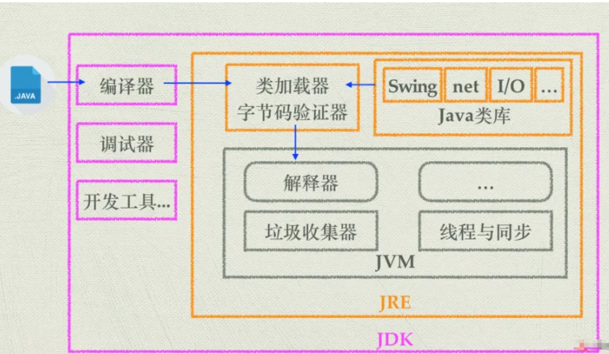
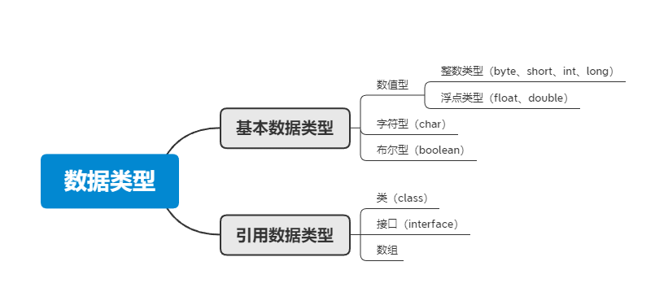
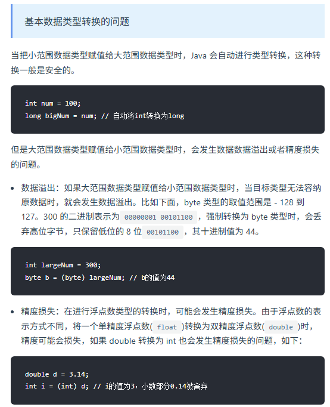
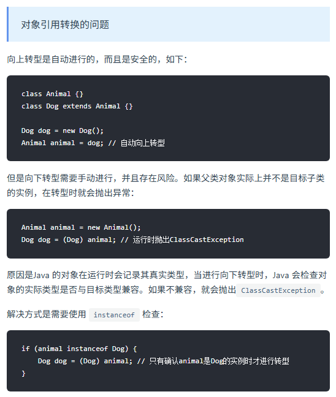
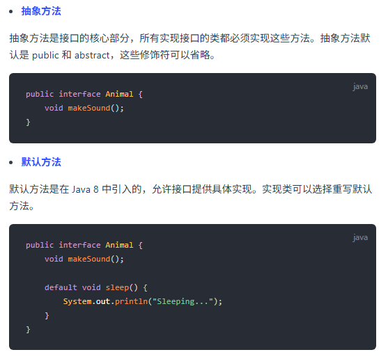
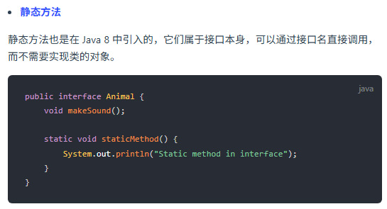

### 概念

#### Java 的优势和劣势是什么？
首先，Java的优势，我记得跨平台应该是一个大点，因为JVM的存在，一次编写到处运行。然后面向对象，这个可能也是优势，不过现在很多语言都支持面向对象，但是Java的设计从一开始就是OOP的。还有强大的生态系统，比如Spring框架，Hibernate，各种库和工具，社区支持大，企业应用广泛。另外，内存管理方面，自动垃圾回收机制，减少了内存泄漏的问题，对开发者友好。还有多线程支持，内置的线程机制，方便并发编程。安全性方面，Java有安全模型，比如沙箱机制，适合网络环境。还有稳定性，企业级应用长期使用，版本更新也比较注重向后兼容。

劣势的话，性能可能是一个，虽然JVM优化了很多，但相比C++或者Rust这种原生编译语言，还是有一定开销。特别是启动时间，比如微服务场景下，可能不如Go之类的快。语法繁琐，比如样板代码多，之前没有lambda的时候更麻烦，现在有了但比起Python还是不够简洁。内存消耗，JVM本身占内存，对于资源有限的环境可能不太友好。还有面向对象过于严格，有时候写简单程序反而麻烦，虽然Java8引入了函数式编程，但不如其他语言自然。还有开发效率，相比动态语言如Python，Java需要更多代码，编译过程也可能拖慢开发节奏。

#### jdk,jre,jvm



- JVM是Java虚拟机，是Java程序运行的环境。它负责将Java字节码（由Java编译器生成）解释或编译成机器码，并执行程序。JVM提供了内存管理、垃圾回收、安全性等功能，使得Java程序具备跨平台性。
- JDK是Java开发工具包，是开发Java程序所需的工具集合。它包含了JVM、编译器（javac）、调试器（jdb）等开发工具，以及一系列的类库（如Java标准库和开发工具库）。JDK提供了开发、编译、调试和运行Java程序所需的全部工具和环境。
- JRE是Java运行时环境，是Java程序运行所需的最小环境。它包含了JVM和一组Java类库，用于支持Java程序的执行。JRE不包含开发工具，只提供Java程序运行所需的运行环境。

#### 编译型语言和解释型语言的区别？
编译型语言：在程序执行之前，整个源代码会被编译成机器码或者字节码，生成可执行文件。执行时直接运行编译后的代码，速度快，但跨平台性较差。

解释型语言：在程序执行时，逐行解释执行源代码，不生成独立的可执行文件。通常由解释器动态解释并执行代码，跨平台性好，但执行速度相对较慢。

典型的编译型语言如C、C++，典型的解释型语言如Python、JavaScript。

### 数据类型

#### 八种基本的数据类型

Java支持数据类型分为两类： 基本数据类型和引用数据类型。

基本数据类型共有8种，可以分为三类：

- 数值型：整数类型（byte、short、int、long）和浮点类型（float、double）
- 字符型：char
- 布尔型：boolean



> Java八种基本数据类型的字节数：1字节(byte、boolean)、 2字节(short、char)、4字节(int、float)、8字节(long、double)
> 浮点数的默认类型为double（如果需要声明一个常量为float型，则必须要在末尾加上f或F）
> 整数的默认类型为int（声明Long型在末尾加上l或者L）
> 八种基本数据类型的包装类：除了char的是Character、int类型的是Integer，其他都是首字母大写
> char类型是无符号的，不能为负，所以是0开始的

#### 数据类型转换方式你知道哪些？

- 自动类型转换（隐式转换）：当目标类型的范围大于源类型时，Java会自动将源类型转换为目标类型，不需要显式的类型转换。例如，将int转换为long、将float转换为double等。
- 强制类型转换（显式转换）：当目标类型的范围小于源类型时，需要使用强制类型转换将源类型转换为目标类型。这可能导致数据丢失或溢出。例如，将long转换为int、将double转换为int等。语法为：目标类型 变量名 = (目标类型) 源类型。
- 字符串转换：Java提供了将字符串表示的数据转换为其他类型数据的方法。例如，将字符串转换为整型int，可以使用Integer.parseInt()方法；将字符串转换为浮点型double，可以使用Double.parseDouble()方法等。
- 数值之间的转换：Java提供了一些数值类型之间的转换方法，如将整型转换为字符型、将字符型转换为整型等。这些转换方式可以通过类型的包装类来实现，例如Character类、Integer类等提供了相应的转换方法。

#### 类型互转会出现什么问题吗？





#### 为什么用bigDecimal 不用double ？

double会出现精度丢失的问题，double执行的是二进制浮点运算，二进制有些情况下不能准确的表示一个小数，就像十进制不能准确的表示1/3(1/3=0.3333...)，也就是说二进制表示小数的时候只能够表示能够用1/(2^n) 的和的任意组合，但是0.1不能够精确表示，因为它不能够表示成为1/(2^n)的和的形式。

```java
System.out.println(0.05 + 0.01);
System.out.println(1.0 - 0.42);
System.out.println(4.015 * 100);
System.out.println(123.3 / 100);

输出：
0.060000000000000005
0.5800000000000001
401.49999999999994
1.2329999999999999
```

可以看到在Java中进行浮点数运算的时候，会出现丢失精度的问题。那么我们如果在进行商品价格计算的时候，就会出现问题。很有可能造成我们手中有0.06元，却无法购买一个0.05元和一个0.01元的商品。因为如上所示，他们两个的总和为0.060000000000000005。这无疑是一个很严重的问题，尤其是当电商网站的并发量上去的时候，出现的问题将是巨大的。可能会导致无法下单，或者对账出现问题。

而 Decimal 是精确计算 , 所以一般牵扯到金钱的计算 , 都使用 Decimal。

```java
import java.math.BigDecimal;

public class BigDecimalExample {
    public static void main(String[] args) {
        BigDecimal num1 = new BigDecimal("0.1");
        BigDecimal num2 = new BigDecimal("0.2");

        BigDecimal sum = num1.add(num2);
        BigDecimal product = num1.multiply(num2);

        System.out.println("Sum: " + sum);
        System.out.println("Product: " + product);
    }
}

//输出
Sum: 0.3
Product: 0.02
```

这样的使用BigDecimal可以确保精确的十进制数值计算，避免了使用double可能出现的舍入误差。需要注意的是，在创建BigDecimal对象时，应该使用字符串作为参数，而不是直接使用浮点数值，以避免浮点数精度丢失。

### 面向对象

#### Java抽象类和接口的区别是什么？
两者的特点：

- 抽象类用于描述类的共同特性和行为，可以有成员变量、构造方法和具体方法。适用于有明显继承关系的场景。
- 接口用于定义行为规范，可以多实现，只能有常量和抽象方法（Java 8 以后可以有默认方法和静态方法）。适用于定义类的能力或功能。

两者的区别：

- 实现方式：实现接口的关键字为implements，继承抽象类的关键字为extends。一个类可以实现多个接口，但一个类只能继承一个抽象类。所以，使用接口可以间接地实现多重继承。
- 方法方式：接口只有定义，不能有方法的实现，java 1.8中可以定义default方法体，而抽象类可以有定义与实现，方法可在抽象类中实现。
- 访问修饰符：接口成员变量默认为public static final，必须赋初值，不能被修改；其所有的成员方法都是public、abstract的。抽象类中成员变量默认default，可在子类中被重新定义，也可被重新赋值；抽象方法被abstract修饰，不能被private、static、synchronized和native等修饰，必须以分号结尾，不带花括号。
- 变量：抽象类可以包含实例变量和静态变量，而接口只能包含常量（即静态常量）。

**抽象类能加final修饰吗**
不能，Java中的抽象类是用来被继承的，而final修饰符用于禁止类被继承或方法被重写，因此，抽象类和final修饰符是互斥的，不能同时使用。

#### 重载与重写有什么区别？
重载（Overloading）指的是在同一个类中，可以有多个同名方法，它们具有不同的参数列表（参数类型、参数个数或参数顺序不同），编译器根据调用时的参数类型来决定调用哪个方法。
重写（Overriding）指的是子类可以重新定义父类中的方法，方法名、参数列表和返回类型必须与父类中的方法一致，通过@override注解来明确表示这是对父类方法的重写。
重载是指在同一个类中定义多个同名方法，而重写是指子类重新定义父类中的方法。

#### 接口里面可以定义哪些方法？






#### 抽象类可以被实例化吗？

在Java中，抽象类本身不能被实例化。

这意味着不能使用new关键字直接创建一个抽象类的对象。抽象类的存在主要是为了被继承，它通常包含一个或多个抽象方法（由abstract关键字修饰且无方法体的方法），这些方法需要在子类中被实现。

抽象类可以有构造器，这些构造器在子类实例化时会被调用，以便进行必要的初始化工作。然而，这个过程并不是直接实例化抽象类，而是创建了子类的实例，间接地使用了抽象类的构造器。

```java
public abstract class AbstractClass {
    public AbstractClass() {
        // 构造器代码
    }
    
    public abstract void abstractMethod();
}

public class ConcreteClass extends AbstractClass {
    public ConcreteClass() {
        super(); // 调用抽象类的构造器
    }
    
    @Override
    public void abstractMethod() {
        // 实现抽象方法
    }
}

// 下面的代码可以运行
ConcreteClass obj = new ConcreteClass();
```

简而言之，抽象类不能直接实例化，但通过继承抽象类并实现所有抽象方法的子类是可以被实例化的。

#### 解释Java中的静态变量和静态方法

在Java中，静态变量和静态方法是与类本身关联的，而不是与类的实例（对象）关联。它们在内存中只存在一份，可以被类的所有实例共享。

**静态变量**（也称为类变量）是在类中使用static关键字声明的变量。它们属于类而不是任何具体的对象。主要的特点：

- 共享性：所有该类的实例共享同一个静态变量。如果一个实例修改了静态变量的值，其他实例也会看到这个更改。
- 初始化：静态变量在类被加载时初始化，只会对其进行一次分配内存。
- 访问方式：静态变量可以直接通过类名访问，也可以通过实例访问，但推荐使用类名。

```java
public class MyClass {
    static int staticVar = 0; // 静态变量

    public MyClass() {
        staticVar++; // 每创建一个对象，静态变量自增
    }
    
    public static void printStaticVar() {
        System.out.println("Static Var: " + staticVar);
    }
}

// 使用示例
MyClass obj1 = new MyClass();
MyClass obj2 = new MyClass();
MyClass.printStaticVar(); // 输出 Static Var: 2
```

**静态方法**是在类中使用static关键字声明的方法。类似于静态变量，静态方法也属于类，而不是任何具体的对象。主要的特点：

- 无实例依赖：静态方法可以在没有创建类实例的情况下调用。对于静态方法来说，不能直接访问非静态的成员变量或方法，因为静态方法没有上下文的实例。
- 访问静态成员：静态方法可以直接调用其他静态变量和静态方法，但不能直接访问非静态成员。
- 多态性：静态方法不支持重写（Override），但可以被隐藏（Hide）。

```java
public class MyClass {
    static int count = 0;

    // 静态方法
    public static void incrementCount() {
        count++;
    }

    public static void displayCount() {
        System.out.println("Count: " + count);
    }
}

// 使用示例
MyClass.incrementCount(); // 调用静态方法
MyClass.displayCount();   // 输出 Count: 1
```

静态变量：常用于需要在所有对象间共享的数据，如计数器、常量等。
静态方法：常用于助手方法（utility methods）、获取类级别的信息或者是没有依赖于实例的数据处理。


